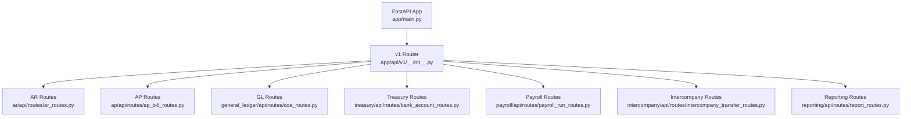
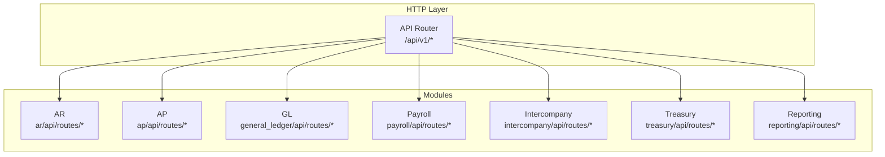
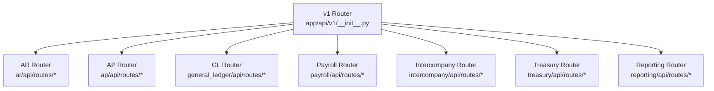
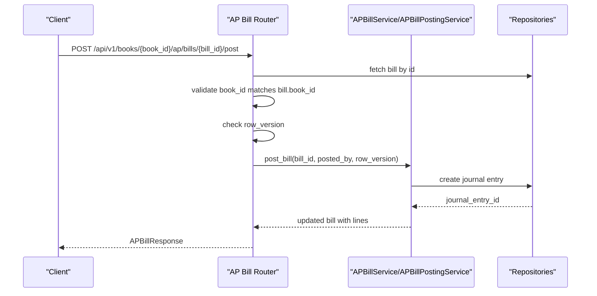
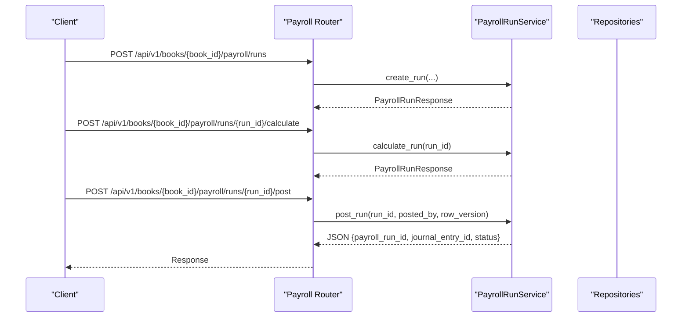

# API Reference

<cite>
**Referenced Files in This Document**
- [app/main.py](file://app/main.py)
- [app/api/v1/__init__.py](file://app/api/v1/__init__.py)
- [app/modules/ar/api/routes/ar_routes.py](file://app/modules/ar/api/routes/ar_routes.py)
- [app/modules/ap/api/routes/ap_bill_routes.py](file://app/modules/ap/api/routes/ap_bill_routes.py)
- [app/modules/general_ledger/api/routes/coa_routes.py](file://app/modules/general_ledger/api/routes/coa_routes.py)
- [app/modules/treasury/api/routes/bank_account_routes.py](file://app/modules/treasury/api/routes/bank_account_routes.py)
- [app/modules/payroll/api/routes/payroll_run_routes.py](file://app/modules/payroll/api/routes/payroll_run_routes.py)
- [app/modules/intercompany/api/routes/intercompany_transfer_routes.py](file://app/modules/intercompany/api/routes/intercompany_transfer_routes.py)
- [app/modules/reporting/api/routes/report_routes.py](file://app/modules/reporting/api/routes/report_routes.py)
- [app/modules/ar/schemas/ar_sync_schemas.py](file://app/modules/ar/schemas/ar_sync_schemas.py)
- [app/modules/ap/schemas/ap_bill_schemas.py](file://app/modules/ap/schemas/ap_bill_schemas.py)
- [app/modules/general_ledger/schemas/coa_schemas.py](file://app/modules/general_ledger/schemas/coa_schemas.py)
- [app/modules/treasury/schemas/bank_account_schemas.py](file://app/modules/treasury/schemas/bank_account_schemas.py)
- [app/modules/payroll/schemas/payroll_run_schemas.py](file://app/modules/payroll/schemas/payroll_run_schemas.py)
- [app/modules/intercompany/schemas/intercompany_schemas.py](file://app/modules/intercompany/schemas/intercompany_schemas.py)
- [app/modules/reporting/schemas/report_schemas.py](file://app/modules/reporting/schemas/report_schemas.py)
</cite>

## Table of Contents
1. Introduction
2. Project Structure
3. Core Components
4. Architecture Overview
5. Detailed Component Analysis
6. Dependency Analysis
7. Performance Considerations
8. Troubleshooting Guide
9. Conclusion
10. Appendices

## Introduction
This document provides a comprehensive API reference for the TrueVow Financial Management platform. It covers all HTTP endpoints organized by functional modules: AR (Accounts Receivable), AP (Accounts Payable), General Ledger (GL), Payroll, Treasury, Intercompany, and Reporting. For each endpoint, you will find method, URL pattern, authentication requirements, request/response schemas, parameters, and example requests/responses. It also documents API versioning, idempotency, optimistic locking via row versioning, and security considerations.

## Project Structure
The API is served via a FastAPI application with a single versioned router mounted under /api/v1. Module-specific routers are included into the v1 router, grouping endpoints by domain.

**Diagram sources**
- [app/main.py](file://app/main.py#L9-L30)
- [app/api/v1/__init__.py](file://app/api/v1/__init__.py#L34-L72)

**Section sources**
- [app/main.py](file://app/main.py#L9-L30)
- [app/api/v1/__init__.py](file://app/api/v1/__init__.py#L34-L72)

## Core Components
- API Versioning: The application exposes a versioned API under /api/v1. The FastAPI app defines title, version, and docs/redoc URLs.
- Authentication and Authorization: Many endpoints depend on a current user context via a dependency that extracts user identity and roles from the request token. Some endpoints enforce role-based restrictions (e.g., reversal of payroll runs requires a specific role).
- Idempotency: Several endpoints support idempotent operations using an idempotency key and endpoint keys to prevent duplicate postings.
- Optimistic Locking: Endpoints that modify state require a row_version parameter to detect concurrent modifications.
- CORS: The application enables permissive CORS for development; configure origins appropriately for production.

**Section sources**
- [app/main.py](file://app/main.py#L9-L30)
- [app/modules/payroll/api/routes/payroll_run_routes.py](file://app/modules/payroll/api/routes/payroll_run_routes.py#L224-L229)
- [app/modules/ap/api/routes/ap_bill_routes.py](file://app/modules/ap/api/routes/ap_bill_routes.py#L214-L216)
- [app/modules/payroll/api/routes/payroll_run_routes.py](file://app/modules/payroll/api/routes/payroll_run_routes.py#L184-L193)

## Architecture Overview
The API follows a modular FastAPI design. Each functional area registers its own router(s) under the v1 namespace. Endpoints commonly:
- Accept a book_id or entity_id in the path to scope operations to a legal entity and accounting book.
- Use Pydantic models for request validation and response serialization.
- Invoke service-layer functions to perform business logic and repository interactions.

**Diagram sources**
- [app/api/v1/__init__.py](file://app/api/v1/__init__.py#L34-L72)

## Detailed Component Analysis

### AR (Accounts Receivable)
- Base Path: /api/v1/books/{book_id}/ar
- Tags: Accounts Receivable

Endpoints
- POST /invoices/{invoice_id}/post
  - Description: Post an invoice to the ACCRUAL book.
  - Authentication: Requires current user context.
  - Idempotency: Supported via idempotency key and endpoint key.
  - Request Body: None (uses posted_by in path-dependent context).
  - Response: JSON with invoice_id, journal_entry_id, and status.
  - Errors: 404 Not Found (invoice/book mismatch), 400 Bad Request (validation).
  - Example Request: POST /api/v1/books/{book_id}/ar/invoices/{invoice_id}/post with posted_by in request body.
  - Example Response: {"invoice_id":"<uuid>","journal_entry_id":"<uuid>","status":"posted"}

- GET /invoices
  - Description: List AR invoices for a book (filtered by optional customer_id and status).
  - Query Parameters: customer_id (UUID), status (enum), limit (default 100, max 1000), offset (default 0).
  - Response: Array of invoice records.
  - Errors: 404 Not Found (book not found).

- GET /customers/{customer_id}/balance
  - Description: Compute customer’s total outstanding balance.
  - Response: customer_id, customer_name, total_outstanding, currency, invoice_count.
  - Errors: 404 Not Found (customer not found).

- GET /aging
  - Description: AR aging report as of a given date.
  - Query Parameters: book_id (UUID), as_of_date (date).
  - Response: as_of_date and aging buckets with counts and totals.

Notes
- The invoice listing endpoint currently filters by customer_id but comments indicate entity-level filtering is intended.

**Section sources**
- [app/modules/ar/api/routes/ar_routes.py](file://app/modules/ar/api/routes/ar_routes.py#L16-L178)

### AP (Accounts Payable)
- Base Path: /api/v1/books/{book_id}/ap/bills
- Tags: AP Bills

Endpoints
- POST / (Create Bill)
  - Description: Create a bill with lines; returns bill with populated lines.
  - Authentication: Requires current user context.
  - Request Body: APBillCreate (lines supported).
  - Response: APBillResponse (includes lines).
  - Errors: 404 Not Found, 400 Validation Error.

- GET / (List Bills)
  - Description: List bills for a book (filter by vendor_id and status).
  - Query Parameters: vendor_id (UUID), status (enum).
  - Response: Array of APBillResponse.

- GET /{bill_id} (Get Bill)
  - Description: Retrieve bill by ID and load associated lines.
  - Response: APBillResponse with lines.
  - Errors: 404 Not Found.

- POST /{bill_id}/submit-approval
  - Description: Submit bill for approval.
  - Request Body: APBillSubmitApprovalRequest (reason, row_version).
  - Response: APBillResponse.
  - Errors: 400 Approval Error, 404 Not Found.

- POST /{bill_id}/approve
  - Description: Approve bill (with optional override reason).
  - Request Body: APBillApproveRequest (reason, override_reason, row_version).
  - Response: APBillResponse.
  - Errors: 400 Approval Error, 404 Not Found.

- POST /{bill_id}/reject
  - Description: Reject bill.
  - Request Body: APBillRejectRequest (reason, row_version).
  - Response: APBillResponse.
  - Errors: 400 Approval Error, 404 Not Found.

- POST /{bill_id}/post
  - Description: Post bill to journal.
  - Authentication: Requires current user context.
  - Idempotency: Supported via idempotency key and endpoint key.
  - Request Body: APBillPostRequest (reason, idempotency_key, row_version).
  - Response: APBillResponse (updated with lines).
  - Errors: 404 Not Found, 400 Validation Error.

Request/Response Schemas
- APBillCreate, APBillLineCreate, APBillSubmitApprovalRequest, APBillApproveRequest, APBillRejectRequest, APBillPostRequest, APBillResponse, APBillLineResponse.

**Section sources**
- [app/modules/ap/api/routes/ap_bill_routes.py](file://app/modules/ap/api/routes/ap_bill_routes.py#L28-L262)
- [app/modules/ap/schemas/ap_bill_schemas.py](file://app/modules/ap/schemas/ap_bill_schemas.py#L10-L114)

### General Ledger (GL)
- Base Path: /api/v1/books/{book_id}/accounts
- Tags: Chart of Accounts

Endpoints
- POST / (Create Account)
  - Description: Create a GL account scoped to a book.
  - Request Body: GLAccountCreate.
  - Response: GLAccountResponse.
  - Errors: 404 Not Found, 400 Validation Error.

- GET / (List Accounts)
  - Description: List accounts for a book (active_only filter).
  - Query Parameters: active_only (bool, default true).
  - Response: Array of GLAccountResponse.

- GET /{account_id} (Get Account)
  - Description: Retrieve account by ID.
  - Response: GLAccountResponse.
  - Errors: 404 Not Found.

- PATCH /{account_id} (Update Account)
  - Description: Update account metadata.
  - Request Body: GLAccountUpdate.
  - Response: GLAccountResponse.
  - Errors: 404 Not Found.

- POST /mappings (Create/Update Mapping)
  - Description: Create or update an account mapping for a legal entity and book.
  - Request Body: GLAccountMappingCreate.
  - Response: GLAccountMappingResponse.
  - Errors: 404 Not Found, 400 Validation Error.

- GET /mappings/{map_key} (Get Mapping)
  - Description: Retrieve mapping by map_key.
  - Query Parameters: book_id (UUID), legal_entity_id (UUID).
  - Response: GLAccountMappingResponse.
  - Errors: 404 Not Found.

Request/Response Schemas
- GLAccountCreate, GLAccountUpdate, GLAccountResponse, GLAccountMappingCreate, GLAccountMappingResponse.

**Section sources**
- [app/modules/general_ledger/api/routes/coa_routes.py](file://app/modules/general_ledger/api/routes/coa_routes.py#L17-L123)
- [app/modules/general_ledger/schemas/coa_schemas.py](file://app/modules/general_ledger/schemas/coa_schemas.py#L8-L62)

### Treasury
- Base Path: /api/v1/bank-accounts
- Tags: Bank Accounts

Endpoints
- POST / (Create Bank Account)
  - Description: Create a bank account for a legal entity.
  - Request Body: BankAccountCreate.
  - Response: BankAccountResponse.
  - Errors: 404 Not Found, 400 Validation Error.

- GET / (List Bank Accounts)
  - Description: List bank accounts for an entity (active_only filter).
  - Query Parameters: entity_id (UUID), active_only (bool, default true).
  - Response: Array of BankAccountResponse.

- GET /{account_id} (Get Bank Account)
  - Description: Retrieve bank account by ID.
  - Response: BankAccountResponse.
  - Errors: 404 Not Found.

- PATCH /{account_id} (Update Bank Account)
  - Description: Update bank account metadata.
  - Request Body: BankAccountUpdate.
  - Response: BankAccountResponse.
  - Errors: 404 Not Found.

Request/Response Schemas
- BankAccountCreate, BankAccountUpdate, BankAccountResponse.

**Section sources**
- [app/modules/treasury/api/routes/bank_account_routes.py](file://app/modules/treasury/api/routes/bank_account_routes.py#L15-L88)
- [app/modules/treasury/schemas/bank_account_schemas.py](file://app/modules/treasury/schemas/bank_account_schemas.py#L7-L46)

### Payroll
- Base Path: /api/v1/books/{book_id}/payroll
- Tags: Payroll Runs

Endpoints
- POST /runs (Create Payroll Run)
  - Description: Create a payroll run.
  - Request Body: PayrollRunCreate.
  - Response: PayrollRunResponse.
  - Errors: 404 Not Found, 400 Validation Error.

- POST /runs/{run_id}/calculate (Calculate Payroll Run)
  - Description: Calculate run totals.
  - Response: PayrollRunResponse.
  - Errors: 404 Not Found, 400 Validation Error.

- POST /runs/{run_id}/submit-approval
  - Description: Submit run for approval.
  - Request Body: PayrollRunSubmitApprovalRequest (reason, row_version).
  - Response: PayrollRunResponse.
  - Errors: 400 Approval Error, 404 Not Found.

- POST /runs/{run_id}/approve
  - Description: Approve run (with optional override reason).
  - Request Body: PayrollRunApproveRequest (reason, override_reason, row_version).
  - Response: PayrollRunResponse.
  - Errors: 400 Approval Error, 404 Not Found.

- POST /runs/{run_id}/reject
  - Description: Reject run.
  - Request Body: PayrollRunRejectRequest (reason, row_version).
  - Response: PayrollRunResponse.
  - Errors: 400 Approval Error, 404 Not Found.

- POST /runs/{run_id}/post
  - Description: Post payroll run to ACCRUAL book.
  - Authentication: Requires current user context.
  - Idempotency: Supported via idempotency key and endpoint key.
  - Request Body: PayrollRunPostRequest (reason, idempotency_key, row_version).
  - Response: JSON with payroll_run_id, journal_entry_id, and status.
  - Errors: 404 Not Found, 400 Validation Error.

- POST /runs/{run_id}/reverse
  - Description: Reverse a posted payroll run (FINANCE_ADMIN only).
  - Authentication: Requires current user context and FINANCE_ADMIN role.
  - Idempotency: Supported via idempotency key and endpoint key.
  - Request Body: PayrollRunReverseRequest (reason, reversal_date).
  - Response: PayrollRunResponse.
  - Errors: 404 Not Found, 400 Validation Error, 403 Forbidden (role check).

- GET /runs (List Payroll Runs)
  - Description: List runs for an entity (filtered by status).
  - Query Parameters: entity_id (UUID), status (enum), limit (default 100, max 1000), offset (default 0).
  - Response: Array of PayrollRunResponse.

- GET /runs/{run_id} (Get Payroll Run)
  - Description: Retrieve run by ID and load items.
  - Response: PayrollRunResponse with items.
  - Errors: 404 Not Found.

Request/Response Schemas
- PayrollRunCreate, PayrollRunSubmitApprovalRequest, PayrollRunApproveRequest, PayrollRunRejectRequest, PayrollRunPostRequest, PayrollRunReverseRequest, PayrollRunItemResponse, PayrollRunResponse.

**Section sources**
- [app/modules/payroll/api/routes/payroll_run_routes.py](file://app/modules/payroll/api/routes/payroll_run_routes.py#L25-L302)
- [app/modules/payroll/schemas/payroll_run_schemas.py](file://app/modules/payroll/schemas/payroll_run_schemas.py#L9-L102)

### Intercompany
- Base Path: /api/v1/intercompany/transfers
- Tags: Intercompany Transfers

Endpoints
- POST / (Create Intercompany Transfer)
  - Description: Create a transfer between entities.
  - Request Body: IntercompanyTransferCreate.
  - Response: IntercompanyTransferResponse.
  - Errors: 404 Not Found, 400 Validation Error.

- POST /{transfer_id}/post
  - Description: Post transfer to both entities’ books.
  - Idempotency: Supported via idempotency key and endpoint key.
  - Request Body: IntercompanyTransferPostRequest (posted_by).
  - Response: JSON with transfer_id, from_entity_je_id, to_entity_je_id, and status.
  - Errors: 404 Not Found, 400 Validation Error.

- GET / (List Intercompany Transfers)
  - Description: List transfers filtered by entity pair or single entity.
  - Query Parameters: from_entity_id (UUID), to_entity_id (UUID), entity_id (UUID), start_date (date), end_date (date), limit (default 100, max 1000), offset (default 0).
  - Response: Array of IntercompanyTransferResponse.

- GET /{transfer_id} (Get Intercompany Transfer)
  - Description: Retrieve transfer by ID.
  - Response: IntercompanyTransferResponse.
  - Errors: 404 Not Found.

- GET /balance
  - Description: Compute intercompany balance between two entities as of a date.
  - Query Parameters: from_entity_id (UUID), to_entity_id (UUID), as_of_date (date).
  - Response: JSON with from_entity_id, to_entity_id, as_of_date, and balance.

Request/Response Schemas
- IntercompanyTransferCreate, IntercompanyTransferPostRequest, IntercompanyTransferResponse.

**Section sources**
- [app/modules/intercompany/api/routes/intercompany_transfer_routes.py](file://app/modules/intercompany/api/routes/intercompany_transfer_routes.py#L18-L179)
- [app/modules/intercompany/schemas/intercompany_schemas.py](file://app/modules/intercompany/schemas/intercompany_schemas.py#L9-L46)

### Reporting
- Base Path: /api/v1/reports
- Tags: Financial Reports

Endpoints
- POST /trial-balance
  - Description: Generate Trial Balance report.
  - Request Body: TrialBalanceRequest (book_id, period_id, as_of_date, include_zero_balance).
  - Response: Dynamic report structure (dictionary).
  - Errors: 400 Bad Request (validation), 500 Internal Server Error.

- POST /profit-loss
  - Description: Generate Profit & Loss report.
  - Request Body: ProfitLossRequest (book_id, period_start, period_end, compare_previous).
  - Response: Dynamic report structure.
  - Errors: 400 Bad Request, 500 Internal Server Error.

- POST /balance-sheet
  - Description: Generate Balance Sheet report.
  - Request Body: BalanceSheetRequest (book_id, as_of_date).
  - Response: Dynamic report structure.
  - Errors: 400 Bad Request, 500 Internal Server Error.

- POST /cash-position
  - Description: Generate Cash Position report.
  - Request Body: CashPositionRequest (entity_id, as_of_date, currency).
  - Response: Dynamic report structure.
  - Errors: 400 Bad Request, 500 Internal Server Error.

- POST /ar-aging
  - Description: Generate AR Aging report.
  - Request Body: ARAgingRequest (entity_id, as_of_date, aging_buckets).
  - Response: Dynamic report structure.
  - Errors: 400 Bad Request, 500 Internal Server Error.

- POST /gl-detail
  - Description: Generate GL Detail report.
  - Request Body: GLDetailRequest (book_id, account_id, account_code, period_start, period_end, period_id, include_dimensions).
  - Response: Dynamic report structure.
  - Errors: 400 Bad Request, 500 Internal Server Error.

Convenience GET Endpoints
- GET /trial-balance
  - Query Parameters: book_id (required), period_id, as_of_date, include_zero_balance.
- GET /profit-loss
  - Query Parameters: book_id (required), period_start (required), period_end (required), compare_previous.
- GET /balance-sheet
  - Query Parameters: book_id (required), as_of_date (required).

Request Schemas
- TrialBalanceRequest, ProfitLossRequest, BalanceSheetRequest, CashPositionRequest, ARAgingRequest, GLDetailRequest.

**Section sources**
- [app/modules/reporting/api/routes/report_routes.py](file://app/modules/reporting/api/routes/report_routes.py#L22-L199)
- [app/modules/reporting/schemas/report_schemas.py](file://app/modules/reporting/schemas/report_schemas.py#L8-L57)

### AR Integrations (Billing Sync)
- Base Path: /api/v1/billing/sync
- Tags: AR Integrations

Endpoints
- POST /sync
  - Description: Trigger billing synchronization for an entity.
  - Request Body: BillingSyncRequest (entity_id, since_cursor, full_resync).
  - Response: BillingSyncResponse (entity_id, customers_synced, invoices_synced, payments_synced, next_cursor, sync_timestamp).

Request/Response Schemas
- BillingSyncRequest, BillingSyncResponse.

Note: The route file for billing sync is present in the AR module; the endpoint path above reflects the intended integration surface.

**Section sources**
- [app/modules/ar/schemas/ar_sync_schemas.py](file://app/modules/ar/schemas/ar_sync_schemas.py#L8-L23)

## Dependency Analysis
- Router Composition: The v1 router aggregates all module routers, ensuring a flat namespace under /api/v1.
- Cross-module Dependencies: Some endpoints reference models from other modules (e.g., AR posting checks the ACCRUAL book type via GL repositories).
- Idempotency and Row Versioning: Multiple endpoints rely on idempotency keys and row_version for safe concurrency.

**Diagram sources**
- [app/api/v1/__init__.py](file://app/api/v1/__init__.py#L34-L72)

**Section sources**
- [app/api/v1/__init__.py](file://app/api/v1/__init__.py#L34-L72)

## Performance Considerations
- Pagination: Several endpoints accept limit and offset parameters to constrain result sets (e.g., AR invoices, payroll runs, intercompany transfers).
- Filtering: Use query parameters to narrow results server-side (e.g., status, vendor_id, customer_id).
- Idempotency: Prefer idempotency keys to avoid repeated processing of the same request payload.
- Batch Operations: Consider bulk APIs where available (see Reporting module convenience GET endpoints for reduced overhead).

## Troubleshooting Guide
Common Issues and Resolutions
- 404 Not Found
  - Cause: Resource does not exist (e.g., invoice, bill, run, transfer).
  - Resolution: Verify identifiers and scoping parameters (book_id/entity_id).
- 400 Bad Request
  - Cause: Validation errors or invalid state transitions (e.g., posting with wrong row_version).
  - Resolution: Review request body against schemas and ensure proper state transitions.
- 403 Forbidden
  - Cause: Insufficient privileges (e.g., reversing payroll runs requires FINANCE_ADMIN).
  - Resolution: Ensure the caller has the required role.
- Idempotency Failures
  - Cause: Duplicate key with conflicting request body.
  - Resolution: Use a unique idempotency_key or retry with identical payload.

Security and Compliance Notes
- Authentication: Many endpoints depend on a current user context extracted from the request token.
- Authorization: Role checks are enforced for sensitive operations (e.g., reversal of payroll runs).
- CORS: Permissive configuration is enabled; configure allowed origins for production deployments.

**Section sources**
- [app/modules/payroll/api/routes/payroll_run_routes.py](file://app/modules/payroll/api/routes/payroll_run_routes.py#L224-L229)
- [app/modules/ap/api/routes/ap_bill_routes.py](file://app/modules/ap/api/routes/ap_bill_routes.py#L214-L216)
- [app/main.py](file://app/main.py#L21-L27)

## Conclusion
This API reference consolidates the TrueVow Financial Management endpoints across AR, AP, GL, Payroll, Treasury, Intercompany, and Reporting. It emphasizes versioning under /api/v1, authentication and authorization patterns, idempotency, optimistic locking, and robust error handling. Use the provided schemas and examples to integrate clients safely and efficiently.

## Appendices

### API Versioning
- Base URL: /api/v1
- Application version is exposed via the FastAPI app configuration.

**Section sources**
- [app/main.py](file://app/main.py#L9-L15)

### Authentication and Authorization
- Current user extraction: Many endpoints depend on a current user context via a dependency that reads user_id and roles from the request token.
- Role enforcement: Some endpoints restrict operations to specific roles (e.g., FINANCE_ADMIN for reversing payroll runs).

**Section sources**
- [app/modules/payroll/api/routes/payroll_run_routes.py](file://app/modules/payroll/api/routes/payroll_run_routes.py#L224-L229)

### Idempotency and Row Versioning
- Idempotency: Endpoints that post or reverse transactions accept an idempotency_key and use endpoint keys to guard against duplicates.
- Row Versioning: Endpoints that mutate state require a row_version parameter to prevent lost-update conflicts.

**Section sources**
- [app/modules/ap/api/routes/ap_bill_routes.py](file://app/modules/ap/api/routes/ap_bill_routes.py#L246-L256)
- [app/modules/payroll/api/routes/payroll_run_routes.py](file://app/modules/payroll/api/routes/payroll_run_routes.py#L184-L193)

### Example Workflows

#### Posting an AP Bill

**Diagram sources**
- [app/modules/ap/api/routes/ap_bill_routes.py](file://app/modules/ap/api/routes/ap_bill_routes.py#L196-L262)

#### Creating and Posting a Payroll Run

**Diagram sources**
- [app/modules/payroll/api/routes/payroll_run_routes.py](file://app/modules/payroll/api/routes/payroll_run_routes.py#L28-L198)

### Parameter and Schema Reference Index
- AR
  - ar_routes.py: invoice_id, posted_by, customer_id, status, limit, offset, as_of_date
  - ar_sync_schemas.py: BillingSyncRequest, BillingSyncResponse
- AP
  - ap_bill_routes.py: bill_id, row_version, reason, override_reason, idempotency_key
  - ap_bill_schemas.py: APBillCreate, APBillLineCreate, APBillSubmitApprovalRequest, APBillApproveRequest, APBillRejectRequest, APBillPostRequest, APBillResponse, APBillLineResponse
- GL
  - coa_routes.py: account_id, map_key
  - coa_schemas.py: GLAccountCreate, GLAccountUpdate, GLAccountResponse, GLAccountMappingCreate, GLAccountMappingResponse
- Treasury
  - bank_account_routes.py: account_id, entity_id
  - bank_account_schemas.py: BankAccountCreate, BankAccountUpdate, BankAccountResponse
- Payroll
  - payroll_run_routes.py: run_id, row_version, reason, override_reason, idempotency_key, reversal_date
  - payroll_run_schemas.py: PayrollRunCreate, PayrollRunSubmitApprovalRequest, PayrollRunApproveRequest, PayrollRunRejectRequest, PayrollRunPostRequest, PayrollRunReverseRequest, PayrollRunItemResponse, PayrollRunResponse
- Intercompany
  - intercompany_transfer_routes.py: transfer_id, from_entity_id, to_entity_id, entity_id, start_date, end_date, as_of_date
  - intercompany_schemas.py: IntercompanyTransferCreate, IntercompanyTransferPostRequest, IntercompanyTransferResponse
- Reporting
  - report_routes.py: GET convenience endpoints for trial-balance, profit-loss, balance-sheet
  - report_schemas.py: TrialBalanceRequest, ProfitLossRequest, BalanceSheetRequest, CashPositionRequest, ARAgingRequest, GLDetailRequest

**Section sources**
- [app/modules/ar/api/routes/ar_routes.py](file://app/modules/ar/api/routes/ar_routes.py#L77-L178)
- [app/modules/ap/api/routes/ap_bill_routes.py](file://app/modules/ap/api/routes/ap_bill_routes.py#L83-L262)
- [app/modules/general_ledger/api/routes/coa_routes.py](file://app/modules/general_ledger/api/routes/coa_routes.py#L44-L123)
- [app/modules/treasury/api/routes/bank_account_routes.py](file://app/modules/treasury/api/routes/bank_account_routes.py#L44-L88)
- [app/modules/payroll/api/routes/payroll_run_routes.py](file://app/modules/payroll/api/routes/payroll_run_routes.py#L266-L302)
- [app/modules/intercompany/api/routes/intercompany_transfer_routes.py](file://app/modules/intercompany/api/routes/intercompany_transfer_routes.py#L106-L179)
- [app/modules/reporting/api/routes/report_routes.py](file://app/modules/reporting/api/routes/report_routes.py#L150-L199)
- [app/modules/ar/schemas/ar_sync_schemas.py](file://app/modules/ar/schemas/ar_sync_schemas.py#L8-L23)
- [app/modules/ap/schemas/ap_bill_schemas.py](file://app/modules/ap/schemas/ap_bill_schemas.py#L21-L114)
- [app/modules/general_ledger/schemas/coa_schemas.py](file://app/modules/general_ledger/schemas/coa_schemas.py#L8-L62)
- [app/modules/treasury/schemas/bank_account_schemas.py](file://app/modules/treasury/schemas/bank_account_schemas.py#L7-L46)
- [app/modules/payroll/schemas/payroll_run_schemas.py](file://app/modules/payroll/schemas/payroll_run_schemas.py#L9-L102)
- [app/modules/intercompany/schemas/intercompany_schemas.py](file://app/modules/intercompany/schemas/intercompany_schemas.py#L9-L46)
- [app/modules/reporting/schemas/report_schemas.py](file://app/modules/reporting/schemas/report_schemas.py#L8-L57)