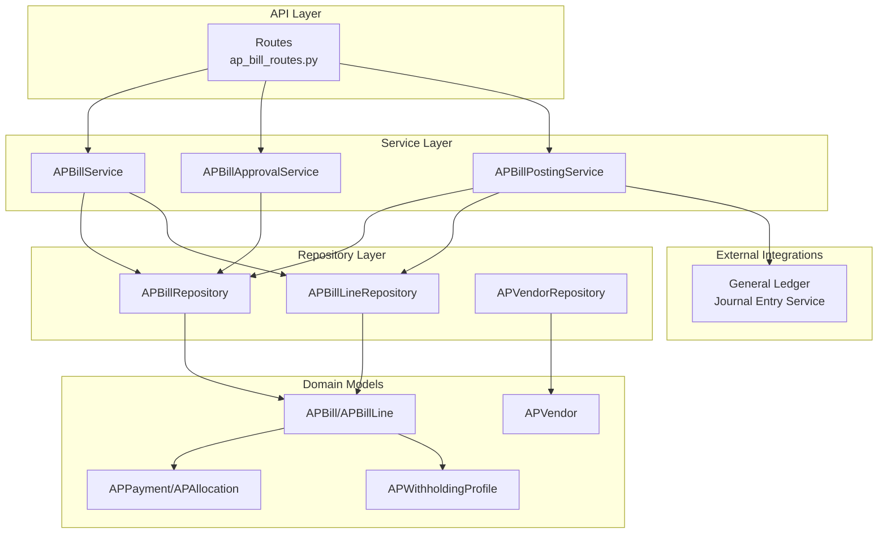
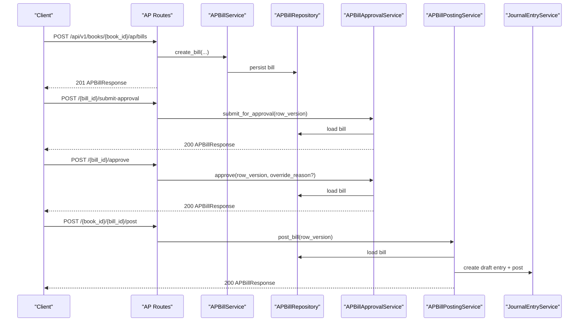
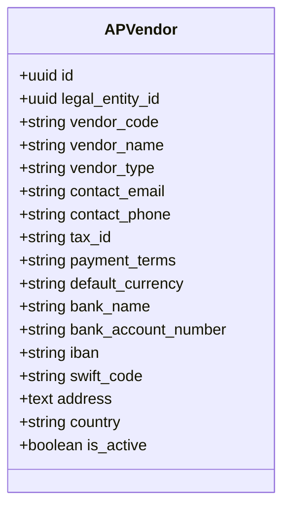
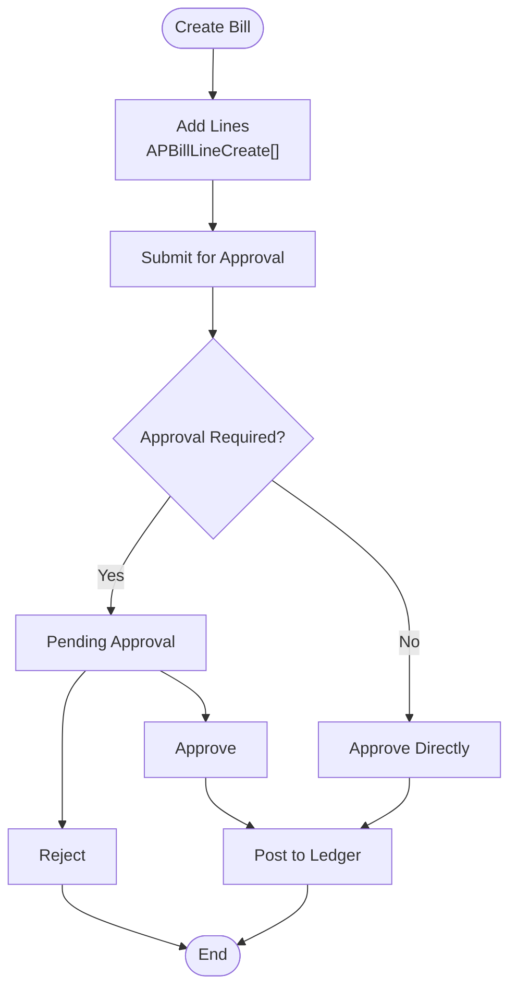
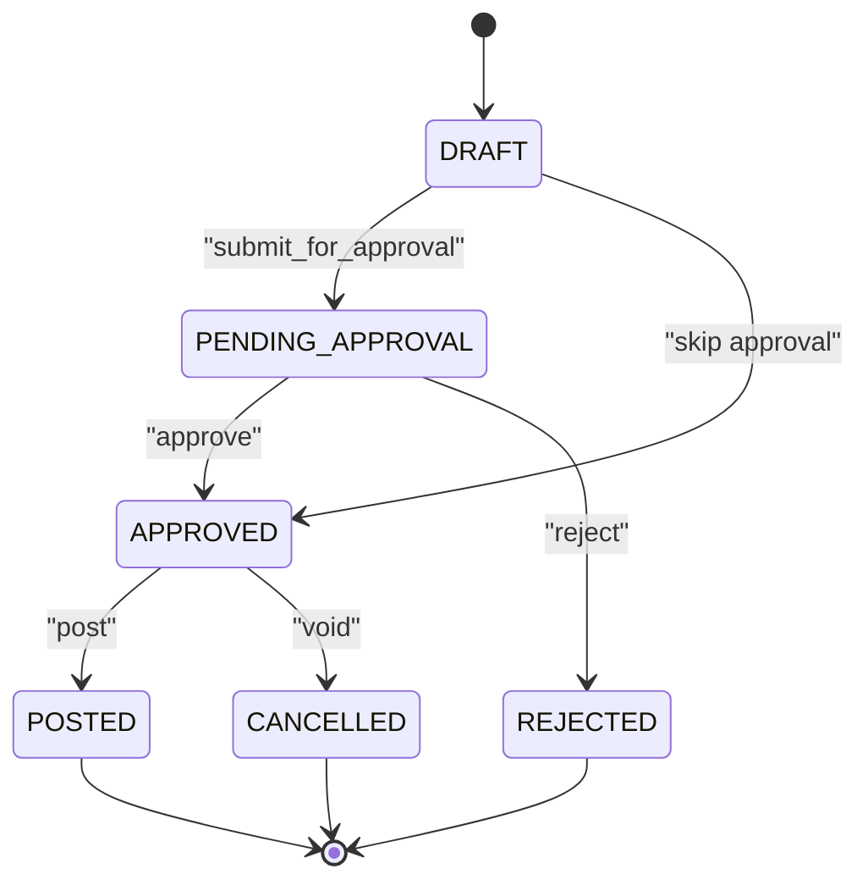
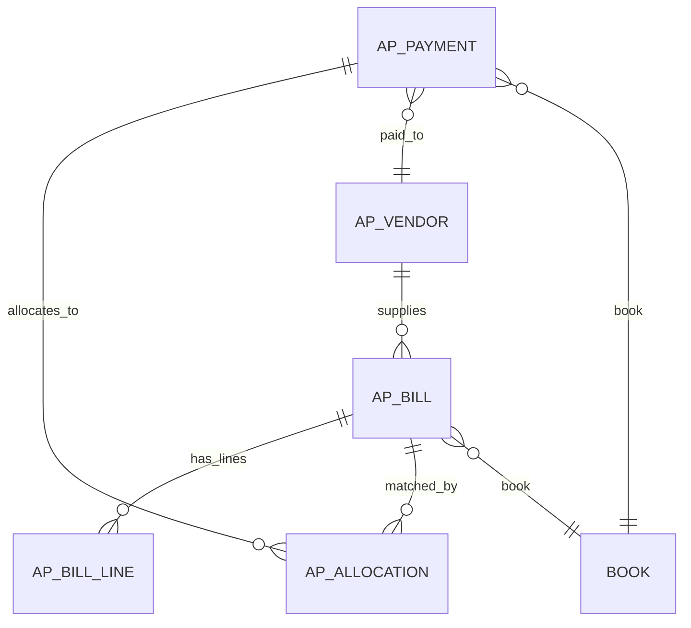
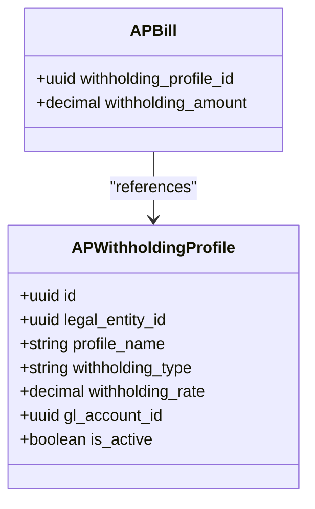
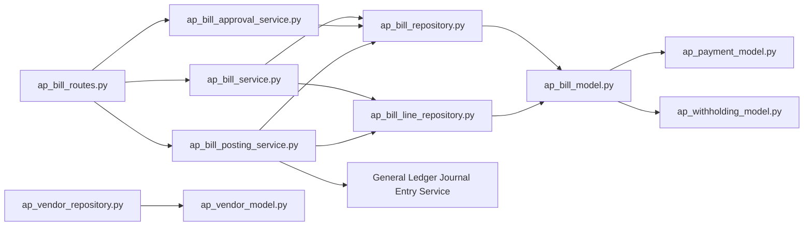

# Accounts Payable API

<cite>
**Referenced Files in This Document**
- [ap_bill_routes.py](file://app/modules/ap/api/routes/ap_bill_routes.py)
- [ap_bill_schemas.py](file://app/modules/ap/schemas/ap_bill_schemas.py)
- [ap_bill_model.py](file://app/modules/ap/models/ap_bill_model.py)
- [ap_vendor_model.py](file://app/modules/ap/models/ap_vendor_model.py)
- [ap_payment_model.py](file://app/modules/ap/models/ap_payment_model.py)
- [ap_withholding_model.py](file://app/modules/ap/models/ap_withholding_model.py)
- [ap_bill_service.py](file://app/modules/ap/services/ap_bill_service.py)
- [ap_bill_approval_service.py](file://app/modules/ap/services/ap_bill_approval_service.py)
- [ap_bill_posting_service.py](file://app/modules/ap/services/ap_bill_posting_service.py)
- [ap_bill_repository.py](file://app/modules/ap/repositories/ap_bill_repository.py)
- [ap_bill_line_repository.py](file://app/modules/ap/repositories/ap_bill_line_repository.py)
- [ap_vendor_repository.py](file://app/modules/ap/repositories/ap_vendor_repository.py)
- [main.py](file://app/main.py)
</cite>

## Table of Contents
1. [Introduction](#introduction)
2. [Project Structure](#project-structure)
3. [Core Components](#core-components)
4. [Architecture Overview](#architecture-overview)
5. [Detailed Component Analysis](#detailed-component-analysis)
6. [Dependency Analysis](#dependency-analysis)
7. [Performance Considerations](#performance-considerations)
8. [Troubleshooting Guide](#troubleshooting-guide)
9. [Conclusion](#conclusion)
10. [Appendices](#appendices)

## Introduction
This document provides comprehensive API documentation for the Accounts Payable (AP) module. It covers vendor management, bill creation and lifecycle, approval workflows, payment processing, and related features such as withholding tax profiles, expense categorization, and invoice matching. The documentation includes endpoint definitions, request/response schemas, validation rules, error handling, approval routing, budget controls, and supplier portal integration considerations.

## Project Structure
The AP module follows a layered architecture:
- API routes define HTTP endpoints under a dedicated prefix.
- Services encapsulate business logic for bill creation, approval, posting, and payment allocation.
- Repositories handle data access for bills, lines, vendors, and allocations.
- Models define the persistent entities and relationships.
- Schemas define request/response validation and serialization.

**Diagram sources**
- [ap_bill_routes.py](file://app/modules/ap/api/routes/ap_bill_routes.py#L28-L262)
- [ap_bill_service.py](file://app/modules/ap/services/ap_bill_service.py#L15-L111)
- [ap_bill_approval_service.py](file://app/modules/ap/services/ap_bill_approval_service.py#L26-L229)
- [ap_bill_posting_service.py](file://app/modules/ap/services/ap_bill_posting_service.py#L16-L127)
- [ap_bill_repository.py](file://app/modules/ap/repositories/ap_bill_repository.py#L11-L38)
- [ap_bill_line_repository.py](file://app/modules/ap/repositories/ap_bill_line_repository.py#L9-L37)
- [ap_vendor_repository.py](file://app/modules/ap/repositories/ap_vendor_repository.py#L9-L46)
- [ap_bill_model.py](file://app/modules/ap/models/ap_bill_model.py#L20-L102)
- [ap_vendor_model.py](file://app/modules/ap/models/ap_vendor_model.py#L8-L40)
- [ap_payment_model.py](file://app/modules/ap/models/ap_payment_model.py#L19-L80)
- [ap_withholding_model.py](file://app/modules/ap/models/ap_withholding_model.py#L9-L32)

**Section sources**
- [ap_bill_routes.py](file://app/modules/ap/api/routes/ap_bill_routes.py#L28-L262)
- [ap_bill_service.py](file://app/modules/ap/services/ap_bill_service.py#L15-L111)
- [ap_bill_approval_service.py](file://app/modules/ap/services/ap_bill_approval_service.py#L26-L229)
- [ap_bill_posting_service.py](file://app/modules/ap/services/ap_bill_posting_service.py#L16-L127)
- [ap_bill_repository.py](file://app/modules/ap/repositories/ap_bill_repository.py#L11-L38)
- [ap_bill_line_repository.py](file://app/modules/ap/repositories/ap_bill_line_repository.py#L9-L37)
- [ap_vendor_repository.py](file://app/modules/ap/repositories/ap_vendor_repository.py#L9-L46)
- [ap_bill_model.py](file://app/modules/ap/models/ap_bill_model.py#L20-L102)
- [ap_vendor_model.py](file://app/modules/ap/models/ap_vendor_model.py#L8-L40)
- [ap_payment_model.py](file://app/modules/ap/models/ap_payment_model.py#L19-L80)
- [ap_withholding_model.py](file://app/modules/ap/models/ap_withholding_model.py#L9-L32)

## Core Components
- AP Bill API: Endpoints for creating, listing, retrieving, submitting for approval, approving, rejecting, and posting bills.
- AP Bill Service: Handles bill creation, line addition, and retrieval.
- AP Bill Approval Service: Manages approval workflow transitions and SoD checks.
- AP Bill Posting Service: Posts bills to the General Ledger with accrual accounting.
- Repositories: Data access for bills, lines, and vendors.
- Models: Persistent entities for bills, lines, vendors, payments, allocations, and withholding profiles.
- Schemas: Pydantic models for request/response validation.

**Section sources**
- [ap_bill_routes.py](file://app/modules/ap/api/routes/ap_bill_routes.py#L31-L262)
- [ap_bill_schemas.py](file://app/modules/ap/schemas/ap_bill_schemas.py#L10-L114)
- [ap_bill_model.py](file://app/modules/ap/models/ap_bill_model.py#L10-L102)
- [ap_vendor_model.py](file://app/modules/ap/models/ap_vendor_model.py#L8-L40)
- [ap_payment_model.py](file://app/modules/ap/models/ap_payment_model.py#L10-L80)
- [ap_withholding_model.py](file://app/modules/ap/models/ap_withholding_model.py#L9-L32)
- [ap_bill_service.py](file://app/modules/ap/services/ap_bill_service.py#L15-L111)
- [ap_bill_approval_service.py](file://app/modules/ap/services/ap_bill_approval_service.py#L26-L229)
- [ap_bill_posting_service.py](file://app/modules/ap/services/ap_bill_posting_service.py#L16-L127)

## Architecture Overview
The AP API is organized around a resource-centric design:
- Endpoints are prefixed under a book-scoped namespace.
- Business operations are encapsulated in services with explicit validations.
- Approval workflows integrate with policy and SoD enforcement.
- Posting integrates with the General Ledger journal entry service.
- Idempotency and optimistic locking protect concurrent operations.

**Diagram sources**
- [ap_bill_routes.py](file://app/modules/ap/api/routes/ap_bill_routes.py#L31-L262)
- [ap_bill_service.py](file://app/modules/ap/services/ap_bill_service.py#L23-L111)
- [ap_bill_approval_service.py](file://app/modules/ap/services/ap_bill_approval_service.py#L34-L204)
- [ap_bill_posting_service.py](file://app/modules/ap/services/ap_bill_posting_service.py#L27-L112)
- [ap_bill_repository.py](file://app/modules/ap/repositories/ap_bill_repository.py#L11-L38)

## Detailed Component Analysis

### Vendor Management
- Purpose: Manage suppliers and consultants, including payment terms and banking details.
- Key fields: vendor code/name/type, contact info, tax ID, payment terms, default currency, banking info, and activity flag.
- Operations:
  - Create vendor: Persist APVendor with unique vendor code.
  - Retrieve vendor by ID/code.
  - List vendors by legal entity with optional active filter.
- Validation:
  - Unique vendor_code enforced at DB level.
  - payment_terms stored as text for flexible term definitions.
  - is_active flag to deactivate vendors without deletion.

**Diagram sources**
- [ap_vendor_model.py](file://app/modules/ap/models/ap_vendor_model.py#L8-L40)
- [ap_vendor_repository.py](file://app/modules/ap/repositories/ap_vendor_repository.py#L9-L46)

**Section sources**
- [ap_vendor_model.py](file://app/modules/ap/models/ap_vendor_model.py#L8-L40)
- [ap_vendor_repository.py](file://app/modules/ap/repositories/ap_vendor_repository.py#L15-L46)

### Bill Lifecycle and Endpoints
- Endpoint prefix: /api/v1/books/{book_id}/ap/bills
- Supported operations:
  - Create bill: POST "" with APBillCreate payload.
  - List bills: GET "" with filters vendor_id and status.
  - Get bill: GET "/{bill_id}".
  - Submit for approval: POST "/{bill_id}/submit-approval".
  - Approve: POST "/{bill_id}/approve".
  - Reject: POST "/{bill_id}/reject".
  - Post to ledger: POST "/{book_id}/{bill_id}/post".

**Diagram sources**
- [ap_bill_routes.py](file://app/modules/ap/api/routes/ap_bill_routes.py#L31-L262)
- [ap_bill_schemas.py](file://app/modules/ap/schemas/ap_bill_schemas.py#L21-L58)
- [ap_bill_model.py](file://app/modules/ap/models/ap_bill_model.py#L10-L18)

**Section sources**
- [ap_bill_routes.py](file://app/modules/ap/api/routes/ap_bill_routes.py#L31-L262)
- [ap_bill_schemas.py](file://app/modules/ap/schemas/ap_bill_schemas.py#L21-L114)
- [ap_bill_model.py](file://app/modules/ap/models/ap_bill_model.py#L10-L102)

### Request and Response Schemas
- APBillCreate: Legal entity, vendor, bill number/date/due, currency, description/reference, lines array.
- APBillLineCreate: GL account, description, quantity, unit price, line number, currency, optional tax code.
- APBillSubmitApprovalRequest: reason, row_version.
- APBillApproveRequest: reason, optional override_reason, row_version.
- APBillRejectRequest: reason (required), row_version.
- APBillPostRequest: reason, optional idempotency_key, row_version.
- APBillResponse: Includes status, amounts, workflow timestamps, row_version, journal entry linkage, and lines.

Validation highlights:
- Row version required for all state-changing operations to enforce optimistic concurrency.
- Bill must be in DRAFT to add lines; must be APPROVED to post.
- Rejection requires a reason.
- Approval bypass occurs when no approval is required per policy.

**Section sources**
- [ap_bill_schemas.py](file://app/modules/ap/schemas/ap_bill_schemas.py#L10-L114)
- [ap_bill_model.py](file://app/modules/ap/models/ap_bill_model.py#L10-L102)

### Approval Workflows
- States: DRAFT → PENDING_APPROVAL → APPROVED/REJECTED; POSTED/CANCELLED are terminal states.
- Transitions:
  - Submit for approval: DRAFT → PENDING_APPROVAL (or APPROVED if no approval required).
  - Approve: PENDING_APPROVAL → APPROVED after SoD validation.
  - Reject: PENDING_APPROVAL → REJECTED.
- Controls:
  - Policy-driven approval requirement.
  - SoD validation prevents self-approval.
  - Audit logs capture actions with reasons and override reasons.

**Diagram sources**
- [ap_bill_model.py](file://app/modules/ap/models/ap_bill_model.py#L10-L18)
- [ap_bill_approval_service.py](file://app/modules/ap/services/ap_bill_approval_service.py#L34-L204)

**Section sources**
- [ap_bill_approval_service.py](file://app/modules/ap/services/ap_bill_approval_service.py#L26-L229)
- [ap_bill_model.py](file://app/modules/ap/models/ap_bill_model.py#L10-L18)

### Payment Processing and Matching
- Payment entity: APPayment tracks payment number/date/amount/method/reference, linking to vendor and optional bank account/transaction.
- Allocation: APAllocation links payments to bills with allocated amount and currency.
- Matching: Payments allocate against outstanding bill balances; bills track paid/outstanding amounts.
- Posting: Payments are recorded via allocations and journal entries; bills are matched to payments through allocation records.

**Diagram sources**
- [ap_bill_model.py](file://app/modules/ap/models/ap_bill_model.py#L20-L102)
- [ap_payment_model.py](file://app/modules/ap/models/ap_payment_model.py#L19-L80)
- [ap_vendor_model.py](file://app/modules/ap/models/ap_vendor_model.py#L8-L40)

**Section sources**
- [ap_payment_model.py](file://app/modules/ap/models/ap_payment_model.py#L10-L80)
- [ap_bill_model.py](file://app/modules/ap/models/ap_bill_model.py#L20-L102)

### Withholding Tax Profiles
- APWithholdingProfile defines tax/VAT profiles with rate, type, and GL mapping per legal entity.
- APBill optionally references a withholding profile and accumulates withholding amount.
- Calculation: Withholding amount can be computed based on bill totals and profile rates; stored on the bill for auditability.

**Diagram sources**
- [ap_withholding_model.py](file://app/modules/ap/models/ap_withholding_model.py#L9-L32)
- [ap_bill_model.py](file://app/modules/ap/models/ap_bill_model.py#L38-L41)

**Section sources**
- [ap_withholding_model.py](file://app/modules/ap/models/ap_withholding_model.py#L9-L32)
- [ap_bill_model.py](file://app/modules/ap/models/ap_bill_model.py#L38-L41)

### Expense Categorization
- APBillLine associates each line with a GL account, enabling categorization by natural expense accounts.
- Taxes: Optional tax_code per line for future tax processing.
- Amount computation: Line amount equals quantity × unit price; bill total aggregates line amounts.

**Section sources**
- [ap_bill_model.py](file://app/modules/ap/models/ap_bill_model.py#L75-L102)
- [ap_bill_schemas.py](file://app/modules/ap/schemas/ap_bill_schemas.py#L10-L32)

### Supplier Portal Integration
- Vendor onboarding: Create vendors with payment terms and banking details.
- Invoice submission: Create bills with vendor reference and invoice number.
- Status visibility: List bills filtered by vendor and status for portal dashboards.
- Matching: Payments allocate to outstanding bills; portal can show matched/unmatched items.

**Section sources**
- [ap_vendor_model.py](file://app/modules/ap/models/ap_vendor_model.py#L8-L40)
- [ap_bill_routes.py](file://app/modules/ap/api/routes/ap_bill_routes.py#L83-L100)
- [ap_payment_model.py](file://app/modules/ap/models/ap_payment_model.py#L19-L80)

## Dependency Analysis
- Routes depend on services and schemas for request/response handling.
- Services depend on repositories for persistence and on external GL services for posting.
- Models define relationships among bills, lines, vendors, payments, allocations, and withholding profiles.
- Approval service integrates with policy and SoD validators.

**Diagram sources**
- [ap_bill_routes.py](file://app/modules/ap/api/routes/ap_bill_routes.py#L1-L27)
- [ap_bill_service.py](file://app/modules/ap/services/ap_bill_service.py#L1-L22)
- [ap_bill_approval_service.py](file://app/modules/ap/services/ap_bill_approval_service.py#L1-L33)
- [ap_bill_posting_service.py](file://app/modules/ap/services/ap_bill_posting_service.py#L1-L26)
- [ap_bill_repository.py](file://app/modules/ap/repositories/ap_bill_repository.py#L1-L16)
- [ap_bill_line_repository.py](file://app/modules/ap/repositories/ap_bill_line_repository.py#L1-L14)
- [ap_vendor_repository.py](file://app/modules/ap/repositories/ap_vendor_repository.py#L1-L14)
- [ap_bill_model.py](file://app/modules/ap/models/ap_bill_model.py#L1-L10)
- [ap_vendor_model.py](file://app/modules/ap/models/ap_vendor_model.py#L1-L5)
- [ap_payment_model.py](file://app/modules/ap/models/ap_payment_model.py#L1-L7)
- [ap_withholding_model.py](file://app/modules/ap/models/ap_withholding_model.py#L1-L6)

**Section sources**
- [ap_bill_routes.py](file://app/modules/ap/api/routes/ap_bill_routes.py#L1-L27)
- [ap_bill_service.py](file://app/modules/ap/services/ap_bill_service.py#L1-L22)
- [ap_bill_approval_service.py](file://app/modules/ap/services/ap_bill_approval_service.py#L1-L33)
- [ap_bill_posting_service.py](file://app/modules/ap/services/ap_bill_posting_service.py#L1-L26)
- [ap_bill_repository.py](file://app/modules/ap/repositories/ap_bill_repository.py#L1-L16)
- [ap_bill_line_repository.py](file://app/modules/ap/repositories/ap_bill_line_repository.py#L1-L14)
- [ap_vendor_repository.py](file://app/modules/ap/repositories/ap_vendor_repository.py#L1-L14)
- [ap_bill_model.py](file://app/modules/ap/models/ap_bill_model.py#L1-L10)
- [ap_vendor_model.py](file://app/modules/ap/models/ap_vendor_model.py#L1-L5)
- [ap_payment_model.py](file://app/modules/ap/models/ap_payment_model.py#L1-L7)
- [ap_withholding_model.py](file://app/modules/ap/models/ap_withholding_model.py#L1-L6)

## Performance Considerations
- Use pagination and filtering (vendor_id, status) for bill listing to avoid large result sets.
- Batch operations: Prefer bulk inserts for bill lines when supported by repositories.
- Indexes: Ensure DB indexes on frequently filtered columns (book_id, vendor_id, status, bill_number).
- Idempotency: Posting leverages idempotency keys to prevent duplicate postings.
- Optimistic locking: row_version prevents lost updates during approval/posting.

[No sources needed since this section provides general guidance]

## Troubleshooting Guide
Common errors and resolutions:
- Not Found: Bill/vendor not found during operations; verify identifiers and book ownership.
- Validation Errors: Adding lines to non-DRAFT bills, posting non-APPROVED bills, missing lines on bills.
- Approval Errors: Submitting non-DRAFT bills, attempting self-approval (SoD), missing rejection reason.
- Posting Errors: Account mapping not found, period locked, insufficient permissions.
- Idempotency: Duplicate posting attempts are safely ignored; ensure idempotency_key uniqueness per operation.

**Section sources**
- [ap_bill_routes.py](file://app/modules/ap/api/routes/ap_bill_routes.py#L77-L81)
- [ap_bill_approval_service.py](file://app/modules/ap/services/ap_bill_approval_service.py#L55-L59)
- [ap_bill_posting_service.py](file://app/modules/ap/services/ap_bill_posting_service.py#L42-L44)

## Conclusion
The AP API provides a robust, auditable, and extensible foundation for vendor management, bill processing, approvals, and payment matching. Its modular design supports integration with policies, SoD controls, and the General Ledger while maintaining strong validation and concurrency safeguards.

[No sources needed since this section summarizes without analyzing specific files]

## Appendices

### API Endpoints Reference
- POST /api/v1/books/{book_id}/ap/bills
  - Description: Create a new AP bill and lines.
  - Request: APBillCreate
  - Response: APBillResponse
  - Auth: Requires current user
  - Notes: Lines are added after bill creation; totals updated accordingly.

- GET /api/v1/books/{book_id}/ap/bills
  - Description: List bills with optional filters.
  - Query params: vendor_id (UUID), status (enum)
  - Response: List[APBillResponse]

- GET /api/v1/books/{book_id}/ap/bills/{bill_id}
  - Description: Retrieve bill with expanded lines.
  - Response: APBillResponse

- POST /api/v1/books/{book_id}/ap/bills/{bill_id}/submit-approval
  - Description: Submit bill for approval; may auto-approve if policy allows.
  - Request: APBillSubmitApprovalRequest
  - Response: APBillResponse

- POST /api/v1/books/{book_id}/ap/bills/{bill_id}/approve
  - Description: Approve bill; enforces SoD and row version.
  - Request: APBillApproveRequest
  - Response: APBillResponse

- POST /api/v1/books/{book_id}/ap/bills/{bill_id}/reject
  - Description: Reject bill; requires reason.
  - Request: APBillRejectRequest
  - Response: APBillResponse

- POST /api/v1/books/{book_id}/ap/bills/{book_id}/{bill_id}/post
  - Description: Post bill to ledger; idempotent via idempotency_key.
  - Request: APBillPostRequest
  - Response: APBillResponse

**Section sources**
- [ap_bill_routes.py](file://app/modules/ap/api/routes/ap_bill_routes.py#L31-L262)
- [ap_bill_schemas.py](file://app/modules/ap/schemas/ap_bill_schemas.py#L21-L58)

### Data Models Reference
- APBill
  - Fields: legal_entity_id, book_id, ap_vendor_id, bill_number, bill_date, due_date, total_amount, currency, status, paid_amount, outstanding_amount, description, reference_number, withholding fields, workflow timestamps, row_version, journal_entry_id.
  - Relationships: vendor, lines, allocations, journal_entry.

- APBillLine
  - Fields: ap_bill_id, line_number, gl_account_id, description, quantity, unit_price, line_amount, currency, tax_code.
  - Constraints: Unique(ap_bill_id, line_number).

- APVendor
  - Fields: legal_entity_id, vendor_code (unique), vendor_name, vendor_type, contact_email, contact_phone, tax_id, payment_terms, default_currency, bank details, address, country, is_active.

- APPayment and APAllocation
  - APPayment: payment_number, payment_date, payment_amount, currency, method, reference, bank account/transaction linkage, status, approvals, journal_entry_id.
  - APAllocation: ap_payment_id, ap_bill_id, allocated_amount, currency, allocation_date.

- APWithholdingProfile
  - Fields: legal_entity_id, profile_name, withholding_type, withholding_rate, gl_account_id, is_active, description.

**Section sources**
- [ap_bill_model.py](file://app/modules/ap/models/ap_bill_model.py#L20-L102)
- [ap_vendor_model.py](file://app/modules/ap/models/ap_vendor_model.py#L8-L40)
- [ap_payment_model.py](file://app/modules/ap/models/ap_payment_model.py#L19-L80)
- [ap_withholding_model.py](file://app/modules/ap/models/ap_withholding_model.py#L9-L32)

### Validation and Error Handling
- Validation Rules
  - Row version mandatory for state transitions and posting.
  - Bill must be APPROVED to post; must have at least one line.
  - Rejection requires a reason; approval bypass depends on policy.
  - Unique vendor_code enforced at DB level.

- Error Responses
  - 400: Validation errors (e.g., invalid state, missing data).
  - 404: Resource not found (bill/vendor).
  - 409: Concurrency conflict (row version mismatch).
  - 423: Locked period (posting blocked).
  - 500: Internal server errors.

**Section sources**
- [ap_bill_routes.py](file://app/modules/ap/api/routes/ap_bill_routes.py#L77-L81)
- [ap_bill_approval_service.py](file://app/modules/ap/services/ap_bill_approval_service.py#L55-L59)
- [ap_bill_posting_service.py](file://app/modules/ap/services/ap_bill_posting_service.py#L42-L44)

### Approval Routing and Budget Controls
- Approval Policy
  - Determined by ApprovalPolicyRepository for AP_BILL object type per legal entity.
  - If approval not required, bills auto-transition to APPROVED upon submission.

- SoD Controls
  - Prevents self-approval; supports override with justification for authorized roles.

- Budget Controls
  - Enforce at higher layers (not shown here); AP module focuses on state transitions and audit trails.

**Section sources**
- [ap_bill_approval_service.py](file://app/modules/ap/services/ap_bill_approval_service.py#L62-L78)
- [ap_bill_approval_service.py](file://app/modules/ap/services/ap_bill_approval_service.py#L124-L133)

### Supplier Portal Integration Notes
- Onboarding: Create vendors with payment terms and banking details.
- Invoicing: Create bills with vendor invoice number/reference.
- Dashboards: Filter bills by vendor and status; display outstanding amounts and due dates.
- Matching: Show allocations and payment history per bill.

**Section sources**
- [ap_vendor_model.py](file://app/modules/ap/models/ap_vendor_model.py#L8-L40)
- [ap_bill_routes.py](file://app/modules/ap/api/routes/ap_bill_routes.py#L83-L100)
- [ap_payment_model.py](file://app/modules/ap/models/ap_payment_model.py#L19-L80)