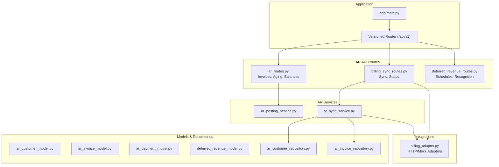
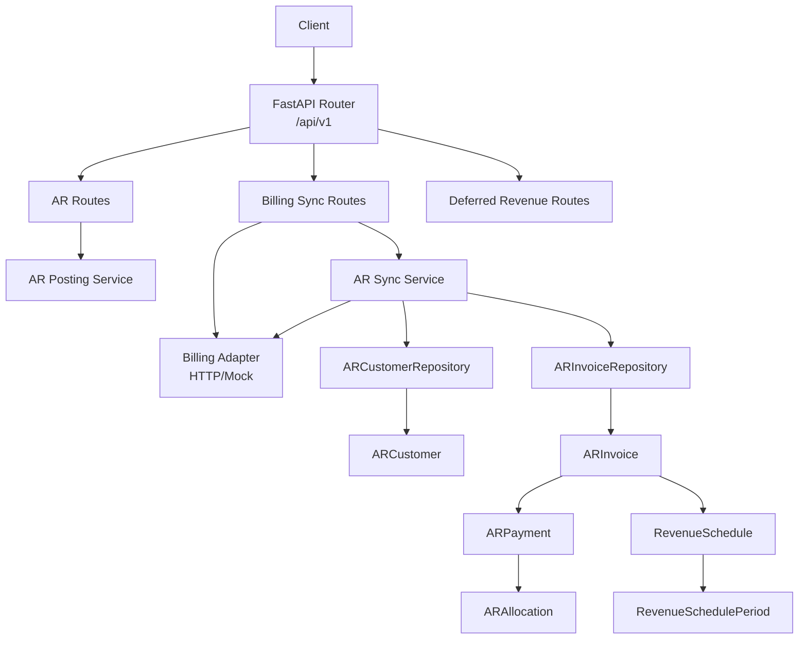
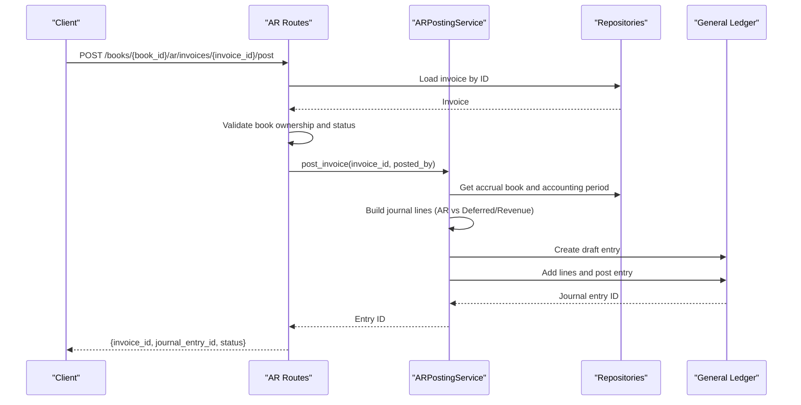
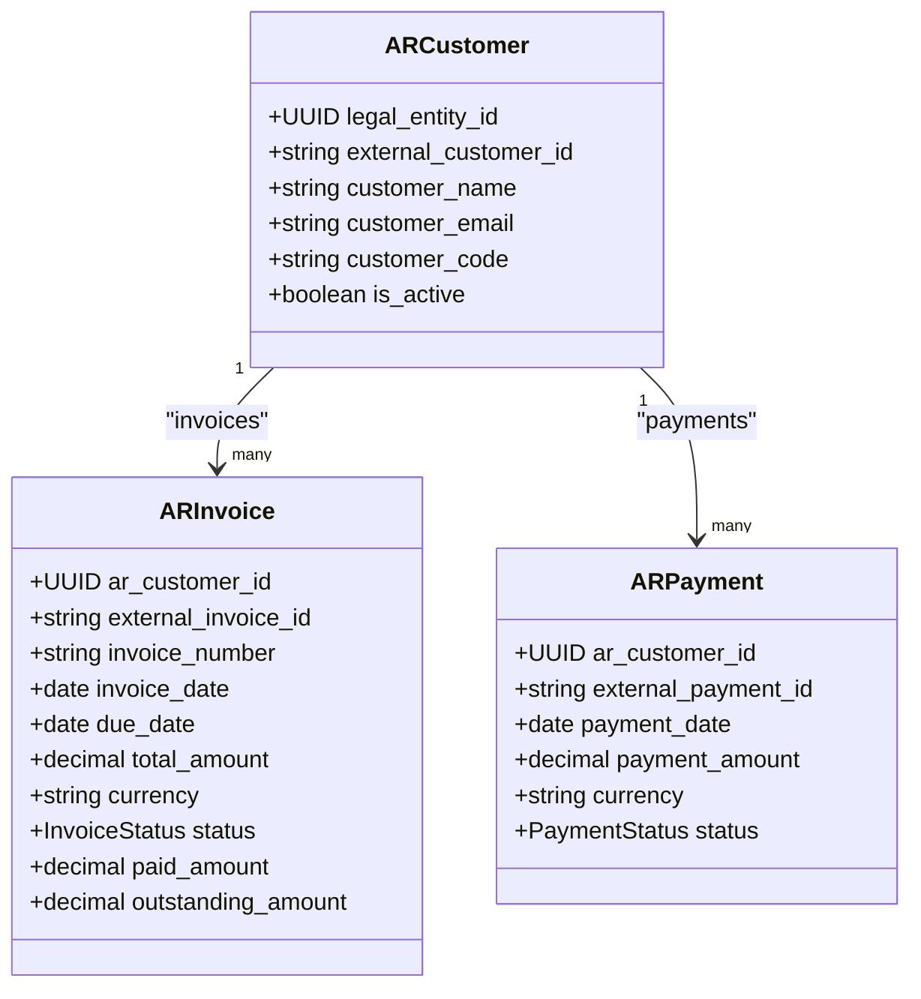
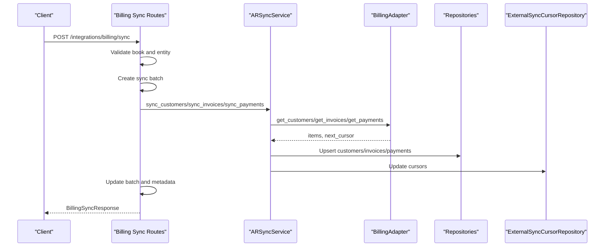
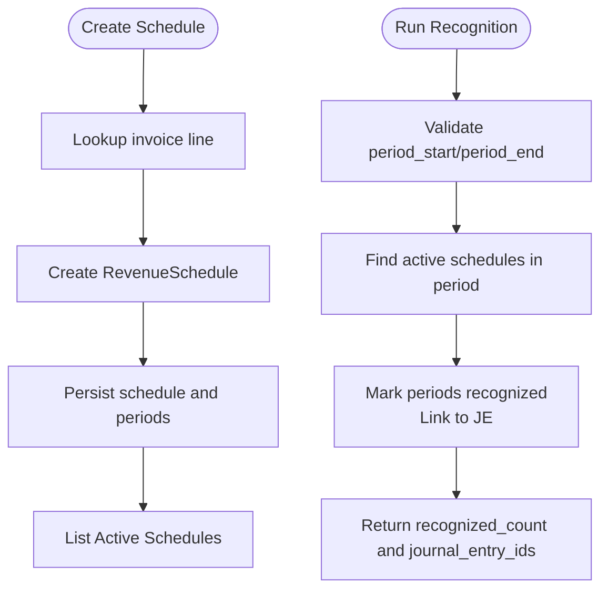
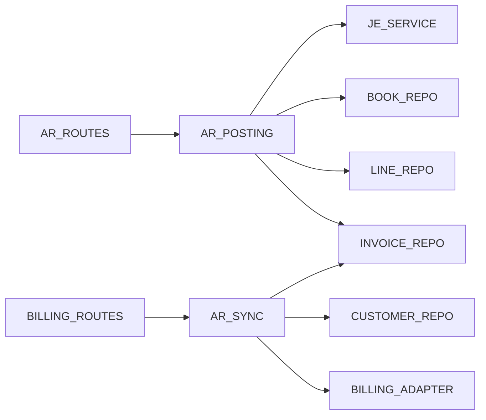
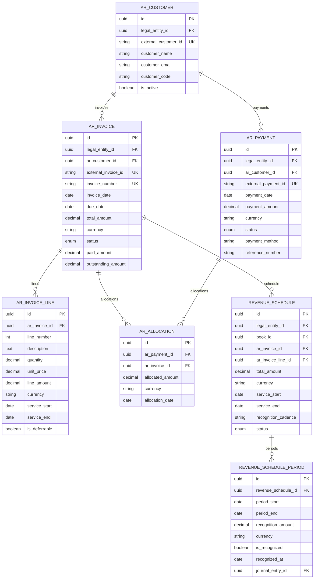

# Accounts Receivable API

<cite>
**Referenced Files in This Document**
- [app/main.py](file://app/main.py)
- [app/modules/ar/api/routes/ar_routes.py](file://app/modules/ar/api/routes/ar_routes.py)
- [app/modules/ar/api/routes/billing_sync_routes.py](file://app/modules/ar/api/routes/billing_sync_routes.py)
- [app/modules/ar/api/routes/deferred_revenue_routes.py](file://app/modules/ar/api/routes/deferred_revenue_routes.py)
- [app/modules/ar/models/ar_customer_model.py](file://app/modules/ar/models/ar_customer_model.py)
- [app/modules/ar/models/ar_invoice_model.py](file://app/modules/ar/models/ar_invoice_model.py)
- [app/modules/ar/models/ar_payment_model.py](file://app/modules/ar/models/ar_payment_model.py)
- [app/modules/ar/models/deferred_revenue_model.py](file://app/modules/ar/models/deferred_revenue_model.py)
- [app/modules/ar/schemas/ar_sync_schemas.py](file://app/modules/ar/schemas/ar_sync_schemas.py)
- [app/modules/ar/schemas/deferred_revenue_schemas.py](file://app/modules/ar/schemas/deferred_revenue_schemas.py)
- [app/modules/ar/services/ar_posting_service.py](file://app/modules/ar/services/ar_posting_service.py)
- [app/modules/ar/services/ar_sync_service.py](file://app/modules/ar/services/ar_sync_service.py)
- [app/modules/ar/integrations/billing_adapter.py](file://app/modules/ar/integrations/billing_adapter.py)
- [app/modules/ar/repositories/ar_customer_repository.py](file://app/modules/ar/repositories/ar_customer_repository.py)
- [app/modules/ar/repositories/ar_invoice_repository.py](file://app/modules/ar/repositories/ar_invoice_repository.py)
</cite>

## Table of Contents
1. [Introduction](#introduction)
2. [Project Structure](#project-structure)
3. [Core Components](#core-components)
4. [Architecture Overview](#architecture-overview)
5. [Detailed Component Analysis](#detailed-component-analysis)
6. [Dependency Analysis](#dependency-analysis)
7. [Performance Considerations](#performance-considerations)
8. [Troubleshooting Guide](#troubleshooting-guide)
9. [Conclusion](#conclusion)
10. [Appendices](#appendices)

## Introduction
This document provides comprehensive API documentation for the Accounts Receivable (AR) domain. It covers:
- Customer management: creation, updates, and credit limits
- Invoice processing: creation, modification, payment allocation, and voiding
- Billing synchronization with external systems for automated invoice generation
- Deferred revenue recognition with booking, adjustment, and reversal operations
- Request/response schemas, validation rules, and error handling for AR workflows

The AR module integrates with external billing systems via adapters, maintains AR entities (customers, invoices, payments, allocations), and posts journal entries to the general ledger for accrual accounting.

## Project Structure
The AR module is organized by concerns: API routes, models, repositories, services, integrations, and schemas. The main application wires the AR routes under a versioned router.

**Diagram sources**
- [app/main.py](file://app/main.py#L29-L31)
- [app/modules/ar/api/routes/ar_routes.py](file://app/modules/ar/api/routes/ar_routes.py#L16-L178)
- [app/modules/ar/api/routes/billing_sync_routes.py](file://app/modules/ar/api/routes/billing_sync_routes.py#L18-L192)
- [app/modules/ar/api/routes/deferred_revenue_routes.py](file://app/modules/ar/api/routes/deferred_revenue_routes.py#L16-L75)
- [app/modules/ar/services/ar_posting_service.py](file://app/modules/ar/services/ar_posting_service.py#L17-L154)
- [app/modules/ar/services/ar_sync_service.py](file://app/modules/ar/services/ar_sync_service.py#L23-L325)
- [app/modules/ar/integrations/billing_adapter.py](file://app/modules/ar/integrations/billing_adapter.py#L8-L191)
- [app/modules/ar/models/ar_customer_model.py](file://app/modules/ar/models/ar_customer_model.py#L8-L30)
- [app/modules/ar/models/ar_invoice_model.py](file://app/modules/ar/models/ar_invoice_model.py#L21-L81)
- [app/modules/ar/models/ar_payment_model.py](file://app/modules/ar/models/ar_payment_model.py#L19-L70)
- [app/modules/ar/models/deferred_revenue_model.py](file://app/modules/ar/models/deferred_revenue_model.py#L17-L71)
- [app/modules/ar/repositories/ar_customer_repository.py](file://app/modules/ar/repositories/ar_customer_repository.py#L9-L21)
- [app/modules/ar/repositories/ar_invoice_repository.py](file://app/modules/ar/repositories/ar_invoice_repository.py#L11-L59)

**Section sources**
- [app/main.py](file://app/main.py#L29-L31)
- [app/modules/ar/api/routes/ar_routes.py](file://app/modules/ar/api/routes/ar_routes.py#L16-L178)
- [app/modules/ar/api/routes/billing_sync_routes.py](file://app/modules/ar/api/routes/billing_sync_routes.py#L18-L192)
- [app/modules/ar/api/routes/deferred_revenue_routes.py](file://app/modules/ar/api/routes/deferred_revenue_routes.py#L16-L75)

## Core Components
- AR API Routes: Expose endpoints for invoice posting, listing, customer balances, aging, billing sync, deferred revenue scheduling, and recognition runs.
- AR Posting Service: Posts invoices to the accrual book and creates journal entries with appropriate GL accounts.
- AR Sync Service: Synchronizes customers, invoices, and payments from an external billing system, maintaining cursors and mappings.
- Billing Adapter: Abstract interface with HTTP and mock implementations for external billing integration.
- Models and Repositories: Define AR domain entities and provide CRUD operations with typed queries.
- Schemas: Pydantic models for request/response validation and serialization.

**Section sources**
- [app/modules/ar/api/routes/ar_routes.py](file://app/modules/ar/api/routes/ar_routes.py#L19-L178)
- [app/modules/ar/services/ar_posting_service.py](file://app/modules/ar/services/ar_posting_service.py#L28-L154)
- [app/modules/ar/services/ar_sync_service.py](file://app/modules/ar/services/ar_sync_service.py#L37-L325)
- [app/modules/ar/integrations/billing_adapter.py](file://app/modules/ar/integrations/billing_adapter.py#L8-L191)
- [app/modules/ar/models/ar_customer_model.py](file://app/modules/ar/models/ar_customer_model.py#L8-L30)
- [app/modules/ar/models/ar_invoice_model.py](file://app/modules/ar/models/ar_invoice_model.py#L21-L81)
- [app/modules/ar/models/ar_payment_model.py](file://app/modules/ar/models/ar_payment_model.py#L19-L70)
- [app/modules/ar/models/deferred_revenue_model.py](file://app/modules/ar/models/deferred_revenue_model.py#L17-L71)
- [app/modules/ar/schemas/ar_sync_schemas.py](file://app/modules/ar/schemas/ar_sync_schemas.py#L8-L23)
- [app/modules/ar/schemas/deferred_revenue_schemas.py](file://app/modules/ar/schemas/deferred_revenue_schemas.py#L9-L53)

## Architecture Overview
The AR module follows layered architecture:
- API routes orchestrate requests and delegate to services.
- Services encapsulate business logic and coordinate repositories and external adapters.
- Models define persistence structures; repositories provide typed data access.
- Integrations abstract external system interactions.

**Diagram sources**
- [app/modules/ar/api/routes/ar_routes.py](file://app/modules/ar/api/routes/ar_routes.py#L16-L178)
- [app/modules/ar/api/routes/billing_sync_routes.py](file://app/modules/ar/api/routes/billing_sync_routes.py#L18-L192)
- [app/modules/ar/api/routes/deferred_revenue_routes.py](file://app/modules/ar/api/routes/deferred_revenue_routes.py#L16-L75)
- [app/modules/ar/services/ar_posting_service.py](file://app/modules/ar/services/ar_posting_service.py#L17-L154)
- [app/modules/ar/services/ar_sync_service.py](file://app/modules/ar/services/ar_sync_service.py#L23-L325)
- [app/modules/ar/integrations/billing_adapter.py](file://app/modules/ar/integrations/billing_adapter.py#L8-L191)
- [app/modules/ar/repositories/ar_customer_repository.py](file://app/modules/ar/repositories/ar_customer_repository.py#L9-L21)
- [app/modules/ar/repositories/ar_invoice_repository.py](file://app/modules/ar/repositories/ar_invoice_repository.py#L11-L59)
- [app/modules/ar/models/ar_customer_model.py](file://app/modules/ar/models/ar_customer_model.py#L8-L30)
- [app/modules/ar/models/ar_invoice_model.py](file://app/modules/ar/models/ar_invoice_model.py#L21-L81)
- [app/modules/ar/models/ar_payment_model.py](file://app/modules/ar/models/ar_payment_model.py#L19-L70)
- [app/modules/ar/models/deferred_revenue_model.py](file://app/modules/ar/models/deferred_revenue_model.py#L17-L71)

## Detailed Component Analysis

### AR Invoices: Creation, Modification, Payment Allocation, and Posting
- Endpoint: POST /api/v1/books/{book_id}/ar/invoices/{invoice_id}/post
- Purpose: Post an issued invoice to the accrual book, generating journal entries.
- Validation:
  - Invoice existence and legal entity ownership verification against the provided book.
  - Invoice status must be ISSUED.
  - Accrual book availability for the legal entity.
- Processing:
  - Retrieve invoice lines; split postings by deferrable vs immediate revenue.
  - Use GL account mappings for AR, Deferred Revenue, and Revenue accounts.
  - Create and post journal entry with source keys derived from external invoice IDs.
- Response: Contains invoice_id, journal_entry_id, and posted status.

**Diagram sources**
- [app/modules/ar/api/routes/ar_routes.py](file://app/modules/ar/api/routes/ar_routes.py#L19-L75)
- [app/modules/ar/services/ar_posting_service.py](file://app/modules/ar/services/ar_posting_service.py#L28-L141)

**Section sources**
- [app/modules/ar/api/routes/ar_routes.py](file://app/modules/ar/api/routes/ar_routes.py#L19-L75)
- [app/modules/ar/services/ar_posting_service.py](file://app/modules/ar/services/ar_posting_service.py#L28-L141)
- [app/modules/ar/models/ar_invoice_model.py](file://app/modules/ar/models/ar_invoice_model.py#L21-L81)
- [app/modules/ar/models/ar_payment_model.py](file://app/modules/ar/models/ar_payment_model.py#L19-L70)

### AR Customer Management
- Entities:
  - ARCustomer: external_customer_id, customer_name, customer_email, customer_code, is_active, relationships to LegalEntity, invoices, payments.
- Operations:
  - Creation/updates occur during billing sync; repository supports lookup by external ID.
- Credit limits: Not modeled in the current schema; implement via custom attributes or extension if needed.

**Diagram sources**
- [app/modules/ar/models/ar_customer_model.py](file://app/modules/ar/models/ar_customer_model.py#L8-L30)
- [app/modules/ar/models/ar_invoice_model.py](file://app/modules/ar/models/ar_invoice_model.py#L21-L81)
- [app/modules/ar/models/ar_payment_model.py](file://app/modules/ar/models/ar_payment_model.py#L19-L70)

**Section sources**
- [app/modules/ar/models/ar_customer_model.py](file://app/modules/ar/models/ar_customer_model.py#L8-L30)
- [app/modules/ar/repositories/ar_customer_repository.py](file://app/modules/ar/repositories/ar_customer_repository.py#L9-L21)

### Billing Synchronization with External Systems
- Endpoint: POST /api/v1/integrations/billing/sync
- Purpose: Sync customers, invoices, and payments from an external billing system.
- Behavior:
  - Validates book-entity ownership.
  - Creates a sync batch with cursors for correlation.
  - Delegates to ARSyncService to fetch and persist data via BillingAdapter.
  - Updates cursors and batch metadata upon completion.
- Adapters:
  - HTTPBillingAdapter: Uses configured billing_service_url/token.
  - MockBillingAdapter: Returns empty datasets for development/testing.

**Diagram sources**
- [app/modules/ar/api/routes/billing_sync_routes.py](file://app/modules/ar/api/routes/billing_sync_routes.py#L29-L167)
- [app/modules/ar/services/ar_sync_service.py](file://app/modules/ar/services/ar_sync_service.py#L37-L325)
- [app/modules/ar/integrations/billing_adapter.py](file://app/modules/ar/integrations/billing_adapter.py#L61-L151)

**Section sources**
- [app/modules/ar/api/routes/billing_sync_routes.py](file://app/modules/ar/api/routes/billing_sync_routes.py#L29-L167)
- [app/modules/ar/services/ar_sync_service.py](file://app/modules/ar/services/ar_sync_service.py#L37-L325)
- [app/modules/ar/integrations/billing_adapter.py](file://app/modules/ar/integrations/billing_adapter.py#L8-L191)
- [app/modules/ar/schemas/ar_sync_schemas.py](file://app/modules/ar/schemas/ar_sync_schemas.py#L8-L23)

### Deferred Revenue Recognition
- Endpoints:
  - POST /api/v1/books/{book_id}/revrec/schedules/{invoice_line_id}: Create a revenue schedule from an invoice line.
  - GET /api/v1/books/{book_id}/revrec/schedules: List active schedules for a book.
  - POST /api/v1/books/{book_id}/revrec/run: Run revenue recognition for a period, returning journal entries created.
- Processing:
  - Create schedule with service start/end, cadence, and deferrable amounts.
  - Run recognition to mark periods recognized and link to journal entries.

**Diagram sources**
- [app/modules/ar/api/routes/deferred_revenue_routes.py](file://app/modules/ar/api/routes/deferred_revenue_routes.py#L19-L75)
- [app/modules/ar/models/deferred_revenue_model.py](file://app/modules/ar/models/deferred_revenue_model.py#L17-L71)
- [app/modules/ar/schemas/deferred_revenue_schemas.py](file://app/modules/ar/schemas/deferred_revenue_schemas.py#L9-L53)

**Section sources**
- [app/modules/ar/api/routes/deferred_revenue_routes.py](file://app/modules/ar/api/routes/deferred_revenue_routes.py#L19-L75)
- [app/modules/ar/models/deferred_revenue_model.py](file://app/modules/ar/models/deferred_revenue_model.py#L17-L71)
- [app/modules/ar/schemas/deferred_revenue_schemas.py](file://app/modules/ar/schemas/deferred_revenue_schemas.py#L9-L53)

### Additional AR Utilities
- Listing Invoices: GET /api/v1/books/{book_id}/ar/invoices with filters for customer_id and status.
- Customer Balance: GET /api/v1/books/{book_id}/ar/customers/{customer_id}/balance.
- AR Aging: GET /api/v1/books/{book_id}/ar/aging with optional as_of_date.

**Section sources**
- [app/modules/ar/api/routes/ar_routes.py](file://app/modules/ar/api/routes/ar_routes.py#L77-L178)
- [app/modules/ar/repositories/ar_invoice_repository.py](file://app/modules/ar/repositories/ar_invoice_repository.py#L24-L59)

## Dependency Analysis
- Route-to-Service coupling is minimal; services depend on repositories and adapters.
- AR Posting Service depends on General Ledger services for journal entries and account mappings.
- AR Sync Service depends on BillingAdapter and maintains cursors and source-object mappings.
- Models encapsulate relationships; repositories provide typed queries.

**Diagram sources**
- [app/modules/ar/api/routes/ar_routes.py](file://app/modules/ar/api/routes/ar_routes.py#L19-L75)
- [app/modules/ar/api/routes/billing_sync_routes.py](file://app/modules/ar/api/routes/billing_sync_routes.py#L29-L167)
- [app/modules/ar/services/ar_posting_service.py](file://app/modules/ar/services/ar_posting_service.py#L17-L27)
- [app/modules/ar/services/ar_sync_service.py](file://app/modules/ar/services/ar_sync_service.py#L23-L36)

**Section sources**
- [app/modules/ar/services/ar_posting_service.py](file://app/modules/ar/services/ar_posting_service.py#L17-L27)
- [app/modules/ar/services/ar_sync_service.py](file://app/modules/ar/services/ar_sync_service.py#L23-L36)

## Performance Considerations
- Batch cursors: Billing sync uses cursors to process incremental loads efficiently.
- Idempotency: Routes apply idempotency keys to prevent duplicate processing; batching metadata correlates sync operations.
- Pagination: Invoice listing supports limit/offset to constrain result sets.
- Decimal precision: Monetary fields use numeric types to avoid floating-point errors.
- Indexes: Models include strategic indexes on foreign keys and lookup fields.

[No sources needed since this section provides general guidance]

## Troubleshooting Guide
Common errors and resolutions:
- 404 Not Found:
  - Invoice/customer not found during posting or sync.
  - Validate identifiers and ensure external sync has been performed.
- 400 Bad Request:
  - Invoice status invalid for posting (must be ISSUED).
  - Book does not belong to the requested legal entity.
  - Validation errors in sync requests (entity mismatch).
- Idempotency:
  - Duplicate requests are safely ignored; verify idempotency_key usage.
- Cursors:
  - If sync stalls, check billing service cursors and retry with next_cursor.

**Section sources**
- [app/modules/ar/api/routes/ar_routes.py](file://app/modules/ar/api/routes/ar_routes.py#L35-L44)
- [app/modules/ar/api/routes/billing_sync_routes.py](file://app/modules/ar/api/routes/billing_sync_routes.py#L45-L46)
- [app/modules/ar/services/ar_posting_service.py](file://app/modules/ar/services/ar_posting_service.py#L38-L39)

## Conclusion
The AR module provides a robust foundation for managing receivables, integrating with external billing systems, and recognizing revenue according to deferral policies. The APIs are structured around clear responsibilities, with strong separation between routes, services, repositories, and models. Extending support for credit limits, voiding, and additional validation can be achieved by augmenting models and services while preserving current architectural patterns.

[No sources needed since this section summarizes without analyzing specific files]

## Appendices

### API Reference: Accounts Receivable

- Invoices
  - POST /api/v1/books/{book_id}/ar/invoices/{invoice_id}/post
    - Description: Post an issued invoice to the accrual book.
    - Path parameters:
      - book_id: UUID
      - invoice_id: UUID
    - Query parameters:
      - posted_by: UUID
    - Response: { invoice_id, journal_entry_id, status }
    - Errors: 404 (invoice/customer not found), 400 (invalid status/book mismatch)

- Customer Balance
  - GET /api/v1/books/{book_id}/ar/customers/{customer_id}/balance
    - Response: { customer_id, customer_name, total_outstanding, currency, invoice_count }

- AR Aging
  - GET /api/v1/books/{book_id}/ar/aging
    - Query parameters:
      - as_of_date: date (optional)
    - Response: { as_of_date, aging_buckets: { "0-30","31-60","61-90","90+" }: { count, total } }

- Billing Sync
  - POST /api/v1/integrations/billing/sync
    - Request body: BillingSyncRequest
      - entity_id: UUID
      - since_cursor: string (optional)
      - full_resync: boolean
    - Response: BillingSyncResponse
      - entity_id: UUID
      - customers_synced: int
      - invoices_synced: int
      - payments_synced: int
      - next_cursor: string (optional)
      - sync_timestamp: datetime

  - GET /api/v1/integrations/billing/sync/status
    - Query parameters:
      - entity_id: UUID
    - Response: { entity_id, customer_cursor, invoice_cursor, payment_cursor, timestamps }

- Deferred Revenue
  - POST /api/v1/books/{book_id}/revrec/schedules/{invoice_line_id}
    - Response: RevenueScheduleResponse (with schedule details and periods)

  - GET /api/v1/books/{book_id}/revrec/schedules
    - Response: Array of RevenueScheduleResponse

  - POST /api/v1/books/{book_id}/revrec/run
    - Request body: RevenueRecognitionRequest
      - book_id: UUID
      - period_start: date
      - period_end: date
      - posted_by: UUID
    - Response: { recognized_count, journal_entry_ids, period_start, period_end }

**Section sources**
- [app/modules/ar/api/routes/ar_routes.py](file://app/modules/ar/api/routes/ar_routes.py#L19-L178)
- [app/modules/ar/api/routes/billing_sync_routes.py](file://app/modules/ar/api/routes/billing_sync_routes.py#L29-L192)
- [app/modules/ar/api/routes/deferred_revenue_routes.py](file://app/modules/ar/api/routes/deferred_revenue_routes.py#L19-L75)
- [app/modules/ar/schemas/ar_sync_schemas.py](file://app/modules/ar/schemas/ar_sync_schemas.py#L8-L23)
- [app/modules/ar/schemas/deferred_revenue_schemas.py](file://app/modules/ar/schemas/deferred_revenue_schemas.py#L9-L53)

### Data Models Overview

**Diagram sources**
- [app/modules/ar/models/ar_customer_model.py](file://app/modules/ar/models/ar_customer_model.py#L8-L30)
- [app/modules/ar/models/ar_invoice_model.py](file://app/modules/ar/models/ar_invoice_model.py#L21-L81)
- [app/modules/ar/models/ar_payment_model.py](file://app/modules/ar/models/ar_payment_model.py#L19-L70)
- [app/modules/ar/models/deferred_revenue_model.py](file://app/modules/ar/models/deferred_revenue_model.py#L17-L71)