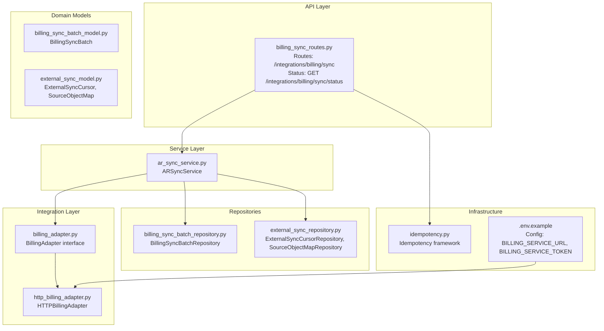
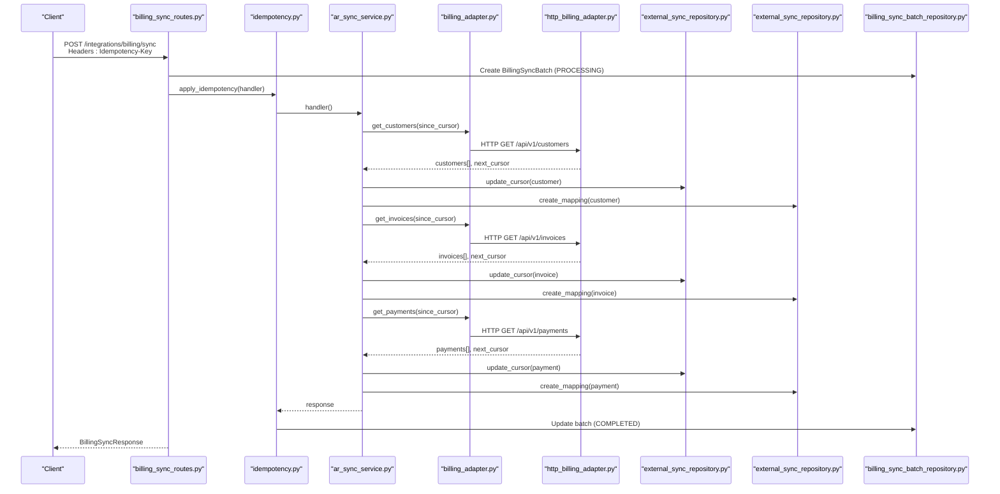
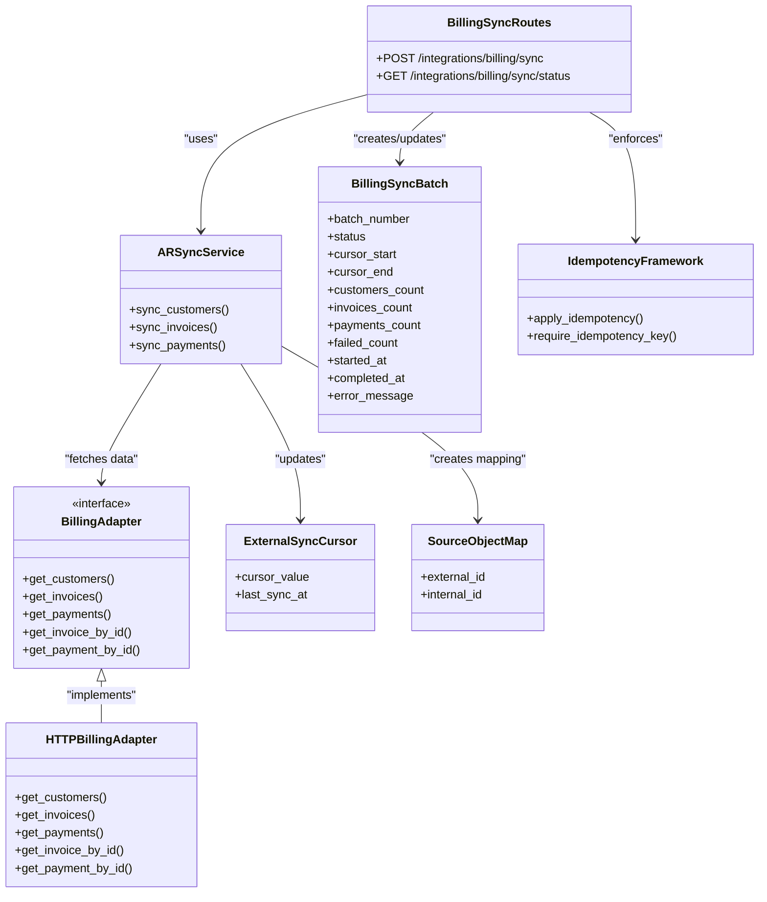

# Billing Synchronization API

<cite>
**Referenced Files in This Document**
- [billing_sync_routes.py](file://app/modules/ar/api/routes/billing_sync_routes.py)
- [ar_sync_service.py](file://app/modules/ar/services/ar_sync_service.py)
- [billing_adapter.py](file://app/modules/ar/integrations/billing_adapter.py)
- [http_billing_adapter.py](file://app/modules/ar/integrations/http_billing_adapter.py)
- [ar_sync_schemas.py](file://app/modules/ar/schemas/ar_sync_schemas.py)
- [billing_sync_batch_model.py](file://app/modules/ar/models/billing_sync_batch_model.py)
- [billing_sync_batch_repository.py](file://app/modules/ar/repositories/billing_sync_batch_repository.py)
- [external_sync_model.py](file://app/modules/general_ledger/models/external_sync_model.py)
- [external_sync_repository.py](file://app/modules/general_ledger/repositories/external_sync_repository.py)
- [idempotency.py](file://app/core/idempotency.py)
- [config.py](file://app/core/config.py)
- [.env.example](file://.env.example)
- [003_add_billing_sync_batch.py](file://database/migrations/versions/003_add_billing_sync_batch.py)
</cite>

## Table of Contents
1. [Introduction](#introduction)
2. [Project Structure](#project-structure)
3. [Core Components](#core-components)
4. [Architecture Overview](#architecture-overview)
5. [Detailed Component Analysis](#detailed-component-analysis)
6. [Dependency Analysis](#dependency-analysis)
7. [Performance Considerations](#performance-considerations)
8. [Troubleshooting Guide](#troubleshooting-guide)
9. [Conclusion](#conclusion)
10. [Appendices](#appendices)

## Introduction
This document provides comprehensive API documentation for the Billing Synchronization endpoints. It covers automated invoice generation from external systems, sync configurations, batch processing, triggers, data mapping, conflict resolution, integration with billing adapters, real-time sync, and historical data imports. It also documents sync status monitoring, audit trails, and operational guidance for error handling and retries.

## Project Structure
The Billing Synchronization feature is implemented under the Accounts Receivable (AR) module with supporting infrastructure in the General Ledger and Core modules. The key components include:
- API routes for initiating sync and checking status
- Service layer orchestrating sync operations
- Billing adapters abstracting external system integration
- Repositories and models for batch tracking and cursor management
- Idempotency infrastructure for safe retries and audit trails

**Diagram sources**
- [billing_sync_routes.py](file://app/modules/ar/api/routes/billing_sync_routes.py#L18-L191)
- [ar_sync_service.py](file://app/modules/ar/services/ar_sync_service.py#L23-L325)
- [billing_adapter.py](file://app/modules/ar/integrations/billing_adapter.py#L8-L191)
- [http_billing_adapter.py](file://app/modules/ar/integrations/http_billing_adapter.py#L10-L130)
- [billing_sync_batch_model.py](file://app/modules/ar/models/billing_sync_batch_model.py#L10-L40)
- [external_sync_model.py](file://app/modules/general_ledger/models/external_sync_model.py#L8-L52)
- [billing_sync_batch_repository.py](file://app/modules/ar/repositories/billing_sync_batch_repository.py#L12-L42)
- [external_sync_repository.py](file://app/modules/general_ledger/repositories/external_sync_repository.py#L11-L111)
- [idempotency.py](file://app/core/idempotency.py#L219-L482)
- [.env.example](file://.env.example#L16-L18)

**Section sources**
- [billing_sync_routes.py](file://app/modules/ar/api/routes/billing_sync_routes.py#L18-L191)
- [ar_sync_service.py](file://app/modules/ar/services/ar_sync_service.py#L23-L325)
- [billing_adapter.py](file://app/modules/ar/integrations/billing_adapter.py#L8-L191)
- [http_billing_adapter.py](file://app/modules/ar/integrations/http_billing_adapter.py#L10-L130)
- [billing_sync_batch_model.py](file://app/modules/ar/models/billing_sync_batch_model.py#L10-L40)
- [external_sync_model.py](file://app/modules/general_ledger/models/external_sync_model.py#L8-L52)
- [billing_sync_batch_repository.py](file://app/modules/ar/repositories/billing_sync_batch_repository.py#L12-L42)
- [external_sync_repository.py](file://app/modules/general_ledger/repositories/external_sync_repository.py#L11-L111)
- [idempotency.py](file://app/core/idempotency.py#L219-L482)
- [.env.example](file://.env.example#L16-L18)

## Core Components
- Billing Sync Routes: Expose endpoints to trigger sync and check status.
- AR Sync Service: Orchestrates customer, invoice, and payment sync with deduplication and mapping.
- Billing Adapters: Abstract external system integration (HTTP or mock).
- Batch Tracking: BillingSyncBatch model and repository for idempotent batch lifecycle.
- Cursor Management: ExternalSyncCursor and SourceObjectMap for replay-safe incremental sync.
- Idempotency: Centralized idempotency framework for safe retries and audit trails.

**Section sources**
- [billing_sync_routes.py](file://app/modules/ar/api/routes/billing_sync_routes.py#L29-L191)
- [ar_sync_service.py](file://app/modules/ar/services/ar_sync_service.py#L23-L325)
- [billing_adapter.py](file://app/modules/ar/integrations/billing_adapter.py#L8-L191)
- [http_billing_adapter.py](file://app/modules/ar/integrations/http_billing_adapter.py#L10-L130)
- [billing_sync_batch_model.py](file://app/modules/ar/models/billing_sync_batch_model.py#L10-L40)
- [external_sync_model.py](file://app/modules/general_ledger/models/external_sync_model.py#L8-L52)
- [idempotency.py](file://app/core/idempotency.py#L219-L482)

## Architecture Overview
The Billing Sync API follows a layered architecture:
- API layer validates inputs, enforces idempotency, and coordinates sync batches.
- Service layer interacts with adapters and repositories to synchronize data.
- Adapter layer abstracts external system communication.
- Persistence layer stores sync batches, cursors, and object mappings.

**Diagram sources**
- [billing_sync_routes.py](file://app/modules/ar/api/routes/billing_sync_routes.py#L29-L163)
- [ar_sync_service.py](file://app/modules/ar/services/ar_sync_service.py#L37-L308)
- [billing_adapter.py](file://app/modules/ar/integrations/billing_adapter.py#L11-L58)
- [http_billing_adapter.py](file://app/modules/ar/integrations/http_billing_adapter.py#L42-L129)
- [external_sync_repository.py](file://app/modules/general_ledger/repositories/external_sync_repository.py#L17-L110)
- [billing_sync_batch_repository.py](file://app/modules/ar/repositories/billing_sync_batch_repository.py#L18-L41)
- [idempotency.py](file://app/core/idempotency.py#L219-L482)

## Detailed Component Analysis

### API Endpoints
- POST /integrations/billing/sync
  - Purpose: Trigger billing synchronization for a legal entity and book.
  - Request body: BillingSyncRequest (entity_id, since_cursor, full_resync).
  - Response: BillingSyncResponse (counts, next_cursor, timestamp).
  - Idempotency: Enforced via Idempotency-Key header; metadata includes batch_id and cursors for audit.
  - Validation: Ensures book belongs to the entity; creates a sync batch before processing.
  - Triggers: Creates a batch, executes handler, updates batch status and counts, and persists final metadata.

- GET /integrations/billing/sync/status
  - Purpose: Retrieve current sync cursors for customers, invoices, and payments.
  - Response: entity_id, customer_cursor, invoice_cursor, payment_cursor, and last_sync timestamps.

**Section sources**
- [billing_sync_routes.py](file://app/modules/ar/api/routes/billing_sync_routes.py#L29-L191)
- [ar_sync_schemas.py](file://app/modules/ar/schemas/ar_sync_schemas.py#L8-L23)

### AR Sync Service
- Responsibilities:
  - Incremental sync of customers, invoices, and payments from the billing adapter.
  - Deduplication using external IDs and mapping records.
  - Cursor management for replay-safe incremental processing.
  - Batch counting and persistence of sync outcomes.

- Customer Sync:
  - Fetches customers using since_cursor or full_resync mode.
  - Updates existing customers or creates new ones.
  - Maintains SourceObjectMap for external-to-internal ID mapping.

- Invoice Sync:
  - Ensures customer exists; otherwise, creates a placeholder.
  - Updates existing invoices or creates new ones with lines.
  - Persists invoice lines and mapping.

- Payment Sync:
  - Validates customer existence; skips missing customers.
  - Creates payments and allocations to invoices.
  - Persists mapping for payments.

- Cursor and Mapping:
  - Uses ExternalSyncCursorRepository to track last processed cursor per object type.
  - Uses SourceObjectMapRepository to prevent duplicates and support conflict resolution.

**Section sources**
- [ar_sync_service.py](file://app/modules/ar/services/ar_sync_service.py#L37-L325)
- [external_sync_repository.py](file://app/modules/general_ledger/repositories/external_sync_repository.py#L17-L110)

### Billing Adapters
- BillingAdapter (abstract):
  - Defines methods to fetch customers, invoices, payments, and resolve single items by ID.

- HTTPBillingAdapter:
  - Implements HTTP requests to the configured billing service URL.
  - Uses Authorization Bearer token from settings.
  - Handles errors gracefully by returning empty results and logging.

- MockBillingAdapter:
  - Provides no-op implementations for development/testing.

**Section sources**
- [billing_adapter.py](file://app/modules/ar/integrations/billing_adapter.py#L8-L191)
- [http_billing_adapter.py](file://app/modules/ar/integrations/http_billing_adapter.py#L10-L130)
- [config.py](file://app/core/config.py#L53-L57)

### Batch Tracking and Status Monitoring
- BillingSyncBatch:
  - Tracks batch lifecycle (PENDING, PROCESSING, COMPLETED, FAILED).
  - Stores counts for customers, invoices, payments, and failed items.
  - Captures cursor_start and cursor_end for audit and replay.

- BillingSyncBatchRepository:
  - Generates unique batch numbers per day and entity.
  - Retrieves batches by batch_number for monitoring.

- Status Endpoint:
  - Returns current cursors and timestamps for visibility into sync progress.

**Section sources**
- [billing_sync_batch_model.py](file://app/modules/ar/models/billing_sync_batch_model.py#L10-L40)
- [billing_sync_batch_repository.py](file://app/modules/ar/repositories/billing_sync_batch_repository.py#L18-L41)
- [billing_sync_routes.py](file://app/modules/ar/api/routes/billing_sync_routes.py#L170-L191)

### Data Mapping and Conflict Resolution
- SourceObjectMap:
  - Prevents duplication by mapping external IDs to internal IDs.
  - Supports conflict resolution by detecting existing records before creation.

- Conflict Handling:
  - Skips problematic items during sync to keep pipeline moving.
  - Logs errors and continues processing.

**Section sources**
- [external_sync_model.py](file://app/modules/general_ledger/models/external_sync_model.py#L30-L52)
- [external_sync_repository.py](file://app/modules/general_ledger/repositories/external_sync_repository.py#L63-L111)
- [ar_sync_service.py](file://app/modules/ar/services/ar_sync_service.py#L64-L98)

### Idempotency and Retry Mechanisms
- Idempotency Framework:
  - Reserves idempotency keys with PENDING state to prevent race conditions.
  - Replays stored responses for identical requests.
  - Supports safe retries for endpoints marked as retry-safe.
  - Stores metadata (e.g., batch_id, cursors) for audit/debug correlation.

- Retry Behavior:
  - Returns 409 Conflict with a specific code when the key is in progress.
  - Automatically transitions stale locks to FAILED to allow takeover.
  - Caps response blob size to prevent storage bloat.

**Section sources**
- [idempotency.py](file://app/core/idempotency.py#L219-L482)
- [billing_sync_routes.py](file://app/modules/ar/api/routes/billing_sync_routes.py#L125-L163)

### Audit Trails and Monitoring
- Idempotency Keys:
  - Persisted with request hash, response, and metadata for audit.
- Batch Records:
  - Capture counts, timestamps, and cursors for operational monitoring.
- Status Endpoint:
  - Exposes cursors and last sync times for dashboards and alerts.

**Section sources**
- [idempotency.py](file://app/core/idempotency.py#L410-L431)
- [billing_sync_batch_model.py](file://app/modules/ar/models/billing_sync_batch_model.py#L19-L32)
- [billing_sync_routes.py](file://app/modules/ar/api/routes/billing_sync_routes.py#L170-L191)

## Dependency Analysis

**Diagram sources**
- [billing_sync_routes.py](file://app/modules/ar/api/routes/billing_sync_routes.py#L29-L191)
- [ar_sync_service.py](file://app/modules/ar/services/ar_sync_service.py#L23-L325)
- [billing_adapter.py](file://app/modules/ar/integrations/billing_adapter.py#L8-L191)
- [http_billing_adapter.py](file://app/modules/ar/integrations/http_billing_adapter.py#L10-L130)
- [billing_sync_batch_model.py](file://app/modules/ar/models/billing_sync_batch_model.py#L10-L40)
- [external_sync_model.py](file://app/modules/general_ledger/models/external_sync_model.py#L8-L52)
- [idempotency.py](file://app/core/idempotency.py#L219-L482)

**Section sources**
- [billing_sync_routes.py](file://app/modules/ar/api/routes/billing_sync_routes.py#L29-L191)
- [ar_sync_service.py](file://app/modules/ar/services/ar_sync_service.py#L23-L325)
- [billing_adapter.py](file://app/modules/ar/integrations/billing_adapter.py#L8-L191)
- [http_billing_adapter.py](file://app/modules/ar/integrations/http_billing_adapter.py#L10-L130)
- [billing_sync_batch_model.py](file://app/modules/ar/models/billing_sync_batch_model.py#L10-L40)
- [external_sync_model.py](file://app/modules/general_ledger/models/external_sync_model.py#L8-L52)
- [idempotency.py](file://app/core/idempotency.py#L219-L482)

## Performance Considerations
- Pagination and Limits:
  - Sync methods fetch data in batches with a configurable limit to avoid large payloads.
- Cursor-Based Incremental Sync:
  - Uses since_cursor to process only changed records, reducing load.
- Idempotency Overhead:
  - Reserve-and-check mechanism prevents duplicate processing but adds database round-trips; ensure proper indexing on idempotency keys.
- Network Latency:
  - HTTP adapter timeouts and error handling mitigate transient failures; consider retry policies at the adapter level if needed.

[No sources needed since this section provides general guidance]

## Troubleshooting Guide
- Idempotency Issues:
  - 409 Conflict: Indicates the key is in progress or used with a different payload. Use a new key or wait until the lock expires.
  - Stale Locks: If a previous request timed out, the system transitions the key to FAILED automatically to allow retry.
- HTTP Adapter Errors:
  - Missing billing_service_url or token leads to empty results; configure environment variables.
  - 404 responses for single item lookups are handled gracefully by returning None.
- Cursor Drift:
  - If sync appears stuck, verify cursors via the status endpoint and adjust since_cursor accordingly.
- Batch Failures:
  - Inspect BillingSyncBatch for error_message and counts; investigate partial syncs and reconcile manually if needed.

**Section sources**
- [idempotency.py](file://app/core/idempotency.py#L312-L377)
- [http_billing_adapter.py](file://app/modules/ar/integrations/http_billing_adapter.py#L111-L129)
- [billing_sync_routes.py](file://app/modules/ar/api/routes/billing_sync_routes.py#L170-L191)
- [billing_sync_batch_model.py](file://app/modules/ar/models/billing_sync_batch_model.py#L31-L32)

## Conclusion
The Billing Synchronization API provides a robust, idempotent, and auditable mechanism to synchronize AR data from external billing systems. It supports incremental sync, batch processing, conflict resolution, and comprehensive monitoring. By leveraging adapters, cursors, and idempotency, it ensures reliable operation in distributed environments while maintaining clear audit trails.

[No sources needed since this section summarizes without analyzing specific files]

## Appendices

### API Definitions

- POST /integrations/billing/sync
  - Headers:
    - Idempotency-Key: Required for idempotency.
    - Authorization: Optional, depending on system policy.
  - Request Body: BillingSyncRequest
    - entity_id: UUID of the legal entity.
    - since_cursor: Optional string cursor for incremental sync.
    - full_resync: Boolean to reset cursors and sync all records.
  - Response: BillingSyncResponse
    - entity_id: UUID of the legal entity.
    - customers_synced: Number of customers processed.
    - invoices_synced: Number of invoices processed.
    - payments_synced: Number of payments processed.
    - next_cursor: Cursor for the next incremental sync.
    - sync_timestamp: Timestamp of the sync operation.

- GET /integrations/billing/sync/status
  - Query Parameters:
    - entity_id: UUID of the legal entity.
  - Response:
    - entity_id: UUID of the legal entity.
    - customer_cursor: Current cursor for customers.
    - customer_last_sync: ISO timestamp of last customer sync.
    - invoice_cursor: Current cursor for invoices.
    - invoice_last_sync: ISO timestamp of last invoice sync.
    - payment_cursor: Current cursor for payments.
    - payment_last_sync: ISO timestamp of last payment sync.

**Section sources**
- [billing_sync_routes.py](file://app/modules/ar/api/routes/billing_sync_routes.py#L29-L191)
- [ar_sync_schemas.py](file://app/modules/ar/schemas/ar_sync_schemas.py#L8-L23)

### Configuration
- Environment Variables:
  - BILLING_SERVICE_URL: Base URL of the billing service.
  - BILLING_SERVICE_TOKEN: Bearer token for authentication.
  - Optional aliases: BILLING_API_URL, BILLING_API_KEY.

**Section sources**
- [config.py](file://app/core/config.py#L53-L57)
- [.env.example](file://.env.example#L16-L18)

### Database Schema Notes
- BillingSyncBatch table created via migration 003_add_billing_sync_batch.py.
- Shared enum type sync_batch_status used across billing and treasury syncs.

**Section sources**
- [003_add_billing_sync_batch.py](file://database/migrations/versions/003_add_billing_sync_batch.py#L23-L66)