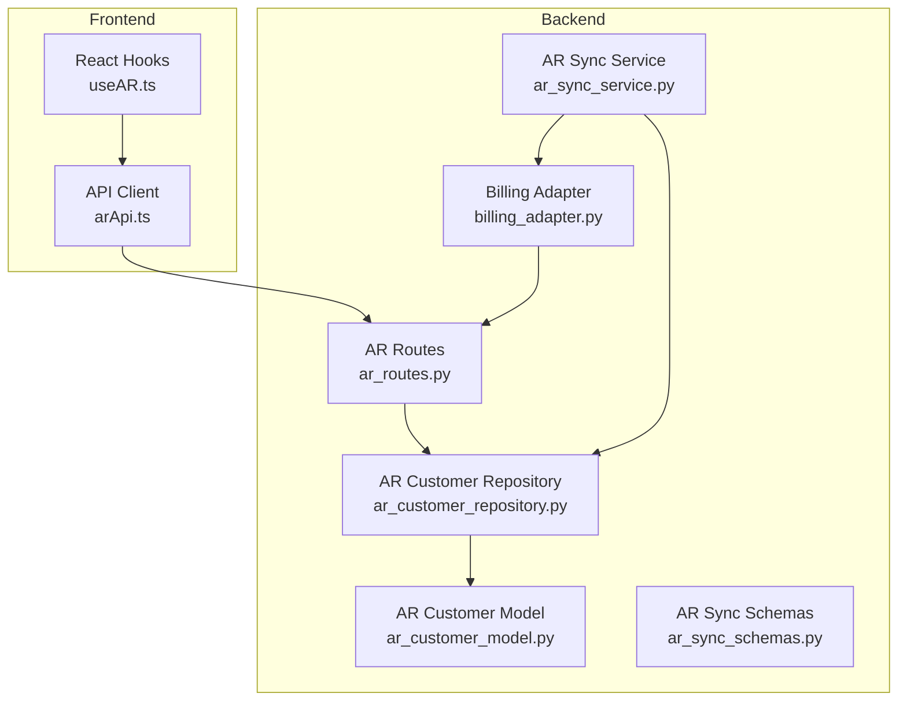
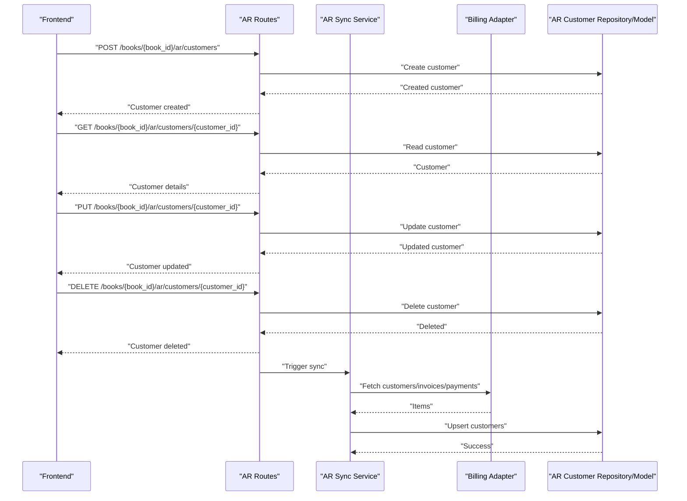
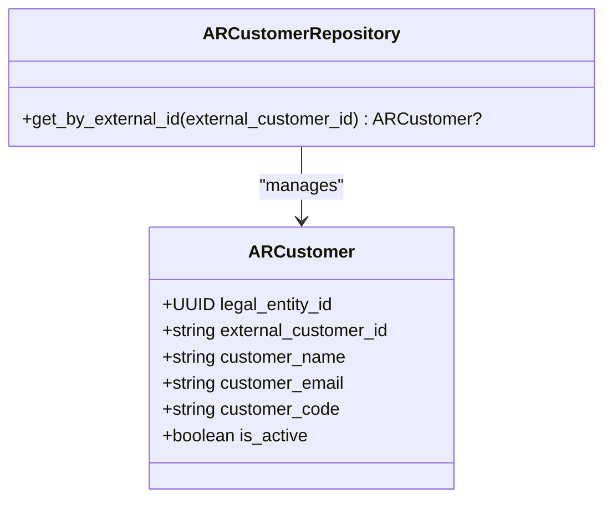
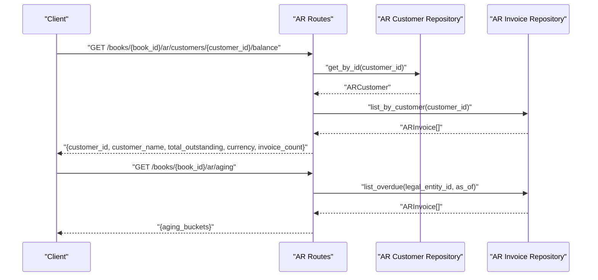
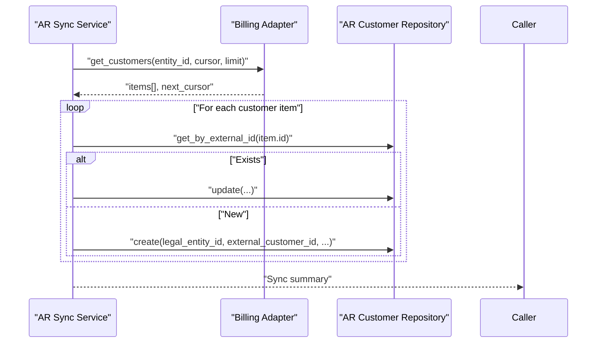
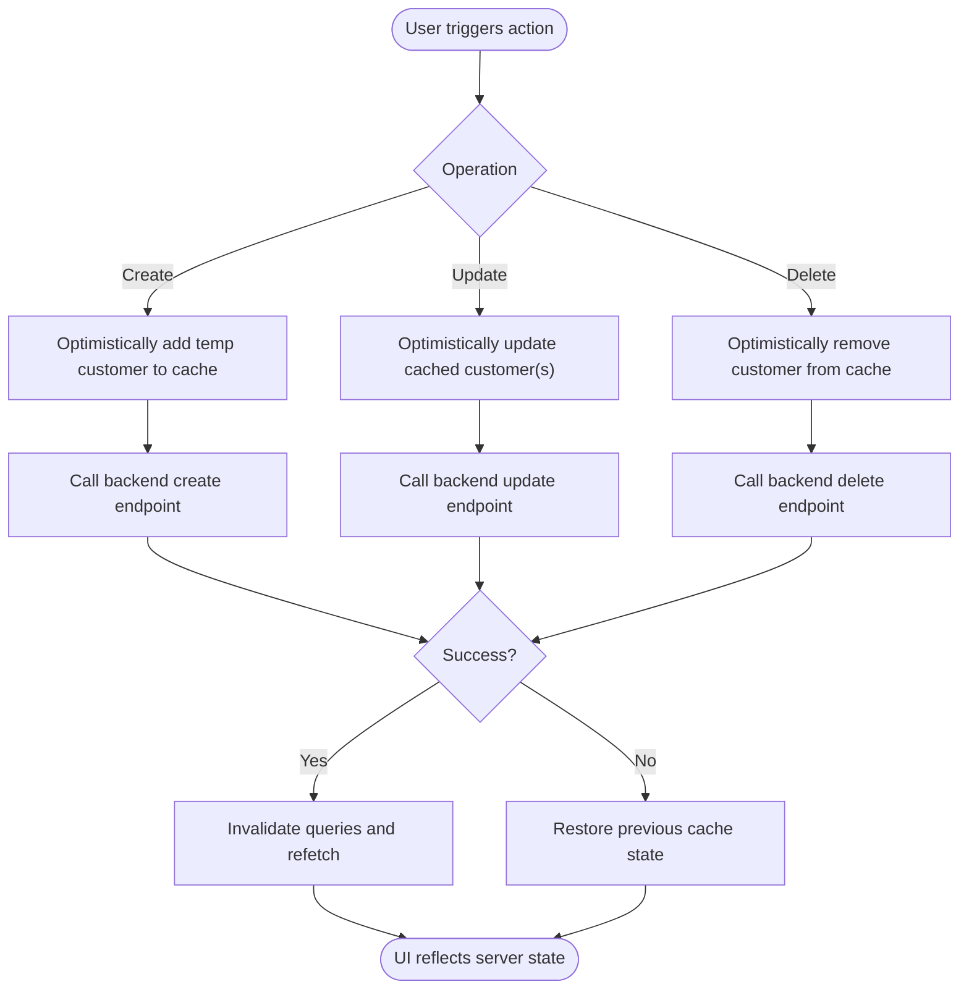
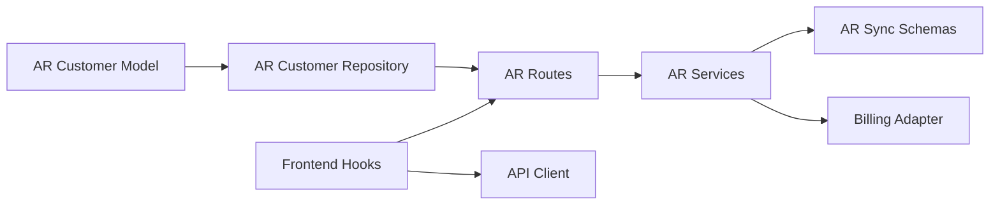

# Customer Management API

<cite>
**Referenced Files in This Document**
- [ar_customer_model.py](file://app/modules/ar/models/ar_customer_model.py)
- [ar_customer_repository.py](file://app/modules/ar/repositories/ar_customer_repository.py)
- [ar_routes.py](file://app/modules/ar/api/routes/ar_routes.py)
- [ar_sync_schemas.py](file://app/modules/ar/schemas/ar_sync_schemas.py)
- [ar_sync_service.py](file://app/modules/ar/services/ar_sync_service.py)
- [billing_adapter.py](file://app/modules/ar/integrations/billing_adapter.py)
- [useAR.ts](file://frontend/hooks/useAR.ts)
- [arApi.ts](file://frontend/lib/api/arApi.ts)
</cite>

## Table of Contents
1. [Introduction](#introduction)
2. [Project Structure](#project-structure)
3. [Core Components](#core-components)
4. [Architecture Overview](#architecture-overview)
5. [Detailed Component Analysis](#detailed-component-analysis)
6. [Dependency Analysis](#dependency-analysis)
7. [Performance Considerations](#performance-considerations)
8. [Troubleshooting Guide](#troubleshooting-guide)
9. [Conclusion](#conclusion)

## Introduction
This document provides comprehensive API documentation for Customer Management within the Accounts Receivable (AR) module. It covers customer creation, updates, deletion, search, filtering, and integration with external billing systems. It also documents customer balances, aging reports, and the underlying data model. The goal is to enable developers and integrators to build reliable customer management workflows while ensuring financial accuracy and operational safety.

## Project Structure
The customer management functionality spans backend Python modules and frontend React hooks. The backend exposes REST endpoints under the AR API router, persists customer records via SQLAlchemy models and repositories, and integrates with external billing systems through adapters and services. The frontend provides React Query hooks for optimistic UI updates and seamless CRUD operations.

**Diagram sources**
- [ar_routes.py](file://app/modules/ar/api/routes/ar_routes.py#L1-L178)
- [ar_customer_model.py](file://app/modules/ar/models/ar_customer_model.py#L1-L30)
- [ar_customer_repository.py](file://app/modules/ar/repositories/ar_customer_repository.py#L1-L21)
- [ar_sync_schemas.py](file://app/modules/ar/schemas/ar_sync_schemas.py#L1-L23)
- [ar_sync_service.py](file://app/modules/ar/services/ar_sync_service.py#L58-L87)
- [billing_adapter.py](file://app/modules/ar/integrations/billing_adapter.py#L82-L118)
- [useAR.ts](file://frontend/hooks/useAR.ts#L1-L103)
- [arApi.ts](file://frontend/lib/api/arApi.ts)

**Section sources**
- [ar_routes.py](file://app/modules/ar/api/routes/ar_routes.py#L1-L178)
- [ar_customer_model.py](file://app/modules/ar/models/ar_customer_model.py#L1-L30)
- [ar_customer_repository.py](file://app/modules/ar/repositories/ar_customer_repository.py#L1-L21)
- [ar_sync_schemas.py](file://app/modules/ar/schemas/ar_sync_schemas.py#L1-L23)
- [ar_sync_service.py](file://app/modules/ar/services/ar_sync_service.py#L58-L87)
- [billing_adapter.py](file://app/modules/ar/integrations/billing_adapter.py#L82-L118)
- [useAR.ts](file://frontend/hooks/useAR.ts#L1-L103)

## Core Components
- AR Customer Model: Defines the persisted customer record with fields for legal entity linkage, external customer ID, name, email, code, and activity status.
- AR Customer Repository: Provides database operations for customer lookup by external ID and generic CRUD via the base repository.
- AR Routes: Exposes endpoints for customer balance retrieval and AR aging reports; customer CRUD endpoints are consumed by the frontend hooks.
- AR Sync Schemas: Defines request/response schemas for billing synchronization.
- AR Sync Service: Orchestrates customer synchronization from the billing system into the AR customer table.
- Billing Adapter: Implements asynchronous HTTP calls to fetch customers, invoices, and payments from the billing system.
- Frontend Hooks: Provide optimized UI mutations for create, update, delete, and list operations with optimistic updates and cache invalidation.

**Section sources**
- [ar_customer_model.py](file://app/modules/ar/models/ar_customer_model.py#L8-L30)
- [ar_customer_repository.py](file://app/modules/ar/repositories/ar_customer_repository.py#L9-L21)
- [ar_routes.py](file://app/modules/ar/api/routes/ar_routes.py#L105-L177)
- [ar_sync_schemas.py](file://app/modules/ar/schemas/ar_sync_schemas.py#L8-L23)
- [ar_sync_service.py](file://app/modules/ar/services/ar_sync_service.py#L58-L87)
- [billing_adapter.py](file://app/modules/ar/integrations/billing_adapter.py#L82-L118)
- [useAR.ts](file://frontend/hooks/useAR.ts#L13-L103)

## Architecture Overview
The customer management architecture integrates external billing data with internal AR records. The billing adapter fetches customer data, the sync service creates or updates AR customer records, and the AR routes expose read operations for balances and aging. The frontend hooks encapsulate UI concerns and delegate persistence to the backend.

**Diagram sources**
- [ar_routes.py](file://app/modules/ar/api/routes/ar_routes.py#L105-L177)
- [ar_sync_service.py](file://app/modules/ar/services/ar_sync_service.py#L58-L87)
- [billing_adapter.py](file://app/modules/ar/integrations/billing_adapter.py#L82-L118)
- [ar_customer_repository.py](file://app/modules/ar/repositories/ar_customer_repository.py#L9-L21)
- [ar_customer_model.py](file://app/modules/ar/models/ar_customer_model.py#L8-L30)
- [useAR.ts](file://frontend/hooks/useAR.ts#L29-L103)

## Detailed Component Analysis

### AR Customer Model
The AR customer model defines the persisted representation of a customer, including:
- Legal entity linkage via foreign key
- Unique external customer ID (from the billing system)
- Customer name, email, and optional customer code
- Active status flag
- Relationships to legal entity, invoices, and payments

**Diagram sources**
- [ar_customer_model.py](file://app/modules/ar/models/ar_customer_model.py#L8-L30)
- [ar_customer_repository.py](file://app/modules/ar/repositories/ar_customer_repository.py#L9-L21)

**Section sources**
- [ar_customer_model.py](file://app/modules/ar/models/ar_customer_model.py#L8-L30)
- [ar_customer_repository.py](file://app/modules/ar/repositories/ar_customer_repository.py#L9-L21)

### AR Routes: Customer Operations
The AR routes module exposes:
- Customer balance endpoint: GET /books/{book_id}/ar/customers/{customer_id}/balance
- AR aging report: GET /books/{book_id}/ar/aging

These endpoints rely on the AR customer repository and invoice repository to compute balances and aging buckets.

**Diagram sources**
- [ar_routes.py](file://app/modules/ar/api/routes/ar_routes.py#L105-L177)

**Section sources**
- [ar_routes.py](file://app/modules/ar/api/routes/ar_routes.py#L105-L177)

### Billing Integration: Sync and Adapter
The billing integration synchronizes customers, invoices, and payments from an external billing system:
- BillingSyncRequest and BillingSyncResponse define the sync contract.
- AR Sync Service iterates customer items, upserts AR customers, and maintains external ID mappings.
- Billing Adapter performs asynchronous HTTP requests to fetch items and cursors.

**Diagram sources**
- [ar_sync_schemas.py](file://app/modules/ar/schemas/ar_sync_schemas.py#L8-L23)
- [ar_sync_service.py](file://app/modules/ar/services/ar_sync_service.py#L58-L87)
- [billing_adapter.py](file://app/modules/ar/integrations/billing_adapter.py#L82-L118)
- [ar_customer_repository.py](file://app/modules/ar/repositories/ar_customer_repository.py#L15-L20)

**Section sources**
- [ar_sync_schemas.py](file://app/modules/ar/schemas/ar_sync_schemas.py#L8-L23)
- [ar_sync_service.py](file://app/modules/ar/services/ar_sync_service.py#L58-L87)
- [billing_adapter.py](file://app/modules/ar/integrations/billing_adapter.py#L82-L118)
- [ar_customer_repository.py](file://app/modules/ar/repositories/ar_customer_repository.py#L15-L20)

### Frontend Hooks: Optimistic Updates and Mutations
The frontend provides hooks for customer management:
- useARCustomers/useARCustomer: Fetch lists and individual customers.
- useCreateARCustomer/useUpdateARCustomer/useDeleteARCustomer: Perform mutations with optimistic updates and cache invalidation.

**Diagram sources**
- [useAR.ts](file://frontend/hooks/useAR.ts#L29-L103)

**Section sources**
- [useAR.ts](file://frontend/hooks/useAR.ts#L13-L103)

## Dependency Analysis
The customer management stack exhibits clear separation of concerns:
- Models define persistence contracts.
- Repositories encapsulate data access.
- Services orchestrate business logic and integrations.
- Routes expose REST endpoints.
- Frontend hooks manage UI state and caching.

**Diagram sources**
- [ar_customer_model.py](file://app/modules/ar/models/ar_customer_model.py#L8-L30)
- [ar_customer_repository.py](file://app/modules/ar/repositories/ar_customer_repository.py#L9-L21)
- [ar_routes.py](file://app/modules/ar/api/routes/ar_routes.py#L105-L177)
- [ar_sync_schemas.py](file://app/modules/ar/schemas/ar_sync_schemas.py#L8-L23)
- [ar_sync_service.py](file://app/modules/ar/services/ar_sync_service.py#L58-L87)
- [billing_adapter.py](file://app/modules/ar/integrations/billing_adapter.py#L82-L118)
- [useAR.ts](file://frontend/hooks/useAR.ts#L1-L103)

**Section sources**
- [ar_customer_model.py](file://app/modules/ar/models/ar_customer_model.py#L8-L30)
- [ar_customer_repository.py](file://app/modules/ar/repositories/ar_customer_repository.py#L9-L21)
- [ar_routes.py](file://app/modules/ar/api/routes/ar_routes.py#L105-L177)
- [ar_sync_schemas.py](file://app/modules/ar/schemas/ar_sync_schemas.py#L8-L23)
- [ar_sync_service.py](file://app/modules/ar/services/ar_sync_service.py#L58-L87)
- [billing_adapter.py](file://app/modules/ar/integrations/billing_adapter.py#L82-L118)
- [useAR.ts](file://frontend/hooks/useAR.ts#L1-L103)

## Performance Considerations
- Cursor-based pagination: The billing adapter supports pagination via cursor parameters to handle large datasets efficiently.
- Batch limits: Sync operations process items in batches (e.g., 100 per page) to avoid timeouts and excessive memory usage.
- Indexing: The customer model indexes external_customer_id and legal_entity_id to accelerate lookups.
- Query optimization: The customer balance endpoint aggregates outstanding amounts from invoices; consider adding database-level aggregations or materialized views for very large datasets.
- Idempotency: Posting operations use idempotency keys to prevent duplicate postings, reducing retries and reprocessing overhead.

[No sources needed since this section provides general guidance]

## Troubleshooting Guide
Common issues and resolutions:
- Customer not found: Ensure the external_customer_id matches the billing system and that the sync service has upserted the customer.
- Balance discrepancies: Verify invoice statuses and currencies; confirm that only issued invoices contribute to outstanding balances.
- Aging report errors: Confirm the book belongs to the correct legal entity and that the as_of_date is valid.
- Sync failures: Check billing adapter credentials and base URL; validate cursor handling and rate limits.

**Section sources**
- [ar_routes.py](file://app/modules/ar/api/routes/ar_routes.py#L105-L177)
- [billing_adapter.py](file://app/modules/ar/integrations/billing_adapter.py#L82-L118)
- [ar_sync_service.py](file://app/modules/ar/services/ar_sync_service.py#L58-L87)

## Conclusion
The Customer Management API provides a robust foundation for managing AR customers, integrating with external billing systems, and exposing essential financial insights like balances and aging. By leveraging optimistic UI updates, idempotent operations, and efficient pagination, the system delivers a responsive and reliable experience for customer lifecycle management.