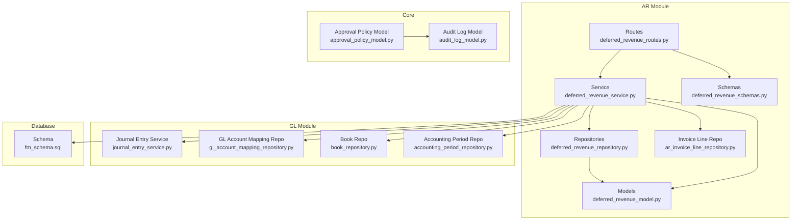
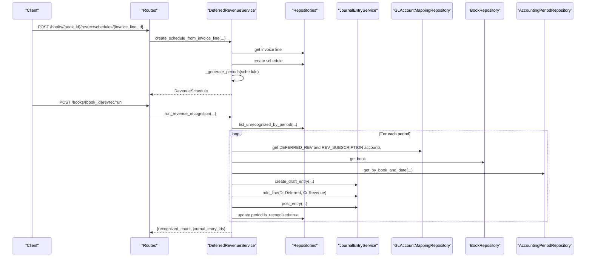
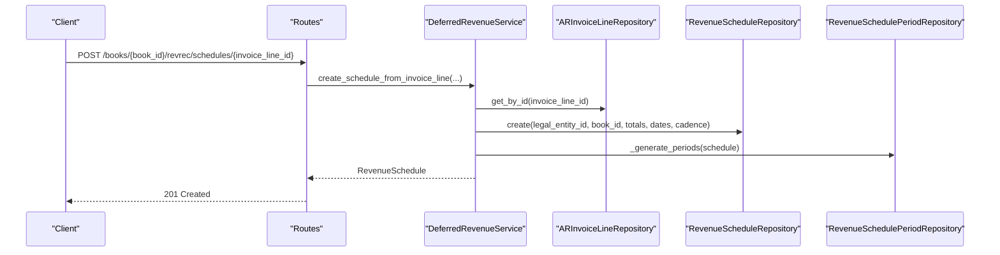
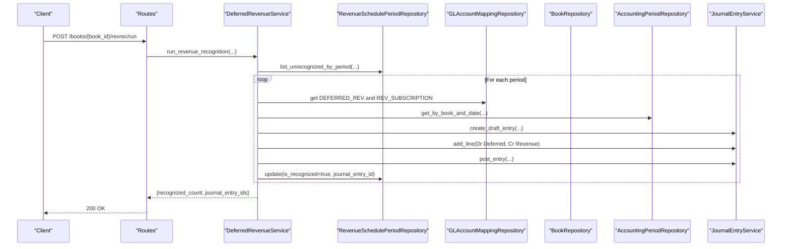
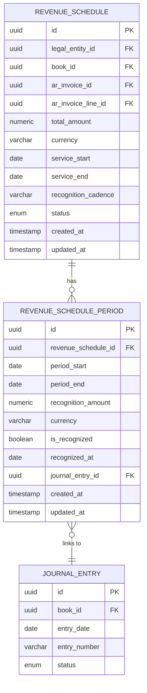
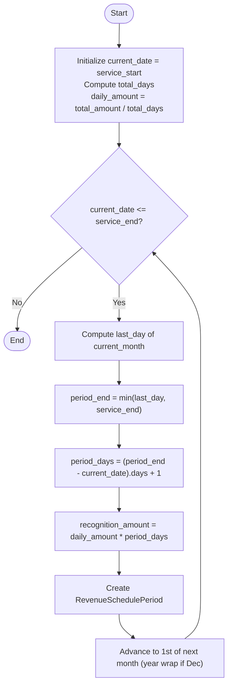
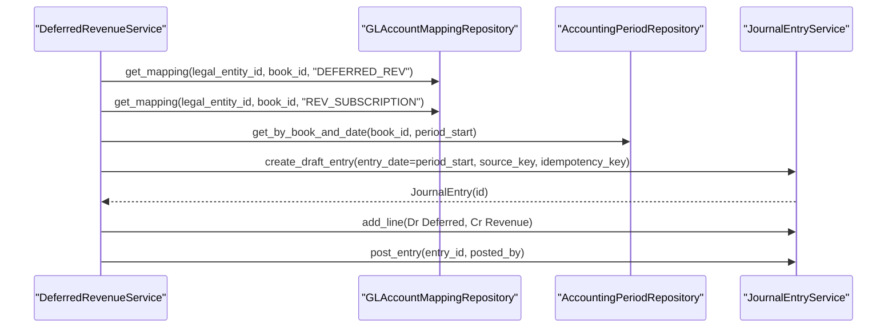
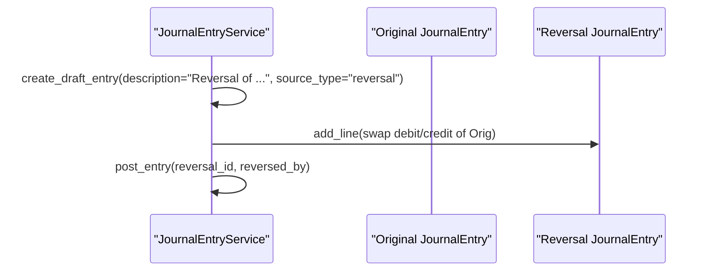
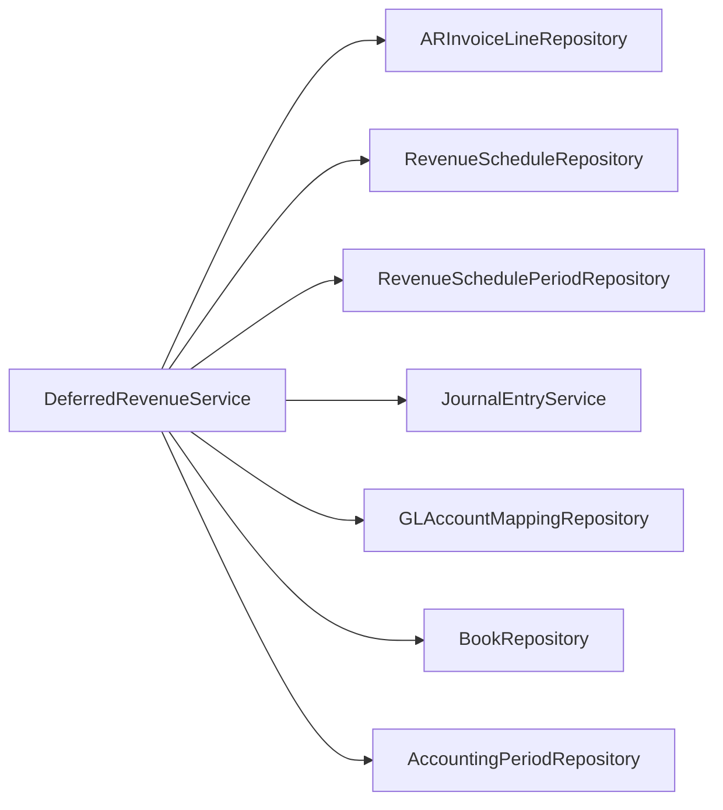

# Deferred Revenue API

<cite>
**Referenced Files in This Document**
- [deferred_revenue_routes.py](file://app/modules/ar/api/routes/deferred_revenue_routes.py)
- [deferred_revenue_service.py](file://app/modules/ar/services/deferred_revenue_service.py)
- [deferred_revenue_model.py](file://app/modules/ar/models/deferred_revenue_model.py)
- [deferred_revenue_schemas.py](file://app/modules/ar/schemas/deferred_revenue_schemas.py)
- [deferred_revenue_repository.py](file://app/modules/ar/repositories/deferred_revenue_repository.py)
- [ar_invoice_model.py](file://app/modules/ar/models/ar_invoice_model.py)
- [ar_invoice_line_repository.py](file://app/modules/ar/repositories/ar_invoice_line_repository.py)
- [journal_entry_service.py](file://app/modules/general_ledger/services/journal_entry_service.py)
- [journal_entry_routes.py](file://app/modules/general_ledger/api/routes/journal_entry_routes.py)
- [gl_account_mapping_repository.py](file://app/modules/general_ledger/repositories/gl_account_mapping_repository.py)
- [book_repository.py](file://app/modules/general_ledger/repositories/book_repository.py)
- [accounting_period_repository.py](file://app/modules/general_ledger/repositories/accounting_period_repository.py)
- [approval_policy_model.py](file://app/modules/core/models/approval_policy_model.py)
- [audit_log_model.py](file://app/modules/core/models/audit_log_model.py)
- [fm_schema.sql](file://database/fm_schema.sql)
</cite>

## Table of Contents
1. [Introduction](#introduction)
2. [Project Structure](#project-structure)
3. [Core Components](#core-components)
4. [Architecture Overview](#architecture-overview)
5. [Detailed Component Analysis](#detailed-component-analysis)
6. [Dependency Analysis](#dependency-analysis)
7. [Performance Considerations](#performance-considerations)
8. [Troubleshooting Guide](#troubleshooting-guide)
9. [Conclusion](#conclusion)
10. [Appendices](#appendices)

## Introduction
This document provides comprehensive API documentation for Deferred Revenue endpoints. It covers revenue recognition schedules, booking entries, and adjustments. It details deferral calculations, monthly allocations, and reversal operations. It also documents revenue classification, contract terms, and recognition timing, with examples of subscription billing, multi-year contracts, and revenue smoothing. Finally, it outlines approval workflows and audit requirements for revenue adjustments.

## Project Structure
The Deferred Revenue feature spans the Accounts Receivable (AR) module with supporting services from General Ledger (GL). The routes expose endpoints under a dedicated tag, backed by services that orchestrate schedule creation, period generation, and journal entry posting. Supporting repositories and models define the persistence layer for schedules and periods.

**Diagram sources**
- [deferred_revenue_routes.py](file://app/modules/ar/api/routes/deferred_revenue_routes.py#L1-L75)
- [deferred_revenue_service.py](file://app/modules/ar/services/deferred_revenue_service.py#L1-L241)
- [deferred_revenue_model.py](file://app/modules/ar/models/deferred_revenue_model.py#L1-L71)
- [deferred_revenue_schemas.py](file://app/modules/ar/schemas/deferred_revenue_schemas.py#L1-L53)
- [deferred_revenue_repository.py](file://app/modules/ar/repositories/deferred_revenue_repository.py#L1-L80)
- [ar_invoice_line_repository.py](file://app/modules/ar/repositories/ar_invoice_line_repository.py#L1-L24)
- [journal_entry_service.py](file://app/modules/general_ledger/services/journal_entry_service.py#L265-L295)
- [gl_account_mapping_repository.py](file://app/modules/general_ledger/repositories/gl_account_mapping_repository.py)
- [book_repository.py](file://app/modules/general_ledger/repositories/book_repository.py)
- [accounting_period_repository.py](file://app/modules/general_ledger/repositories/accounting_period_repository.py)
- [approval_policy_model.py](file://app/modules/core/models/approval_policy_model.py#L1-L36)
- [audit_log_model.py](file://app/modules/core/models/audit_log_model.py#L1-L43)
- [fm_schema.sql](file://database/fm_schema.sql#L426-L446)

**Section sources**
- [deferred_revenue_routes.py](file://app/modules/ar/api/routes/deferred_revenue_routes.py#L1-L75)
- [deferred_revenue_service.py](file://app/modules/ar/services/deferred_revenue_service.py#L1-L241)
- [deferred_revenue_model.py](file://app/modules/ar/models/deferred_revenue_model.py#L1-L71)
- [deferred_revenue_schemas.py](file://app/modules/ar/schemas/deferred_revenue_schemas.py#L1-L53)
- [deferred_revenue_repository.py](file://app/modules/ar/repositories/deferred_revenue_repository.py#L1-L80)
- [ar_invoice_model.py](file://app/modules/ar/models/ar_invoice_model.py#L1-L81)
- [journal_entry_service.py](file://app/modules/general_ledger/services/journal_entry_service.py#L265-L295)
- [approval_policy_model.py](file://app/modules/core/models/approval_policy_model.py#L1-L36)
- [audit_log_model.py](file://app/modules/core/models/audit_log_model.py#L1-L43)
- [fm_schema.sql](file://database/fm_schema.sql#L426-L446)

## Core Components
- Routes: Expose endpoints for creating revenue schedules from invoice lines, listing schedules by book, and running revenue recognition for a period.
- Service: Implements business logic for schedule creation, monthly period generation, and posting recognition entries.
- Models: Define RevenueSchedule and RevenueSchedulePeriod entities with relationships and constraints.
- Repositories: Provide CRUD and query operations for schedules and periods.
- Schemas: Define request/response models for API contracts.
- Integrations: Use GL services for journal entries, GL account mappings, books, and accounting periods.

Key capabilities:
- Convert invoice lines with service periods into revenue schedules.
- Generate monthly recognition periods with prorated amounts.
- Post journal entries to recognize revenue and reduce deferred revenue.
- Retrieve schedules and periods for reporting and reconciliation.

**Section sources**
- [deferred_revenue_routes.py](file://app/modules/ar/api/routes/deferred_revenue_routes.py#L19-L75)
- [deferred_revenue_service.py](file://app/modules/ar/services/deferred_revenue_service.py#L37-L241)
- [deferred_revenue_model.py](file://app/modules/ar/models/deferred_revenue_model.py#L17-L71)
- [deferred_revenue_repository.py](file://app/modules/ar/repositories/deferred_revenue_repository.py#L15-L80)
- [deferred_revenue_schemas.py](file://app/modules/ar/schemas/deferred_revenue_schemas.py#L9-L53)

## Architecture Overview
The Deferred Revenue API follows a layered architecture:
- API Layer: FastAPI routes handle requests and responses.
- Service Layer: Orchestrates domain logic, validations, and integrations.
- Repository Layer: Encapsulates data access patterns.
- Persistence Layer: SQLAlchemy models mapped to database tables.
- Integrations: Journal entry creation, posting, and GL account mapping.

**Diagram sources**
- [deferred_revenue_routes.py](file://app/modules/ar/api/routes/deferred_revenue_routes.py#L19-L75)
- [deferred_revenue_service.py](file://app/modules/ar/services/deferred_revenue_service.py#L37-L241)
- [journal_entry_service.py](file://app/modules/general_ledger/services/journal_entry_service.py#L265-L295)
- [gl_account_mapping_repository.py](file://app/modules/general_ledger/repositories/gl_account_mapping_repository.py)
- [book_repository.py](file://app/modules/general_ledger/repositories/book_repository.py)
- [accounting_period_repository.py](file://app/modules/general_ledger/repositories/accounting_period_repository.py)

## Detailed Component Analysis

### API Endpoints

#### Create Revenue Schedule from Invoice Line
- Method: POST
- Path: /books/{book_id}/revrec/schedules/{invoice_line_id}
- Purpose: Build a revenue schedule from a deferrable invoice line with service start/end dates.
- Validation:
  - Invoice line must be marked deferrable.
  - Invoice line must include service_start and service_end.
  - Prevents duplicate schedules for the same invoice line.
- Behavior:
  - Creates a RevenueSchedule with total_amount equal to line_amount.
  - Generates monthly RevenueSchedulePeriod entries with prorated recognition amounts.
  - Commits transaction and returns the created schedule.

**Diagram sources**
- [deferred_revenue_routes.py](file://app/modules/ar/api/routes/deferred_revenue_routes.py#L19-L37)
- [deferred_revenue_service.py](file://app/modules/ar/services/deferred_revenue_service.py#L37-L84)
- [deferred_revenue_repository.py](file://app/modules/ar/repositories/deferred_revenue_repository.py#L15-L42)

**Section sources**
- [deferred_revenue_routes.py](file://app/modules/ar/api/routes/deferred_revenue_routes.py#L19-L37)
- [deferred_revenue_service.py](file://app/modules/ar/services/deferred_revenue_service.py#L37-L84)
- [ar_invoice_model.py](file://app/modules/ar/models/ar_invoice_model.py#L54-L81)

#### List Revenue Schedules by Book
- Method: GET
- Path: /books/{book_id}/revrec/schedules
- Purpose: Retrieve all active revenue schedules for a given book.
- Response: Array of RevenueScheduleResponse.

**Section sources**
- [deferred_revenue_routes.py](file://app/modules/ar/api/routes/deferred_revenue_routes.py#L39-L47)
- [deferred_revenue_repository.py](file://app/modules/ar/repositories/deferred_revenue_repository.py#L28-L41)

#### Run Revenue Recognition for a Period
- Method: POST
- Path: /books/{book_id}/revrec/run
- Purpose: Recognize revenue for all unrecognized periods within a specified date range for a given book.
- Request body: RevenueRecognitionRequest (period_start, period_end, posted_by).
- Behavior:
  - Fetch unrecognized periods within the date range.
  - Filter by book using schedule associations.
  - For each eligible period:
    - Resolve GL accounts (Deferred Revenue and Revenue).
    - Determine accounting period for the period_start.
    - Create a draft journal entry with source_key and idempotency_key.
    - Add debit to Deferred Revenue and credit to Revenue.
    - Post the journal entry.
    - Update period to recognized with journal_entry_id.
- Response: JSON with recognized_count, journal_entry_ids, and period bounds.

**Diagram sources**
- [deferred_revenue_routes.py](file://app/modules/ar/api/routes/deferred_revenue_routes.py#L50-L75)
- [deferred_revenue_service.py](file://app/modules/ar/services/deferred_revenue_service.py#L119-L165)
- [journal_entry_service.py](file://app/modules/general_ledger/services/journal_entry_service.py#L265-L295)

**Section sources**
- [deferred_revenue_routes.py](file://app/modules/ar/api/routes/deferred_revenue_routes.py#L50-L75)
- [deferred_revenue_service.py](file://app/modules/ar/services/deferred_revenue_service.py#L119-L165)

### Data Models and Schemas

#### RevenueSchedule and RevenueSchedulePeriod
- RevenueSchedule captures the deferral lifecycle: legal_entity_id, book_id, invoice linkage, totals, currency, service period, cadence, and status.
- RevenueSchedulePeriod captures monthly slices with recognition_amount, currency, recognition flag, and optional journal_entry_id.

**Diagram sources**
- [deferred_revenue_model.py](file://app/modules/ar/models/deferred_revenue_model.py#L17-L71)
- [fm_schema.sql](file://database/fm_schema.sql#L426-L446)

**Section sources**
- [deferred_revenue_model.py](file://app/modules/ar/models/deferred_revenue_model.py#L17-L71)
- [fm_schema.sql](file://database/fm_schema.sql#L426-L446)

#### API Schemas
- RevenueRecognitionRequest: period_start, period_end, posted_by.
- RevenueScheduleResponse: schedule metadata and timestamps.
- RevenueSchedulePeriodResponse: period metadata and optional journal linkage.

**Section sources**
- [deferred_revenue_schemas.py](file://app/modules/ar/schemas/deferred_revenue_schemas.py#L9-L53)

### Deferral Calculations and Monthly Allocation
- Daily rate calculation: total_amount divided by number of days in the service period (inclusive).
- For each month:
  - Compute last day of the month.
  - Cap period_end to service_end if exceeding.
  - Days in period = (period_end - current_date).days + 1.
  - Recognition amount = daily_rate × days_in_period.
  - Advance to next month (or year rollover).

**Diagram sources**
- [deferred_revenue_service.py](file://app/modules/ar/services/deferred_revenue_service.py#L86-L118)

**Section sources**
- [deferred_revenue_service.py](file://app/modules/ar/services/deferred_revenue_service.py#L86-L118)

### Revenue Recognition Booking Entries
- Journal entry creation:
  - Entry date: period_start.
  - Description and reference number include invoice number and period.
  - Source metadata identifies origin (fm, revenue_recognition).
  - Idempotency key prevents duplicate postings.
- Lines:
  - Debit: Deferred Revenue (from mapping).
  - Credit: Revenue (from mapping).
- Posting:
  - Uses GL service to post the entry with posted_by.

**Diagram sources**
- [deferred_revenue_service.py](file://app/modules/ar/services/deferred_revenue_service.py#L167-L228)
- [journal_entry_service.py](file://app/modules/general_ledger/services/journal_entry_service.py#L265-L295)

**Section sources**
- [deferred_revenue_service.py](file://app/modules/ar/services/deferred_revenue_service.py#L167-L228)

### Reversal Operations
- Reversal process:
  - Create a reversal journal entry on or before the reversal_date.
  - Copy original lines and swap debit/credit amounts.
  - Post the reversal entry.
- This pattern is consistent with general ledger reversal handling.

**Diagram sources**
- [journal_entry_routes.py](file://app/modules/general_ledger/api/routes/journal_entry_routes.py#L208-L246)
- [journal_entry_service.py](file://app/modules/general_ledger/services/journal_entry_service.py#L265-L295)

**Section sources**
- [journal_entry_routes.py](file://app/modules/general_ledger/api/routes/journal_entry_routes.py#L208-L246)
- [journal_entry_service.py](file://app/modules/general_ledger/services/journal_entry_service.py#L265-L295)

### Revenue Classification, Contract Terms, and Recognition Timing
- Classification:
  - Deferred Revenue (asset-like liability) vs. Revenue accounts are mapped via GL account mappings.
- Contract terms:
  - Service period boundaries (service_start, service_end) define the deferral window.
  - is_deferrable flag on invoice lines indicates eligibility for deferral.
- Recognition timing:
  - Monthly recognition aligned to the service period.
  - Recognition occurs on the first day of each month slice, with proration for partial months.

**Section sources**
- [ar_invoice_model.py](file://app/modules/ar/models/ar_invoice_model.py#L54-L81)
- [deferred_revenue_model.py](file://app/modules/ar/models/deferred_revenue_model.py#L17-L71)
- [deferred_revenue_service.py](file://app/modules/ar/services/deferred_revenue_service.py#L86-L118)

### Examples

#### Subscription Billing (Monthly Recurring)
- Scenario: Invoice line with service_start=2025-01-01, service_end=2025-12-31, is_deferrable=true.
- Outcome:
  - One schedule created for the year.
  - Twelve monthly periods generated with prorated amounts.
  - Monthly recognition posts twelve journal entries.

#### Multi-Year Contracts
- Scenario: service_start=2025-03-15, service_end=2027-06-30.
- Outcome:
  - Schedule spans 30 months.
  - First and last months are partially recognized.
  - Yearly rollovers handled in period generation.

#### Revenue Smoothing
- The monthly allocation method inherently smooths total_amount across the service period by daily rate × days in period.
- Partial-month alignment ensures proportional recognition.

**Section sources**
- [deferred_revenue_service.py](file://app/modules/ar/services/deferred_revenue_service.py#L86-L118)

### Approval Workflows and Audit Requirements
- Approval policies:
  - ApprovalObjectType includes REC_ADJUSTMENT_BATCH for revenue adjustments.
  - Entities can configure whether approval is required per object type.
- Audit logging:
  - Actions include REC_ADJUSTMENT_SUBMIT, REC_ADJUSTMENT_APPROVE, REC_ADJUSTMENT_REJECT, and JE_POST for postings.
  - Logs include before_json and after_json for state transitions.
- Deferred Revenue posting:
  - While the revrec run endpoint posts journal entries, explicit approval endpoints for revenue recognition are not present in the reviewed files.
  - If approvals are required, integrate with the core approval framework and ensure audit logs capture state changes.

Note: The current Deferred Revenue API endpoints post entries directly. If an approval step is mandated, introduce endpoints similar to other workflows (submit-for-approval, approve, reject) and enforce separation of duties.

**Section sources**
- [approval_policy_model.py](file://app/modules/core/models/approval_policy_model.py#L9-L16)
- [audit_log_model.py](file://app/modules/core/models/audit_log_model.py#L9-L43)
- [ADDENDUM_D_ENGINEERING_RULES.md](file://docs/01-main/ADDENDUM_D_ENGINEERING_RULES.md#L154-L163)

## Dependency Analysis
The Deferred Revenue service depends on:
- AR invoice line repository for validation and metadata.
- Revenue schedule and period repositories for persistence.
- General Ledger services for journal entries, GL account mappings, books, and accounting periods.

**Diagram sources**
- [deferred_revenue_service.py](file://app/modules/ar/services/deferred_revenue_service.py#L8-L36)

**Section sources**
- [deferred_revenue_service.py](file://app/modules/ar/services/deferred_revenue_service.py#L8-L36)

## Performance Considerations
- Batch processing: The run endpoint iterates unrecognized periods; ensure date ranges are scoped to minimize workload.
- Idempotency: Source keys and idempotency keys prevent duplicate postings, reducing retries and reprocessing.
- Proration precision: Using Decimal arithmetic and inclusive day counts maintains accuracy across partial months.
- Indexing: Existing indices on schedule and period tables support filtering by book, status, and date ranges.

## Troubleshooting Guide
Common issues and resolutions:
- Not found errors:
  - Invoice line not found or missing service dates.
  - No accounting period for the recognition date.
- Validation errors:
  - Invoice line not marked deferrable.
  - Missing service_start/service_end on deferrable lines.
- Posting failures:
  - Missing GL account mappings for Deferred Revenue or Revenue.
  - Period already recognized; verify is_recognized flag and journal linkage.
- Audit and approvals:
  - If approvals are required, ensure proper submission and approval steps are followed and audit logs capture state transitions.

**Section sources**
- [deferred_revenue_service.py](file://app/modules/ar/services/deferred_revenue_service.py#L44-L59)
- [deferred_revenue_service.py](file://app/modules/ar/services/deferred_revenue_service.py#L194-L195)
- [deferred_revenue_service.py](file://app/modules/ar/services/deferred_revenue_service.py#L237-L240)

## Conclusion
The Deferred Revenue API provides a robust mechanism to convert deferrable invoice lines into revenue schedules, allocate revenue monthly with proration, and post journal entries to recognize income. The design leverages GL integrations for accurate accounting and supports future approval workflows and audit requirements. Extending the system with explicit approval endpoints and comprehensive audit logging will further strengthen controls around revenue adjustments.

## Appendices

### API Reference Summary

- POST /books/{book_id}/revrec/schedules/{invoice_line_id}
  - Description: Create revenue schedule from invoice line.
  - Success: 201 Created with schedule details.
  - Errors: 400 Validation, 404 Not Found.

- GET /books/{book_id}/revrec/schedules
  - Description: List active schedules for a book.
  - Success: 200 OK with array of schedules.

- POST /books/{book_id}/revrec/run
  - Description: Run revenue recognition for a period.
  - Success: 200 OK with recognized_count and journal_entry_ids.
  - Errors: 400 Validation, 404 Not Found.

**Section sources**
- [deferred_revenue_routes.py](file://app/modules/ar/api/routes/deferred_revenue_routes.py#L19-L75)