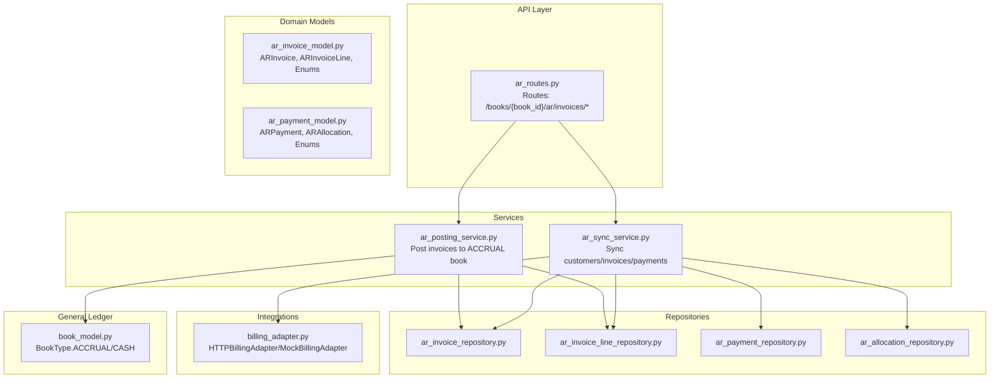
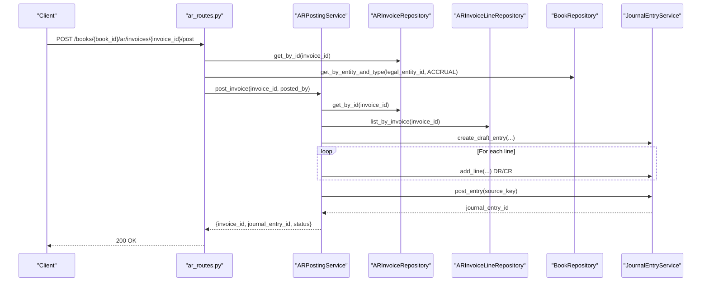
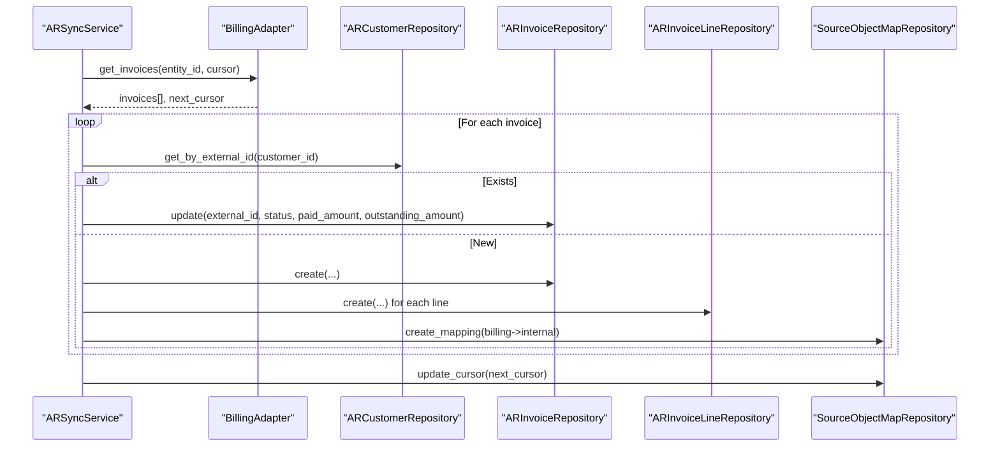
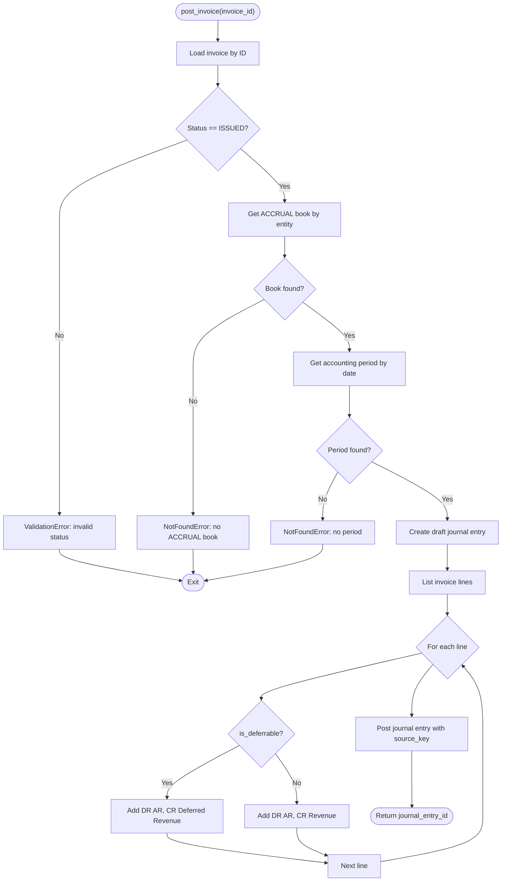
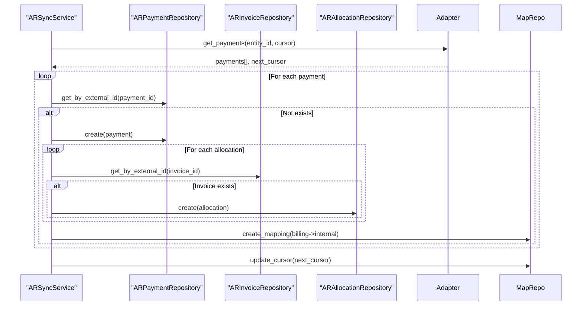
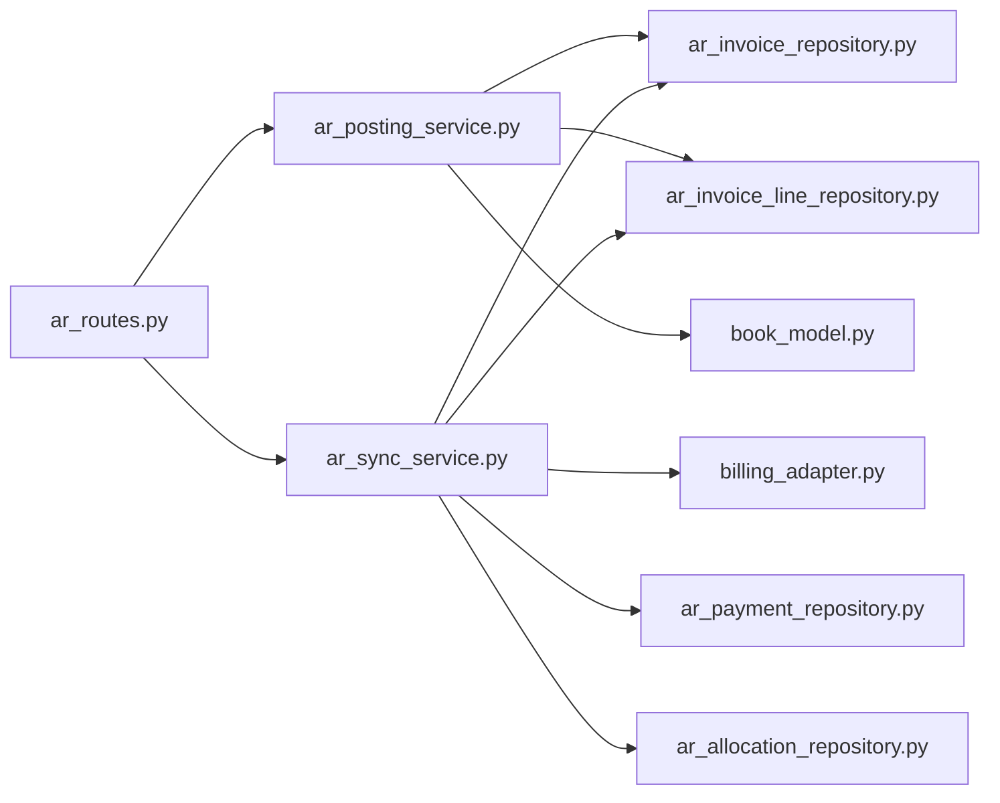

# Invoice Processing API

<cite>
**Referenced Files in This Document**
- [ar_routes.py](file://app/modules/ar/api/routes/ar_routes.py)
- [ar_invoice_model.py](file://app/modules/ar/models/ar_invoice_model.py)
- [ar_invoice_repository.py](file://app/modules/ar/repositories/ar_invoice_repository.py)
- [ar_invoice_line_repository.py](file://app/modules/ar/repositories/ar_invoice_line_repository.py)
- [ar_payment_model.py](file://app/modules/ar/models/ar_payment_model.py)
- [ar_allocation_repository.py](file://app/modules/ar/repositories/ar_allocation_repository.py)
- [ar_payment_repository.py](file://app/modules/ar/repositories/ar_payment_repository.py)
- [ar_posting_service.py](file://app/modules/ar/services/ar_posting_service.py)
- [ar_sync_service.py](file://app/modules/ar/services/ar_sync_service.py)
- [billing_adapter.py](file://app/modules/ar/integrations/billing_adapter.py)
- [book_model.py](file://app/modules/general_ledger/models/book_model.py)
- [FM_Service_Detailed_Implementation_Guide.md](file://docs/01-main/FM_Service_Detailed_Implementation_Guide.md)
</cite>

## Table of Contents
1. [Introduction](#introduction)
2. [Project Structure](#project-structure)
3. [Core Components](#core-components)
4. [Architecture Overview](#architecture-overview)
5. [Detailed Component Analysis](#detailed-component-analysis)
6. [Dependency Analysis](#dependency-analysis)
7. [Performance Considerations](#performance-considerations)
8. [Troubleshooting Guide](#troubleshooting-guide)
9. [Conclusion](#conclusion)
10. [Appendices](#appendices)

## Introduction
This document provides comprehensive API documentation for Accounts Receivable (AR) invoice processing. It covers invoice creation via external system synchronization, invoice posting to the accrual book, payment allocation against invoices, and status tracking. It also documents invoice line items, currency handling, validation rules, and error handling. Examples of complex invoices, partial payments, and credit memos are included conceptually, along with invoice numbering and approval workflow references.

## Project Structure
The AR invoice processing functionality is organized around models, repositories, services, and API routes. The system integrates with an external Billing service through an adapter and synchronizes customers, invoices, and payments. Posting to the general ledger is handled by a dedicated posting service that creates journal entries and applies account mappings.

**Diagram sources**
- [ar_routes.py](file://app/modules/ar/api/routes/ar_routes.py#L1-L178)
- [ar_invoice_model.py](file://app/modules/ar/models/ar_invoice_model.py#L1-L81)
- [ar_payment_model.py](file://app/modules/ar/models/ar_payment_model.py#L1-L70)
- [ar_invoice_repository.py](file://app/modules/ar/repositories/ar_invoice_repository.py#L1-L59)
- [ar_invoice_line_repository.py](file://app/modules/ar/repositories/ar_invoice_line_repository.py#L1-L24)
- [ar_payment_repository.py](file://app/modules/ar/repositories/ar_payment_repository.py#L1-L21)
- [ar_allocation_repository.py](file://app/modules/ar/repositories/ar_allocation_repository.py#L1-L31)
- [ar_sync_service.py](file://app/modules/ar/services/ar_sync_service.py#L1-L325)
- [ar_posting_service.py](file://app/modules/ar/services/ar_posting_service.py#L1-L154)
- [billing_adapter.py](file://app/modules/ar/integrations/billing_adapter.py#L1-L191)
- [book_model.py](file://app/modules/general_ledger/models/book_model.py#L1-L36)

**Section sources**
- [ar_routes.py](file://app/modules/ar/api/routes/ar_routes.py#L1-L178)
- [ar_sync_service.py](file://app/modules/ar/services/ar_sync_service.py#L1-L325)
- [ar_posting_service.py](file://app/modules/ar/services/ar_posting_service.py#L1-L154)
- [billing_adapter.py](file://app/modules/ar/integrations/billing_adapter.py#L1-L191)
- [book_model.py](file://app/modules/general_ledger/models/book_model.py#L1-L36)

## Core Components
- Invoice model and statuses define lifecycle and financial fields.
- Repositories encapsulate persistence operations for invoices, lines, payments, and allocations.
- Services orchestrate synchronization from the Billing service and posting to the general ledger.
- API routes expose endpoints for invoice listing, customer balances, aging reports, and invoice posting.
- Integrations connect to the external Billing service via an adapter abstraction.

**Section sources**
- [ar_invoice_model.py](file://app/modules/ar/models/ar_invoice_model.py#L10-L81)
- [ar_invoice_repository.py](file://app/modules/ar/repositories/ar_invoice_repository.py#L11-L59)
- [ar_invoice_line_repository.py](file://app/modules/ar/repositories/ar_invoice_line_repository.py#L10-L24)
- [ar_payment_model.py](file://app/modules/ar/models/ar_payment_model.py#L10-L70)
- [ar_allocation_repository.py](file://app/modules/ar/repositories/ar_allocation_repository.py#L10-L31)
- [ar_sync_service.py](file://app/modules/ar/services/ar_sync_service.py#L23-L325)
- [ar_posting_service.py](file://app/modules/ar/services/ar_posting_service.py#L17-L154)
- [ar_routes.py](file://app/modules/ar/api/routes/ar_routes.py#L16-L178)
- [billing_adapter.py](file://app/modules/ar/integrations/billing_adapter.py#L8-L191)

## Architecture Overview
The AR invoice processing architecture follows a layered pattern:
- API routes accept requests and enforce idempotency.
- Services coordinate domain operations, including synchronization and posting.
- Repositories manage persistence.
- Integrations handle external system communication.
- General ledger services create journal entries for posted invoices.

**Diagram sources**
- [ar_routes.py](file://app/modules/ar/api/routes/ar_routes.py#L19-L75)
- [ar_posting_service.py](file://app/modules/ar/services/ar_posting_service.py#L28-L141)
- [ar_invoice_repository.py](file://app/modules/ar/repositories/ar_invoice_repository.py#L11-L16)
- [ar_invoice_line_repository.py](file://app/modules/ar/repositories/ar_invoice_line_repository.py#L16-L23)
- [book_model.py](file://app/modules/general_ledger/models/book_model.py#L9-L12)

## Detailed Component Analysis

### Invoice Creation and Synchronization
- The system synchronizes invoices from an external Billing service using an adapter.
- On creation, invoice lines are created with line numbers, quantities, unit prices, amounts, currencies, and optional service periods.
- Currency is stored per invoice and per line; totals are computed and tracked.

**Diagram sources**
- [ar_sync_service.py](file://app/modules/ar/services/ar_sync_service.py#L112-L202)
- [billing_adapter.py](file://app/modules/ar/integrations/billing_adapter.py#L24-L58)
- [ar_invoice_repository.py](file://app/modules/ar/repositories/ar_invoice_repository.py#L17-L22)
- [ar_invoice_line_repository.py](file://app/modules/ar/repositories/ar_invoice_line_repository.py#L16-L23)

**Section sources**
- [ar_sync_service.py](file://app/modules/ar/services/ar_sync_service.py#L112-L202)
- [ar_invoice_model.py](file://app/modules/ar/models/ar_invoice_model.py#L21-L81)
- [billing_adapter.py](file://app/modules/ar/integrations/billing_adapter.py#L24-L58)

### Invoice Posting to Accrual Book
- Posting validates invoice status and ensures the ACCRUAL book exists for the legal entity.
- It retrieves the accounting period for the invoice date and applies GL account mappings.
- Journal entries are created with DR AR and CR Revenue or Deferred Revenue depending on line deferral.
- Posting uses a source key derived from external invoice ID or internal ID.

**Diagram sources**
- [ar_posting_service.py](file://app/modules/ar/services/ar_posting_service.py#L28-L141)
- [book_model.py](file://app/modules/general_ledger/models/book_model.py#L9-L12)

**Section sources**
- [ar_posting_service.py](file://app/modules/ar/services/ar_posting_service.py#L28-L141)
- [ar_routes.py](file://app/modules/ar/api/routes/ar_routes.py#L19-L75)

### Payment Allocation and Partial Payments
- Payments are synchronized from the Billing service and mapped to customers.
- Allocations link payments to invoices with allocated amounts, currency, and allocation dates.
- Partial payments allocate portions of a payment to one or more invoices; remaining outstanding reflects unallocated amounts.

**Diagram sources**
- [ar_sync_service.py](file://app/modules/ar/services/ar_sync_service.py#L232-L308)
- [ar_payment_repository.py](file://app/modules/ar/repositories/ar_payment_repository.py#L15-L20)
- [ar_allocation_repository.py](file://app/modules/ar/repositories/ar_allocation_repository.py#L16-L30)

**Section sources**
- [ar_sync_service.py](file://app/modules/ar/services/ar_sync_service.py#L232-L308)
- [ar_payment_model.py](file://app/modules/ar/models/ar_payment_model.py#L19-L70)
- [ar_allocation_repository.py](file://app/modules/ar/repositories/ar_allocation_repository.py#L10-L31)

### Credit Memos
- Credit memos are represented as negative allocations or adjustments in the external Billing service payload.
- On synchronization, allocations with negative amounts or memo types are persisted and reflected in outstanding balances.
- Posting logic treats credit memos similarly to payments, allocating against invoices and updating statuses accordingly.

[No sources needed since this section provides conceptual guidance]

### Invoice Status Tracking and Validation
- Invoice statuses include draft, issued, paid, partially_paid, overdue, cancelled, refunded.
- Posting validation enforces that only invoices with status “issued” can be posted.
- Currency is enforced per invoice and per line; totals are validated during synchronization and posting.

**Section sources**
- [ar_invoice_model.py](file://app/modules/ar/models/ar_invoice_model.py#L10-L18)
- [ar_posting_service.py](file://app/modules/ar/services/ar_posting_service.py#L38-L39)

### Invoice Numbering and Validation Rules
- Invoice numbers are unique per entity and indexed for fast lookup.
- Validation rules include:
  - Unique external invoice ID mapping.
  - Required invoice date, due date (optional), total amount, currency.
  - Outstanding amount equals total minus paid amount.
  - Line uniqueness by invoice and line number.

**Section sources**
- [ar_invoice_model.py](file://app/modules/ar/models/ar_invoice_model.py#L21-L48)
- [ar_invoice_line_repository.py](file://app/modules/ar/repositories/ar_invoice_line_repository.py#L16-L23)

### Approval Workflows
- Approval workflows are configured per legal entity and object type in the core module.
- While AR invoice posting is exposed via API, approval policies are managed centrally and can gate posting actions in broader contexts.

**Section sources**
- [FM_Service_Detailed_Implementation_Guide.md](file://docs/01-main/FM_Service_Detailed_Implementation_Guide.md#L1180-L1245)

## Dependency Analysis
The AR invoice processing stack exhibits clear separation of concerns:
- Routes depend on repositories and services.
- Services depend on repositories and general ledger services.
- Repositories depend on SQLAlchemy ORM and shared base repository.
- Integrations depend on configuration and HTTP client libraries.

**Diagram sources**
- [ar_routes.py](file://app/modules/ar/api/routes/ar_routes.py#L1-L178)
- [ar_posting_service.py](file://app/modules/ar/services/ar_posting_service.py#L1-L154)
- [ar_sync_service.py](file://app/modules/ar/services/ar_sync_service.py#L1-L325)
- [billing_adapter.py](file://app/modules/ar/integrations/billing_adapter.py#L1-L191)
- [ar_invoice_repository.py](file://app/modules/ar/repositories/ar_invoice_repository.py#L1-L59)
- [ar_invoice_line_repository.py](file://app/modules/ar/repositories/ar_invoice_line_repository.py#L1-L24)
- [ar_payment_repository.py](file://app/modules/ar/repositories/ar_payment_repository.py#L1-L21)
- [ar_allocation_repository.py](file://app/modules/ar/repositories/ar_allocation_repository.py#L1-L31)
- [book_model.py](file://app/modules/general_ledger/models/book_model.py#L1-L36)

**Section sources**
- [ar_routes.py](file://app/modules/ar/api/routes/ar_routes.py#L1-L178)
- [ar_posting_service.py](file://app/modules/ar/services/ar_posting_service.py#L1-L154)
- [ar_sync_service.py](file://app/modules/ar/services/ar_sync_service.py#L1-L325)
- [billing_adapter.py](file://app/modules/ar/integrations/billing_adapter.py#L1-L191)

## Performance Considerations
- Batch synchronization limits reduce load on the external Billing service and improve throughput.
- Cursor-based pagination ensures incremental syncs and reduces redundant processing.
- Indexes on invoice_number, external_invoice_id, and customer associations optimize lookups.
- Journal entry creation batches lines to minimize round-trips to the general ledger.

[No sources needed since this section provides general guidance]

## Troubleshooting Guide
Common issues and resolutions:
- Invoice not found: Ensure the invoice exists and belongs to the specified book; verify legal entity and book linkage.
- Invalid status for posting: Only invoices with status “issued” can be posted; update status before posting.
- No ACCRUAL book or accounting period: Confirm entity book configuration and period availability for the invoice date.
- Missing account mappings: Validate GL account mappings for AR and revenue/deferred revenue categories.
- Idempotency conflicts: Use the provided idempotency key to avoid duplicate postings.

**Section sources**
- [ar_routes.py](file://app/modules/ar/api/routes/ar_routes.py#L34-L44)
- [ar_posting_service.py](file://app/modules/ar/services/ar_posting_service.py#L34-L57)

## Conclusion
The AR invoice processing system provides robust capabilities for invoice synchronization, posting to the accrual book, and payment allocation. Its modular design supports scalability, maintainability, and integration with external systems. By adhering to validation rules, leveraging currency-aware models, and applying idempotent operations, the system ensures accurate financial reporting and reliable invoice lifecycle management.

## Appendices

### API Endpoints Summary
- List AR invoices under a book
- Get customer AR balance
- Generate AR aging report
- Post invoice to ACCRUAL book

Note: The API structure and endpoint definitions are documented in the project’s implementation guide.

**Section sources**
- [ar_routes.py](file://app/modules/ar/api/routes/ar_routes.py#L77-L178)
- [FM_Service_Detailed_Implementation_Guide.md](file://docs/01-main/FM_Service_Detailed_Implementation_Guide.md#L1180-L1245)