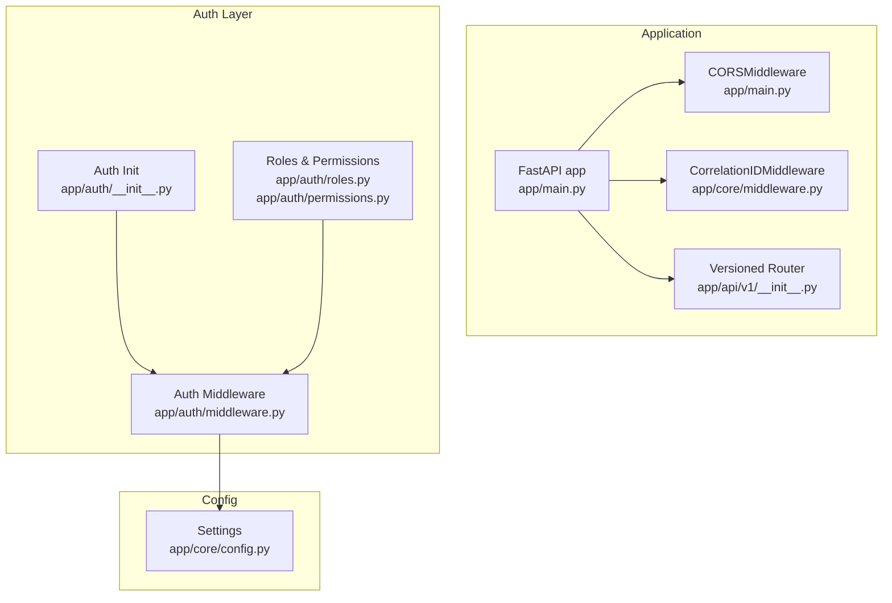
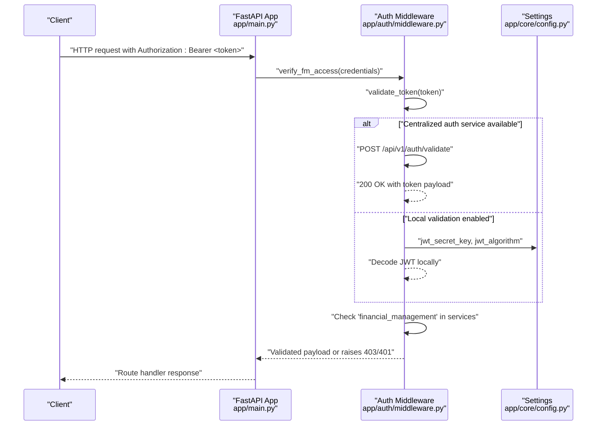
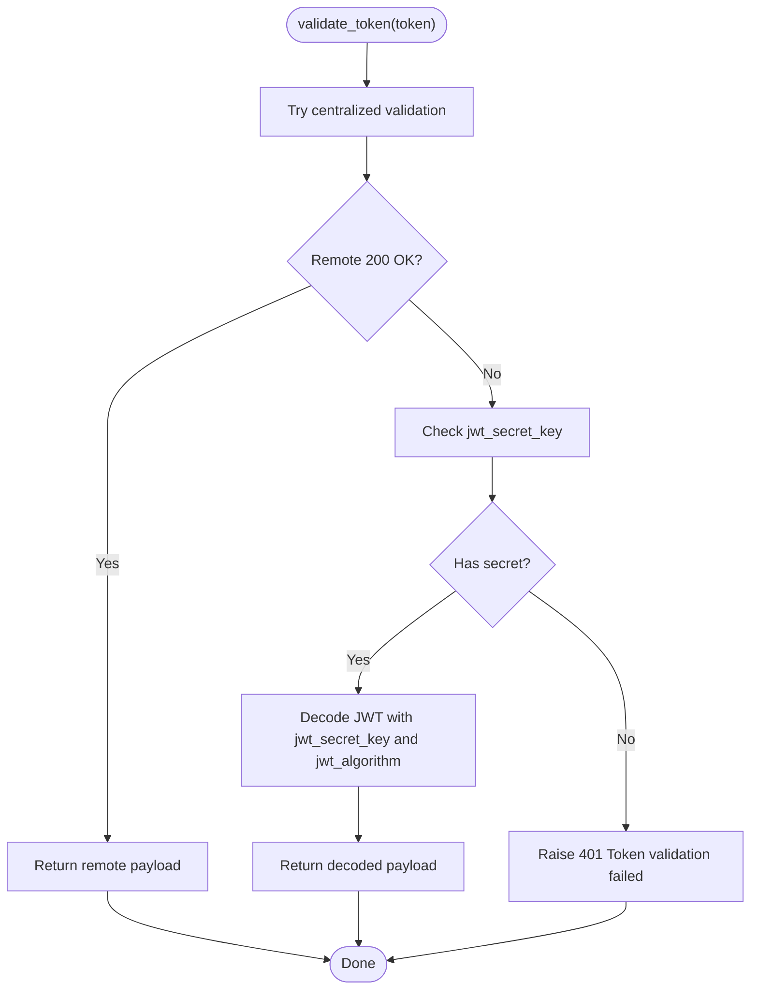
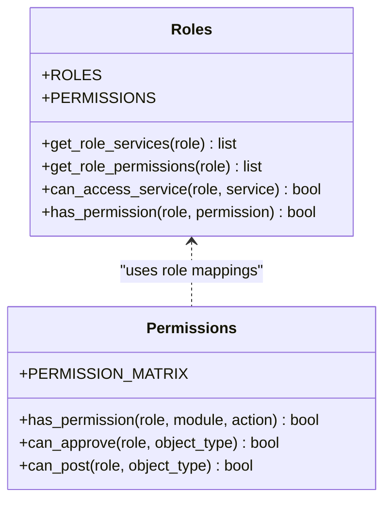
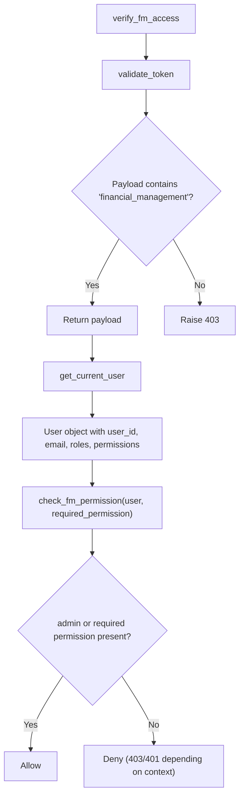
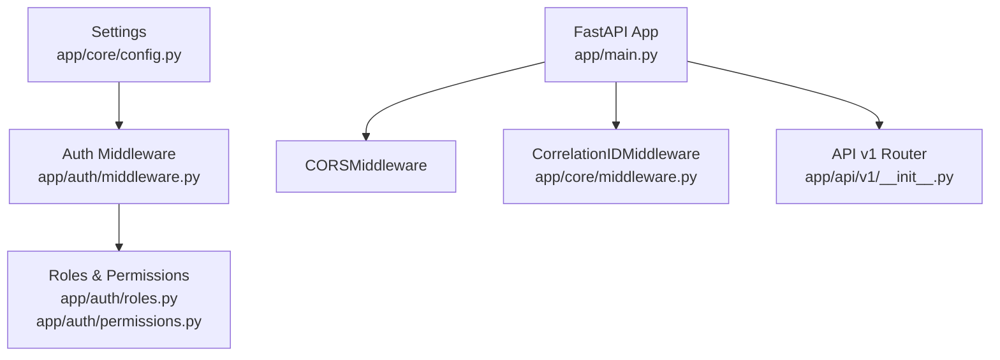

# Authentication & Authorization API

<cite>
**Referenced Files in This Document**
- [app/main.py](file://app/main.py)
- [app/core/config.py](file://app/core/config.py)
- [app/core/middleware.py](file://app/core/middleware.py)
- [app/auth/__init__.py](file://app/auth/__init__.py)
- [app/auth/middleware.py](file://app/auth/middleware.py)
- [app/auth/permissions.py](file://app/auth/permissions.py)
- [app/auth/roles.py](file://app/auth/roles.py)
- [app/api/v1/__init__.py](file://app/api/v1/__init__.py)
</cite>

## Table of Contents
1. [Introduction](#introduction)
2. [Project Structure](#project-structure)
3. [Core Components](#core-components)
4. [Architecture Overview](#architecture-overview)
5. [Detailed Component Analysis](#detailed-component-analysis)
6. [Dependency Analysis](#dependency-analysis)
7. [Performance Considerations](#performance-considerations)
8. [Troubleshooting Guide](#troubleshooting-guide)
9. [Conclusion](#conclusion)
10. [Appendices](#appendices)

## Introduction
This document describes the authentication and authorization model for the Financial Management Service. It focuses on how JWT tokens are validated, how access to the financial management service is enforced, and how role-based access control (RBAC) governs permissions across modules. It also documents the available middleware for protecting endpoints and outlines recommended patterns for integrating with the centralized authentication service.

The service relies on bearer tokens issued by a centralized authentication provider. On development environments, local JWT decoding is supported via a shared secret. Access to the financial management service is controlled by a dedicated service flag in the token payload, and fine-grained permissions are enforced per module and action.

## Project Structure
The authentication and authorization logic is implemented in dedicated modules and integrated into the FastAPI application via middleware and dependency injection. The API surface is organized under a versioned router and includes numerous domain-specific routes.

**Diagram sources**
- [app/main.py](file://app/main.py#L1-L54)
- [app/core/middleware.py](file://app/core/middleware.py#L1-L35)
- [app/api/v1/__init__.py](file://app/api/v1/__init__.py#L1-L72)
- [app/auth/__init__.py](file://app/auth/__init__.py#L1-L14)
- [app/auth/middleware.py](file://app/auth/middleware.py#L1-L140)
- [app/auth/roles.py](file://app/auth/roles.py#L1-L119)
- [app/auth/permissions.py](file://app/auth/permissions.py#L1-L127)
- [app/core/config.py](file://app/core/config.py#L1-L74)

**Section sources**
- [app/main.py](file://app/main.py#L1-L54)
- [app/api/v1/__init__.py](file://app/api/v1/__init__.py#L1-L72)

## Core Components
- Centralized JWT validation and service access enforcement
- User identity extraction and permission evaluation
- RBAC role definitions and permission matrices
- CORS and correlation ID middleware for observability

Key responsibilities:
- validate_token: Validates JWT against a centralized auth service or locally when configured.
- verify_fm_access: Ensures the token grants access to the financial management service.
- get_current_user: Extracts user identity and permissions from the validated token.
- check_fm_permission: Evaluates whether a user has a required permission level.
- Roles and permissions: Defines roles, services, and permission matrices for modules.

**Section sources**
- [app/auth/middleware.py](file://app/auth/middleware.py#L17-L140)
- [app/auth/roles.py](file://app/auth/roles.py#L1-L119)
- [app/auth/permissions.py](file://app/auth/permissions.py#L1-L127)
- [app/auth/__init__.py](file://app/auth/__init__.py#L6-L12)

## Architecture Overview
The authentication flow integrates with a centralized authentication service. On successful validation, the token payload is inspected for service access and permissions. The application enforces RBAC at the route level using dependency injection.

**Diagram sources**
- [app/auth/middleware.py](file://app/auth/middleware.py#L17-L86)
- [app/core/config.py](file://app/core/config.py#L37-L51)
- [app/main.py](file://app/main.py#L1-L54)

## Detailed Component Analysis

### JWT Validation and Service Access
- validate_token supports two modes:
  - Centralized validation: POST to the centralized auth service’s validation endpoint.
  - Local validation: Decode JWT using the configured secret and algorithm.
- verify_fm_access ensures the token payload includes the financial_management service flag; otherwise, it rejects access with 403.
- get_current_user extracts user identity and permissions for downstream handlers.

**Diagram sources**
- [app/auth/middleware.py](file://app/auth/middleware.py#L17-L56)
- [app/core/config.py](file://app/core/config.py#L37-L51)

**Section sources**
- [app/auth/middleware.py](file://app/auth/middleware.py#L17-L86)
- [app/core/config.py](file://app/core/config.py#L37-L51)

### RBAC Model and Permission Evaluation
- Roles define services and permission levels (read, write, admin).
- A permission matrix defines allowed actions per module for each role.
- Helper functions evaluate whether a role can approve or post specific object types.

**Diagram sources**
- [app/auth/roles.py](file://app/auth/roles.py#L1-L119)
- [app/auth/permissions.py](file://app/auth/permissions.py#L1-L127)

**Section sources**
- [app/auth/roles.py](file://app/auth/roles.py#L1-L119)
- [app/auth/permissions.py](file://app/auth/permissions.py#L1-L127)

### Authorization Middleware and Protected Routes
- verify_fm_access depends on HTTPBearer and triggers validate_token.
- get_current_user depends on verify_fm_access to extract user info and permissions.
- check_fm_permission evaluates whether a user has a required permission; it considers admin roles and explicit permissions.

**Diagram sources**
- [app/auth/middleware.py](file://app/auth/middleware.py#L59-L138)

**Section sources**
- [app/auth/middleware.py](file://app/auth/middleware.py#L59-L138)

### Token Introspection and Logout
- Token introspection: Implemented via centralized auth service validation endpoint. The service returns the validated token payload for inspection.
- Logout: Not implemented in the backend; logout semantics depend on the centralized auth service and client-side token lifecycle management.

**Section sources**
- [app/auth/middleware.py](file://app/auth/middleware.py#L30-L46)

### Session Management
- No server-side sessions are used. Authentication is stateless via bearer tokens.
- The correlation ID middleware adds request tracing for observability.

**Section sources**
- [app/core/middleware.py](file://app/core/middleware.py#L1-L35)
- [app/main.py](file://app/main.py#L17-L27)

### Protected Endpoint Access Pattern
- Apply verify_fm_access at the route level to enforce service access.
- Use get_current_user to obtain user identity and permissions.
- Enforce module/action permissions using check_fm_permission or higher-level helpers from roles and permissions modules.

Example pattern references:
- Route dependency chain: verify_fm_access → validate_token → service access check.
- User extraction: get_current_user returns user_id, email, roles, and financial_management permissions.
- Permission checks: check_fm_permission evaluates admin privileges and explicit permissions.

**Section sources**
- [app/auth/middleware.py](file://app/auth/middleware.py#L59-L138)
- [app/auth/permissions.py](file://app/auth/permissions.py#L84-L127)
- [app/auth/roles.py](file://app/auth/roles.py#L98-L119)

### Token Formats
- JWT with HS256 signature.
- Payload includes user identifiers, roles, permissions scoped to services, and a services array indicating access to the financial management service.

Configuration references:
- jwt_algorithm and jwt_expiration_minutes define signing and TTL.
- jwt_secret_key enables local validation in development.

**Section sources**
- [app/core/config.py](file://app/core/config.py#L37-L51)

### Error Responses for Unauthorized Requests
Common HTTP errors raised during authentication and authorization:
- 401 Unauthorized: Invalid token, token validation failure, or auth service unavailability.
- 403 Forbidden: Access denied when the token does not grant access to the financial management service or when insufficient permissions are found.

**Section sources**
- [app/auth/middleware.py](file://app/auth/middleware.py#L48-L56)
- [app/auth/middleware.py](file://app/auth/middleware.py#L77-L84)

## Dependency Analysis
The authentication layer depends on centralized auth service availability and local configuration for fallback. The application integrates CORS and correlation ID middleware globally.

**Diagram sources**
- [app/core/config.py](file://app/core/config.py#L1-L74)
- [app/auth/middleware.py](file://app/auth/middleware.py#L1-L140)
- [app/auth/roles.py](file://app/auth/roles.py#L1-L119)
- [app/auth/permissions.py](file://app/auth/permissions.py#L1-L127)
- [app/main.py](file://app/main.py#L1-L54)
- [app/core/middleware.py](file://app/core/middleware.py#L1-L35)
- [app/api/v1/__init__.py](file://app/api/v1/__init__.py#L1-L72)

**Section sources**
- [app/core/config.py](file://app/core/config.py#L1-L74)
- [app/auth/middleware.py](file://app/auth/middleware.py#L1-L140)
- [app/main.py](file://app/main.py#L1-L54)

## Performance Considerations
- Centralized validation introduces network latency; consider caching validated tokens at the gateway or optimizing retries.
- Local validation reduces external calls but requires secure secret management.
- Keep JWT expiration short to minimize token lifetime and improve security.

## Troubleshooting Guide
- 401 Token validation failed: Indicates either a malformed token or auth service unavailability. Check JWT secret configuration and network connectivity.
- 403 No access to financial management service: The token payload lacks the required service flag. Verify user provisioning in the centralized auth service.
- 503 Auth service unavailable: Network error contacting the centralized auth service. Retry after service recovery.
- CORS issues: Ensure the frontend origin is permitted and credentials are allowed. Review global CORS configuration.

**Section sources**
- [app/auth/middleware.py](file://app/auth/middleware.py#L48-L56)
- [app/auth/middleware.py](file://app/auth/middleware.py#L77-L84)
- [app/main.py](file://app/main.py#L20-L27)

## Conclusion
The Financial Management Service enforces authentication and authorization through a centralized JWT validation mechanism and a robust RBAC model. By applying the provided middleware and permission helpers, developers can consistently protect endpoints and manage access across modules. For production deployments, ensure proper secret management, CORS configuration, and monitoring.

## Appendices

### Security Headers and CORS
- CORS: Enabled globally with broad allow-all headers; tailor origins, methods, and headers for production.
- Observability: Correlation ID middleware logs request metadata and attaches correlation IDs to responses.

**Section sources**
- [app/main.py](file://app/main.py#L20-L27)
- [app/core/middleware.py](file://app/core/middleware.py#L1-L35)

### Rate Limiting for Authentication Endpoints
- Not implemented in the backend. Consider adding rate limiting at the gateway or using middleware to protect sensitive endpoints.

### Example Protected Route Pattern
- Use verify_fm_access as a dependency to enforce service access.
- Use get_current_user to obtain user identity and permissions.
- Use check_fm_permission to enforce module/action-level permissions.

**Section sources**
- [app/auth/middleware.py](file://app/auth/middleware.py#L59-L138)
- [app/auth/permissions.py](file://app/auth/permissions.py#L84-L127)
- [app/auth/roles.py](file://app/auth/roles.py#L98-L119)