# Accounting Periods API

<cite>
**Referenced Files in This Document**
- [period_routes.py](file://app/modules/general_ledger/api/routes/period_routes.py)
- [period_service.py](file://app/modules/general_ledger/services/period_service.py)
- [period_close_approval_service.py](file://app/modules/general_ledger/services/period_close_approval_service.py)
- [period_close_checklist_service.py](file://app/modules/general_ledger/services/period_close_checklist_service.py)
- [accounting_period_model.py](file://app/modules/general_ledger/models/accounting_period_model.py)
- [period_close_checklist_model.py](file://app/modules/general_ledger/models/period_close_checklist_model.py)
- [accounting_period_repository.py](file://app/modules/general_ledger/repositories/accounting_period_repository.py)
- [period_schemas.py](file://app/modules/general_ledger/schemas/period_schemas.py)
- [book_model.py](file://app/modules/general_ledger/models/book_model.py)
- [journal_entry_service.py](file://app/modules/general_ledger/services/journal_entry_service.py)
- [exceptions.py](file://app/core/exceptions.py)
- [sod_validator.py](file://app/modules/core/services/sod_validator.py)
- [fm_schema.sql](file://database/fm_schema.sql)
</cite>

## Table of Contents
1. [Introduction](#introduction)
2. [Project Structure](#project-structure)
3. [Core Components](#core-components)
4. [Architecture Overview](#architecture-overview)
5. [Detailed Component Analysis](#detailed-component-analysis)
6. [Dependency Analysis](#dependency-analysis)
7. [Performance Considerations](#performance-considerations)
8. [Troubleshooting Guide](#troubleshooting-guide)
9. [Conclusion](#conclusion)
10. [Appendices](#appendices)

## Introduction
This document provides comprehensive API documentation for Accounting Period management. It covers period creation with fiscal calendar integration, opening, closing, soft-closing, locking, and adjustment operations. It documents period status tracking (Open, Soft-Closed, Pending Close Approval, Closed, Locked), fiscal year handling, and validation rules. It details the period close workflow including approval processes, automatic transitions, and audit logging. Examples of period transitions, year-end procedures, and exception handling for closed periods are included. Reporting queries, historical access controls, and multi-entity period synchronization are documented.

## Project Structure
The Accounting Periods API is implemented under the General Ledger module with clear separation of routes, services, repositories, models, and schemas. The routes define the HTTP endpoints, services encapsulate business logic, repositories handle persistence, and models define the domain entities and enumerations.

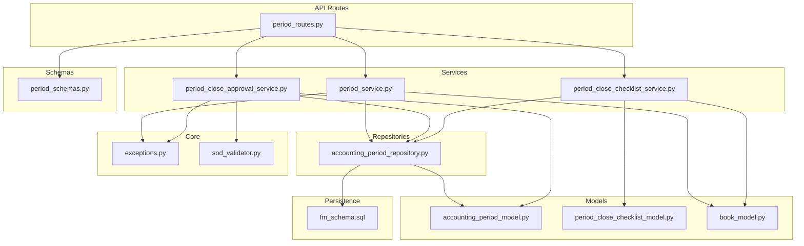

**Diagram sources**
- [period_routes.py](file://app/modules/general_ledger/api/routes/period_routes.py#L32-L264)
- [period_service.py](file://app/modules/general_ledger/services/period_service.py#L18-L166)
- [period_close_approval_service.py](file://app/modules/general_ledger/services/period_close_approval_service.py#L31-L207)
- [period_close_checklist_service.py](file://app/modules/general_ledger/services/period_close_checklist_service.py#L21-L311)
- [accounting_period_repository.py](file://app/modules/general_ledger/repositories/accounting_period_repository.py#L14-L77)
- [accounting_period_model.py](file://app/modules/general_ledger/models/accounting_period_model.py#L9-L50)
- [period_close_checklist_model.py](file://app/modules/general_ledger/models/period_close_checklist_model.py#L9-L47)
- [book_model.py](file://app/modules/general_ledger/models/book_model.py#L9-L36)
- [period_schemas.py](file://app/modules/general_ledger/schemas/period_schemas.py#L8-L93)
- [exceptions.py](file://app/core/exceptions.py#L10-L43)
- [sod_validator.py](file://app/modules/core/services/sod_validator.py#L14-L24)
- [fm_schema.sql](file://database/fm_schema.sql#L234-L265)

**Section sources**
- [period_routes.py](file://app/modules/general_ledger/api/routes/period_routes.py#L32-L264)
- [period_service.py](file://app/modules/general_ledger/services/period_service.py#L18-L166)
- [accounting_period_model.py](file://app/modules/general_ledger/models/accounting_period_model.py#L9-L50)

## Core Components
- API Routes: Define endpoints for generating periods, listing periods, retrieving a period, closing a period, submitting/approving period close, locking a period, and managing the period close checklist.
- Services:
  - PeriodService: Handles period lifecycle operations including generation, retrieval, listing, closing, soft-closing, and locking.
  - PeriodCloseApprovalService: Manages the approval workflow for period close with state transitions and SoD checks.
  - PeriodCloseChecklistService: Computes and manages checklist items required for period close.
- Repositories: AccountingPeriodRepository provides CRUD and query operations for periods.
- Models: Define PeriodStatus, AccountingPeriod, PeriodCloseChecklist, ChecklistItemCode, and ChecklistItemStatus.
- Schemas: Pydantic models for request/response payloads.
- Core: Exceptions and SoD validator for workflow safety.

**Section sources**
- [period_routes.py](file://app/modules/general_ledger/api/routes/period_routes.py#L35-L264)
- [period_service.py](file://app/modules/general_ledger/services/period_service.py#L26-L166)
- [period_close_approval_service.py](file://app/modules/general_ledger/services/period_close_approval_service.py#L39-L207)
- [period_close_checklist_service.py](file://app/modules/general_ledger/services/period_close_checklist_service.py#L28-L311)
- [accounting_period_repository.py](file://app/modules/general_ledger/repositories/accounting_period_repository.py#L20-L77)
- [accounting_period_model.py](file://app/modules/general_ledger/models/accounting_period_model.py#L9-L50)
- [period_close_checklist_model.py](file://app/modules/general_ledger/models/period_close_checklist_model.py#L9-L47)
- [period_schemas.py](file://app/modules/general_ledger/schemas/period_schemas.py#L8-L93)
- [exceptions.py](file://app/core/exceptions.py#L10-L43)
- [sod_validator.py](file://app/modules/core/services/sod_validator.py#L14-L24)

## Architecture Overview
The API follows a layered architecture:
- Routes layer validates requests and delegates to services.
- Service layer enforces business rules, performs validations, and coordinates repositories.
- Repository layer handles database operations.
- Model layer defines domain entities and enumerations.
- Schema layer defines request/response contracts.
- Core layer provides exceptions and cross-cutting concerns like SoD validation.

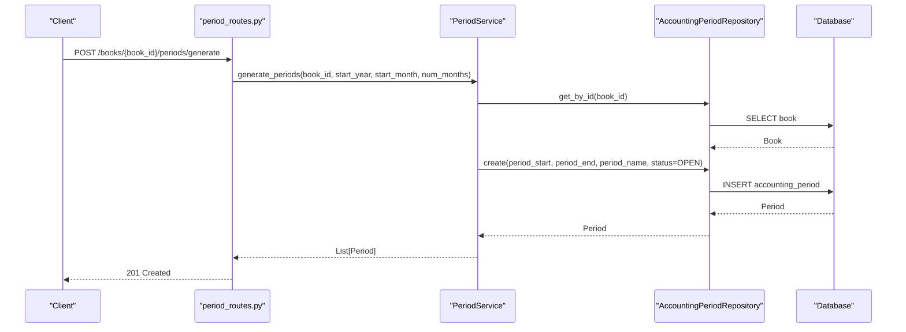

**Diagram sources**
- [period_routes.py](file://app/modules/general_ledger/api/routes/period_routes.py#L35-L55)
- [period_service.py](file://app/modules/general_ledger/services/period_service.py#L26-L67)
- [accounting_period_repository.py](file://app/modules/general_ledger/repositories/accounting_period_repository.py#L14-L47)
- [fm_schema.sql](file://database/fm_schema.sql#L234-L239)

## Detailed Component Analysis

### Period Status Lifecycle and Transitions
Periods progress through statuses: Open → Soft-Closed → Pending Close Approval → Closed → Locked. The model defines these statuses and the service enforces transitions and validations.

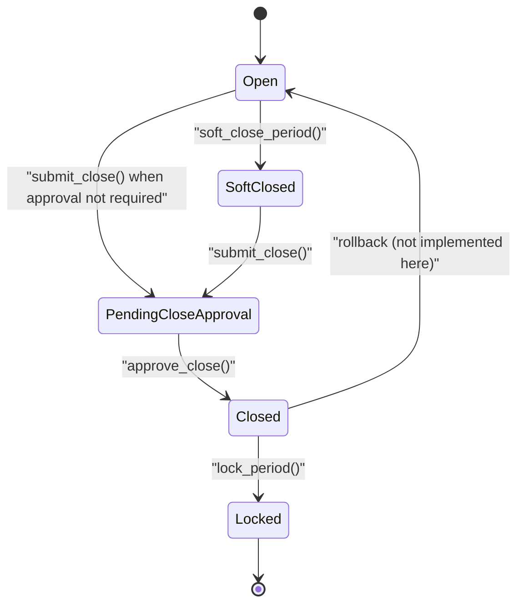

**Diagram sources**
- [accounting_period_model.py](file://app/modules/general_ledger/models/accounting_period_model.py#L9-L16)
- [period_close_approval_service.py](file://app/modules/general_ledger/services/period_close_approval_service.py#L47-L109)
- [period_close_approval_service.py](file://app/modules/general_ledger/services/period_close_approval_service.py#L119-L166)
- [period_service.py](file://app/modules/general_ledger/services/period_service.py#L143-L165)
- [period_service.py](file://app/modules/general_ledger/services/period_service.py#L116-L141)

**Section sources**
- [accounting_period_model.py](file://app/modules/general_ledger/models/accounting_period_model.py#L9-L16)
- [period_service.py](file://app/modules/general_ledger/services/period_service.py#L89-L165)
- [period_close_approval_service.py](file://app/modules/general_ledger/services/period_close_approval_service.py#L39-L166)

### Period Generation with Fiscal Calendar Integration
- Endpoint: POST /books/{book_id}/periods/generate
- Validates book existence, generates monthly periods from a start date for a specified number of months, and ensures uniqueness by start date.
- Uses repository to check for existing periods and creates new ones with OPEN status.

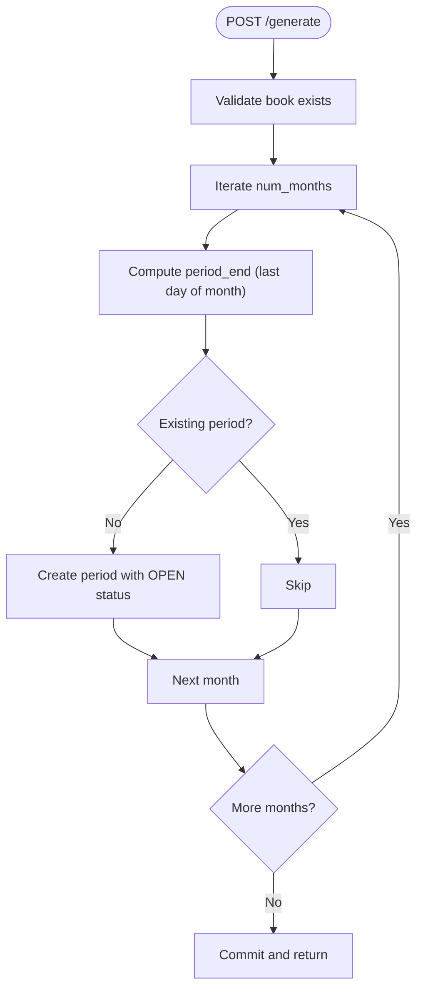

**Diagram sources**
- [period_routes.py](file://app/modules/general_ledger/api/routes/period_routes.py#L35-L55)
- [period_service.py](file://app/modules/general_ledger/services/period_service.py#L26-L67)
- [accounting_period_repository.py](file://app/modules/general_ledger/repositories/accounting_period_repository.py#L35-L47)

**Section sources**
- [period_routes.py](file://app/modules/general_ledger/api/routes/period_routes.py#L35-L55)
- [period_service.py](file://app/modules/general_ledger/services/period_service.py#L26-L67)
- [accounting_period_repository.py](file://app/modules/general_ledger/repositories/accounting_period_repository.py#L35-L47)

### Period Queries and Reporting Access
- GET /books/{book_id}/periods: List periods for a book, optionally filtered by status.
- GET /books/{book_id}/periods/{period_id}: Retrieve a specific period by ID.
- GET /books/{book_id}/periods?status={status}: Filter by status.
- Historical access: Listing is ordered by period_start descending; repository supports open period lookup.

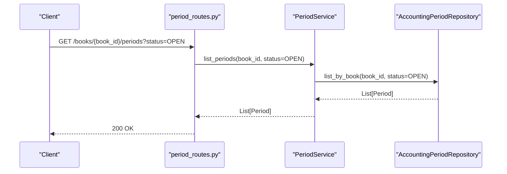

**Diagram sources**
- [period_routes.py](file://app/modules/general_ledger/api/routes/period_routes.py#L57-L66)
- [period_service.py](file://app/modules/general_ledger/services/period_service.py#L81-L87)
- [accounting_period_repository.py](file://app/modules/general_ledger/repositories/accounting_period_repository.py#L49-L63)

**Section sources**
- [period_routes.py](file://app/modules/general_ledger/api/routes/period_routes.py#L57-L80)
- [period_service.py](file://app/modules/general_ledger/services/period_service.py#L81-L87)
- [accounting_period_repository.py](file://app/modules/general_ledger/repositories/accounting_period_repository.py#L49-L77)

### Period Closing Operations
- Endpoint: POST /books/{book_id}/periods/{period_id}/close
- Validates period exists, prevents closing a locked period, and prevents re-closing an already closed period.
- Updates status to CLOSED and records closed_by/closed_at/lock_reason.

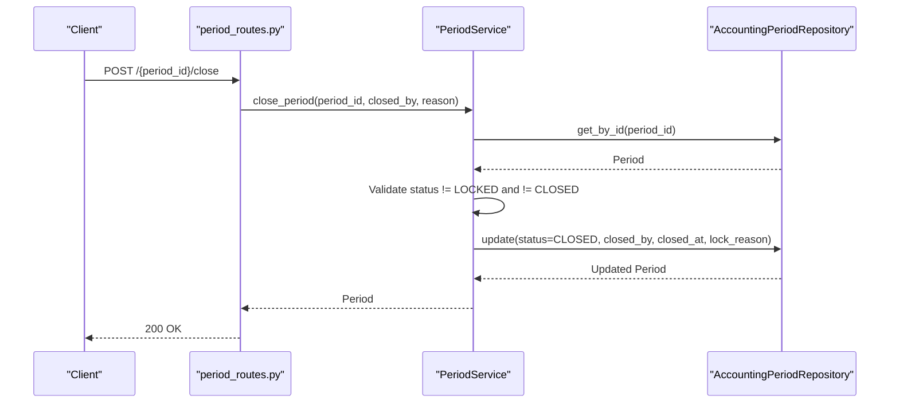

**Diagram sources**
- [period_routes.py](file://app/modules/general_ledger/api/routes/period_routes.py#L82-L103)
- [period_service.py](file://app/modules/general_ledger/services/period_service.py#L89-L114)
- [accounting_period_repository.py](file://app/modules/general_ledger/repositories/accounting_period_repository.py#L14-L47)

**Section sources**
- [period_routes.py](file://app/modules/general_ledger/api/routes/period_routes.py#L82-L103)
- [period_service.py](file://app/modules/general_ledger/services/period_service.py#L89-L114)
- [exceptions.py](file://app/core/exceptions.py#L35-L43)

### Soft-Close and Lock Operations
- Soft-Close: Allows elevated-role postings while signaling closure intent.
- Lock: Prevents all postings; requires prior closure.

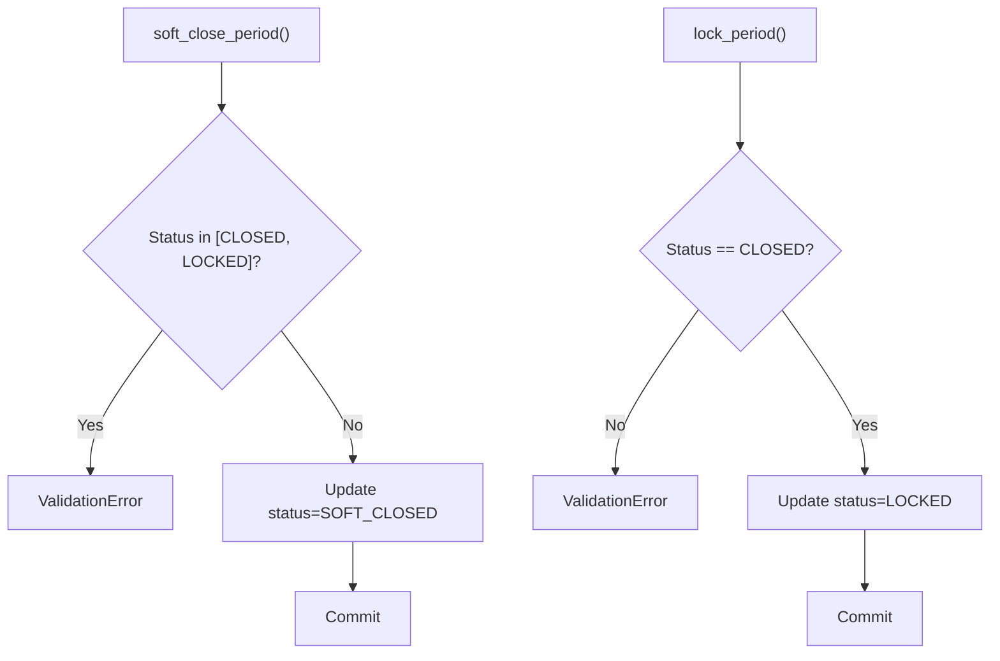

**Diagram sources**
- [period_service.py](file://app/modules/general_ledger/services/period_service.py#L143-L165)
- [period_service.py](file://app/modules/general_ledger/services/period_service.py#L116-L141)

**Section sources**
- [period_service.py](file://app/modules/general_ledger/services/period_service.py#L116-L165)

### Period Close Approval Workflow
- Submit Close: Transitions from OPEN/SOFT_CLOSED to PENDING_CLOSE_APPROVAL or directly to CLOSED if approval is not required. Requires checklist completion and optimistic locking via row_version.
- Approve Close: Transitions from PENDING_CLOSE_APPROVAL to CLOSED; performs SoD validation and logs audit events.

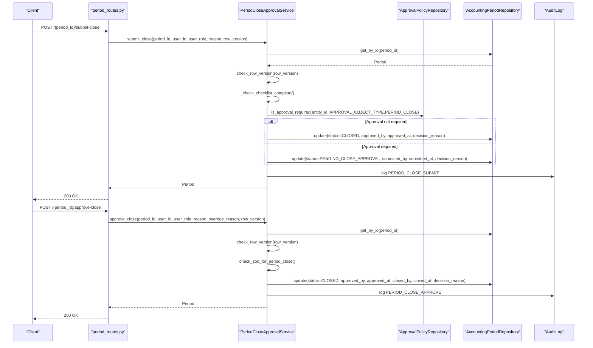

**Diagram sources**
- [period_routes.py](file://app/modules/general_ledger/api/routes/period_routes.py#L105-L152)
- [period_close_approval_service.py](file://app/modules/general_ledger/services/period_close_approval_service.py#L39-L166)
- [sod_validator.py](file://app/modules/core/services/sod_validator.py#L14-L24)

**Section sources**
- [period_routes.py](file://app/modules/general_ledger/api/routes/period_routes.py#L105-L152)
- [period_close_approval_service.py](file://app/modules/general_ledger/services/period_close_approval_service.py#L39-L166)
- [sod_validator.py](file://app/modules/core/services/sod_validator.py#L14-L24)

### Period Close Checklist Management
- Compute Checklist: Generates checklist items for a period and computes statuses based on current system state.
- Manual Completion: Allows marking checklist items as complete with notes and user attribution.
- Checklist Items: BANK_REC_DONE, REVREC_DONE, PAYROLL_POSTED, ROYALTY_POSTED, AR_AGING_READY, AP_AGING_READY.

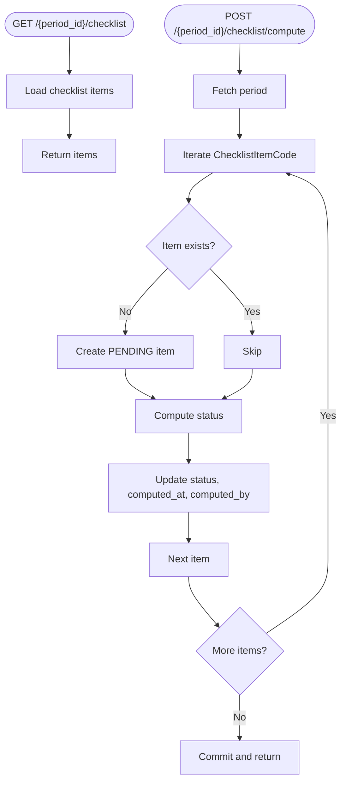

**Diagram sources**
- [period_routes.py](file://app/modules/general_ledger/api/routes/period_routes.py#L211-L264)
- [period_close_checklist_service.py](file://app/modules/general_ledger/services/period_close_checklist_service.py#L28-L73)
- [period_close_checklist_model.py](file://app/modules/general_ledger/models/period_close_checklist_model.py#L9-L47)

**Section sources**
- [period_routes.py](file://app/modules/general_ledger/api/routes/period_routes.py#L211-L264)
- [period_close_checklist_service.py](file://app/modules/general_ledger/services/period_close_checklist_service.py#L28-L311)
- [period_close_checklist_model.py](file://app/modules/general_ledger/models/period_close_checklist_model.py#L9-L47)

### Multi-Entity Period Synchronization
- Books are associated with Legal Entities; period close checklist computations reference entity-specific resources (e.g., bank accounts).
- Locking endpoints verify that the period belongs to the specified book to prevent cross-entity access.

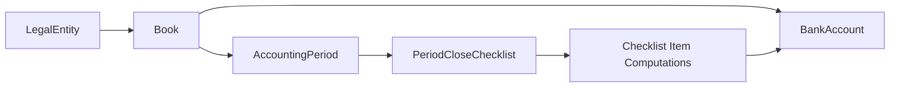

**Diagram sources**
- [book_model.py](file://app/modules/general_ledger/models/book_model.py#L15-L36)
- [accounting_period_model.py](file://app/modules/general_ledger/models/accounting_period_model.py#L18-L41)
- [period_close_checklist_service.py](file://app/modules/general_ledger/services/period_close_checklist_service.py#L103-L148)

**Section sources**
- [book_model.py](file://app/modules/general_ledger/models/book_model.py#L15-L36)
- [period_close_checklist_service.py](file://app/modules/general_ledger/services/period_close_checklist_service.py#L103-L148)
- [period_routes.py](file://app/modules/general_ledger/api/routes/period_routes.py#L154-L209)

### Year-End Procedures and Journal Entries
- Year-end procedures typically involve closing the current period and preparing the next period. While explicit year-end journal entry generation is not implemented in the referenced files, the system supports:
  - Period close with approval workflow.
  - Journal entry creation bound to a period via date lookup.
  - Idempotent posting keys for generated postings.

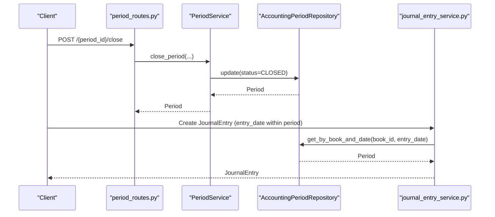

**Diagram sources**
- [period_routes.py](file://app/modules/general_ledger/api/routes/period_routes.py#L82-L103)
- [period_service.py](file://app/modules/general_ledger/services/period_service.py#L89-L114)
- [journal_entry_service.py](file://app/modules/general_ledger/services/journal_entry_service.py#L76-L100)

**Section sources**
- [journal_entry_service.py](file://app/modules/general_ledger/services/journal_entry_service.py#L76-L100)
- [fm_schema.sql](file://database/fm_schema.sql#L241-L265)

## Dependency Analysis
The following diagram shows key dependencies among components:

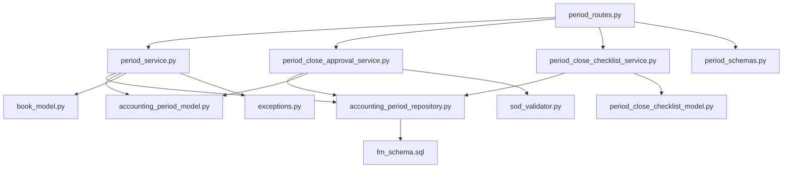

**Diagram sources**
- [period_routes.py](file://app/modules/general_ledger/api/routes/period_routes.py#L32-L264)
- [period_service.py](file://app/modules/general_ledger/services/period_service.py#L18-L166)
- [period_close_approval_service.py](file://app/modules/general_ledger/services/period_close_approval_service.py#L31-L207)
- [period_close_checklist_service.py](file://app/modules/general_ledger/services/period_close_checklist_service.py#L21-L311)
- [accounting_period_repository.py](file://app/modules/general_ledger/repositories/accounting_period_repository.py#L14-L77)
- [accounting_period_model.py](file://app/modules/general_ledger/models/accounting_period_model.py#L9-L50)
- [period_close_checklist_model.py](file://app/modules/general_ledger/models/period_close_checklist_model.py#L9-L47)
- [book_model.py](file://app/modules/general_ledger/models/book_model.py#L9-L36)
- [period_schemas.py](file://app/modules/general_ledger/schemas/period_schemas.py#L8-L93)
- [exceptions.py](file://app/core/exceptions.py#L10-L43)
- [sod_validator.py](file://app/modules/core/services/sod_validator.py#L14-L24)
- [fm_schema.sql](file://database/fm_schema.sql#L234-L265)

**Section sources**
- [period_routes.py](file://app/modules/general_ledger/api/routes/period_routes.py#L32-L264)
- [period_service.py](file://app/modules/general_ledger/services/period_service.py#L18-L166)
- [period_close_approval_service.py](file://app/modules/general_ledger/services/period_close_approval_service.py#L31-L207)
- [period_close_checklist_service.py](file://app/modules/general_ledger/services/period_close_checklist_service.py#L21-L311)
- [accounting_period_repository.py](file://app/modules/general_ledger/repositories/accounting_period_repository.py#L14-L77)
- [accounting_period_model.py](file://app/modules/general_ledger/models/accounting_period_model.py#L9-L50)
- [period_close_checklist_model.py](file://app/modules/general_ledger/models/period_close_checklist_model.py#L9-L47)
- [book_model.py](file://app/modules/general_ledger/models/book_model.py#L9-L36)
- [period_schemas.py](file://app/modules/general_ledger/schemas/period_schemas.py#L8-L93)
- [exceptions.py](file://app/core/exceptions.py#L10-L43)
- [sod_validator.py](file://app/modules/core/services/sod_validator.py#L14-L24)
- [fm_schema.sql](file://database/fm_schema.sql#L234-L265)

## Performance Considerations
- Indexes: Periods are indexed by book_id and status, enabling efficient filtering and lookup.
- Ordering: Listing periods is ordered by period_start descending to quickly access the most recent periods.
- Transactions: Services operate within single transactions to maintain atomicity; ensure minimal work per request to reduce contention.
- Idempotency: Locking endpoints use idempotency keys to prevent duplicate operations.

[No sources needed since this section provides general guidance]

## Troubleshooting Guide
Common issues and resolutions:
- Period Locked: Attempting to close a period already marked as locked returns a forbidden error. Unlock or adjust the period appropriately.
- Validation Errors: Submitting a close for a period not in OPEN or SOFT_CLOSED, or when checklist items are incomplete, raises validation errors.
- Not Found: Accessing non-existent periods or books results in 404 responses.
- Approval Workflow Errors: Approving a period not in PENDING_CLOSE_APPROVAL or failing SoD validation triggers workflow errors.
- Audit Logging: Approval actions are logged with before/after status and reasons for traceability.

**Section sources**
- [period_routes.py](file://app/modules/general_ledger/api/routes/period_routes.py#L97-L102)
- [period_close_approval_service.py](file://app/modules/general_ledger/services/period_close_approval_service.py#L56-L65)
- [period_close_approval_service.py](file://app/modules/general_ledger/services/period_close_approval_service.py#L129-L132)
- [exceptions.py](file://app/core/exceptions.py#L35-L43)

## Conclusion
The Accounting Periods API provides robust lifecycle management for monthly accounting periods within books and legal entities. It integrates with approval workflows, checklist computations, and audit logging to ensure compliance and traceability. The design supports multi-entity scenarios, optimistic concurrency, and idempotent operations, enabling safe period transitions and reliable reporting.

[No sources needed since this section summarizes without analyzing specific files]

## Appendices

### API Endpoints Summary
- POST /books/{book_id}/periods/generate: Generate monthly periods for a book.
- GET /books/{book_id}/periods: List periods for a book (filter by status).
- GET /books/{book_id}/periods/{period_id}: Retrieve a period by ID.
- POST /books/{book_id}/periods/{period_id}/close: Close a period.
- POST /books/{book_id}/periods/{period_id}/submit-close: Submit period for close approval.
- POST /books/{book_id}/periods/{period_id}/approve-close: Approve period close.
- POST /books/{book_id}/periods/{period_id}/lock: Lock a period (requires idempotency key).
- GET /books/{book_id}/periods/{period_id}/checklist: Get checklist items.
- POST /books/{book_id}/periods/{period_id}/checklist/compute: Compute checklist items.
- POST /books/{book_id}/periods/{period_id}/checklist/{item_code}/complete: Mark checklist item complete.

**Section sources**
- [period_routes.py](file://app/modules/general_ledger/api/routes/period_routes.py#L35-L264)

### Data Models Overview
- PeriodStatus: OPEN, SOFT_CLOSED, PENDING_CLOSE_APPROVAL, CLOSED, LOCKED.
- AccountingPeriod: Period metadata, status, submission/approval fields, and row_version.
- ChecklistItemCode: BANK_REC_DONE, REVREC_DONE, PAYROLL_POSTED, ROYALTY_POSTED, AR_AGING_READY, AP_AGING_READY.
- ChecklistItemStatus: PENDING, COMPLETE, SKIPPED.

**Section sources**
- [accounting_period_model.py](file://app/modules/general_ledger/models/accounting_period_model.py#L9-L50)
- [period_close_checklist_model.py](file://app/modules/general_ledger/models/period_close_checklist_model.py#L9-L47)