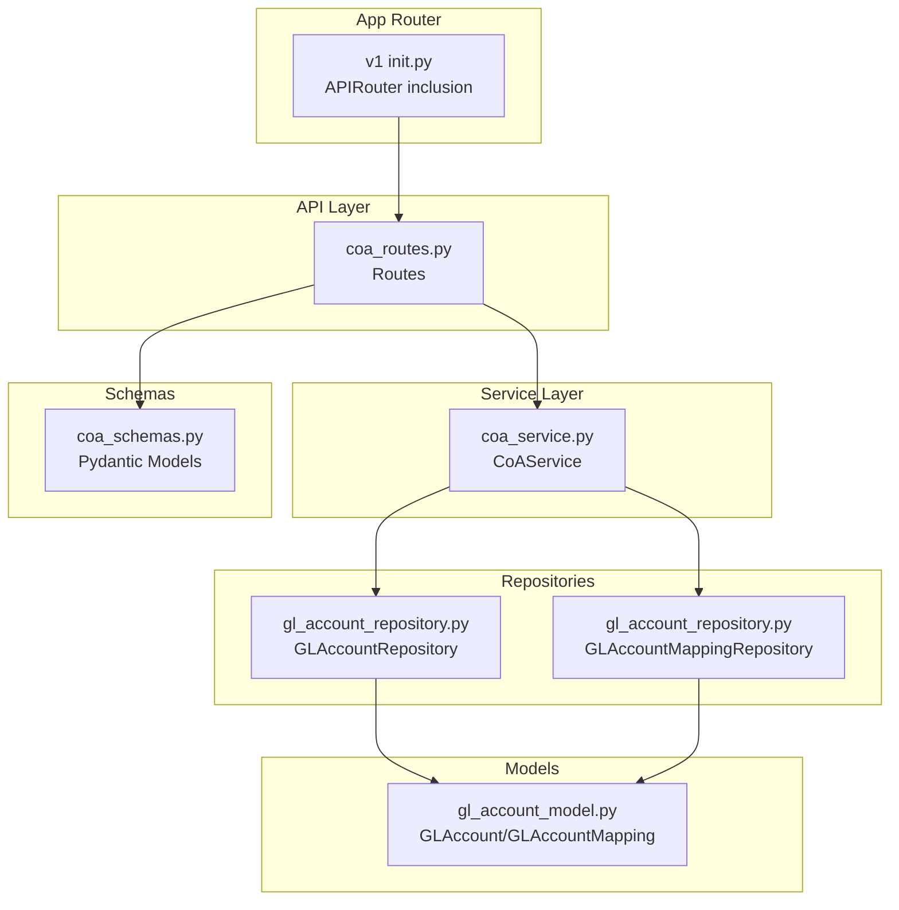
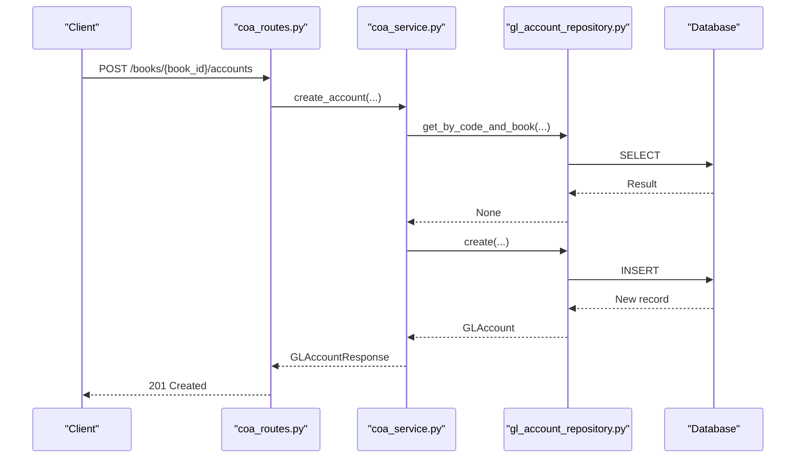
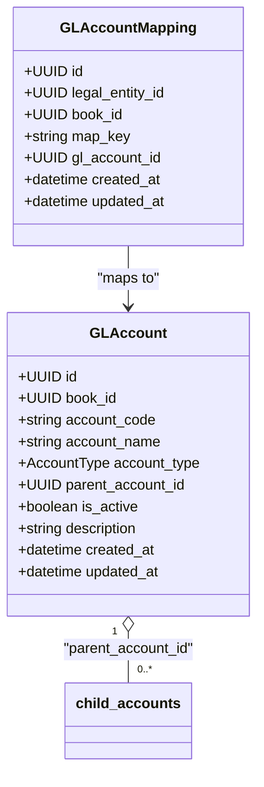
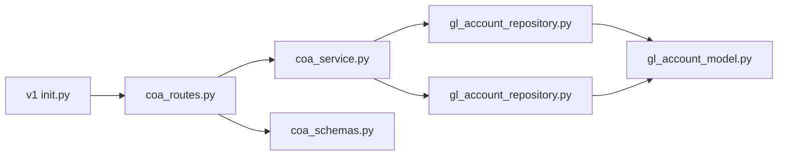

# Chart of Accounts API

<cite>
**Referenced Files in This Document**
- [coa_routes.py](file://app/modules/general_ledger/api/routes/coa_routes.py)
- [coa_schemas.py](file://app/modules/general_ledger/schemas/coa_schemas.py)
- [gl_account_model.py](file://app/modules/general_ledger/models/gl_account_model.py)
- [coa_service.py](file://app/modules/general_ledger/services/coa_service.py)
- [gl_account_repository.py](file://app/modules/general_ledger/repositories/gl_account_repository.py)
- [v1 init.py](file://app/api/v1/__init__.py)
- [loader.py](file://app/core/seed/loader.py)
</cite>

## Table of Contents
1. [Introduction](#introduction)
2. [Project Structure](#project-structure)
3. [Core Components](#core-components)
4. [Architecture Overview](#architecture-overview)
5. [Detailed Component Analysis](#detailed-component-analysis)
6. [Dependency Analysis](#dependency-analysis)
7. [Performance Considerations](#performance-considerations)
8. [Troubleshooting Guide](#troubleshooting-guide)
9. [Conclusion](#conclusion)
10. [Appendices](#appendices)

## Introduction
This document provides comprehensive API documentation for the Chart of Accounts (COA) endpoints. It covers account lifecycle operations (create, list, get, update), hierarchical account structures, classification codes, account types, mappings for system-generated postings, and current filtering/pagination capabilities. It also documents validation rules, error handling, and outlines bulk operations support for imports and exports.

## Project Structure
The COA API is implemented within the General Ledger module and exposed via FastAPI routes. The request/response schemas define strict validation, while the service layer coordinates repository access and business rules. The routes are included under the API v1 router.

**Diagram sources**
- [coa_routes.py](file://app/modules/general_ledger/api/routes/coa_routes.py#L1-L123)
- [coa_service.py](file://app/modules/general_ledger/services/coa_service.py#L1-L143)
- [gl_account_repository.py](file://app/modules/general_ledger/repositories/gl_account_repository.py#L1-L82)
- [gl_account_model.py](file://app/modules/general_ledger/models/gl_account_model.py#L1-L80)
- [coa_schemas.py](file://app/modules/general_ledger/schemas/coa_schemas.py#L1-L62)
- [v1 init.py](file://app/api/v1/__init__.py#L1-L72)

**Section sources**
- [coa_routes.py](file://app/modules/general_ledger/api/routes/coa_routes.py#L1-L123)
- [v1 init.py](file://app/api/v1/__init__.py#L34-L41)

## Core Components
- Routes: Define endpoints for account creation, listing, retrieval, updates, and mappings.
- Service: Implements business rules (validation, uniqueness checks, parent-child constraints).
- Repositories: Provide data access for accounts and mappings.
- Models: Define database schema and enumerations.
- Schemas: Define request/response validation and serialization.

**Section sources**
- [coa_routes.py](file://app/modules/general_ledger/api/routes/coa_routes.py#L17-L123)
- [coa_service.py](file://app/modules/general_ledger/services/coa_service.py#L14-L143)
- [gl_account_repository.py](file://app/modules/general_ledger/repositories/gl_account_repository.py#L10-L82)
- [gl_account_model.py](file://app/modules/general_ledger/models/gl_account_model.py#L9-L80)
- [coa_schemas.py](file://app/modules/general_ledger/schemas/coa_schemas.py#L8-L62)

## Architecture Overview
The COA API follows a layered architecture:
- API routes accept requests and return responses.
- Service layer enforces business rules and orchestrates repository operations.
- Repositories encapsulate SQL queries.
- Models define persistence and relationships.
- Schemas define validation and serialization.

**Diagram sources**
- [coa_routes.py](file://app/modules/general_ledger/api/routes/coa_routes.py#L20-L42)
- [coa_service.py](file://app/modules/general_ledger/services/coa_service.py#L23-L62)
- [gl_account_repository.py](file://app/modules/general_ledger/repositories/gl_account_repository.py#L16-L28)

## Detailed Component Analysis

### Endpoint Catalog
- POST /books/{book_id}/accounts
  - Purpose: Create a new GL account.
  - Request body: GLAccountCreate
  - Response: GLAccountResponse (201)
  - Notes: Requires book existence, unique account code per book, optional parent account validation.

- GET /books/{book_id}/accounts
  - Purpose: List accounts for a book.
  - Query parameters: active_only (default true)
  - Response: Array of GLAccountResponse

- GET /books/{book_id}/accounts/{account_id}
  - Purpose: Retrieve a single account by ID.
  - Response: GLAccountResponse (404 if not found)

- PATCH /books/{book_id}/accounts/{account_id}
  - Purpose: Update account metadata (name, description, activity).
  - Request body: GLAccountUpdate
  - Response: GLAccountResponse (404 if not found)

- POST /books/{book_id}/accounts/mappings
  - Purpose: Create or update a system posting mapping.
  - Request body: GLAccountMappingCreate
  - Response: GLAccountMappingResponse (400/404 on validation/error)

- GET /books/{book_id}/accounts/mappings/{map_key}
  - Purpose: Retrieve a mapping by map_key.
  - Query parameters: legal_entity_id
  - Response: GLAccountMappingResponse (404 if not found)

**Section sources**
- [coa_routes.py](file://app/modules/general_ledger/api/routes/coa_routes.py#L20-L122)

### Request/Response Schemas
- GLAccountCreate
  - Fields: book_id, account_code, account_name, account_type, parent_account_id (optional), description (optional)
  - Validation: Length constraints, required fields, account_type from enumeration

- GLAccountUpdate
  - Fields: account_name (optional), description (optional), is_active (optional)

- GLAccountResponse
  - Fields: id, book_id, account_code, account_name, account_type, parent_account_id, is_active, description, created_at, updated_at

- GLAccountMappingCreate
  - Fields: legal_entity_id, book_id, map_key, gl_account_id

- GLAccountMappingResponse
  - Fields: id, legal_entity_id, book_id, map_key, gl_account_id, created_at, updated_at

**Section sources**
- [coa_schemas.py](file://app/modules/general_ledger/schemas/coa_schemas.py#L8-L62)

### Data Models and Types
- AccountType Enumeration
  - Values: ASSET, LIABILITY, EQUITY, REVENUE, EXPENSE, AR, AP, CASH, DEFERRED_REVENUE, OTHER_ASSET, OTHER_LIABILITY, OTHER_INCOME, OTHER_INCOME_EXPENSE, CONTRA_REVENUE

- GLAccount Model
  - Columns: book_id, account_code, account_name, account_type, parent_account_id, is_active, description
  - Relationships: book, journal_lines, mappings
  - Constraints: Hierarchical self-reference via parent_account_id

- GLAccountMapping Model
  - Columns: legal_entity_id, book_id, map_key, gl_account_id
  - Unique constraint: (legal_entity_id, book_id, map_key)

**Section sources**
- [gl_account_model.py](file://app/modules/general_ledger/models/gl_account_model.py#L9-L80)

### Business Rules and Validation
- Account Creation
  - Book existence verified before creation.
  - Duplicate account_code per book prevented.
  - Parent account validation: must exist and be in the same book.
  - Account code/name length constraints enforced.

- Account Update
  - Only name, description, and activity can be modified; code/type are immutable via this endpoint.

- Mapping Management
  - Account existence and book membership verified.
  - Unique map_key per legal_entity_id/book_id enforced.
  - Update or create semantics applied.

**Section sources**
- [coa_service.py](file://app/modules/general_ledger/services/coa_service.py#L23-L143)
- [gl_account_repository.py](file://app/modules/general_ledger/repositories/gl_account_repository.py#L16-L82)

### Filtering and Pagination
- Current Filtering
  - active_only flag controls whether to return only active accounts in list endpoint.
- Pagination
  - No pagination support is currently implemented in the list endpoint.

**Section sources**
- [coa_routes.py](file://app/modules/general_ledger/api/routes/coa_routes.py#L44-L53)
- [coa_service.py](file://app/modules/general_ledger/services/coa_service.py#L68-L72)
- [gl_account_repository.py](file://app/modules/general_ledger/repositories/gl_account_repository.py#L30-L49)

### Hierarchical Account Structures
- Parent-Child Relationship
  - Each account can have a parent_account_id referencing another account in the same book.
  - Self-referencing relationship enables tree traversal.
- Classification Codes
  - AccountType enumeration defines classification codes (Asset, Liability, Equity, Income, Expense) plus special types (AR, AP, CASH, etc.).
- Balance Sheet vs Income Statement
  - Classification codes map to traditional categories; special types support operational sub-accounts.

**Diagram sources**
- [gl_account_model.py](file://app/modules/general_ledger/models/gl_account_model.py#L28-L80)

### Account Metadata and Reporting
- Metadata fields: account_code, account_name, description, is_active, timestamps.
- Hierarchical metadata: parent_account_id supports nested structures.
- Reporting requirements: mappings enable system-generated postings keyed by map_key.

**Section sources**
- [gl_account_model.py](file://app/modules/general_ledger/models/gl_account_model.py#L28-L79)
- [coa_schemas.py](file://app/modules/general_ledger/schemas/coa_schemas.py#L25-L62)

### Bulk Operations
- Import Template Support
  - Seed loader includes a placeholder for loading chart of accounts templates.
- Export
  - No explicit export endpoint is present in the current routes.

**Section sources**
- [loader.py](file://app/core/seed/loader.py#L180-L184)

## Dependency Analysis
The routes depend on the service layer, which in turn depends on repositories and models. The API v1 router includes the COA routes.

**Diagram sources**
- [coa_routes.py](file://app/modules/general_ledger/api/routes/coa_routes.py#L1-L17)
- [coa_service.py](file://app/modules/general_ledger/services/coa_service.py#L1-L22)
- [gl_account_repository.py](file://app/modules/general_ledger/repositories/gl_account_repository.py#L1-L14)
- [gl_account_model.py](file://app/modules/general_ledger/models/gl_account_model.py#L1-L80)
- [coa_schemas.py](file://app/modules/general_ledger/schemas/coa_schemas.py#L1-L62)
- [v1 init.py](file://app/api/v1/__init__.py#L34-L41)

**Section sources**
- [coa_routes.py](file://app/modules/general_ledger/api/routes/coa_routes.py#L1-L17)
- [v1 init.py](file://app/api/v1/__init__.py#L34-L41)

## Performance Considerations
- Indexing
  - book_id is indexed on GLAccount to optimize list_by_book queries.
  - Unique constraints on mapping keys prevent redundant lookups.
- Query Patterns
  - Listing accounts sorts by account_code; consider adding pagination for large datasets.
  - Mapping retrieval uses composite key lookup; ensure appropriate indexing.
- Concurrency
  - Service methods commit after write operations; consider batching for bulk imports.

[No sources needed since this section provides general guidance]

## Troubleshooting Guide
Common errors and causes:
- 400 Bad Request
  - Duplicate account code in the same book.
  - Parent account not found or not in the same book.
  - Account not in the specified book during mapping creation/update.
- 404 Not Found
  - Account ID not found.
  - Mapping not found for the given map_key/legal_entity_id/book_id combination.
- Validation Errors
  - Account code/name length constraints violated.
  - Invalid account_type values.

Resolution steps:
- Verify book_id exists and is correct.
- Ensure account_code is unique within the book.
- Confirm parent_account_id belongs to the same book.
- Check map_key uniqueness per legal_entity_id/book_id.

**Section sources**
- [coa_routes.py](file://app/modules/general_ledger/api/routes/coa_routes.py#L38-L41)
- [coa_service.py](file://app/modules/general_ledger/services/coa_service.py#L33-L50)
- [gl_account_repository.py](file://app/modules/general_ledger/repositories/gl_account_repository.py#L58-L72)

## Conclusion
The Chart of Accounts API provides robust endpoints for managing GL accounts with strong validation, hierarchical support, and mapping capabilities. While current filtering is basic and pagination is absent, the foundation is solid for future enhancements such as advanced filtering, pagination, and bulk import/export.

[No sources needed since this section summarizes without analyzing specific files]

## Appendices

### Endpoint Definitions

- POST /books/{book_id}/accounts
  - Description: Create a new GL account.
  - Request: GLAccountCreate
  - Responses: 201 GLAccountResponse, 400 ValidationError, 404 NotFoundError

- GET /books/{book_id}/accounts
  - Description: List accounts for a book.
  - Query: active_only (bool, default true)
  - Responses: 200 Array of GLAccountResponse

- GET /books/{book_id}/accounts/{account_id}
  - Description: Get account by ID.
  - Responses: 200 GLAccountResponse, 404 Not Found

- PATCH /books/{book_id}/accounts/{account_id}
  - Description: Update account metadata.
  - Request: GLAccountUpdate
  - Responses: 200 GLAccountResponse, 404 Not Found

- POST /books/{book_id}/accounts/mappings
  - Description: Create or update mapping.
  - Request: GLAccountMappingCreate
  - Responses: 201 GLAccountMappingResponse, 400/404

- GET /books/{book_id}/accounts/mappings/{map_key}
  - Description: Get mapping by map_key.
  - Query: legal_entity_id (UUID)
  - Responses: 200 GLAccountMappingResponse, 404 Not Found

**Section sources**
- [coa_routes.py](file://app/modules/general_ledger/api/routes/coa_routes.py#L20-L122)

### Validation Rules Summary
- Account code/name length constraints enforced in schemas.
- Account code uniqueness per book enforced in service.
- Parent account must exist and belong to the same book.
- Mapping keys must be unique per legal_entity_id/book_id.

**Section sources**
- [coa_schemas.py](file://app/modules/general_ledger/schemas/coa_schemas.py#L8-L23)
- [coa_service.py](file://app/modules/general_ledger/services/coa_service.py#L38-L50)
- [gl_account_repository.py](file://app/modules/general_ledger/repositories/gl_account_repository.py#L58-L72)