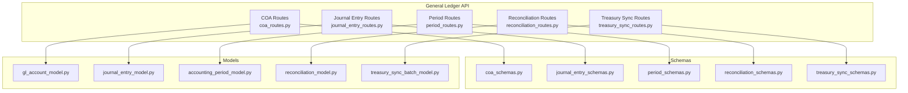
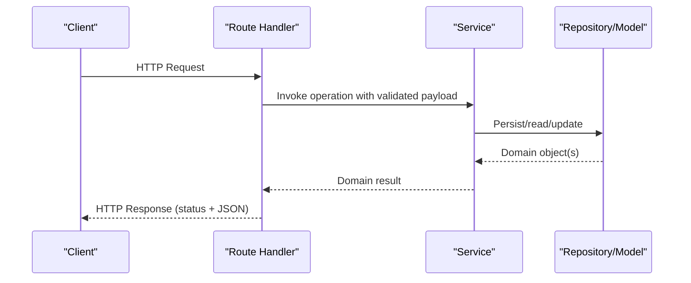
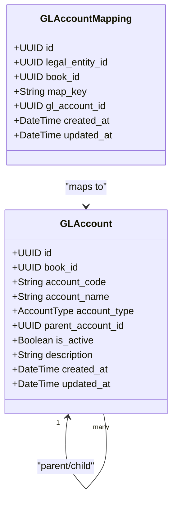
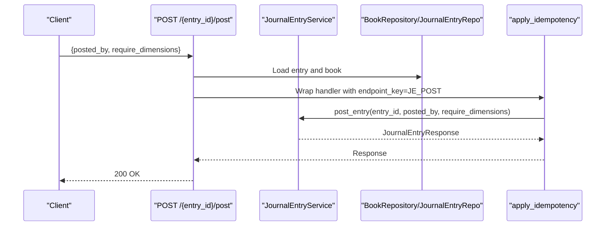
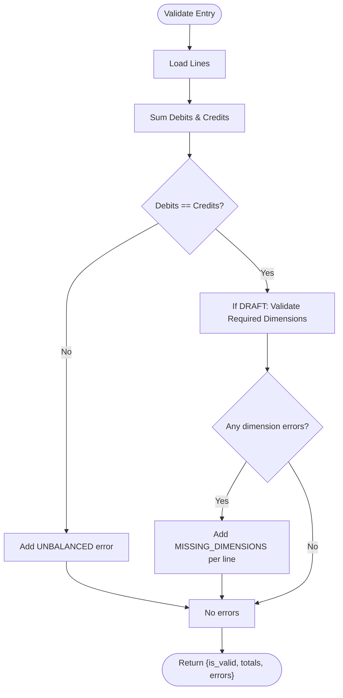
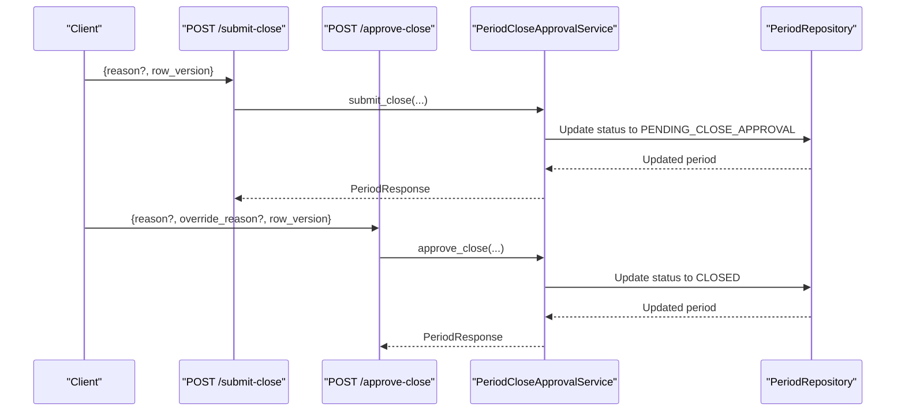
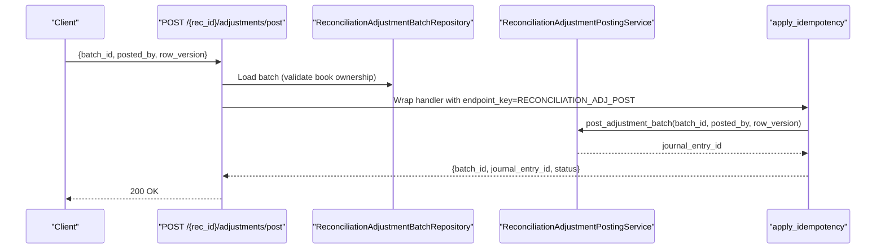
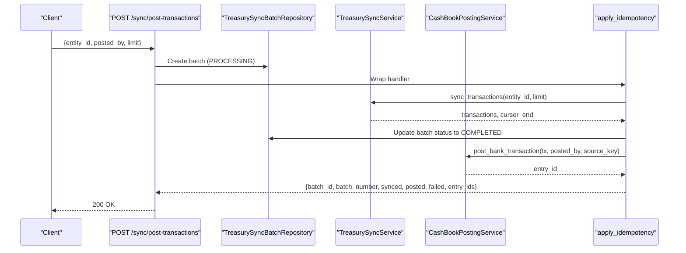
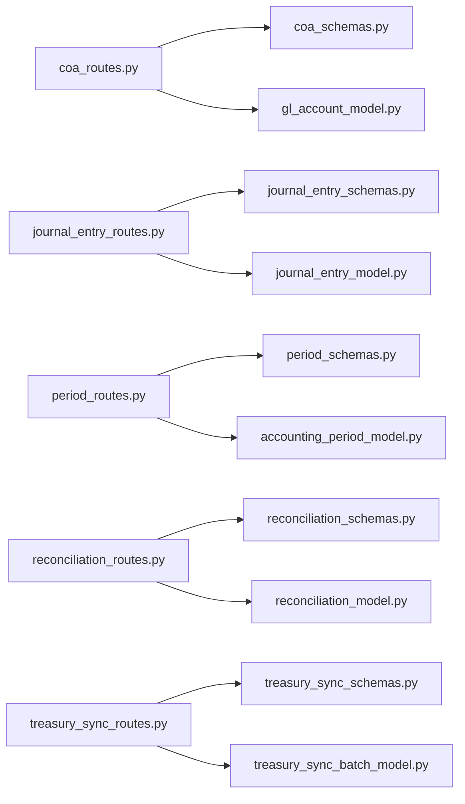

# General Ledger API

<cite>
**Referenced Files in This Document**
- [coa_routes.py](file://app/modules/general_ledger/api/routes/coa_routes.py)
- [coa_schemas.py](file://app/modules/general_ledger/schemas/coa_schemas.py)
- [gl_account_model.py](file://app/modules/general_ledger/models/gl_account_model.py)
- [journal_entry_routes.py](file://app/modules/general_ledger/api/routes/journal_entry_routes.py)
- [journal_entry_schemas.py](file://app/modules/general_ledger/schemas/journal_entry_schemas.py)
- [journal_entry_model.py](file://app/modules/general_ledger/models/journal_entry_model.py)
- [period_routes.py](file://app/modules/general_ledger/api/routes/period_routes.py)
- [period_schemas.py](file://app/modules/general_ledger/schemas/period_schemas.py)
- [accounting_period_model.py](file://app/modules/general_ledger/models/accounting_period_model.py)
- [reconciliation_routes.py](file://app/modules/general_ledger/api/routes/reconciliation_routes.py)
- [reconciliation_schemas.py](file://app/modules/general_ledger/schemas/reconciliation_schemas.py)
- [reconciliation_model.py](file://app/modules/general_ledger/models/reconciliation_model.py)
- [treasury_sync_routes.py](file://app/modules/general_ledger/api/routes/treasury_sync_routes.py)
- [treasury_sync_schemas.py](file://app/modules/general_ledger/schemas/treasury_sync_schemas.py)
- [treasury_sync_batch_model.py](file://app/modules/general_ledger/models/treasury_sync_batch_model.py)
</cite>

## Table of Contents
1. [Introduction](#introduction)
2. [Project Structure](#project-structure)
3. [Core Components](#core-components)
4. [Architecture Overview](#architecture-overview)
5. [Detailed Component Analysis](#detailed-component-analysis)
6. [Dependency Analysis](#dependency-analysis)
7. [Performance Considerations](#performance-considerations)
8. [Troubleshooting Guide](#troubleshooting-guide)
9. [Conclusion](#conclusion)

## Introduction
This document provides comprehensive API documentation for the General Ledger module, covering:
- Chart of Accounts (COA) management: creation, updates, hierarchies, and classifications
- Journal Entry processing: creation, posting, reversal, validation, and bulk line operations
- Accounting Period management: generation, opening/closing, approvals, locking, and checklist tracking
- Reconciliation endpoints: sessions, matching, suggestions, adjustments, approvals, and posting
- Treasury synchronization endpoints: sync operations, cash book posting, and status tracking

Each endpoint documents request/response schemas, validation rules, and error handling behavior derived from the codebase.

## Project Structure
The General Ledger API is organized under app/modules/general_ledger with four primary concerns:
- API routes: HTTP endpoints grouped by domain (COA, Journal Entries, Periods, Reconciliation, Treasury Sync)
- Schemas: Pydantic models defining request/response contracts
- Models: SQLAlchemy ORM models representing persisted entities
- Services: Business logic orchestration (referenced by routes but not detailed here)

**Diagram sources**
- [coa_routes.py](file://app/modules/general_ledger/api/routes/coa_routes.py#L1-L123)
- [journal_entry_routes.py](file://app/modules/general_ledger/api/routes/journal_entry_routes.py#L1-L377)
- [period_routes.py](file://app/modules/general_ledger/api/routes/period_routes.py#L1-L264)
- [reconciliation_routes.py](file://app/modules/general_ledger/api/routes/reconciliation_routes.py#L1-L378)
- [treasury_sync_routes.py](file://app/modules/general_ledger/api/routes/treasury_sync_routes.py#L1-L329)
- [coa_schemas.py](file://app/modules/general_ledger/schemas/coa_schemas.py#L1-L62)
- [journal_entry_schemas.py](file://app/modules/general_ledger/schemas/journal_entry_schemas.py#L1-L136)
- [period_schemas.py](file://app/modules/general_ledger/schemas/period_schemas.py#L1-L93)
- [reconciliation_schemas.py](file://app/modules/general_ledger/schemas/reconciliation_schemas.py#L1-L117)
- [treasury_sync_schemas.py](file://app/modules/general_ledger/schemas/treasury_sync_schemas.py#L1-L28)
- [gl_account_model.py](file://app/modules/general_ledger/models/gl_account_model.py#L1-L80)
- [journal_entry_model.py](file://app/modules/general_ledger/models/journal_entry_model.py#L1-L128)
- [accounting_period_model.py](file://app/modules/general_ledger/models/accounting_period_model.py#L1-L50)
- [reconciliation_model.py](file://app/modules/general_ledger/models/reconciliation_model.py#L1-L68)
- [treasury_sync_batch_model.py](file://app/modules/general_ledger/models/treasury_sync_batch_model.py#L1-L46)

**Section sources**
- [coa_routes.py](file://app/modules/general_ledger/api/routes/coa_routes.py#L1-L123)
- [journal_entry_routes.py](file://app/modules/general_ledger/api/routes/journal_entry_routes.py#L1-L377)
- [period_routes.py](file://app/modules/general_ledger/api/routes/period_routes.py#L1-L264)
- [reconciliation_routes.py](file://app/modules/general_ledger/api/routes/reconciliation_routes.py#L1-L378)
- [treasury_sync_routes.py](file://app/modules/general_ledger/api/routes/treasury_sync_routes.py#L1-L329)

## Core Components
- Chart of Accounts (COA): Manage GL accounts, hierarchies, and mappings per legal entity/book
- Journal Entries: Create, validate, post, reverse, and manage lines; supports bulk upsert
- Accounting Periods: Generate monthly periods, track status, close/lock workflows, and checklist items
- Reconciliation: Create sessions, match transactions to entries, compute differences, close sessions, and manage adjustment batches
- Treasury Sync: Sync external treasury data and optionally post to cash book with idempotency

**Section sources**
- [coa_routes.py](file://app/modules/general_ledger/api/routes/coa_routes.py#L1-L123)
- [journal_entry_routes.py](file://app/modules/general_ledger/api/routes/journal_entry_routes.py#L1-L377)
- [period_routes.py](file://app/modules/general_ledger/api/routes/period_routes.py#L1-L264)
- [reconciliation_routes.py](file://app/modules/general_ledger/api/routes/reconciliation_routes.py#L1-L378)
- [treasury_sync_routes.py](file://app/modules/general_ledger/api/routes/treasury_sync_routes.py#L1-L329)

## Architecture Overview
The APIs follow a layered pattern:
- Routes: Define endpoints, extract parameters, and call services
- Services: Encapsulate business logic and coordinate repositories/models
- Schemas: Validate and serialize requests/responses
- Models: Persisted entities with constraints and relationships

[No sources needed since this diagram shows conceptual workflow, not actual code structure]

## Detailed Component Analysis

### Chart of Accounts (COA)
Endpoints
- POST /books/{book_id}/accounts
  - Purpose: Create a new GL account
  - Auth: Requires authentication (via FastAPI Depends)
  - Request: GLAccountCreate
  - Response: GLAccountResponse
  - Validation rules:
    - account_code: required, length 1–50
    - account_name: required, length 1–255
    - account_type: required enum (Asset/Liability/Equity/Revenue/Expense and special types)
    - parent_account_id: optional (hierarchy)
    - description: optional
  - Errors:
    - 400: Validation error
    - 404: Parent account not found (service raises NotFoundError)
    - 201 Created on success

- GET /books/{book_id}/accounts?active_only={bool}
  - Purpose: List accounts for a book
  - Query params: active_only (default true)
  - Response: Array of GLAccountResponse

- GET /books/{book_id}/accounts/{account_id}
  - Purpose: Retrieve a specific account
  - Response: GLAccountResponse
  - Errors: 404 if not found

- PATCH /books/{book_id}/accounts/{account_id}
  - Purpose: Update account attributes
  - Request: GLAccountUpdate
  - Validation rules:
    - account_name: optional, length 1–255
    - description: optional
    - is_active: optional boolean
  - Response: GLAccountResponse
  - Errors: 404 if not found

- POST /books/{book_id}/accounts/mappings
  - Purpose: Create or update an account mapping for a legal entity/book keyed by map_key
  - Request: GLAccountMappingCreate
  - Validation rules:
    - map_key: required, length 1–100
    - gl_account_id: required
  - Response: GLAccountMappingResponse
  - Errors:
    - 400: Validation error
    - 404: Not found (mapping/account missing)
  - Constraints:
    - Unique constraint on (legal_entity_id, book_id, map_key)

- GET /books/{book_id}/accounts/mappings/{map_key}?legal_entity_id={uuid}
  - Purpose: Retrieve mapping by map_key
  - Response: GLAccountMappingResponse
  - Errors: 404 if not found

Request/Response Schemas
- GLAccountCreate
  - Fields: book_id, account_code, account_name, account_type, parent_account_id?, description?
- GLAccountUpdate
  - Fields: account_name?, description?, is_active?
- GLAccountResponse
  - Fields: id, book_id, account_code, account_name, account_type, parent_account_id?, is_active, description?, created_at, updated_at
- GLAccountMappingCreate
  - Fields: legal_entity_id, book_id, map_key, gl_account_id
- GLAccountMappingResponse
  - Fields: id, legal_entity_id, book_id, map_key, gl_account_id, created_at, updated_at

Validation Rules
- Length constraints enforced via Pydantic Field(min_length/max_length)
- Enum constraints enforced via Pydantic models and SQLAlchemy enums
- Hierarchical parent reference supported; uniqueness enforced by service logic

Error Handling
- NotFoundError mapped to 404
- ValidationError mapped to 400
- Mapping uniqueness enforced by database constraint

**Section sources**
- [coa_routes.py](file://app/modules/general_ledger/api/routes/coa_routes.py#L1-L123)
- [coa_schemas.py](file://app/modules/general_ledger/schemas/coa_schemas.py#L1-L62)
- [gl_account_model.py](file://app/modules/general_ledger/models/gl_account_model.py#L1-L80)

#### Class Diagram: COA Entities

**Diagram sources**
- [gl_account_model.py](file://app/modules/general_ledger/models/gl_account_model.py#L28-L80)

### Journal Entries
Endpoints
- POST /books/{book_id}/journal-entries
  - Purpose: Create a draft journal entry and add lines
  - Headers: Idempotency-Key (optional; also supported in request body)
  - Request: JournalEntryCreate
  - Validation rules:
    - lines: required array with minimum 2 items
    - Each line enforces non-negative amounts and mutually exclusive debit/credit
  - Response: JournalEntryResponse (draft)
  - Errors:
    - 400: Validation error
    - 404: Not found
    - 409: Duplicate entry (idempotency key conflict)

- GET /books/{book_id}/journal-entries?status={enum}&period_id={uuid}&limit={int}&offset={int}
  - Purpose: List entries for a book
  - Response: Array of JournalEntryResponse

- GET /books/{book_id}/journal-entries/{entry_id}
  - Purpose: Retrieve entry with lines loaded
  - Response: JournalEntryResponse with lines populated

- POST /books/{book_id}/journal-entries/{entry_id}/post
  - Purpose: Post an entry (make immutable)
  - Request: JournalEntryPostRequest
  - Validation rules:
    - require_dimensions: boolean flag
    - posted_by: required UUID
  - Response: JournalEntryResponse
  - Errors:
    - 400: Validation error
    - 403: Period locked
    - 404: Not found
    - 424: Posting error (business failure)

- POST /books/{book_id}/journal-entries/{entry_id}/reverse
  - Purpose: Reverse a posted entry
  - Request: JournalEntryReverseRequest
  - Validation rules:
    - reason: required, min length 1
    - reversed_by: required UUID
    - reversal_date: optional
  - Response: JournalEntryResponse
  - Errors:
    - 400: Validation error
    - 404: Not found

- POST /books/{book_id}/journal-entries/{entry_id}:validate
  - Purpose: Validate balance and dimension requirements
  - Response: {
      is_valid: boolean,
      totals: { debit, credit, balance },
      errors: [{ scope, field, code, message }]
    }

- POST /books/{book_id}/journal-entries/{entry_id}/lines:bulkUpsert
  - Purpose: Upsert/delete journal lines in bulk
  - Request: JournalLineBulkUpsertRequest
  - Response: JournalLineBulkUpsertResponse with per-row errors
  - Errors:
    - 400: Validation error
    - 404: Not found
    - 500: Internal server error

Request/Response Schemas
- JournalEntryCreate
  - Fields: book_id, entry_date, description, reference_number?, source_service?, source_type?, source_id?, idempotency_key?, lines[]
- JournalEntryPostRequest
  - Fields: posted_by, require_dimensions
- JournalEntryReverseRequest
  - Fields: reversed_by, reason, reversal_date?
- JournalEntryResponse
  - Fields: id, book_id, period_id, entry_number, entry_date, description?, reference_number?, status, source_service?, source_type?, source_id?, idempotency_key?, reversed_by_entry_id?, reversal_reason?, posted_by?, posted_at?, created_at, updated_at, lines?
- JournalLineCreate
  - Fields: gl_account_id, debit_fc, credit_fc, currency, description?, debit_tc?, credit_tc?, fx_rate?, fx_source?, fx_timestamp?, dimension_value_ids?
- JournalLineResponse
  - Fields: id, journal_entry_id, book_id, gl_account_id, line_number, debit_tc, credit_tc, currency, debit_fc, credit_fc, fx_rate?, fx_source?, fx_timestamp?, description?, created_at, updated_at
- JournalLineBulkUpsertItem
  - Fields: client_row_id?, line_id?, gl_account_id?, account_code?, description?, debit_amount, credit_amount, cost_center?, department?, location?, project?, currency?, fx_rate?, deleted
- JournalLineBulkUpsertRequest
  - Fields: lines[]
- JournalLineBulkUpsertResponse
  - Fields: lines[], row_version?, errors[]

Validation Rules
- Amount constraints: debit_fc, credit_fc, debit_tc, credit_tc must be ≥ 0; exactly one side must be > 0 per line
- Currency: 3-character ISO codes
- Lines minimum count: 2
- Status transitions: DRAFT → POSTED; POSTED → REVERSED
- Idempotency: enforced via Idempotency-Key header/body and unique idempotency_key on JournalEntry

Error Handling
- NotFoundError → 404
- ValidationError → 400
- PostingError → 424
- PeriodLockedError → 403
- DuplicateEntryError → 409

**Section sources**
- [journal_entry_routes.py](file://app/modules/general_ledger/api/routes/journal_entry_routes.py#L1-L377)
- [journal_entry_schemas.py](file://app/modules/general_ledger/schemas/journal_entry_schemas.py#L1-L136)
- [journal_entry_model.py](file://app/modules/general_ledger/models/journal_entry_model.py#L1-L128)

#### Sequence Diagram: Posting a Journal Entry

**Diagram sources**
- [journal_entry_routes.py](file://app/modules/general_ledger/api/routes/journal_entry_routes.py#L124-L185)

#### Flowchart: Validation Workflow

**Diagram sources**
- [journal_entry_routes.py](file://app/modules/general_ledger/api/routes/journal_entry_routes.py#L247-L306)

### Accounting Periods
Endpoints
- POST /books/{book_id}/periods/generate
  - Purpose: Generate monthly accounting periods
  - Request: PeriodGenerateRequest
  - Validation rules:
    - start_year: 2000–2100
    - start_month: 1–12
    - num_months: 1–24
  - Response: Array of AccountingPeriodResponse

- GET /books/{book_id}/periods?status={enum}
  - Purpose: List periods for a book
  - Response: Array of AccountingPeriodResponse

- GET /books/{book_id}/periods/{period_id}
  - Purpose: Retrieve a period
  - Response: AccountingPeriodResponse
  - Errors: 404 if not found

- POST /books/{book_id}/periods/{period_id}/close
  - Purpose: Close a period
  - Request: PeriodCloseRequest
  - Validation rules:
    - closed_by: required UUID
    - reason: optional
  - Response: AccountingPeriodResponse
  - Errors:
    - 400: Validation error
    - 403: Period locked
    - 404: Not found

- POST /books/{period_id}/submit-close
  - Purpose: Submit period close for approval
  - Request: PeriodCloseSubmitRequest
  - Validation rules:
    - reason: optional
    - row_version: required (optimistic locking)
  - Response: AccountingPeriodResponse
  - Errors:
    - 400: Approval error
    - 404: Not found

- POST /books/{period_id}/approve-close
  - Purpose: Approve period close
  - Request: PeriodCloseApproveRequest
  - Validation rules:
    - reason: optional
    - override_reason: optional (SoD override)
    - row_version: required
  - Response: AccountingPeriodResponse
  - Errors:
    - 400: Approval error
    - 404: Not found

- POST /books/{book_id}/periods/{period_id}/lock
  - Purpose: Lock a period (idempotent)
  - Request: PeriodLockRequest
  - Validation rules:
    - locked_by: required UUID
    - reason: required, min length 1
  - Response: AccountingPeriodResponse
  - Errors:
    - 400: Validation error
    - 404: Not found

- GET /books/{book_id}/periods/{period_id}/checklist
  - Purpose: Get checklist items for a period
  - Response: Array of PeriodCloseChecklistItemResponse
  - Errors: 404 if not found

- POST /books/{book_id}/periods/{period_id}/checklist/compute
  - Purpose: Compute checklist items
  - Response: Array of PeriodCloseChecklistItemResponse
  - Errors: 404 if not found

- POST /books/{book_id}/periods/{period_id}/checklist/{item_code}/complete
  - Purpose: Manually mark checklist item complete
  - Request: PeriodCloseChecklistMarkCompleteRequest
  - Response: PeriodCloseChecklistItemResponse
  - Errors: 404 if not found

Request/Response Schemas
- PeriodGenerateRequest
  - Fields: book_id, start_year, start_month, num_months
- PeriodCloseRequest
  - Fields: closed_by, reason?
- PeriodCloseSubmitRequest
  - Fields: reason?, row_version
- PeriodCloseApproveRequest
  - Fields: reason?, override_reason?, row_version
- PeriodLockRequest
  - Fields: locked_by, reason
- AccountingPeriodResponse
  - Fields: id, book_id, period_start, period_end, period_name, status, submitted_by?, submitted_at?, approved_by?, approved_at?, decision_reason?, row_version, closed_by?, closed_at?, lock_reason?, created_at, updated_at
- PeriodCloseChecklistItemResponse
  - Fields: id, period_id, item_code, status, computed_at?, computed_by?, notes?, created_at, updated_at

Validation Rules
- Period status transitions: OPEN → SOFT_CLOSED → PENDING_CLOSE_APPROVAL → CLOSED or LOCKED
- Row version required for approval/close operations (optimistic concurrency)
- Unique constraint on (book_id, period_start) for periods

Error Handling
- NotFoundError → 404
- ValidationError → 400
- PeriodLockedError → 403

**Section sources**
- [period_routes.py](file://app/modules/general_ledger/api/routes/period_routes.py#L1-L264)
- [period_schemas.py](file://app/modules/general_ledger/schemas/period_schemas.py#L1-L93)
- [accounting_period_model.py](file://app/modules/general_ledger/models/accounting_period_model.py#L1-L50)

#### Sequence Diagram: Closing a Period (Approval Flow)

**Diagram sources**
- [period_routes.py](file://app/modules/general_ledger/api/routes/period_routes.py#L105-L151)

### Reconciliation
Endpoints
- POST /books/{book_id}/reconciliations
  - Purpose: Create a reconciliation session
  - Request: ReconciliationSessionCreate
  - Response: ReconciliationSessionResponse
  - Errors:
    - 400: Validation error
    - 404: Not found

- GET /books/{book_id}/reconciliations?bank_account_id={uuid}&status={enum}
  - Purpose: List sessions for a bank account
  - Response: Array of ReconciliationSessionResponse

- GET /books/{book_id}/reconciliations/{session_id}
  - Purpose: Retrieve session with matches loaded
  - Response: ReconciliationSessionResponse with matches
  - Errors: 404 if not found

- POST /books/{book_id}/reconciliations/{session_id}/match
  - Purpose: Match a bank transaction to a journal entry
  - Request: ReconciliationMatchCreate
  - Response: ReconciliationMatchResponse
  - Errors:
    - 400: Validation error
    - 404: Not found

- POST /books/{book_id}/reconciliations/{session_id}/calculate-difference
  - Purpose: Compute difference amount
  - Response: { difference, session_id }
  - Errors: 404 if not found

- POST /books/{book_id}/reconciliations/{session_id}/close
  - Purpose: Close a reconciliation session (idempotent)
  - Request: ReconciliationCloseRequest
  - Response: ReconciliationSessionResponse
  - Errors:
    - 400: Validation error
    - 404: Not found

- POST /books/{book_id}/reconciliations/{rec_id}/adjustments/submit-approval
  - Purpose: Submit adjustment batch for approval
  - Request: ReconciliationAdjustmentSubmitRequest
  - Response: Accepted (no content)
  - Errors:
    - 400: Approval error
    - 404: Not found

- POST /books/{book_id}/reconciliations/{rec_id}/adjustments/approve
  - Purpose: Approve adjustment batch
  - Request: ReconciliationAdjustmentApproveRequest
  - Response: Accepted (no content)
  - Errors:
    - 400: Approval error
    - 404: Not found

- POST /books/{book_id}/reconciliations/{rec_id}/adjustments/reject
  - Purpose: Reject adjustment batch
  - Request: ReconciliationAdjustmentRejectRequest
  - Response: Accepted (no content)
  - Errors:
    - 400: Approval error
    - 404: Not found

- POST /books/{book_id}/reconciliations/{rec_id}/adjustments/post
  - Purpose: Post adjustment batch to journal entry (idempotent)
  - Request: ReconciliationAdjustmentPostRequest
  - Response: { batch_id, journal_entry_id, status }
  - Errors:
    - 400: Validation error
    - 404: Not found

- GET /books/{book_id}/reconciliations/{session_id}/transactions/{transaction_id}/suggestions
  - Purpose: Get matching suggestions for a bank transaction
  - Query: top_n (1–20)
  - Response: Array of MatchSuggestionResponse

Request/Response Schemas
- ReconciliationSessionCreate
  - Fields: bank_account_id, period_start, period_end, statement_ending_balance, statement_currency
- ReconciliationMatchCreate
  - Fields: bank_transaction_id, journal_entry_id?, match_type ("auto"|"manual"), notes?
- ReconciliationCloseRequest
  - Fields: reconciled_by, notes?, allow_non_zero
- ReconciliationSessionResponse
  - Fields: id, bank_account_id, period_start, period_end, statement_ending_balance, statement_currency, status, reconciled_by?, reconciled_at?, difference, notes?, created_at, updated_at, matches?
- ReconciliationMatchResponse
  - Fields: id, reconciliation_session_id, bank_transaction_id?, journal_entry_id?, match_type, match_confidence?, notes?, created_at, updated_at
- ReconciliationAdjustmentSubmitRequest
  - Fields: batch_id, reason?, row_version
- ReconciliationAdjustmentApproveRequest
  - Fields: batch_id, reason?, override_reason?, row_version
- ReconciliationAdjustmentRejectRequest
  - Fields: batch_id, reason, required_changes?, row_version
- ReconciliationAdjustmentPostRequest
  - Fields: batch_id, posted_by, row_version
- MatchSuggestionResponse
  - Fields: journal_entry_id, journal_entry_number, entry_date, total_amount, memo?, reference?, confidence, match_reasons[]

Validation Rules
- Currency: 3-character ISO codes
- Match type: enum "auto"|"manual"
- Difference calculation performed by service
- Idempotency applied to close and post adjustment operations

Error Handling
- NotFoundError → 404
- ValidationError → 400

**Section sources**
- [reconciliation_routes.py](file://app/modules/general_ledger/api/routes/reconciliation_routes.py#L1-L378)
- [reconciliation_schemas.py](file://app/modules/general_ledger/schemas/reconciliation_schemas.py#L1-L117)
- [reconciliation_model.py](file://app/modules/general_ledger/models/reconciliation_model.py#L1-L68)

#### Sequence Diagram: Posting Reconciliation Adjustments

**Diagram sources**
- [reconciliation_routes.py](file://app/modules/general_ledger/api/routes/reconciliation_routes.py#L280-L343)

### Treasury Synchronization
Endpoints
- POST /books/{book_id}/integrations/treasury/sync
  - Purpose: Sync Treasury data (transactions, settlements, FX, transfers) into FM (idempotent)
  - Request: TreasurySyncRequest
  - Response: TreasurySyncResponse
  - Errors:
    - 400: Validation error
    - 404: Not found
  - Notes:
    - Creates a TreasurySyncBatch for tracking
    - Stores metadata (batch_id, cursor_start/end) for audit/debug

- POST /books/{book_id}/integrations/treasury/sync/post-transactions
  - Purpose: Sync and post Treasury transactions to cash book (idempotent)
  - Query: entity_id, posted_by, limit
  - Response: { batch_id, batch_number, synced, posted, failed, entry_ids, already_posted? }
  - Behavior:
    - Checks batch status to avoid re-posting
    - Uses deterministic source_key format per transaction
    - Updates batch with counts and timestamps

- GET /books/{book_id}/integrations/treasury/sync/status
  - Purpose: Get Treasury sync status (cursors)
  - Response: { entity_id, transaction_cursor, transaction_last_sync, settlement_cursor, settlement_last_sync }

Request/Response Schemas
- TreasurySyncRequest
  - Fields: entity_id, since_cursor?, full_resync
- TreasurySyncResponse
  - Fields: entity_id, transactions_count, settlements_count, fx_conversions_count, transfers_count, next_cursor?, sync_timestamp

Validation Rules
- entity_id must belong to the requested book
- since_cursor optional; full_resync toggles incremental vs full resync
- Limit enforced in sync-and-post endpoint

Error Handling
- NotFoundError → 404
- ValidationError → 400

**Section sources**
- [treasury_sync_routes.py](file://app/modules/general_ledger/api/routes/treasury_sync_routes.py#L1-L329)
- [treasury_sync_schemas.py](file://app/modules/general_ledger/schemas/treasury_sync_schemas.py#L1-L28)
- [treasury_sync_batch_model.py](file://app/modules/general_ledger/models/treasury_sync_batch_model.py#L1-L46)

#### Sequence Diagram: Sync and Post Transactions

**Diagram sources**
- [treasury_sync_routes.py](file://app/modules/general_ledger/api/routes/treasury_sync_routes.py#L165-L304)

## Dependency Analysis
High-level dependencies among modules:
- Routes depend on Schemas for validation and on Services for business logic
- Services depend on Repositories/Models for persistence
- Models define constraints and relationships used by routes/services

**Diagram sources**
- [coa_routes.py](file://app/modules/general_ledger/api/routes/coa_routes.py#L1-L123)
- [journal_entry_routes.py](file://app/modules/general_ledger/api/routes/journal_entry_routes.py#L1-L377)
- [period_routes.py](file://app/modules/general_ledger/api/routes/period_routes.py#L1-L264)
- [reconciliation_routes.py](file://app/modules/general_ledger/api/routes/reconciliation_routes.py#L1-L378)
- [treasury_sync_routes.py](file://app/modules/general_ledger/api/routes/treasury_sync_routes.py#L1-L329)
- [coa_schemas.py](file://app/modules/general_ledger/schemas/coa_schemas.py#L1-L62)
- [journal_entry_schemas.py](file://app/modules/general_ledger/schemas/journal_entry_schemas.py#L1-L136)
- [period_schemas.py](file://app/modules/general_ledger/schemas/period_schemas.py#L1-L93)
- [reconciliation_schemas.py](file://app/modules/general_ledger/schemas/reconciliation_schemas.py#L1-L117)
- [treasury_sync_schemas.py](file://app/modules/general_ledger/schemas/treasury_sync_schemas.py#L1-L28)
- [gl_account_model.py](file://app/modules/general_ledger/models/gl_account_model.py#L1-L80)
- [journal_entry_model.py](file://app/modules/general_ledger/models/journal_entry_model.py#L1-L128)
- [accounting_period_model.py](file://app/modules/general_ledger/models/accounting_period_model.py#L1-L50)
- [reconciliation_model.py](file://app/modules/general_ledger/models/reconciliation_model.py#L1-L68)
- [treasury_sync_batch_model.py](file://app/modules/general_ledger/models/treasury_sync_batch_model.py#L1-L46)

**Section sources**
- [coa_routes.py](file://app/modules/general_ledger/api/routes/coa_routes.py#L1-L123)
- [journal_entry_routes.py](file://app/modules/general_ledger/api/routes/journal_entry_routes.py#L1-L377)
- [period_routes.py](file://app/modules/general_ledger/api/routes/period_routes.py#L1-L264)
- [reconciliation_routes.py](file://app/modules/general_ledger/api/routes/reconciliation_routes.py#L1-L378)
- [treasury_sync_routes.py](file://app/modules/general_ledger/api/routes/treasury_sync_routes.py#L1-L329)

## Performance Considerations
- Use pagination and filters (limit/offset, status, period_id) for listing endpoints to avoid large payloads
- Prefer bulk upsert for journal lines to minimize round-trips
- Leverage idempotency keys to prevent duplicate processing and retries
- Batch operations (Treasury sync/post) reduce overhead and improve throughput
- Indexes on frequently queried fields (book_id, period_start, status) improve query performance

[No sources needed since this section provides general guidance]

## Troubleshooting Guide
Common issues and resolutions
- Validation failures (400 Bad Request)
  - Ensure required fields are present and meet length/enum constraints
  - For journal entries, confirm at least two lines and balanced amounts
- Not found errors (404)
  - Verify resource IDs (book_id, entry_id, period_id, session_id) exist
- Locked period (403)
  - Check period status; use lock/close endpoints appropriately
- Duplicate entry (409)
  - Retry with a different idempotency key or ensure idempotency key uniqueness
- Posting failures (424)
  - Review validation results from the :validate endpoint and fix dimension or balance issues

**Section sources**
- [journal_entry_routes.py](file://app/modules/general_ledger/api/routes/journal_entry_routes.py#L78-L84)
- [period_routes.py](file://app/modules/general_ledger/api/routes/period_routes.py#L101-L102)
- [reconciliation_routes.py](file://app/modules/general_ledger/api/routes/reconciliation_routes.py#L196-L197)

## Conclusion
The General Ledger API provides robust, idempotent endpoints for managing chart of accounts, journal entries, accounting periods, bank reconciliation, and treasury synchronization. Clear request/response schemas, strict validation rules, and explicit error handling enable reliable integration and operational control across financial processes.