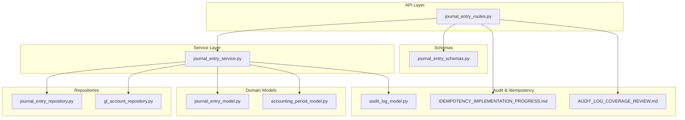
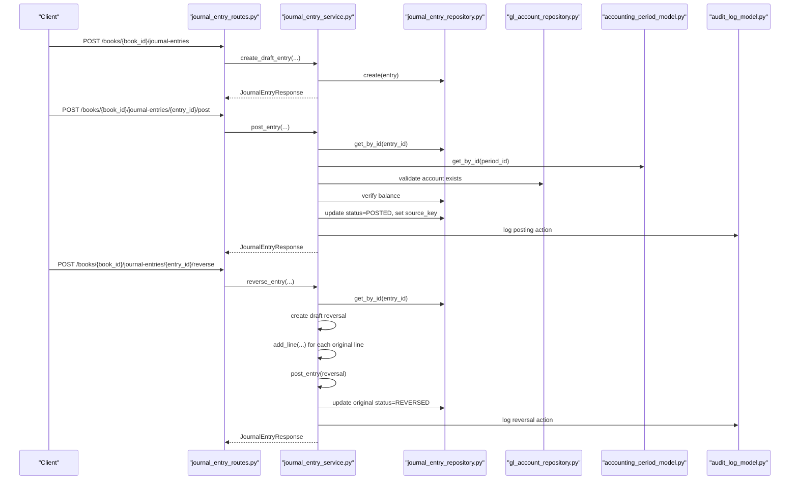
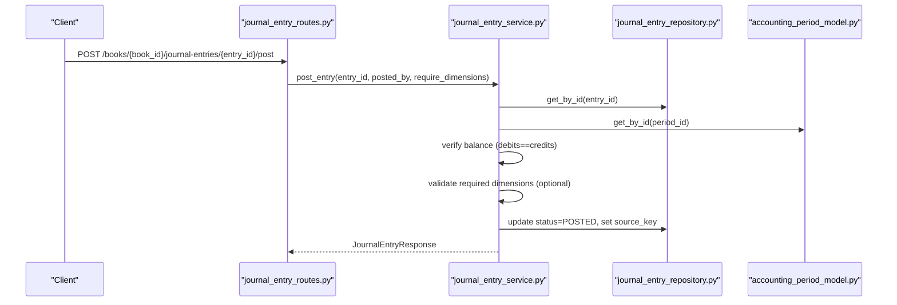
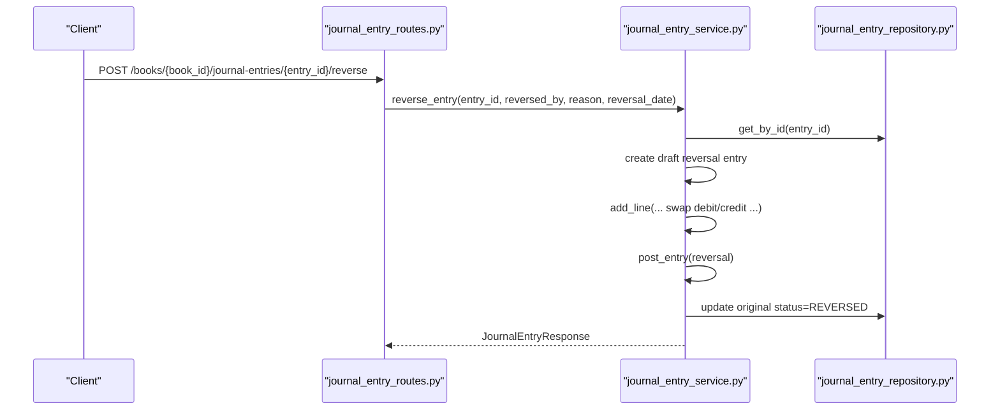
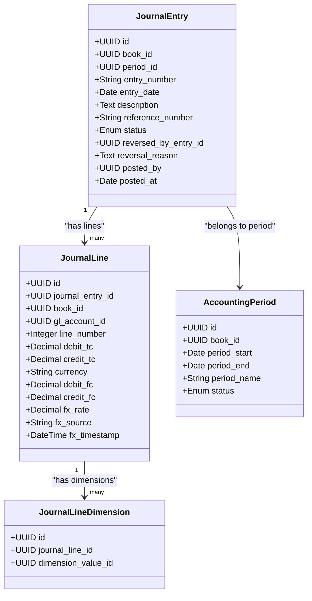

# Journal Entries API

<cite>
**Referenced Files in This Document**
- [journal_entry_routes.py](file://app/modules/general_ledger/api/routes/journal_entry_routes.py)
- [journal_entry_service.py](file://app/modules/general_ledger/services/journal_entry_service.py)
- [journal_entry_model.py](file://app/modules/general_ledger/models/journal_entry_model.py)
- [journal_entry_schemas.py](file://app/modules/general_ledger/schemas/journal_entry_schemas.py)
- [journal_entry_repository.py](file://app/modules/general_ledger/repositories/journal_entry_repository.py)
- [gl_account_repository.py](file://app/modules/general_ledger/repositories/gl_account_repository.py)
- [accounting_period_model.py](file://app/modules/general_ledger/models/accounting_period_model.py)
- [audit_log_model.py](file://app/modules/core/models/audit_log_model.py)
- [IDEMPOTENCY_IMPLEMENTATION_PROGRESS.md](file://docs/01-main/IDEMPOTENCY_IMPLEMENTATION_PROGRESS.md)
- [AUDIT_LOG_COVERAGE_REVIEW.md](file://docs/01-main/AUDIT_LOG_COVERAGE_REVIEW.md)
</cite>

## Table of Contents
1. [Introduction](#introduction)
2. [Project Structure](#project-structure)
3. [Core Components](#core-components)
4. [Architecture Overview](#architecture-overview)
5. [Detailed Component Analysis](#detailed-component-analysis)
6. [Dependency Analysis](#dependency-analysis)
7. [Performance Considerations](#performance-considerations)
8. [Troubleshooting Guide](#troubleshooting-guide)
9. [Conclusion](#conclusion)
10. [Appendices](#appendices)

## Introduction
This document provides comprehensive API documentation for Journal Entry processing endpoints. It covers creation with line items, posting, reversal, validation, batch line operations, and integration with approval workflows. It also documents entry status tracking (Draft, Posted, Reversed), audit trails, and error handling for posting failures. Validation rules include account existence, amount balancing, and period restrictions.

## Project Structure
The Journal Entry feature is implemented under the General Ledger module with clear separation of concerns:
- API routes define endpoints and orchestrate user requests
- Services encapsulate business logic for creation, posting, reversal, and validation
- Models define the persistent entities and constraints
- Repositories abstract data access
- Schemas define request/response contracts
- Audit logging and idempotency are integrated across the stack

**Diagram sources**
- [journal_entry_routes.py](file://app/modules/general_ledger/api/routes/journal_entry_routes.py#L1-L377)
- [journal_entry_service.py](file://app/modules/general_ledger/services/journal_entry_service.py#L1-L635)
- [journal_entry_model.py](file://app/modules/general_ledger/models/journal_entry_model.py#L1-L128)
- [accounting_period_model.py](file://app/modules/general_ledger/models/accounting_period_model.py#L1-L50)
- [journal_entry_repository.py](file://app/modules/general_ledger/repositories/journal_entry_repository.py#L1-L119)
- [gl_account_repository.py](file://app/modules/general_ledger/repositories/gl_account_repository.py#L1-L82)
- [journal_entry_schemas.py](file://app/modules/general_ledger/schemas/journal_entry_schemas.py#L1-L136)
- [audit_log_model.py](file://app/modules/core/models/audit_log_model.py#L1-L42)
- [IDEMPOTENCY_IMPLEMENTATION_PROGRESS.md](file://docs/01-main/IDEMPOTENCY_IMPLEMENTATION_PROGRESS.md#L1-L43)
- [AUDIT_LOG_COVERAGE_REVIEW.md](file://docs/01-main/AUDIT_LOG_COVERAGE_REVIEW.md#L1-L199)

**Section sources**
- [journal_entry_routes.py](file://app/modules/general_ledger/api/routes/journal_entry_routes.py#L1-L377)
- [journal_entry_service.py](file://app/modules/general_ledger/services/journal_entry_service.py#L1-L635)
- [journal_entry_model.py](file://app/modules/general_ledger/models/journal_entry_model.py#L1-L128)
- [journal_entry_repository.py](file://app/modules/general_ledger/repositories/journal_entry_repository.py#L1-L119)
- [gl_account_repository.py](file://app/modules/general_ledger/repositories/gl_account_repository.py#L1-L82)
- [journal_entry_schemas.py](file://app/modules/general_ledger/schemas/journal_entry_schemas.py#L1-L136)
- [accounting_period_model.py](file://app/modules/general_ledger/models/accounting_period_model.py#L1-L50)
- [audit_log_model.py](file://app/modules/core/models/audit_log_model.py#L1-L42)
- [IDEMPOTENCY_IMPLEMENTATION_PROGRESS.md](file://docs/01-main/IDEMPOTENCY_IMPLEMENTATION_PROGRESS.md#L1-L43)
- [AUDIT_LOG_COVERAGE_REVIEW.md](file://docs/01-main/AUDIT_LOG_COVERAGE_REVIEW.md#L1-L199)

## Core Components
- API Routes: Define endpoints for creating, listing, retrieving, posting, reversing, validating, and bulk upserting journal entry lines.
- Service: Implements business logic for draft creation, line addition, posting with validations, reversal, dimension enforcement, and bulk line operations.
- Models: Define JournalEntry, JournalLine, JournalLineDimension, and AccountingPeriod with constraints and relationships.
- Repositories: Provide CRUD and lookup operations for entries, lines, accounts, and periods.
- Schemas: Define Pydantic models for request/response validation and serialization.
- Audit & Idempotency: Centralized audit logging and idempotency support for safe retries and deterministic posting.

**Section sources**
- [journal_entry_routes.py](file://app/modules/general_ledger/api/routes/journal_entry_routes.py#L28-L377)
- [journal_entry_service.py](file://app/modules/general_ledger/services/journal_entry_service.py#L40-L635)
- [journal_entry_model.py](file://app/modules/general_ledger/models/journal_entry_model.py#L10-L128)
- [journal_entry_repository.py](file://app/modules/general_ledger/repositories/journal_entry_repository.py#L16-L119)
- [gl_account_repository.py](file://app/modules/general_ledger/repositories/gl_account_repository.py#L10-L82)
- [journal_entry_schemas.py](file://app/modules/general_ledger/schemas/journal_entry_schemas.py#L9-L136)
- [audit_log_model.py](file://app/modules/core/models/audit_log_model.py#L9-L42)
- [IDEMPOTENCY_IMPLEMENTATION_PROGRESS.md](file://docs/01-main/IDEMPOTENCY_IMPLEMENTATION_PROGRESS.md#L14-L43)

## Architecture Overview
The Journal Entry API follows a layered architecture:
- API routes accept requests, enforce idempotency, and delegate to the service layer
- Service coordinates repositories and domain models to enforce business rules
- Repositories abstract persistence and expose typed operations
- Schemas validate inputs and outputs
- Audit logging captures user actions and system events
- Idempotency ensures safe retries for posting and reversal

**Diagram sources**
- [journal_entry_routes.py](file://app/modules/general_ledger/api/routes/journal_entry_routes.py#L31-L245)
- [journal_entry_service.py](file://app/modules/general_ledger/services/journal_entry_service.py#L53-L313)
- [journal_entry_repository.py](file://app/modules/general_ledger/repositories/journal_entry_repository.py#L16-L74)
- [gl_account_repository.py](file://app/modules/general_ledger/repositories/gl_account_repository.py#L16-L28)
- [accounting_period_model.py](file://app/modules/general_ledger/models/accounting_period_model.py#L9-L16)
- [audit_log_model.py](file://app/modules/core/models/audit_log_model.py#L9-L42)

## Detailed Component Analysis

### API Endpoints Overview
- Create Journal Entry: Creates a draft entry and adds lines individually or via bulk upsert.
- List Journal Entries: Filters by status and period.
- Get Journal Entry: Retrieves entry with associated lines.
- Post Journal Entry: Validates and posts an entry; supports idempotency.
- Reverse Journal Entry: Creates a reversal entry and marks the original as reversed.
- Validate Journal Entry: Checks balance and dimension requirements.
- Bulk Upsert Lines: Efficiently upserts and deletes lines in a single call.

**Section sources**
- [journal_entry_routes.py](file://app/modules/general_ledger/api/routes/journal_entry_routes.py#L31-L377)

### Endpoint Definitions and Behavior

#### Create Journal Entry
- Path: POST /books/{book_id}/journal-entries
- Purpose: Create a draft journal entry and populate initial lines
- Key behaviors:
  - Validates idempotency key uniqueness
  - Assigns period based on entry date
  - Generates entry number
  - Adds lines one-by-one with account validation and amount checks
- Response: JournalEntryResponse with populated lines

**Section sources**
- [journal_entry_routes.py](file://app/modules/general_ledger/api/routes/journal_entry_routes.py#L31-L84)
- [journal_entry_service.py](file://app/modules/general_ledger/services/journal_entry_service.py#L53-L100)
- [journal_entry_service.py](file://app/modules/general_ledger/services/journal_entry_service.py#L102-L169)

#### List Journal Entries
- Path: GET /books/{book_id}/journal-entries
- Query params: status, period_id, limit, offset
- Response: Array of JournalEntryResponse

**Section sources**
- [journal_entry_routes.py](file://app/modules/general_ledger/api/routes/journal_entry_routes.py#L86-L104)
- [journal_entry_repository.py](file://app/modules/general_ledger/repositories/journal_entry_repository.py#L41-L61)

#### Get Journal Entry
- Path: GET /books/{book_id}/journal-entries/{entry_id}
- Behavior: Loads entry and attaches lines
- Response: JournalEntryResponse with lines

**Section sources**
- [journal_entry_routes.py](file://app/modules/general_ledger/api/routes/journal_entry_routes.py#L107-L121)
- [journal_entry_repository.py](file://app/modules/general_ledger/repositories/journal_entry_repository.py#L83-L90)

#### Post Journal Entry
- Path: POST /books/{book_id}/journal-entries/{entry_id}/post
- Body: JournalEntryPostRequest (requires posted_by, optional require_dimensions)
- Idempotency: Requires Idempotency-Key header; applies idempotency wrapper
- Validation:
  - Entry must be DRAFT
  - Period must not be locked
  - Debits must equal credits
  - Dimensions enforced if required
- Response: JournalEntryResponse

**Diagram sources**
- [journal_entry_routes.py](file://app/modules/general_ledger/api/routes/journal_entry_routes.py#L124-L185)
- [journal_entry_service.py](file://app/modules/general_ledger/services/journal_entry_service.py#L171-L242)
- [journal_entry_repository.py](file://app/modules/general_ledger/repositories/journal_entry_repository.py#L63-L74)
- [accounting_period_model.py](file://app/modules/general_ledger/models/accounting_period_model.py#L9-L16)

**Section sources**
- [journal_entry_routes.py](file://app/modules/general_ledger/api/routes/journal_entry_routes.py#L124-L185)
- [journal_entry_service.py](file://app/modules/general_ledger/services/journal_entry_service.py#L171-L242)

#### Reverse Journal Entry
- Path: POST /books/{book_id}/journal-entries/{entry_id}/reverse
- Body: JournalEntryReverseRequest (reversed_by, reason, optional reversal_date)
- Idempotency: Requires Idempotency-Key header; applies idempotency wrapper
- Behavior:
  - Validates original entry is POSTED and not already reversed
  - Creates a new draft reversal entry
  - Swaps debit/credit for each line
  - Posts the reversal entry
  - Marks original entry as REVERSED

**Diagram sources**
- [journal_entry_routes.py](file://app/modules/general_ledger/api/routes/journal_entry_routes.py#L187-L245)
- [journal_entry_service.py](file://app/modules/general_ledger/services/journal_entry_service.py#L244-L313)

**Section sources**
- [journal_entry_routes.py](file://app/modules/general_ledger/api/routes/journal_entry_routes.py#L187-L245)
- [journal_entry_service.py](file://app/modules/general_ledger/services/journal_entry_service.py#L244-L313)

#### Validate Journal Entry
- Path: POST /books/{book_id}/journal-entries/{entry_id}:validate
- Behavior:
  - Computes totals and checks balance
  - If draft, validates required dimensions per line
- Response: Validation result with is_valid, totals, and errors

**Section sources**
- [journal_entry_routes.py](file://app/modules/general_ledger/api/routes/journal_entry_routes.py#L247-L306)
- [journal_entry_service.py](file://app/modules/general_ledger/services/journal_entry_service.py#L344-L381)

#### Bulk Upsert Journal Lines
- Path: POST /books/{book_id}/journal-entries/{entry_id}/lines:bulkUpsert
- Body: JournalLineBulkUpsertRequest (supports UPSERT and DELETE)
- Behavior:
  - Validates account existence (by ID or code)
  - Enforces one-and-only-one amount field per line
  - Resolves dimension values by code
  - Updates or creates lines, clears and re-applies dimensions
  - Deletes orphaned lines
- Response: JournalLineBulkUpsertResponse with per-row errors

**Section sources**
- [journal_entry_routes.py](file://app/modules/general_ledger/api/routes/journal_entry_routes.py#L309-L377)
- [journal_entry_service.py](file://app/modules/general_ledger/services/journal_entry_service.py#L410-L634)

### Entry Line Items and Currency Handling
- Line model fields include functional and transaction currency amounts, FX rate, and descriptions
- Validation enforces either debit or credit (not both) and non-negative amounts
- Currency defaults to book currency when not provided during bulk upsert
- Dimensions are attached per line and validated during posting when required

**Section sources**
- [journal_entry_model.py](file://app/modules/general_ledger/models/journal_entry_model.py#L68-L108)
- [journal_entry_schemas.py](file://app/modules/general_ledger/schemas/journal_entry_schemas.py#L9-L22)
- [journal_entry_service.py](file://app/modules/general_ledger/services/journal_entry_service.py#L410-L531)

### Entry Status Tracking
- Status values: DRAFT, POSTED, REVERSED
- Posting transitions DRAFT → POSTED and sets source_key for idempotency
- Reversal transitions POSTED → REVERSED and links reversal entry

**Section sources**
- [journal_entry_model.py](file://app/modules/general_ledger/models/journal_entry_model.py#L10-L15)
- [journal_entry_model.py](file://app/modules/general_ledger/models/journal_entry_model.py#L38-L44)
- [journal_entry_service.py](file://app/modules/general_ledger/services/journal_entry_service.py#L233-L242)
- [journal_entry_service.py](file://app/modules/general_ledger/services/journal_entry_service.py#L305-L310)

### Validation Rules
- Amount balancing: Total debit_fc equals total credit_fc
- Account existence: Account must exist and belong to the same book
- Period restrictions: Period must not be locked
- Dimensions: Required for posting when configured; enforced per line
- Idempotency: Prevents duplicate postings and reversals

**Section sources**
- [journal_entry_service.py](file://app/modules/general_ledger/services/journal_entry_service.py#L199-L211)
- [journal_entry_service.py](file://app/modules/general_ledger/services/journal_entry_service.py#L125-L131)
- [journal_entry_service.py](file://app/modules/general_ledger/services/journal_entry_service.py#L186-L193)
- [journal_entry_service.py](file://app/modules/general_ledger/services/journal_entry_service.py#L344-L381)
- [IDEMPOTENCY_IMPLEMENTATION_PROGRESS.md](file://docs/01-main/IDEMPOTENCY_IMPLEMENTATION_PROGRESS.md#L23-L41)

### Auto-Entry Generation and Approval Workflows
- Auto-entry generation: Not implemented in the Journal Entry module; posting is manual via the post endpoint
- Approval workflows: Separate from Journal Entries; see AP Bill and Period Close services for approval patterns
- Audit logs: Journal Entry creation, posting, and reversal are covered in audit log review

**Section sources**
- [AUDIT_LOG_COVERAGE_REVIEW.md](file://docs/01-main/AUDIT_LOG_COVERAGE_REVIEW.md#L48-L52)
- [ap_bill_approval_service.py](file://app/modules/ap/services/ap_bill_approval_service.py#L34-L94)
- [period_close_approval_service.py](file://app/modules/general_ledger/services/period_close_approval_service.py#L39-L109)

### Examples of Complex Entries
- Multi-currency transactions: Use transaction currency fields and FX rate; ensure functional and transaction amounts are set consistently
- Intercompany transfers: Use appropriate accounts and dimensions; ensure reversal entries maintain proper mapping
- Approval workflows: While not part of Journal Entries, posting can be integrated with broader approval policies

Note: Specific payload examples are not included here; refer to the schemas for field definitions.

**Section sources**
- [journal_entry_schemas.py](file://app/modules/general_ledger/schemas/journal_entry_schemas.py#L9-L22)
- [journal_entry_schemas.py](file://app/modules/general_ledger/schemas/journal_entry_schemas.py#L99-L115)
- [journal_entry_model.py](file://app/modules/general_ledger/models/journal_entry_model.py#L77-L90)

## Dependency Analysis

**Diagram sources**
- [journal_entry_model.py](file://app/modules/general_ledger/models/journal_entry_model.py#L17-L108)
- [accounting_period_model.py](file://app/modules/general_ledger/models/accounting_period_model.py#L18-L41)

**Section sources**
- [journal_entry_model.py](file://app/modules/general_ledger/models/journal_entry_model.py#L17-L108)
- [accounting_period_model.py](file://app/modules/general_ledger/models/accounting_period_model.py#L18-L41)

## Performance Considerations
- Prefer bulk upsert for high-volume line updates to minimize round-trips
- Use pagination (limit/offset) when listing entries
- Ensure indexes on frequently filtered fields (book_id, status, period_id, entry_date)
- Keep dimension queries efficient by batching dimension lookups

[No sources needed since this section provides general guidance]

## Troubleshooting Guide
Common errors and resolutions:
- Not Found: Entry, book, or account not found
- Validation Error: Unbalanced amounts, invalid dimension combinations, or invalid line amounts
- Posting Error: Entry not balanced or posting failure reasons
- Period Locked Error: Cannot post to a locked period
- Duplicate Entry Error: Attempting duplicate posting or reversal
- Idempotency Violation: Retry with same key yields previous result

Operational tips:
- Use the validation endpoint to pre-check entries before posting
- Ensure required dimensions are present when require_dimensions is true
- Confirm period status before attempting posting

**Section sources**
- [journal_entry_routes.py](file://app/modules/general_ledger/api/routes/journal_entry_routes.py#L78-L84)
- [journal_entry_routes.py](file://app/modules/general_ledger/api/routes/journal_entry_routes.py#L177-L184)
- [journal_entry_routes.py](file://app/modules/general_ledger/api/routes/journal_entry_routes.py#L370-L376)
- [journal_entry_service.py](file://app/modules/general_ledger/services/journal_entry_service.py#L199-L211)
- [journal_entry_service.py](file://app/modules/general_ledger/services/journal_entry_service.py#L186-L193)
- [journal_entry_service.py](file://app/modules/general_ledger/services/journal_entry_service.py#L209-L211)

## Conclusion
The Journal Entries API provides robust capabilities for creating, validating, posting, and reversing entries with strong safeguards around balancing, dimensions, and period controls. Idempotency and audit logging ensure safe, repeatable operations and comprehensive traceability. Bulk line operations streamline complex entries, while clear schemas and validation rules support reliable integrations.

[No sources needed since this section summarizes without analyzing specific files]

## Appendices

### Endpoint Reference Summary
- POST /books/{book_id}/journal-entries
- GET /books/{book_id}/journal-entries
- GET /books/{book_id}/journal-entries/{entry_id}
- POST /books/{book_id}/journal-entries/{entry_id}/post
- POST /books/{book_id}/journal-entries/{entry_id}/reverse
- POST /books/{book_id}/journal-entries/{entry_id}:validate
- POST /books/{book_id}/journal-entries/{entry_id}/lines:bulkUpsert

**Section sources**
- [journal_entry_routes.py](file://app/modules/general_ledger/api/routes/journal_entry_routes.py#L31-L377)

### Audit Trail Coverage
- Journal Entry creation, posting, and reversal are covered in audit log review
- Additional enhancements recommended for configuration changes and bulk operations

**Section sources**
- [AUDIT_LOG_COVERAGE_REVIEW.md](file://docs/01-main/AUDIT_LOG_COVERAGE_REVIEW.md#L48-L61)
- [AUDIT_LOG_COVERAGE_REVIEW.md](file://docs/01-main/AUDIT_LOG_COVERAGE_REVIEW.md#L105-L176)