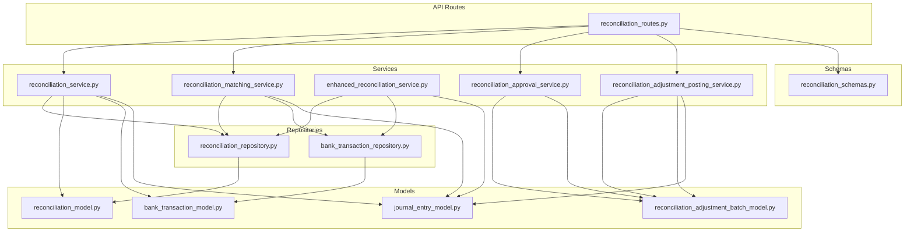
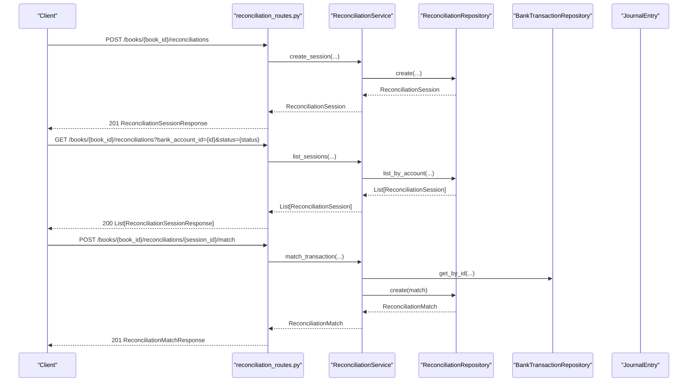
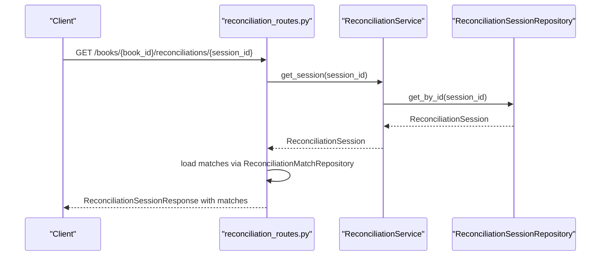
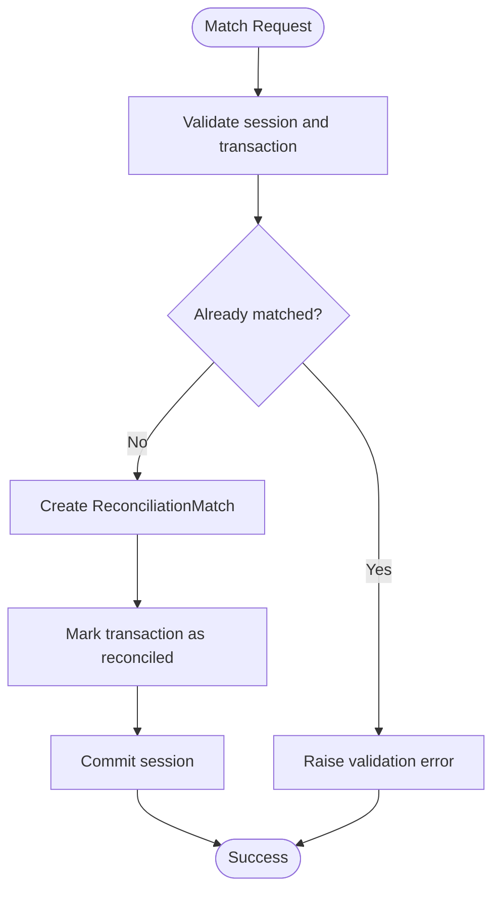
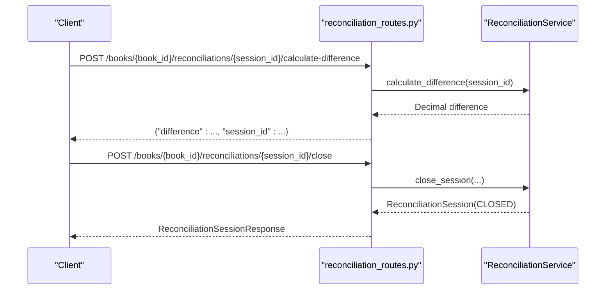
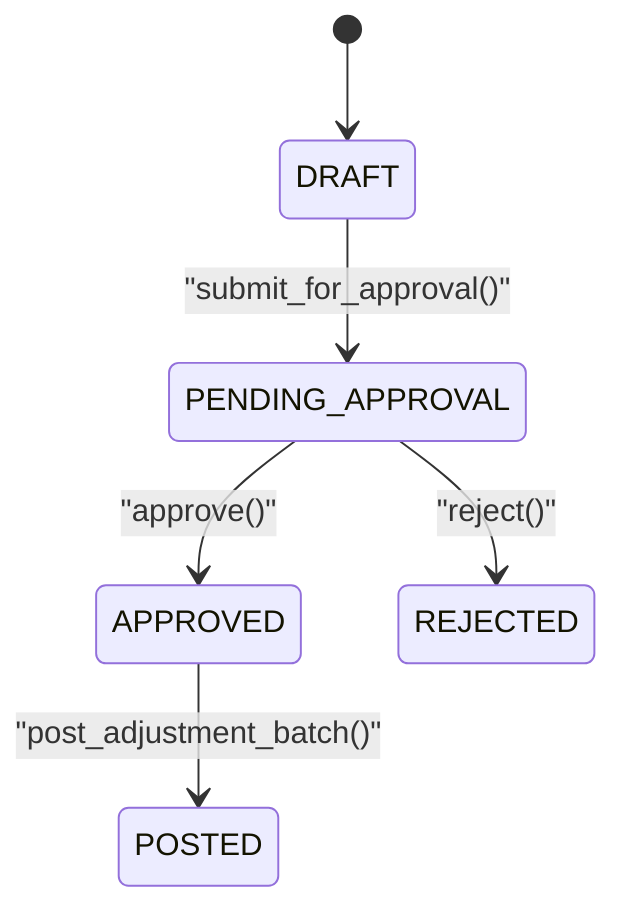
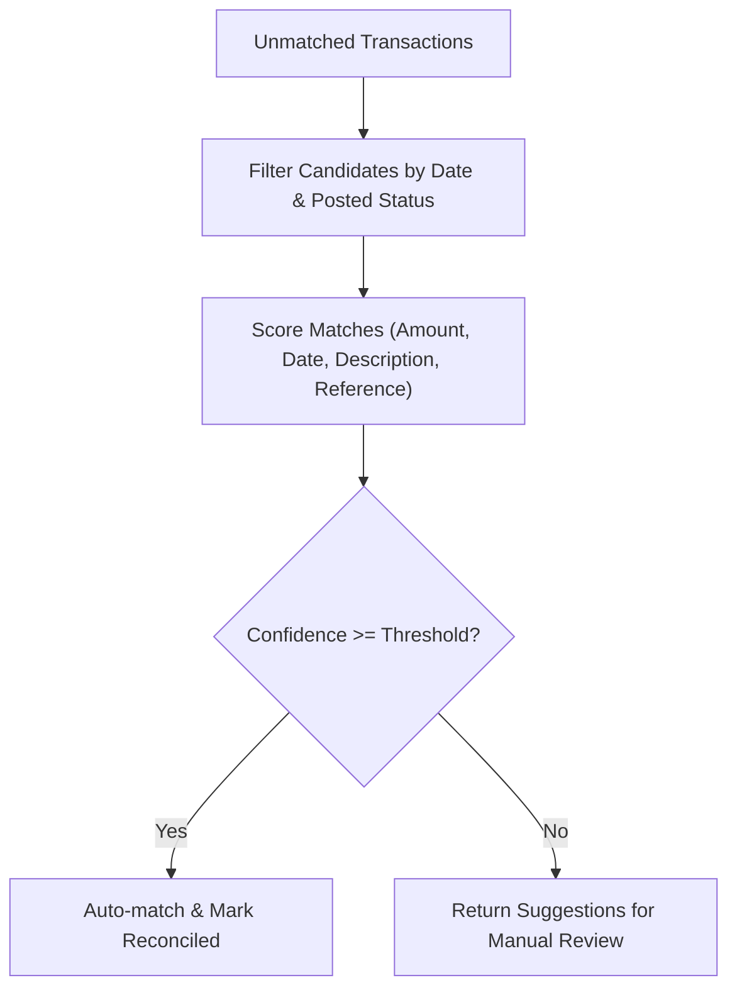
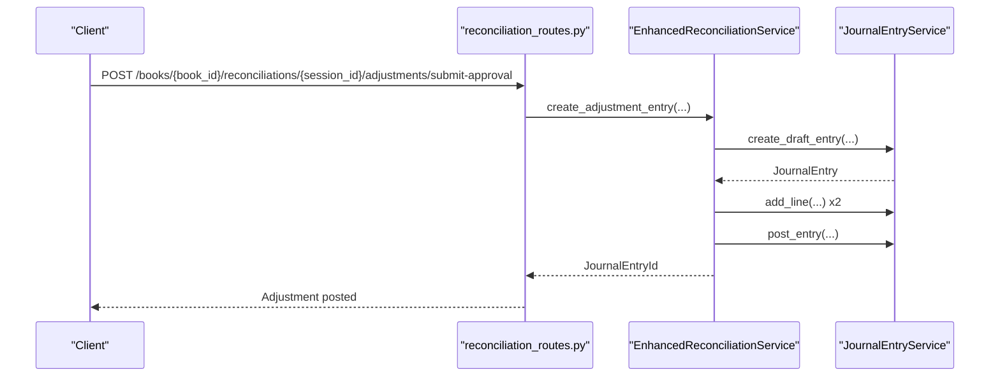
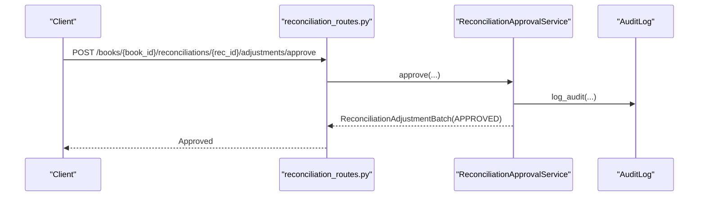
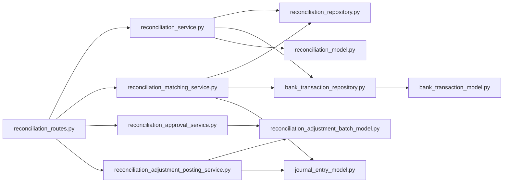

# Reconciliation API

<cite>
**Referenced Files in This Document**
- [reconciliation_routes.py](file://app/modules/general_ledger/api/routes/reconciliation_routes.py)
- [reconciliation_model.py](file://app/modules/general_ledger/models/reconciliation_model.py)
- [reconciliation_schemas.py](file://app/modules/general_ledger/schemas/reconciliation_schemas.py)
- [reconciliation_service.py](file://app/modules/general_ledger/services/reconciliation_service.py)
- [reconciliation_matching_service.py](file://app/modules/general_ledger/services/reconciliation_matching_service.py)
- [enhanced_reconciliation_service.py](file://app/modules/general_ledger/services/enhanced_reconciliation_service.py)
- [reconciliation_adjustment_posting_service.py](file://app/modules/general_ledger/services/reconciliation_adjustment_posting_service.py)
- [reconciliation_approval_service.py](file://app/modules/general_ledger/services/reconciliation_approval_service.py)
- [reconciliation_adjustment_batch_model.py](file://app/modules/general_ledger/models/reconciliation_adjustment_batch_model.py)
- [reconciliation_repository.py](file://app/modules/general_ledger/repositories/reconciliation_repository.py)
- [bank_transaction_model.py](file://app/modules/treasury/models/bank_transaction_model.py)
- [bank_transaction_repository.py](file://app/modules/treasury/repositories/bank_transaction_repository.py)
- [journal_entry_model.py](file://app/modules/general_ledger/models/journal_entry_model.py)
- [ADDENDUM_B_RECONCILIATION_MATCHING.md](file://docs/01-main/ADDENDUM_B_RECONCILIATION_MATCHING.md)
</cite>

## Table of Contents
1. [Introduction](#introduction)
2. [Project Structure](#project-structure)
3. [Core Components](#core-components)
4. [Architecture Overview](#architecture-overview)
5. [Detailed Component Analysis](#detailed-component-analysis)
6. [Dependency Analysis](#dependency-analysis)
7. [Performance Considerations](#performance-considerations)
8. [Troubleshooting Guide](#troubleshooting-guide)
9. [Conclusion](#conclusion)
10. [Appendices](#appendices)

## Introduction
This document provides comprehensive API documentation for the Bank Reconciliation module. It covers reconciliation sessions, matching algorithms, adjustment entries, approval workflows, and integration with external bank feeds. The API supports:
- Creating and listing reconciliation sessions
- Matching bank transactions to journal entries (manual and suggestions)
- Calculating reconciliation differences
- Closing sessions with validation
- Managing adjustment batches through submission, approval, rejection, and posting
- Batch matching for imported bank statements
- Manual adjustments for uncleared items
- Reconciliation status tracking and audit trail requirements

## Project Structure
The reconciliation feature spans API routes, services, repositories, models, and schemas under the General Ledger and Treasury modules. The routes define the REST endpoints, services encapsulate business logic, repositories handle persistence, and models define the domain entities.

**Diagram sources**
- [reconciliation_routes.py](file://app/modules/general_ledger/api/routes/reconciliation_routes.py#L1-L378)
- [reconciliation_service.py](file://app/modules/general_ledger/services/reconciliation_service.py#L1-L188)
- [reconciliation_matching_service.py](file://app/modules/general_ledger/services/reconciliation_matching_service.py#L1-L270)
- [enhanced_reconciliation_service.py](file://app/modules/general_ledger/services/enhanced_reconciliation_service.py#L1-L329)
- [reconciliation_approval_service.py](file://app/modules/general_ledger/services/reconciliation_approval_service.py#L1-L254)
- [reconciliation_adjustment_posting_service.py](file://app/modules/general_ledger/services/reconciliation_adjustment_posting_service.py#L1-L154)
- [reconciliation_repository.py](file://app/modules/general_ledger/repositories/reconciliation_repository.py#L1-L64)
- [bank_transaction_repository.py](file://app/modules/treasury/repositories/bank_transaction_repository.py#L1-L97)
- [reconciliation_model.py](file://app/modules/general_ledger/models/reconciliation_model.py#L1-L68)
- [reconciliation_adjustment_batch_model.py](file://app/modules/general_ledger/models/reconciliation_adjustment_batch_model.py#L1-L57)
- [bank_transaction_model.py](file://app/modules/treasury/models/bank_transaction_model.py#L1-L52)
- [journal_entry_model.py](file://app/modules/general_ledger/models/journal_entry_model.py#L1-L128)
- [reconciliation_schemas.py](file://app/modules/general_ledger/schemas/reconciliation_schemas.py#L1-L117)

**Section sources**
- [reconciliation_routes.py](file://app/modules/general_ledger/api/routes/reconciliation_routes.py#L1-L378)
- [reconciliation_service.py](file://app/modules/general_ledger/services/reconciliation_service.py#L1-L188)
- [reconciliation_matching_service.py](file://app/modules/general_ledger/services/reconciliation_matching_service.py#L1-L270)
- [enhanced_reconciliation_service.py](file://app/modules/general_ledger/services/enhanced_reconciliation_service.py#L1-L329)
- [reconciliation_approval_service.py](file://app/modules/general_ledger/services/reconciliation_approval_service.py#L1-L254)
- [reconciliation_adjustment_posting_service.py](file://app/modules/general_ledger/services/reconciliation_adjustment_posting_service.py#L1-L154)
- [reconciliation_repository.py](file://app/modules/general_ledger/repositories/reconciliation_repository.py#L1-L64)
- [bank_transaction_repository.py](file://app/modules/treasury/repositories/bank_transaction_repository.py#L1-L97)
- [reconciliation_model.py](file://app/modules/general_ledger/models/reconciliation_model.py#L1-L68)
- [reconciliation_adjustment_batch_model.py](file://app/modules/general_ledger/models/reconciliation_adjustment_batch_model.py#L1-L57)
- [bank_transaction_model.py](file://app/modules/treasury/models/bank_transaction_model.py#L1-L52)
- [journal_entry_model.py](file://app/modules/general_ledger/models/journal_entry_model.py#L1-L128)
- [reconciliation_schemas.py](file://app/modules/general_ledger/schemas/reconciliation_schemas.py#L1-L117)

## Core Components
- Reconciliation API routes: Define endpoints for sessions, matching, difference calculation, closing, and adjustment workflows.
- Reconciliation service: Manages session lifecycle, transaction matching, difference calculation, and closing with validation.
- Matching service: Provides intelligent suggestions for matching bank transactions to journal entries using scoring criteria.
- Enhanced reconciliation service: Extends basic reconciliation with auto-matching and creation of adjustment journal entries.
- Approval service: Handles approval workflow transitions for adjustment batches with SoD checks and audit logs.
- Posting service: Posts approved adjustment batches to journal entries and updates statuses.
- Models and repositories: Define domain entities and provide CRUD operations for reconciliation sessions, matches, adjustment batches, and bank transactions.

**Section sources**
- [reconciliation_routes.py](file://app/modules/general_ledger/api/routes/reconciliation_routes.py#L37-L378)
- [reconciliation_service.py](file://app/modules/general_ledger/services/reconciliation_service.py#L22-L188)
- [reconciliation_matching_service.py](file://app/modules/general_ledger/services/reconciliation_matching_service.py#L45-L270)
- [enhanced_reconciliation_service.py](file://app/modules/general_ledger/services/enhanced_reconciliation_service.py#L17-L329)
- [reconciliation_approval_service.py](file://app/modules/general_ledger/services/reconciliation_approval_service.py#L30-L254)
- [reconciliation_adjustment_posting_service.py](file://app/modules/general_ledger/services/reconciliation_adjustment_posting_service.py#L19-L154)
- [reconciliation_model.py](file://app/modules/general_ledger/models/reconciliation_model.py#L18-L68)
- [reconciliation_adjustment_batch_model.py](file://app/modules/general_ledger/models/reconciliation_adjustment_batch_model.py#L19-L57)
- [bank_transaction_model.py](file://app/modules/treasury/models/bank_transaction_model.py#L21-L52)
- [journal_entry_model.py](file://app/modules/general_ledger/models/journal_entry_model.py#L17-L128)

## Architecture Overview
The reconciliation API follows a layered architecture:
- API Layer: FastAPI routes expose endpoints grouped under a dedicated tag.
- Service Layer: Business logic for reconciliation, matching, approval, and posting.
- Repository Layer: Data access for models with typed repositories.
- Model Layer: SQLAlchemy ORM models representing reconciliation sessions, matches, adjustment batches, bank transactions, and journal entries.
- Schema Layer: Pydantic models for request/response validation.

**Diagram sources**
- [reconciliation_routes.py](file://app/modules/general_ledger/api/routes/reconciliation_routes.py#L40-L117)
- [reconciliation_service.py](file://app/modules/general_ledger/services/reconciliation_service.py#L33-L129)
- [reconciliation_repository.py](file://app/modules/general_ledger/repositories/reconciliation_repository.py#L14-L35)
- [bank_transaction_repository.py](file://app/modules/treasury/repositories/bank_transaction_repository.py#L11-L52)
- [journal_entry_model.py](file://app/modules/general_ledger/models/journal_entry_model.py#L17-L57)

**Section sources**
- [reconciliation_routes.py](file://app/modules/general_ledger/api/routes/reconciliation_routes.py#L37-L117)
- [reconciliation_service.py](file://app/modules/general_ledger/services/reconciliation_service.py#L33-L129)
- [reconciliation_repository.py](file://app/modules/general_ledger/repositories/reconciliation_repository.py#L14-L35)
- [bank_transaction_repository.py](file://app/modules/treasury/repositories/bank_transaction_repository.py#L11-L52)
- [journal_entry_model.py](file://app/modules/general_ledger/models/journal_entry_model.py#L17-L57)

## Detailed Component Analysis

### Reconciliation Sessions
Endpoints:
- POST /books/{book_id}/reconciliations: Create a reconciliation session.
- GET /books/{book_id}/reconciliations: List reconciliation sessions for a bank account.
- GET /books/{book_id}/reconciliations/{session_id}: Get a reconciliation session with matches.

Key behaviors:
- Session creation validates bank account existence and currency consistency with the statement currency.
- Listing supports filtering by status.
- Retrieving a session includes associated matches loaded from the match repository.

**Diagram sources**
- [reconciliation_routes.py](file://app/modules/general_ledger/api/routes/reconciliation_routes.py#L75-L93)
- [reconciliation_service.py](file://app/modules/general_ledger/services/reconciliation_service.py#L63-L65)
- [reconciliation_repository.py](file://app/modules/general_ledger/repositories/reconciliation_repository.py#L14-L35)

**Section sources**
- [reconciliation_routes.py](file://app/modules/general_ledger/api/routes/reconciliation_routes.py#L40-L93)
- [reconciliation_service.py](file://app/modules/general_ledger/services/reconciliation_service.py#L33-L74)
- [reconciliation_model.py](file://app/modules/general_ledger/models/reconciliation_model.py#L18-L42)

### Transaction Matching and Suggestions
Endpoints:
- POST /books/{book_id}/reconciliations/{session_id}/match: Manually match a bank transaction to a journal entry.
- GET /books/{book_id}/reconciliations/{session_id}/transactions/{transaction_id}/suggestions: Retrieve matching suggestions.

Matching logic:
- Manual matching validates session, transaction, and period constraints, prevents duplicate matches, and marks the transaction as reconciled.
- Suggestions scoring considers:
  - Exact amount match (weight varies by implementation)
  - Date proximity (with tolerance)
  - Description/text similarity (including reference number match)
  - Reference number exact match
- Auto-match rules and thresholds are documented in the project’s matching addendum.

**Diagram sources**
- [reconciliation_service.py](file://app/modules/general_ledger/services/reconciliation_service.py#L75-L129)

**Section sources**
- [reconciliation_routes.py](file://app/modules/general_ledger/api/routes/reconciliation_routes.py#L96-L117)
- [reconciliation_service.py](file://app/modules/general_ledger/services/reconciliation_service.py#L75-L129)
- [reconciliation_matching_service.py](file://app/modules/general_ledger/services/reconciliation_matching_service.py#L54-L151)
- [ADDENDUM_B_RECONCILIATION_MATCHING.md](file://docs/01-main/ADDENDUM_B_RECONCILIATION_MATCHING.md#L10-L30)

### Difference Calculation and Closing
Endpoints:
- POST /books/{book_id}/reconciliations/{session_id}/calculate-difference: Compute the reconciliation difference.
- POST /books/{book_id}/reconciliations/{session_id}/close: Close a reconciliation session with optional allowance for non-zero differences.

Processing:
- Difference is computed as statement ending balance minus the sum of book transactions within the period.
- Closing requires the difference to be zero (or allow_non_zero set) and updates session status to CLOSED with reconciled_by and reconciled_at.

**Diagram sources**
- [reconciliation_routes.py](file://app/modules/general_ledger/api/routes/reconciliation_routes.py#L119-L198)
- [reconciliation_service.py](file://app/modules/general_ledger/services/reconciliation_service.py#L130-L187)

**Section sources**
- [reconciliation_routes.py](file://app/modules/general_ledger/api/routes/reconciliation_routes.py#L119-L198)
- [reconciliation_service.py](file://app/modules/general_ledger/services/reconciliation_service.py#L130-L187)

### Adjustment Workflows (Approval and Posting)
Endpoints:
- POST /books/{book_id}/reconciliations/{rec_id}/adjustments/submit-approval: Submit an adjustment batch for approval.
- POST /books/{book_id}/reconciliations/{rec_id}/adjustments/approve: Approve an adjustment batch.
- POST /books/{book_id}/reconciliations/{rec_id}/adjustments/reject: Reject an adjustment batch.
- POST /books/{book_id}/reconciliations/{rec_id}/adjustments/post: Post an approved adjustment batch to a journal entry.

Workflow:
- Submission transitions batch from DRAFT to PENDING_APPROVAL (or APPROVED if no approval required).
- Approval enforces separation of duties (SoD) and updates status to APPROVED.
- Rejection requires a reason and transitions to REJECTED.
- Posting validates status APPROVED, creates a journal entry, posts it, and updates batch status to POSTED.

**Diagram sources**
- [reconciliation_adjustment_batch_model.py](file://app/modules/general_ledger/models/reconciliation_adjustment_batch_model.py#L10-L16)
- [reconciliation_approval_service.py](file://app/modules/general_ledger/services/reconciliation_approval_service.py#L38-L229)
- [reconciliation_adjustment_posting_service.py](file://app/modules/general_ledger/services/reconciliation_adjustment_posting_service.py#L28-L141)

**Section sources**
- [reconciliation_routes.py](file://app/modules/general_ledger/api/routes/reconciliation_routes.py#L200-L343)
- [reconciliation_approval_service.py](file://app/modules/general_ledger/services/reconciliation_approval_service.py#L38-L229)
- [reconciliation_adjustment_posting_service.py](file://app/modules/general_ledger/services/reconciliation_adjustment_posting_service.py#L28-L141)
- [reconciliation_adjustment_batch_model.py](file://app/modules/general_ledger/models/reconciliation_adjustment_batch_model.py#L19-L57)

### Batch Matching for Imported Bank Statements
- The matching service identifies candidates within a date tolerance and filters by posted journal entries and existing matches.
- Scoring weights include amount match, date proximity, description similarity, and reference number match.
- The enhanced reconciliation service provides an auto-matching method that iterates through unmatched transactions and best-fit journal lines, applying confidence thresholds.

**Diagram sources**
- [reconciliation_matching_service.py](file://app/modules/general_ledger/services/reconciliation_matching_service.py#L54-L151)
- [enhanced_reconciliation_service.py](file://app/modules/general_ledger/services/enhanced_reconciliation_service.py#L25-L159)

**Section sources**
- [reconciliation_matching_service.py](file://app/modules/general_ledger/services/reconciliation_matching_service.py#L54-L151)
- [enhanced_reconciliation_service.py](file://app/modules/general_ledger/services/enhanced_reconciliation_service.py#L25-L159)
- [ADDENDUM_B_RECONCILIATION_MATCHING.md](file://docs/01-main/ADDENDUM_B_RECONCILIATION_MATCHING.md#L18-L30)

### Manual Adjustments for Uncleared Items
- The enhanced reconciliation service supports creating adjustment journal entries for timing differences, bank errors, or book errors.
- It computes the appropriate cash account and adjustment account mappings, constructs a journal entry, posts it, and updates session notes.

**Diagram sources**
- [enhanced_reconciliation_service.py](file://app/modules/general_ledger/services/enhanced_reconciliation_service.py#L220-L329)
- [reconciliation_routes.py](file://app/modules/general_ledger/api/routes/reconciliation_routes.py#L200-L226)

**Section sources**
- [enhanced_reconciliation_service.py](file://app/modules/general_ledger/services/enhanced_reconciliation_service.py#L220-L329)
- [journal_entry_model.py](file://app/modules/general_ledger/models/journal_entry_model.py#L17-L57)

### Reconciliation Status Tracking and Audit Trail
- Status transitions are enforced for adjustment batches (DRAFT → PENDING_APPROVAL → APPROVED → POSTED or REJECTED).
- Approval actions are logged with audit logs capturing before/after status and reason.
- Idempotency keys are used for close and post operations to prevent duplicate processing.

**Diagram sources**
- [reconciliation_routes.py](file://app/modules/general_ledger/api/routes/reconciliation_routes.py#L228-L277)
- [reconciliation_approval_service.py](file://app/modules/general_ledger/services/reconciliation_approval_service.py#L101-L163)
- [reconciliation_approval_service.py](file://app/modules/general_ledger/services/reconciliation_approval_service.py#L231-L254)

**Section sources**
- [reconciliation_routes.py](file://app/modules/general_ledger/api/routes/reconciliation_routes.py#L134-L198)
- [reconciliation_routes.py](file://app/modules/general_ledger/api/routes/reconciliation_routes.py#L280-L343)
- [reconciliation_approval_service.py](file://app/modules/general_ledger/services/reconciliation_approval_service.py#L38-L229)

### Reconciliation Templates and Rules Engines
- Matching suggestions incorporate configurable tolerances (date and amount) and scoring weights.
- The enhanced service supports auto-matching with tunable thresholds and confidence cutoffs.
- The project’s matching addendum defines scoring weights and auto-match rules for MVP.

**Section sources**
- [reconciliation_matching_service.py](file://app/modules/general_ledger/services/reconciliation_matching_service.py#L54-L151)
- [enhanced_reconciliation_service.py](file://app/modules/general_ledger/services/enhanced_reconciliation_service.py#L25-L159)
- [ADDENDUM_B_RECONCILIATION_MATCHING.md](file://docs/01-main/ADDENDUM_B_RECONCILIATION_MATCHING.md#L10-L30)

### Integration with External Bank Feeds
- Bank transactions support external IDs and import batch identifiers for deduplication and batch processing.
- Cursor-based pagination enables incremental synchronization of imported transactions.
- Matching leverages reference numbers and descriptions to connect imported transactions to posted journal entries.

**Section sources**
- [bank_transaction_model.py](file://app/modules/treasury/models/bank_transaction_model.py#L21-L52)
- [bank_transaction_repository.py](file://app/modules/treasury/repositories/bank_transaction_repository.py#L54-L97)
- [reconciliation_matching_service.py](file://app/modules/general_ledger/services/reconciliation_matching_service.py#L196-L224)

## Dependency Analysis
The reconciliation API exhibits clear layering with low coupling between modules:
- Routes depend on services and schemas.
- Services depend on repositories and models.
- Repositories depend on SQLAlchemy models.
- Matching and enhanced services extend base reconciliation logic.

**Diagram sources**
- [reconciliation_routes.py](file://app/modules/general_ledger/api/routes/reconciliation_routes.py#L1-L378)
- [reconciliation_service.py](file://app/modules/general_ledger/services/reconciliation_service.py#L1-L188)
- [reconciliation_matching_service.py](file://app/modules/general_ledger/services/reconciliation_matching_service.py#L1-L270)
- [reconciliation_approval_service.py](file://app/modules/general_ledger/services/reconciliation_approval_service.py#L1-L254)
- [reconciliation_adjustment_posting_service.py](file://app/modules/general_ledger/services/reconciliation_adjustment_posting_service.py#L1-L154)
- [reconciliation_repository.py](file://app/modules/general_ledger/repositories/reconciliation_repository.py#L1-L64)
- [bank_transaction_repository.py](file://app/modules/treasury/repositories/bank_transaction_repository.py#L1-L97)
- [reconciliation_model.py](file://app/modules/general_ledger/models/reconciliation_model.py#L1-L68)
- [reconciliation_adjustment_batch_model.py](file://app/modules/general_ledger/models/reconciliation_adjustment_batch_model.py#L1-L57)
- [bank_transaction_model.py](file://app/modules/treasury/models/bank_transaction_model.py#L1-L52)
- [journal_entry_model.py](file://app/modules/general_ledger/models/journal_entry_model.py#L1-L128)

**Section sources**
- [reconciliation_routes.py](file://app/modules/general_ledger/api/routes/reconciliation_routes.py#L1-L378)
- [reconciliation_service.py](file://app/modules/general_ledger/services/reconciliation_service.py#L1-L188)
- [reconciliation_matching_service.py](file://app/modules/general_ledger/services/reconciliation_matching_service.py#L1-L270)
- [reconciliation_approval_service.py](file://app/modules/general_ledger/services/reconciliation_approval_service.py#L1-L254)
- [reconciliation_adjustment_posting_service.py](file://app/modules/general_ledger/services/reconciliation_adjustment_posting_service.py#L1-L154)
- [reconciliation_repository.py](file://app/modules/general_ledger/repositories/reconciliation_repository.py#L1-L64)
- [bank_transaction_repository.py](file://app/modules/treasury/repositories/bank_transaction_repository.py#L1-L97)
- [reconciliation_model.py](file://app/modules/general_ledger/models/reconciliation_model.py#L1-L68)
- [reconciliation_adjustment_batch_model.py](file://app/modules/general_ledger/models/reconciliation_adjustment_batch_model.py#L1-L57)
- [bank_transaction_model.py](file://app/modules/treasury/models/bank_transaction_model.py#L1-L52)
- [journal_entry_model.py](file://app/modules/general_ledger/models/journal_entry_model.py#L1-L128)

## Performance Considerations
- Matching queries filter candidates by date windows and posted status to reduce search space.
- Cursor pagination for bank transactions supports efficient incremental synchronization.
- Confidence thresholds and top-N suggestions limit UI and processing overhead.
- Idempotency guards prevent redundant processing of close and post operations.

[No sources needed since this section provides general guidance]

## Troubleshooting Guide
Common issues and resolutions:
- Not Found Errors: Occur when sessions, transactions, or batches are missing; verify IDs and relationships.
- Validation Errors: Include currency mismatch, non-zero difference when closing, and duplicate matches.
- Approval Errors: Raised when attempting invalid state transitions or violating SoD policies; ensure proper roles and reasons.
- Posting Errors: Occur if batch status is not APPROVED; confirm approval workflow completion.

**Section sources**
- [reconciliation_service.py](file://app/modules/general_ledger/services/reconciliation_service.py#L42-L48)
- [reconciliation_service.py](file://app/modules/general_ledger/services/reconciliation_service.py#L170-L175)
- [reconciliation_approval_service.py](file://app/modules/general_ledger/services/reconciliation_approval_service.py#L59-L63)
- [reconciliation_approval_service.py](file://app/modules/general_ledger/services/reconciliation_approval_service.py#L123-L127)
- [reconciliation_adjustment_posting_service.py](file://app/modules/general_ledger/services/reconciliation_adjustment_posting_service.py#L42-L46)

## Conclusion
The Reconciliation API provides a robust foundation for bank reconciliation with automated matching, manual review, approval workflows, and auditability. Its modular design supports extensibility for recurring adjustments, advanced matching rules, and integration with external bank feeds.

[No sources needed since this section summarizes without analyzing specific files]

## Appendices

### API Endpoints Summary
- Create reconciliation session: POST /books/{book_id}/reconciliations
- List reconciliation sessions: GET /books/{book_id}/reconciliations
- Get reconciliation session: GET /books/{book_id}/reconciliations/{session_id}
- Match transaction: POST /books/{book_id}/reconciliations/{session_id}/match
- Calculate difference: POST /books/{book_id}/reconciliations/{session_id}/calculate-difference
- Close reconciliation: POST /books/{book_id}/reconciliations/{session_id}/close
- Submit adjustment approval: POST /books/{book_id}/reconciliations/{rec_id}/adjustments/submit-approval
- Approve adjustment: POST /books/{book_id}/reconciliations/{rec_id}/adjustments/approve
- Reject adjustment: POST /books/{book_id}/reconciliations/{rec_id}/adjustments/reject
- Post adjustment: POST /books/{book_id}/reconciliations/{rec_id}/adjustments/post
- Get matching suggestions: GET /books/{book_id}/reconciliations/{session_id}/transactions/{transaction_id}/suggestions

**Section sources**
- [reconciliation_routes.py](file://app/modules/general_ledger/api/routes/reconciliation_routes.py#L40-L378)