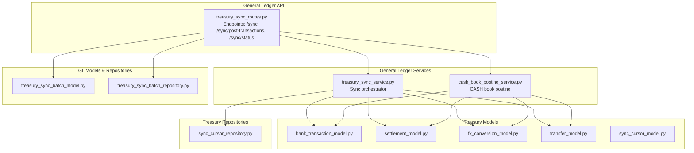
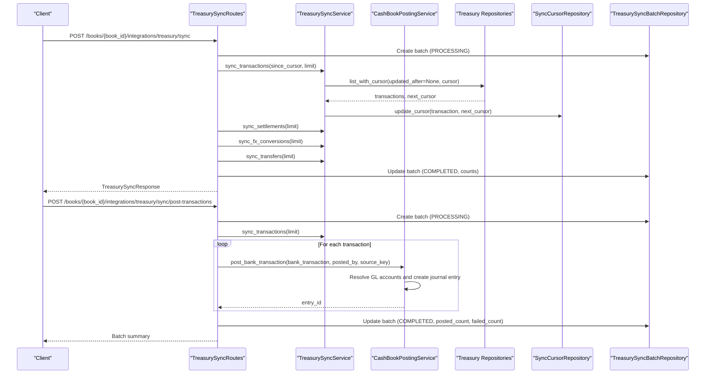
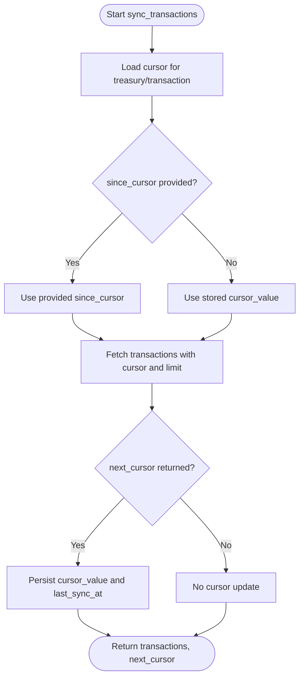
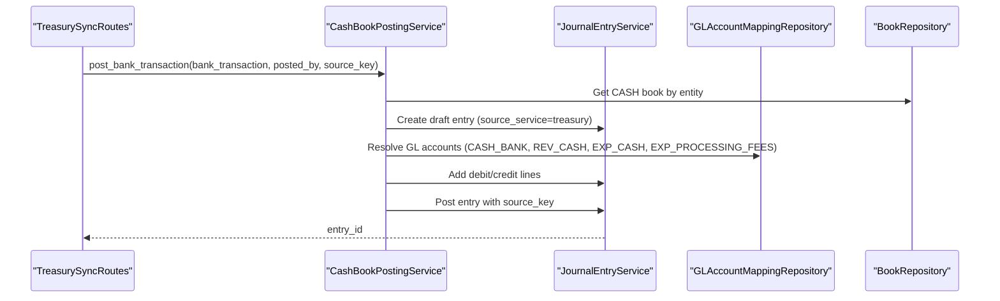
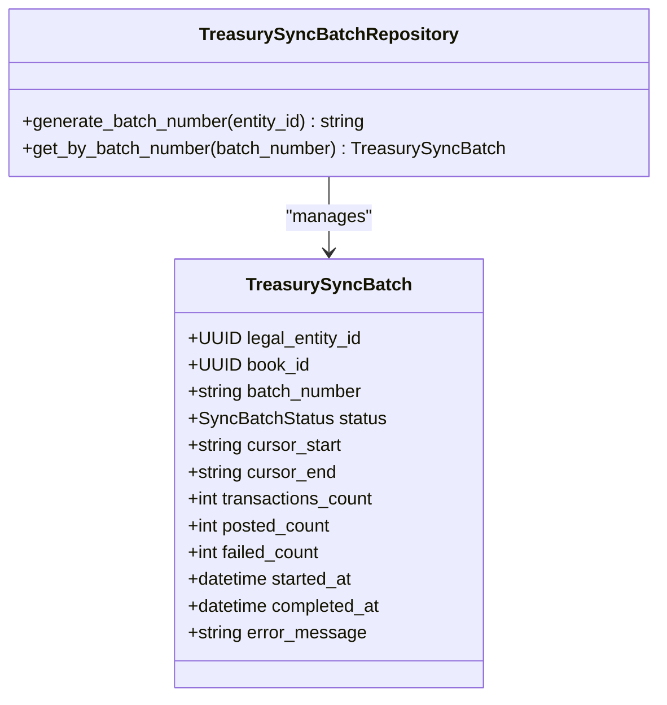
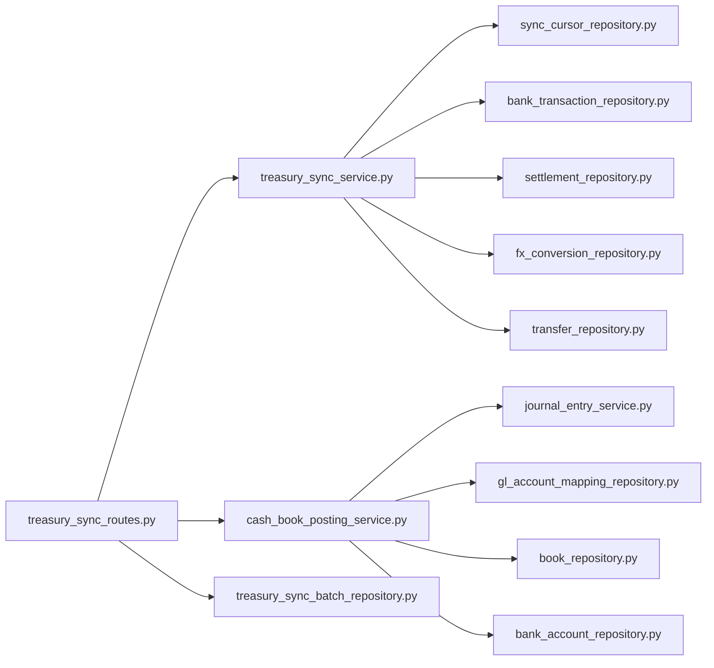

# Treasury Synchronization API

<cite>
**Referenced Files in This Document**
- [treasury_sync_routes.py](file://app/modules/general_ledger/api/routes/treasury_sync_routes.py)
- [treasury_sync_service.py](file://app/modules/general_ledger/services/treasury_sync_service.py)
- [cash_book_posting_service.py](file://app/modules/general_ledger/services/cash_book_posting_service.py)
- [treasury_sync_schemas.py](file://app/modules/general_ledger/schemas/treasury_sync_schemas.py)
- [treasury_sync_batch_model.py](file://app/modules/general_ledger/models/treasury_sync_batch_model.py)
- [treasury_sync_batch_repository.py](file://app/modules/general_ledger/repositories/treasury_sync_batch_repository.py)
- [sync_cursor_model.py](file://app/modules/treasury/models/sync_cursor_model.py)
- [sync_cursor_repository.py](file://app/modules/treasury/repositories/sync_cursor_repository.py)
- [bank_transaction_model.py](file://app/modules/treasury/models/bank_transaction_model.py)
- [settlement_model.py](file://app/modules/treasury/models/settlement_model.py)
- [fx_conversion_model.py](file://app/modules/treasury/models/fx_conversion_model.py)
- [transfer_model.py](file://app/modules/treasury/models/transfer_model.py)
</cite>

## Table of Contents
1. [Introduction](#introduction)
2. [Project Structure](#project-structure)
3. [Core Components](#core-components)
4. [Architecture Overview](#architecture-overview)
5. [Detailed Component Analysis](#detailed-component-analysis)
6. [Dependency Analysis](#dependency-analysis)
7. [Performance Considerations](#performance-considerations)
8. [Troubleshooting Guide](#troubleshooting-guide)
9. [Conclusion](#conclusion)
10. [Appendices](#appendices)

## Introduction
This document provides comprehensive API documentation for Treasury synchronization endpoints. It covers:
- Endpoints for synchronizing Treasury data (bank transactions, settlements, FX conversions, transfers)
- Cash flow integration with bank statement imports and CASH book posting
- Treasury system connectivity and cursor-based pagination
- Sync configurations including scheduling, batch processing, and idempotency
- Real-time and historical synchronization workflows
- Status monitoring, progress tracking, retries, and audit logging
- Conflict resolution and data validation rules

## Project Structure
The Treasury synchronization feature spans the General Ledger and Treasury modules:
- API routes define endpoints under `/books/{book_id}/integrations/treasury`
- Services orchestrate sync operations and posting to the CASH book
- Repositories manage cursors and sync batches
- Models represent Treasury objects and sync metadata

**Diagram sources**
- [treasury_sync_routes.py](file://app/modules/general_ledger/api/routes/treasury_sync_routes.py#L1-L329)
- [treasury_sync_service.py](file://app/modules/general_ledger/services/treasury_sync_service.py#L1-L142)
- [cash_book_posting_service.py](file://app/modules/general_ledger/services/cash_book_posting_service.py#L1-L332)
- [sync_cursor_model.py](file://app/modules/treasury/models/sync_cursor_model.py#L1-L28)
- [sync_cursor_repository.py](file://app/modules/treasury/repositories/sync_cursor_repository.py#L1-L57)
- [bank_transaction_model.py](file://app/modules/treasury/models/bank_transaction_model.py#L1-L52)
- [settlement_model.py](file://app/modules/treasury/models/settlement_model.py#L1-L48)
- [fx_conversion_model.py](file://app/modules/treasury/models/fx_conversion_model.py#L1-L41)
- [transfer_model.py](file://app/modules/treasury/models/transfer_model.py#L1-L49)
- [treasury_sync_batch_model.py](file://app/modules/general_ledger/models/treasury_sync_batch_model.py#L1-L46)
- [treasury_sync_batch_repository.py](file://app/modules/general_ledger/repositories/treasury_sync_batch_repository.py#L1-L44)

**Section sources**
- [treasury_sync_routes.py](file://app/modules/general_ledger/api/routes/treasury_sync_routes.py#L1-L329)
- [treasury_sync_service.py](file://app/modules/general_ledger/services/treasury_sync_service.py#L1-L142)
- [cash_book_posting_service.py](file://app/modules/general_ledger/services/cash_book_posting_service.py#L1-L332)
- [treasury_sync_schemas.py](file://app/modules/general_ledger/schemas/treasury_sync_schemas.py#L1-L28)
- [treasury_sync_batch_model.py](file://app/modules/general_ledger/models/treasury_sync_batch_model.py#L1-L46)
- [treasury_sync_batch_repository.py](file://app/modules/general_ledger/repositories/treasury_sync_batch_repository.py#L1-L44)
- [sync_cursor_model.py](file://app/modules/treasury/models/sync_cursor_model.py#L1-L28)
- [sync_cursor_repository.py](file://app/modules/treasury/repositories/sync_cursor_repository.py#L1-L57)
- [bank_transaction_model.py](file://app/modules/treasury/models/bank_transaction_model.py#L1-L52)
- [settlement_model.py](file://app/modules/treasury/models/settlement_model.py#L1-L48)
- [fx_conversion_model.py](file://app/modules/treasury/models/fx_conversion_model.py#L1-L41)
- [transfer_model.py](file://app/modules/treasury/models/transfer_model.py#L1-L49)

## Core Components
- TreasurySyncService: Orchestrates synchronization of bank transactions, settlements, FX conversions, and transfers. Manages cursors for replay-safe incremental sync.
- CashBookPostingService: Posts Treasury movements (bank transactions, settlements) into the CASH book journal entries with proper GL mappings and idempotency keys.
- TreasurySyncRoutes: Exposes endpoints for initiating sync, posting transactions, and checking sync status.
- TreasurySyncBatch: Tracks batch-level metadata for idempotent sync/post operations.
- SyncCursor: Stores cursor values and timestamps for incremental synchronization.

**Section sources**
- [treasury_sync_service.py](file://app/modules/general_ledger/services/treasury_sync_service.py#L1-L142)
- [cash_book_posting_service.py](file://app/modules/general_ledger/services/cash_book_posting_service.py#L1-L332)
- [treasury_sync_routes.py](file://app/modules/general_ledger/api/routes/treasury_sync_routes.py#L1-L329)
- [treasury_sync_batch_model.py](file://app/modules/general_ledger/models/treasury_sync_batch_model.py#L1-L46)
- [sync_cursor_model.py](file://app/modules/treasury/models/sync_cursor_model.py#L1-L28)

## Architecture Overview
The Treasury synchronization architecture integrates external Treasury data with internal financial posting:
- API routes validate entity ownership and initiate sync operations
- TreasurySyncService pulls data from Treasury repositories using cursors
- CashBookPostingService posts eligible items to the CASH book with idempotency
- TreasurySyncBatch tracks batch progress and outcomes
- SyncCursor persists incremental sync state

**Diagram sources**
- [treasury_sync_routes.py](file://app/modules/general_ledger/api/routes/treasury_sync_routes.py#L20-L304)
- [treasury_sync_service.py](file://app/modules/general_ledger/services/treasury_sync_service.py#L30-L141)
- [cash_book_posting_service.py](file://app/modules/general_ledger/services/cash_book_posting_service.py#L31-L331)
- [treasury_sync_batch_repository.py](file://app/modules/general_ledger/repositories/treasury_sync_batch_repository.py#L20-L43)
- [sync_cursor_repository.py](file://app/modules/treasury/repositories/sync_cursor_repository.py#L17-L56)

## Detailed Component Analysis

### Endpoints
- POST /books/{book_id}/integrations/treasury/sync
  - Purpose: Full sync of Treasury data (transactions, settlements, FX conversions, transfers) with idempotency and batch tracking
  - Request: TreasurySyncRequest (entity_id, since_cursor, full_resync)
  - Response: TreasurySyncResponse (counts, next_cursor, sync_timestamp)
  - Behavior:
    - Validates book ownership against entity_id
    - Creates a sync batch in PROCESSING state
    - Calls sync_transactions (cursor-based), sync_settlements (timestamp-based), sync_fx_conversions, sync_transfers
    - Updates batch to COMPLETED with counts and timestamps
    - Persists final cursor_end in idempotency metadata for audit correlation

- POST /books/{book_id}/integrations/treasury/sync/post-transactions
  - Purpose: Sync and post bank transactions to CASH book with batch-level idempotency
  - Request: Query params (entity_id, posted_by, limit)
  - Behavior:
    - Creates a sync batch in PROCESSING state
    - Syncs transactions up to limit
    - For each transaction, posts to CASH book with a source_key format: TREASURY:POST_TX:{entity_id}:{batch_id}:{identifier}
    - Updates batch with posted_count, failed_count, and completion metadata

- GET /books/{book_id}/integrations/treasury/sync/status
  - Purpose: Retrieve current sync cursors for transactions and settlements
  - Response: entity_id, transaction_cursor, transaction_last_sync, settlement_cursor, settlement_last_sync

**Section sources**
- [treasury_sync_routes.py](file://app/modules/general_ledger/api/routes/treasury_sync_routes.py#L20-L329)
- [treasury_sync_schemas.py](file://app/modules/general_ledger/schemas/treasury_sync_schemas.py#L12-L28)

### TreasurySyncService
- Responsibilities:
  - Incremental sync of bank transactions using a cursor
  - Historical sync of settlements using last_sync_at
  - Sync of FX conversions and transfers by entity
  - Cursor persistence for replay safety

- Key methods:
  - sync_transactions(entity_id, since_cursor, limit): Returns transactions and next_cursor; updates cursor on success
  - sync_settlements(entity_id, since_cursor, limit): Returns settlements; updates cursor to last item id
  - sync_fx_conversions(entity_id, since_cursor, limit): Returns FX conversions
  - sync_transfers(entity_id, since_cursor, limit): Returns transfers

**Diagram sources**
- [treasury_sync_service.py](file://app/modules/general_ledger/services/treasury_sync_service.py#L30-L73)

**Section sources**
- [treasury_sync_service.py](file://app/modules/general_ledger/services/treasury_sync_service.py#L1-L142)
- [sync_cursor_model.py](file://app/modules/treasury/models/sync_cursor_model.py#L1-L28)
- [sync_cursor_repository.py](file://app/modules/treasury/repositories/sync_cursor_repository.py#L1-L57)

### CashBookPostingService
- Responsibilities:
  - Posts bank transactions to the CASH book with appropriate GL mappings
  - Posts settlements to the CASH book with revenue and fee accounts
  - Generates idempotent source keys for journal entries

- Posting logic:
  - Bank transactions: Deposit, Withdrawal, Fee, and generic Cash Movement
  - Settlements: Net amount to Bank Cash, Gross to Revenue, Fees to Expense (if applicable)
  - Source keys: TREASURY:POST_TX:{entity_id}:{batch_id}:{identifier} for transactions; SETTLEMENT:CREATE:{provider}:{external_id} for settlements

**Diagram sources**
- [cash_book_posting_service.py](file://app/modules/general_ledger/services/cash_book_posting_service.py#L31-L331)

**Section sources**
- [cash_book_posting_service.py](file://app/modules/general_ledger/services/cash_book_posting_service.py#L1-L332)

### TreasurySyncBatch and Batch Tracking
- Purpose: Track sync batches for idempotency and progress
- Fields: batch_number, status (PENDING, PROCESSING, COMPLETED, FAILED), cursor_start/end, counts, timestamps, error_message
- Generation: Unique batch_number per day with incrementing counter

**Diagram sources**
- [treasury_sync_batch_model.py](file://app/modules/general_ledger/models/treasury_sync_batch_model.py#L17-L42)
- [treasury_sync_batch_repository.py](file://app/modules/general_ledger/repositories/treasury_sync_batch_repository.py#L20-L43)

**Section sources**
- [treasury_sync_batch_model.py](file://app/modules/general_ledger/models/treasury_sync_batch_model.py#L1-L46)
- [treasury_sync_batch_repository.py](file://app/modules/general_ledger/repositories/treasury_sync_batch_repository.py#L1-L44)

### Data Models and Validation
- BankTransaction: Statement line with type, amount, currency, dates, counterparty, reconciled flag, external_id, import_batch_id
- Settlement: Payment gateway settlement with gross/fees/net amounts, currency, external identifiers, linked bank transaction
- FXConversion: Realized exchange rates with from/to accounts and transactions
- Transfer: Intercompany/intra-entity/external transfers with amounts, currencies, and linked transactions

Validation rules:
- external_id uniqueness across BankTransaction, FXConversion, and Transfer for deduplication
- Composite unique constraint on Settlement (source, external_settlement_id) where external_settlement_id is not null
- Cursor uniqueness per entity/source/object type

**Section sources**
- [bank_transaction_model.py](file://app/modules/treasury/models/bank_transaction_model.py#L21-L52)
- [settlement_model.py](file://app/modules/treasury/models/settlement_model.py#L17-L48)
- [fx_conversion_model.py](file://app/modules/treasury/models/fx_conversion_model.py#L9-L41)
- [transfer_model.py](file://app/modules/treasury/models/transfer_model.py#L17-L49)
- [sync_cursor_model.py](file://app/modules/treasury/models/sync_cursor_model.py#L8-L28)

## Dependency Analysis
- API routes depend on:
  - TreasurySyncService for orchestration
  - CashBookPostingService for posting
  - TreasurySyncBatchRepository for batch tracking
  - SyncCursorRepository for cursor management
- TreasurySyncService depends on:
  - BankTransactionRepository, SettlementRepository, FXConversionRepository, TransferRepository
  - SyncCursorRepository
- CashBookPostingService depends on:
  - JournalEntryService, GLAccountMappingRepository, BookRepository, BankAccountRepository
  - Treasury models for posting logic

**Diagram sources**
- [treasury_sync_routes.py](file://app/modules/general_ledger/api/routes/treasury_sync_routes.py#L1-L329)
- [treasury_sync_service.py](file://app/modules/general_ledger/services/treasury_sync_service.py#L1-L142)
- [cash_book_posting_service.py](file://app/modules/general_ledger/services/cash_book_posting_service.py#L1-L332)
- [treasury_sync_batch_repository.py](file://app/modules/general_ledger/repositories/treasury_sync_batch_repository.py#L1-L44)
- [sync_cursor_repository.py](file://app/modules/treasury/repositories/sync_cursor_repository.py#L1-L57)

**Section sources**
- [treasury_sync_routes.py](file://app/modules/general_ledger/api/routes/treasury_sync_routes.py#L1-L329)
- [treasury_sync_service.py](file://app/modules/general_ledger/services/treasury_sync_service.py#L1-L142)
- [cash_book_posting_service.py](file://app/modules/general_ledger/services/cash_book_posting_service.py#L1-L332)

## Performance Considerations
- Pagination limits:
  - Transactions: default limit 1000 per batch
  - Settlements/FX/Transfers: default limit 100 per batch
- Cursor-based incremental sync reduces payload size and improves reliability
- Batch processing minimizes repeated work and enables idempotent retries
- Journal entry posting is performed per transaction; consider batching at the caller level if throughput requires

[No sources needed since this section provides general guidance]

## Troubleshooting Guide
Common issues and resolutions:
- Book not found or mismatch:
  - Ensure book_id belongs to the requested entity_id
- Not found errors during posting:
  - Verify CASH book exists for the entity and GL account mappings are configured
- Validation errors:
  - Check request body fields and ensure required identifiers (external_id) are present for idempotent posting
- Cursor drift or gaps:
  - Use since_cursor to force resync from a known point
- Batch already completed:
  - The endpoint checks batch status and returns existing posted entries without reprocessing

Audit and diagnostics:
- Use GET /sync/status to inspect current cursors and last sync timestamps
- Inspect TreasurySyncBatch records for batch_number, status, counts, and error messages
- Review idempotency metadata persisted with batch_id and cursor values

**Section sources**
- [treasury_sync_routes.py](file://app/modules/general_ledger/api/routes/treasury_sync_routes.py#L307-L329)
- [treasury_sync_batch_model.py](file://app/modules/general_ledger/models/treasury_sync_batch_model.py#L1-L46)

## Conclusion
The Treasury synchronization API provides robust, replay-safe, and idempotent integration with external Treasury systems. It supports both historical and incremental sync, integrates bank statement imports into the CASH book, and offers comprehensive batch tracking and status monitoring. Proper use of cursors, batch numbers, and source keys ensures reliable reconciliation and auditability.

[No sources needed since this section summarizes without analyzing specific files]

## Appendices

### API Definitions

- POST /books/{book_id}/integrations/treasury/sync
  - Request: TreasurySyncRequest
    - entity_id: UUID
    - since_cursor: string (optional)
    - full_resync: boolean
  - Response: TreasurySyncResponse
    - entity_id: UUID
    - transactions_count: integer
    - settlements_count: integer
    - fx_conversions_count: integer
    - transfers_count: integer
    - next_cursor: string (optional)
    - sync_timestamp: datetime

- POST /books/{book_id}/integrations/treasury/sync/post-transactions
  - Query params:
    - entity_id: UUID
    - posted_by: UUID
    - limit: integer (default 100)
  - Response: Batch summary with batch_id, batch_number, synced, posted, failed, entry_ids

- GET /books/{book_id}/integrations/treasury/sync/status
  - Query params:
    - entity_id: UUID
  - Response:
    - entity_id: UUID
    - transaction_cursor: string (optional)
    - transaction_last_sync: datetime (ISO format, optional)
    - settlement_cursor: string (optional)
    - settlement_last_sync: datetime (ISO format, optional)

**Section sources**
- [treasury_sync_routes.py](file://app/modules/general_ledger/api/routes/treasury_sync_routes.py#L20-L329)
- [treasury_sync_schemas.py](file://app/modules/general_ledger/schemas/treasury_sync_schemas.py#L12-L28)

### Sync Workflows

- Bank feeds (real-time updates)
  - Use POST /sync with since_cursor to pull incremental transactions
  - Optionally call POST /sync/post-transactions to post immediately to CASH book
  - Monitor progress via TreasurySyncBatch and status via GET /sync/status

- Cash position reporting
  - Use GET /sync/status to confirm latest settlement and transaction cursors
  - Combine cursors with ledger queries to compute balances

- Conflict resolution
  - Idempotency keys and source_key patterns prevent duplicate postings
  - Batch status check avoids reprocessing completed batches
  - external_id uniqueness across Treasury objects prevents duplicates

**Section sources**
- [treasury_sync_routes.py](file://app/modules/general_ledger/api/routes/treasury_sync_routes.py#L68-L118)
- [cash_book_posting_service.py](file://app/modules/general_ledger/services/cash_book_posting_service.py#L250-L331)
- [treasury_sync_batch_model.py](file://app/modules/general_ledger/models/treasury_sync_batch_model.py#L9-L14)