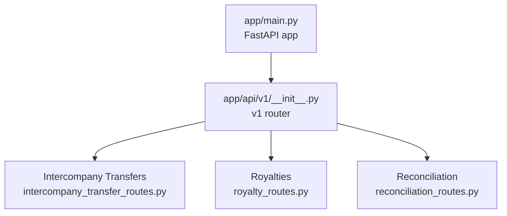
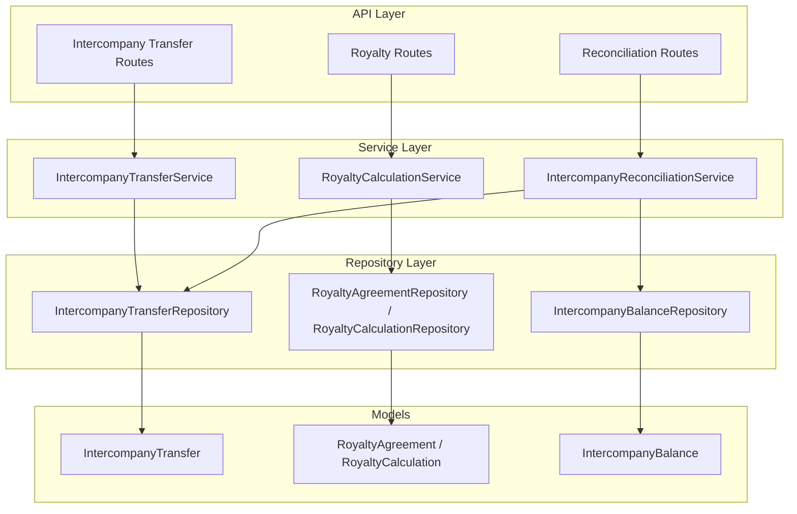
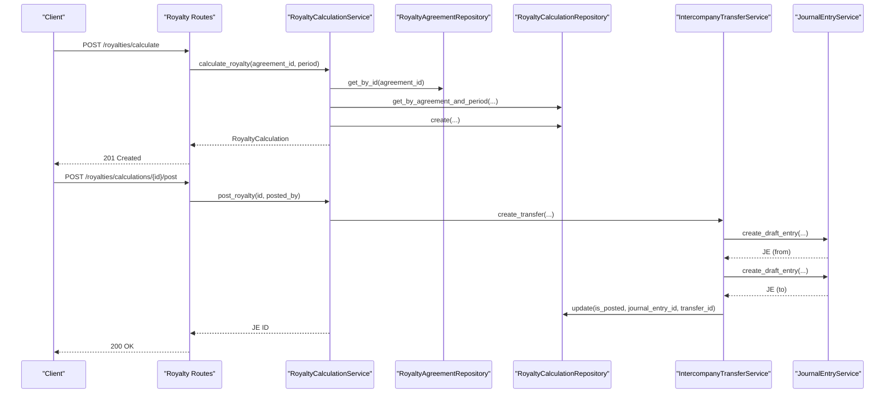
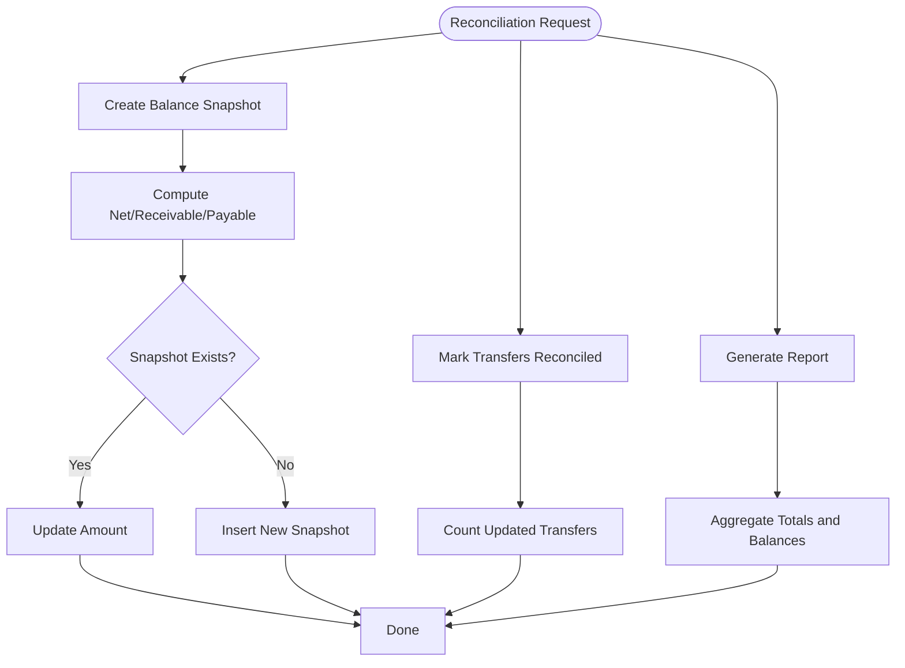
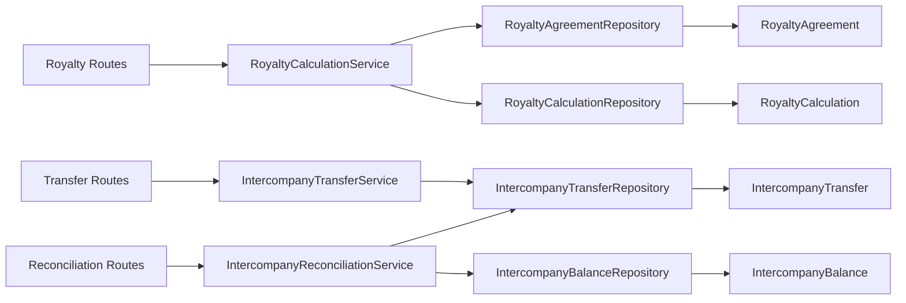
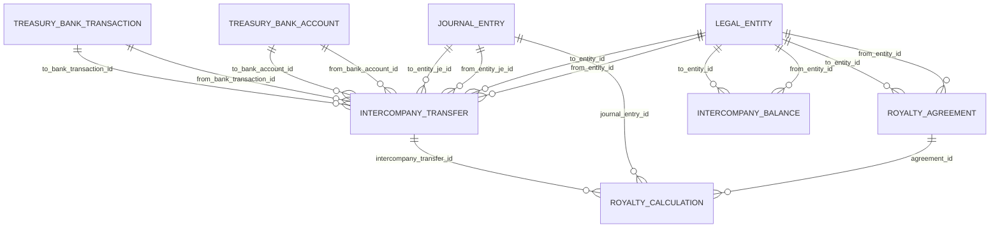

# Intercompany API

<cite>
**Referenced Files in This Document**
- [app/main.py](file://app/main.py)
- [app/api/v1/__init__.py](file://app/api/v1/__init__.py)
- [app/modules/intercompany/api/routes/intercompany_transfer_routes.py](file://app/modules/intercompany/api/routes/intercompany_transfer_routes.py)
- [app/modules/intercompany/api/routes/royalty_routes.py](file://app/modules/intercompany/api/routes/royalty_routes.py)
- [app/modules/intercompany/api/routes/reconciliation_routes.py](file://app/modules/intercompany/api/routes/reconciliation_routes.py)
- [app/modules/intercompany/schemas/intercompany_schemas.py](file://app/modules/intercompany/schemas/intercompany_schemas.py)
- [app/modules/intercompany/models/intercompany_transfer_model.py](file://app/modules/intercompany/models/intercompany_transfer_model.py)
- [app/modules/intercompany/models/royalty_model.py](file://app/modules/intercompany/models/royalty_model.py)
- [app/modules/intercompany/models/intercompany_balance_model.py](file://app/modules/intercompany/models/intercompany_balance_model.py)
- [app/modules/intercompany/services/intercompany_transfer_service.py](file://app/modules/intercompany/services/intercompany_transfer_service.py)
- [app/modules/intercompany/services/royalty_calculation_service.py](file://app/modules/intercompany/services/royalty_calculation_service.py)
- [app/modules/intercompany/services/intercompany_reconciliation_service.py](file://app/modules/intercompany/services/intercompany_reconciliation_service.py)
- [app/modules/intercompany/repositories/intercompany_transfer_repository.py](file://app/modules/intercompany/repositories/intercompany_transfer_repository.py)
- [app/modules/intercompany/repositories/royalty_repository.py](file://app/modules/intercompany/repositories/royalty_repository.py)
- [app/modules/intercompany/repositories/intercompany_balance_repository.py](file://app/modules/intercompany/repositories/intercompany_balance_repository.py)
</cite>

## Table of Contents
1. [Introduction](#introduction)
2. [Project Structure](#project-structure)
3. [Core Components](#core-components)
4. [Architecture Overview](#architecture-overview)
5. [Detailed Component Analysis](#detailed-component-analysis)
6. [Dependency Analysis](#dependency-analysis)
7. [Performance Considerations](#performance-considerations)
8. [Troubleshooting Guide](#troubleshooting-guide)
9. [Conclusion](#conclusion)
10. [Appendices](#appendices)

## Introduction
This document provides comprehensive API documentation for Intercompany endpoints. It covers:
- Intercompany transfer processing: creation, posting (approval), and settlement linkage
- Royalty calculation and payment processing: rate management, approvals, and posting to intercompany transfers
- Intercompany reconciliation: balance snapshots, elimination entries, and consolidation adjustments
- Request/response schemas, validation rules, and error handling
- Legal entity relationships, transfer pricing, and consolidation requirements

The APIs are organized under the Intercompany domain and exposed via the v1 router.

## Project Structure
Intercompany APIs are grouped under the v1 router and include:
- Intercompany transfers: creation, posting, listing, retrieval, and balance calculation
- Royalties: agreements, calculations, approvals, and posting
- Reconciliation: balance snapshots, reconciliation, and reporting

**Diagram sources**
- [app/main.py](file://app/main.py#L1-L54)
- [app/api/v1/__init__.py](file://app/api/v1/__init__.py#L26-L62)

**Section sources**
- [app/main.py](file://app/main.py#L1-L54)
- [app/api/v1/__init__.py](file://app/api/v1/__init__.py#L1-L72)

## Core Components
- Intercompany Transfer API: create, post, list, get, and compute balances
- Royalty API: manage agreements, calculate royalties, submit/approve/reject runs, post calculations as intercompany transfers
- Reconciliation API: create balance snapshots, reconcile transfers, and generate reports
- Supporting models: define legal entity relationships, transfer types, and balance types
- Services: orchestrate posting, calculations, and reconciliation
- Repositories: encapsulate data access for transfers, balances, and royalty records

**Section sources**
- [app/modules/intercompany/api/routes/intercompany_transfer_routes.py](file://app/modules/intercompany/api/routes/intercompany_transfer_routes.py#L1-L179)
- [app/modules/intercompany/api/routes/royalty_routes.py](file://app/modules/intercompany/api/routes/royalty_routes.py#L1-L269)
- [app/modules/intercompany/api/routes/reconciliation_routes.py](file://app/modules/intercompany/api/routes/reconciliation_routes.py#L1-L109)
- [app/modules/intercompany/models/intercompany_transfer_model.py](file://app/modules/intercompany/models/intercompany_transfer_model.py#L1-L59)
- [app/modules/intercompany/models/royalty_model.py](file://app/modules/intercompany/models/royalty_model.py#L1-L98)
- [app/modules/intercompany/models/intercompany_balance_model.py](file://app/modules/intercompany/models/intercompany_balance_model.py#L1-L39)

## Architecture Overview
The Intercompany module follows a layered architecture:
- Routes: HTTP endpoints with request/response schemas
- Services: business logic for posting, calculations, and reconciliation
- Repositories: data access and queries
- Models: SQLAlchemy ORM mapped to database tables
- Integrations: GL posting via journal entry service and treasury links

**Diagram sources**
- [app/modules/intercompany/api/routes/intercompany_transfer_routes.py](file://app/modules/intercompany/api/routes/intercompany_transfer_routes.py#L1-L179)
- [app/modules/intercompany/api/routes/royalty_routes.py](file://app/modules/intercompany/api/routes/royalty_routes.py#L1-L269)
- [app/modules/intercompany/api/routes/reconciliation_routes.py](file://app/modules/intercompany/api/routes/reconciliation_routes.py#L1-L109)
- [app/modules/intercompany/services/intercompany_transfer_service.py](file://app/modules/intercompany/services/intercompany_transfer_service.py#L1-L232)
- [app/modules/intercompany/services/royalty_calculation_service.py](file://app/modules/intercompany/services/royalty_calculation_service.py#L1-L202)
- [app/modules/intercompany/services/intercompany_reconciliation_service.py](file://app/modules/intercompany/services/intercompany_reconciliation_service.py#L1-L168)
- [app/modules/intercompany/repositories/intercompany_transfer_repository.py](file://app/modules/intercompany/repositories/intercompany_transfer_repository.py#L1-L101)
- [app/modules/intercompany/repositories/royalty_repository.py](file://app/modules/intercompany/repositories/royalty_repository.py#L1-L107)
- [app/modules/intercompany/repositories/intercompany_balance_repository.py](file://app/modules/intercompany/repositories/intercompany_balance_repository.py#L1-L55)
- [app/modules/intercompany/models/intercompany_transfer_model.py](file://app/modules/intercompany/models/intercompany_transfer_model.py#L1-L59)
- [app/modules/intercompany/models/royalty_model.py](file://app/modules/intercompany/models/royalty_model.py#L1-L98)
- [app/modules/intercompany/models/intercompany_balance_model.py](file://app/modules/intercompany/models/intercompany_balance_model.py#L1-L39)

## Detailed Component Analysis

### Intercompany Transfers API
Endpoints:
- POST /api/v1/intercompany/transfers
- POST /api/v1/intercompany/transfers/{transfer_id}/post
- GET /api/v1/intercompany/transfers
- GET /api/v1/intercompany/transfers/{transfer_id}
- GET /api/v1/intercompany/transfers/balance

Processing logic:
- Creation validates entities and uniqueness constraints, persists the transfer record
- Posting creates dual journal entries (ACCRUAL books) and updates journal entry IDs
- Listing supports filtering by entity pair or single entity, date range, and pagination
- Balance calculation computes net position between entity pairs

Validation rules:
- Amount must be positive
- Currency must be 3-character ISO code
- From and to entities must differ
- Posting requires ACCRUAL book existence and valid accounting period

Error handling:
- 400 for validation errors
- 404 for not-found resources or missing books/periods
- Idempotent posting ensures idempotency scope per legal entity ACCRUAL book

```mermaid
sequenceDiagram
participant Client as "Client"
participant Routes as "Transfer Routes"
participant Service as "IntercompanyTransferService"
participant Repo as "IntercompanyTransferRepository"
participant GL as "JournalEntryService"
Client->>Routes : POST /intercompany/transfers
Routes->>Service : create_transfer(...)
Service->>Repo : create(...)
Repo-->>Service : IntercompanyTransfer
Service-->>Routes : IntercompanyTransfer
Routes-->>Client : 201 Created
Client->>Routes : POST /intercompany/transfers/{id}/post
Routes->>Service : post_transfer(id, posted_by)
Service->>GL : create_draft_entry(...)
GL-->>Service : JournalEntry (from)
Service->>GL : add_line(...)
Service->>GL : post_entry(...)
Service->>GL : create_draft_entry(...)
GL-->>Service : JournalEntry (to)
Service->>GL : add_line(...)
Service->>GL : post_entry(...)
Service->>Repo : update(from_je_id, to_je_id)
Service-->>Routes : JE IDs
Routes-->>Client : 200 OK
```

**Diagram sources**
- [app/modules/intercompany/api/routes/intercompany_transfer_routes.py](file://app/modules/intercompany/api/routes/intercompany_transfer_routes.py#L21-L104)
- [app/modules/intercompany/services/intercompany_transfer_service.py](file://app/modules/intercompany/services/intercompany_transfer_service.py#L28-L219)

**Section sources**
- [app/modules/intercompany/api/routes/intercompany_transfer_routes.py](file://app/modules/intercompany/api/routes/intercompany_transfer_routes.py#L21-L179)
- [app/modules/intercompany/schemas/intercompany_schemas.py](file://app/modules/intercompany/schemas/intercompany_schemas.py#L9-L46)
- [app/modules/intercompany/models/intercompany_transfer_model.py](file://app/modules/intercompany/models/intercompany_transfer_model.py#L16-L59)
- [app/modules/intercompany/services/intercompany_transfer_service.py](file://app/modules/intercompany/services/intercompany_transfer_service.py#L28-L232)
- [app/modules/intercompany/repositories/intercompany_transfer_repository.py](file://app/modules/intercompany/repositories/intercompany_transfer_repository.py#L18-L101)

### Royalty API
Endpoints:
- POST /api/v1/intercompany/royalties/agreements
- GET /api/v1/intercompany/royalties/agreements
- GET /api/v1/intercompany/royalties/agreements/{agreement_id}
- POST /api/v1/intercompany/royalties/calculate
- POST /api/v1/intercompany/royalties/runs/{run_id}/submit-approval
- POST /api/v1/intercompany/royalties/runs/{run_id}/approve
- POST /api/v1/intercompany/royalties/runs/{run_id}/reject
- POST /api/v1/intercompany/royalties/calculations/{calculation_id}/post
- GET /api/v1/intercompany/royalties/calculations/unposted

Processing logic:
- Agreement creation enforces unique codes and validates FIXED basis amounts
- Calculations derive revenue bases from recognized revenue and/or collected revenue depending on basis
- Approvals support submit-for-approval, approve (with optional override), and reject with reasons
- Posting converts a royalty calculation into an intercompany transfer and posts dual journal entries

Validation rules:
- Rate must be between 0 and 100 for percentage basis
- FIXED basis requires a fixed amount
- Periods must be valid and non-overlapping per agreement constraints
- Row version required for optimistic locking during approvals

Error handling:
- 400 for validation and posting errors (already posted)
- 404 for not-found resources
- Approval-specific errors surfaced via dedicated exception handling

**Diagram sources**
- [app/modules/intercompany/api/routes/royalty_routes.py](file://app/modules/intercompany/api/routes/royalty_routes.py#L107-L256)
- [app/modules/intercompany/services/royalty_calculation_service.py](file://app/modules/intercompany/services/royalty_calculation_service.py#L31-L202)
- [app/modules/intercompany/services/intercompany_transfer_service.py](file://app/modules/intercompany/services/intercompany_transfer_service.py#L72-L219)

**Section sources**
- [app/modules/intercompany/api/routes/royalty_routes.py](file://app/modules/intercompany/api/routes/royalty_routes.py#L32-L269)
- [app/modules/intercompany/schemas/intercompany_schemas.py](file://app/modules/intercompany/schemas/intercompany_schemas.py#L48-L148)
- [app/modules/intercompany/models/royalty_model.py](file://app/modules/intercompany/models/royalty_model.py#L27-L98)
- [app/modules/intercompany/services/royalty_calculation_service.py](file://app/modules/intercompany/services/royalty_calculation_service.py#L31-L202)
- [app/modules/intercompany/repositories/royalty_repository.py](file://app/modules/intercompany/repositories/royalty_repository.py#L15-L107)

### Intercompany Reconciliation API
Endpoints:
- POST /api/v1/intercompany/reconciliation/balance-snapshot
- POST /api/v1/intercompany/reconciliation/reconcile
- GET /api/v1/intercompany/reconciliation/report
- GET /api/v1/intercompany/reconciliation/balance

Processing logic:
- Balance snapshots capture net/receivable/payable positions as of a date
- Reconciliation marks transfers as reconciled within a pair
- Reporting aggregates transfer counts, reconciled/unreconciled, and net balance
- Balance endpoint returns computed net position

Validation rules:
- Snapshot uniqueness enforced by composite constraint (pair, date, type)
- Reconciliation filters by entity pair and ignores mismatched transfers

Error handling:
- 400 for general errors
- 404 for missing resources

**Diagram sources**
- [app/modules/intercompany/api/routes/reconciliation_routes.py](file://app/modules/intercompany/api/routes/reconciliation_routes.py#L15-L109)
- [app/modules/intercompany/services/intercompany_reconciliation_service.py](file://app/modules/intercompany/services/intercompany_reconciliation_service.py#L35-L168)
- [app/modules/intercompany/models/intercompany_balance_model.py](file://app/modules/intercompany/models/intercompany_balance_model.py#L17-L39)
- [app/modules/intercompany/repositories/intercompany_balance_repository.py](file://app/modules/intercompany/repositories/intercompany_balance_repository.py#L20-L55)

**Section sources**
- [app/modules/intercompany/api/routes/reconciliation_routes.py](file://app/modules/intercompany/api/routes/reconciliation_routes.py#L15-L109)
- [app/modules/intercompany/services/intercompany_reconciliation_service.py](file://app/modules/intercompany/services/intercompany_reconciliation_service.py#L14-L168)
- [app/modules/intercompany/models/intercompany_balance_model.py](file://app/modules/intercompany/models/intercompany_balance_model.py#L17-L39)
- [app/modules/intercompany/repositories/intercompany_balance_repository.py](file://app/modules/intercompany/repositories/intercompany_balance_repository.py#L14-L55)

## Dependency Analysis
Key dependencies and relationships:
- Routes depend on services for business logic
- Services depend on repositories for data access
- Models define relationships among legal entities, transfers, balances, and calculations
- Posting integrates with General Ledger journal entry service and treasury links

**Diagram sources**
- [app/modules/intercompany/api/routes/intercompany_transfer_routes.py](file://app/modules/intercompany/api/routes/intercompany_transfer_routes.py#L1-L179)
- [app/modules/intercompany/api/routes/royalty_routes.py](file://app/modules/intercompany/api/routes/royalty_routes.py#L1-L269)
- [app/modules/intercompany/api/routes/reconciliation_routes.py](file://app/modules/intercompany/api/routes/reconciliation_routes.py#L1-L109)
- [app/modules/intercompany/services/intercompany_transfer_service.py](file://app/modules/intercompany/services/intercompany_transfer_service.py#L1-L232)
- [app/modules/intercompany/services/royalty_calculation_service.py](file://app/modules/intercompany/services/royalty_calculation_service.py#L1-L202)
- [app/modules/intercompany/services/intercompany_reconciliation_service.py](file://app/modules/intercompany/services/intercompany_reconciliation_service.py#L1-L168)
- [app/modules/intercompany/repositories/intercompany_transfer_repository.py](file://app/modules/intercompany/repositories/intercompany_transfer_repository.py#L1-L101)
- [app/modules/intercompany/repositories/royalty_repository.py](file://app/modules/intercompany/repositories/royalty_repository.py#L1-L107)
- [app/modules/intercompany/repositories/intercompany_balance_repository.py](file://app/modules/intercompany/repositories/intercompany_balance_repository.py#L1-L55)
- [app/modules/intercompany/models/intercompany_transfer_model.py](file://app/modules/intercompany/models/intercompany_transfer_model.py#L1-L59)
- [app/modules/intercompany/models/royalty_model.py](file://app/modules/intercompany/models/royalty_model.py#L1-L98)
- [app/modules/intercompany/models/intercompany_balance_model.py](file://app/modules/intercompany/models/intercompany_balance_model.py#L1-L39)

**Section sources**
- [app/modules/intercompany/api/routes/intercompany_transfer_routes.py](file://app/modules/intercompany/api/routes/intercompany_transfer_routes.py#L1-L179)
- [app/modules/intercompany/api/routes/royalty_routes.py](file://app/modules/intercompany/api/routes/royalty_routes.py#L1-L269)
- [app/modules/intercompany/api/routes/reconciliation_routes.py](file://app/modules/intercompany/api/routes/reconciliation_routes.py#L1-L109)

## Performance Considerations
- Pagination limits: list endpoints accept limit and offset parameters with upper bounds to prevent heavy queries
- Indexes: models and repositories leverage indexed fields (entity IDs, dates) to optimize filtering and aggregation
- Batch reconciliation: mark multiple transfers reconciled in a single operation
- Idempotent posting: reduces duplicate postings and improves reliability under retries

[No sources needed since this section provides general guidance]

## Troubleshooting Guide
Common issues and resolutions:
- Validation errors (400): review request payload against schema constraints (amount, currency length, rate range)
- Not found errors (404): verify resource IDs and ensure related entities/periods/books exist
- Posting failures: confirm ACCRUAL books and accounting periods exist for both entities
- Duplicate agreement codes: ensure unique agreement codes when creating agreements
- Already posted calculations: post only unposted calculations

**Section sources**
- [app/modules/intercompany/api/routes/intercompany_transfer_routes.py](file://app/modules/intercompany/api/routes/intercompany_transfer_routes.py#L42-L45)
- [app/modules/intercompany/api/routes/royalty_routes.py](file://app/modules/intercompany/api/routes/royalty_routes.py#L46-L68)
- [app/modules/intercompany/services/intercompany_transfer_service.py](file://app/modules/intercompany/services/intercompany_transfer_service.py#L95-L98)
- [app/modules/intercompany/services/royalty_calculation_service.py](file://app/modules/intercompany/services/royalty_calculation_service.py#L170-L171)

## Conclusion
The Intercompany module provides robust APIs for managing intercompany transfers, royalty calculations, and reconciliation. It enforces strong validation, supports approvals, and integrates with the General Ledger for accurate dual-entry posting. The reconciliation suite enables balance snapshots, manual reconciliation, and reporting for consolidation and elimination entries.

[No sources needed since this section summarizes without analyzing specific files]

## Appendices

### API Reference: Intercompany Transfers
- POST /api/v1/intercompany/transfers
  - Request: IntercompanyTransferCreate
  - Response: IntercompanyTransferResponse
  - Validation: amount > 0, currency 3 chars, from/to entities differ
  - Errors: 400 validation, 404 not found
- POST /api/v1/intercompany/transfers/{transfer_id}/post
  - Request: IntercompanyTransferPostRequest
  - Response: { transfer_id, from_entity_je_id, to_entity_je_id, status }
  - Validation: ACCRUAL book and period exist
  - Errors: 400 validation, 404 not found
- GET /api/v1/intercompany/transfers
  - Query: from_entity_id, to_entity_id, entity_id, start_date, end_date, limit, offset
  - Response: List[IntercompanyTransferResponse]
- GET /api/v1/intercompany/transfers/{transfer_id}
  - Response: IntercompanyTransferResponse
- GET /api/v1/intercompany/transfers/balance
  - Query: from_entity_id, to_entity_id, as_of_date
  - Response: { from_entity_id, to_entity_id, as_of_date, balance }

**Section sources**
- [app/modules/intercompany/api/routes/intercompany_transfer_routes.py](file://app/modules/intercompany/api/routes/intercompany_transfer_routes.py#L21-L179)
- [app/modules/intercompany/schemas/intercompany_schemas.py](file://app/modules/intercompany/schemas/intercompany_schemas.py#L9-L46)
- [app/modules/intercompany/models/intercompany_transfer_model.py](file://app/modules/intercompany/models/intercompany_transfer_model.py#L16-L59)

### API Reference: Royalties
- POST /api/v1/intercompany/royalties/agreements
  - Request: RoyaltyAgreementCreate
  - Response: RoyaltyAgreementResponse
  - Validation: unique code, rate 0–100, FIXED requires fixed_amount
- GET /api/v1/intercompany/royalties/agreements
  - Query: from_entity_id, to_entity_id, active_only
  - Response: List[RoyaltyAgreementResponse]
- GET /api/v1/intercompany/royalties/agreements/{agreement_id}
  - Response: RoyaltyAgreementResponse
- POST /api/v1/intercompany/royalties/calculate
  - Request: RoyaltyCalculationRequest
  - Response: RoyaltyCalculationResponse
- POST /api/v1/intercompany/royalties/runs/{run_id}/submit-approval
  - Request: RoyaltyRunSubmitApprovalRequest
  - Response: RoyaltyCalculationResponse
- POST /api/v1/intercompany/royalties/runs/{run_id}/approve
  - Request: RoyaltyRunApproveRequest
  - Response: RoyaltyCalculationResponse
- POST /api/v1/intercompany/royalties/runs/{run_id}/reject
  - Request: RoyaltyRunRejectRequest
  - Response: RoyaltyCalculationResponse
- POST /api/v1/intercompany/royalties/calculations/{calculation_id}/post
  - Request: RoyaltyCalculationPostRequest
  - Response: { calculation_id, journal_entry_id, status }
- GET /api/v1/intercompany/royalties/calculations/unposted
  - Query: entity_id, limit
  - Response: List[RoyaltyCalculationResponse]

**Section sources**
- [app/modules/intercompany/api/routes/royalty_routes.py](file://app/modules/intercompany/api/routes/royalty_routes.py#L32-L269)
- [app/modules/intercompany/schemas/intercompany_schemas.py](file://app/modules/intercompany/schemas/intercompany_schemas.py#L48-L148)
- [app/modules/intercompany/models/royalty_model.py](file://app/modules/intercompany/models/royalty_model.py#L27-L98)

### API Reference: Reconciliation
- POST /api/v1/intercompany/reconciliation/balance-snapshot
  - Query: from_entity_id, to_entity_id, as_of_date
  - Response: IntercompanyBalance snapshot
- POST /api/v1/intercompany/reconciliation/reconcile
  - Query: from_entity_id, to_entity_id, transfer_ids, reconciled_at
  - Response: { reconciled_count, status }
- GET /api/v1/intercompany/reconciliation/report
  - Query: from_entity_id, to_entity_id, as_of_date
  - Response: Report JSON with totals and transfer list
- GET /api/v1/intercompany/reconciliation/balance
  - Query: from_entity_id, to_entity_id, as_of_date
  - Response: { from_entity_id, to_entity_id, as_of_date, balance }

**Section sources**
- [app/modules/intercompany/api/routes/reconciliation_routes.py](file://app/modules/intercompany/api/routes/reconciliation_routes.py#L15-L109)
- [app/modules/intercompany/models/intercompany_balance_model.py](file://app/modules/intercompany/models/intercompany_balance_model.py#L17-L39)

### Data Models Overview

**Diagram sources**
- [app/modules/intercompany/models/intercompany_transfer_model.py](file://app/modules/intercompany/models/intercompany_transfer_model.py#L16-L59)
- [app/modules/intercompany/models/royalty_model.py](file://app/modules/intercompany/models/royalty_model.py#L27-L98)
- [app/modules/intercompany/models/intercompany_balance_model.py](file://app/modules/intercompany/models/intercompany_balance_model.py#L17-L39)