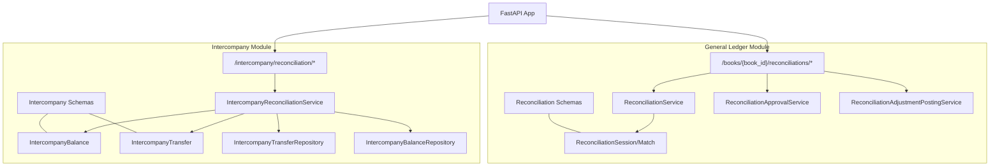
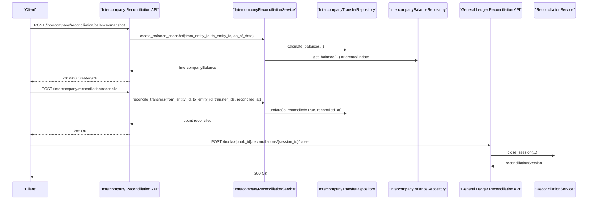
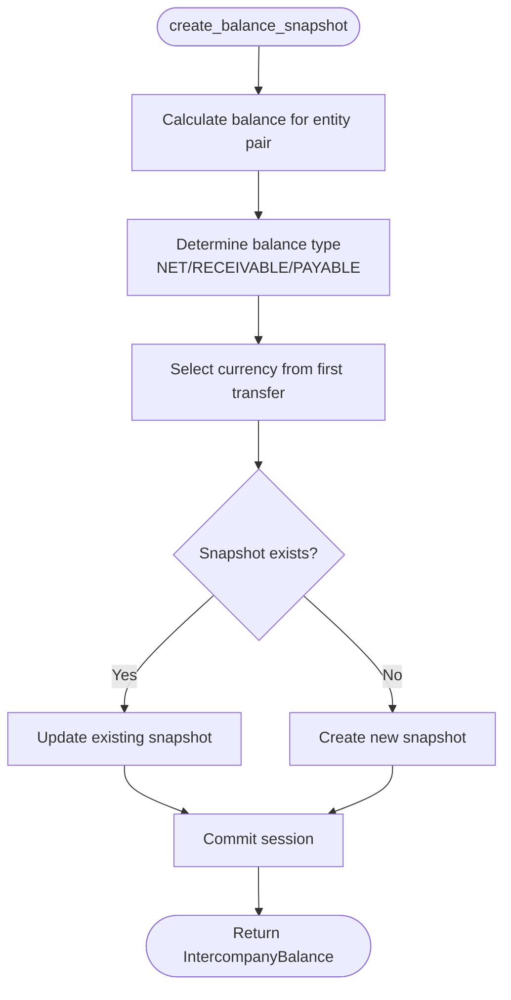
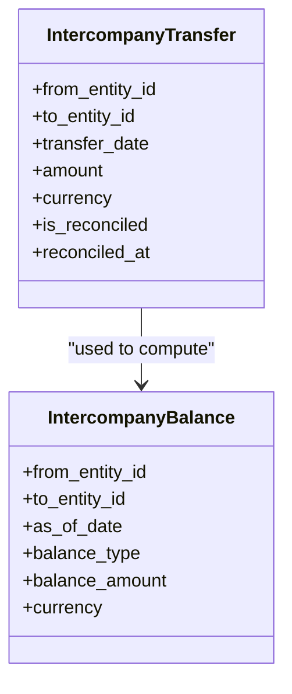
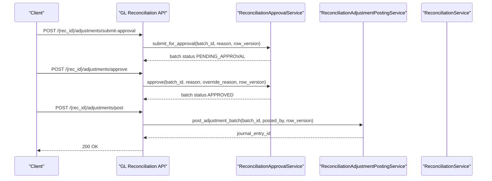
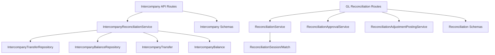

# Intercompany Reconciliation API

<cite>
**Referenced Files in This Document**
- [reconciliation_routes.py](file://app/modules/intercompany/api/routes/reconciliation_routes.py)
- [intercompany_reconciliation_service.py](file://app/modules/intercompany/services/intercompany_reconciliation_service.py)
- [intercompany_balance_model.py](file://app/modules/intercompany/models/intercompany_balance_model.py)
- [intercompany_transfer_model.py](file://app/modules/intercompany/models/intercompany_transfer_model.py)
- [intercompany_transfer_repository.py](file://app/modules/intercompany/repositories/intercompany_transfer_repository.py)
- [intercompany_balance_repository.py](file://app/modules/intercompany/repositories/intercompany_balance_repository.py)
- [intercompany_schemas.py](file://app/modules/intercompany/schemas/intercompany_schemas.py)
- [reconciliation_routes.py](file://app/modules/general_ledger/api/routes/reconciliation_routes.py)
- [reconciliation_model.py](file://app/modules/general_ledger/models/reconciliation_model.py)
- [reconciliation_schemas.py](file://app/modules/general_ledger/schemas/reconciliation_schemas.py)
- [reconciliation_service.py](file://app/modules/general_ledger/services/reconciliation_service.py)
- [reconciliation_adjustment_posting_service.py](file://app/modules/general_ledger/services/reconciliation_adjustment_posting_service.py)
- [reconciliation_approval_service.py](file://app/modules/general_ledger/services/reconciliation_approval_service.py)
- [main.py](file://app/main.py)
</cite>

## Table of Contents
1. [Introduction](#introduction)
2. [Project Structure](#project-structure)
3. [Core Components](#core-components)
4. [Architecture Overview](#architecture-overview)
5. [Detailed Component Analysis](#detailed-component-analysis)
6. [Dependency Analysis](#dependency-analysis)
7. [Performance Considerations](#performance-considerations)
8. [Troubleshooting Guide](#troubleshooting-guide)
9. [Conclusion](#conclusion)
10. [Appendices](#appendices)

## Introduction
This document provides comprehensive API documentation for Intercompany Reconciliation endpoints. It covers intercompany transfer reconciliation, balance snapshots, reconciliation reporting, and the integration points with general ledger reconciliation workflows. It also documents elimination processes, intercompany account balancing, consolidation adjustments, reconciliation workflows, exception handling, audit trails, and regulatory reporting patterns. The goal is to enable developers and financial operators to implement, integrate, and operate intercompany reconciliation reliably and consistently.

## Project Structure
The Intercompany Reconciliation API is implemented under the intercompany module with supporting models, repositories, and services. It integrates with general ledger reconciliation for bank statement reconciliation and adjustment posting. The FastAPI application exposes routes under a versioned router.

**Diagram sources**
- [reconciliation_routes.py](file://app/modules/intercompany/api/routes/reconciliation_routes.py#L12-L109)
- [intercompany_reconciliation_service.py](file://app/modules/intercompany/services/intercompany_reconciliation_service.py#L14-L168)
- [intercompany_balance_model.py](file://app/modules/intercompany/models/intercompany_balance_model.py#L17-L39)
- [intercompany_transfer_model.py](file://app/modules/intercompany/models/intercompany_transfer_model.py#L16-L59)
- [intercompany_transfer_repository.py](file://app/modules/intercompany/repositories/intercompany_transfer_repository.py#L12-L101)
- [intercompany_balance_repository.py](file://app/modules/intercompany/repositories/intercompany_balance_repository.py#L14-L55)
- [intercompany_schemas.py](file://app/modules/intercompany/schemas/intercompany_schemas.py#L9-L46)
- [reconciliation_routes.py](file://app/modules/general_ledger/api/routes/reconciliation_routes.py#L37-L378)
- [reconciliation_model.py](file://app/modules/general_ledger/models/reconciliation_model.py#L18-L68)
- [reconciliation_schemas.py](file://app/modules/general_ledger/schemas/reconciliation_schemas.py#L9-L117)
- [reconciliation_service.py](file://app/modules/general_ledger/services/reconciliation_service.py#L22-L188)
- [reconciliation_adjustment_posting_service.py](file://app/modules/general_ledger/services/reconciliation_adjustment_posting_service.py#L19-L154)
- [reconciliation_approval_service.py](file://app/modules/general_ledger/services/reconciliation_approval_service.py#L30-L254)
- [main.py](file://app/main.py#L29-L31)

**Section sources**
- [reconciliation_routes.py](file://app/modules/intercompany/api/routes/reconciliation_routes.py#L1-L109)
- [reconciliation_routes.py](file://app/modules/general_ledger/api/routes/reconciliation_routes.py#L1-L378)
- [main.py](file://app/main.py#L29-L31)

## Core Components
- Intercompany Reconciliation API routes expose endpoints to create balance snapshots, reconcile intercompany transfers, fetch reconciliation reports, and compute balances.
- IntercompanyReconciliationService orchestrates reconciliation logic, including balance calculation, snapshot creation, transfer reconciliation, and report generation.
- Intercompany models define balance snapshots and intercompany transfers, including reconciliation flags and journal entry links.
- Repositories encapsulate data access for transfers and balance snapshots.
- General Ledger reconciliation APIs handle bank statement reconciliation, matching, closing, and adjustment approval/posting workflows.

Key responsibilities:
- Balance snapshot creation and updates based on calculated intercompany balances.
- Transfer reconciliation with validation and persistence.
- Reporting on reconciliation status and balances.
- Integration with general ledger reconciliation for adjustments and approvals.

**Section sources**
- [intercompany_reconciliation_service.py](file://app/modules/intercompany/services/intercompany_reconciliation_service.py#L14-L168)
- [intercompany_balance_model.py](file://app/modules/intercompany/models/intercompany_balance_model.py#L10-L39)
- [intercompany_transfer_model.py](file://app/modules/intercompany/models/intercompany_transfer_model.py#L10-L59)
- [intercompany_transfer_repository.py](file://app/modules/intercompany/repositories/intercompany_transfer_repository.py#L18-L101)
- [intercompany_balance_repository.py](file://app/modules/intercompany/repositories/intercompany_balance_repository.py#L20-L55)

## Architecture Overview
The Intercompany Reconciliation API sits alongside General Ledger reconciliation. Intercompany endpoints manage entity-to-entity balances and transfer reconciliation, while GL reconciliation manages bank statement vs book reconciliation and adjustment workflows.

**Diagram sources**
- [reconciliation_routes.py](file://app/modules/intercompany/api/routes/reconciliation_routes.py#L15-L109)
- [intercompany_reconciliation_service.py](file://app/modules/intercompany/services/intercompany_reconciliation_service.py#L35-L121)
- [intercompany_transfer_repository.py](file://app/modules/intercompany/repositories/intercompany_transfer_repository.py#L77-L101)
- [intercompany_balance_repository.py](file://app/modules/intercompany/repositories/intercompany_balance_repository.py#L20-L37)
- [reconciliation_routes.py](file://app/modules/general_ledger/api/routes/reconciliation_routes.py#L134-L198)
- [reconciliation_service.py](file://app/modules/general_ledger/services/reconciliation_service.py#L155-L188)

## Detailed Component Analysis

### Intercompany Reconciliation API Endpoints
- POST /intercompany/reconciliation/balance-snapshot
  - Purpose: Create or update a balance snapshot for an entity pair as of a specific date.
  - Request: from_entity_id, to_entity_id, as_of_date.
  - Response: Intercompany balance snapshot details including balance type (NET, RECEIVABLE, PAYABLE), amount, and currency.
  - Validation: Balance type derived from absolute balance; snapshot deduped by unique constraint on (from_entity_id, to_entity_id, as_of_date, balance_type).
  - Error handling: HTTP 400 on service errors.

- POST /intercompany/reconciliation/reconcile
  - Purpose: Mark intercompany transfers as reconciled for a given entity pair.
  - Request: from_entity_id, to_entity_id, transfer_ids[], reconciled_at.
  - Response: Count of reconciled transfers and success status.
  - Validation: Skips non-existent or mismatched transfers; only updates non-reconciled transfers.
  - Error handling: HTTP 400 on service errors.

- GET /intercompany/reconciliation/report
  - Purpose: Retrieve reconciliation report for an entity pair as of a date.
  - Request: from_entity_id, to_entity_id, as_of_date.
  - Response: Totals, counts, net balance, and list of transfers with reconciliation status.
  - Error handling: HTTP 400 on service errors.

- GET /intercompany/reconciliation/balance
  - Purpose: Compute intercompany balance for an entity pair as of a date (defaults to today).
  - Request: from_entity_id, to_entity_id, as_of_date (optional).
  - Response: Balance value.
  - Error handling: HTTP 400 on service errors.

**Section sources**
- [reconciliation_routes.py](file://app/modules/intercompany/api/routes/reconciliation_routes.py#L15-L109)
- [intercompany_reconciliation_service.py](file://app/modules/intercompany/services/intercompany_reconciliation_service.py#L22-L168)

### Intercompany Reconciliation Service
Responsibilities:
- calculate_balance: Computes net intercompany balance for an entity pair up to a date.
- create_balance_snapshot: Creates or updates a balance snapshot, determines balance type, and sets currency from transfers.
- reconcile_transfers: Marks eligible transfers as reconciled with validation.
- get_reconciliation_report: Aggregates totals and lists transfers with reconciliation status.

Processing logic highlights:
- Balance type classification: RECEIVABLE/PAYABLE/NET based on sign of balance.
- Snapshot uniqueness enforced via unique constraint.
- Transfer reconciliation is idempotent per transfer.

**Diagram sources**
- [intercompany_reconciliation_service.py](file://app/modules/intercompany/services/intercompany_reconciliation_service.py#L35-L92)

**Section sources**
- [intercompany_reconciliation_service.py](file://app/modules/intercompany/services/intercompany_reconciliation_service.py#L14-L168)

### Intercompany Models and Repositories
- IntercompanyBalance
  - Fields: from_entity_id, to_entity_id, as_of_date, balance_type, balance_amount, currency.
  - Unique constraint: ensures one snapshot per entity pair per date per balance type.
  - Relationships: linked to LegalEntity for both sides.

- IntercompanyTransfer
  - Fields: from_entity_id, to_entity_id, transfer_date, amount, currency, transfer_type, references to treasury accounts/transactions, journal entries for both entities, reconciliation flags.
  - Relationships: links to LegalEntity, BankAccount, BankTransaction, JournalEntry.

- IntercompanyTransferRepository
  - Methods: list_by_entity_pair, list_by_entity, calculate_balance.
  - Balance calculation sums transfer amounts for the pair up to a date.

- IntercompanyBalanceRepository
  - Methods: get_balance, list_by_entity.
  - Supports retrieval of snapshots and entity-level history.

**Diagram sources**
- [intercompany_transfer_model.py](file://app/modules/intercompany/models/intercompany_transfer_model.py#L16-L59)
- [intercompany_balance_model.py](file://app/modules/intercompany/models/intercompany_balance_model.py#L17-L39)

**Section sources**
- [intercompany_balance_model.py](file://app/modules/intercompany/models/intercompany_balance_model.py#L10-L39)
- [intercompany_transfer_model.py](file://app/modules/intercompany/models/intercompany_transfer_model.py#L10-L59)
- [intercompany_transfer_repository.py](file://app/modules/intercompany/repositories/intercompany_transfer_repository.py#L18-L101)
- [intercompany_balance_repository.py](file://app/modules/intercompany/repositories/intercompany_balance_repository.py#L20-L55)

### General Ledger Reconciliation Integration
Intercompany reconciliation complements bank reconciliation:
- Bank reconciliation endpoints manage sessions, matching, difference calculation, closing, and adjustment workflows.
- Adjustment batches support submission, approval, rejection, and posting to journal entries.
- Posting service creates journal entries for reconciliation adjustments and updates batch status.

**Diagram sources**
- [reconciliation_routes.py](file://app/modules/general_ledger/api/routes/reconciliation_routes.py#L200-L343)
- [reconciliation_approval_service.py](file://app/modules/general_ledger/services/reconciliation_approval_service.py#L38-L229)
- [reconciliation_adjustment_posting_service.py](file://app/modules/general_ledger/services/reconciliation_adjustment_posting_service.py#L28-L141)
- [reconciliation_service.py](file://app/modules/general_ledger/services/reconciliation_service.py#L155-L188)

**Section sources**
- [reconciliation_routes.py](file://app/modules/general_ledger/api/routes/reconciliation_routes.py#L134-L343)
- [reconciliation_approval_service.py](file://app/modules/general_ledger/services/reconciliation_approval_service.py#L30-L254)
- [reconciliation_adjustment_posting_service.py](file://app/modules/general_ledger/services/reconciliation_adjustment_posting_service.py#L19-L154)
- [reconciliation_service.py](file://app/modules/general_ledger/services/reconciliation_service.py#L22-L188)

### Elimination Processes, Intercompany Account Balancing, and Consolidation Adjustments
- Intercompany account balancing:
  - Balance snapshots capture NET, RECEIVABLE, and PAYABLE positions for entity pairs.
  - Intercompany transfers link to treasury and journal entries, enabling reconciliation against cash movements.
- Elimination entries:
  - Intercompany transfer posting creates dual journal entries per entity, establishing intercompany receivables/payables.
  - Consolidation adjustments can be posted via general ledger reconciliation adjustment workflows to eliminate intercompany balances.
- Profit elimination and equity consolidations:
  - While explicit profit elimination endpoints are not present in the current code, the intercompany transfer posting demonstrates dual-entity journal entries that underpin elimination mechanics during consolidation.
  - Consolidation adjustments are handled through GL reconciliation adjustment posting service, which posts journal entries to eliminate intercompany items.

Note: The intercompany reconciliation endpoints focus on balance snapshots and transfer reconciliation. Profit elimination and equity consolidation are typically part of broader consolidation processes managed outside these endpoints.

**Section sources**
- [intercompany_transfer_model.py](file://app/modules/intercompany/models/intercompany_transfer_model.py#L35-L51)
- [intercompany_reconciliation_service.py](file://app/modules/intercompany/services/intercompany_reconciliation_service.py#L35-L92)
- [reconciliation_adjustment_posting_service.py](file://app/modules/general_ledger/services/reconciliation_adjustment_posting_service.py#L74-L127)

### Reconciliation Workflows, Exception Handling, and Audit Trails
- Intercompany reconciliation workflow:
  - Create balance snapshot → Reconcile transfers → Generate report → Close GL reconciliation (optional, for bank statement alignment).
- Exception handling:
  - Intercompany endpoints return HTTP 400 on service errors.
  - General ledger reconciliation raises NotFoundError/ValidationError for missing resources or invalid states.
- Audit trails:
  - Reconciliation approval service logs actions (submit/approve/reject) with before/after status and reasons.

**Section sources**
- [reconciliation_routes.py](file://app/modules/intercompany/api/routes/reconciliation_routes.py#L39-L85)
- [reconciliation_routes.py](file://app/modules/general_ledger/api/routes/reconciliation_routes.py#L56-L59)
- [reconciliation_approval_service.py](file://app/modules/general_ledger/services/reconciliation_approval_service.py#L231-L254)

### Examples
- Quarterly reconciliations:
  - Run balance snapshots at quarter-end dates, reconcile transfers for the quarter, and generate reports.
- Year-end adjustments:
  - Use GL reconciliation adjustment workflows to post eliminating entries; intercompany balances inform consolidation positions.
- Intercompany profit elimination:
  - Create intercompany transfer entries; during consolidation, use adjustment posting to eliminate intercompany receivables/payables.

[No sources needed since this section provides conceptual examples]

### Request/Response Schemas and Validation Rules
- Intercompany reconciliation endpoints:
  - Request parameters validated via route queries and service logic.
  - Responses structured as JSON objects containing identifiers, dates, amounts, and flags.
- General ledger reconciliation:
  - Pydantic schemas define request/response structures for sessions, matches, adjustments, and approvals.
  - Validation includes currency matching, date range checks, and status transitions.

**Section sources**
- [intercompany_schemas.py](file://app/modules/intercompany/schemas/intercompany_schemas.py#L9-L46)
- [reconciliation_schemas.py](file://app/modules/general_ledger/schemas/reconciliation_schemas.py#L9-L117)

### Integration Patterns
- Idempotency:
  - GL reconciliation close and adjustment posting endpoints use idempotency keys to prevent duplicate processing.
- Row versioning:
  - Approval and posting endpoints enforce optimistic locking via row_version.
- Cross-module integration:
  - Intercompany reconciliation relies on intercompany transfer and balance models; GL reconciliation depends on treasury and journal entry repositories.

**Section sources**
- [reconciliation_routes.py](file://app/modules/general_ledger/api/routes/reconciliation_routes.py#L140-L193)
- [reconciliation_routes.py](file://app/modules/general_ledger/api/routes/reconciliation_routes.py#L287-L338)
- [reconciliation_approval_service.py](file://app/modules/general_ledger/services/reconciliation_approval_service.py#L56-L57)
- [reconciliation_adjustment_posting_service.py](file://app/modules/general_ledger/services/reconciliation_adjustment_posting_service.py#L39-L40)

## Dependency Analysis
The Intercompany Reconciliation API depends on:
- Intercompany models and repositories for balance and transfer data.
- IntercompanyReconciliationService for orchestration.
- General Ledger reconciliation services for bank statement alignment and adjustment posting.

**Diagram sources**
- [reconciliation_routes.py](file://app/modules/intercompany/api/routes/reconciliation_routes.py#L12-L109)
- [intercompany_reconciliation_service.py](file://app/modules/intercompany/services/intercompany_reconciliation_service.py#L14-L21)
- [intercompany_transfer_repository.py](file://app/modules/intercompany/repositories/intercompany_transfer_repository.py#L12-L16)
- [intercompany_balance_repository.py](file://app/modules/intercompany/repositories/intercompany_balance_repository.py#L14-L18)
- [intercompany_schemas.py](file://app/modules/intercompany/schemas/intercompany_schemas.py#L9-L46)
- [reconciliation_routes.py](file://app/modules/general_ledger/api/routes/reconciliation_routes.py#L37-L378)
- [reconciliation_service.py](file://app/modules/general_ledger/services/reconciliation_service.py#L22-L32)
- [reconciliation_approval_service.py](file://app/modules/general_ledger/services/reconciliation_approval_service.py#L30-L36)
- [reconciliation_adjustment_posting_service.py](file://app/modules/general_ledger/services/reconciliation_adjustment_posting_service.py#L19-L26)
- [reconciliation_schemas.py](file://app/modules/general_ledger/schemas/reconciliation_schemas.py#L9-L117)

**Section sources**
- [intercompany_reconciliation_service.py](file://app/modules/intercompany/services/intercompany_reconciliation_service.py#L14-L21)
- [reconciliation_service.py](file://app/modules/general_ledger/services/reconciliation_service.py#L22-L32)

## Performance Considerations
- Balance and report queries filter by entity pairs and dates; ensure appropriate indexing on entity IDs and dates.
- Batch reconciliation iterates over transfer IDs; consider pagination and validation to avoid excessive loops.
- Snapshot creation avoids duplicates via unique constraints; minimize redundant snapshots by aligning as_of_date boundaries.

[No sources needed since this section provides general guidance]

## Troubleshooting Guide
Common issues and resolutions:
- HTTP 400 on intercompany reconciliation endpoints indicates service-level errors; inspect underlying validation or repository exceptions.
- GL reconciliation close fails if difference is non-zero unless allow_non_zero is set; verify bank statement and book balances.
- Adjustment posting requires approved status and valid row_version; ensure approval workflow is completed and client supplies correct row_version.
- Audit logs record approval actions; review logs for submit/approve/reject traces.

**Section sources**
- [reconciliation_routes.py](file://app/modules/intercompany/api/routes/reconciliation_routes.py#L39-L85)
- [reconciliation_service.py](file://app/modules/general_ledger/services/reconciliation_service.py#L170-L175)
- [reconciliation_approval_service.py](file://app/modules/general_ledger/services/reconciliation_approval_service.py#L56-L63)
- [reconciliation_adjustment_posting_service.py](file://app/modules/general_ledger/services/reconciliation_adjustment_posting_service.py#L39-L46)

## Conclusion
The Intercompany Reconciliation API provides robust capabilities to snapshot intercompany balances, reconcile transfers, and generate reconciliation reports. Its integration with general ledger reconciliation enables comprehensive bank statement alignment and adjustment posting. By leveraging idempotency, row versioning, and audit trails, the system supports reliable financial operations and regulatory reporting readiness.

[No sources needed since this section summarizes without analyzing specific files]

## Appendices

### API Reference Summary
- Intercompany Reconciliation
  - POST /intercompany/reconciliation/balance-snapshot
  - POST /intercompany/reconciliation/reconcile
  - GET /intercompany/reconciliation/report
  - GET /intercompany/reconciliation/balance

- General Ledger Reconciliation
  - POST /books/{book_id}/reconciliations
  - GET /books/{book_id}/reconciliations
  - GET /books/{book_id}/reconciliations/{session_id}
  - POST /books/{book_id}/reconciliations/{session_id}/match
  - POST /books/{book_id}/reconciliations/{session_id}/calculate-difference
  - POST /books/{book_id}/reconciliations/{session_id}/close
  - POST /{rec_id}/adjustments/submit-approval
  - POST /{rec_id}/adjustments/approve
  - POST /{rec_id}/adjustments/reject
  - POST /{rec_id}/adjustments/post

**Section sources**
- [reconciliation_routes.py](file://app/modules/intercompany/api/routes/reconciliation_routes.py#L15-L109)
- [reconciliation_routes.py](file://app/modules/general_ledger/api/routes/reconciliation_routes.py#L40-L378)