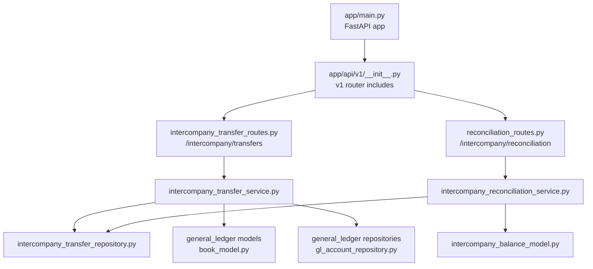
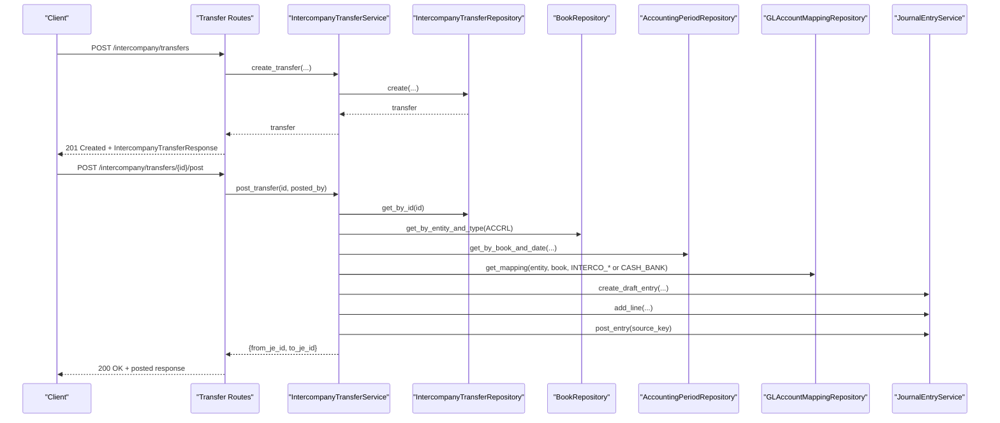
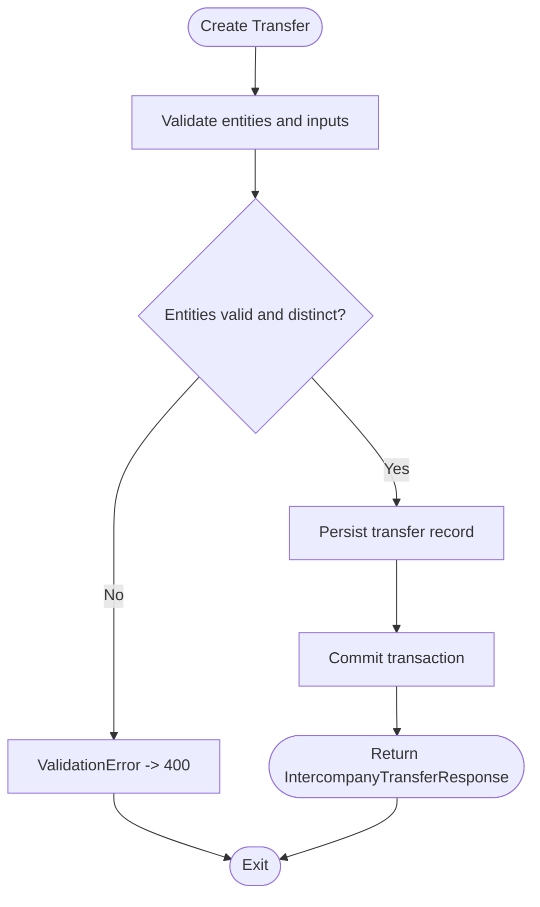
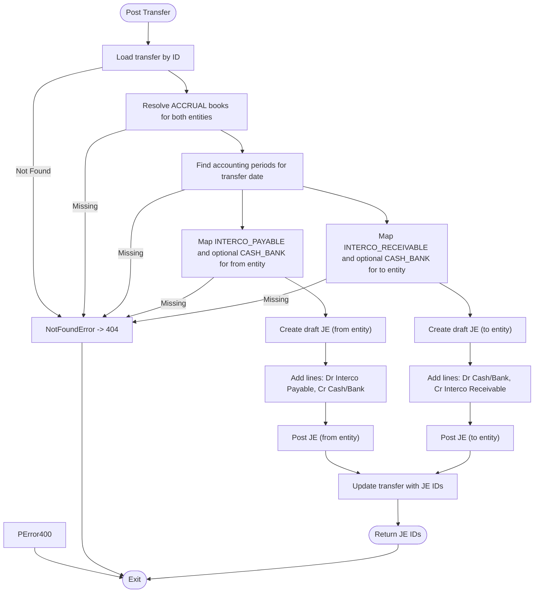
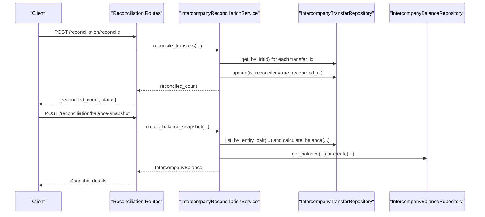
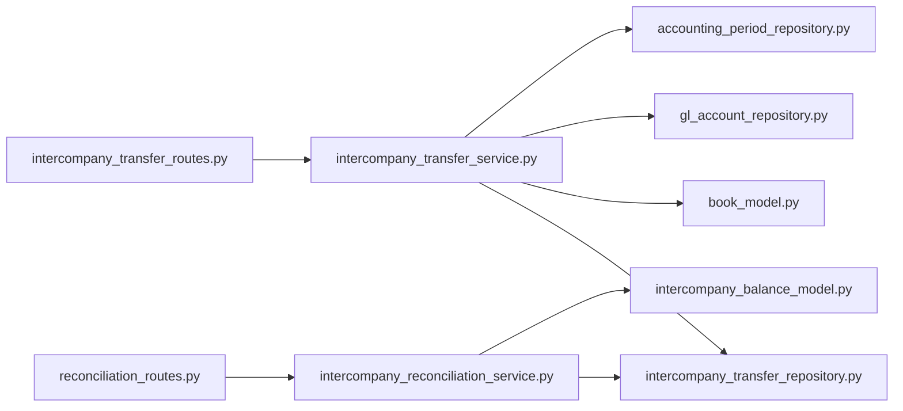

# Intercompany Transfers API

<cite>
**Referenced Files in This Document**
- [app/main.py](file://app/main.py)
- [app/api/v1/__init__.py](file://app/api/v1/__init__.py)
- [app/modules/intercompany/api/routes/intercompany_transfer_routes.py](file://app/modules/intercompany/api/routes/intercompany_transfer_routes.py)
- [app/modules/intercompany/api/routes/reconciliation_routes.py](file://app/modules/intercompany/api/routes/reconciliation_routes.py)
- [app/modules/intercompany/schemas/intercompany_schemas.py](file://app/modules/intercompany/schemas/intercompany_schemas.py)
- [app/modules/intercompany/models/intercompany_transfer_model.py](file://app/modules/intercompany/models/intercompany_transfer_model.py)
- [app/modules/intercompany/models/intercompany_balance_model.py](file://app/modules/intercompany/models/intercompany_balance_model.py)
- [app/modules/intercompany/services/intercompany_transfer_service.py](file://app/modules/intercompany/services/intercompany_transfer_service.py)
- [app/modules/intercompany/services/intercompany_reconciliation_service.py](file://app/modules/intercompany/services/intercompany_reconciliation_service.py)
- [app/modules/intercompany/repositories/intercompany_transfer_repository.py](file://app/modules/intercompany/repositories/intercompany_transfer_repository.py)
- [app/modules/general_ledger/models/book_model.py](file://app/modules/general_ledger/models/book_model.py)
- [app/modules/general_ledger/repositories/gl_account_repository.py](file://app/modules/general_ledger/repositories/gl_account_repository.py)
</cite>

## Table of Contents
1. [Introduction](#introduction)
2. [Project Structure](#project-structure)
3. [Core Components](#core-components)
4. [Architecture Overview](#architecture-overview)
5. [Detailed Component Analysis](#detailed-component-analysis)
6. [Dependency Analysis](#dependency-analysis)
7. [Performance Considerations](#performance-considerations)
8. [Troubleshooting Guide](#troubleshooting-guide)
9. [Conclusion](#conclusion)
10. [Appendices](#appendices)

## Introduction
This document provides comprehensive API documentation for Intercompany Transfer processing endpoints. It covers transfer creation, posting (posting to both legal entities’ books), listing, retrieval, and reconciliation. It also documents schemas, validation rules, error handling, and integration patterns with General Ledger and Treasury components. The system supports intercompany cash transfers and can be extended to support other intercompany types such as loans and royalties via the broader intercompany module.

## Project Structure
The Intercompany Transfers API is part of the v1 routing group and integrates with General Ledger, Treasury, and Reconciliation services. The API surface includes:
- Intercompany transfer creation and posting
- Listing and retrieval of transfers
- Intercompany balance calculation and reconciliation
- Reconciliation snapshot and report generation

**Diagram sources**
- [app/main.py](file://app/main.py#L29-L31)
- [app/api/v1/__init__.py](file://app/api/v1/__init__.py#L59-L62)
- [app/modules/intercompany/api/routes/intercompany_transfer_routes.py](file://app/modules/intercompany/api/routes/intercompany_transfer_routes.py#L18-L179)
- [app/modules/intercompany/api/routes/reconciliation_routes.py](file://app/modules/intercompany/api/routes/reconciliation_routes.py#L12-L109)
- [app/modules/intercompany/services/intercompany_transfer_service.py](file://app/modules/intercompany/services/intercompany_transfer_service.py#L17-L232)
- [app/modules/intercompany/services/intercompany_reconciliation_service.py](file://app/modules/intercompany/services/intercompany_reconciliation_service.py#L14-L168)
- [app/modules/intercompany/repositories/intercompany_transfer_repository.py](file://app/modules/intercompany/repositories/intercompany_transfer_repository.py#L12-L101)
- [app/modules/general_ledger/models/book_model.py](file://app/modules/general_ledger/models/book_model.py#L9-L36)
- [app/modules/general_ledger/repositories/gl_account_repository.py](file://app/modules/general_ledger/repositories/gl_account_repository.py#L52-L82)
- [app/modules/intercompany/models/intercompany_balance_model.py](file://app/modules/intercompany/models/intercompany_balance_model.py#L17-L39)

**Section sources**
- [app/main.py](file://app/main.py#L29-L31)
- [app/api/v1/__init__.py](file://app/api/v1/__init__.py#L59-L62)

## Core Components
- Intercompany Transfer API routes: create, post, list, get, and balance endpoint
- Intercompany Transfer Service: validation, posting logic, and GL account mapping resolution
- Intercompany Reconciliation Service: balance snapshot, reconciliation, and reporting
- Repositories and Models: persistence and domain models for transfers and balances
- Integrations: General Ledger books and account mappings, Treasury bank accounts

Key responsibilities:
- Validation: entity existence, distinct from/to entities, amount and currency constraints
- Posting: creates dual journal entries in ACCRUAL books with proper mappings
- Reconciliation: marks transfers as reconciled and generates reports
- Balance: calculates net position between entities up to a date

**Section sources**
- [app/modules/intercompany/api/routes/intercompany_transfer_routes.py](file://app/modules/intercompany/api/routes/intercompany_transfer_routes.py#L21-L179)
- [app/modules/intercompany/services/intercompany_transfer_service.py](file://app/modules/intercompany/services/intercompany_transfer_service.py#L28-L232)
- [app/modules/intercompany/services/intercompany_reconciliation_service.py](file://app/modules/intercompany/services/intercompany_reconciliation_service.py#L22-L168)
- [app/modules/intercompany/models/intercompany_transfer_model.py](file://app/modules/intercompany/models/intercompany_transfer_model.py#L16-L59)
- [app/modules/intercompany/models/intercompany_balance_model.py](file://app/modules/intercompany/models/intercompany_balance_model.py#L17-L39)

## Architecture Overview
The Intercompany Transfers API follows a layered architecture:
- Routes: define endpoints and request/response binding
- Services: orchestrate business logic, validations, and integrations
- Repositories: encapsulate data access
- Models: represent domain entities and relationships
- Integrations: General Ledger (books, periods, journal entries), Treasury (bank accounts), and account mappings

**Diagram sources**
- [app/modules/intercompany/api/routes/intercompany_transfer_routes.py](file://app/modules/intercompany/api/routes/intercompany_transfer_routes.py#L21-L104)
- [app/modules/intercompany/services/intercompany_transfer_service.py](file://app/modules/intercompany/services/intercompany_transfer_service.py#L72-L219)
- [app/modules/intercompany/repositories/intercompany_transfer_repository.py](file://app/modules/intercompany/repositories/intercompany_transfer_repository.py#L12-L101)
- [app/modules/general_ledger/models/book_model.py](file://app/modules/general_ledger/models/book_model.py#L9-L36)
- [app/modules/general_ledger/repositories/gl_account_repository.py](file://app/modules/general_ledger/repositories/gl_account_repository.py#L52-L82)

## Detailed Component Analysis

### Intercompany Transfer API Endpoints
- POST /intercompany/transfers
  - Purpose: Create an intercompany transfer record
  - Request body: IntercompanyTransferCreate
  - Response: IntercompanyTransferResponse
  - Validation: amount > 0, currency 3 chars, from/to entities differ, entities exist
  - Notes: Optional bank account linkage for treasury integration

- POST /intercompany/transfers/{transfer_id}/post
  - Purpose: Post transfer to both entities’ books (dual journal entries)
  - Request body: IntercompanyTransferPostRequest (posted_by)
  - Response: {transfer_id, from_entity_je_id, to_entity_je_id, status}
  - Idempotency: Uses idempotency key scoped to legal entity and ACCRUAL book
  - Error handling: NotFoundError, ValidationError mapped to HTTP 404/400

- GET /intercompany/transfers
  - Purpose: List transfers with filters
  - Query params: from_entity_id, to_entity_id, entity_id, start_date, end_date, limit, offset
  - Response: Array of IntercompanyTransferResponse

- GET /intercompany/transfers/{transfer_id}
  - Purpose: Retrieve a single transfer by ID

- GET /intercompany/transfers/balance
  - Purpose: Calculate intercompany balance between entity pairs up to as_of_date
  - Response: {from_entity_id, to_entity_id, as_of_date, balance}

**Section sources**
- [app/modules/intercompany/api/routes/intercompany_transfer_routes.py](file://app/modules/intercompany/api/routes/intercompany_transfer_routes.py#L21-L179)
- [app/modules/intercompany/schemas/intercompany_schemas.py](file://app/modules/intercompany/schemas/intercompany_schemas.py#L9-L46)

### Intercompany Reconciliation API Endpoints
- POST /intercompany/reconciliation/balance-snapshot
  - Purpose: Create or update a balance snapshot for a pair as of a date
  - Response: Snapshot details including balance type and amount

- POST /intercompany/reconciliation/reconcile
  - Purpose: Mark selected transfers as reconciled
  - Response: {reconciled_count, status}

- GET /intercompany/reconciliation/report
  - Purpose: Generate reconciliation report for a pair as of a date
  - Response: Totals, counts, and transfer details

- GET /intercompany/reconciliation/balance
  - Purpose: Calculate current balance between entity pairs
  - Response: {from_entity_id, to_entity_id, as_of_date, balance}

**Section sources**
- [app/modules/intercompany/api/routes/reconciliation_routes.py](file://app/modules/intercompany/api/routes/reconciliation_routes.py#L15-L109)
- [app/modules/intercompany/services/intercompany_reconciliation_service.py](file://app/modules/intercompany/services/intercompany_reconciliation_service.py#L35-L168)

### Data Models and Schemas
Intercompany Transfer Model
- Fields: from_entity_id, to_entity_id, transfer_date, amount, currency, transfer_type, description, reference_number, treasury links, journal entry links, reconciliation flags
- Relationships: Legal entities, Bank accounts, Bank transactions, Journal entries

Intercompany Balance Model
- Fields: from_entity_id, to_entity_id, as_of_date, balance_type (NET, RECEIVABLE, PAYABLE), balance_amount, currency
- Constraints: Unique constraint on (from_entity_id, to_entity_id, as_of_date, balance_type)

Pydantic Schemas
- IntercompanyTransferCreate: validation rules for creation
- IntercompanyTransferPostRequest: minimal posting request
- IntercompanyTransferResponse: standardized response shape
- Additional royalty-related schemas exist in the same file for related workflows

**Section sources**
- [app/modules/intercompany/models/intercompany_transfer_model.py](file://app/modules/intercompany/models/intercompany_transfer_model.py#L16-L59)
- [app/modules/intercompany/models/intercompany_balance_model.py](file://app/modules/intercompany/models/intercompany_balance_model.py#L17-L39)
- [app/modules/intercompany/schemas/intercompany_schemas.py](file://app/modules/intercompany/schemas/intercompany_schemas.py#L9-L46)

### Processing Logic and Workflows

#### Transfer Creation Workflow

**Diagram sources**
- [app/modules/intercompany/services/intercompany_transfer_service.py](file://app/modules/intercompany/services/intercompany_transfer_service.py#L28-L71)
- [app/modules/intercompany/api/routes/intercompany_transfer_routes.py](file://app/modules/intercompany/api/routes/intercompany_transfer_routes.py#L21-L46)

#### Transfer Posting Workflow

**Diagram sources**
- [app/modules/intercompany/services/intercompany_transfer_service.py](file://app/modules/intercompany/services/intercompany_transfer_service.py#L72-L219)
- [app/modules/general_ledger/models/book_model.py](file://app/modules/general_ledger/models/book_model.py#L9-L36)
- [app/modules/general_ledger/repositories/gl_account_repository.py](file://app/modules/general_ledger/repositories/gl_account_repository.py#L52-L82)

#### Reconciliation Workflow

**Diagram sources**
- [app/modules/intercompany/api/routes/reconciliation_routes.py](file://app/modules/intercompany/api/routes/reconciliation_routes.py#L43-L86)
- [app/modules/intercompany/services/intercompany_reconciliation_service.py](file://app/modules/intercompany/services/intercompany_reconciliation_service.py#L94-L168)
- [app/modules/intercompany/repositories/intercompany_transfer_repository.py](file://app/modules/intercompany/repositories/intercompany_transfer_repository.py#L77-L101)

### Request/Response Schemas and Validation Rules
IntercompanyTransferCreate
- Required fields: from_entity_id, to_entity_id, transfer_date, amount (>0), currency (3 chars)
- Optional fields: transfer_type (default "CASH"), description, reference_number, from_bank_account_id, to_bank_account_id
- Validation: amount > 0, currency length 3, from/to entities must be different

IntercompanyTransferPostRequest
- Required fields: posted_by (UUID)

IntercompanyTransferResponse
- Fields: id, from_entity_id, to_entity_id, transfer_date, amount, currency, transfer_type, description, reference_number, is_reconciled, reconciled_at, created_at, updated_at

Intercompany Reconciliation Endpoints
- Balance snapshot: as_of_date required, returns snapshot with balance_type and amount
- Reconcile: transfer_ids array, reconciled_at date, returns reconciled_count
- Report: as_of_date, returns totals and transfer list
- Balance: as_of_date optional (defaults to today), returns net balance

**Section sources**
- [app/modules/intercompany/schemas/intercompany_schemas.py](file://app/modules/intercompany/schemas/intercompany_schemas.py#L9-L46)
- [app/modules/intercompany/api/routes/intercompany_transfer_routes.py](file://app/modules/intercompany/api/routes/intercompany_transfer_routes.py#L106-L179)
- [app/modules/intercompany/api/routes/reconciliation_routes.py](file://app/modules/intercompany/api/routes/reconciliation_routes.py#L15-L109)

### Integration Patterns
- General Ledger integration
  - Uses ACCRUAL books for both entities
  - Resolves accounting periods by date
  - Uses GL account mappings for INTERCO_PAYABLE, INTERCO_RECEIVABLE, and CASH_BANK
- Treasury integration
  - Optional bank account linkage on transfer records
  - Bank transaction IDs can be linked post-posting if needed
- Idempotency
  - Endpoint key for posting is registered centrally
  - Idempotency key scopes to legal entity and ACCRUAL book

**Section sources**
- [app/modules/intercompany/services/intercompany_transfer_service.py](file://app/modules/intercompany/services/intercompany_transfer_service.py#L85-L122)
- [app/modules/intercompany/api/routes/intercompany_transfer_routes.py](file://app/modules/intercompany/api/routes/intercompany_transfer_routes.py#L66-L98)
- [app/modules/general_ledger/models/book_model.py](file://app/modules/general_ledger/models/book_model.py#L9-L36)
- [app/modules/general_ledger/repositories/gl_account_repository.py](file://app/modules/general_ledger/repositories/gl_account_repository.py#L52-L82)

### Examples
- Intra-group cash transfer
  - Create: POST /intercompany/transfers with amount, currency, from/to entities, optional bank accounts
  - Post: POST /intercompany/transfers/{id}/post with posted_by
  - Track: GET /intercompany/transfers/{id} and GET /intercompany/transfers?entity_id=...
  - Reconcile: POST /intercompany/reconciliation/reconcile with transfer_ids

- Intercompany sales (conceptual extension)
  - Use transfer_type to indicate "SALE" and link appropriate GL mappings
  - Posting would mirror cash transfer but adjust intercompany account types accordingly

- Service charges (conceptual extension)
  - Use transfer_type "SERVICE" and map to appropriate receivable/payable accounts
  - Reference number can capture invoice or contract reference

[No sources needed since this section provides conceptual examples]

## Dependency Analysis
The Intercompany Transfer API depends on:
- General Ledger: Book types (ACCRUAL/CASH), accounting periods, journal entries, and GL account mappings
- Treasury: Bank accounts and transactions (optional linkage)
- Core infrastructure: idempotency keys, endpoint keys, database sessions

**Diagram sources**
- [app/modules/intercompany/api/routes/intercompany_transfer_routes.py](file://app/modules/intercompany/api/routes/intercompany_transfer_routes.py#L18-L179)
- [app/modules/intercompany/services/intercompany_transfer_service.py](file://app/modules/intercompany/services/intercompany_transfer_service.py#L17-L27)
- [app/modules/intercompany/services/intercompany_reconciliation_service.py](file://app/modules/intercompany/services/intercompany_reconciliation_service.py#L14-L21)
- [app/modules/intercompany/models/intercompany_transfer_model.py](file://app/modules/intercompany/models/intercompany_transfer_model.py#L16-L59)
- [app/modules/intercompany/models/intercompany_balance_model.py](file://app/modules/intercompany/models/intercompany_balance_model.py#L17-L39)
- [app/modules/general_ledger/models/book_model.py](file://app/modules/general_ledger/models/book_model.py#L9-L36)
- [app/modules/general_ledger/repositories/gl_account_repository.py](file://app/modules/general_ledger/repositories/gl_account_repository.py#L52-L82)

**Section sources**
- [app/modules/intercompany/services/intercompany_transfer_service.py](file://app/modules/intercompany/services/intercompany_transfer_service.py#L17-L27)
- [app/modules/intercompany/services/intercompany_reconciliation_service.py](file://app/modules/intercompany/services/intercompany_reconciliation_service.py#L14-L21)

## Performance Considerations
- Pagination: List endpoints support limit and offset to control payload size
- Indexing: Transfer model includes indices on from_entity_id, to_entity_id, and transfer_date for efficient queries
- Batch reconciliation: Reconcile endpoint processes multiple transfer IDs in a loop; consider batching and concurrency limits
- Idempotency: Posting uses idempotency to avoid duplicate postings; ensure idempotency key uniqueness per endpoint scope

[No sources needed since this section provides general guidance]

## Troubleshooting Guide
Common errors and resolutions:
- 400 Bad Request
  - Validation failures: amount not greater than zero, invalid currency length, from/to entities equal
  - Resolution: Correct request payload according to IntercompanyTransferCreate rules

- 404 Not Found
  - Transfer not found by ID
  - Missing ACCRUAL book for entity
  - Missing accounting period for transfer date
  - Missing GL account mapping (INTERCO_PAYABLE/RECEIVABLE/CASH_BANK)
  - Resolution: Verify entity setup, book activation, period availability, and GL mappings

- Idempotency conflicts
  - Posting endpoint uses idempotency key scoped to legal entity and ACCRUAL book
  - Resolution: Ensure unique idempotency_key per posting operation; check endpoint_key registration

Operational checks:
- Confirm that both entities have an ACCRUAL book
- Confirm that the transfer date falls within an active accounting period
- Confirm that GL mappings exist for INTERCO_PAYABLE, INTERCO_RECEIVABLE, and CASH_BANK as applicable
- Use reconciliation endpoints to verify balances and mark transfers as reconciled

**Section sources**
- [app/modules/intercompany/api/routes/intercompany_transfer_routes.py](file://app/modules/intercompany/api/routes/intercompany_transfer_routes.py#L42-L45)
- [app/modules/intercompany/services/intercompany_transfer_service.py](file://app/modules/intercompany/services/intercompany_transfer_service.py#L95-L98)
- [app/modules/intercompany/services/intercompany_reconciliation_service.py](file://app/modules/intercompany/services/intercompany_reconciliation_service.py#L104-L121)

## Conclusion
The Intercompany Transfers API provides a robust foundation for managing intercompany cash movements between legal entities. It enforces strong validation, integrates with General Ledger and Treasury, and supports reconciliation and reporting. Extensions for loans and royalties are supported by the broader intercompany module and can leverage similar patterns for posting and reconciliation.

[No sources needed since this section summarizes without analyzing specific files]

## Appendices

### API Endpoints Summary
- POST /api/v1/intercompany/transfers
  - Description: Create intercompany transfer
  - Request: IntercompanyTransferCreate
  - Response: IntercompanyTransferResponse
  - Status: 201 Created

- POST /api/v1/intercompany/transfers/{transfer_id}/post
  - Description: Post transfer to both entities’ books
  - Request: IntercompanyTransferPostRequest
  - Response: {transfer_id, from_entity_je_id, to_entity_je_id, status}
  - Status: 200 OK

- GET /api/v1/intercompany/transfers
  - Description: List transfers with filters
  - Query: from_entity_id, to_entity_id, entity_id, start_date, end_date, limit, offset
  - Response: Array of IntercompanyTransferResponse

- GET /api/v1/intercompany/transfers/{transfer_id}
  - Description: Get transfer by ID
  - Response: IntercompanyTransferResponse

- GET /api/v1/intercompany/transfers/balance
  - Description: Intercompany balance as of date
  - Query: from_entity_id, to_entity_id, as_of_date
  - Response: {from_entity_id, to_entity_id, as_of_date, balance}

- POST /api/v1/intercompany/reconciliation/balance-snapshot
  - Description: Create balance snapshot
  - Query: from_entity_id, to_entity_id, as_of_date
  - Response: Snapshot details

- POST /api/v1/intercompany/reconciliation/reconcile
  - Description: Reconcile transfers
  - Query: from_entity_id, to_entity_id, transfer_ids, reconciled_at
  - Response: {reconciled_count, status}

- GET /api/v1/intercompany/reconciliation/report
  - Description: Reconciliation report
  - Query: from_entity_id, to_entity_id, as_of_date
  - Response: Report JSON

- GET /api/v1/intercompany/reconciliation/balance
  - Description: Intercompany balance
  - Query: from_entity_id, to_entity_id, as_of_date
  - Response: {from_entity_id, to_entity_id, as_of_date, balance}

**Section sources**
- [app/modules/intercompany/api/routes/intercompany_transfer_routes.py](file://app/modules/intercompany/api/routes/intercompany_transfer_routes.py#L21-L179)
- [app/modules/intercompany/api/routes/reconciliation_routes.py](file://app/modules/intercompany/api/routes/reconciliation_routes.py#L15-L109)