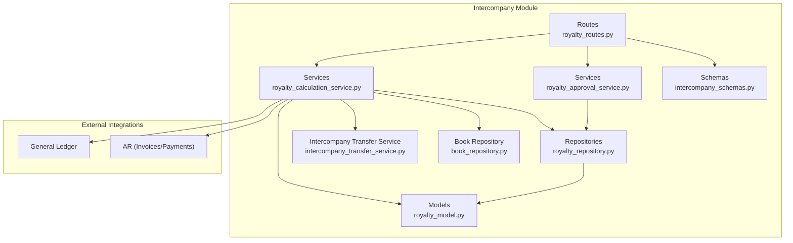
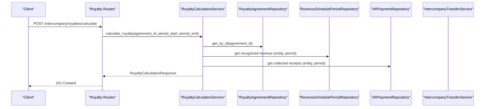
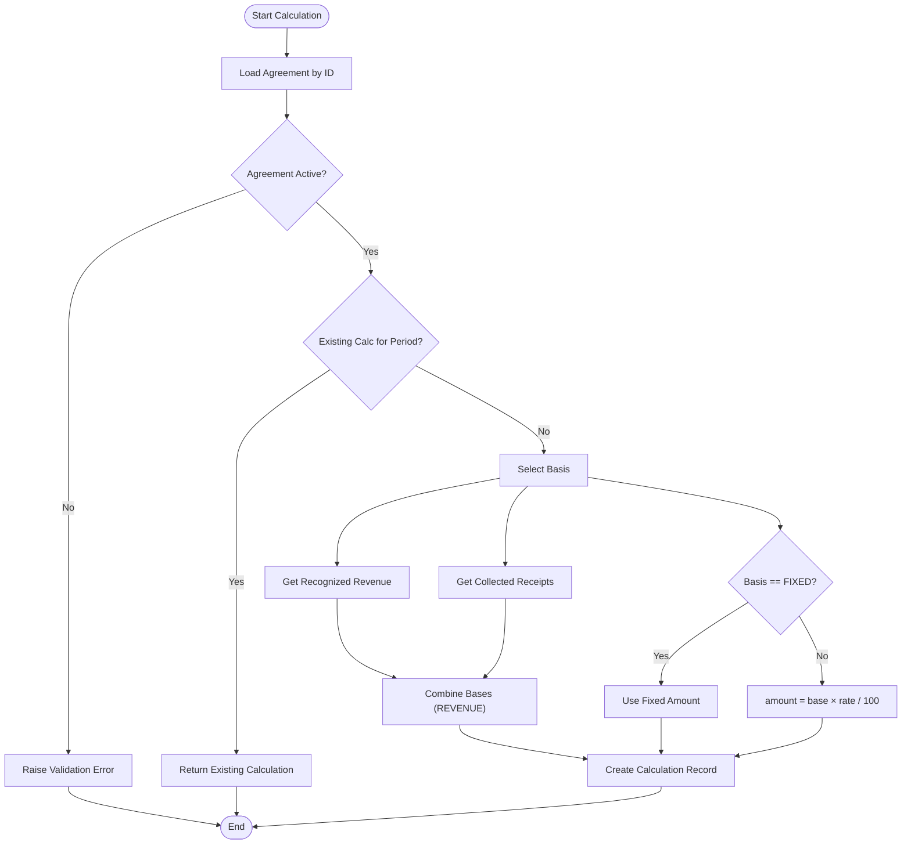
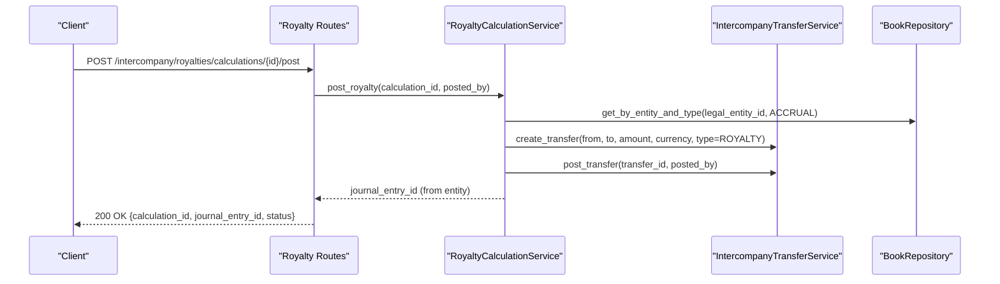
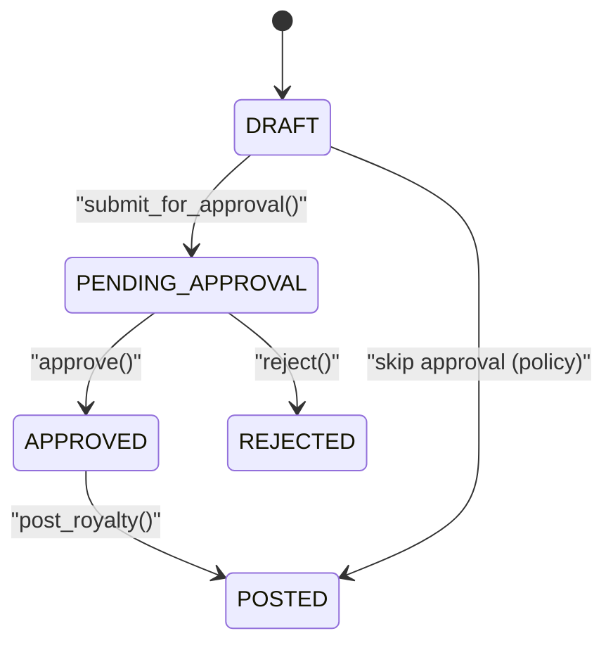
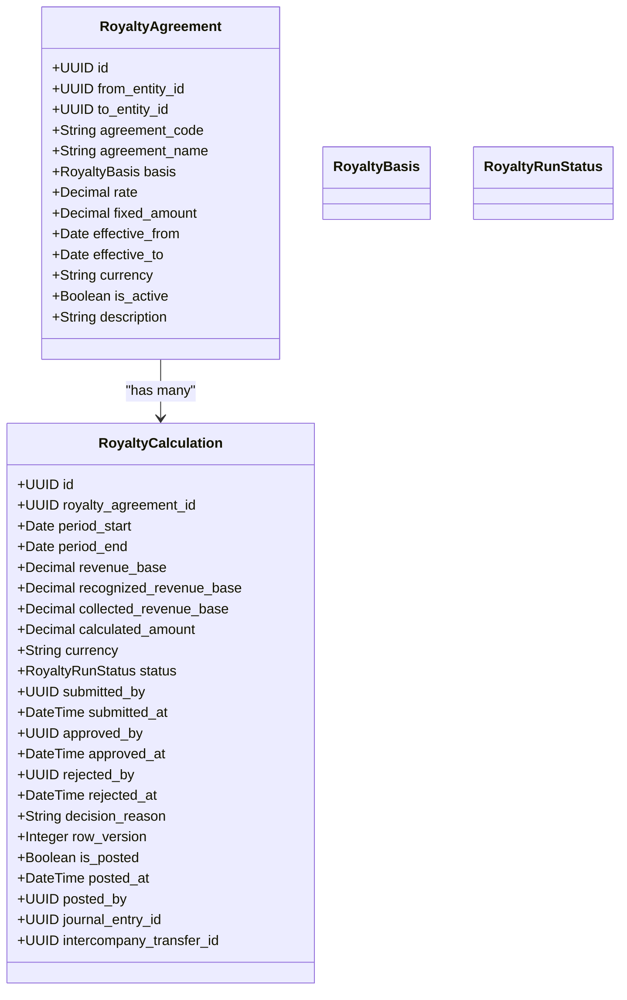

# Royalty API

<cite>
**Referenced Files in This Document**
- [royalty_routes.py](file://app/modules/intercompany/api/routes/royalty_routes.py)
- [royalty_model.py](file://app/modules/intercompany/models/royalty_model.py)
- [royalty_calculation_service.py](file://app/modules/intercompany/services/royalty_calculation_service.py)
- [royalty_approval_service.py](file://app/modules/intercompany/services/royalty_approval_service.py)
- [royalty_repository.py](file://app/modules/intercompany/repositories/royalty_repository.py)
- [intercompany_schemas.py](file://app/modules/intercompany/schemas/intercompany_schemas.py)
- [intercompany_transfer_service.py](file://app/modules/intercompany/services/intercompany_transfer_service.py)
- [book_repository.py](file://app/modules/general_ledger/repositories/book_repository.py)
- [ADDENDUM_D_ENGINEERING_RULES.md](file://docs/01-main/ADDENDUM_D_ENGINEERING_RULES.md)
- [PRD_VALIDATION_REPORT.md](file://docs/01-main/PRD_VALIDATION_REPORT.md)
- [RoyaltyRunPage.tsx](file://frontend/components/pages/intercompany/RoyaltyRunPage.tsx)
</cite>

## Table of Contents
1. [Introduction](#introduction)
2. [Project Structure](#project-structure)
3. [Core Components](#core-components)
4. [Architecture Overview](#architecture-overview)
5. [Detailed Component Analysis](#detailed-component-analysis)
6. [Dependency Analysis](#dependency-analysis)
7. [Performance Considerations](#performance-considerations)
8. [Troubleshooting Guide](#troubleshooting-guide)
9. [Conclusion](#conclusion)
10. [Appendices](#appendices)

## Introduction
This document provides comprehensive API documentation for the Royalty processing endpoints. It covers royalty calculation, accrual, and payment processing workflows, including agreement management, reporting periods, allocation methods, approval workflows, tax handling, and compliance requirements. It also documents request/response schemas, calculation algorithms, validation rules, and integration patterns for royalty processing.

## Project Structure
The Royalty API resides in the intercompany module and integrates with general ledger, AR (Accounts Receivable), and intercompany transfer services. The routes expose endpoints for agreement management, calculation, approval, and posting. Supporting models define the data structures, while repositories and services encapsulate business logic.

**Diagram sources**
- [royalty_routes.py](file://app/modules/intercompany/api/routes/royalty_routes.py#L1-L269)
- [royalty_calculation_service.py](file://app/modules/intercompany/services/royalty_calculation_service.py#L1-L202)
- [royalty_approval_service.py](file://app/modules/intercompany/services/royalty_approval_service.py#L1-L254)
- [royalty_repository.py](file://app/modules/intercompany/repositories/royalty_repository.py#L1-L107)
- [royalty_model.py](file://app/modules/intercompany/models/royalty_model.py#L1-L98)
- [intercompany_schemas.py](file://app/modules/intercompany/schemas/intercompany_schemas.py#L1-L148)
- [intercompany_transfer_service.py](file://app/modules/intercompany/services/intercompany_transfer_service.py)
- [book_repository.py](file://app/modules/general_ledger/repositories/book_repository.py)

**Section sources**
- [royalty_routes.py](file://app/modules/intercompany/api/routes/royalty_routes.py#L1-L269)
- [royalty_model.py](file://app/modules/intercompany/models/royalty_model.py#L1-L98)
- [intercompany_schemas.py](file://app/modules/intercompany/schemas/intercompany_schemas.py#L1-L148)

## Core Components
- Agreement Management: Create and list royalty agreements with rate basis and validity periods.
- Calculation Engine: Compute royalty amounts based on revenue recognition, collected receipts, or fixed amounts.
- Approval Workflow: Manage submission, approval, and rejection with SoD checks and audit logging.
- Posting Engine: Convert approved calculations into intercompany transfers and journal entries.
- Reporting and Tracking: Unposted calculation listing and status tracking.

**Section sources**
- [royalty_routes.py](file://app/modules/intercompany/api/routes/royalty_routes.py#L32-L125)
- [royalty_calculation_service.py](file://app/modules/intercompany/services/royalty_calculation_service.py#L31-L104)
- [royalty_approval_service.py](file://app/modules/intercompany/services/royalty_approval_service.py#L33-L98)
- [royalty_repository.py](file://app/modules/intercompany/repositories/royalty_repository.py#L64-L106)

## Architecture Overview
The Royalty API follows a layered architecture:
- Routes: Define HTTP endpoints and orchestrate requests.
- Services: Encapsulate business logic for calculation, approval, and posting.
- Repositories: Provide data access for agreements and calculations.
- Models: Define domain entities and enumerations.
- Schemas: Define request/response Pydantic models.
- Integrations: Connect to AR for revenue bases and general ledger for books.

**Diagram sources**
- [royalty_routes.py](file://app/modules/intercompany/api/routes/royalty_routes.py#L107-L125)
- [royalty_calculation_service.py](file://app/modules/intercompany/services/royalty_calculation_service.py#L31-L104)
- [royalty_repository.py](file://app/modules/intercompany/repositories/royalty_repository.py#L15-L62)

## Detailed Component Analysis

### Endpoints Overview
- Create Agreement: POST /intercompany/royalties/agreements
- List Agreements: GET /intercompany/royalties/agreements
- Get Agreement: GET /intercompany/royalties/agreements/{agreement_id}
- Calculate Royalty: POST /intercompany/royalties/calculate
- Submit Run for Approval: POST /intercompany/royalties/runs/{run_id}/submit-approval
- Approve Run: POST /intercompany/royalties/runs/{run_id}/approve
- Reject Run: POST /intercompany/royalties/runs/{run_id}/reject
- Post Calculation: POST /intercompany/royalties/calculations/{calculation_id}/post
- List Unposted Calculations: GET /intercompany/royalties/calculations/unposted

**Section sources**
- [royalty_routes.py](file://app/modules/intercompany/api/routes/royalty_routes.py#L32-L269)

### Request/Response Schemas
- Create Agreement: RoyaltyAgreementCreate
- List Agreements: List[RoyaltyAgreementResponse]
- Get Agreement: RoyaltyAgreementResponse
- Calculate: RoyaltyCalculationRequest → RoyaltyCalculationResponse
- Submit Approval: RoyaltyRunSubmitApprovalRequest → RoyaltyCalculationResponse
- Approve: RoyaltyRunApproveRequest → RoyaltyCalculationResponse
- Reject: RoyaltyRunRejectRequest → RoyaltyCalculationResponse
- Post: RoyaltyCalculationPostRequest → {calculation_id, journal_entry_id, status}

Validation rules:
- Agreement code uniqueness enforced.
- Rate must be between 0 and 100; fixed amount required when basis is FIXED.
- Period start must match existing calculation key; otherwise recalculated.
- Approval requires row_version for optimistic concurrency.
- Posting requires idempotency key scoped to legal entity and ACCRUAL book.

**Section sources**
- [intercompany_schemas.py](file://app/modules/intercompany/schemas/intercompany_schemas.py#L48-L148)
- [royalty_routes.py](file://app/modules/intercompany/api/routes/royalty_routes.py#L32-L69)
- [royalty_model.py](file://app/modules/intercompany/models/royalty_model.py#L10-L51)

### Calculation Algorithms
- Basis selection:
  - REVENUE: Sum of recognized and collected revenue within the period.
  - RECOGNIZED_REVENUE: Recognized revenue only.
  - COLLECTED_REVENUE: Collected receipts only.
  - FIXED: Fixed amount regardless of revenue.
- Rate computation:
  - For non-FIXED: amount = base × (rate / 100).
- Revenue base retrieval:
  - Recognized revenue: Query revenue schedule periods for the entity and period.
  - Collected receipts: Query AR payments for the entity and period.

**Diagram sources**
- [royalty_calculation_service.py](file://app/modules/intercompany/services/royalty_calculation_service.py#L31-L104)
- [royalty_model.py](file://app/modules/intercompany/models/royalty_model.py#L10-L16)

**Section sources**
- [royalty_calculation_service.py](file://app/modules/intercompany/services/royalty_calculation_service.py#L31-L104)

### Accrual and Payment Processing
- Accrual book scope: Posting is idempotent and scoped to the legal entity’s ACCRUAL book.
- Intercompany transfer: Approved calculations trigger intercompany transfers with journal entries on both entities.
- Currency and reference: Uses agreement currency and standardized reference format.

**Diagram sources**
- [royalty_routes.py](file://app/modules/intercompany/api/routes/royalty_routes.py#L200-L256)
- [royalty_calculation_service.py](file://app/modules/intercompany/services/royalty_calculation_service.py#L160-L201)
- [book_repository.py](file://app/modules/general_ledger/repositories/book_repository.py)

**Section sources**
- [royalty_routes.py](file://app/modules/intercompany/api/routes/royalty_routes.py#L200-L256)
- [royalty_calculation_service.py](file://app/modules/intercompany/services/royalty_calculation_service.py#L160-L201)

### Approval Workflows
- States: DRAFT → PENDING_APPROVAL → APPROVED → POSTED or REJECTED.
- Submission: Validates DRAFT state and optional policy-driven approval gating.
- Approval: Requires segregation-of-duties (SoD) checks and optional override with reason.
- Rejection: Requires a reason; disallows empty reasons.
- Audit logging: Logs state transitions with before/after JSON snapshots.

**Diagram sources**
- [royalty_model.py](file://app/modules/intercompany/models/royalty_model.py#L18-L25)
- [royalty_approval_service.py](file://app/modules/intercompany/services/royalty_approval_service.py#L33-L230)

**Section sources**
- [royalty_approval_service.py](file://app/modules/intercompany/services/royalty_approval_service.py#L33-L230)
- [ADDENDUM_D_ENGINEERING_RULES.md](file://docs/01-main/ADDENDUM_D_ENGINEERING_RULES.md#L154-L163)

### Tax Handling and Compliance
- Audit logging: Every royalty approval and posting action logs actor, role, object, and state transitions.
- Retention: Financial transaction audit logs retained per compliance guidelines.
- Idempotency: Posting endpoints support idempotency keys for safe retries.

Note: Specific tax-withholding configurations for royalties are not implemented in the current codebase. Entities may configure withholding via AP withholding profiles if applicable to vendor payments.

**Section sources**
- [ADDENDUM_D_ENGINEERING_RULES.md](file://docs/01-main/ADDENDUM_D_ENGINEERING_RULES.md#L154-L163)
- [royalty_routes.py](file://app/modules/intercompany/api/routes/royalty_routes.py#L200-L256)

### Reporting and Tracking
- Unposted calculations: Queryable by entity and paginated.
- Status tracking: Full lifecycle visibility via status and timestamps.

**Section sources**
- [royalty_routes.py](file://app/modules/intercompany/api/routes/royalty_routes.py#L258-L269)
- [royalty_repository.py](file://app/modules/intercompany/repositories/royalty_repository.py#L84-L106)

### Frontend Integration Patterns
- The frontend provides a royalty run page with toolbar actions for submit/approve/reject/post and displays computed bases and amounts.
- The page reflects status-driven UI controls and read-only states post-posting or pending approval.

**Section sources**
- [RoyaltyRunPage.tsx](file://frontend/components/pages/intercompany/RoyaltyRunPage.tsx#L1-L200)

## Dependency Analysis

**Diagram sources**
- [royalty_model.py](file://app/modules/intercompany/models/royalty_model.py#L27-L98)

**Section sources**
- [royalty_model.py](file://app/modules/intercompany/models/royalty_model.py#L27-L98)

## Performance Considerations
- Calculation queries: Revenue recognition and AR payment aggregation should leverage indexed date ranges and entity filters.
- Idempotency: Posting uses idempotency keys scoped to legal entity and ACCRUAL book to avoid duplicate postings.
- Pagination: Unposted calculation listing supports limits to control payload sizes.

[No sources needed since this section provides general guidance]

## Troubleshooting Guide
Common errors and resolutions:
- Not Found: Agreement or calculation not found during approval/posting.
- Validation: Inactive agreement, invalid rate/range, missing FIXED amount, or empty rejection reason.
- Concurrency: Row version mismatch; refresh and retry with latest row_version.
- Idempotency: Duplicate posting attempts; ensure idempotency_key is set and unique per posting intent.

**Section sources**
- [royalty_routes.py](file://app/modules/intercompany/api/routes/royalty_routes.py#L121-L124)
- [royalty_approval_service.py](file://app/modules/intercompany/services/royalty_approval_service.py#L54-L58)
- [PRD_VALIDATION_REPORT.md](file://docs/01-main/PRD_VALIDATION_REPORT.md#L629-L636)

## Conclusion
The Royalty API provides a robust framework for managing intercompany royalty agreements, calculations, approvals, and postings. It enforces strong validation, supports configurable rate bases, integrates with AR and general ledger, and maintains comprehensive audit trails. Extending tax handling and adding idempotency headers to all write endpoints would further align with PRD requirements.

[No sources needed since this section summarizes without analyzing specific files]

## Appendices

### API Definitions

- POST /intercompany/royalties/agreements
  - Request: RoyaltyAgreementCreate
  - Response: RoyaltyAgreementResponse
  - Validation: Unique agreement_code; FIXED basis requires fixed_amount

- GET /intercompany/royalties/agreements
  - Query: from_entity_id, to_entity_id, active_only
  - Response: List[RoyaltyAgreementResponse]

- GET /intercompany/royalties/agreements/{agreement_id}
  - Path: agreement_id
  - Response: RoyaltyAgreementResponse

- POST /intercompany/royalties/calculate
  - Request: RoyaltyCalculationRequest
  - Response: RoyaltyCalculationResponse
  - Validation: Agreement active; period uniqueness handled

- POST /intercompany/royalties/runs/{run_id}/submit-approval
  - Request: RoyaltyRunSubmitApprovalRequest
  - Response: RoyaltyCalculationResponse
  - Validation: Status DRAFT; row_version required

- POST /intercompany/royalties/runs/{run_id}/approve
  - Request: RoyaltyRunApproveRequest
  - Response: RoyaltyCalculationResponse
  - Validation: Status PENDING_APPROVAL; SoD checks; row_version required

- POST /intercompany/royalties/runs/{run_id}/reject
  - Request: RoyaltyRunRejectRequest
  - Response: RoyaltyCalculationResponse
  - Validation: Status PENDING_APPROVAL; reason required; row_version required

- POST /intercompany/royalties/calculations/{calculation_id}/post
  - Request: RoyaltyCalculationPostRequest
  - Response: {calculation_id, journal_entry_id, status}
  - Validation: Idempotency key; ACCRUAL book availability; not already posted

- GET /intercompany/royalties/calculations/unposted
  - Query: entity_id, limit
  - Response: List[RoyaltyCalculationResponse]

**Section sources**
- [royalty_routes.py](file://app/modules/intercompany/api/routes/royalty_routes.py#L32-L269)
- [intercompany_schemas.py](file://app/modules/intercompany/schemas/intercompany_schemas.py#L48-L148)

### Example Scenarios

- Patent Royalties
  - Basis: REVENUE or RECOGNIZED_REVENUE
  - Rate: e.g., 3.5%
  - Period: Monthly/Quarterly
  - Outcome: Calculation sums recognized revenue and applies rate

- Trademark Fees
  - Basis: FIXED amount per period
  - Amount: e.g., $5,000/month
  - Outcome: Fixed charge regardless of sales

- Resource Extraction Payments
  - Basis: COLLECTED_REVENUE
  - Rate: e.g., 2%
  - Outcome: Calculation uses cash collections during the period

[No sources needed since this section provides conceptual examples]