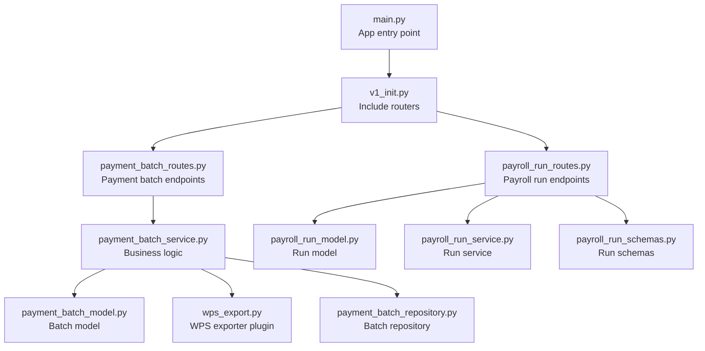
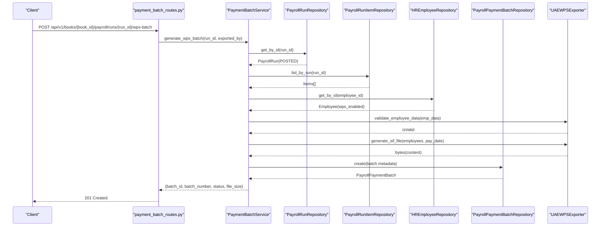
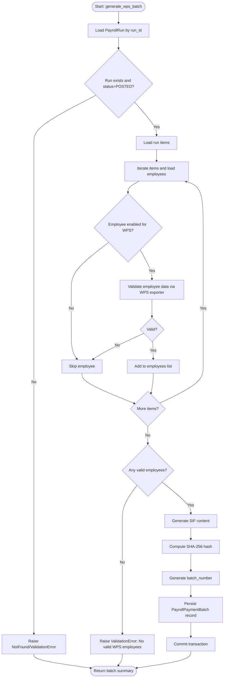
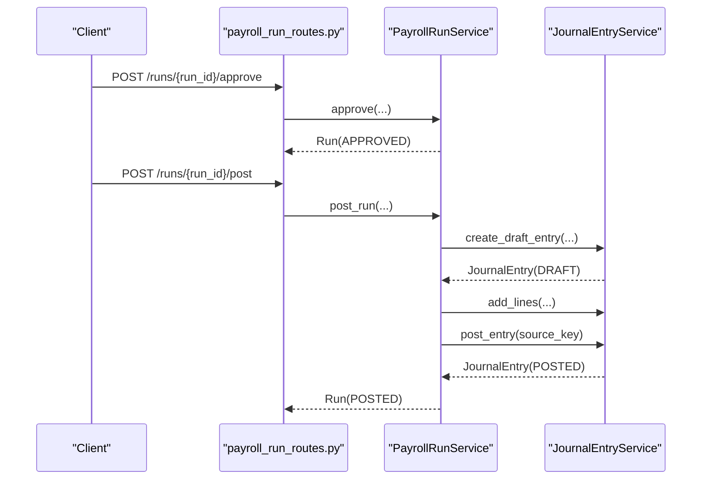
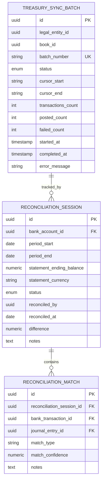
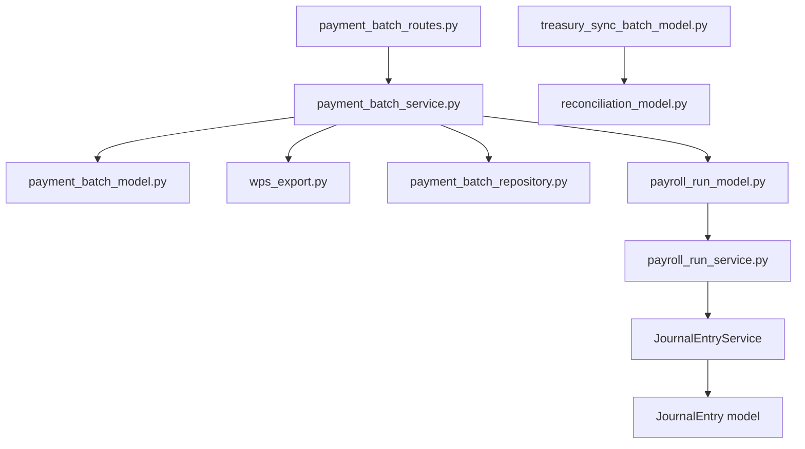

# Payment Batches API

<cite>
**Referenced Files in This Document**
- [payment_batch_routes.py](file://app/modules/payroll/api/routes/payment_batch_routes.py)
- [payment_batch_model.py](file://app/modules/payroll/models/payment_batch_model.py)
- [payment_batch_service.py](file://app/modules/payroll/services/payment_batch_service.py)
- [payment_batch_repository.py](file://app/modules/payroll/repositories/payment_batch_repository.py)
- [payroll_run_model.py](file://app/modules/payroll/models/payroll_run_model.py)
- [payroll_run_routes.py](file://app/modules/payroll/api/routes/payroll_run_routes.py)
- [payroll_run_service.py](file://app/modules/payroll/services/payroll_run_service.py)
- [payroll_run_schemas.py](file://app/modules/payroll/schemas/payroll_run_schemas.py)
- [wps_export.py](file://app/modules/payroll/plugins/wps_export.py)
- [treasury_sync_batch_model.py](file://app/modules/general_ledger/models/treasury_sync_batch_model.py)
- [treasury_sync_schemas.py](file://app/modules/general_ledger/schemas/treasury_sync_schemas.py)
- [reconciliation_model.py](file://app/modules/general_ledger/models/reconciliation_model.py)
- [v1_init.py](file://app/api/v1/__init__.py)
- [main.py](file://app/main.py)
</cite>

## Table of Contents
1. [Introduction](#introduction)
2. [Project Structure](#project-structure)
3. [Core Components](#core-components)
4. [Architecture Overview](#architecture-overview)
5. [Detailed Component Analysis](#detailed-component-analysis)
6. [Dependency Analysis](#dependency-analysis)
7. [Performance Considerations](#performance-considerations)
8. [Troubleshooting Guide](#troubleshooting-guide)
9. [Conclusion](#conclusion)
10. [Appendices](#appendices)

## Introduction
This document provides comprehensive API documentation for Payment Batch processing endpoints. It covers batch creation, distribution, and payment execution operations with a focus on:
- Direct deposit batches via WPS SIF export
- Batch configuration and validation
- Payment method support (direct deposit)
- Disbursement processing and file generation
- Batch status tracking and approval workflows
- Reconciliation processes
- Integration with treasury systems
- Request/response schemas, validation rules, and compliance requirements

## Project Structure
The Payment Batches API is part of the Payroll module and is exposed under the v1 API router. The endpoints are organized as follows:
- Route registration: v1 router includes payroll run and payment batch routes
- Endpoints:
  - POST /api/v1/books/{book_id}/payroll/runs/{run_id}/wps-batch
  - GET /api/v1/books/{book_id}/payroll/batches/{batch_id}/download

**Diagram sources**
- [main.py](file://app/main.py#L29-L31)
- [v1_init.py](file://app/api/v1/__init__.py#L55-L57)
- [payment_batch_routes.py](file://app/modules/payroll/api/routes/payment_batch_routes.py#L10-L10)
- [payment_batch_service.py](file://app/modules/payroll/services/payment_batch_service.py#L16-L26)
- [payment_batch_model.py](file://app/modules/payroll/models/payment_batch_model.py#L18-L38)
- [wps_export.py](file://app/modules/payroll/plugins/wps_export.py#L9-L39)
- [payment_batch_repository.py](file://app/modules/payroll/repositories/payment_batch_repository.py#L10-L14)
- [payroll_run_model.py](file://app/modules/payroll/models/payroll_run_model.py#L23-L65)
- [payroll_run_service.py](file://app/modules/payroll/services/payroll_run_service.py#L25-L37)
- [payroll_run_schemas.py](file://app/modules/payroll/schemas/payroll_run_schemas.py#L9-L17)

**Section sources**
- [main.py](file://app/main.py#L29-L31)
- [v1_init.py](file://app/api/v1/__init__.py#L55-L57)
- [payment_batch_routes.py](file://app/modules/payroll/api/routes/payment_batch_routes.py#L10-L10)

## Core Components
- PaymentBatchService: Orchestrates batch generation, validates employees against WPS rules, generates SIF content, computes file hash, and persists batch metadata.
- PayrollPaymentBatch model: Represents batch records with status, export type, file metadata, and foreign key to payroll run.
- WPSExporter/WPSExporter plugin: Defines the contract and UAE-specific implementation for SIF file generation and employee data validation.
- PayrollRunService: Manages the payroll run lifecycle (create, calculate, approve, post) and integrates with GL posting and journal entries.
- TreasurySyncBatch model and TreasurySync schemas: Track treasury synchronization batches for idempotent sync/post operations.
- ReconciliationSession and ReconciliationMatch models: Support bank reconciliation processes.

**Section sources**
- [payment_batch_service.py](file://app/modules/payroll/services/payment_batch_service.py#L16-L96)
- [payment_batch_model.py](file://app/modules/payroll/models/payment_batch_model.py#L18-L38)
- [wps_export.py](file://app/modules/payroll/plugins/wps_export.py#L9-L88)
- [payroll_run_service.py](file://app/modules/payroll/services/payroll_run_service.py#L25-L314)
- [treasury_sync_batch_model.py](file://app/modules/general_ledger/models/treasury_sync_batch_model.py#L17-L42)
- [treasury_sync_schemas.py](file://app/modules/general_ledger/schemas/treasury_sync_schemas.py#L12-L28)
- [reconciliation_model.py](file://app/modules/general_ledger/models/reconciliation_model.py#L18-L67)

## Architecture Overview
The Payment Batches API builds on the Payroll Run lifecycle. A batch is generated from a posted payroll run and exported as a WPS SIF file. The process integrates with treasury and reconciliation systems for auditability and compliance.

**Diagram sources**
- [payment_batch_routes.py](file://app/modules/payroll/api/routes/payment_batch_routes.py#L13-L35)
- [payment_batch_service.py](file://app/modules/payroll/services/payment_batch_service.py#L27-L96)
- [payroll_run_model.py](file://app/modules/payroll/models/payroll_run_model.py#L10-L21)
- [wps_export.py](file://app/modules/payroll/plugins/wps_export.py#L44-L65)
- [payment_batch_repository.py](file://app/modules/payroll/repositories/payment_batch_repository.py#L10-L14)

## Detailed Component Analysis

### Endpoints

#### POST /api/v1/books/{book_id}/payroll/runs/{run_id}/wps-batch
- Purpose: Generate a WPS payment batch from a posted payroll run.
- Authentication/Authorization: Requires appropriate payroll permissions; user context is used for exported_by.
- Path Parameters:
  - book_id: UUID of the book
  - run_id: UUID of the payroll run
- Query/Headers:
  - exported_by: UUID of the user exporting the batch
- Responses:
  - 201 Created: Batch created successfully
  - 400 Bad Request: Validation errors (e.g., run not posted, no valid employees)
  - 404 Not Found: Run not found
- Behavior:
  - Validates run status is POSTED
  - Collects run items and eligible employees (wps_enabled)
  - Validates employee data via WPS exporter
  - Generates SIF content, computes SHA-256 hash, and persists batch metadata
  - Commits transaction and returns batch summary

**Section sources**
- [payment_batch_routes.py](file://app/modules/payroll/api/routes/payment_batch_routes.py#L13-L35)
- [payment_batch_service.py](file://app/modules/payroll/services/payment_batch_service.py#L27-L96)
- [payroll_run_model.py](file://app/modules/payroll/models/payroll_run_model.py#L10-L21)
- [wps_export.py](file://app/modules/payroll/plugins/wps_export.py#L67-L88)

#### GET /api/v1/books/{book_id}/payroll/batches/{batch_id}/download
- Purpose: Download the generated batch file (SIF).
- Path Parameters:
  - book_id: UUID of the book
  - batch_id: UUID of the batch
- Responses:
  - 200 OK: Binary file stream with Content-Disposition header
  - 404 Not Found: Batch or file not found
- Behavior:
  - Retrieves batch record
  - For WPS_SIF, regenerates content from current run data
  - Returns octet-stream with filename derived from batch_number

**Section sources**
- [payment_batch_routes.py](file://app/modules/payroll/api/routes/payment_batch_routes.py#L37-L59)
- [payment_batch_service.py](file://app/modules/payroll/services/payment_batch_service.py#L98-L133)

### Data Models and Schemas

#### PayrollPaymentBatch (Batch Record)
- Fields:
  - payroll_run_id: UUID (FK to payroll_run)
  - batch_number: String (unique)
  - export_type: String (e.g., WPS_SIF)
  - status: Enum (GENERATED, EXPORTED, SUBMITTED, PROCESSED, FAILED)
  - file_path: String
  - file_hash: String (SHA-256)
  - file_size: Integer
  - exported_at: DateTime
  - exported_by: UUID
  - metadata: Text (JSON blob)
- Relationships:
  - One-to-many with PayrollRun via payroll_run relationship

**Section sources**
- [payment_batch_model.py](file://app/modules/payroll/models/payment_batch_model.py#L18-L38)

#### PayrollRun (Run Lifecycle)
- Statuses: DRAFT, CALCULATED, PENDING_APPROVAL, APPROVED, POSTED, PAID, CLOSED, REJECTED, REVERSED
- Key fields for batch generation:
  - run_number
  - pay_date
  - currency
  - status (must be POSTED)
- Relationships:
  - One-to-many with PayrollRunItem and PayrollPaymentBatch

**Section sources**
- [payroll_run_model.py](file://app/modules/payroll/models/payroll_run_model.py#L10-L65)

#### PayrollRun Schemas (Request/Response)
- PayrollRunCreate: entity_id, book_id, pay_group_id, pay_period_start, pay_period_end, pay_date
- PayrollRunPostRequest: reason, idempotency_key, row_version
- PayrollRunResponse: includes totals, timestamps, and optional items list

**Section sources**
- [payroll_run_schemas.py](file://app/modules/payroll/schemas/payroll_run_schemas.py#L9-L17)
- [payroll_run_schemas.py](file://app/modules/payroll/schemas/payroll_run_schemas.py#L39-L44)
- [payroll_run_schemas.py](file://app/modules/payroll/schemas/payroll_run_schemas.py#L69-L102)

### WPS Export Plugin
- Contract:
  - generate_sif_file(payroll_run_id, employees, pay_date) -> bytes
  - validate_employee_data(employee_data) -> (bool, str)
- UAEWPSExporter implementation:
  - SIF format: Header, Employee records, Footer
  - Validation rules:
    - Required fields: labour_id, mol_id, iban, net_pay, currency
    - IBAN must start with AE and meet minimum length
    - Net pay must be positive

**Section sources**
- [wps_export.py](file://app/modules/payroll/plugins/wps_export.py#L9-L39)
- [wps_export.py](file://app/modules/payroll/plugins/wps_export.py#L44-L65)
- [wps_export.py](file://app/modules/payroll/plugins/wps_export.py#L67-L88)

### Batch Generation Flow

**Diagram sources**
- [payment_batch_service.py](file://app/modules/payroll/services/payment_batch_service.py#L27-L96)
- [wps_export.py](file://app/modules/payroll/plugins/wps_export.py#L67-L88)

### Approval and Posting Workflows
- Payroll run must be APPROVED before POSTING.
- POSTING creates journal entries and updates run status to POSTED.
- The run’s pay_date determines the accounting period used for posting.

**Diagram sources**
- [payroll_run_routes.py](file://app/modules/payroll/api/routes/payroll_run_routes.py#L92-L115)
- [payroll_run_routes.py](file://app/modules/payroll/api/routes/payroll_run_routes.py#L141-L198)
- [payroll_run_service.py](file://app/modules/payroll/services/payroll_run_service.py#L149-L314)

### Treasury Integration and Reconciliation
- TreasurySyncBatch: Tracks idempotent sync batches with status, counts, cursors, and timestamps.
- TreasurySync schemas: Define sync request/response structures.
- ReconciliationSession and ReconciliationMatch: Enable bank reconciliation linking journal entries to bank transactions.

**Diagram sources**
- [treasury_sync_batch_model.py](file://app/modules/general_ledger/models/treasury_sync_batch_model.py#L17-L42)
- [treasury_sync_schemas.py](file://app/modules/general_ledger/schemas/treasury_sync_schemas.py#L12-L28)
- [reconciliation_model.py](file://app/modules/general_ledger/models/reconciliation_model.py#L18-L67)

## Dependency Analysis
- Routes depend on PaymentBatchService for business logic.
- PaymentBatchService depends on repositories for run/items/employees and the WPS exporter plugin.
- Payroll run lifecycle (routes and service) integrates with GL posting and journal entries.
- Treasury and reconciliation models provide auditability and compliance tracking.

**Diagram sources**
- [payment_batch_routes.py](file://app/modules/payroll/api/routes/payment_batch_routes.py#L10-L10)
- [payment_batch_service.py](file://app/modules/payroll/services/payment_batch_service.py#L16-L26)
- [payment_batch_model.py](file://app/modules/payroll/models/payment_batch_model.py#L18-L38)
- [wps_export.py](file://app/modules/payroll/plugins/wps_export.py#L9-L39)
- [payment_batch_repository.py](file://app/modules/payroll/repositories/payment_batch_repository.py#L10-L14)
- [payroll_run_model.py](file://app/modules/payroll/models/payroll_run_model.py#L23-L65)
- [payroll_run_service.py](file://app/modules/payroll/services/payroll_run_service.py#L25-L37)
- [treasury_sync_batch_model.py](file://app/modules/general_ledger/models/treasury_sync_batch_model.py#L17-L42)
- [reconciliation_model.py](file://app/modules/general_ledger/models/reconciliation_model.py#L18-L67)

**Section sources**
- [payment_batch_routes.py](file://app/modules/payroll/api/routes/payment_batch_routes.py#L10-L10)
- [payment_batch_service.py](file://app/modules/payroll/services/payment_batch_service.py#L16-L26)
- [payroll_run_routes.py](file://app/modules/payroll/api/routes/payroll_run_routes.py#L25-L25)

## Performance Considerations
- Batch generation iterates run items and employees; ensure efficient repository queries and avoid N+1 patterns.
- SIF generation is in-memory; large batches may increase memory usage—consider streaming or chunking if scaling.
- File hashing and persistence are O(n) with respect to content size; monitor I/O performance.
- Use pagination and filtering when listing batches by run and status.

## Troubleshooting Guide
Common issues and resolutions:
- Run not posted: Ensure the payroll run status is POSTED before generating a batch.
- No valid WPS employees: Verify employees are enabled for WPS and have valid IBAN and amounts.
- Batch not found: Confirm batch_id exists and file_path is set.
- Download returns 404: The batch file may not be persisted; regenerate via service logic.

Operational checks:
- Validate run belongs to the requested book before posting.
- Use idempotency keys for posting to prevent duplicate journal entries.
- Monitor treasury sync batch statuses for failures and retry mechanisms.

**Section sources**
- [payment_batch_service.py](file://app/modules/payroll/services/payment_batch_service.py#L33-L38)
- [wps_export.py](file://app/modules/payroll/plugins/wps_export.py#L75-L87)
- [payment_batch_routes.py](file://app/modules/payroll/api/routes/payment_batch_routes.py#L44-L50)
- [payroll_run_routes.py](file://app/modules/payroll/api/routes/payroll_run_routes.py#L154-L158)
- [payroll_run_routes.py](file://app/modules/payroll/api/routes/payroll_run_routes.py#L184-L194)

## Conclusion
The Payment Batches API provides a robust foundation for generating WPS SIF files from posted payroll runs, with strong validation, auditability, and integration points for treasury and reconciliation. By adhering to the documented workflows, schemas, and validation rules, organizations can reliably process direct deposit payments while maintaining compliance and operational controls.

## Appendices

### API Definitions

- POST /api/v1/books/{book_id}/payroll/runs/{run_id}/wps-batch
  - Description: Generate WPS payment batch from a posted payroll run
  - Path Parameters:
    - book_id: UUID
    - run_id: UUID
  - Query/Headers:
    - exported_by: UUID
  - Responses:
    - 201 Created: {batch_id, batch_number, export_type, status, file_size}
    - 400 Bad Request: Validation errors
    - 404 Not Found: Run not found

- GET /api/v1/books/{book_id}/payroll/batches/{batch_id}/download
  - Description: Download the generated batch file (SIF)
  - Path Parameters:
    - book_id: UUID
    - batch_id: UUID
  - Responses:
    - 200 OK: Binary file stream
    - 404 Not Found: Batch or file not found

**Section sources**
- [payment_batch_routes.py](file://app/modules/payroll/api/routes/payment_batch_routes.py#L13-L35)
- [payment_batch_routes.py](file://app/modules/payroll/api/routes/payment_batch_routes.py#L37-L59)

### Validation Rules and Compliance
- Employee data validation:
  - Required fields: labour_id, mol_id, iban, net_pay, currency
  - IBAN must start with AE and meet minimum length
  - Net pay must be positive
- Run status requirement:
  - Payroll run must be POSTED before batch generation
- Idempotency:
  - Posting uses idempotency keys to prevent duplicate journal entries
- Auditability:
  - Batch records include file hash, size, and exported metadata
  - Treasury sync batches track sync progress and errors

**Section sources**
- [wps_export.py](file://app/modules/payroll/plugins/wps_export.py#L67-L88)
- [payroll_run_model.py](file://app/modules/payroll/models/payroll_run_model.py#L10-L21)
- [payroll_run_routes.py](file://app/modules/payroll/api/routes/payroll_run_routes.py#L184-L194)
- [payment_batch_model.py](file://app/modules/payroll/models/payment_batch_model.py#L22-L31)