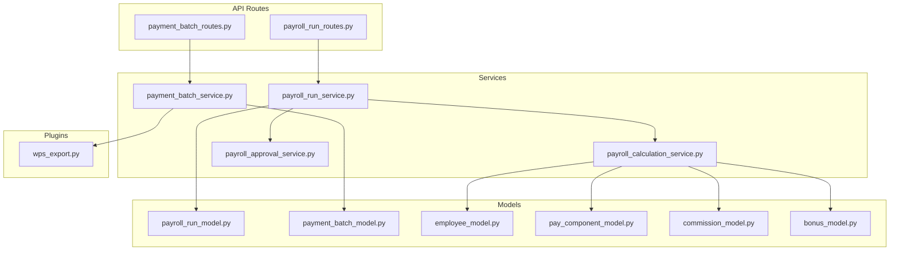
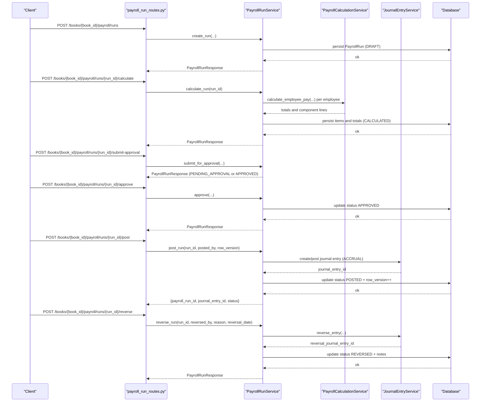
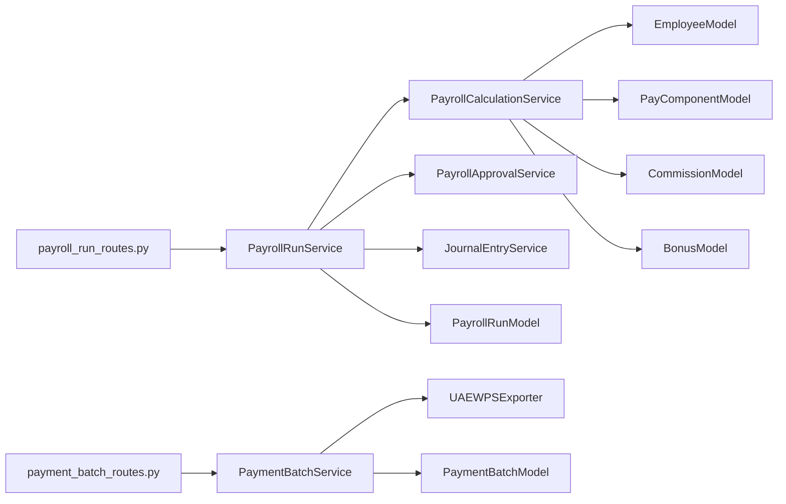

# Payroll API

<cite>
**Referenced Files in This Document**
- [payroll_run_routes.py](file://app/modules/payroll/api/routes/payroll_run_routes.py)
- [payment_batch_routes.py](file://app/modules/payroll/api/routes/payment_batch_routes.py)
- [payroll_run_schemas.py](file://app/modules/payroll/schemas/payroll_run_schemas.py)
- [payroll_run_service.py](file://app/modules/payroll/services/payroll_run_service.py)
- [payment_batch_service.py](file://app/modules/payroll/services/payment_batch_service.py)
- [payroll_approval_service.py](file://app/modules/payroll/services/payroll_approval_service.py)
- [payroll_calculation_service.py](file://app/modules/payroll/services/payroll_calculation_service.py)
- [payroll_run_model.py](file://app/modules/payroll/models/payroll_run_model.py)
- [payment_batch_model.py](file://app/modules/payroll/models/payment_batch_model.py)
- [employee_model.py](file://app/modules/payroll/models/employee_model.py)
- [pay_component_model.py](file://app/modules/payroll/models/pay_component_model.py)
- [commission_model.py](file://app/modules/payroll/models/commission_model.py)
- [bonus_model.py](file://app/modules/payroll/models/bonus_model.py)
- [wps_export.py](file://app/modules/payroll/plugins/wps_export.py)
</cite>

## Table of Contents
1. [Introduction](#introduction)
2. [Project Structure](#project-structure)
3. [Core Components](#core-components)
4. [Architecture Overview](#architecture-overview)
5. [Detailed Component Analysis](#detailed-component-analysis)
6. [Dependency Analysis](#dependency-analysis)
7. [Performance Considerations](#performance-considerations)
8. [Troubleshooting Guide](#troubleshooting-guide)
9. [Conclusion](#conclusion)

## Introduction
This document provides comprehensive API documentation for the Payroll domain, covering payroll run processing (creation, calculation, approval, posting, and reversal), payment batch management (WPS batch generation and download), and the underlying data models for employee compensation, tax deduction calculations, and benefit enrollments. It also documents request/response schemas, validation rules, error handling, approval chains, compliance requirements, and integration with tax systems.

## Project Structure
The Payroll module is organized by concerns:
- API routes define endpoints under the payroll namespace.
- Services encapsulate business logic for run lifecycle, calculation, approval, and batch generation.
- Models define the persistent entities and enumerations.
- Plugins implement export formats (e.g., WPS SIF).
- Schemas define request/response Pydantic models.

**Diagram sources**
- [payroll_run_routes.py](file://app/modules/payroll/api/routes/payroll_run_routes.py#L1-L302)
- [payment_batch_routes.py](file://app/modules/payroll/api/routes/payment_batch_routes.py#L1-L59)
- [payroll_run_service.py](file://app/modules/payroll/services/payroll_run_service.py#L1-L416)
- [payment_batch_service.py](file://app/modules/payroll/services/payment_batch_service.py#L1-L133)
- [payroll_calculation_service.py](file://app/modules/payroll/services/payroll_calculation_service.py#L1-L138)
- [payroll_approval_service.py](file://app/modules/payroll/services/payroll_approval_service.py#L1-L253)
- [payroll_run_model.py](file://app/modules/payroll/models/payroll_run_model.py#L1-L117)
- [payment_batch_model.py](file://app/modules/payroll/models/payment_batch_model.py#L1-L42)
- [employee_model.py](file://app/modules/payroll/models/employee_model.py#L1-L75)
- [pay_component_model.py](file://app/modules/payroll/models/pay_component_model.py#L1-L88)
- [commission_model.py](file://app/modules/payroll/models/commission_model.py#L1-L101)
- [bonus_model.py](file://app/modules/payroll/models/bonus_model.py#L1-L63)
- [wps_export.py](file://app/modules/payroll/plugins/wps_export.py#L1-L88)

**Section sources**
- [payroll_run_routes.py](file://app/modules/payroll/api/routes/payroll_run_routes.py#L1-L302)
- [payment_batch_routes.py](file://app/modules/payroll/api/routes/payment_batch_routes.py#L1-L59)

## Core Components
- Payroll Run API: Endpoints for creating, calculating, submitting/approving/rejecting, posting, reversing, listing, and retrieving payroll runs.
- Payment Batch API: Endpoints for generating WPS payment batches and downloading batch files.
- Payroll Run Service: Orchestrates run lifecycle, calculation, posting to GL, and reversal.
- Payroll Calculation Service: Computes employee earnings, deductions, and employer contributions; integrates commissions and bonuses.
- Payroll Approval Service: Manages approval state transitions and segregation-of-duties checks.
- Payment Batch Service: Generates WPS SIF files and validates employee data.
- Models: Define run statuses, run items, component lines, batch statuses, employee data, pay components, and commission/bonus records.

**Section sources**
- [payroll_run_routes.py](file://app/modules/payroll/api/routes/payroll_run_routes.py#L28-L302)
- [payment_batch_routes.py](file://app/modules/payroll/api/routes/payment_batch_routes.py#L13-L59)
- [payroll_run_service.py](file://app/modules/payroll/services/payroll_run_service.py#L25-L416)
- [payroll_calculation_service.py](file://app/modules/payroll/services/payroll_calculation_service.py#L22-L138)
- [payroll_approval_service.py](file://app/modules/payroll/services/payroll_approval_service.py#L26-L253)
- [payment_batch_service.py](file://app/modules/payroll/services/payment_batch_service.py#L16-L133)
- [payroll_run_model.py](file://app/modules/payroll/models/payroll_run_model.py#L10-L117)
- [payment_batch_model.py](file://app/modules/payroll/models/payment_batch_model.py#L9-L42)
- [employee_model.py](file://app/modules/payroll/models/employee_model.py#L16-L75)
- [pay_component_model.py](file://app/modules/payroll/models/pay_component_model.py#L17-L88)
- [commission_model.py](file://app/modules/payroll/models/commission_model.py#L17-L101)
- [bonus_model.py](file://app/modules/payroll/models/bonus_model.py#L16-L63)

## Architecture Overview
The Payroll API follows a layered architecture:
- Routes: FastAPI endpoints handle HTTP requests and responses.
- Services: Business logic orchestrators coordinating repositories and external services.
- Models: SQLAlchemy ORM entities persisted to the database.
- Plugins: Export/format-specific implementations.

**Diagram sources**
- [payroll_run_routes.py](file://app/modules/payroll/api/routes/payroll_run_routes.py#L28-L302)
- [payroll_run_service.py](file://app/modules/payroll/services/payroll_run_service.py#L38-L314)
- [payroll_calculation_service.py](file://app/modules/payroll/services/payroll_calculation_service.py#L33-L124)

## Detailed Component Analysis

### Payroll Run Endpoints
- Create Run
  - Method: POST
  - Path: /books/{book_id}/payroll/runs
  - Request body: PayrollRunCreate
  - Response: PayrollRunResponse
  - Validation: Pay group must belong to entity; generates unique run number.
  - Errors: 404 Not Found for missing pay group; 400 Bad Request for validation errors.
- Calculate Run
  - Method: POST
  - Path: /books/{book_id}/payroll/runs/{run_id}/calculate
  - Response: PayrollRunResponse
  - Validation: Run must be in DRAFT; calculates per-employee items and totals.
  - Errors: 404 Not Found; 400 Bad Request for invalid status.
- Submit for Approval
  - Method: POST
  - Path: /books/{book_id}/payroll/runs/{run_id}/submit-approval
  - Request body: PayrollRunSubmitApprovalRequest
  - Response: PayrollRunResponse
  - Behavior: Transitions from CALCULATED to PENDING_APPROVAL or APPROVED depending on policy.
  - Errors: 400 Bad Request for workflow violations; 404 Not Found.
- Approve Run
  - Method: POST
  - Path: /books/{book_id}/payroll/runs/{run_id}/approve
  - Request body: PayrollRunApproveRequest
  - Response: PayrollRunResponse
  - Behavior: Transitions from PENDING_APPROVAL to APPROVED; enforces SoD.
  - Errors: 400 Bad Request for workflow/SoD violations; 404 Not Found.
- Reject Run
  - Method: POST
  - Path: /books/{book_id}/payroll/runs/{run_id}/reject
  - Request body: PayrollRunRejectRequest
  - Response: PayrollRunResponse
  - Behavior: Transitions from PENDING_APPROVAL to REJECTED.
  - Errors: 400 Bad Request for workflow violations; 404 Not Found.
- Post Run
  - Method: POST
  - Path: /books/{book_id}/payroll/runs/{run_id}/post
  - Request body: PayrollRunPostRequest
  - Response: {payroll_run_id, journal_entry_id, status}
  - Behavior: Posts to ACCRUAL book; creates journal entry; idempotent via idempotency key and row version.
  - Errors: 404 Not Found; 400 Bad Request for validation/idempotency; 403 Forbidden for missing role.
- Reverse Run
  - Method: POST
  - Path: /books/{book_id}/payroll/runs/{run_id}/reverse
  - Request body: PayrollRunReverseRequest
  - Response: PayrollRunResponse
  - Behavior: Reverses posted run; requires FINANCE_ADMIN role.
  - Errors: 403 Forbidden; 400 Bad Request; 404 Not Found.
- List Runs
  - Method: GET
  - Path: /books/{book_id}/payroll/runs
  - Query params: entity_id, status (optional), limit (default 100), offset (default 0)
  - Response: List[PayrollRunResponse]
- Get Run
  - Method: GET
  - Path: /books/{book_id}/payroll/runs/{run_id}
  - Response: PayrollRunResponse with items populated

Request/Response Schemas
- PayrollRunCreate: entity_id, book_id, pay_group_id, pay_period_start, pay_period_end, pay_date
- PayrollRunSubmitApprovalRequest: reason (optional), row_version (required)
- PayrollRunApproveRequest: reason (optional), override_reason (optional), row_version (required)
- PayrollRunRejectRequest: reason (required), required_changes (optional), row_version (required)
- PayrollRunPostRequest: reason (optional), idempotency_key (optional), row_version (required)
- PayrollRunReverseRequest: reason (required), reversal_date (optional)
- PayrollRunItemResponse: id, payroll_run_id, hr_employee_id, gross_pay, total_deductions, net_pay, employer_contributions, currency, timestamps
- PayrollRunResponse: run metadata, totals, approvals, posting info, row_version, items (optional)

Validation Rules
- Status transitions enforced by services and approval workflow.
- Row version checked for optimistic concurrency on post/reverse/approve/submit.
- Idempotency applied to post/reverse endpoints.
- Approval policy determines whether submission goes to approval or auto-approves.

Error Handling
- NotFoundError raised for missing entities; mapped to 404.
- ValidationError raised for invalid state or business rule violations; mapped to 400.
- PayrollApprovalError raised for approval workflow violations; mapped to 400.
- Role checks (e.g., FINANCE_ADMIN) enforced for reverse endpoint.

**Section sources**
- [payroll_run_routes.py](file://app/modules/payroll/api/routes/payroll_run_routes.py#L28-L302)
- [payroll_run_schemas.py](file://app/modules/payroll/schemas/payroll_run_schemas.py#L9-L102)
- [payroll_run_model.py](file://app/modules/payroll/models/payroll_run_model.py#L10-L68)

### Payment Batch Endpoints
- Generate WPS Batch
  - Method: POST
  - Path: /books/{book_id}/payroll/runs/{run_id}/wps-batch
  - Query: exported_by (UUID)
  - Response: {batch_id, batch_number, export_type, status, file_size}
  - Validation: Run must be POSTED; filters employees with wps_enabled and validates data against WPS exporter.
  - Errors: 404 Not Found; 400 Bad Request for invalid status or no valid employees.
- Download Batch File
  - Method: GET
  - Path: /books/{book_id}/payroll/batches/{batch_id}/download
  - Response: Binary file (Content-Type: application/octet-stream)
  - Errors: 404 Not Found if batch or file not found.

WPS Export Details
- Exporter interface defines generate_sif_file and validate_employee_data.
- UAEWPSExporter implements SIF format with header, employee lines, and footer.
- Validation includes required fields, IBAN format (UAE), and positive net pay.

**Section sources**
- [payment_batch_routes.py](file://app/modules/payroll/api/routes/payment_batch_routes.py#L13-L59)
- [payment_batch_service.py](file://app/modules/payroll/services/payment_batch_service.py#L27-L133)
- [wps_export.py](file://app/modules/payroll/plugins/wps_export.py#L9-L88)

### Payroll Calculation and Compensation Setup
- Calculation Service
  - Calculates per-employee totals from component assignments, plus unpaid commissions and bonuses.
  - Supports fixed amount or rate-based calculations (rate derived from BASIC component).
  - Aggregates earnings, deductions, and employer contributions; returns component lines.
- Employee Model
  - Stores personal and employment details; WPS fields (labour_id, mol_id, iban); active status.
- Pay Component Model
  - Defines component codes (EARNING, DEDUCTION, EMPLOYER_CONTRIBUTION) and tax/WPS flags.
  - Assignments link employees to components with amounts/rates and effective dates.
- Commissions and Bonuses
  - CommissionLedger tracks recognized and collected revenue bases and total commission per period.
  - BonusResult tracks awarded bonuses linked to payroll runs.

Tax and Benefit Enrichment
- Component definitions include is_taxable and affects_wps_net flags.
- Tax-related component codes are standardized (e.g., TAX_WITHHOLDING).
- Benefits are modeled via component codes (e.g., BENEFIT_EMP).

**Section sources**
- [payroll_calculation_service.py](file://app/modules/payroll/services/payroll_calculation_service.py#L33-L138)
- [employee_model.py](file://app/modules/payroll/models/employee_model.py#L16-L75)
- [pay_component_model.py](file://app/modules/payroll/models/pay_component_model.py#L17-L88)
- [commission_model.py](file://app/modules/payroll/models/commission_model.py#L70-L101)
- [bonus_model.py](file://app/modules/payroll/models/bonus_model.py#L38-L63)

### Payroll Approval Chains and Compliance
- Approval Workflow
  - submit_for_approval: Moves from CALCULATED to PENDING_APPROVAL or APPROVED based on policy.
  - approve: Moves from PENDING_APPROVAL to APPROVED; enforces SoD checks.
  - reject: Moves from PENDING_APPROVAL to REJECTED; requires reason.
- Segregation of Duties (SoD)
  - SoD validator prevents a user from approving a run they submitted or previously posted.
  - FINANCE_ADMIN override supported for approvals with explicit override_reason.
- Audit Logging
  - Actions logged with before/after status and reason.

Compliance Notes
- Idempotency keys prevent duplicate postings/reversals.
- Row version ensures optimistic concurrency for updates.
- Journal entries tagged with source_key for resilience and traceability.

**Section sources**
- [payroll_approval_service.py](file://app/modules/payroll/services/payroll_approval_service.py#L34-L228)
- [payroll_run_service.py](file://app/modules/payroll/services/payroll_run_service.py#L172-L314)

## Dependency Analysis
Key dependencies and relationships:
- Routes depend on services and schemas.
- Services depend on repositories and external services (e.g., JournalEntryService).
- Models define relationships and constraints.
- PaymentBatchService depends on WPS exporter plugin.

**Diagram sources**
- [payroll_run_routes.py](file://app/modules/payroll/api/routes/payroll_run_routes.py#L1-L302)
- [payment_batch_routes.py](file://app/modules/payroll/api/routes/payment_batch_routes.py#L1-L59)
- [payroll_run_service.py](file://app/modules/payroll/services/payroll_run_service.py#L1-L416)
- [payment_batch_service.py](file://app/modules/payroll/services/payment_batch_service.py#L1-L133)
- [payroll_calculation_service.py](file://app/modules/payroll/services/payroll_calculation_service.py#L1-L138)
- [payroll_approval_service.py](file://app/modules/payroll/services/payroll_approval_service.py#L1-L253)
- [wps_export.py](file://app/modules/payroll/plugins/wps_export.py#L1-L88)
- [payroll_run_model.py](file://app/modules/payroll/models/payroll_run_model.py#L1-L117)
- [payment_batch_model.py](file://app/modules/payroll/models/payment_batch_model.py#L1-L42)
- [employee_model.py](file://app/modules/payroll/models/employee_model.py#L1-L75)
- [pay_component_model.py](file://app/modules/payroll/models/pay_component_model.py#L1-L88)
- [commission_model.py](file://app/modules/payroll/models/commission_model.py#L1-L101)
- [bonus_model.py](file://app/modules/payroll/models/bonus_model.py#L1-L63)

**Section sources**
- [payroll_run_routes.py](file://app/modules/payroll/api/routes/payroll_run_routes.py#L1-L302)
- [payment_batch_routes.py](file://app/modules/payroll/api/routes/payment_batch_routes.py#L1-L59)
- [payroll_run_service.py](file://app/modules/payroll/services/payroll_run_service.py#L1-L416)
- [payment_batch_service.py](file://app/modules/payroll/services/payment_batch_service.py#L1-L133)
- [payroll_calculation_service.py](file://app/modules/payroll/services/payroll_calculation_service.py#L1-L138)
- [payroll_approval_service.py](file://app/modules/payroll/services/payroll_approval_service.py#L1-L253)
- [wps_export.py](file://app/modules/payroll/plugins/wps_export.py#L1-L88)

## Performance Considerations
- Calculation scale: Per-pay-group employee enumeration and per-employee component aggregation; consider pagination and caching for large workloads.
- Journal entry creation: Batch posting to GL reduces transaction overhead; ensure proper indexing on date/book/source_key.
- Idempotency: Hash-based idempotency keys avoid duplicate processing; ensure adequate storage and cleanup policies.
- Export generation: WPS SIF generation is memory-bound; stream large files if needed and implement chunked writes.

## Troubleshooting Guide
Common issues and resolutions:
- Run not found: Verify run_id and book_id ownership; ensure correct endpoint path.
- Invalid status transitions: Ensure run progresses through DRAFT → CALCULATED → APPROVED → POSTED; re-calculate if needed.
- Approval failures: Confirm SoD constraints and required reasons; use override_reason only with appropriate authorization.
- Posting failures: Check row_version increments; confirm idempotency key uniqueness; verify GL mappings and accounting period availability.
- Batch generation failures: Ensure employees have wps_enabled and valid IBAN; confirm run status is POSTED.
- Reversal failures: Confirm FINANCE_ADMIN role; ensure run is POSTED and has a journal entry.

**Section sources**
- [payroll_run_routes.py](file://app/modules/payroll/api/routes/payroll_run_routes.py#L141-L263)
- [payroll_run_service.py](file://app/modules/payroll/services/payroll_run_service.py#L172-L367)
- [payment_batch_service.py](file://app/modules/payroll/services/payment_batch_service.py#L27-L96)
- [payroll_approval_service.py](file://app/modules/payroll/services/payroll_approval_service.py#L34-L228)

## Conclusion
The Payroll API provides a robust, auditable, and compliant workflow for managing payroll runs and payment batches. It enforces approval policies, segregation of duties, and idempotent posting/reversal semantics while integrating with GL and export systems. The schema-driven design and strong typing ensure predictable request/response contracts, and the modular service architecture supports maintainability and extensibility.