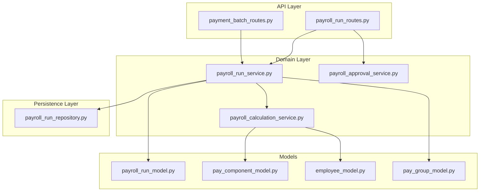
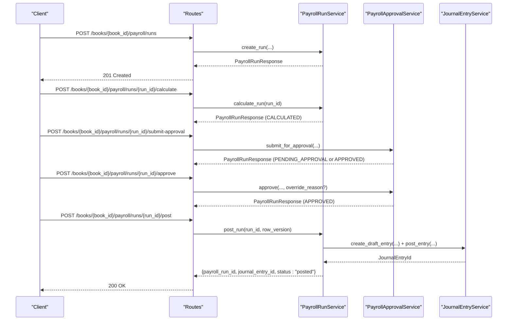
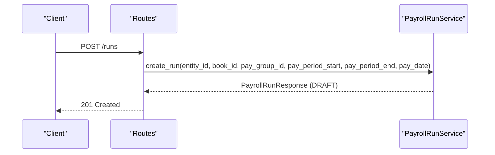
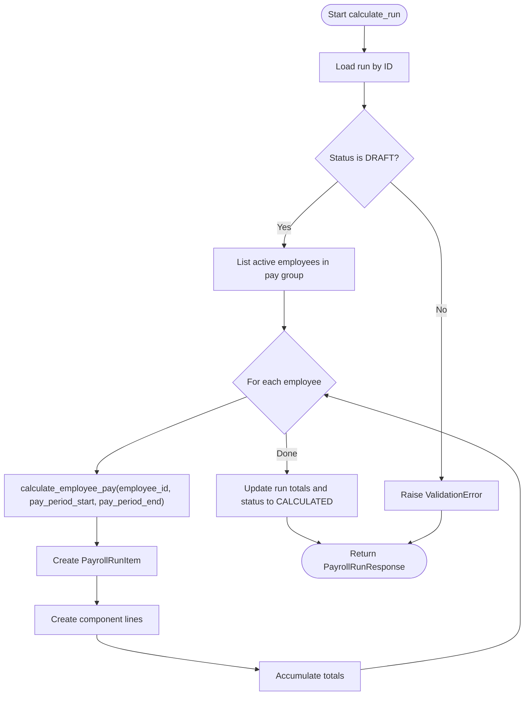
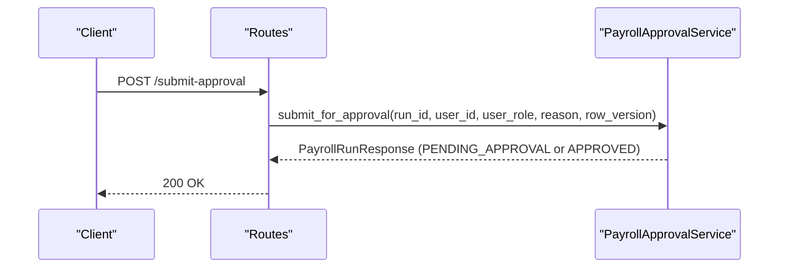
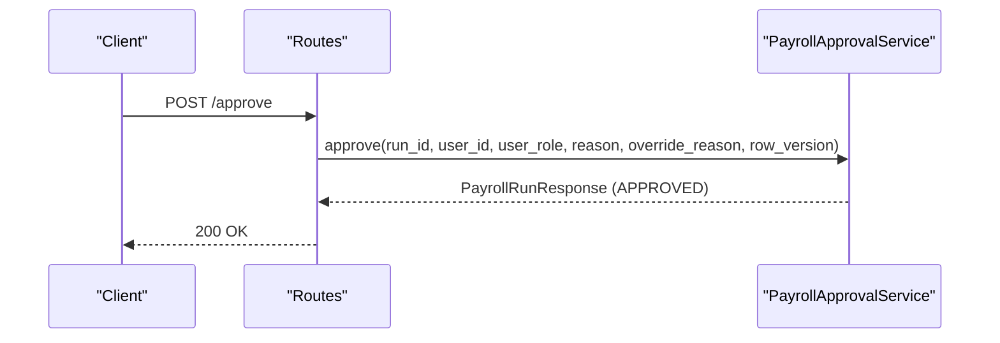
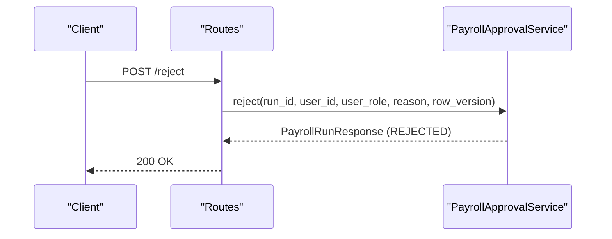
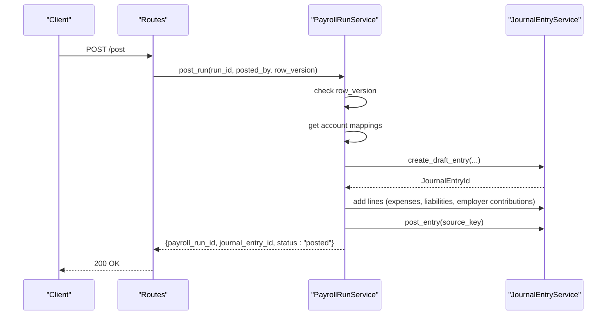
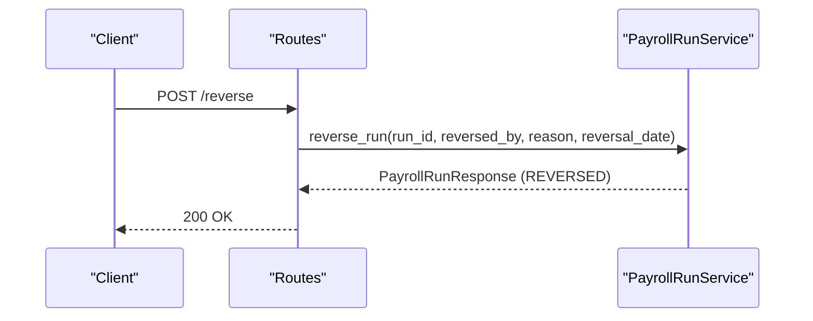
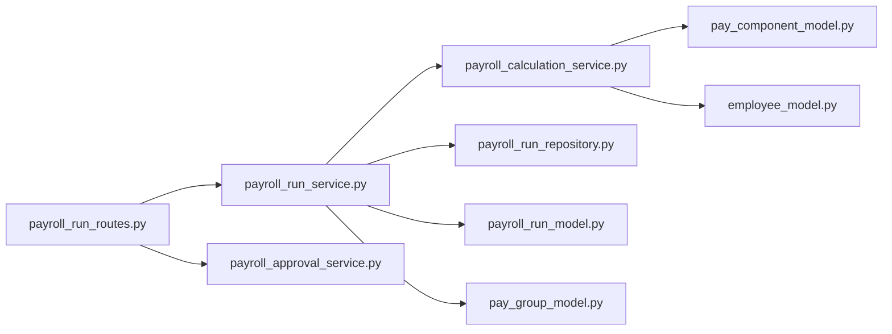

# Payroll Runs API

<cite>
**Referenced Files in This Document**
- [payroll_run_routes.py](file://app/modules/payroll/api/routes/payroll_run_routes.py)
- [payroll_run_schemas.py](file://app/modules/payroll/schemas/payroll_run_schemas.py)
- [payroll_run_model.py](file://app/modules/payroll/models/payroll_run_model.py)
- [payroll_run_service.py](file://app/modules/payroll/services/payroll_run_service.py)
- [payroll_calculation_service.py](file://app/modules/payroll/services/payroll_calculation_service.py)
- [payroll_approval_service.py](file://app/modules/payroll/services/payroll_approval_service.py)
- [payroll_run_repository.py](file://app/modules/payroll/repositories/payroll_run_repository.py)
- [pay_component_model.py](file://app/modules/payroll/models/pay_component_model.py)
- [employee_model.py](file://app/modules/payroll/models/employee_model.py)
- [pay_group_model.py](file://app/modules/payroll/models/pay_group_model.py)
- [payment_batch_routes.py](file://app/modules/payroll/api/routes/payment_batch_routes.py)
</cite>

## Table of Contents
1. [Introduction](#introduction)
2. [Project Structure](#project-structure)
3. [Core Components](#core-components)
4. [Architecture Overview](#architecture-overview)
5. [Detailed Component Analysis](#detailed-component-analysis)
6. [Dependency Analysis](#dependency-analysis)
7. [Performance Considerations](#performance-considerations)
8. [Troubleshooting Guide](#troubleshooting-guide)
9. [Conclusion](#conclusion)
10. [Appendices](#appendices)

## Introduction
This document provides comprehensive API documentation for Payroll Run processing endpoints. It covers the lifecycle of a payroll run from creation to posting and reversal, including calculation, approval workflows, run configuration, employee selection, calculation parameters, result validation, status tracking, and integration with related components such as payment batches and general ledger.

## Project Structure
The Payroll Runs API is implemented under the payroll module with clear separation of concerns:
- Routes define the HTTP endpoints and request/response binding.
- Schemas define request/response validation and serialization.
- Services encapsulate business logic for run creation, calculation, approval, posting, and reversal.
- Repositories handle persistence operations.
- Models define domain entities and enumerations.
- Integration routes expose downstream outputs such as payment batch generation.

**Diagram sources**
- [payroll_run_routes.py](file://app/modules/payroll/api/routes/payroll_run_routes.py#L25-L302)
- [payment_batch_routes.py](file://app/modules/payroll/api/routes/payment_batch_routes.py#L10-L59)
- [payroll_run_service.py](file://app/modules/payroll/services/payroll_run_service.py#L25-L416)
- [payroll_calculation_service.py](file://app/modules/payroll/services/payroll_calculation_service.py#L22-L138)
- [payroll_approval_service.py](file://app/modules/payroll/services/payroll_approval_service.py#L26-L253)
- [payroll_run_repository.py](file://app/modules/payroll/repositories/payroll_run_repository.py#L16-L107)
- [payroll_run_model.py](file://app/modules/payroll/models/payroll_run_model.py#L23-L117)
- [pay_component_model.py](file://app/modules/payroll/models/pay_component_model.py#L38-L88)
- [employee_model.py](file://app/modules/payroll/models/employee_model.py#L16-L75)
- [pay_group_model.py](file://app/modules/payroll/models/pay_group_model.py#L24-L48)

**Section sources**
- [payroll_run_routes.py](file://app/modules/payroll/api/routes/payroll_run_routes.py#L25-L302)
- [payroll_run_service.py](file://app/modules/payroll/services/payroll_run_service.py#L25-L416)
- [payroll_calculation_service.py](file://app/modules/payroll/services/payroll_calculation_service.py#L22-L138)
- [payroll_approval_service.py](file://app/modules/payroll/services/payroll_approval_service.py#L26-L253)
- [payroll_run_repository.py](file://app/modules/payroll/repositories/payroll_run_repository.py#L16-L107)
- [payroll_run_model.py](file://app/modules/payroll/models/payroll_run_model.py#L23-L117)
- [pay_component_model.py](file://app/modules/payroll/models/pay_component_model.py#L38-L88)
- [employee_model.py](file://app/modules/payroll/models/employee_model.py#L16-L75)
- [pay_group_model.py](file://app/modules/payroll/models/pay_group_model.py#L24-L48)
- [payment_batch_routes.py](file://app/modules/payroll/api/routes/payment_batch_routes.py#L10-L59)

## Core Components
- Payroll Run Routes: Expose endpoints for creating, calculating, approving, posting, reversing runs, and listing/getting runs.
- Payroll Run Service: Orchestrates run lifecycle, calculation, posting, and reversal.
- Payroll Calculation Service: Computes per-employee pay from component assignments, commissions, and bonuses.
- Payroll Approval Service: Manages approval state transitions with SoD checks and audit logging.
- Repositories: Data access for runs, items, and component lines.
- Models: Domain entities and enumerations for statuses, component types, and employee/pay group metadata.

**Section sources**
- [payroll_run_routes.py](file://app/modules/payroll/api/routes/payroll_run_routes.py#L28-L302)
- [payroll_run_service.py](file://app/modules/payroll/services/payroll_run_service.py#L25-L416)
- [payroll_calculation_service.py](file://app/modules/payroll/services/payroll_calculation_service.py#L22-L138)
- [payroll_approval_service.py](file://app/modules/payroll/services/payroll_approval_service.py#L26-L253)
- [payroll_run_repository.py](file://app/modules/payroll/repositories/payroll_run_repository.py#L16-L107)
- [payroll_run_model.py](file://app/modules/payroll/models/payroll_run_model.py#L10-L117)
- [pay_component_model.py](file://app/modules/payroll/models/pay_component_model.py#L10-L88)
- [employee_model.py](file://app/modules/payroll/models/employee_model.py#L16-L75)
- [pay_group_model.py](file://app/modules/payroll/models/pay_group_model.py#L9-L48)

## Architecture Overview
The Payroll Runs API follows a layered architecture:
- API routes bind requests to handlers and enforce idempotency and safety checks.
- Services encapsulate business rules and coordinate repositories and external services.
- Repositories abstract persistence and queries.
- Models define domain semantics and constraints.
- Integrations (e.g., payment batches) extend the system without altering core run logic.

**Diagram sources**
- [payroll_run_routes.py](file://app/modules/payroll/api/routes/payroll_run_routes.py#L28-L199)
- [payroll_run_service.py](file://app/modules/payroll/services/payroll_run_service.py#L75-L314)
- [payroll_approval_service.py](file://app/modules/payroll/services/payroll_approval_service.py#L34-L161)

## Detailed Component Analysis

### Endpoints and Workflows

#### Create Payroll Run
- Method: POST
- Path: /books/{book_id}/payroll/runs
- Purpose: Initialize a new payroll run with configuration and status set to DRAFT.
- Request body: PayrollRunCreate
- Response: PayrollRunResponse
- Validation: Pay group ownership against entity, currency derived from pay group.
- Idempotency: Not enforced at route level; rely on client-side idempotency keys if needed.

**Diagram sources**
- [payroll_run_routes.py](file://app/modules/payroll/api/routes/payroll_run_routes.py#L28-L50)
- [payroll_run_service.py](file://app/modules/payroll/services/payroll_run_service.py#L38-L73)

**Section sources**
- [payroll_run_routes.py](file://app/modules/payroll/api/routes/payroll_run_routes.py#L28-L50)
- [payroll_run_service.py](file://app/modules/payroll/services/payroll_run_service.py#L38-L73)

#### Calculate Payroll Run
- Method: POST
- Path: /books/{book_id}/payroll/runs/{run_id}/calculate
- Purpose: Compute pay for all active employees in the run’s pay group and populate run items and totals.
- Validation: Run must be in DRAFT status.
- Calculation parameters: pay_period_start/end, employee assignments, commissions, bonuses.
- Response: PayrollRunResponse (CALCULATED)

**Diagram sources**
- [payroll_run_service.py](file://app/modules/payroll/services/payroll_run_service.py#L75-L147)
- [payroll_calculation_service.py](file://app/modules/payroll/services/payroll_calculation_service.py#L33-L124)

**Section sources**
- [payroll_run_routes.py](file://app/modules/payroll/api/routes/payroll_run_routes.py#L52-L66)
- [payroll_run_service.py](file://app/modules/payroll/services/payroll_run_service.py#L75-L147)
- [payroll_calculation_service.py](file://app/modules/payroll/services/payroll_calculation_service.py#L33-L124)

#### Submit for Approval
- Method: POST
- Path: /books/{book_id}/payroll/runs/{run_id}/submit-approval
- Purpose: Transition run from CALCULATED to PENDING_APPROVAL or directly to APPROVED if approval is not required.
- Validation: Run must be CALCULATED; row_version checked; policy-driven approval requirement.
- Response: PayrollRunResponse

**Diagram sources**
- [payroll_run_routes.py](file://app/modules/payroll/api/routes/payroll_run_routes.py#L68-L90)
- [payroll_approval_service.py](file://app/modules/payroll/services/payroll_approval_service.py#L34-L96)

**Section sources**
- [payroll_run_routes.py](file://app/modules/payroll/api/routes/payroll_run_routes.py#L68-L90)
- [payroll_approval_service.py](file://app/modules/payroll/services/payroll_approval_service.py#L34-L96)

#### Approve Payroll Run
- Method: POST
- Path: /books/{book_id}/payroll/runs/{run_id}/approve
- Purpose: Approve a run in PENDING_APPROVAL; enforces SoD checks and allows override with reason.
- Validation: Run must be PENDING_APPROVAL; row_version checked; SoD validation.
- Response: PayrollRunResponse (APPROVED)

**Diagram sources**
- [payroll_run_routes.py](file://app/modules/payroll/api/routes/payroll_run_routes.py#L92-L114)
- [payroll_approval_service.py](file://app/modules/payroll/services/payroll_approval_service.py#L98-L161)

**Section sources**
- [payroll_run_routes.py](file://app/modules/payroll/api/routes/payroll_run_routes.py#L92-L114)
- [payroll_approval_service.py](file://app/modules/payroll/services/payroll_approval_service.py#L98-L161)

#### Reject Payroll Run
- Method: POST
- Path: /books/{book_id}/payroll/runs/{run_id}/reject
- Purpose: Reject a run in PENDING_APPROVAL; requires reason.
- Validation: Run must be PENDING_APPROVAL; row_version checked; SoD validation.
- Response: PayrollRunResponse (REJECTED)

**Diagram sources**
- [payroll_run_routes.py](file://app/modules/payroll/api/routes/payroll_run_routes.py#L117-L139)
- [payroll_approval_service.py](file://app/modules/payroll/services/payroll_approval_service.py#L163-L228)

**Section sources**
- [payroll_run_routes.py](file://app/modules/payroll/api/routes/payroll_run_routes.py#L117-L139)
- [payroll_approval_service.py](file://app/modules/payroll/services/payroll_approval_service.py#L163-L228)

#### Post Payroll Run
- Method: POST
- Path: /books/{book_id}/payroll/runs/{run_id}/post
- Purpose: Post run to the ACCRUAL book; creates journal entries and updates run status to POSTED.
- Idempotency: Enforced via idempotency key and source_key guard; supports row_version optimistic locking.
- Validation: Run must be APPROVED; period lookup; account mappings; existing JE guard.
- Response: JSON with payroll_run_id, journal_entry_id, status.

**Diagram sources**
- [payroll_run_routes.py](file://app/modules/payroll/api/routes/payroll_run_routes.py#L141-L199)
- [payroll_run_service.py](file://app/modules/payroll/services/payroll_run_service.py#L172-L314)

**Section sources**
- [payroll_run_routes.py](file://app/modules/payroll/api/routes/payroll_run_routes.py#L141-L199)
- [payroll_run_service.py](file://app/modules/payroll/services/payroll_run_service.py#L172-L314)

#### Reverse Posted Payroll Run
- Method: POST
- Path: /books/{book_id}/payroll/runs/{run_id}/reverse
- Purpose: Reverse a posted run; restricted to FINANCE_ADMIN; creates reversal journal entries.
- Idempotency: Enforced via idempotency key and source_key guard.
- Validation: Run must be POSTED; user must have FINANCE_ADMIN role; optional reversal_date.
- Response: PayrollRunResponse (REVERSED)

**Diagram sources**
- [payroll_run_routes.py](file://app/modules/payroll/api/routes/payroll_run_routes.py#L201-L263)
- [payroll_run_service.py](file://app/modules/payroll/services/payroll_run_service.py#L316-L367)

**Section sources**
- [payroll_run_routes.py](file://app/modules/payroll/api/routes/payroll_run_routes.py#L201-L263)
- [payroll_run_service.py](file://app/modules/payroll/services/payroll_run_service.py#L316-L367)

#### List and Retrieve Payroll Runs
- GET /books/{book_id}/payroll/runs
  - Query params: entity_id, status (optional), limit (default 100, max 1000), offset (default 0)
  - Response: List[PayrollRunResponse]
- GET /books/{book_id}/payroll/runs/{run_id}
  - Response: PayrollRunResponse with items populated

**Section sources**
- [payroll_run_routes.py](file://app/modules/payroll/api/routes/payroll_run_routes.py#L266-L302)
- [payroll_run_repository.py](file://app/modules/payroll/repositories/payroll_run_repository.py#L46-L61)
- [payroll_run_repository.py](file://app/modules/payroll/repositories/payroll_run_repository.py#L70-L91)

### Run Configuration and Employee Selection
- Run configuration:
  - entity_id, book_id, pay_group_id, pay_period_start, pay_period_end, pay_date
  - Currency derived from pay group
  - Run number generated based on entity and period end
- Employee selection:
  - Employees are fetched from the pay group with active_only flag during calculation
- Calculation parameters:
  - Component assignments (fixed amount or rate-based)
  - Commissions and bonuses within the pay period
  - Component types: EARNING, DEDUCTION, EMPLOYER_CONTRIBUTION

**Section sources**
- [payroll_run_service.py](file://app/modules/payroll/services/payroll_run_service.py#L38-L73)
- [payroll_run_service.py](file://app/modules/payroll/services/payroll_run_service.py#L75-L147)
- [payroll_calculation_service.py](file://app/modules/payroll/services/payroll_calculation_service.py#L33-L124)
- [pay_component_model.py](file://app/modules/payroll/models/pay_component_model.py#L10-L36)
- [pay_group_model.py](file://app/modules/payroll/models/pay_group_model.py#L24-L48)
- [employee_model.py](file://app/modules/payroll/models/employee_model.py#L16-L48)

### Approval Workflows and Status Tracking
- Status transitions:
  - DRAFT → CALCULATED (after successful calculation)
  - CALCULATED → PENDING_APPROVAL or APPROVED (policy-dependent)
  - PENDING_APPROVAL → APPROVED (after approval) or REJECTED (after rejection)
  - APPROVED → POSTED (after posting)
  - POSTED → REVERSED (by FINANCE_ADMIN)
- SoD controls:
  - Approval actions enforce segregation of duties; override supported with reason for FINANCE_ADMIN
- Audit logging:
  - Actions logged with before/after status and reason

**Section sources**
- [payroll_run_model.py](file://app/modules/payroll/models/payroll_run_model.py#L10-L21)
- [payroll_approval_service.py](file://app/modules/payroll/services/payroll_approval_service.py#L34-L228)

### Rollback Mechanisms
- Reversal:
  - Only allowed for POSTED runs with associated journal entry
  - Creates reversal journal entries; marks run as REVERSED
  - Supports optional reversal_date; otherwise uses next open period
- Idempotency:
  - Reversal and posting endpoints apply idempotency keys and source_key guards to prevent duplicate postings

**Section sources**
- [payroll_run_routes.py](file://app/modules/payroll/api/routes/payroll_run_routes.py#L201-L263)
- [payroll_run_service.py](file://app/modules/payroll/services/payroll_run_service.py#L316-L367)

### Examples

#### Regular Pay Period (Monthly)
- Create run with monthly pay group configuration
- Calculate run to compute earnings, deductions, and employer contributions
- Submit/approve run (policy-dependent)
- Post run to accrual book; verify journal entry creation and run status change to POSTED

**Section sources**
- [payroll_run_routes.py](file://app/modules/payroll/api/routes/payroll_run_routes.py#L28-L199)
- [payroll_run_service.py](file://app/modules/payroll/services/payroll_run_service.py#L38-L147)
- [payroll_run_service.py](file://app/modules/payroll/services/payroll_run_service.py#L172-L314)

#### Overtime Calculations
- Define pay components with component_code OVERTIME
- Assign components to employees or use rate-based calculations derived from BASIC component
- During calculation, overtime amounts are included in component lines and aggregated into gross pay

**Section sources**
- [pay_component_model.py](file://app/modules/payroll/models/pay_component_model.py#L17-L36)
- [payroll_calculation_service.py](file://app/modules/payroll/services/payroll_calculation_service.py#L65-L88)

#### Variable Pay Processing (Commissions and Bonuses)
- Unpaid commissions and bonuses are queried and added to earnings during calculation
- Component lines include COMMISSION and BONUS entries with respective amounts

**Section sources**
- [payroll_calculation_service.py](file://app/modules/payroll/services/payroll_calculation_service.py#L89-L113)

### Run Templates and Historical Data Access
- Run templates:
  - Not explicitly defined in the analyzed files; typical template patterns would involve reusing pay group configurations and component assignments across runs.
- Historical data access:
  - Listing runs by entity_id and optional status enables historical tracking
  - Retrieving a specific run returns items and totals for audit and reconciliation

**Section sources**
- [payroll_run_routes.py](file://app/modules/payroll/api/routes/payroll_run_routes.py#L266-L302)
- [payroll_run_repository.py](file://app/modules/payroll/repositories/payroll_run_repository.py#L46-L61)

### Integration Patterns
- Payment Batch Generation:
  - After posting, clients can generate WPS payment batches for downstream processing
- General Ledger Integration:
  - Posting creates draft journal entries and posts them with source_key to prevent duplicates

**Section sources**
- [payment_batch_routes.py](file://app/modules/payroll/api/routes/payment_batch_routes.py#L13-L34)
- [payroll_run_service.py](file://app/modules/payroll/services/payroll_run_service.py#L236-L300)

## Dependency Analysis
The following diagram shows key dependencies among components involved in run processing:

**Diagram sources**
- [payroll_run_routes.py](file://app/modules/payroll/api/routes/payroll_run_routes.py#L25-L302)
- [payroll_run_service.py](file://app/modules/payroll/services/payroll_run_service.py#L25-L416)
- [payroll_calculation_service.py](file://app/modules/payroll/services/payroll_calculation_service.py#L22-L138)
- [payroll_approval_service.py](file://app/modules/payroll/services/payroll_approval_service.py#L26-L253)
- [payroll_run_repository.py](file://app/modules/payroll/repositories/payroll_run_repository.py#L16-L107)
- [payroll_run_model.py](file://app/modules/payroll/models/payroll_run_model.py#L23-L117)
- [pay_component_model.py](file://app/modules/payroll/models/pay_component_model.py#L38-L88)
- [employee_model.py](file://app/modules/payroll/models/employee_model.py#L16-L75)
- [pay_group_model.py](file://app/modules/payroll/models/pay_group_model.py#L24-L48)

**Section sources**
- [payroll_run_routes.py](file://app/modules/payroll/api/routes/payroll_run_routes.py#L25-L302)
- [payroll_run_service.py](file://app/modules/payroll/services/payroll_run_service.py#L25-L416)
- [payroll_calculation_service.py](file://app/modules/payroll/services/payroll_calculation_service.py#L22-L138)
- [payroll_approval_service.py](file://app/modules/payroll/services/payroll_approval_service.py#L26-L253)
- [payroll_run_repository.py](file://app/modules/payroll/repositories/payroll_run_repository.py#L16-L107)
- [payroll_run_model.py](file://app/modules/payroll/models/payroll_run_model.py#L23-L117)
- [pay_component_model.py](file://app/modules/payroll/models/pay_component_model.py#L38-L88)
- [employee_model.py](file://app/modules/payroll/models/employee_model.py#L16-L75)
- [pay_group_model.py](file://app/modules/payroll/models/pay_group_model.py#L24-L48)

## Performance Considerations
- Calculation scale: Calculation loops over active employees in a pay group; ensure efficient indexing on pay group and employee status.
- Journal entry creation: Posting creates and posts a single journal entry per run; avoid concurrent posting for the same run.
- Idempotency: Use idempotency keys and source_key guards to prevent duplicate processing.
- Pagination: Listing runs supports limit and offset to manage large histories.

## Troubleshooting Guide
- Common validation errors:
  - Attempting to calculate or approve a run in an invalid status raises validation errors.
  - Missing or inactive employees cause calculation failures.
- Approval workflow errors:
  - Submitting or approving a run outside the expected status triggers PayrollApprovalError.
  - SoD violations require override reasons for FINANCE_ADMIN.
- Posting errors:
  - Posting a run not in APPROVED status fails.
  - Missing account mappings or periods cause NotFoundError.
- Reversal errors:
  - Reversing a run not in POSTED status or without an associated journal entry fails.
- Idempotency:
  - Misuse of idempotency keys or source_key conflicts can lead to unexpected behavior; ensure unique keys per operation.

**Section sources**
- [payroll_run_service.py](file://app/modules/payroll/services/payroll_run_service.py#L75-L147)
- [payroll_run_service.py](file://app/modules/payroll/services/payroll_run_service.py#L172-L314)
- [payroll_run_service.py](file://app/modules/payroll/services/payroll_run_service.py#L316-L367)
- [payroll_approval_service.py](file://app/modules/payroll/services/payroll_approval_service.py#L34-L228)

## Conclusion
The Payroll Runs API provides a robust, auditable, and integratable workflow for processing payroll runs. It enforces status transitions, SoD controls, and idempotency while integrating with general ledger and downstream payment batch generation. Proper configuration of pay groups, component definitions, and approval policies ensures accurate and compliant payroll processing.

## Appendices

### Request/Response Schemas

- PayrollRunCreate
  - Fields: entity_id, book_id, pay_group_id, pay_period_start, pay_period_end, pay_date
- PayrollRunSubmitApprovalRequest
  - Fields: reason (optional), row_version (required)
- PayrollRunApproveRequest
  - Fields: reason (optional), override_reason (optional), row_version (required)
- PayrollRunRejectRequest
  - Fields: reason (required), required_changes (optional), row_version (required)
- PayrollRunPostRequest
  - Fields: reason (optional), idempotency_key (optional), row_version (required)
- PayrollRunReverseRequest
  - Fields: reason (required), reversal_date (optional)
- PayrollRunItemResponse
  - Fields: id, payroll_run_id, hr_employee_id, gross_pay, total_deductions, net_pay, employer_contributions, currency, created_at, updated_at
- PayrollRunResponse
  - Fields: id, legal_entity_id, book_id, pay_group_id, run_number, pay_period_start, pay_period_end, pay_date, status, total_gross, total_deductions, total_net, total_employer_contrib, currency, submitted_by, submitted_at, approved_by, approved_at, rejected_by, rejected_at, decision_reason, row_version, posted_by, posted_at, journal_entry_id, created_at, updated_at, items (optional)

**Section sources**
- [payroll_run_schemas.py](file://app/modules/payroll/schemas/payroll_run_schemas.py#L9-L102)

### Validation Rules
- Status transitions are enforced by services and routes.
- Row version is validated for optimistic concurrency on approval and posting.
- SoD checks are performed during approval and rejection.
- Idempotency keys and source_key guards protect against duplicate postings/reversals.

**Section sources**
- [payroll_approval_service.py](file://app/modules/payroll/services/payroll_approval_service.py#L51-L138)
- [payroll_run_service.py](file://app/modules/payroll/services/payroll_run_service.py#L183-L185)
- [payroll_run_routes.py](file://app/modules/payroll/api/routes/payroll_run_routes.py#L183-L193)
- [payroll_run_routes.py](file://app/modules/payroll/api/routes/payroll_run_routes.py#L248-L258)