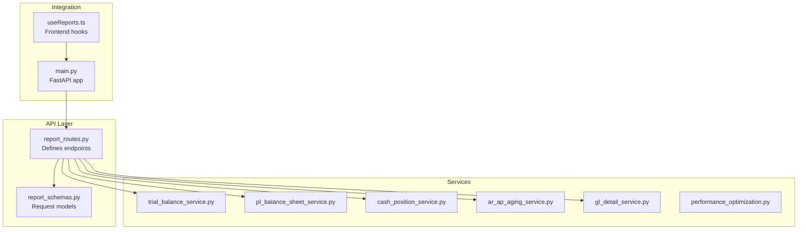
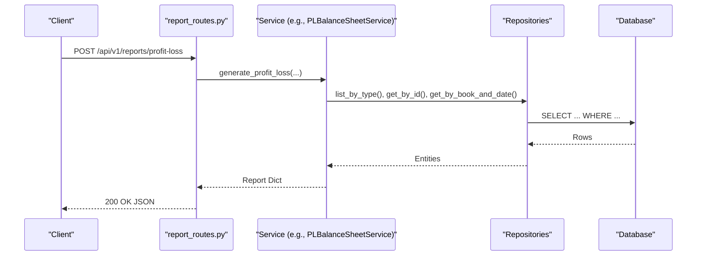
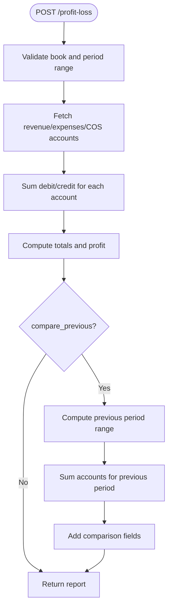
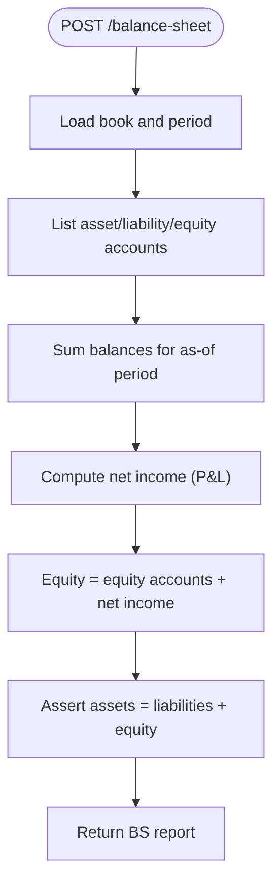
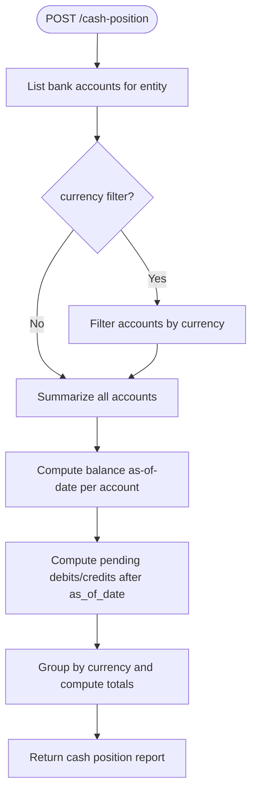
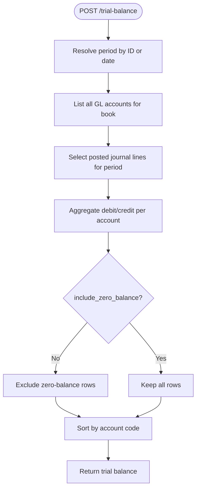
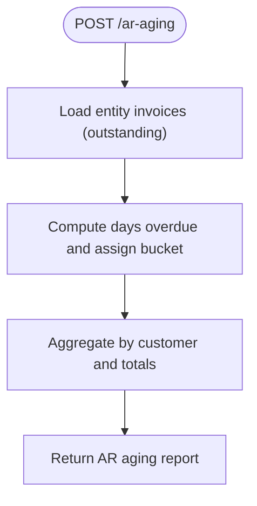
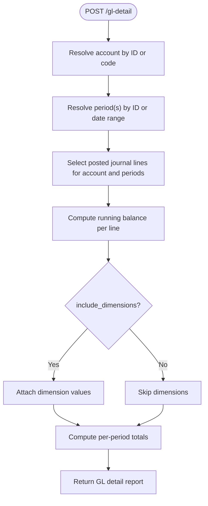
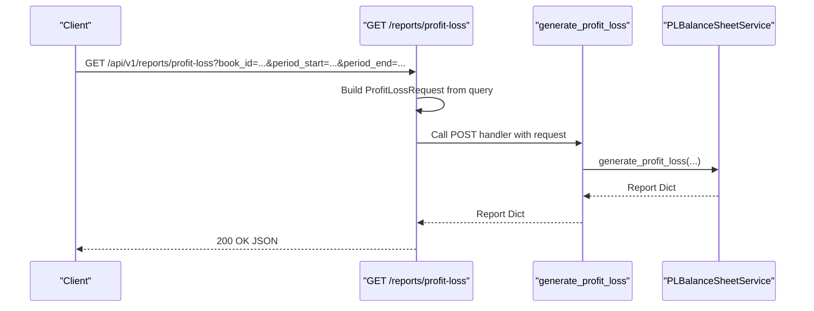
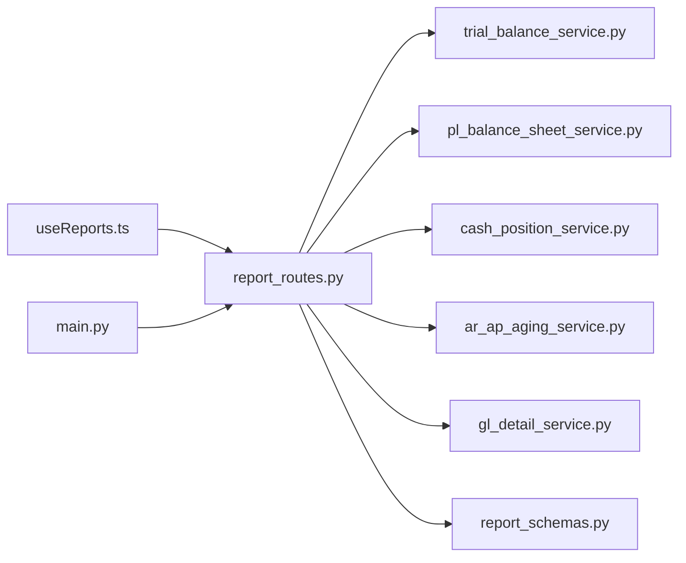

# Reporting API

<cite>
**Referenced Files in This Document**
- [report_routes.py](file://app/modules/reporting/api/routes/report_routes.py)
- [report_schemas.py](file://app/modules/reporting/schemas/report_schemas.py)
- [pl_balance_sheet_service.py](file://app/modules/reporting/services/pl_balance_sheet_service.py)
- [trial_balance_service.py](file://app/modules/reporting/services/trial_balance_service.py)
- [cash_position_service.py](file://app/modules/reporting/services/cash_position_service.py)
- [ar_ap_aging_service.py](file://app/modules/reporting/services/ar_ap_aging_service.py)
- [gl_detail_service.py](file://app/modules/reporting/services/gl_detail_service.py)
- [performance_optimization.py](file://app/modules/reporting/services/performance_optimization.py)
- [main.py](file://app/main.py)
- [useReports.ts](file://frontend/hooks/useReports.ts)
</cite>

## Table of Contents
1. [Introduction](#introduction)
2. [Project Structure](#project-structure)
3. [Core Components](#core-components)
4. [Architecture Overview](#architecture-overview)
5. [Detailed Component Analysis](#detailed-component-analysis)
6. [Dependency Analysis](#dependency-analysis)
7. [Performance Considerations](#performance-considerations)
8. [Troubleshooting Guide](#troubleshooting-guide)
9. [Conclusion](#conclusion)
10. [Appendices](#appendices)

## Introduction
This document provides comprehensive API documentation for the Reporting endpoints that generate financial statements and drill-down reports. It covers:
- Financial statements: Profit & Loss (P&L), Balance Sheet, and Cash Position
- Drill-down reporting: General Ledger detail, Accounts Receivable (AR) aging, and Trial Balance
- Request/response schemas, filters, and output structures
- Validation, performance optimization, and access control considerations
- Integration patterns with BI tools and automated reporting workflows

The Reporting module exposes REST endpoints under the /api/v1 prefix and is integrated into the main FastAPI application.

## Project Structure
The Reporting module is organized by concerns:
- API routes define endpoints and request/response binding
- Schemas define typed request models
- Services encapsulate report generation logic and database queries
- Frontend hooks demonstrate client-side consumption patterns

**Diagram sources**
- [report_routes.py](file://app/modules/reporting/api/routes/report_routes.py#L1-L199)
- [report_schemas.py](file://app/modules/reporting/schemas/report_schemas.py#L1-L57)
- [trial_balance_service.py](file://app/modules/reporting/services/trial_balance_service.py#L1-L130)
- [pl_balance_sheet_service.py](file://app/modules/reporting/services/pl_balance_sheet_service.py#L1-L293)
- [cash_position_service.py](file://app/modules/reporting/services/cash_position_service.py#L1-L149)
- [ar_ap_aging_service.py](file://app/modules/reporting/services/ar_ap_aging_service.py#L1-L120)
- [gl_detail_service.py](file://app/modules/reporting/services/gl_detail_service.py#L1-L157)
- [performance_optimization.py](file://app/modules/reporting/services/performance_optimization.py#L1-L172)
- [main.py](file://app/main.py#L1-L54)
- [useReports.ts](file://frontend/hooks/useReports.ts#L1-L72)

**Section sources**
- [report_routes.py](file://app/modules/reporting/api/routes/report_routes.py#L1-L199)
- [report_schemas.py](file://app/modules/reporting/schemas/report_schemas.py#L1-L57)
- [main.py](file://app/main.py#L1-L54)

## Core Components
- API Router: Declares endpoints for Trial Balance, P&L, Balance Sheet, Cash Position, AR Aging, and GL Detail. Supports both POST and GET variants for convenience.
- Request Schemas: Typed Pydantic models that define parameters for each report.
- Services: Implement report logic, query repositories, and assemble response dictionaries.

Key endpoints:
- POST /api/v1/reports/trial-balance
- POST /api/v1/reports/profit-loss
- POST /api/v1/reports/balance-sheet
- POST /api/v1/reports/cash-position
- POST /api/v1/reports/ar-aging
- POST /api/v1/reports/gl-detail
- GET /api/v1/reports/trial-balance
- GET /api/v1/reports/profit-loss
- GET /api/v1/reports/balance-sheet

Validation and error handling:
- Routes catch ValueError and generic exceptions, returning HTTP 400/500 with details.

**Section sources**
- [report_routes.py](file://app/modules/reporting/api/routes/report_routes.py#L22-L199)
- [report_schemas.py](file://app/modules/reporting/schemas/report_schemas.py#L8-L57)

## Architecture Overview
The Reporting API follows a layered architecture:
- HTTP layer: FastAPI routes
- Service layer: Business logic and data aggregation
- Repository layer: Database access abstractions (referenced by services)
- Response layer: Dynamic report dictionaries

**Diagram sources**
- [report_routes.py](file://app/modules/reporting/api/routes/report_routes.py#L46-L64)
- [pl_balance_sheet_service.py](file://app/modules/reporting/services/pl_balance_sheet_service.py#L24-L123)

**Section sources**
- [report_routes.py](file://app/modules/reporting/api/routes/report_routes.py#L1-L199)
- [pl_balance_sheet_service.py](file://app/modules/reporting/services/pl_balance_sheet_service.py#L1-L293)

## Detailed Component Analysis

### Endpoint Catalog and Request/Response Schemas
- Trial Balance
  - POST /api/v1/reports/trial-balance
  - GET /api/v1/reports/trial-balance
  - Request: book_id, period_id (optional), as_of_date (optional), include_zero_balance (bool)
  - Response: report metadata, totals, and account rows
- Profit & Loss (P&L)
  - POST /api/v1/reports/profit-loss
  - GET /api/v1/reports/profit-loss
  - Request: book_id, period_start, period_end, compare_previous (bool)
  - Response: revenue, COGS, expenses, totals, optional previous period comparison
- Balance Sheet
  - POST /api/v1/reports/balance-sheet
  - GET /api/v1/reports/balance-sheet
  - Request: book_id, as_of_date
  - Response: assets, liabilities, equity, totals, and balance assertion
- Cash Position
  - POST /api/v1/reports/cash-position
  - Request: entity_id, as_of_date, currency (optional)
  - Response: per-account balances, pending transactions, currency grouping, and totals
- AR Aging
  - POST /api/v1/reports/ar-aging
  - Request: entity_id, as_of_date, aging_buckets (optional list)
  - Response: customer-level aging, bucket totals, and invoice details
- GL Detail
  - POST /api/v1/reports/gl-detail
  - Request: book_id, account_id or account_code, period_start/period_end or period_id, include_dimensions (bool)
  - Response: account summary, period totals, and transaction detail rows with optional dimensions

Notes:
- Responses are returned as dictionaries from services; schemas define request parameters only.
- GET endpoints delegate to POST handlers by constructing request objects from query parameters.

**Section sources**
- [report_routes.py](file://app/modules/reporting/api/routes/report_routes.py#L25-L199)
- [report_schemas.py](file://app/modules/reporting/schemas/report_schemas.py#L8-L57)

### Financial Statements

#### Profit & Loss (P&L)
- Purpose: Income statement over a period with optional prior-period comparison.
- Inputs: book_id, period_start, period_end, compare_previous.
- Logic highlights:
  - Retrieve revenue, COGS, and expense accounts by type.
  - Sum posted journal lines within the period range.
  - Compute totals and optionally compute prior-period change metrics.

**Diagram sources**
- [report_routes.py](file://app/modules/reporting/api/routes/report_routes.py#L46-L64)
- [pl_balance_sheet_service.py](file://app/modules/reporting/services/pl_balance_sheet_service.py#L24-L123)

**Section sources**
- [report_routes.py](file://app/modules/reporting/api/routes/report_routes.py#L46-L64)
- [pl_balance_sheet_service.py](file://app/modules/reporting/services/pl_balance_sheet_service.py#L24-L123)

#### Balance Sheet
- Purpose: Statement of financial position as of a date.
- Inputs: book_id, as_of_date.
- Logic highlights:
  - Retrieve asset/liability/equity accounts by type.
  - Sum balances up to the as-of period.
  - Compute retained earnings from current-period P&L and assert equality of assets vs. liabilities + equity.

**Diagram sources**
- [report_routes.py](file://app/modules/reporting/api/routes/report_routes.py#L67-L83)
- [pl_balance_sheet_service.py](file://app/modules/reporting/services/pl_balance_sheet_service.py#L125-L202)

**Section sources**
- [report_routes.py](file://app/modules/reporting/api/routes/report_routes.py#L67-L83)
- [pl_balance_sheet_service.py](file://app/modules/reporting/services/pl_balance_sheet_service.py#L125-L202)

#### Cash Position
- Purpose: Entity-level cash visibility by bank account and currency.
- Inputs: entity_id, as_of_date, currency (optional).
- Logic highlights:
  - Enumerate bank accounts for the entity.
  - Compute ending balance as-of-date and pending debits/credits after as_of_date.
  - Group by currency and compute projected balances.

**Diagram sources**
- [report_routes.py](file://app/modules/reporting/api/routes/report_routes.py#L86-L103)
- [cash_position_service.py](file://app/modules/reporting/services/cash_position_service.py#L23-L101)

**Section sources**
- [report_routes.py](file://app/modules/reporting/api/routes/report_routes.py#L86-L103)
- [cash_position_service.py](file://app/modules/reporting/services/cash_position_service.py#L23-L101)

### Drill-Down Reports

#### Trial Balance
- Purpose: Posted account balances for a period with optional zero balances.
- Inputs: book_id, period_id or as_of_date, include_zero_balance.
- Logic highlights:
  - Resolve period from period_id or as_of_date.
  - Aggregate posted journal lines by account and compute debit/credit/net.

**Diagram sources**
- [report_routes.py](file://app/modules/reporting/api/routes/report_routes.py#L25-L43)
- [trial_balance_service.py](file://app/modules/reporting/services/trial_balance_service.py#L26-L129)

**Section sources**
- [report_routes.py](file://app/modules/reporting/api/routes/report_routes.py#L25-L43)
- [trial_balance_service.py](file://app/modules/reporting/services/trial_balance_service.py#L26-L129)

#### AR Aging
- Purpose: Customer-level receivables aging with configurable buckets.
- Inputs: entity_id, as_of_date, aging_buckets (optional).
- Logic highlights:
  - Collect outstanding invoices for the entity.
  - Compute days overdue per invoice and assign to buckets.
  - Aggregate totals per customer and overall.

**Diagram sources**
- [report_routes.py](file://app/modules/reporting/api/routes/report_routes.py#L106-L123)
- [ar_ap_aging_service.py](file://app/modules/reporting/services/ar_ap_aging_service.py#L22-L119)

**Section sources**
- [report_routes.py](file://app/modules/reporting/api/routes/report_routes.py#L106-L123)
- [ar_ap_aging_service.py](file://app/modules/reporting/services/ar_ap_aging_service.py#L22-L119)

#### GL Detail
- Purpose: Transaction-level detail for a specific GL account within a period range.
- Inputs: book_id, account_id or account_code, period_start/period_end or period_id, include_dimensions.
- Logic highlights:
  - Resolve account by ID or code.
  - Resolve period(s) by ID or date range.
  - Fetch posted journal lines, compute running balance, and optionally include dimension values.

**Diagram sources**
- [report_routes.py](file://app/modules/reporting/api/routes/report_routes.py#L126-L147)
- [gl_detail_service.py](file://app/modules/reporting/services/gl_detail_service.py#L23-L156)

**Section sources**
- [report_routes.py](file://app/modules/reporting/api/routes/report_routes.py#L126-L147)
- [gl_detail_service.py](file://app/modules/reporting/services/gl_detail_service.py#L23-L156)

### API Workflows

#### GET vs POST Endpoints
- GET endpoints are convenience wrappers that construct request objects from query parameters and delegate to the corresponding POST handlers.

**Diagram sources**
- [report_routes.py](file://app/modules/reporting/api/routes/report_routes.py#L169-L184)

**Section sources**
- [report_routes.py](file://app/modules/reporting/api/routes/report_routes.py#L150-L199)

## Dependency Analysis
- Route-to-Service coupling:
  - Each route constructs a dedicated service instance and delegates report generation.
- Service-to-Repository coupling:
  - Services depend on repositories for books, periods, GL accounts, journal entries, customers, and bank accounts.
- Frontend integration:
  - React Query hooks call backend endpoints and enable queries when required parameters are present.

**Diagram sources**
- [report_routes.py](file://app/modules/reporting/api/routes/report_routes.py#L1-L22)
- [report_schemas.py](file://app/modules/reporting/schemas/report_schemas.py#L1-L57)
- [trial_balance_service.py](file://app/modules/reporting/services/trial_balance_service.py#L1-L24)
- [pl_balance_sheet_service.py](file://app/modules/reporting/services/pl_balance_sheet_service.py#L1-L23)
- [cash_position_service.py](file://app/modules/reporting/services/cash_position_service.py#L1-L22)
- [ar_ap_aging_service.py](file://app/modules/reporting/services/ar_ap_aging_service.py#L1-L21)
- [gl_detail_service.py](file://app/modules/reporting/services/gl_detail_service.py#L1-L22)
- [useReports.ts](file://frontend/hooks/useReports.ts#L1-L72)
- [main.py](file://app/main.py#L29-L30)

**Section sources**
- [report_routes.py](file://app/modules/reporting/api/routes/report_routes.py#L1-L22)
- [useReports.ts](file://frontend/hooks/useReports.ts#L1-L72)
- [main.py](file://app/main.py#L29-L30)

## Performance Considerations
- Database indexing review:
  - The performance optimization service inspects indexes and suggests improvements for foreign keys and commonly filtered columns.
- Slow query analysis:
  - Requires PostgreSQL pg_stat_statements; returns top slow queries for tuning.
- Table statistics:
  - Provides row counts and maintenance timestamps to guide vacuum/analyze cycles.

Recommendations derived from the service:
- Ensure foreign key columns used in joins are indexed.
- Add indexes on frequently filtered columns (e.g., status) and date range filters (e.g., created_at).
- Monitor slow queries and tune report queries accordingly.
- Regular maintenance (vacuum/autoanalyze) improves long-term performance.

**Section sources**
- [performance_optimization.py](file://app/modules/reporting/services/performance_optimization.py#L15-L171)

## Troubleshooting Guide
Common issues and resolutions:
- Validation errors (HTTP 400):
  - Missing or invalid parameters (e.g., required UUIDs or dates).
  - Invalid combinations (e.g., neither period_id nor as_of_date for Trial Balance; neither account_id nor account_code for GL Detail).
- Resource not found (HTTP 400):
  - Nonexistent book, period, or account.
- Internal errors (HTTP 500):
  - Unexpected failures during report generation; check server logs.

Operational tips:
- Verify endpoint prefixes (/api/v1) and trailing slashes.
- Confirm database connectivity and that required extensions (for performance diagnostics) are enabled.

**Section sources**
- [report_routes.py](file://app/modules/reporting/api/routes/report_routes.py#L40-L43)
- [trial_balance_service.py](file://app/modules/reporting/services/trial_balance_service.py#L41-L55)
- [gl_detail_service.py](file://app/modules/reporting/services/gl_detail_service.py#L44-L53)

## Conclusion
The Reporting API provides a comprehensive set of financial reporting endpoints with robust request validation and flexible drill-down capabilities. Services encapsulate report logic and leverage repositories for data access. The module integrates cleanly with the FastAPI application and supports both programmatic and GET-based invocation. For production deployments, apply suggested indexing strategies, monitor slow queries, and maintain database statistics to ensure reliable performance.

## Appendices

### Endpoint Reference

- POST /api/v1/reports/trial-balance
  - Request: book_id, period_id (optional), as_of_date (optional), include_zero_balance (bool)
  - Response: report metadata, totals, and account rows
- POST /api/v1/reports/profit-loss
  - Request: book_id, period_start, period_end, compare_previous (bool)
  - Response: revenue, COGS, expenses, totals, optional previous period comparison
- POST /api/v1/reports/balance-sheet
  - Request: book_id, as_of_date
  - Response: assets, liabilities, equity, totals, and balance assertion
- POST /api/v1/reports/cash-position
  - Request: entity_id, as_of_date, currency (optional)
  - Response: per-account balances, pending transactions, currency grouping, and totals
- POST /api/v1/reports/ar-aging
  - Request: entity_id, as_of_date, aging_buckets (optional)
  - Response: customer-level aging, bucket totals, and invoice details
- POST /api/v1/reports/gl-detail
  - Request: book_id, account_id or account_code, period_start/period_end or period_id, include_dimensions (bool)
  - Response: account summary, period totals, and transaction detail rows

**Section sources**
- [report_routes.py](file://app/modules/reporting/api/routes/report_routes.py#L25-L199)
- [report_schemas.py](file://app/modules/reporting/schemas/report_schemas.py#L8-L57)

### Access Controls and Security Notes
- Authentication and authorization are handled by the application’s middleware stack and are not implemented within the reporting routes themselves.
- Ensure appropriate RBAC policies are enforced at the application level for sensitive financial data.

**Section sources**
- [main.py](file://app/main.py#L17-L27)

### Integration with BI Tools and Automated Workflows
- The API returns JSON responses suitable for ingestion by BI tools and ETL pipelines.
- Use GET endpoints for simple parameterization via query strings.
- For scheduled runs, integrate with external schedulers to call endpoints and distribute outputs via email or file systems.

**Section sources**
- [report_routes.py](file://app/modules/reporting/api/routes/report_routes.py#L150-L199)
- [useReports.ts](file://frontend/hooks/useReports.ts#L1-L72)