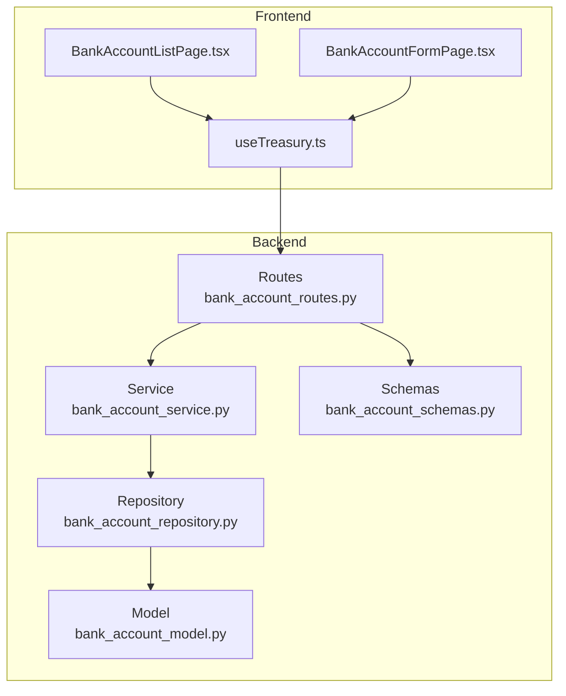
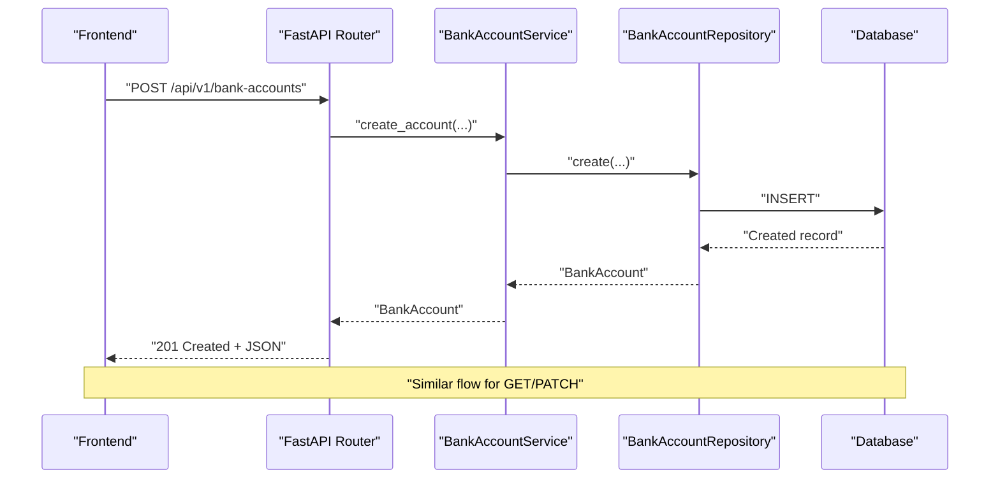
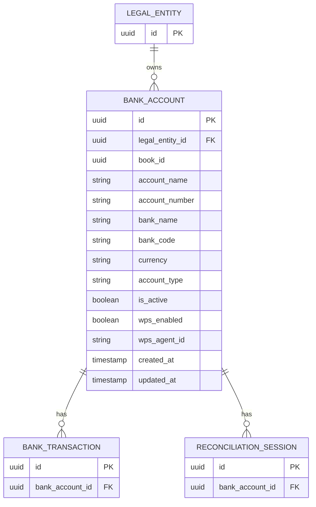
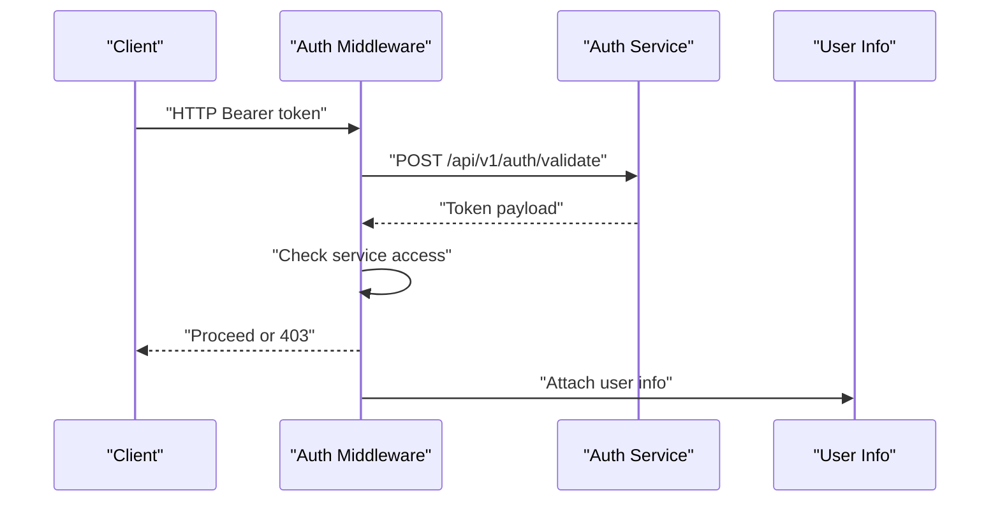
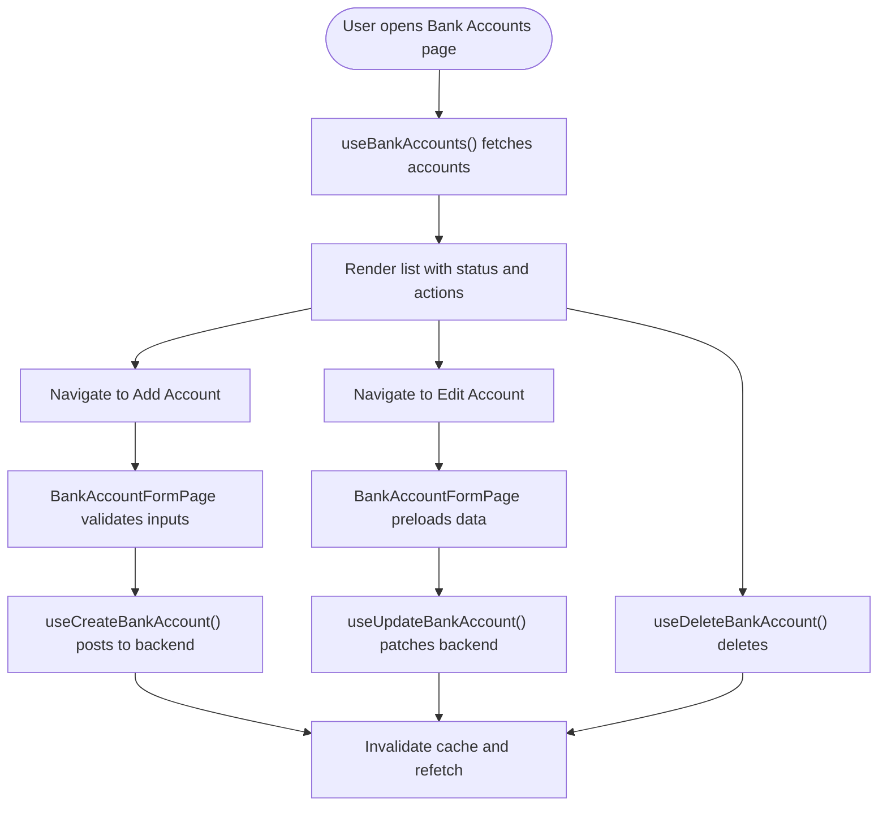
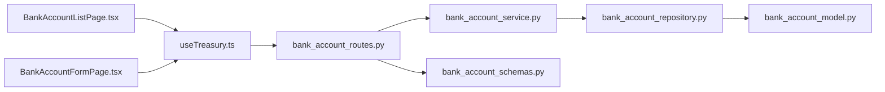

# Bank Accounts API

<cite>
**Referenced Files in This Document**
- [bank_account_routes.py](file://app/modules/treasury/api/routes/bank_account_routes.py)
- [bank_account_schemas.py](file://app/modules/treasury/schemas/bank_account_schemas.py)
- [bank_account_service.py](file://app/modules/treasury/services/bank_account_service.py)
- [bank_account_model.py](file://app/modules/treasury/models/bank_account_model.py)
- [bank_account_repository.py](file://app/modules/treasury/repositories/bank_account_repository.py)
- [middleware.py](file://app/auth/middleware.py)
- [permissions.py](file://app/auth/permissions.py)
- [roles.py](file://app/auth/roles.py)
- [main.py](file://app/main.py)
- [BankAccountListPage.tsx](file://frontend/components/pages/treasury/BankAccountListPage.tsx)
- [BankAccountFormPage.tsx](file://frontend/components/pages/treasury/BankAccountFormPage.tsx)
- [useTreasury.ts](file://frontend/hooks/useTreasury.ts)
</cite>

## Table of Contents
1. [Introduction](#introduction)
2. [Project Structure](#project-structure)
3. [Core Components](#core-components)
4. [Architecture Overview](#architecture-overview)
5. [Detailed Component Analysis](#detailed-component-analysis)
6. [Dependency Analysis](#dependency-analysis)
7. [Performance Considerations](#performance-considerations)
8. [Troubleshooting Guide](#troubleshooting-guide)
9. [Conclusion](#conclusion)
10. [Appendices](#appendices)

## Introduction
This document provides comprehensive API documentation for Bank Account Management endpoints. It covers the creation, retrieval, listing, updates, and deactivation of bank accounts, including multi-entity associations, currency handling, account types, and status tracking. It also documents request/response schemas, authentication and authorization requirements, validation rules, and error handling patterns for the following endpoints:
- GET /api/v1/bank-accounts
- POST /api/v1/bank-accounts
- GET /api/v1/bank-accounts/{account_id}
- PATCH /api/v1/bank-accounts/{account_id}

Note: The repository does not define a DELETE endpoint for bank accounts. Deactivation is handled via PATCH updates to toggle the active status.

## Project Structure
The Bank Accounts feature is implemented in the Treasury module with clear separation of concerns:
- API routes define the HTTP endpoints and request/response models
- Services encapsulate business logic and orchestrate repository operations
- Repositories handle database queries
- Models define the persistent schema and relationships
- Frontend components integrate with the backend via React Query hooks

**Diagram sources**
- [bank_account_routes.py](file://app/modules/treasury/api/routes/bank_account_routes.py#L1-L88)
- [bank_account_service.py](file://app/modules/treasury/services/bank_account_service.py#L1-L97)
- [bank_account_repository.py](file://app/modules/treasury/repositories/bank_account_repository.py#L1-L40)
- [bank_account_model.py](file://app/modules/treasury/models/bank_account_model.py#L1-L36)
- [bank_account_schemas.py](file://app/modules/treasury/schemas/bank_account_schemas.py#L1-L46)
- [BankAccountListPage.tsx](file://frontend/components/pages/treasury/BankAccountListPage.tsx#L1-L151)
- [BankAccountFormPage.tsx](file://frontend/components/pages/treasury/BankAccountFormPage.tsx#L1-L247)
- [useTreasury.ts](file://frontend/hooks/useTreasury.ts#L1-L354)

**Section sources**
- [bank_account_routes.py](file://app/modules/treasury/api/routes/bank_account_routes.py#L1-L88)
- [bank_account_service.py](file://app/modules/treasury/services/bank_account_service.py#L1-L97)
- [bank_account_repository.py](file://app/modules/treasury/repositories/bank_account_repository.py#L1-L40)
- [bank_account_model.py](file://app/modules/treasury/models/bank_account_model.py#L1-L36)
- [bank_account_schemas.py](file://app/modules/treasury/schemas/bank_account_schemas.py#L1-L46)
- [BankAccountListPage.tsx](file://frontend/components/pages/treasury/BankAccountListPage.tsx#L1-L151)
- [BankAccountFormPage.tsx](file://frontend/components/pages/treasury/BankAccountFormPage.tsx#L1-L247)
- [useTreasury.ts](file://frontend/hooks/useTreasury.ts#L1-L354)

## Core Components
- API Router: Defines endpoints under /bank-accounts with request/response models and error handling
- Service Layer: Implements business rules such as entity existence checks and account updates
- Repository Layer: Provides database queries for listing and filtering accounts
- Data Model: Represents the bank account schema with relationships and constraints
- Request/Response Schemas: Define validation rules and serialization for create/update/list operations
- Authentication & Authorization: Enforces JWT-based access and role-based permissions

**Section sources**
- [bank_account_routes.py](file://app/modules/treasury/api/routes/bank_account_routes.py#L1-L88)
- [bank_account_service.py](file://app/modules/treasury/services/bank_account_service.py#L1-L97)
- [bank_account_repository.py](file://app/modules/treasury/repositories/bank_account_repository.py#L1-L40)
- [bank_account_model.py](file://app/modules/treasury/models/bank_account_model.py#L1-L36)
- [bank_account_schemas.py](file://app/modules/treasury/schemas/bank_account_schemas.py#L1-L46)

## Architecture Overview
The Bank Accounts API follows a layered architecture:
- HTTP Layer: FastAPI routes accept requests and return responses
- Service Layer: Orchestrates repository operations and applies business rules
- Persistence Layer: SQLAlchemy ORM models and repositories
- Frontend Integration: React Query hooks manage caching, optimistic updates, and mutations

**Diagram sources**
- [bank_account_routes.py](file://app/modules/treasury/api/routes/bank_account_routes.py#L18-L53)
- [bank_account_service.py](file://app/modules/treasury/services/bank_account_service.py#L19-L54)
- [bank_account_repository.py](file://app/modules/treasury/repositories/bank_account_repository.py#L10-L24)

## Detailed Component Analysis

### Endpoint: GET /api/v1/bank-accounts
- Purpose: List bank accounts for a given legal entity with optional filters
- Path Parameters: None
- Query Parameters:
  - entity_id (required): UUID of the legal entity
  - active_only (optional): Boolean flag to filter active accounts only (default: true)
- Response: Array of BankAccountResponse objects
- Authentication: Requires a valid JWT bearer token
- Authorization: Requires permission level sufficient for treasury read operations

Example request:
- GET /api/v1/bank-accounts?entity_id=123e4567-e89b-12d3-a456-426614174000&active_only=true

Example response (excerpt):
- 200 OK with array of account objects containing id, legal_entity_id, account_name, bank_name, account_number, currency, account_type, is_active, wps_enabled, wps_agent_id, created_at, updated_at

Validation rules:
- entity_id must be a valid UUID
- active_only must be a boolean

Error handling:
- 404 Not Found if the entity does not exist (service-level check)
- 400 Bad Request for validation errors
- 401 Unauthorized for invalid or missing token
- 403 Forbidden for insufficient permissions

**Section sources**
- [bank_account_routes.py](file://app/modules/treasury/api/routes/bank_account_routes.py#L44-L53)
- [bank_account_service.py](file://app/modules/treasury/services/bank_account_service.py#L60-L66)
- [bank_account_repository.py](file://app/modules/treasury/repositories/bank_account_repository.py#L16-L24)
- [bank_account_schemas.py](file://app/modules/treasury/schemas/bank_account_schemas.py#L28-L46)

### Endpoint: POST /api/v1/bank-accounts
- Purpose: Create a new bank account
- Path Parameters: None
- Request Body: BankAccountCreate
- Response: BankAccountResponse
- Authentication: Requires a valid JWT bearer token
- Authorization: Requires permission level sufficient for treasury write operations

Request body fields (BankAccountCreate):
- legal_entity_id: UUID (required)
- account_name: String (1-255 chars, required)
- bank_name: String (1-255 chars, required)
- currency: String (exactly 3 chars, required)
- account_number: String (optional)
- bank_code: String (optional)
- account_type: String (optional)
- wps_enabled: Boolean (default: false)
- wps_agent_id: String (optional)

Validation rules:
- account_name and bank_name length constraints
- currency must be a 3-character ISO code
- Optional fields may be null

Example request:
- POST /api/v1/bank-accounts
- Body: { "legal_entity_id": "...", "account_name": "Main Account", "bank_name": "Chase Bank", "currency": "USD", "account_number": "123456789", "bank_code": "CH123", "account_type": "checking", "wps_enabled": false }

Example response:
- 201 Created with BankAccountResponse

Error handling:
- 404 Not Found if the legal entity does not exist
- 400 Bad Request for validation errors
- 401 Unauthorized for invalid or missing token
- 403 Forbidden for insufficient permissions

**Section sources**
- [bank_account_routes.py](file://app/modules/treasury/api/routes/bank_account_routes.py#L18-L41)
- [bank_account_schemas.py](file://app/modules/treasury/schemas/bank_account_schemas.py#L7-L17)
- [bank_account_service.py](file://app/modules/treasury/services/bank_account_service.py#L19-L54)

### Endpoint: GET /api/v1/bank-accounts/{account_id}
- Purpose: Retrieve a single bank account by ID
- Path Parameters:
  - account_id (required): UUID of the bank account
- Response: BankAccountResponse
- Authentication: Requires a valid JWT bearer token
- Authorization: Requires permission level sufficient for treasury read operations

Example request:
- GET /api/v1/bank-accounts/123e4567-e89b-12d3-a456-426614174000

Example response:
- 200 OK with BankAccountResponse

Error handling:
- 404 Not Found if the account does not exist
- 400 Bad Request for validation errors
- 401 Unauthorized for invalid or missing token
- 403 Forbidden for insufficient permissions

**Section sources**
- [bank_account_routes.py](file://app/modules/treasury/api/routes/bank_account_routes.py#L56-L66)
- [bank_account_service.py](file://app/modules/treasury/services/bank_account_service.py#L56-L58)

### Endpoint: PATCH /api/v1/bank-accounts/{account_id}
- Purpose: Update an existing bank account
- Path Parameters:
  - account_id (required): UUID of the bank account
- Request Body: BankAccountUpdate
- Response: BankAccountResponse
- Authentication: Requires a valid JWT bearer token
- Authorization: Requires permission level sufficient for treasury write operations

Request body fields (BankAccountUpdate):
- account_name: String (optional, 1-255 chars if provided)
- is_active: Boolean (optional)
- wps_enabled: Boolean (optional)
- wps_agent_id: String (optional)

Validation rules:
- account_name length constraint if provided
- is_active, wps_enabled must be booleans if provided

Example request:
- PATCH /api/v1/bank-accounts/123e4567-e89b-12d3-a456-426614174000
- Body: { "is_active": false }

Example response:
- 200 OK with updated BankAccountResponse

Error handling:
- 404 Not Found if the account does not exist
- 400 Bad Request for validation errors
- 401 Unauthorized for invalid or missing token
- 403 Forbidden for insufficient permissions

**Section sources**
- [bank_account_routes.py](file://app/modules/treasury/api/routes/bank_account_routes.py#L69-L88)
- [bank_account_schemas.py](file://app/modules/treasury/schemas/bank_account_schemas.py#L20-L25)
- [bank_account_service.py](file://app/modules/treasury/services/bank_account_service.py#L68-L96)

### Data Model and Relationships
The BankAccount model defines the persisted schema and relationships:
- Identity: id (UUID), legal_entity_id (UUID, foreign key), book_id (UUID, optional)
- Attributes: account_name, account_number, bank_name, bank_code, currency, account_type
- Flags: is_active, wps_enabled, wps_agent_id
- Relationships: entity (LegalEntity), transactions (BankTransaction), reconciliations (ReconciliationSession)

**Diagram sources**
- [bank_account_model.py](file://app/modules/treasury/models/bank_account_model.py#L9-L32)

**Section sources**
- [bank_account_model.py](file://app/modules/treasury/models/bank_account_model.py#L1-L36)

### Request/Response Schemas
- BankAccountCreate: Used for POST /api/v1/bank-accounts
- BankAccountUpdate: Used for PATCH /api/v1/bank-accounts/{account_id}
- BankAccountResponse: Shared response model for list, detail, and update operations

Validation highlights:
- account_name and bank_name: min_length=1, max_length=255
- currency: min_length=3, max_length=3
- account_name in update: optional with min/max length constraints
- is_active: optional boolean
- wps_enabled: optional boolean
- wps_agent_id: optional string

**Section sources**
- [bank_account_schemas.py](file://app/modules/treasury/schemas/bank_account_schemas.py#L7-L46)

### Authentication and Authorization
- Authentication: JWT bearer token validated against a central auth service or locally if configured
- Authorization: Users must have access to the financial_management service and appropriate treasury permissions
- Roles and Permissions: Treasury roles include FINANCE_ADMIN, ACCOUNTANT, TREASURY_CLERK, TREASURY_APPROVER, VIEWER, SERVICE. Treasury permissions include read, write, reconcile, approve adjustments, etc.

**Diagram sources**
- [middleware.py](file://app/auth/middleware.py#L17-L86)
- [permissions.py](file://app/auth/permissions.py#L84-L102)
- [roles.py](file://app/auth/roles.py#L98-L118)

**Section sources**
- [middleware.py](file://app/auth/middleware.py#L1-L140)
- [permissions.py](file://app/auth/permissions.py#L1-L127)
- [roles.py](file://app/auth/roles.py#L1-L119)
- [main.py](file://app/main.py#L1-L54)

### Frontend Integration
- Listing: BankAccountListPage fetches accounts and displays them with status indicators and actions
- Creation/Edit: BankAccountFormPage validates inputs and submits to backend via React Query hooks
- Hooks: useTreasury.ts provides useBankAccounts, useBankAccount, useCreateBankAccount, useUpdateBankAccount, and useDeleteBankAccount

**Diagram sources**
- [BankAccountListPage.tsx](file://frontend/components/pages/treasury/BankAccountListPage.tsx#L9-L150)
- [BankAccountFormPage.tsx](file://frontend/components/pages/treasury/BankAccountFormPage.tsx#L23-L82)
- [useTreasury.ts](file://frontend/hooks/useTreasury.ts#L18-L134)

**Section sources**
- [BankAccountListPage.tsx](file://frontend/components/pages/treasury/BankAccountListPage.tsx#L1-L151)
- [BankAccountFormPage.tsx](file://frontend/components/pages/treasury/BankAccountFormPage.tsx#L1-L247)
- [useTreasury.ts](file://frontend/hooks/useTreasury.ts#L1-L354)

## Dependency Analysis
The following diagram shows the primary dependencies among components involved in bank account operations:

**Diagram sources**
- [bank_account_routes.py](file://app/modules/treasury/api/routes/bank_account_routes.py#L1-L88)
- [bank_account_service.py](file://app/modules/treasury/services/bank_account_service.py#L1-L97)
- [bank_account_repository.py](file://app/modules/treasury/repositories/bank_account_repository.py#L1-L40)
- [bank_account_model.py](file://app/modules/treasury/models/bank_account_model.py#L1-L36)
- [bank_account_schemas.py](file://app/modules/treasury/schemas/bank_account_schemas.py#L1-L46)
- [useTreasury.ts](file://frontend/hooks/useTreasury.ts#L1-L354)
- [BankAccountListPage.tsx](file://frontend/components/pages/treasury/BankAccountListPage.tsx#L1-L151)
- [BankAccountFormPage.tsx](file://frontend/components/pages/treasury/BankAccountFormPage.tsx#L1-L247)

**Section sources**
- [bank_account_routes.py](file://app/modules/treasury/api/routes/bank_account_routes.py#L1-L88)
- [bank_account_service.py](file://app/modules/treasury/services/bank_account_service.py#L1-L97)
- [bank_account_repository.py](file://app/modules/treasury/repositories/bank_account_repository.py#L1-L40)
- [bank_account_model.py](file://app/modules/treasury/models/bank_account_model.py#L1-L36)
- [bank_account_schemas.py](file://app/modules/treasury/schemas/bank_account_schemas.py#L1-L46)
- [useTreasury.ts](file://frontend/hooks/useTreasury.ts#L1-L354)
- [BankAccountListPage.tsx](file://frontend/components/pages/treasury/BankAccountListPage.tsx#L1-L151)
- [BankAccountFormPage.tsx](file://frontend/components/pages/treasury/BankAccountFormPage.tsx#L1-L247)

## Performance Considerations
- Indexing: The BankAccount model includes indexes on legal_entity_id and book_id to optimize listing and filtering
- Query Efficiency: Repository methods apply filters and ordering at the SQL level
- Asynchronous Operations: Service and repository methods use async/await to avoid blocking
- Caching: Frontend uses React Query for caching and optimistic updates, reducing redundant network calls

**Section sources**
- [bank_account_model.py](file://app/modules/treasury/models/bank_account_model.py#L13-L14)
- [bank_account_repository.py](file://app/modules/treasury/repositories/bank_account_repository.py#L16-L24)
- [useTreasury.ts](file://frontend/hooks/useTreasury.ts#L34-L134)

## Troubleshooting Guide
Common issues and resolutions:
- Authentication failures:
  - 401 Unauthorized: Verify the JWT token is present and valid; check token validation against the auth service
  - 403 Forbidden: Ensure the user has access to the financial_management service and required treasury permissions
- Validation errors:
  - 400 Bad Request: Confirm request body adheres to schema constraints (length limits, required fields, boolean flags)
- Resource not found:
  - 404 Not Found: Verify entity_id and account_id are valid UUIDs and correspond to existing records
- Operational errors:
  - 503 Service Unavailable: Auth service temporarily unreachable; retry after checking service health

**Section sources**
- [middleware.py](file://app/auth/middleware.py#L17-L86)
- [bank_account_routes.py](file://app/modules/treasury/api/routes/bank_account_routes.py#L38-L41)
- [bank_account_service.py](file://app/modules/treasury/services/bank_account_service.py#L32-L35)

## Conclusion
The Bank Accounts API provides a robust, secure, and scalable interface for managing bank accounts across legal entities. It enforces strong validation, integrates with a centralized auth system, and supports multi-currency operations. The frontend integration leverages React Query for efficient data fetching and optimistic UI updates. While the current implementation focuses on listing, creation, retrieval, and updates, future enhancements could include a dedicated deactivation endpoint and expanded hierarchy support.

## Appendices

### Endpoint Reference Summary
- GET /api/v1/bank-accounts
  - Query: entity_id (UUID), active_only (Boolean)
  - Response: Array of BankAccountResponse
- POST /api/v1/bank-accounts
  - Body: BankAccountCreate
  - Response: BankAccountResponse (201)
- GET /api/v1/bank-accounts/{account_id}
  - Path: account_id (UUID)
  - Response: BankAccountResponse
- PATCH /api/v1/bank-accounts/{account_id}
  - Path: account_id (UUID)
  - Body: BankAccountUpdate
  - Response: BankAccountResponse

### Example Scenarios
- Creating a multi-currency account:
  - Create two accounts under the same legal entity with different currencies (e.g., USD and EUR)
- Setting up an account hierarchy:
  - Use parent-child relationships at the legal entity or ledger level (not directly exposed by these endpoints)
- Managing account status:
  - Toggle is_active to deactivate an account without deleting it

[No sources needed since this section provides general guidance]