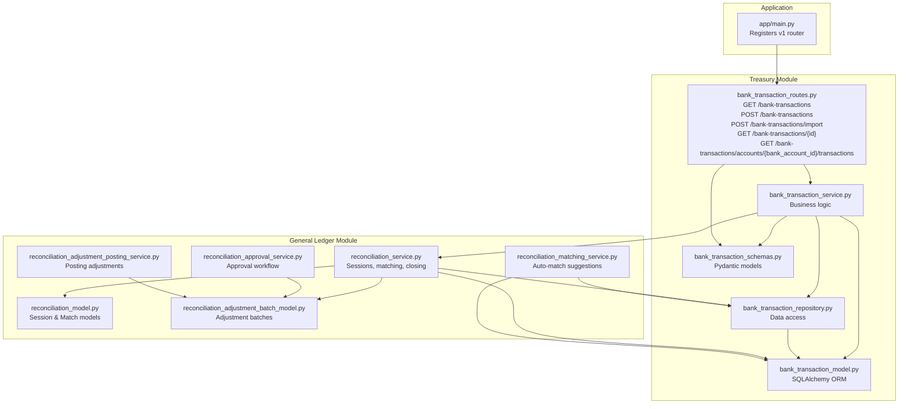
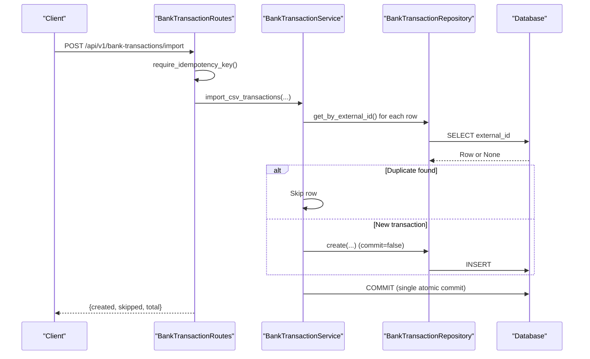
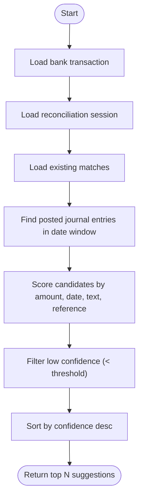
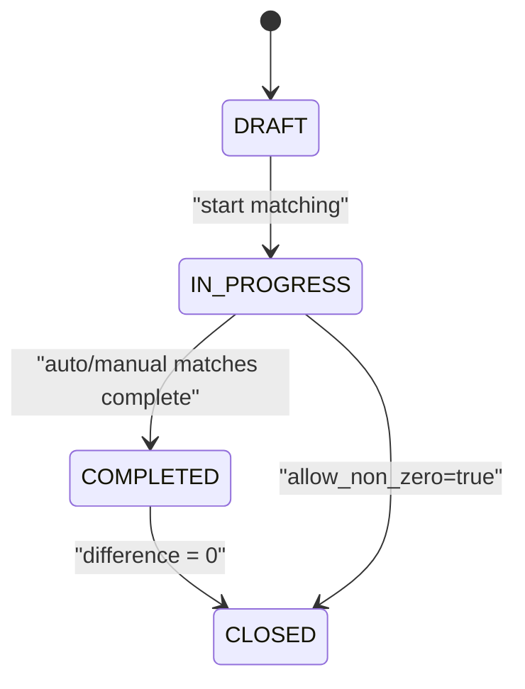
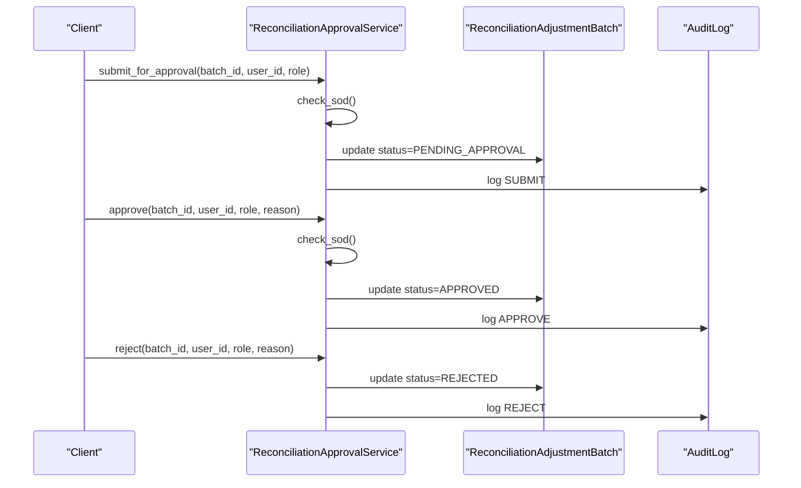

# Bank Transactions API

<cite>
**Referenced Files in This Document**
- [app/main.py](file://app/main.py)
- [app/modules/treasury/api/routes/bank_transaction_routes.py](file://app/modules/treasury/api/routes/bank_transaction_routes.py)
- [app/modules/treasury/schemas/bank_transaction_schemas.py](file://app/modules/treasury/schemas/bank_transaction_schemas.py)
- [app/modules/treasury/models/bank_transaction_model.py](file://app/modules/treasury/models/bank_transaction_model.py)
- [app/modules/treasury/services/bank_transaction_service.py](file://app/modules/treasury/services/bank_transaction_service.py)
- [app/modules/treasury/repositories/bank_transaction_repository.py](file://app/modules/treasury/repositories/bank_transaction_repository.py)
- [app/modules/treasury/api/routes/bank_account_routes.py](file://app/modules/treasury/api/routes/bank_account_routes.py)
- [app/modules/general_ledger/services/reconciliation_service.py](file://app/modules/general_ledger/services/reconciliation_service.py)
- [app/modules/general_ledger/models/reconciliation_model.py](file://app/modules/general_ledger/models/reconciliation_model.py)
- [app/modules/general_ledger/services/reconciliation_matching_service.py](file://app/modules/general_ledger/services/reconciliation_matching_service.py)
- [app/modules/general_ledger/models/reconciliation_adjustment_batch_model.py](file://app/modules/general_ledger/models/reconciliation_adjustment_batch_model.py)
- [app/modules/general_ledger/services/reconciliation_approval_service.py](file://app/modules/general_ledger/services/reconciliation_approval_service.py)
- [app/modules/general_ledger/services/reconciliation_adjustment_posting_service.py](file://app/modules/general_ledger/services/reconciliation_adjustment_posting_service.py)
- [app/core/database.py](file://app/core/database.py)
</cite>

## Table of Contents
1. [Introduction](#introduction)
2. [Project Structure](#project-structure)
3. [Core Components](#core-components)
4. [Architecture Overview](#architecture-overview)
5. [Detailed Component Analysis](#detailed-component-analysis)
6. [Dependency Analysis](#dependency-analysis)
7. [Performance Considerations](#performance-considerations)
8. [Troubleshooting Guide](#troubleshooting-guide)
9. [Conclusion](#conclusion)
10. [Appendices](#appendices)

## Introduction
This document provides comprehensive API documentation for Bank Transaction processing endpoints. It covers transaction imports, categorization, reconciliation operations, transaction matching, exception handling, and manual adjustments. It also details transaction status tracking, approval workflows, and audit trails. Examples include automated imports, manual entries, and complex reconciliations. Request/response schemas, categorization rules, and error handling for import failures are documented.

## Project Structure
The Bank Transactions API is implemented under the Treasury module and integrates with General Ledger services for reconciliation and approval workflows. The application entry point registers the API routes under the v1 prefix.



**Diagram sources**
- [app/main.py](file://app/main.py#L29-L30)
- [app/modules/treasury/api/routes/bank_transaction_routes.py](file://app/modules/treasury/api/routes/bank_transaction_routes.py#L21-L184)
- [app/modules/treasury/schemas/bank_transaction_schemas.py](file://app/modules/treasury/schemas/bank_transaction_schemas.py#L1-L62)
- [app/modules/treasury/models/bank_transaction_model.py](file://app/modules/treasury/models/bank_transaction_model.py#L21-L52)
- [app/modules/treasury/services/bank_transaction_service.py](file://app/modules/treasury/services/bank_transaction_service.py#L13-L171)
- [app/modules/treasury/repositories/bank_transaction_repository.py](file://app/modules/treasury/repositories/bank_transaction_repository.py#L11-L97)
- [app/modules/general_ledger/services/reconciliation_service.py](file://app/modules/general_ledger/services/reconciliation_service.py#L22-L188)
- [app/modules/general_ledger/services/reconciliation_matching_service.py](file://app/modules/general_ledger/services/reconciliation_matching_service.py#L45-L270)
- [app/modules/general_ledger/models/reconciliation_model.py](file://app/modules/general_ledger/models/reconciliation_model.py#L18-L68)
- [app/modules/general_ledger/models/reconciliation_adjustment_batch_model.py](file://app/modules/general_ledger/models/reconciliation_adjustment_batch_model.py#L19-L57)
- [app/modules/general_ledger/services/reconciliation_approval_service.py](file://app/modules/general_ledger/services/reconciliation_approval_service.py#L30-L245)
- [app/modules/general_ledger/services/reconciliation_adjustment_posting_service.py](file://app/modules/general_ledger/services/reconciliation_adjustment_posting_service.py#L56-L88)

**Section sources**
- [app/main.py](file://app/main.py#L29-L30)
- [app/modules/treasury/api/routes/bank_transaction_routes.py](file://app/modules/treasury/api/routes/bank_transaction_routes.py#L21-L184)

## Core Components
- Bank Transaction Routes: Expose endpoints for listing, importing, retrieving individual transactions, and account-specific queries.
- Bank Transaction Service: Implements creation, CSV import, listing, and cursor pagination with idempotency support for imports.
- Bank Transaction Repository: Provides data access patterns including filtering, ordering, pagination, and external ID deduplication.
- Reconciliation Services: Manage reconciliation sessions, matching, difference calculation, and closing; integrate with adjustment batches and approval/posting workflows.
- Models and Schemas: Define transaction types, response structures, and validation rules.

**Section sources**
- [app/modules/treasury/api/routes/bank_transaction_routes.py](file://app/modules/treasury/api/routes/bank_transaction_routes.py#L24-L184)
- [app/modules/treasury/services/bank_transaction_service.py](file://app/modules/treasury/services/bank_transaction_service.py#L13-L171)
- [app/modules/treasury/repositories/bank_transaction_repository.py](file://app/modules/treasury/repositories/bank_transaction_repository.py#L11-L97)
- [app/modules/general_ledger/services/reconciliation_service.py](file://app/modules/general_ledger/services/reconciliation_service.py#L22-L188)

## Architecture Overview
The Bank Transactions API follows a layered architecture:
- API Layer: FastAPI routes define endpoints and handle HTTP concerns.
- Service Layer: Business logic orchestrates repository operations, validations, and idempotency.
- Repository Layer: Encapsulates data access and query construction.
- Models: SQLAlchemy ORM models define persistence and relationships.
- Integration: Reconciliation services coordinate with journal entries and adjustment batches.



**Diagram sources**
- [app/modules/treasury/api/routes/bank_transaction_routes.py](file://app/modules/treasury/api/routes/bank_transaction_routes.py#L55-L124)
- [app/modules/treasury/services/bank_transaction_service.py](file://app/modules/treasury/services/bank_transaction_service.py#L80-L132)
- [app/modules/treasury/repositories/bank_transaction_repository.py](file://app/modules/treasury/repositories/bank_transaction_repository.py#L17-L22)

## Detailed Component Analysis

### API Endpoints

#### GET /api/v1/bank-transactions
- Purpose: Paginate and filter bank transactions with cursor-based pagination.
- Query parameters:
  - bank_account_id: Filter by bank account UUID.
  - updated_after: Timestamp to fetch records updated after.
  - limit: Page size (default 100, max 1000).
  - cursor: Opaque cursor for next page.
- Response: Transactions list with next_cursor and has_more flag.

**Section sources**
- [app/modules/treasury/api/routes/bank_transaction_routes.py](file://app/modules/treasury/api/routes/bank_transaction_routes.py#L126-L147)
- [app/modules/treasury/schemas/bank_transaction_schemas.py](file://app/modules/treasury/schemas/bank_transaction_schemas.py#L56-L62)

#### POST /api/v1/bank-transactions
- Purpose: Create a single bank transaction.
- Request body: BankTransactionCreate schema.
- Validation:
  - Bank account existence.
  - Currency consistency with account.
  - External ID uniqueness.
- Response: BankTransactionResponse.

**Section sources**
- [app/modules/treasury/api/routes/bank_transaction_routes.py](file://app/modules/treasury/api/routes/bank_transaction_routes.py#L24-L53)
- [app/modules/treasury/schemas/bank_transaction_schemas.py](file://app/modules/treasury/schemas/bank_transaction_schemas.py#L9-L23)
- [app/modules/treasury/services/bank_transaction_service.py](file://app/modules/treasury/services/bank_transaction_service.py#L21-L78)

#### POST /api/v1/bank-transactions/import
- Purpose: Import CSV bank transactions in a single atomic batch.
- Request body: BankTransactionCSVImport.
- Idempotency:
  - Uses idempotency_key to ensure retries are safe.
  - Computes a short hash from serialized transactions to derive import_batch_id if not provided.
- Behavior:
  - Validates bank account and book legal_entity_id.
  - Iterates rows, skipping duplicates by external_id, and creates transactions in a single commit.
- Response: {created, skipped, total}.

**Section sources**
- [app/modules/treasury/api/routes/bank_transaction_routes.py](file://app/modules/treasury/api/routes/bank_transaction_routes.py#L55-L124)
- [app/modules/treasury/schemas/bank_transaction_schemas.py](file://app/modules/treasury/schemas/bank_transaction_schemas.py#L25-L29)
- [app/modules/treasury/services/bank_transaction_service.py](file://app/modules/treasury/services/bank_transaction_service.py#L80-L132)

#### GET /api/v1/bank-transactions/{transaction_id}
- Purpose: Retrieve a single transaction by ID.
- Response: BankTransactionResponse.

**Section sources**
- [app/modules/treasury/api/routes/bank_transaction_routes.py](file://app/modules/treasury/api/routes/bank_transaction_routes.py#L150-L160)
- [app/modules/treasury/schemas/bank_transaction_schemas.py](file://app/modules/treasury/schemas/bank_transaction_schemas.py#L32-L53)

#### GET /api/v1/bank-transactions/accounts/{bank_account_id}/transactions
- Purpose: List transactions for a specific bank account with optional date and reconciliation filters.
- Query parameters:
  - start_date, end_date: Date range.
  - is_reconciled: Filter by reconciliation status.
  - limit, offset: Pagination.
- Response: Array of BankTransactionResponse.

**Section sources**
- [app/modules/treasury/api/routes/bank_transaction_routes.py](file://app/modules/treasury/api/routes/bank_transaction_routes.py#L163-L183)
- [app/modules/treasury/services/bank_transaction_service.py](file://app/modules/treasury/services/bank_transaction_service.py#L138-L155)

### Request/Response Schemas

#### BankTransactionCreate
- Fields: bank_account_id, transaction_date, amount, currency, transaction_type, description, value_date, reference_number, counterparty_name, counterparty_account, balance_after, external_id.
- Validation: currency length, transaction_type enum.

**Section sources**
- [app/modules/treasury/schemas/bank_transaction_schemas.py](file://app/modules/treasury/schemas/bank_transaction_schemas.py#L9-L23)

#### BankTransactionCSVImport
- Fields: bank_account_id, transactions (array of dicts), import_batch_id.

**Section sources**
- [app/modules/treasury/schemas/bank_transaction_schemas.py](file://app/modules/treasury/schemas/bank_transaction_schemas.py#L25-L29)

#### BankTransactionResponse
- Fields: id, bank_account_id, transaction_date, value_date, amount, currency, transaction_type, description, reference_number, counterparty_name, counterparty_account, balance_after, is_reconciled, external_id, import_batch_id, created_at, updated_at.

**Section sources**
- [app/modules/treasury/schemas/bank_transaction_schemas.py](file://app/modules/treasury/schemas/bank_transaction_schemas.py#L32-L53)

#### BankTransactionListResponse
- Fields: transactions, next_cursor, limit, has_more.

**Section sources**
- [app/modules/treasury/schemas/bank_transaction_schemas.py](file://app/modules/treasury/schemas/bank_transaction_schemas.py#L56-L62)

### Transaction Categorization and Matching

#### Transaction Types
- Enum values: DEPOSIT, WITHDRAWAL, TRANSFER_IN, TRANSFER_OUT, FEE, INTEREST, OTHER.

**Section sources**
- [app/modules/treasury/models/bank_transaction_model.py](file://app/modules/treasury/models/bank_transaction_model.py#L10-L18)

#### Automatic Matching Suggestions
- Service: ReconciliationMatchingService suggests matches between bank transactions and posted journal entries.
- Criteria weights:
  - Exact amount match: 40%
  - Date proximity: 25%
  - Description/text similarity: 20%
  - Reference number match: 15%
- Outputs: Confidence scores and reasons per candidate.



**Diagram sources**
- [app/modules/general_ledger/services/reconciliation_matching_service.py](file://app/modules/general_ledger/services/reconciliation_matching_service.py#L54-L150)

**Section sources**
- [app/modules/general_ledger/services/reconciliation_matching_service.py](file://app/modules/general_ledger/services/reconciliation_matching_service.py#L45-L270)

### Reconciliation Operations

#### Reconciliation Session Lifecycle
- Create session: Validates account and currency, initializes status to DRAFT.
- Match transaction: Validates period, uniqueness, and optional journal entry; marks transaction as reconciled.
- Calculate difference: Computes statement ending balance minus book total for the period.
- Close session: Requires zero difference (or override), updates status to CLOSED.



**Diagram sources**
- [app/modules/general_ledger/models/reconciliation_model.py](file://app/modules/general_ledger/models/reconciliation_model.py#L10-L16)
- [app/modules/general_ledger/services/reconciliation_service.py](file://app/modules/general_ledger/services/reconciliation_service.py#L155-L187)

**Section sources**
- [app/modules/general_ledger/services/reconciliation_service.py](file://app/modules/general_ledger/services/reconciliation_service.py#L22-L188)
- [app/modules/general_ledger/models/reconciliation_model.py](file://app/modules/general_ledger/models/reconciliation_model.py#L18-L68)

### Approval Workflows and Audit Trails

#### Reconciliation Adjustment Batch Approval
- States: DRAFT → PENDING_APPROVAL → APPROVED → POSTED or REJECTED.
- Controls: Separation of duties enforced via SoD checks; actions logged to audit log.
- Posting: Creates journal entries and posts adjustments to cash and adjustment accounts.



**Diagram sources**
- [app/modules/general_ledger/services/reconciliation_approval_service.py](file://app/modules/general_ledger/services/reconciliation_approval_service.py#L30-L245)
- [app/modules/general_ledger/models/reconciliation_adjustment_batch_model.py](file://app/modules/general_ledger/models/reconciliation_adjustment_batch_model.py#L19-L57)

**Section sources**
- [app/modules/general_ledger/services/reconciliation_approval_service.py](file://app/modules/general_ledger/services/reconciliation_approval_service.py#L30-L245)
- [app/modules/general_ledger/models/reconciliation_adjustment_batch_model.py](file://app/modules/general_ledger/models/reconciliation_adjustment_batch_model.py#L19-L57)

### Manual Adjustments and Complex Reconciliations
- Manual matching: Use ReconciliationService.match_transaction to link a bank transaction to a journal entry within the session period.
- Adjustment batches: Create adjustment batches for non-zero differences; go through approval and posting workflows.
- Posting adjustments: Generates journal entries debiting/crediting cash and adjustment accounts based on batch totals.

**Section sources**
- [app/modules/general_ledger/services/reconciliation_service.py](file://app/modules/general_ledger/services/reconciliation_service.py#L75-L128)
- [app/modules/general_ledger/services/reconciliation_adjustment_posting_service.py](file://app/modules/general_ledger/services/reconciliation_adjustment_posting_service.py#L56-L88)

## Dependency Analysis

```mermaid
classDiagram
class BankTransactionRoutes {
+GET /bank-transactions
+POST /bank-transactions
+POST /bank-transactions/import
+GET /bank-transactions/{id}
+GET /bank-transactions/accounts/{bank_account_id}/transactions
}
class BankTransactionService {
+create_transaction(...)
+import_csv_transactions(...)
+list_transactions(...)
+list_with_cursor(...)
}
class BankTransactionRepository {
+get_by_external_id(...)
+list_by_account(...)
+list_with_cursor(...)
+list_unreconciled(...)
}
class BankTransaction {
+bank_account_id
+transaction_date
+amount
+currency
+transaction_type
+is_reconciled
+external_id
+import_batch_id
}
class ReconciliationService {
+create_session(...)
+match_transaction(...)
+calculate_difference(...)
+close_session(...)
}
class ReconciliationSession {
+bank_account_id
+period_start
+period_end
+statement_ending_balance
+status
+difference
}
class ReconciliationMatch {
+reconciliation_session_id
+bank_transaction_id
+journal_entry_id
+match_type
}
class ReconciliationMatchingService {
+suggest_matches(...)
+get_suggestions_for_session(...)
}
class ReconciliationAdjustmentBatch {
+reconciliation_session_id
+status
+total_amount
+currency
}
BankTransactionRoutes --> BankTransactionService
BankTransactionService --> BankTransactionRepository
BankTransactionRepository --> BankTransaction
BankTransactionService --> ReconciliationService
ReconciliationService --> ReconciliationSession
ReconciliationService --> ReconciliationMatch
ReconciliationMatchingService --> BankTransactionRepository
ReconciliationMatchingService --> BankTransaction
ReconciliationService --> ReconciliationAdjustmentBatch
```

**Diagram sources**
- [app/modules/treasury/api/routes/bank_transaction_routes.py](file://app/modules/treasury/api/routes/bank_transaction_routes.py#L21-L184)
- [app/modules/treasury/services/bank_transaction_service.py](file://app/modules/treasury/services/bank_transaction_service.py#L13-L171)
- [app/modules/treasury/repositories/bank_transaction_repository.py](file://app/modules/treasury/repositories/bank_transaction_repository.py#L11-L97)
- [app/modules/treasury/models/bank_transaction_model.py](file://app/modules/treasury/models/bank_transaction_model.py#L21-L52)
- [app/modules/general_ledger/services/reconciliation_service.py](file://app/modules/general_ledger/services/reconciliation_service.py#L22-L188)
- [app/modules/general_ledger/models/reconciliation_model.py](file://app/modules/general_ledger/models/reconciliation_model.py#L18-L68)
- [app/modules/general_ledger/services/reconciliation_matching_service.py](file://app/modules/general_ledger/services/reconciliation_matching_service.py#L45-L270)
- [app/modules/general_ledger/models/reconciliation_adjustment_batch_model.py](file://app/modules/general_ledger/models/reconciliation_adjustment_batch_model.py#L19-L57)

**Section sources**
- [app/modules/treasury/api/routes/bank_transaction_routes.py](file://app/modules/treasury/api/routes/bank_transaction_routes.py#L21-L184)
- [app/modules/treasury/services/bank_transaction_service.py](file://app/modules/treasury/services/bank_transaction_service.py#L13-L171)
- [app/modules/treasury/repositories/bank_transaction_repository.py](file://app/modules/treasury/repositories/bank_transaction_repository.py#L11-L97)
- [app/modules/general_ledger/services/reconciliation_service.py](file://app/modules/general_ledger/services/reconciliation_service.py#L22-L188)

## Performance Considerations
- Cursor pagination: Efficient pagination avoids OFFSET for large datasets.
- Atomic imports: Single commit for batch imports reduces overhead and ensures consistency.
- Indexes: Composite indexes on bank account and reconciliation flags improve query performance.
- Deduplication: External ID uniqueness prevents redundant writes and supports idempotent retries.

[No sources needed since this section provides general guidance]

## Troubleshooting Guide
- Import failures:
  - Bank account not found: 404 Not Found.
  - Validation errors (e.g., currency mismatch): 400 Bad Request.
  - Duplicate external_id: 409 Conflict.
- Manual matching:
  - Transaction outside period or already matched: Validation error.
  - Journal entry not found: 404 Not Found.
- Approval workflow:
  - SoD violations: Approval rejected with error.
  - Non-zero difference: Closing reconciliation requires zero difference unless overridden.

**Section sources**
- [app/modules/treasury/api/routes/bank_transaction_routes.py](file://app/modules/treasury/api/routes/bank_transaction_routes.py#L47-L52)
- [app/modules/treasury/services/bank_transaction_service.py](file://app/modules/treasury/services/bank_transaction_service.py#L44-L57)
- [app/modules/general_ledger/services/reconciliation_service.py](file://app/modules/general_ledger/services/reconciliation_service.py#L84-L97)
- [app/modules/general_ledger/services/reconciliation_approval_service.py](file://app/modules/general_ledger/services/reconciliation_approval_service.py#L206-L207)

## Conclusion
The Bank Transactions API provides robust capabilities for importing, validating, categorizing, and reconciling bank transactions. It integrates seamlessly with reconciliation sessions, automatic matching suggestions, and approval/posting workflows for adjustments. The design emphasizes idempotency, auditability, and performance through efficient pagination and atomic operations.

[No sources needed since this section summarizes without analyzing specific files]

## Appendices

### Example Workflows

#### Automated Import via CSV
- Steps:
  - Prepare BankTransactionCSVImport payload with bank_account_id, transactions array, and import_batch_id.
  - Call POST /api/v1/bank-transactions/import.
  - Inspect response for created, skipped, and total counts.
- Idempotency:
  - Retry safely using the same idempotency key; duplicates are skipped.

**Section sources**
- [app/modules/treasury/api/routes/bank_transaction_routes.py](file://app/modules/treasury/api/routes/bank_transaction_routes.py#L55-L124)
- [app/modules/treasury/services/bank_transaction_service.py](file://app/modules/treasury/services/bank_transaction_service.py#L80-L132)

#### Manual Entry
- Steps:
  - Prepare BankTransactionCreate payload.
  - Call POST /api/v1/bank-transactions.
  - Validate external_id uniqueness and currency consistency.

**Section sources**
- [app/modules/treasury/api/routes/bank_transaction_routes.py](file://app/modules/treasury/api/routes/bank_transaction_routes.py#L24-L53)
- [app/modules/treasury/services/bank_transaction_service.py](file://app/modules/treasury/services/bank_transaction_service.py#L44-L57)

#### Complex Reconciliation
- Steps:
  - Create reconciliation session with statement ending balance and period.
  - Use automatic suggestions to identify likely matches.
  - Manually match remaining transactions to journal entries.
  - Calculate difference and close session.
  - For non-zero differences, create adjustment batch, approve, and post.

**Section sources**
- [app/modules/general_ledger/services/reconciliation_service.py](file://app/modules/general_ledger/services/reconciliation_service.py#L33-L61)
- [app/modules/general_ledger/services/reconciliation_matching_service.py](file://app/modules/general_ledger/services/reconciliation_matching_service.py#L230-L269)
- [app/modules/general_ledger/services/reconciliation_service.py](file://app/modules/general_ledger/services/reconciliation_service.py#L130-L153)
- [app/modules/general_ledger/services/reconciliation_service.py](file://app/modules/general_ledger/services/reconciliation_service.py#L155-L187)
- [app/modules/general_ledger/models/reconciliation_adjustment_batch_model.py](file://app/modules/general_ledger/models/reconciliation_adjustment_batch_model.py#L19-L57)
- [app/modules/general_ledger/services/reconciliation_approval_service.py](file://app/modules/general_ledger/services/reconciliation_approval_service.py#L150-L229)
- [app/modules/general_ledger/services/reconciliation_adjustment_posting_service.py](file://app/modules/general_ledger/services/reconciliation_adjustment_posting_service.py#L56-L88)

### Transaction Validation and Duplicate Detection
- Validation:
  - Account existence and currency consistency.
  - External ID uniqueness for both manual and import flows.
- Duplicate detection:
  - Repository lookup by external_id.
  - Skips duplicates during CSV import and returns counts.

**Section sources**
- [app/modules/treasury/services/bank_transaction_service.py](file://app/modules/treasury/services/bank_transaction_service.py#L44-L57)
- [app/modules/treasury/repositories/bank_transaction_repository.py](file://app/modules/treasury/repositories/bank_transaction_repository.py#L17-L22)
- [app/modules/treasury/services/bank_transaction_service.py](file://app/modules/treasury/services/bank_transaction_service.py#L100-L106)

### Integration with Bank Feeds
- Idempotency key generation and hashing of serialized transactions enable safe replay of feed imports.
- External ID serves as the primary deduplication mechanism for feed-driven data.

**Section sources**
- [app/modules/treasury/api/routes/bank_transaction_routes.py](file://app/modules/treasury/api/routes/bank_transaction_routes.py#L83-L88)
- [app/modules/treasury/api/routes/bank_transaction_routes.py](file://app/modules/treasury/api/routes/bank_transaction_routes.py#L105-L118)
- [app/modules/treasury/services/bank_transaction_service.py](file://app/modules/treasury/services/bank_transaction_service.py#L99-L106)