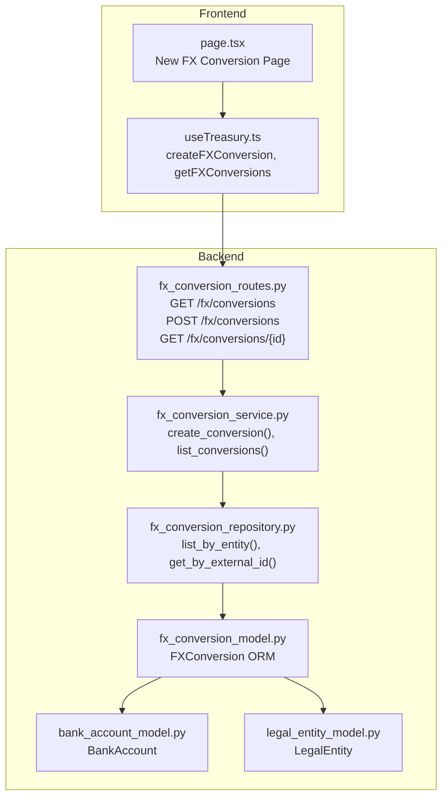
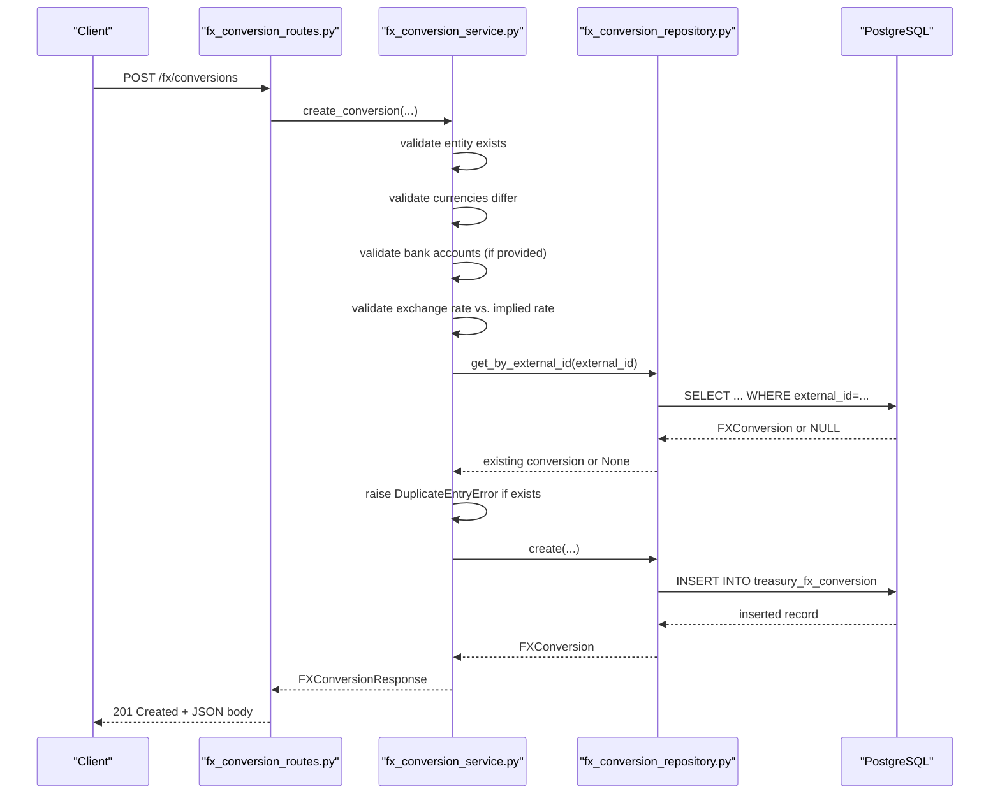
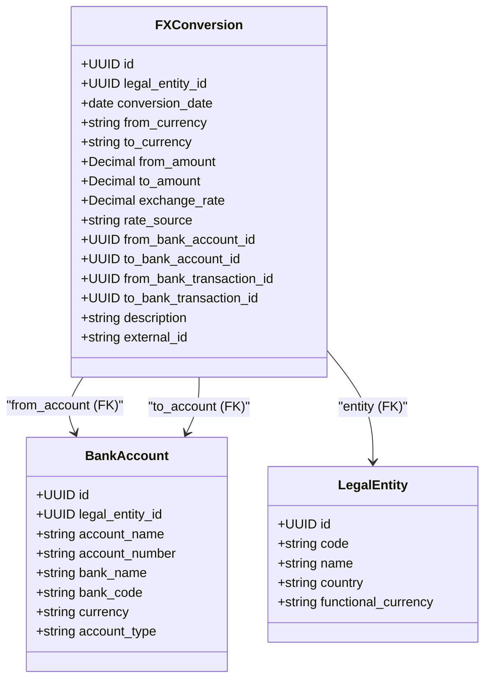
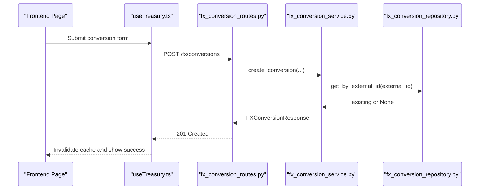
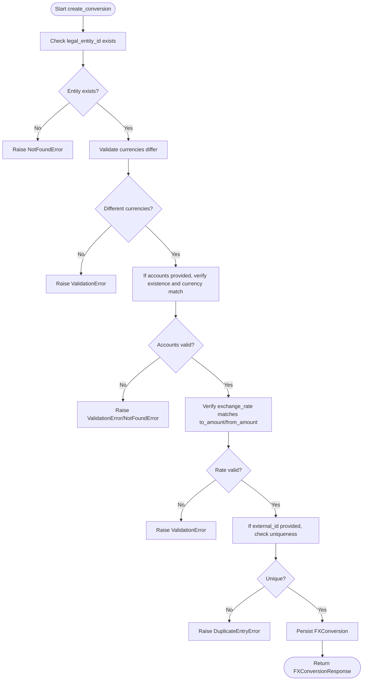
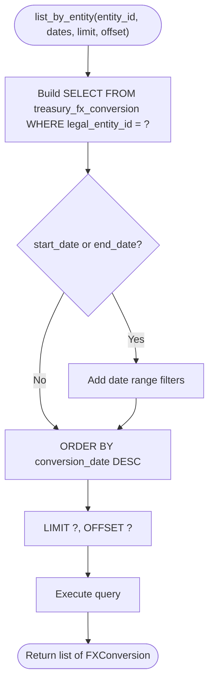
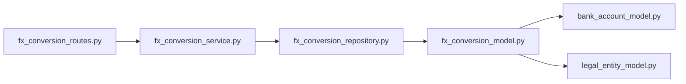

# Foreign Exchange API

<cite>
**Referenced Files in This Document**
- [fx_conversion_routes.py](file://app/modules/treasury/api/routes/fx_conversion_routes.py)
- [fx_conversion_service.py](file://app/modules/treasury/services/fx_conversion_service.py)
- [fx_conversion_schemas.py](file://app/modules/treasury/schemas/fx_conversion_schemas.py)
- [fx_conversion_model.py](file://app/modules/treasury/models/fx_conversion_model.py)
- [fx_conversion_repository.py](file://app/modules/treasury/repositories/fx_conversion_repository.py)
- [bank_account_model.py](file://app/modules/treasury/models/bank_account_model.py)
- [legal_entity_model.py](file://app/modules/general_ledger/models/legal_entity_model.py)
- [useTreasury.ts](file://frontend/hooks/useTreasury.ts)
- [page.tsx](file://frontend/app/(dashboard)/treasury/fx-conversions/new/page.tsx)
</cite>

## Table of Contents
1. [Introduction](#introduction)
2. [Project Structure](#project-structure)
3. [Core Components](#core-components)
4. [Architecture Overview](#architecture-overview)
5. [Detailed Component Analysis](#detailed-component-analysis)
6. [Dependency Analysis](#dependency-analysis)
7. [Performance Considerations](#performance-considerations)
8. [Troubleshooting Guide](#troubleshooting-guide)
9. [Conclusion](#conclusion)
10. [Appendices](#appendices)

## Introduction
This document provides comprehensive API documentation for Foreign Exchange (FX) conversion endpoints within the Treasury module. It covers:
- Currency conversion rates and spot conversions
- Forward contracts (conceptual coverage)
- Hedge accounting (conceptual coverage)
- Currency pairs, exchange rate sources, and historical rate management
- Rate provider integration, compliance controls, and audit requirements
- Endpoints: GET /fx/conversions for conversion listing, POST /fx/conversions for spot conversions, and conceptual GET /exchange-rates for rate queries
- Request/response schemas, rate validation rules, and error handling for invalid currency pairs

The focus is on the implemented spot conversion workflow, while forward contracts and hedge accounting are presented as conceptual extensions requiring additional models and services.

## Project Structure
The FX conversion feature is organized around a classic layered architecture:
- API routes define the HTTP endpoints and bind request/response models
- Services encapsulate business logic and validations
- Repositories handle data access
- Models define persistence and relationships
- Frontend hooks integrate with the backend APIs

**Diagram sources**
- [fx_conversion_routes.py](file://app/modules/treasury/api/routes/fx_conversion_routes.py#L15-L81)
- [fx_conversion_service.py](file://app/modules/treasury/services/fx_conversion_service.py#L14-L112)
- [fx_conversion_repository.py](file://app/modules/treasury/repositories/fx_conversion_repository.py#L11-L45)
- [fx_conversion_model.py](file://app/modules/treasury/models/fx_conversion_model.py#L9-L37)
- [bank_account_model.py](file://app/modules/treasury/models/bank_account_model.py#L9-L36)
- [legal_entity_model.py](file://app/modules/general_ledger/models/legal_entity_model.py#L7-L22)
- [useTreasury.ts](file://frontend/hooks/useTreasury.ts#L239-L272)
- [page.tsx](file://frontend/app/(dashboard)/treasury/fx-conversions/new/page.tsx#L1-L10)

**Section sources**
- [fx_conversion_routes.py](file://app/modules/treasury/api/routes/fx_conversion_routes.py#L1-L81)
- [fx_conversion_service.py](file://app/modules/treasury/services/fx_conversion_service.py#L1-L112)
- [fx_conversion_schemas.py](file://app/modules/treasury/schemas/fx_conversion_schemas.py#L1-L44)
- [fx_conversion_model.py](file://app/modules/treasury/models/fx_conversion_model.py#L1-L41)
- [fx_conversion_repository.py](file://app/modules/treasury/repositories/fx_conversion_repository.py#L1-L45)
- [bank_account_model.py](file://app/modules/treasury/models/bank_account_model.py#L1-L36)
- [legal_entity_model.py](file://app/modules/general_ledger/models/legal_entity_model.py#L1-L22)
- [useTreasury.ts](file://frontend/hooks/useTreasury.ts#L239-L272)
- [page.tsx](file://frontend/app/(dashboard)/treasury/fx-conversions/new/page.tsx#L1-L10)

## Core Components
- API Routes: Define endpoints for creating conversions, listing conversions, and retrieving a specific conversion. They validate inputs via Pydantic models and translate exceptions into appropriate HTTP responses.
- Service Layer: Implements business rules including entity/account existence checks, currency pair validation, exchange rate verification, and duplicate detection via external_id.
- Repository Layer: Provides data access methods for listing conversions and deduplication by external_id.
- Models: Persist FX conversions, link to legal entities and bank accounts, and track metadata such as rate source and external_id.
- Frontend Hooks: Integrate with the backend to create conversions and list them with optimistic updates and caching.

Key validations implemented:
- From and to currencies must differ
- Bank account currencies must match the conversion currencies when accounts are supplied
- Exchange rate must match the implied rate (to_amount/from_amount) within a small tolerance
- External_id must be unique when provided

**Section sources**
- [fx_conversion_routes.py](file://app/modules/treasury/api/routes/fx_conversion_routes.py#L18-L81)
- [fx_conversion_service.py](file://app/modules/treasury/services/fx_conversion_service.py#L23-L90)
- [fx_conversion_schemas.py](file://app/modules/treasury/schemas/fx_conversion_schemas.py#L8-L44)
- [fx_conversion_model.py](file://app/modules/treasury/models/fx_conversion_model.py#L9-L37)
- [fx_conversion_repository.py](file://app/modules/treasury/repositories/fx_conversion_repository.py#L17-L44)

## Architecture Overview
The FX conversion workflow follows a clean architecture pattern with clear separation of concerns.

**Diagram sources**
- [fx_conversion_routes.py](file://app/modules/treasury/api/routes/fx_conversion_routes.py#L18-L46)
- [fx_conversion_service.py](file://app/modules/treasury/services/fx_conversion_service.py#L23-L90)
- [fx_conversion_repository.py](file://app/modules/treasury/repositories/fx_conversion_repository.py#L17-L22)

## Detailed Component Analysis

### API Endpoints

#### POST /fx/conversions
Purpose: Create a spot FX conversion with validated rates and optional bank account linkage.

- Path: /fx/conversions
- Method: POST
- Request Body Schema: FXConversionCreate
- Response: 201 Created + FXConversionResponse
- Validation Rules:
  - legal_entity_id must reference an existing LegalEntity
  - from_currency and to_currency must be three-letter ISO codes and different
  - from_bank_account_id and to_bank_account_id must exist if provided
  - Bank account currencies must match the conversion currencies when accounts are supplied
  - exchange_rate must equal to_amount/from_amount within a small tolerance
  - external_id must be unique if provided

- Error Codes:
  - 400 Bad Request: Validation errors (invalid currencies, mismatched accounts, invalid rate)
  - 404 Not Found: Entity or bank account not found
  - 409 Conflict: Duplicate external_id

- Request Example (conceptual):
  - legal_entity_id: UUID
  - conversion_date: date
  - from_currency: "USD"
  - to_currency: "EUR"
  - from_amount: Decimal
  - to_amount: Decimal
  - exchange_rate: Decimal
  - rate_source: "api" | "manual" | "bank"
  - from_bank_account_id: UUID | null
  - to_bank_account_id: UUID | null
  - description: string | null
  - external_id: string | null

- Response Example (conceptual):
  - id: UUID
  - legal_entity_id: UUID
  - conversion_date: date
  - from_currency: string
  - to_currency: string
  - from_amount: Decimal
  - to_amount: Decimal
  - exchange_rate: Decimal
  - rate_source: string
  - from_bank_account_id: UUID | null
  - to_bank_account_id: UUID | null
  - description: string | null
  - external_id: string | null
  - created_at: datetime
  - updated_at: datetime

**Section sources**
- [fx_conversion_routes.py](file://app/modules/treasury/api/routes/fx_conversion_routes.py#L18-L46)
- [fx_conversion_service.py](file://app/modules/treasury/services/fx_conversion_service.py#L23-L90)
- [fx_conversion_schemas.py](file://app/modules/treasury/schemas/fx_conversion_schemas.py#L8-L22)
- [fx_conversion_model.py](file://app/modules/treasury/models/fx_conversion_model.py#L13-L26)

#### GET /fx/conversions
Purpose: List FX conversions for a legal entity with optional date range and pagination.

- Path: /fx/conversions
- Method: GET
- Query Parameters:
  - entity_id: UUID (required)
  - start_date: date | null
  - end_date: date | null
  - limit: integer (default 100, min 1, max 1000)
  - offset: integer (default 0, min 0)
- Response: 200 OK + array of FXConversionResponse

- Notes:
  - Results are ordered by conversion_date descending
  - Pagination applies after filtering by date range

**Section sources**
- [fx_conversion_routes.py](file://app/modules/treasury/api/routes/fx_conversion_routes.py#L49-L67)
- [fx_conversion_repository.py](file://app/modules/treasury/repositories/fx_conversion_repository.py#L24-L44)

#### GET /fx/conversions/{conversion_id}
Purpose: Retrieve a specific FX conversion by ID.

- Path: /fx/conversions/{conversion_id}
- Method: GET
- Response: 200 OK + FXConversionResponse
- Error: 404 Not Found if conversion does not exist

**Section sources**
- [fx_conversion_routes.py](file://app/modules/treasury/api/routes/fx_conversion_routes.py#L70-L81)
- [fx_conversion_service.py](file://app/modules/treasury/services/fx_conversion_service.py#L92-L94)

### Request/Response Schemas

#### FXConversionCreate
- Fields:
  - legal_entity_id: UUID
  - conversion_date: date
  - from_currency: string (3 chars)
  - to_currency: string (3 chars)
  - from_amount: Decimal (> 0)
  - to_amount: Decimal (> 0)
  - exchange_rate: Decimal (> 0)
  - rate_source: string (min length 1)
  - from_bank_account_id: UUID | null
  - to_bank_account_id: UUID | null
  - description: string | null
  - external_id: string | null

#### FXConversionResponse
- Fields:
  - id: UUID
  - legal_entity_id: UUID
  - conversion_date: date
  - from_currency: string
  - to_currency: string
  - from_amount: Decimal
  - to_amount: Decimal
  - exchange_rate: Decimal
  - rate_source: string
  - from_bank_account_id: UUID | null
  - to_bank_account_id: UUID | null
  - description: string | null
  - external_id: string | null
  - created_at: datetime
  - updated_at: datetime

**Section sources**
- [fx_conversion_schemas.py](file://app/modules/treasury/schemas/fx_conversion_schemas.py#L8-L44)

### Rate Validation Rules
- Currency Pair Validation:
  - from_currency and to_currency must be three-letter ISO codes
  - from_currency must not equal to_currency
- Amount and Rate Validation:
  - from_amount, to_amount, and exchange_rate must be positive
  - exchange_rate must match to_amount/from_amount within a small tolerance
- Account Validation:
  - If from_bank_account_id is provided, the account must exist and its currency must match from_currency
  - If to_bank_account_id is provided, the account must exist and its currency must match to_currency
- Deduplication:
  - external_id must be unique; attempting to create a duplicate yields 409 Conflict

**Section sources**
- [fx_conversion_service.py](file://app/modules/treasury/services/fx_conversion_service.py#L44-L72)
- [fx_conversion_repository.py](file://app/modules/treasury/repositories/fx_conversion_repository.py#L17-L22)

### Data Models and Relationships

**Diagram sources**
- [fx_conversion_model.py](file://app/modules/treasury/models/fx_conversion_model.py#L9-L37)
- [bank_account_model.py](file://app/modules/treasury/models/bank_account_model.py#L9-L36)
- [legal_entity_model.py](file://app/modules/general_ledger/models/legal_entity_model.py#L7-L22)

## Architecture Overview
The system integrates frontend hooks with backend routes and services to provide a robust FX conversion workflow.

**Diagram sources**
- [page.tsx](file://frontend/app/(dashboard)/treasury/fx-conversions/new/page.tsx#L1-L10)
- [useTreasury.ts](file://frontend/hooks/useTreasury.ts#L239-L272)
- [fx_conversion_routes.py](file://app/modules/treasury/api/routes/fx_conversion_routes.py#L18-L46)
- [fx_conversion_service.py](file://app/modules/treasury/services/fx_conversion_service.py#L23-L90)
- [fx_conversion_repository.py](file://app/modules/treasury/repositories/fx_conversion_repository.py#L17-L22)

## Detailed Component Analysis

### Spot Conversion Creation Flow
The service enforces strict validation before persisting a conversion:
- Entity existence check
- Currency pair validation
- Bank account currency alignment
- Exchange rate verification against amounts
- External_id uniqueness

**Diagram sources**
- [fx_conversion_service.py](file://app/modules/treasury/services/fx_conversion_service.py#L23-L90)

**Section sources**
- [fx_conversion_service.py](file://app/modules/treasury/services/fx_conversion_service.py#L23-L90)

### Listing Conversions
The repository supports filtering by legal entity and optional date range, with ordering and pagination.

**Diagram sources**
- [fx_conversion_repository.py](file://app/modules/treasury/repositories/fx_conversion_repository.py#L24-L44)

**Section sources**
- [fx_conversion_repository.py](file://app/modules/treasury/repositories/fx_conversion_repository.py#L24-L44)

### Conceptual Extensions: Forward Contracts and Hedge Accounting
Forward contracts and hedge accounting are not currently implemented but can be integrated conceptually:

- Forward Contracts:
  - Extend FXConversion with forward_start_date, forward_settlement_date, forward_points, and forward_rate
  - Add a contract_status field and lifecycle transitions
  - Introduce hedging relationships linking a forward to a hedge instrument

- Hedge Accounting:
  - Add a hedge_relationship table linking forwards to hedged items
  - Track designation_date, effectiveness testing, and designation_status
  - Store hedge_collar and risk components for measurement

These extensions would reuse the existing models and repositories with additional fields and business rules.

[No sources needed since this section introduces conceptual extensions not present in the codebase]

### Conceptual Extension: Exchange Rates Endpoint
A GET /exchange-rates endpoint could provide current and historical rates for currency pairs. This is conceptual and not implemented.

- Path: /exchange-rates
- Query Parameters:
  - base: string (3-letter ISO)
  - terms: string (comma-separated 3-letter ISO codes)
  - date: date | null (for historical)
  - rate_source: string | null
- Response: Array of rate entries with timestamps and sources

[No sources needed since this section proposes a conceptual endpoint not present in the codebase]

## Dependency Analysis
The FX conversion feature exhibits strong cohesion within the Treasury module and minimal cross-module coupling.

**Diagram sources**
- [fx_conversion_routes.py](file://app/modules/treasury/api/routes/fx_conversion_routes.py#L1-L15)
- [fx_conversion_service.py](file://app/modules/treasury/services/fx_conversion_service.py#L1-L22)
- [fx_conversion_repository.py](file://app/modules/treasury/repositories/fx_conversion_repository.py#L1-L16)
- [fx_conversion_model.py](file://app/modules/treasury/models/fx_conversion_model.py#L1-L11)
- [bank_account_model.py](file://app/modules/treasury/models/bank_account_model.py#L1-L9)
- [legal_entity_model.py](file://app/modules/general_ledger/models/legal_entity_model.py#L1-L7)

**Section sources**
- [fx_conversion_routes.py](file://app/modules/treasury/api/routes/fx_conversion_routes.py#L1-L15)
- [fx_conversion_service.py](file://app/modules/treasury/services/fx_conversion_service.py#L1-L22)
- [fx_conversion_repository.py](file://app/modules/treasury/repositories/fx_conversion_repository.py#L1-L16)
- [fx_conversion_model.py](file://app/modules/treasury/models/fx_conversion_model.py#L1-L11)
- [bank_account_model.py](file://app/modules/treasury/models/bank_account_model.py#L1-L9)
- [legal_entity_model.py](file://app/modules/general_ledger/models/legal_entity_model.py#L1-L7)

## Performance Considerations
- Indexing:
  - FXConversion.legal_entity_id and conversion_date are indexed to accelerate listing queries
  - FXConversion.external_id is indexed for deduplication checks
- Pagination:
  - Default limit of 100 prevents excessive payload sizes; max limit 1000 allows larger batches when needed
- Decimal Precision:
  - Numeric precision chosen to support financial calculations without overflow
- Asynchronous Operations:
  - SQLAlchemy async session minimizes blocking during I/O-bound operations

[No sources needed since this section provides general guidance]

## Troubleshooting Guide
Common issues and resolutions:
- 400 Bad Request:
  - Invalid currency codes or identical from/to currencies
  - Non-positive amounts or rates
  - Mismatched bank account currencies
  - Exchange rate not matching implied rate
- 404 Not Found:
  - Legal entity or bank account not found
- 409 Conflict:
  - Duplicate external_id detected

Frontend integration tips:
- Use optimistic updates for immediate feedback during creation
- Invalidate queries after successful mutations to refresh lists
- Handle validation errors gracefully with user-friendly messages

**Section sources**
- [fx_conversion_routes.py](file://app/modules/treasury/api/routes/fx_conversion_routes.py#L41-L46)
- [fx_conversion_service.py](file://app/modules/treasury/services/fx_conversion_service.py#L41-L72)
- [useTreasury.ts](file://frontend/hooks/useTreasury.ts#L239-L272)

## Conclusion
The Foreign Exchange API provides a solid foundation for spot currency conversions with strong validation, deduplication, and audit-ready fields. The architecture cleanly separates concerns and offers clear extension points for forward contracts and hedge accounting. Integrators can rely on consistent schemas, robust error handling, and efficient data access patterns.

[No sources needed since this section summarizes without analyzing specific files]

## Appendices

### Compliance Controls and Audit Requirements
- External ID Tracking:
  - external_id enables reconciliation with external systems and audit trails
- Rate Source Logging:
  - rate_source captures whether rates came from an API, manual input, or bank feed
- Timestamps:
  - created_at and updated_at support audit timelines
- Unique Constraints:
  - external_id uniqueness prevents duplicate processing

[No sources needed since this section provides general guidance]