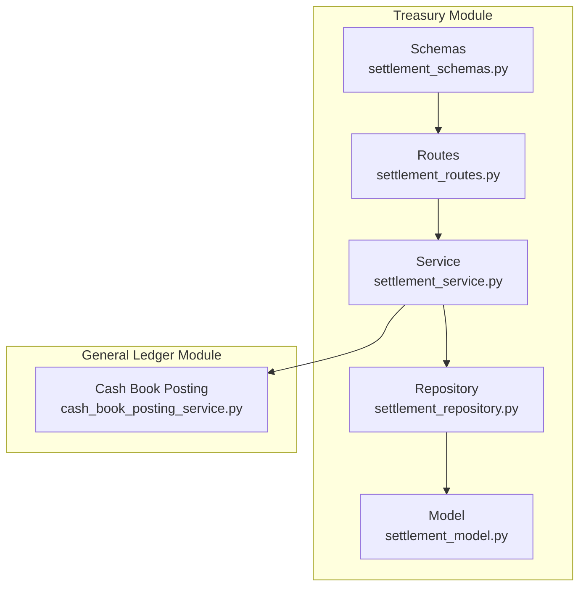
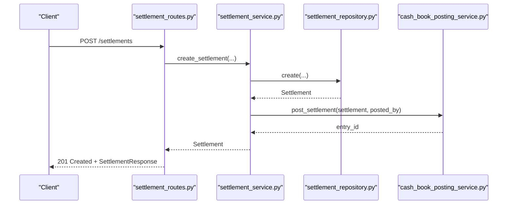
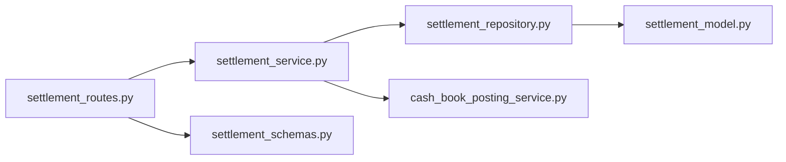
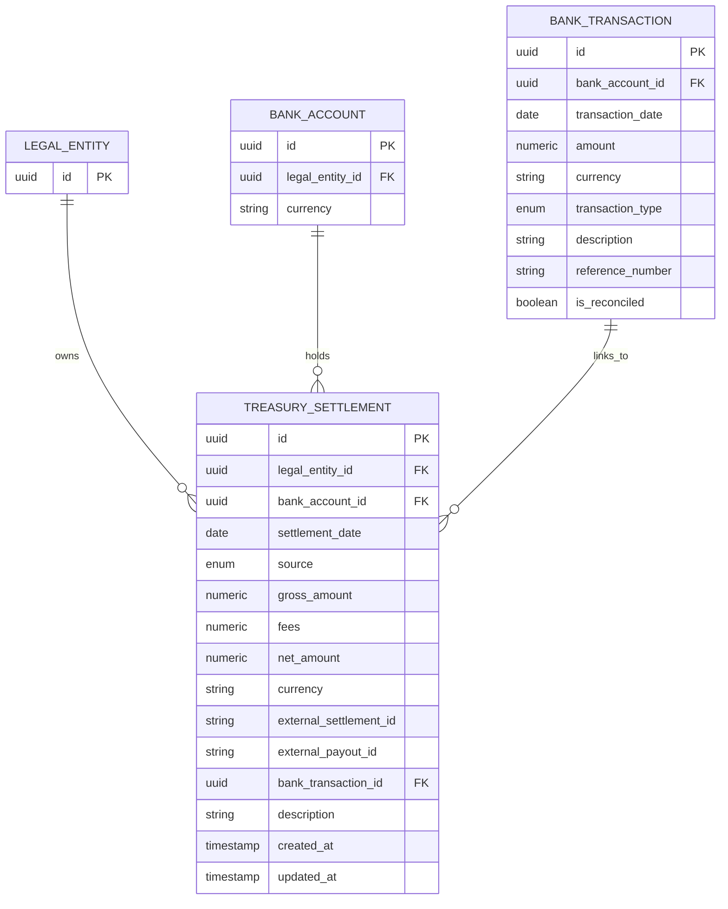
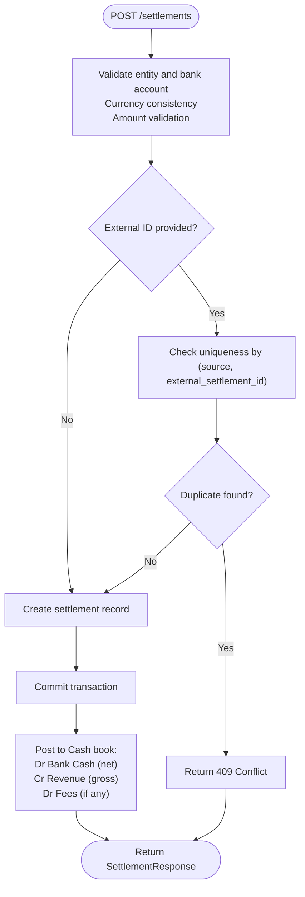

# Settlement API

<cite>
**Referenced Files in This Document**
- [settlement_routes.py](file://app/modules/treasury/api/routes/settlement_routes.py)
- [settlement_service.py](file://app/modules/treasury/services/settlement_service.py)
- [settlement_repository.py](file://app/modules/treasury/repositories/settlement_repository.py)
- [settlement_model.py](file://app/modules/treasury/models/settlement_model.py)
- [settlement_schemas.py](file://app/modules/treasury/schemas/settlement_schemas.py)
- [cash_book_posting_service.py](file://app/modules/general_ledger/services/cash_book_posting_service.py)
- [bank_transaction_model.py](file://app/modules/treasury/models/bank_transaction_model.py)
- [treasury_sync_routes.py](file://app/modules/general_ledger/api/routes/treasury_sync_routes.py)
- [004_fix_settlement_uniqueness.py](file://database/migrations/versions/004_fix_settlement_uniqueness.py)
</cite>

## Table of Contents
1. [Introduction](#introduction)
2. [Project Structure](#project-structure)
3. [Core Components](#core-components)
4. [Architecture Overview](#architecture-overview)
5. [Detailed Component Analysis](#detailed-component-analysis)
6. [Dependency Analysis](#dependency-analysis)
7. [Performance Considerations](#performance-considerations)
8. [Troubleshooting Guide](#troubleshooting-guide)
9. [Conclusion](#conclusion)
10. [Appendices](#appendices)

## Introduction
This document provides comprehensive API documentation for Settlement processing endpoints. It covers settlement creation, listing, retrieval, and integration with the general ledger posting workflow. It also documents validation rules, uniqueness constraints, idempotency, and reconciliation considerations. The supported endpoints are:
- GET /settlements
- GET /settlements/{settlement_id}
- POST /settlements
- POST /settlements/stripe/import
- POST /settlements/telr/import

Important note: The current implementation does not include a PATCH endpoint for settlement status updates. Any status change would need to be handled via separate workflows or extensions.

## Project Structure
Settlement functionality is organized under the Treasury module with clear separation of concerns:
- API routes define endpoints and orchestrate requests
- Services encapsulate business logic and validations
- Repositories handle persistence queries
- Models define the domain entities and constraints
- Schemas define request/response validation
- General Ledger integration posts journal entries for settlements

**Diagram sources**
- [settlement_routes.py](file://app/modules/treasury/api/routes/settlement_routes.py#L1-L232)
- [settlement_service.py](file://app/modules/treasury/services/settlement_service.py#L1-L124)
- [settlement_repository.py](file://app/modules/treasury/repositories/settlement_repository.py#L1-L48)
- [settlement_model.py](file://app/modules/treasury/models/settlement_model.py#L1-L48)
- [settlement_schemas.py](file://app/modules/treasury/schemas/settlement_schemas.py#L1-L58)
- [cash_book_posting_service.py](file://app/modules/general_ledger/services/cash_book_posting_service.py#L260-L332)

**Section sources**
- [settlement_routes.py](file://app/modules/treasury/api/routes/settlement_routes.py#L1-L232)
- [settlement_service.py](file://app/modules/treasury/services/settlement_service.py#L1-L124)
- [settlement_repository.py](file://app/modules/treasury/repositories/settlement_repository.py#L1-L48)
- [settlement_model.py](file://app/modules/treasury/models/settlement_model.py#L1-L48)
- [settlement_schemas.py](file://app/modules/treasury/schemas/settlement_schemas.py#L1-L58)

## Core Components
- Routes: Define endpoints, query parameters, and request/response models. They enforce idempotency and delegate to the service layer.
- Service: Implements business rules, validates inputs, checks duplicates, and coordinates with repositories and general ledger posting.
- Repository: Provides data access methods for settlement queries and pagination.
- Model: Defines the persistence structure, constraints, and relationships.
- Schemas: Pydantic models for request/response validation and serialization.
- General Ledger Integration: Posts journal entries for cash settlements, mapping to appropriate GL accounts.

Key responsibilities:
- Validation: Legal entity and bank account existence, currency consistency, amount correctness (gross minus fees equals net), and uniqueness constraints.
- Uniqueness: Composite constraint on (source, external_settlement_id) to prevent duplicates from the same provider.
- Idempotency: Applied at route level using endpoint keys and idempotency keys.
- Integration: Automatic posting to the Cash book via general ledger service.

**Section sources**
- [settlement_routes.py](file://app/modules/treasury/api/routes/settlement_routes.py#L22-L90)
- [settlement_service.py](file://app/modules/treasury/services/settlement_service.py#L23-L81)
- [settlement_repository.py](file://app/modules/treasury/repositories/settlement_repository.py#L17-L47)
- [settlement_model.py](file://app/modules/treasury/models/settlement_model.py#L17-L44)
- [settlement_schemas.py](file://app/modules/treasury/schemas/settlement_schemas.py#L9-L58)
- [cash_book_posting_service.py](file://app/modules/general_ledger/services/cash_book_posting_service.py#L260-L332)

## Architecture Overview
The Settlement API follows a layered architecture:
- Presentation Layer: FastAPI routes
- Application Layer: Service methods
- Domain/Persistence Layer: Repository and Model
- Integration Layer: General Ledger posting

**Diagram sources**
- [settlement_routes.py](file://app/modules/treasury/api/routes/settlement_routes.py#L22-L90)
- [settlement_service.py](file://app/modules/treasury/services/settlement_service.py#L23-L81)
- [cash_book_posting_service.py](file://app/modules/general_ledger/services/cash_book_posting_service.py#L260-L332)

## Detailed Component Analysis

### Endpoint: GET /settlements
Purpose: List settlements for a legal entity with optional filters and pagination.

Parameters:
- entity_id (path): Legal entity identifier (required)
- start_date (query): Filter by settlement date >= start_date (optional)
- end_date (query): Filter by settlement date <= end_date (optional)
- source (query): Filter by source (STRIPE, TELR, MANUAL) (optional)
- limit (query): Page size (default 100, min 1, max 1000)
- offset (query): Page offset (default 0)

Response: Array of SettlementResponse

Validation and behavior:
- Filters applied server-side
- Results ordered by settlement_date descending
- Pagination controlled by limit/offset

**Section sources**
- [settlement_routes.py](file://app/modules/treasury/api/routes/settlement_routes.py#L198-L218)
- [settlement_repository.py](file://app/modules/treasury/repositories/settlement_repository.py#L24-L47)
- [settlement_schemas.py](file://app/modules/treasury/schemas/settlement_schemas.py#L39-L58)

### Endpoint: GET /settlements/{settlement_id}
Purpose: Retrieve a specific settlement by ID.

Parameters:
- settlement_id (path): Settlement identifier (required)

Response: SettlementResponse

Behavior:
- Returns 404 if not found

**Section sources**
- [settlement_routes.py](file://app/modules/treasury/api/routes/settlement_routes.py#L221-L231)
- [settlement_service.py](file://app/modules/treasury/services/settlement_service.py#L102-L104)

### Endpoint: POST /settlements
Purpose: Create a manual settlement.

Request body: SettlementCreate
- legal_entity_id: UUID
- bank_account_id: UUID
- settlement_date: date
- source: SettlementSource (MANUAL)
- gross_amount: Decimal (>= 0)
- fees: Decimal (>= 0)
- net_amount: Decimal (>= 0)
- currency: string (3 chars)
- external_settlement_id: string | None
- external_payout_id: string | None
- description: string | None

Response: SettlementResponse

Processing steps:
- Validate legal entity and bank account existence and ownership
- Validate currency consistency
- Validate amounts: gross >= 0, fees >= 0, net = gross - fees
- Deduplication: If external_settlement_id provided, ensure uniqueness per (source, external_settlement_id)
- Persist settlement
- Commit transaction

Idempotency:
- Applied at route level using endpoint key and idempotency key
- Uses book_id derived from the legal entity’s CASH book

**Section sources**
- [settlement_routes.py](file://app/modules/treasury/api/routes/settlement_routes.py#L22-L90)
- [settlement_service.py](file://app/modules/treasury/services/settlement_service.py#L23-L81)
- [settlement_schemas.py](file://app/modules/treasury/schemas/settlement_schemas.py#L9-L22)

### Endpoint: POST /settlements/stripe/import
Purpose: Import a Stripe settlement from manual JSON payload.

Request body: SettlementImport
- Same fields as SettlementCreate, with source set to STRIPE

Processing:
- Validates bank account and derives book_id from bank account (if available) or falls back to CASH book
- Sets source to STRIPE
- Delegates to import_settlement which calls create_settlement internally

Idempotency:
- Applied with endpoint key for Stripe import

**Section sources**
- [settlement_routes.py](file://app/modules/treasury/api/routes/settlement_routes.py#L92-L141)
- [settlement_service.py](file://app/modules/treasury/services/settlement_service.py#L83-L100)

### Endpoint: POST /settlements/telr/import
Purpose: Import a TELR settlement from manual JSON payload.

Request body: SettlementImport
- Same fields as SettlementCreate, with source set to TELR

Processing:
- Validates bank account and derives book_id from CASH book
- Sets source to TELR
- Delegates to import_settlement which calls create_settlement internally

Idempotency:
- Applied with endpoint key for TELR import

**Section sources**
- [settlement_routes.py](file://app/modules/treasury/api/routes/settlement_routes.py#L143-L195)
- [settlement_service.py](file://app/modules/treasury/services/settlement_service.py#L83-L100)

### Request/Response Schemas
- SettlementCreate: Fields validated for non-negative amounts, 3-character currency, optional external IDs
- SettlementImport: Similar to SettlementCreate; used for provider imports
- SettlementResponse: Includes metadata like created_at, updated_at

**Section sources**
- [settlement_schemas.py](file://app/modules/treasury/schemas/settlement_schemas.py#L9-L58)

### Settlement Model and Uniqueness Constraints
- Fields: legal_entity_id, bank_account_id, settlement_date, source, gross_amount, fees, net_amount, currency, external_settlement_id, external_payout_id, bank_transaction_id, description
- Relationships: links to LegalEntity, BankAccount, BankTransaction
- Uniqueness: Composite constraint on (source, external_settlement_id) where external_settlement_id is not null

Migration note: The database migration enforces the corrected uniqueness constraint.

**Section sources**
- [settlement_model.py](file://app/modules/treasury/models/settlement_model.py#L17-L44)
- [004_fix_settlement_uniqueness.py](file://database/migrations/versions/004_fix_settlement_uniqueness.py#L23-L42)

### General Ledger Integration
Post-creation integration:
- The system posts a journal entry to the Cash book with:
  - Debit: Bank Cash (net_amount)
  - Credit: Revenue (gross_amount)
  - Debit: Processing Fees Expense (if fees > 0)
- The posting uses idempotency keyed by source_key derived from provider and external IDs

Integration flow:
- Cash book posting service retrieves the appropriate Cash book and accounting period
- Creates a draft journal entry and posts it with a deterministic source_key

**Section sources**
- [cash_book_posting_service.py](file://app/modules/general_ledger/services/cash_book_posting_service.py#L260-L332)

### Reconciliation Considerations
- Bank transactions are reconciled separately; settlements post to the Cash book and can be matched during reconciliation sessions.
- Reconciliation service supports creating sessions, matching transactions to journal entries, calculating differences, and closing sessions.

**Section sources**
- [bank_transaction_model.py](file://app/modules/treasury/models/bank_transaction_model.py#L21-L48)
- [reconciliation_service.py](file://app/modules/general_ledger/services/reconciliation_service.py#L22-L188)

## Dependency Analysis
High-level dependencies:
- Routes depend on Service and Schemas
- Service depends on Repository and models
- Repository depends on Model
- Service integrates with General Ledger posting service
- Routes coordinate idempotency and derive book_id for posting

**Diagram sources**
- [settlement_routes.py](file://app/modules/treasury/api/routes/settlement_routes.py#L1-L232)
- [settlement_service.py](file://app/modules/treasury/services/settlement_service.py#L1-L124)
- [settlement_repository.py](file://app/modules/treasury/repositories/settlement_repository.py#L1-L48)
- [settlement_model.py](file://app/modules/treasury/models/settlement_model.py#L1-L48)
- [settlement_schemas.py](file://app/modules/treasury/schemas/settlement_schemas.py#L1-L58)
- [cash_book_posting_service.py](file://app/modules/general_ledger/services/cash_book_posting_service.py#L260-L332)

**Section sources**
- [settlement_routes.py](file://app/modules/treasury/api/routes/settlement_routes.py#L1-L232)
- [settlement_service.py](file://app/modules/treasury/services/settlement_service.py#L1-L124)
- [settlement_repository.py](file://app/modules/treasury/repositories/settlement_repository.py#L1-L48)
- [settlement_model.py](file://app/modules/treasury/models/settlement_model.py#L1-L48)
- [settlement_schemas.py](file://app/modules/treasury/schemas/settlement_schemas.py#L1-L58)
- [cash_book_posting_service.py](file://app/modules/general_ledger/services/cash_book_posting_service.py#L260-L332)

## Performance Considerations
- Pagination: Use limit and offset to control result size; default 100, max 1000
- Filtering: start_date, end_date, and source reduce dataset size on the server
- Indexes: settlement_date and source are indexed in the model; external_settlement_id is indexed
- Idempotency: Reduces retries impact; ensure idempotency_key is stable per request
- Posting: Journal entry posting is synchronous; consider batching if needed

[No sources needed since this section provides general guidance]

## Troubleshooting Guide
Common errors and causes:
- 404 Not Found
  - Bank account not found
  - CASH book not found for entity
  - Settlement not found by ID
- 400 Bad Request
  - Bank account does not belong to the specified entity
  - Currency mismatch between bank account and settlement
  - Negative amounts
  - Net amount does not equal gross minus fees
- 409 Conflict
  - Duplicate external_settlement_id for the given source

Idempotency:
- Ensure idempotency_key remains constant for retry-safe requests
- For provider imports, external_settlement_id should be present for reliable idempotency

Uniqueness:
- Composite constraint prevents duplicate provider settlements with the same external ID

**Section sources**
- [settlement_routes.py](file://app/modules/treasury/api/routes/settlement_routes.py#L41-L50)
- [settlement_service.py](file://app/modules/treasury/services/settlement_service.py#L39-L58)
- [settlement_repository.py](file://app/modules/treasury/repositories/settlement_repository.py#L17-L22)
- [004_fix_settlement_uniqueness.py](file://database/migrations/versions/004_fix_settlement_uniqueness.py#L23-L42)

## Conclusion
The Settlement API provides robust endpoints for creating and listing settlements, with strong validation, deduplication, and idempotency. Provider-specific import endpoints streamline integration with Stripe and TELR. The system posts journal entries to the Cash book, enabling seamless general ledger integration. While a PATCH endpoint for status updates is not currently implemented, the existing architecture supports extension for future approval workflows.

[No sources needed since this section summarizes without analyzing specific files]

## Appendices

### API Definitions

- GET /settlements
  - Query: entity_id (UUID), start_date (date), end_date (date), source (enum), limit (int), offset (int)
  - Response: Array of SettlementResponse

- GET /settlements/{settlement_id}
  - Path: settlement_id (UUID)
  - Response: SettlementResponse

- POST /settlements
  - Body: SettlementCreate
  - Response: SettlementResponse
  - Idempotency: Yes (endpoint key + idempotency key)

- POST /settlements/stripe/import
  - Body: SettlementImport (source = STRIPE)
  - Response: SettlementResponse
  - Idempotency: Yes (endpoint key + idempotency key)

- POST /settlements/telr/import
  - Body: SettlementImport (source = TELR)
  - Response: SettlementResponse
  - Idempotency: Yes (endpoint key + idempotency key)

**Section sources**
- [settlement_routes.py](file://app/modules/treasury/api/routes/settlement_routes.py#L198-L231)
- [settlement_schemas.py](file://app/modules/treasury/schemas/settlement_schemas.py#L9-L58)

### Data Models

**Diagram sources**
- [settlement_model.py](file://app/modules/treasury/models/settlement_model.py#L17-L44)
- [bank_transaction_model.py](file://app/modules/treasury/models/bank_transaction_model.py#L21-L48)

### Settlement Posting Algorithm

**Diagram sources**
- [settlement_service.py](file://app/modules/treasury/services/settlement_service.py#L23-L81)
- [cash_book_posting_service.py](file://app/modules/general_ledger/services/cash_book_posting_service.py#L260-L332)

### Integration Notes
- Treasury-to-General Ledger synchronization posts bank transactions; settlements integrate via Cash book posting.
- Reconciliation matches bank transactions to journal entries; settlements appear as Cash book entries.

**Section sources**
- [treasury_sync_routes.py](file://app/modules/general_ledger/api/routes/treasury_sync_routes.py#L254-L291)
- [cash_book_posting_service.py](file://app/modules/general_ledger/services/cash_book_posting_service.py#L260-L332)