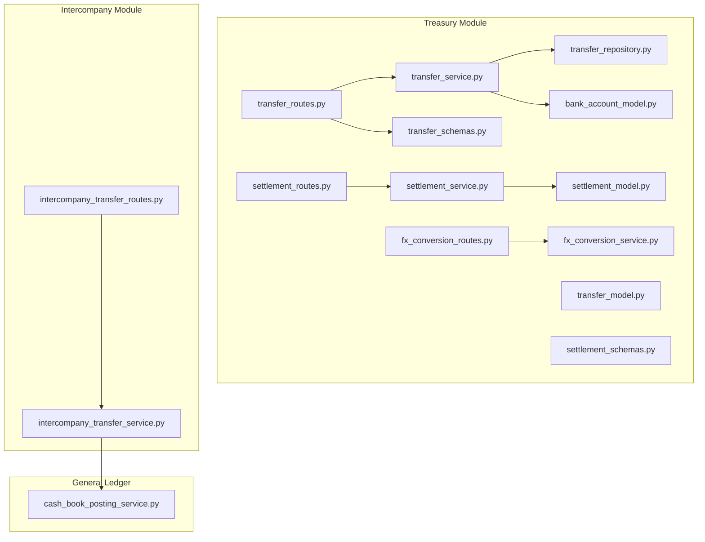
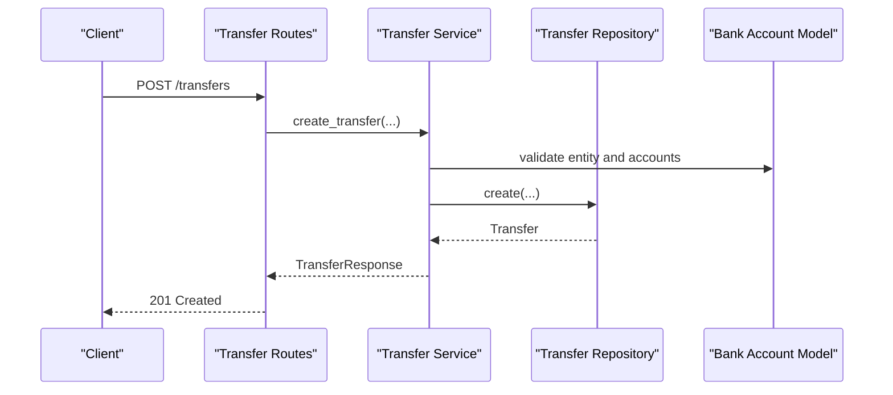
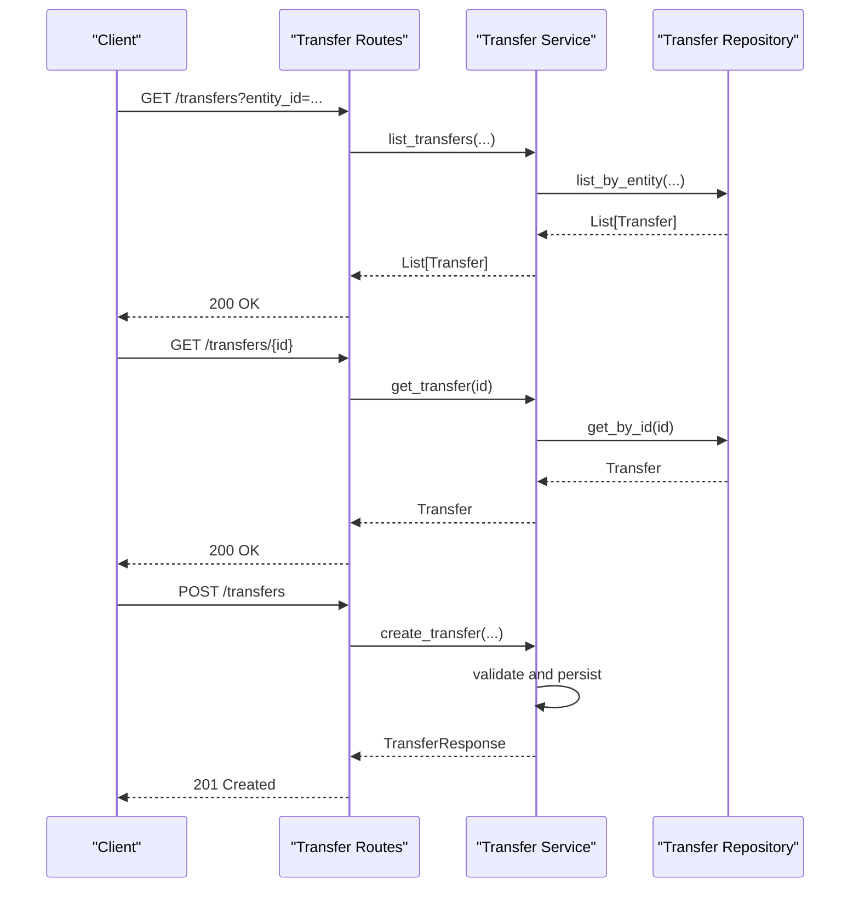
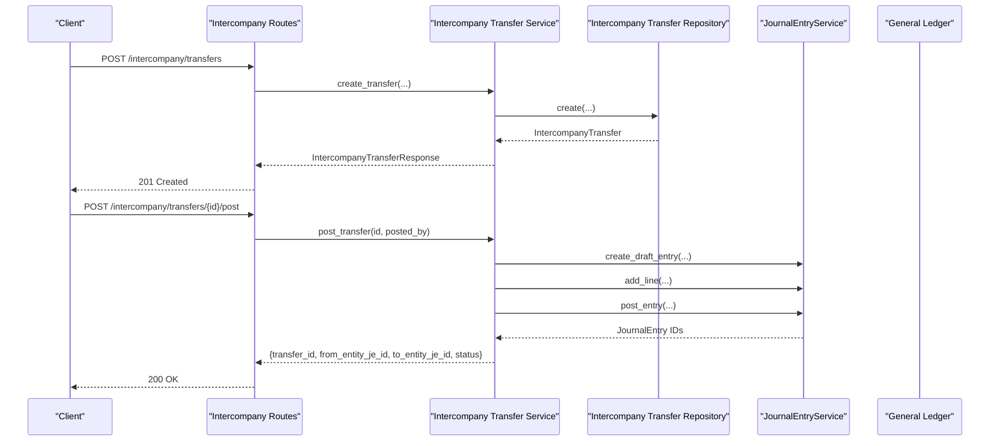
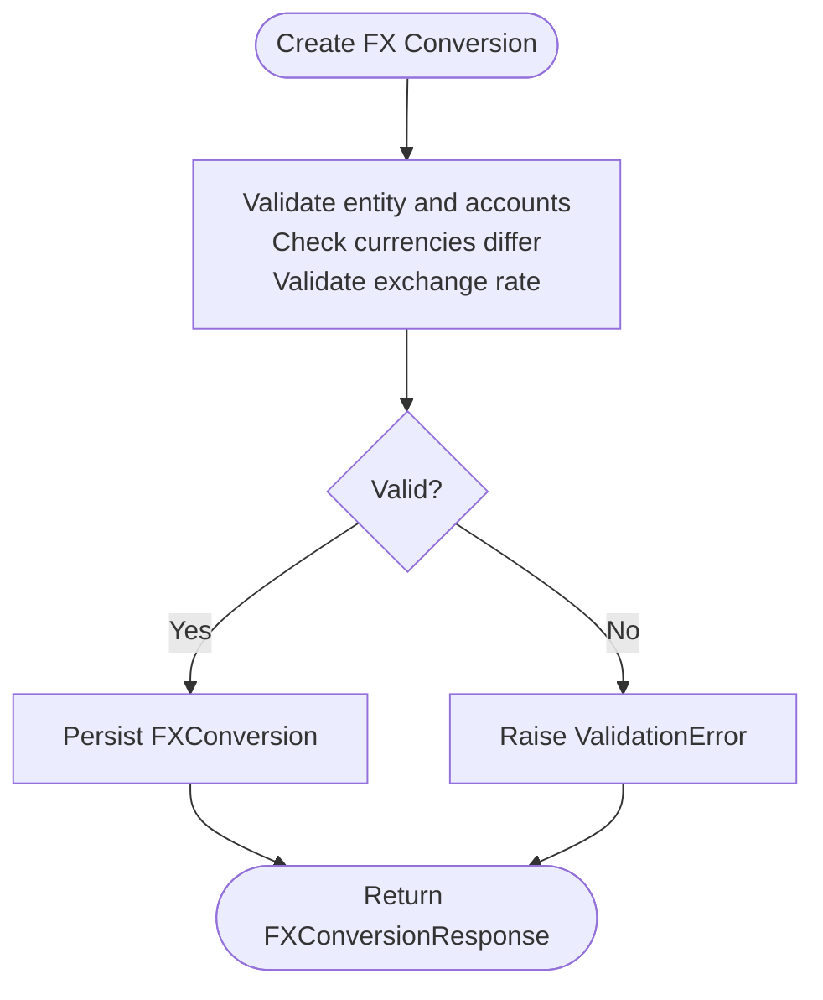
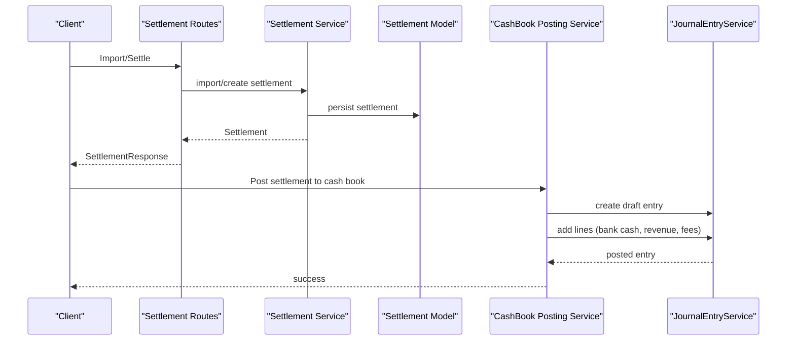
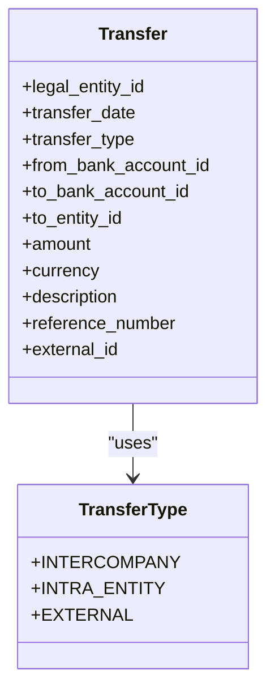
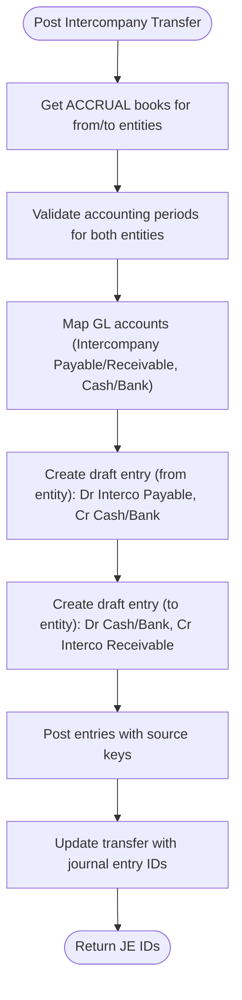
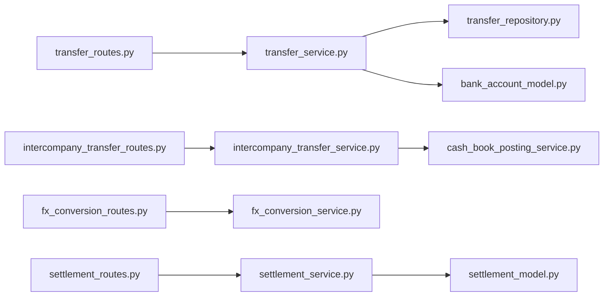

# Transfers API

<cite>
**Referenced Files in This Document**
- [transfer_routes.py](file://app/modules/treasury/api/routes/transfer_routes.py)
- [transfer_model.py](file://app/modules/treasury/models/transfer_model.py)
- [transfer_schemas.py](file://app/modules/treasury/schemas/transfer_schemas.py)
- [transfer_service.py](file://app/modules/treasury/services/transfer_service.py)
- [transfer_repository.py](file://app/modules/treasury/repositories/transfer_repository.py)
- [bank_account_model.py](file://app/modules/treasury/models/bank_account_model.py)
- [intercompany_transfer_routes.py](file://app/modules/intercompany/api/routes/intercompany_transfer_routes.py)
- [intercompany_transfer_service.py](file://app/modules/intercompany/services/intercompany_transfer_service.py)
- [fx_conversion_routes.py](file://app/modules/treasury/api/routes/fx_conversion_routes.py)
- [fx_conversion_service.py](file://app/modules/treasury/services/fx_conversion_service.py)
- [settlement_routes.py](file://app/modules/treasury/api/routes/settlement_routes.py)
- [settlement_service.py](file://app/modules/treasury/services/settlement_service.py)
- [settlement_model.py](file://app/modules/treasury/models/settlement_model.py)
- [settlement_schemas.py](file://app/modules/treasury/schemas/settlement_schemas.py)
- [cash_book_posting_service.py](file://app/modules/general_ledger/services/cash_book_posting_service.py)
</cite>

## Table of Contents
1. [Introduction](#introduction)
2. [Project Structure](#project-structure)
3. [Core Components](#core-components)
4. [Architecture Overview](#architecture-overview)
5. [Detailed Component Analysis](#detailed-component-analysis)
6. [Dependency Analysis](#dependency-analysis)
7. [Performance Considerations](#performance-considerations)
8. [Troubleshooting Guide](#troubleshooting-guide)
9. [Conclusion](#conclusion)
10. [Appendices](#appendices)

## Introduction
This document provides comprehensive API documentation for Transfer processing endpoints. It covers internal transfers (intra-entity and intercompany), external payments, and multi-currency transfers. It documents transfer creation, approval workflows, and execution processing, including transfer routing, currency conversion, and settlement operations. Examples include wire transfers, ACH payments, and automated transfers. It also details transfer validation, risk controls, and compliance requirements, and provides request/response schemas, transfer types, approval hierarchies, and error handling for failed transfers.

## Project Structure
The Transfers API is implemented under the Treasury module with supporting models, repositories, services, and routes. Intercompany transfers are handled in a dedicated module with its own routes and services. Currency conversion and settlement are supported via separate modules and services.

**Diagram sources**
- [transfer_routes.py](file://app/modules/treasury/api/routes/transfer_routes.py#L1-L83)
- [transfer_service.py](file://app/modules/treasury/services/transfer_service.py#L1-L113)
- [transfer_model.py](file://app/modules/treasury/models/transfer_model.py#L1-L49)
- [transfer_repository.py](file://app/modules/treasury/repositories/transfer_repository.py#L1-L67)
- [transfer_schemas.py](file://app/modules/treasury/schemas/transfer_schemas.py#L1-L43)
- [bank_account_model.py](file://app/modules/treasury/models/bank_account_model.py#L1-L36)
- [intercompany_transfer_routes.py](file://app/modules/intercompany/api/routes/intercompany_transfer_routes.py#L1-L179)
- [intercompany_transfer_service.py](file://app/modules/intercompany/services/intercompany_transfer_service.py#L1-L232)
- [fx_conversion_routes.py](file://app/modules/treasury/api/routes/fx_conversion_routes.py#L1-L81)
- [fx_conversion_service.py](file://app/modules/treasury/services/fx_conversion_service.py#L1-L112)
- [settlement_routes.py](file://app/modules/treasury/api/routes/settlement_routes.py)
- [settlement_service.py](file://app/modules/treasury/services/settlement_service.py#L1-L34)
- [settlement_model.py](file://app/modules/treasury/models/settlement_model.py#L1-L48)
- [settlement_schemas.py](file://app/modules/treasury/schemas/settlement_schemas.py#L1-L58)
- [cash_book_posting_service.py](file://app/modules/general_ledger/services/cash_book_posting_service.py#L269-L299)

**Section sources**
- [transfer_routes.py](file://app/modules/treasury/api/routes/transfer_routes.py#L1-L83)
- [intercompany_transfer_routes.py](file://app/modules/intercompany/api/routes/intercompany_transfer_routes.py#L1-L179)

## Core Components
- Transfer API routes expose GET /transfers, GET /transfers/{id}, and POST /transfers.
- Transfer service validates entity and account ownership, currency matching, intercompany destination requirements, and duplicate external IDs.
- Intercompany transfer routes include POST /intercompany/transfers, POST /intercompany/transfers/{id}/post, and listing endpoints.
- Intercompany transfer service posts journal entries in both entities’ books and manages account mappings.
- FX conversion routes and services support currency conversion with validation and duplicate external ID checks.
- Settlement routes and services manage payment gateway settlements and cash book posting.

**Section sources**
- [transfer_routes.py](file://app/modules/treasury/api/routes/transfer_routes.py#L19-L83)
- [transfer_service.py](file://app/modules/treasury/services/transfer_service.py#L23-L89)
- [intercompany_transfer_routes.py](file://app/modules/intercompany/api/routes/intercompany_transfer_routes.py#L21-L151)
- [intercompany_transfer_service.py](file://app/modules/intercompany/services/intercompany_transfer_service.py#L28-L219)
- [fx_conversion_routes.py](file://app/modules/treasury/api/routes/fx_conversion_routes.py#L18-L81)
- [fx_conversion_service.py](file://app/modules/treasury/services/fx_conversion_service.py#L23-L90)
- [settlement_routes.py](file://app/modules/treasury/api/routes/settlement_routes.py)
- [settlement_service.py](file://app/modules/treasury/services/settlement_service.py#L14-L34)

## Architecture Overview
The Transfers API follows a layered architecture:
- Routes define endpoints and bind request/response schemas.
- Services encapsulate business logic, validation, and orchestration.
- Repositories handle persistence queries.
- Models define domain entities and relationships.
- Intercompany and Treasury modules integrate with General Ledger for journal entries and cash book posting.

**Diagram sources**
- [transfer_routes.py](file://app/modules/treasury/api/routes/transfer_routes.py#L19-L46)
- [transfer_service.py](file://app/modules/treasury/services/transfer_service.py#L23-L89)
- [transfer_repository.py](file://app/modules/treasury/repositories/transfer_repository.py#L17-L47)
- [bank_account_model.py](file://app/modules/treasury/models/bank_account_model.py#L9-L36)

## Detailed Component Analysis

### Transfer Endpoints
- GET /transfers
  - Purpose: List transfers for an entity with optional filters.
  - Query parameters: entity_id (required), start_date, end_date, transfer_type, limit (default 100, max 1000), offset (default 0).
  - Response: Array of TransferResponse.
- GET /transfers/{id}
  - Purpose: Retrieve a single transfer by ID.
  - Response: TransferResponse.
- POST /transfers
  - Purpose: Create a transfer (internal or external).
  - Request body: TransferCreate.
  - Response: TransferResponse.
  - Validation: Entity existence, account ownership, currency matching, intercompany destination requirements, duplicate external_id.

**Diagram sources**
- [transfer_routes.py](file://app/modules/treasury/api/routes/transfer_routes.py#L49-L83)
- [transfer_service.py](file://app/modules/treasury/services/transfer_service.py#L95-L112)
- [transfer_repository.py](file://app/modules/treasury/repositories/transfer_repository.py#L24-L47)

**Section sources**
- [transfer_routes.py](file://app/modules/treasury/api/routes/transfer_routes.py#L49-L83)
- [transfer_service.py](file://app/modules/treasury/services/transfer_service.py#L23-L89)
- [transfer_schemas.py](file://app/modules/treasury/schemas/transfer_schemas.py#L9-L43)
- [transfer_model.py](file://app/modules/treasury/models/transfer_model.py#L10-L49)

### Intercompany Transfer Endpoints
- POST /intercompany/transfers
  - Purpose: Create an intercompany transfer.
  - Request body: IntercompanyTransferCreate.
  - Response: IntercompanyTransferResponse.
- POST /intercompany/transfers/{id}/post
  - Purpose: Post intercompany transfer to both entities’ books.
  - Request body: IntercompanyTransferPostRequest.
  - Response: JSON with transfer_id, from_entity_je_id, to_entity_je_id, status.
  - Idempotency: Uses idempotency key scoped to legal entity and ACCRUAL book.
- GET /intercompany/transfers
  - Purpose: List intercompany transfers with filtering by from_entity_id, to_entity_id, entity_id, dates, limit, offset.
- GET /intercompany/transfers/{id}
  - Purpose: Retrieve a single intercompany transfer by ID.
- GET /intercompany/transfers/balance
  - Purpose: Compute intercompany balance between two entities as of a date.

**Diagram sources**
- [intercompany_transfer_routes.py](file://app/modules/intercompany/api/routes/intercompany_transfer_routes.py#L21-L104)
- [intercompany_transfer_service.py](file://app/modules/intercompany/services/intercompany_transfer_service.py#L28-L219)

**Section sources**
- [intercompany_transfer_routes.py](file://app/modules/intercompany/api/routes/intercompany_transfer_routes.py#L21-L179)
- [intercompany_transfer_service.py](file://app/modules/intercompany/services/intercompany_transfer_service.py#L28-L219)

### Multi-Currency Transfers and Currency Conversion
- FX Conversion API supports creating currency conversions with validation for different currencies, account currency matching, exchange rate consistency, and duplicate external IDs.
- Transfer creation enforces currency matching between accounts and transfers.
- Settlement operations post net amounts to the cash book and allocate revenue and fee accounts.

**Diagram sources**
- [fx_conversion_routes.py](file://app/modules/treasury/api/routes/fx_conversion_routes.py#L18-L46)
- [fx_conversion_service.py](file://app/modules/treasury/services/fx_conversion_service.py#L23-L90)

**Section sources**
- [fx_conversion_routes.py](file://app/modules/treasury/api/routes/fx_conversion_routes.py#L18-L81)
- [fx_conversion_service.py](file://app/modules/treasury/services/fx_conversion_service.py#L23-L90)
- [transfer_service.py](file://app/modules/treasury/services/transfer_service.py#L43-L67)

### Settlement Operations
- Settlement routes import or create settlements linked to bank accounts and cash books.
- Cash book posting service posts journal entries for net settlement amounts, allocating bank cash, revenue, and processing fee accounts.

**Diagram sources**
- [settlement_routes.py](file://app/modules/treasury/api/routes/settlement_routes.py)
- [settlement_service.py](file://app/modules/treasury/services/settlement_service.py#L14-L34)
- [settlement_model.py](file://app/modules/treasury/models/settlement_model.py#L17-L48)
- [cash_book_posting_service.py](file://app/modules/general_ledger/services/cash_book_posting_service.py#L269-L299)

**Section sources**
- [settlement_routes.py](file://app/modules/treasury/api/routes/settlement_routes.py)
- [settlement_service.py](file://app/modules/treasury/services/settlement_service.py#L14-L34)
- [settlement_model.py](file://app/modules/treasury/models/settlement_model.py#L17-L48)
- [cash_book_posting_service.py](file://app/modules/general_ledger/services/cash_book_posting_service.py#L269-L299)

### Transfer Types and Routing
- TransferType includes INTERCOMPANY, INTRA_ENTITY, and EXTERNAL.
- Internal routing:
  - INTRA_ENTITY: from_bank_account_id to another account within the same entity.
  - INTERCOMPANY: from_bank_account_id to to_bank_account_id across legal entities; requires to_entity_id.
- External routing:
  - EXTERNAL: from_bank_account_id with to_bank_account_id null; description/reference fields capture external details.

**Diagram sources**
- [transfer_model.py](file://app/modules/treasury/models/transfer_model.py#L10-L49)

**Section sources**
- [transfer_model.py](file://app/modules/treasury/models/transfer_model.py#L10-L49)
- [transfer_schemas.py](file://app/modules/treasury/schemas/transfer_schemas.py#L9-L43)

### Approval Workflows and Execution
- Intercompany transfers support a formal posting workflow that posts journal entries in both entities’ books.
- Posting is idempotent and scoped to the ACCRUAL book of the originating entity.
- The process includes retrieving ACCRUAL books, validating accounting periods, mapping GL accounts, creating draft entries, adding lines, and posting with source keys.

**Diagram sources**
- [intercompany_transfer_service.py](file://app/modules/intercompany/services/intercompany_transfer_service.py#L72-L219)

**Section sources**
- [intercompany_transfer_routes.py](file://app/modules/intercompany/api/routes/intercompany_transfer_routes.py#L48-L104)
- [intercompany_transfer_service.py](file://app/modules/intercompany/services/intercompany_transfer_service.py#L72-L219)

### Wire Transfers, ACH Payments, and Automated Transfers
- External transfers support wire transfers and ACH payments via:
  - EXTERNAL transfer type with description/reference_number capturing payment method and details.
  - Optional external_id for system-to-system deduplication.
  - Multi-currency transfers enforced by account and transfer currency matching.
- Automated transfers can leverage external_id and idempotency to prevent duplicates during batch processing.

**Section sources**
- [transfer_service.py](file://app/modules/treasury/services/transfer_service.py#L43-L72)
- [transfer_schemas.py](file://app/modules/treasury/schemas/transfer_schemas.py#L9-L22)

### Validation, Risk Controls, and Compliance
- Validation rules:
  - Entity and account existence checks.
  - Account ownership verification (must belong to the specified legal entity).
  - Currency matching between accounts and transfers.
  - Intercompany requirement: to_entity_id mandatory for INTERCOMPANY.
  - Duplicate prevention: external_id uniqueness across transfers and FX conversions.
- Risk controls:
  - Idempotency for intercompany posting and settlement imports.
  - Period validation for journal entries.
  - Account mapping validation for GL accounts.
- Compliance:
  - Audit trail via journal entries and posted_by metadata.
  - Source keys for traceability.

**Section sources**
- [transfer_service.py](file://app/modules/treasury/services/transfer_service.py#L38-L89)
- [fx_conversion_service.py](file://app/modules/treasury/services/fx_conversion_service.py#L39-L90)
- [intercompany_transfer_routes.py](file://app/modules/intercompany/api/routes/intercompany_transfer_routes.py#L88-L99)
- [intercompany_transfer_service.py](file://app/modules/intercompany/services/intercompany_transfer_service.py#L100-L111)

## Dependency Analysis
The following diagram shows key dependencies among modules involved in transfers, intercompany processing, FX conversion, and settlement.

**Diagram sources**
- [transfer_routes.py](file://app/modules/treasury/api/routes/transfer_routes.py#L1-L83)
- [transfer_service.py](file://app/modules/treasury/services/transfer_service.py#L1-L113)
- [transfer_repository.py](file://app/modules/treasury/repositories/transfer_repository.py#L1-L67)
- [bank_account_model.py](file://app/modules/treasury/models/bank_account_model.py#L1-L36)
- [intercompany_transfer_routes.py](file://app/modules/intercompany/api/routes/intercompany_transfer_routes.py#L1-L179)
- [intercompany_transfer_service.py](file://app/modules/intercompany/services/intercompany_transfer_service.py#L1-L232)
- [fx_conversion_routes.py](file://app/modules/treasury/api/routes/fx_conversion_routes.py#L1-L81)
- [fx_conversion_service.py](file://app/modules/treasury/services/fx_conversion_service.py#L1-L112)
- [settlement_routes.py](file://app/modules/treasury/api/routes/settlement_routes.py)
- [settlement_service.py](file://app/modules/treasury/services/settlement_service.py#L1-L34)
- [settlement_model.py](file://app/modules/treasury/models/settlement_model.py#L1-L48)
- [cash_book_posting_service.py](file://app/modules/general_ledger/services/cash_book_posting_service.py#L269-L299)

**Section sources**
- [transfer_routes.py](file://app/modules/treasury/api/routes/transfer_routes.py#L1-L83)
- [intercompany_transfer_routes.py](file://app/modules/intercompany/api/routes/intercompany_transfer_routes.py#L1-L179)
- [fx_conversion_routes.py](file://app/modules/treasury/api/routes/fx_conversion_routes.py#L1-L81)
- [settlement_routes.py](file://app/modules/treasury/api/routes/settlement_routes.py)

## Performance Considerations
- Pagination: GET /transfers and related listings support limit and offset to control payload size.
- Indexing: Transfer model includes indices on legal_entity_id, transfer_date, and transfer_type to optimize queries.
- Idempotency: Intercompany posting and settlement imports use idempotency keys to avoid duplicate processing.
- Batch processing: Use external_id and idempotency for automated transfers to prevent reprocessing.

[No sources needed since this section provides general guidance]

## Troubleshooting Guide
Common errors and resolutions:
- 400 Bad Request
  - Validation errors for currency mismatch, invalid account ownership, or invalid exchange rates.
- 404 Not Found
  - Entity, account, or transfer not found; intercompany ACCRUAL book or accounting period missing.
- 409 Conflict
  - Duplicate external_id for transfers or FX conversions.
- Idempotency failures
  - Ensure idempotency_key is unique per request and matches the expected scope.

**Section sources**
- [transfer_routes.py](file://app/modules/treasury/api/routes/transfer_routes.py#L41-L46)
- [transfer_service.py](file://app/modules/treasury/services/transfer_service.py#L40-L72)
- [fx_conversion_service.py](file://app/modules/treasury/services/fx_conversion_service.py#L44-L72)
- [intercompany_transfer_routes.py](file://app/modules/intercompany/api/routes/intercompany_transfer_routes.py#L88-L103)

## Conclusion
The Transfers API provides robust endpoints for internal and external transfers, intercompany processing, currency conversion, and settlement operations. It enforces strong validation, supports idempotent execution, and integrates with General Ledger for accurate financial recording. The documented schemas and workflows enable reliable automation and compliance.

[No sources needed since this section summarizes without analyzing specific files]

## Appendices

### API Definitions

- GET /transfers
  - Query parameters:
    - entity_id (UUID, required)
    - start_date (date, optional)
    - end_date (date, optional)
    - transfer_type (enum: INTERCOMPANY, INTRA_ENTITY, EXTERNAL, optional)
    - limit (integer, default 100, min 1, max 1000)
    - offset (integer, default 0)
  - Response: Array of TransferResponse

- GET /transfers/{id}
  - Path parameter: transfer_id (UUID)
  - Response: TransferResponse

- POST /transfers
  - Request body: TransferCreate
  - Response: TransferResponse

- GET /intercompany/transfers
  - Query parameters:
    - from_entity_id (UUID, optional)
    - to_entity_id (UUID, optional)
    - entity_id (UUID, optional)
    - start_date (date, optional)
    - end_date (date, optional)
    - limit (integer, default 100, min 1, max 1000)
    - offset (integer, default 0)
  - Response: Array of IntercompanyTransferResponse

- GET /intercompany/transfers/{id}
  - Path parameter: transfer_id (UUID)
  - Response: IntercompanyTransferResponse

- POST /intercompany/transfers/{id}/post
  - Path parameter: transfer_id (UUID)
  - Request body: IntercompanyTransferPostRequest
  - Response: JSON with transfer_id, from_entity_je_id, to_entity_je_id, status

- GET /intercompany/transfers/balance
  - Query parameters:
    - from_entity_id (UUID, required)
    - to_entity_id (UUID, required)
    - as_of_date (date, optional)
  - Response: JSON with from_entity_id, to_entity_id, as_of_date, balance

- POST /fx/conversions
  - Request body: FXConversionCreate
  - Response: FXConversionResponse

- GET /fx/conversions
  - Query parameters:
    - entity_id (UUID, required)
    - start_date (date, optional)
    - end_date (date, optional)
    - limit (integer, default 100, min 1, max 1000)
    - offset (integer, default 0)
  - Response: Array of FXConversionResponse

- GET /fx/conversions/{conversion_id}
  - Path parameter: conversion_id (UUID)
  - Response: FXConversionResponse

**Section sources**
- [transfer_routes.py](file://app/modules/treasury/api/routes/transfer_routes.py#L49-L83)
- [intercompany_transfer_routes.py](file://app/modules/intercompany/api/routes/intercompany_transfer_routes.py#L106-L179)
- [fx_conversion_routes.py](file://app/modules/treasury/api/routes/fx_conversion_routes.py#L18-L81)

### Request/Response Schemas

- TransferCreate
  - Fields: legal_entity_id (UUID), transfer_date (date), transfer_type (enum), from_bank_account_id (UUID), amount (Decimal > 0), currency (string 3 chars), to_bank_account_id (UUID | None), to_entity_id (UUID | None), description (string | None), reference_number (string | None), external_id (string | None)

- TransferResponse
  - Fields: id (UUID), legal_entity_id (UUID), transfer_date (date), transfer_type (enum), from_bank_account_id (UUID), to_bank_account_id (UUID | None), to_entity_id (UUID | None), amount (Decimal), currency (string), description (string | None), reference_number (string | None), external_id (string | None), created_at (datetime), updated_at (datetime)

- IntercompanyTransferCreate
  - Fields: from_entity_id (UUID), to_entity_id (UUID), transfer_date (date), amount (Decimal), currency (string), transfer_type (string), description (string | None), reference_number (string | None), from_bank_account_id (UUID | None), to_bank_account_id (UUID | None)

- IntercompanyTransferPostRequest
  - Fields: posted_by (UUID)

- IntercompanyTransferResponse
  - Fields: id (UUID), from_entity_id (UUID), to_entity_id (UUID), transfer_date (date), amount (Decimal), currency (string), transfer_type (string), description (string | None), reference_number (string | None), from_entity_je_id (UUID | None), to_entity_je_id (UUID | None), created_at (datetime), updated_at (datetime)

- FXConversionCreate
  - Fields: legal_entity_id (UUID), conversion_date (date), from_currency (string 3 chars), to_currency (string 3 chars), from_amount (Decimal), to_amount (Decimal), exchange_rate (Decimal), rate_source (string), from_bank_account_id (UUID | None), to_bank_account_id (UUID | None), description (string | None), external_id (string | None)

- FXConversionResponse
  - Fields: id (UUID), legal_entity_id (UUID), conversion_date (date), from_currency (string), to_currency (string), from_amount (Decimal), to_amount (Decimal), exchange_rate (Decimal), rate_source (string), from_bank_account_id (UUID | None), to_bank_account_id (UUID | None), description (string | None), external_id (string | None), created_at (datetime), updated_at (datetime)

- SettlementCreate
  - Fields: legal_entity_id (UUID), bank_account_id (UUID), settlement_date (date), source (enum: STRIPE, TELR, MANUAL), gross_amount (Decimal ≥ 0), fees (Decimal ≥ 0), net_amount (Decimal ≥ 0), currency (string 3 chars), external_settlement_id (string | None), external_payout_id (string | None), description (string | None)

- SettlementResponse
  - Fields: id (UUID), legal_entity_id (UUID), bank_account_id (UUID), settlement_date (date), source (enum), gross_amount (Decimal), fees (Decimal), net_amount (Decimal), currency (string), external_settlement_id (string | None), external_payout_id (string | None), description (string | None), created_at (datetime), updated_at (datetime)

**Section sources**
- [transfer_schemas.py](file://app/modules/treasury/schemas/transfer_schemas.py#L9-L43)
- [intercompany_transfer_routes.py](file://app/modules/intercompany/api/routes/intercompany_transfer_routes.py#L11-L15)
- [fx_conversion_routes.py](file://app/modules/treasury/api/routes/fx_conversion_routes.py#L9-L12)
- [settlement_routes.py](file://app/modules/treasury/api/routes/settlement_routes.py)
- [settlement_schemas.py](file://app/modules/treasury/schemas/settlement_schemas.py#L9-L58)