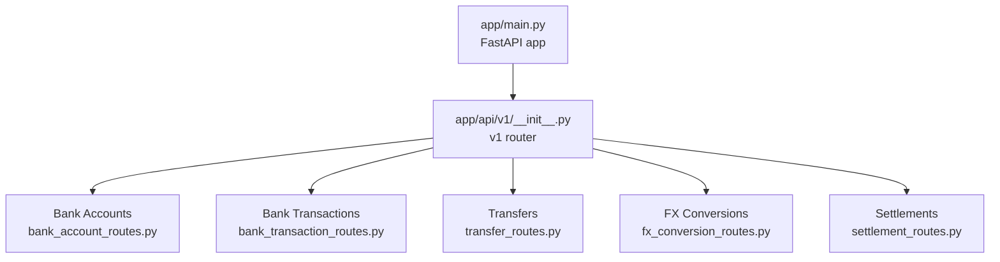
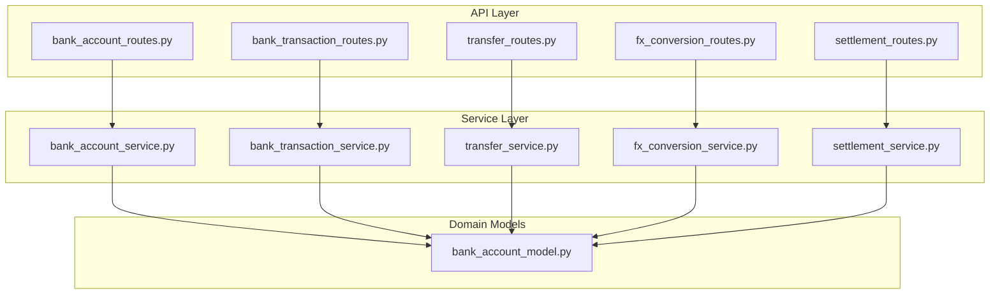
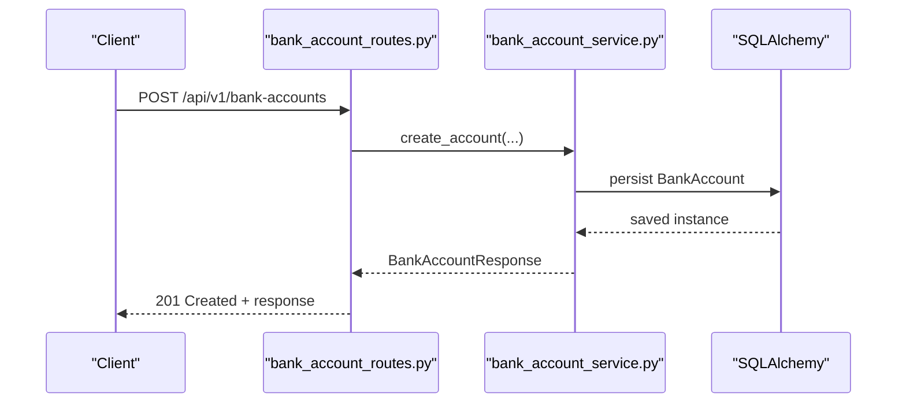
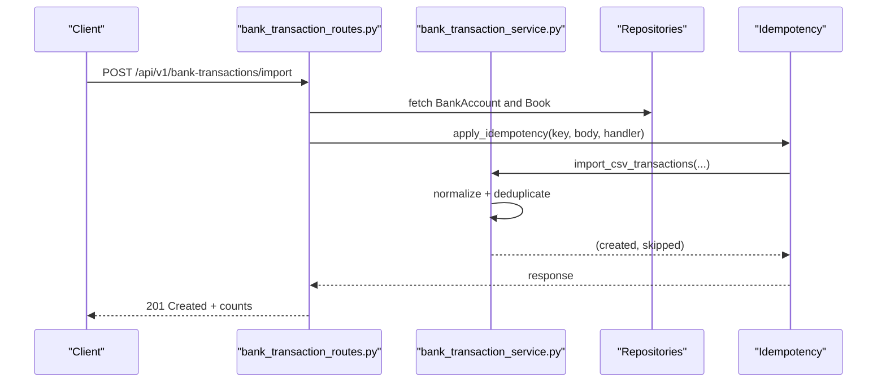
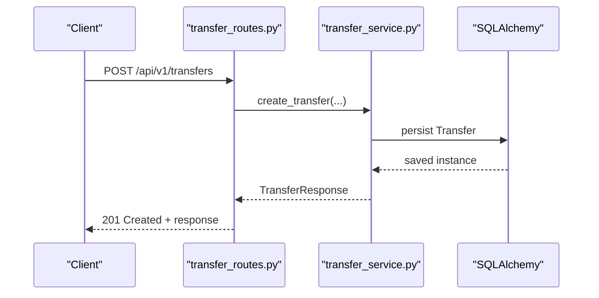
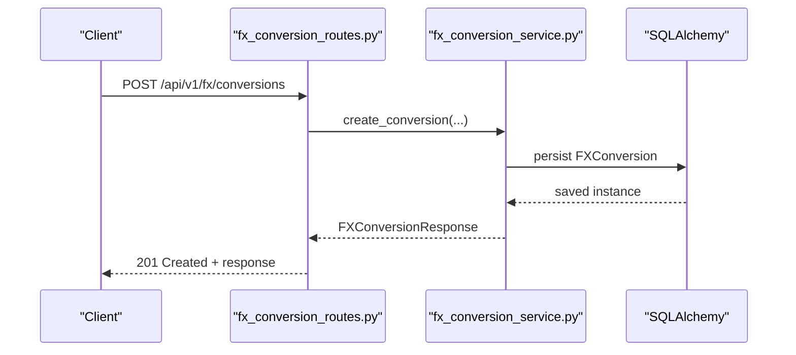
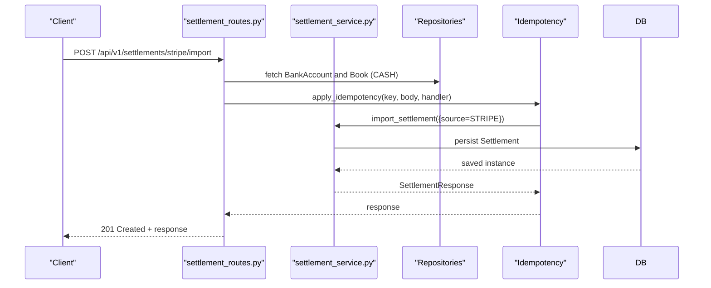
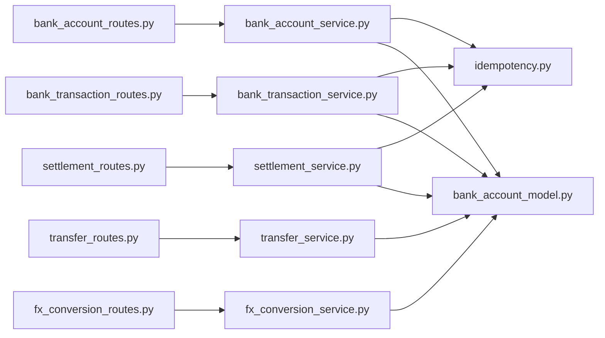

# Treasury API

<cite>
**Referenced Files in This Document**
- [app/main.py](file://app/main.py)
- [app/api/v1/__init__.py](file://app/api/v1/__init__.py)
- [app/modules/treasury/api/routes/bank_account_routes.py](file://app/modules/treasury/api/routes/bank_account_routes.py)
- [app/modules/treasury/api/routes/bank_transaction_routes.py](file://app/modules/treasury/api/routes/bank_transaction_routes.py)
- [app/modules/treasury/api/routes/transfer_routes.py](file://app/modules/treasury/api/routes/transfer_routes.py)
- [app/modules/treasury/api/routes/fx_conversion_routes.py](file://app/modules/treasury/api/routes/fx_conversion_routes.py)
- [app/modules/treasury/api/routes/settlement_routes.py](file://app/modules/treasury/api/routes/settlement_routes.py)
- [app/modules/treasury/schemas/bank_account_schemas.py](file://app/modules/treasury/schemas/bank_account_schemas.py)
- [app/modules/treasury/schemas/bank_transaction_schemas.py](file://app/modules/treasury/schemas/bank_transaction_schemas.py)
- [app/modules/treasury/schemas/transfer_schemas.py](file://app/modules/treasury/schemas/transfer_schemas.py)
- [app/modules/treasury/schemas/fx_conversion_schemas.py](file://app/modules/treasury/schemas/fx_conversion_schemas.py)
- [app/modules/treasury/schemas/settlement_schemas.py](file://app/modules/treasury/schemas/settlement_schemas.py)
- [app/modules/treasury/models/bank_account_model.py](file://app/modules/treasury/models/bank_account_model.py)
- [app/modules/treasury/services/bank_account_service.py](file://app/modules/treasury/services/bank_account_service.py)
- [app/modules/treasury/services/bank_transaction_service.py](file://app/modules/treasury/services/bank_transaction_service.py)
- [app/modules/treasury/services/transfer_service.py](file://app/modules/treasury/services/transfer_service.py)
- [app/modules/treasury/services/fx_conversion_service.py](file://app/modules/treasury/services/fx_conversion_service.py)
- [app/modules/treasury/services/settlement_service.py](file://app/modules/treasury/services/settlement_service.py)
- [app/core/idempotency.py](file://app/core/idempotency.py)
- [app/core/endpoint_keys.py](file://app/core/endpoint_keys.py)
- [app/core/exceptions.py](file://app/core/exceptions.py)
</cite>

## Table of Contents
1. [Introduction](#introduction)
2. [Project Structure](#project-structure)
3. [Core Components](#core-components)
4. [Architecture Overview](#architecture-overview)
5. [Detailed Component Analysis](#detailed-component-analysis)
6. [Dependency Analysis](#dependency-analysis)
7. [Performance Considerations](#performance-considerations)
8. [Troubleshooting Guide](#troubleshooting-guide)
9. [Conclusion](#conclusion)

## Introduction
This document provides comprehensive API documentation for the Treasury module, covering bank account management, bank transaction processing (including imports, categorization, and reconciliation), transfer operations (internal transfers, external payments, and multi-currency transfers), and foreign exchange conversion with rate management and hedging. It also documents request/response schemas, validation rules, and error handling for treasury workflows.

The Treasury API is exposed under the `/api/v1` base path and organized into five primary resource groups:
- Bank Accounts
- Bank Transactions
- Transfers
- FX Conversions
- Settlements

## Project Structure
The Treasury endpoints are integrated into the main FastAPI application via the v1 router. Each endpoint group is implemented as a dedicated router module and backed by service-layer logic and Pydantic schemas for validation.

**Diagram sources**
- [app/main.py](file://app/main.py#L29-L30)
- [app/api/v1/__init__.py](file://app/api/v1/__init__.py#L10-L48)

**Section sources**
- [app/main.py](file://app/main.py#L1-L54)
- [app/api/v1/__init__.py](file://app/api/v1/__init__.py#L1-L72)

## Core Components
- Bank Accounts: CRUD operations for bank accounts with currency and WPS support.
- Bank Transactions: Single transaction creation and bulk CSV import with idempotency and cursor pagination.
- Transfers: Internal and external transfers supporting multi-currency amounts.
- FX Conversions: Currency conversion records with rate source tracking.
- Settlements: Settlement creation and provider-specific imports (Stripe, TELR) with idempotency.

Validation is enforced via Pydantic schemas with explicit constraints (min/max lengths, numeric bounds, enums). Error handling uses HTTPException with appropriate status codes and standardized messages.

**Section sources**
- [app/modules/treasury/api/routes/bank_account_routes.py](file://app/modules/treasury/api/routes/bank_account_routes.py#L1-L88)
- [app/modules/treasury/api/routes/bank_transaction_routes.py](file://app/modules/treasury/api/routes/bank_transaction_routes.py#L1-L184)
- [app/modules/treasury/api/routes/transfer_routes.py](file://app/modules/treasury/api/routes/transfer_routes.py#L1-L83)
- [app/modules/treasury/api/routes/fx_conversion_routes.py](file://app/modules/treasury/api/routes/fx_conversion_routes.py#L1-L81)
- [app/modules/treasury/api/routes/settlement_routes.py](file://app/modules/treasury/api/routes/settlement_routes.py#L1-L232)

## Architecture Overview
The Treasury API follows a layered architecture:
- Routers: Define endpoints, handle routing, and orchestrate service calls.
- Services: Encapsulate business logic and coordinate repositories.
- Schemas: Define request/response models with validation.
- Models: SQLAlchemy ORM models for persistence.
- Idempotency: Applied to sensitive endpoints to prevent duplicate processing.

**Diagram sources**
- [app/modules/treasury/api/routes/bank_account_routes.py](file://app/modules/treasury/api/routes/bank_account_routes.py#L1-L88)
- [app/modules/treasury/api/routes/bank_transaction_routes.py](file://app/modules/treasury/api/routes/bank_transaction_routes.py#L1-L184)
- [app/modules/treasury/api/routes/transfer_routes.py](file://app/modules/treasury/api/routes/transfer_routes.py#L1-L83)
- [app/modules/treasury/api/routes/fx_conversion_routes.py](file://app/modules/treasury/api/routes/fx_conversion_routes.py#L1-L81)
- [app/modules/treasury/api/routes/settlement_routes.py](file://app/modules/treasury/api/routes/settlement_routes.py#L1-L232)
- [app/modules/treasury/models/bank_account_model.py](file://app/modules/treasury/models/bank_account_model.py#L1-L36)

## Detailed Component Analysis

### Bank Accounts
- Purpose: Manage bank accounts per legal entity, including currency and WPS configuration.
- Endpoints:
  - POST /api/v1/bank-accounts: Create a bank account.
  - GET /api/v1/bank-accounts: List accounts for an entity (active only by default).
  - GET /api/v1/bank-accounts/{account_id}: Retrieve a specific account.
  - PATCH /api/v1/bank-accounts/{account_id}: Update account metadata (name, activity, WPS settings).
- Validation:
  - Account name, bank name, and currency length constraints.
  - Optional fields for account number, bank code, type, and WPS agent ID.
- Error Handling:
  - 404 Not Found for missing accounts/legal entities.
  - 400 Bad Request for validation errors.
- Request/Response Schemas:
  - Create: [BankAccountCreate](file://app/modules/treasury/schemas/bank_account_schemas.py#L7-L17)
  - Update: [BankAccountUpdate](file://app/modules/treasury/schemas/bank_account_schemas.py#L20-L25)
  - Response: [BankAccountResponse](file://app/modules/treasury/schemas/bank_account_schemas.py#L28-L42)

**Diagram sources**
- [app/modules/treasury/api/routes/bank_account_routes.py](file://app/modules/treasury/api/routes/bank_account_routes.py#L18-L37)
- [app/modules/treasury/services/bank_account_service.py](file://app/modules/treasury/services/bank_account_service.py)

**Section sources**
- [app/modules/treasury/api/routes/bank_account_routes.py](file://app/modules/treasury/api/routes/bank_account_routes.py#L1-L88)
- [app/modules/treasury/schemas/bank_account_schemas.py](file://app/modules/treasury/schemas/bank_account_schemas.py#L1-L46)
- [app/modules/treasury/models/bank_account_model.py](file://app/modules/treasury/models/bank_account_model.py#L1-L36)

### Bank Transactions
- Purpose: Record individual bank transactions and import batches from CSV with idempotency.
- Endpoints:
  - POST /api/v1/bank-transactions: Create a single transaction.
  - POST /api/v1/bank-transactions/import: Import CSV transactions with idempotency and deduplication.
  - GET /api/v1/bank-transactions: Paginate with cursor.
  - GET /api/v1/bank-transactions/{transaction_id}: Retrieve a transaction.
  - GET /api/v1/bank-transactions/accounts/{bank_account_id}/transactions: Filtered listing by account and date range.
- Validation:
  - Amount and currency constraints; transaction type enum; optional fields for counterparties and balances.
  - CSV import requires a batch identifier and non-empty transaction list.
- Idempotency:
  - Uses endpoint keys and computes a source key from normalized transaction data.
- Error Handling:
  - 404 Not Found for missing entities.
  - 400 Bad Request for validation errors.
  - 409 Conflict for duplicates.
- Request/Response Schemas:
  - Create: [BankTransactionCreate](file://app/modules/treasury/schemas/bank_transaction_schemas.py#L9-L22)
  - CSV Import: [BankTransactionCSVImport](file://app/modules/treasury/schemas/bank_transaction_schemas.py#L25-L29)
  - Response: [BankTransactionResponse](file://app/modules/treasury/schemas/bank_transaction_schemas.py#L32-L50)
  - List: [BankTransactionListResponse](file://app/modules/treasury/schemas/bank_transaction_schemas.py#L56-L61)

**Diagram sources**
- [app/modules/treasury/api/routes/bank_transaction_routes.py](file://app/modules/treasury/api/routes/bank_transaction_routes.py#L55-L124)
- [app/core/idempotency.py](file://app/core/idempotency.py)
- [app/core/endpoint_keys.py](file://app/core/endpoint_keys.py)

**Section sources**
- [app/modules/treasury/api/routes/bank_transaction_routes.py](file://app/modules/treasury/api/routes/bank_transaction_routes.py#L1-L184)
- [app/modules/treasury/schemas/bank_transaction_schemas.py](file://app/modules/treasury/schemas/bank_transaction_schemas.py#L1-L62)
- [app/core/idempotency.py](file://app/core/idempotency.py)
- [app/core/endpoint_keys.py](file://app/core/endpoint_keys.py)

### Transfers
- Purpose: Move funds between bank accounts (internal) or to another legal entity (external), supporting multi-currency.
- Endpoints:
  - POST /api/v1/transfers: Create a transfer.
  - GET /api/v1/transfers: List transfers for an entity with filters.
  - GET /api/v1/transfers/{transfer_id}: Retrieve a transfer.
- Validation:
  - Positive amount and 3-letter currency; either both accounts or both entities must be provided depending on type.
- Error Handling:
  - 404 Not Found for missing entities.
  - 400 Bad Request for validation errors.
  - 409 Conflict for duplicates.
- Request/Response Schemas:
  - Create: [TransferCreate](file://app/modules/treasury/schemas/transfer_schemas.py#L9-L21)
  - Response: [TransferResponse](file://app/modules/treasury/schemas/transfer_schemas.py#L24-L42)

**Diagram sources**
- [app/modules/treasury/api/routes/transfer_routes.py](file://app/modules/treasury/api/routes/transfer_routes.py#L19-L46)
- [app/modules/treasury/services/transfer_service.py](file://app/modules/treasury/services/transfer_service.py)

**Section sources**
- [app/modules/treasury/api/routes/transfer_routes.py](file://app/modules/treasury/api/routes/transfer_routes.py#L1-L83)
- [app/modules/treasury/schemas/transfer_schemas.py](file://app/modules/treasury/schemas/transfer_schemas.py#L1-L43)

### FX Conversions
- Purpose: Record currency conversions with explicit rates and optional bank account linkage.
- Endpoints:
  - POST /api/v1/fx/conversions: Create an FX conversion.
  - GET /api/v1/fx/conversions: List conversions for an entity.
  - GET /api/v1/fx/conversions/{conversion_id}: Retrieve a conversion.
- Validation:
  - Positive amounts and rate; 3-letter currencies; rate source required.
- Error Handling:
  - 404 Not Found for missing entities.
  - 400 Bad Request for validation errors.
  - 409 Conflict for duplicates.
- Request/Response Schemas:
  - Create: [FXConversionCreate](file://app/modules/treasury/schemas/fx_conversion_schemas.py#L8-L21)
  - Response: [FXConversionResponse](file://app/modules/treasury/schemas/fx_conversion_schemas.py#L24-L41)

**Diagram sources**
- [app/modules/treasury/api/routes/fx_conversion_routes.py](file://app/modules/treasury/api/routes/fx_conversion_routes.py#L18-L46)
- [app/modules/treasury/services/fx_conversion_service.py](file://app/modules/treasury/services/fx_conversion_service.py)

**Section sources**
- [app/modules/treasury/api/routes/fx_conversion_routes.py](file://app/modules/treasury/api/routes/fx_conversion_routes.py#L1-L81)
- [app/modules/treasury/schemas/fx_conversion_schemas.py](file://app/modules/treasury/schemas/fx_conversion_schemas.py#L1-L44)

### Settlements
- Purpose: Record settlement events from external payment providers with idempotency.
- Endpoints:
  - POST /api/v1/settlements: Create a settlement.
  - POST /api/v1/settlements/stripe/import: Import Stripe settlement.
  - POST /api/v1/settlements/telr/import: Import TELR settlement.
  - GET /api/v1/settlements: List settlements for an entity.
  - GET /api/v1/settlements/{settlement_id}: Retrieve a settlement.
- Validation:
  - Gross, fees, and net amounts are non-negative; currency is 3-letter; external identifiers optional.
- Idempotency:
  - Uses endpoint keys specific to creation and provider imports; computes source key from request body.
- Error Handling:
  - 404 Not Found for missing entities or books.
  - 400 Bad Request for validation errors.
  - 409 Conflict for duplicates.
- Request/Response Schemas:
  - Create: [SettlementCreate](file://app/modules/treasury/schemas/settlement_schemas.py#L9-L22)
  - Import: [SettlementImport](file://app/modules/treasury/schemas/settlement_schemas.py#L24-L36)
  - Response: [SettlementResponse](file://app/modules/treasury/schemas/settlement_schemas.py#L39-L57)

**Diagram sources**
- [app/modules/treasury/api/routes/settlement_routes.py](file://app/modules/treasury/api/routes/settlement_routes.py#L92-L140)
- [app/core/idempotency.py](file://app/core/idempotency.py)
- [app/core/endpoint_keys.py](file://app/core/endpoint_keys.py)

**Section sources**
- [app/modules/treasury/api/routes/settlement_routes.py](file://app/modules/treasury/api/routes/settlement_routes.py#L1-L232)
- [app/modules/treasury/schemas/settlement_schemas.py](file://app/modules/treasury/schemas/settlement_schemas.py#L1-L58)
- [app/core/idempotency.py](file://app/core/idempotency.py)
- [app/core/endpoint_keys.py](file://app/core/endpoint_keys.py)

## Dependency Analysis
- Routers depend on services for business logic and on Pydantic schemas for validation.
- Services depend on repositories and models for persistence and on idempotency utilities for safe reprocessing.
- Idempotency depends on endpoint keys and request normalization to compute deterministic source keys.

**Diagram sources**
- [app/modules/treasury/api/routes/bank_account_routes.py](file://app/modules/treasury/api/routes/bank_account_routes.py#L1-L88)
- [app/modules/treasury/api/routes/bank_transaction_routes.py](file://app/modules/treasury/api/routes/bank_transaction_routes.py#L1-L184)
- [app/modules/treasury/api/routes/transfer_routes.py](file://app/modules/treasury/api/routes/transfer_routes.py#L1-L83)
- [app/modules/treasury/api/routes/fx_conversion_routes.py](file://app/modules/treasury/api/routes/fx_conversion_routes.py#L1-L81)
- [app/modules/treasury/api/routes/settlement_routes.py](file://app/modules/treasury/api/routes/settlement_routes.py#L1-L232)
- [app/modules/treasury/models/bank_account_model.py](file://app/modules/treasury/models/bank_account_model.py#L1-L36)
- [app/core/idempotency.py](file://app/core/idempotency.py)

**Section sources**
- [app/modules/treasury/api/routes/bank_account_routes.py](file://app/modules/treasury/api/routes/bank_account_routes.py#L1-L88)
- [app/modules/treasury/api/routes/bank_transaction_routes.py](file://app/modules/treasury/api/routes/bank_transaction_routes.py#L1-L184)
- [app/modules/treasury/api/routes/transfer_routes.py](file://app/modules/treasury/api/routes/transfer_routes.py#L1-L83)
- [app/modules/treasury/api/routes/fx_conversion_routes.py](file://app/modules/treasury/api/routes/fx_conversion_routes.py#L1-L81)
- [app/modules/treasury/api/routes/settlement_routes.py](file://app/modules/treasury/api/routes/settlement_routes.py#L1-L232)
- [app/modules/treasury/models/bank_account_model.py](file://app/modules/treasury/models/bank_account_model.py#L1-L36)
- [app/core/idempotency.py](file://app/core/idempotency.py)

## Performance Considerations
- Cursor Pagination: Bank transactions endpoint supports cursor-based pagination to efficiently handle large datasets.
- Idempotency: Applied to import endpoints to avoid redundant processing and reduce duplicate writes.
- Validation Early Exit: Pydantic validation prevents unnecessary downstream processing for invalid requests.
- Asynchronous Sessions: Endpoints use async database sessions to improve throughput.

[No sources needed since this section provides general guidance]

## Troubleshooting Guide
Common issues and resolutions:
- Validation Errors (400):
  - Ensure required fields meet constraints (lengths, numeric bounds).
  - Verify enum values for transaction types and sources.
- Not Found Errors (404):
  - Confirm entity/account identifiers exist.
  - For settlements, ensure a CASH book exists for the legal entity.
- Duplicate Entry Errors (409):
  - Use idempotency keys for imports to prevent duplicates.
  - Review external identifiers and normalized request bodies.
- Idempotency Failures:
  - Ensure endpoint keys and request normalization are consistent.
  - Check computed source keys for identical imports.

**Section sources**
- [app/core/exceptions.py](file://app/core/exceptions.py)
- [app/modules/treasury/api/routes/bank_transaction_routes.py](file://app/modules/treasury/api/routes/bank_transaction_routes.py#L55-L124)
- [app/modules/treasury/api/routes/settlement_routes.py](file://app/modules/treasury/api/routes/settlement_routes.py#L92-L140)

## Conclusion
The Treasury API provides a robust set of endpoints for managing bank accounts, processing transactions, executing transfers, performing foreign exchange conversions, and recording settlements. With strict validation, idempotency safeguards, and clear request/response schemas, it supports reliable treasury operations across internal transfers, external payments, and multi-currency workflows.