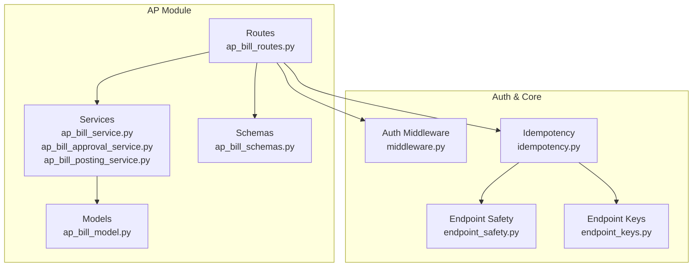
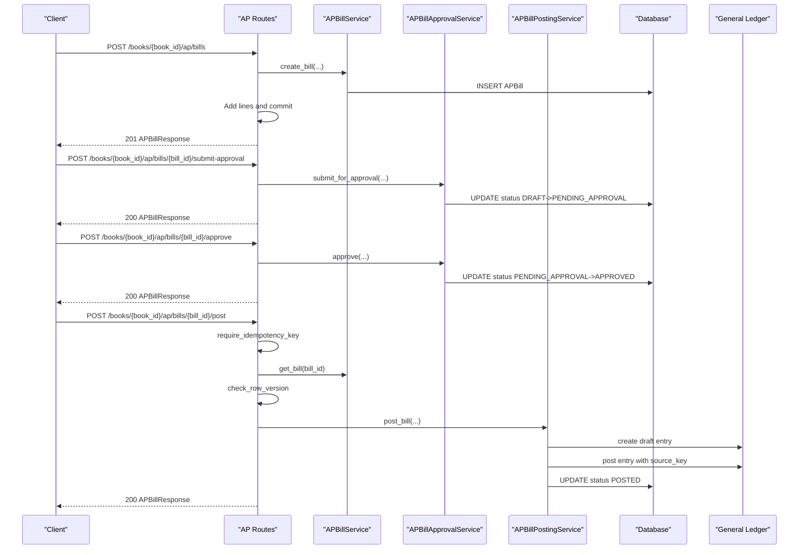
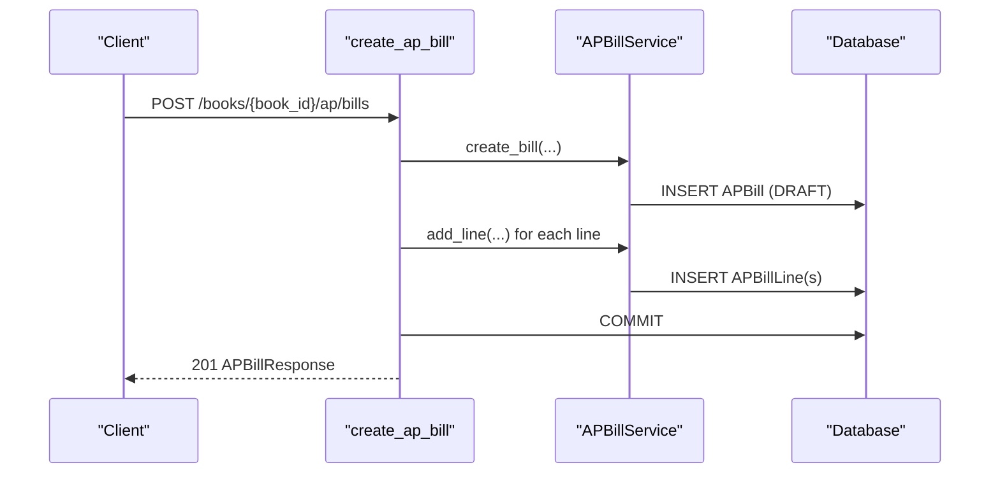
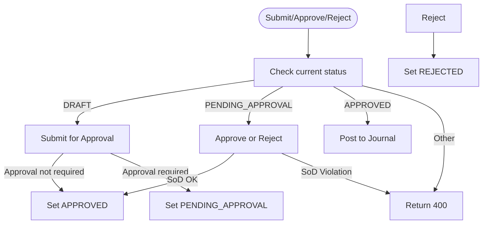
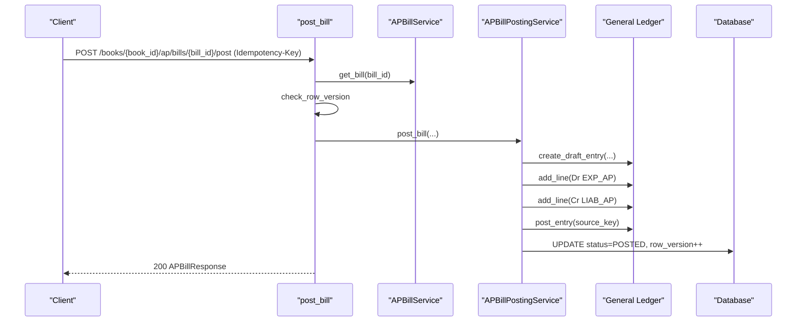
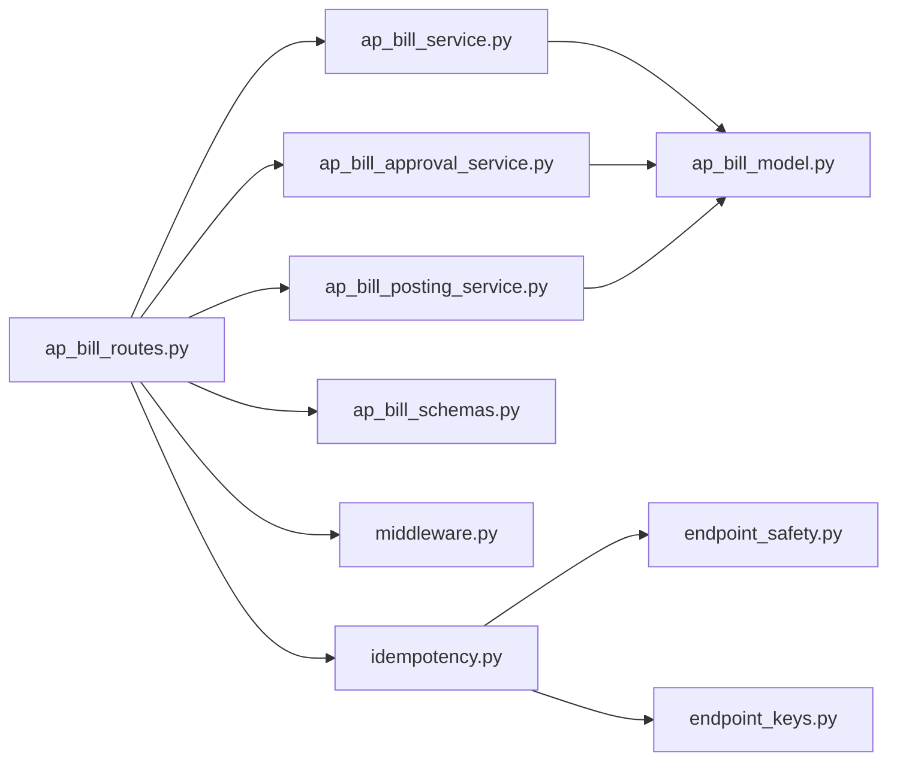

# AP API Endpoints

<cite>
**Referenced Files in This Document**
- [ap_bill_routes.py](file://app/modules/ap/api/routes/ap_bill_routes.py)
- [ap_bill_schemas.py](file://app/modules/ap/schemas/ap_bill_schemas.py)
- [ap_bill_service.py](file://app/modules/ap/services/ap_bill_service.py)
- [ap_bill_approval_service.py](file://app/modules/ap/services/ap_bill_approval_service.py)
- [ap_bill_posting_service.py](file://app/modules/ap/services/ap_bill_posting_service.py)
- [ap_bill_model.py](file://app/modules/ap/models/ap_bill_model.py)
- [middleware.py](file://app/auth/middleware.py)
- [idempotency.py](file://app/core/idempotency.py)
- [endpoint_safety.py](file://app/core/endpoint_safety.py)
- [endpoint_keys.py](file://app/core/endpoint_keys.py)
</cite>

## Table of Contents
1. [Introduction](#introduction)
2. [Project Structure](#project-structure)
3. [Core Components](#core-components)
4. [Architecture Overview](#architecture-overview)
5. [Detailed Component Analysis](#detailed-component-analysis)
6. [Dependency Analysis](#dependency-analysis)
7. [Performance Considerations](#performance-considerations)
8. [Troubleshooting Guide](#troubleshooting-guide)
9. [Conclusion](#conclusion)

## Introduction
This document provides comprehensive API documentation for the Accounts Payable (AP) endpoints. It covers HTTP methods, URL patterns, request/response schemas, validation rules, authentication requirements, and error handling for bill creation, listing, retrieval, approval workflows, and posting operations. It also documents idempotency handling for the posting endpoint, security considerations, and integration patterns.

## Project Structure
The AP API is implemented under the AP module with routes, schemas, services, and models organized by feature. The routing layer defines endpoints, while services encapsulate business logic and models define persistence and state.

**Diagram sources**
- [ap_bill_routes.py](file://app/modules/ap/api/routes/ap_bill_routes.py#L1-L262)
- [ap_bill_service.py](file://app/modules/ap/services/ap_bill_service.py#L1-L111)
- [ap_bill_approval_service.py](file://app/modules/ap/services/ap_bill_approval_service.py#L1-L229)
- [ap_bill_posting_service.py](file://app/modules/ap/services/ap_bill_posting_service.py#L1-L127)
- [ap_bill_model.py](file://app/modules/ap/models/ap_bill_model.py#L1-L102)
- [ap_bill_schemas.py](file://app/modules/ap/schemas/ap_bill_schemas.py#L1-L114)
- [middleware.py](file://app/auth/middleware.py#L1-L140)
- [idempotency.py](file://app/core/idempotency.py#L1-L482)
- [endpoint_safety.py](file://app/core/endpoint_safety.py#L1-L118)
- [endpoint_keys.py](file://app/core/endpoint_keys.py#L1-L43)

**Section sources**
- [ap_bill_routes.py](file://app/modules/ap/api/routes/ap_bill_routes.py#L1-L28)
- [ap_bill_service.py](file://app/modules/ap/services/ap_bill_service.py#L1-L22)
- [ap_bill_approval_service.py](file://app/modules/ap/services/ap_bill_approval_service.py#L1-L33)
- [ap_bill_posting_service.py](file://app/modules/ap/services/ap_bill_posting_service.py#L1-L26)
- [ap_bill_model.py](file://app/modules/ap/models/ap_bill_model.py#L1-L20)
- [ap_bill_schemas.py](file://app/modules/ap/schemas/ap_bill_schemas.py#L1-L11)
- [middleware.py](file://app/auth/middleware.py#L1-L14)
- [idempotency.py](file://app/core/idempotency.py#L1-L21)
- [endpoint_safety.py](file://app/core/endpoint_safety.py#L1-L20)
- [endpoint_keys.py](file://app/core/endpoint_keys.py#L1-L11)

## Core Components
- Routes: Define HTTP endpoints, path parameters, query parameters, request bodies, and response models.
- Services: Encapsulate business logic for bill creation, line management, approval workflows, and posting to journals.
- Models: Define persistent state and relationships for bills, lines, and statuses.
- Schemas: Define request/response Pydantic models for validation and serialization.
- Auth/Middleware: Enforce JWT-based authentication and service access checks.
- Idempotency: Provide idempotent request handling for posting operations.

**Section sources**
- [ap_bill_routes.py](file://app/modules/ap/api/routes/ap_bill_routes.py#L28-L262)
- [ap_bill_service.py](file://app/modules/ap/services/ap_bill_service.py#L15-L111)
- [ap_bill_approval_service.py](file://app/modules/ap/services/ap_bill_approval_service.py#L26-L229)
- [ap_bill_posting_service.py](file://app/modules/ap/services/ap_bill_posting_service.py#L16-L127)
- [ap_bill_model.py](file://app/modules/ap/models/ap_bill_model.py#L10-L69)
- [ap_bill_schemas.py](file://app/modules/ap/schemas/ap_bill_schemas.py#L10-L114)
- [middleware.py](file://app/auth/middleware.py#L17-L106)
- [idempotency.py](file://app/core/idempotency.py#L207-L251)

## Architecture Overview
The AP API follows a layered architecture:
- Router layer validates inputs and delegates to services.
- Service layer enforces business rules, optimistic locking, and SoD checks.
- Model layer persists state and relationships.
- Idempotency layer ensures safe retries for posting operations.

**Diagram sources**
- [ap_bill_routes.py](file://app/modules/ap/api/routes/ap_bill_routes.py#L31-L262)
- [ap_bill_service.py](file://app/modules/ap/services/ap_bill_service.py#L23-L111)
- [ap_bill_approval_service.py](file://app/modules/ap/services/ap_bill_approval_service.py#L34-L204)
- [ap_bill_posting_service.py](file://app/modules/ap/services/ap_bill_posting_service.py#L27-L112)
- [idempotency.py](file://app/core/idempotency.py#L219-L482)

## Detailed Component Analysis

### Authentication and Authorization
- Authentication: All endpoints require a valid Bearer token. The middleware validates tokens against a central auth service or locally if configured.
- Access Control: Users must have access to the financial management service; otherwise, a 403 Forbidden is returned.
- Permissions: The system supports role-based permissions; administrative roles bypass most checks.

**Section sources**
- [middleware.py](file://app/auth/middleware.py#L17-L106)

### Bill Creation Endpoint
- Method and Path: POST /books/{book_id}/ap/bills
- Authentication: Required
- Request Body Schema: APBillCreate
  - legal_entity_id: UUID
  - ap_vendor_id: UUID
  - bill_number: string
  - bill_date: date
  - due_date: optional date
  - currency: string (default USD)
  - description: optional string
  - reference_number: optional string
  - lines: array of APBillLineCreate
- Response: APBillResponse (status defaults to DRAFT)
- Validation Rules:
  - Bill number must be unique per entity/book.
  - Lines can only be added when status is DRAFT.
  - Currency must be a valid ISO code.
- Error Responses:
  - 400: Validation errors (e.g., invalid status for adding lines).
  - 404: Not found when vendor/entity references are invalid.

**Diagram sources**
- [ap_bill_routes.py](file://app/modules/ap/api/routes/ap_bill_routes.py#L31-L81)
- [ap_bill_service.py](file://app/modules/ap/services/ap_bill_service.py#L23-L91)

**Section sources**
- [ap_bill_routes.py](file://app/modules/ap/api/routes/ap_bill_routes.py#L31-L81)
- [ap_bill_schemas.py](file://app/modules/ap/schemas/ap_bill_schemas.py#L21-L32)
- [ap_bill_service.py](file://app/modules/ap/services/ap_bill_service.py#L23-L91)

### Bill Listing Endpoint
- Method and Path: GET /books/{book_id}/ap/bills
- Query Parameters:
  - vendor_id: optional UUID
  - status: optional enum (DRAFT, PENDING_APPROVAL, APPROVED, REJECTED, POSTED, CANCELLED)
- Response: Array of APBillResponse
- Notes: Entity filtering uses book_id; entity_id placeholder remains pending book-to-entity resolution.

**Section sources**
- [ap_bill_routes.py](file://app/modules/ap/api/routes/ap_bill_routes.py#L83-L100)
- [ap_bill_model.py](file://app/modules/ap/models/ap_bill_model.py#L10-L18)

### Bill Retrieval Endpoint
- Method and Path: GET /books/{book_id}/ap/bills/{bill_id}
- Response: APBillResponse with lines populated
- Error Responses:
  - 404: Bill not found

**Section sources**
- [ap_bill_routes.py](file://app/modules/ap/api/routes/ap_bill_routes.py#L103-L120)

### Approval Workflow Endpoints
- Submit for Approval: POST /books/{book_id}/ap/bills/{bill_id}/submit-approval
  - Request Body: APBillSubmitApprovalRequest (reason optional, row_version required)
  - Behavior: Transitions DRAFT to PENDING_APPROVAL; if approval not required, transitions to APPROVED.
  - Error Responses: 400 for invalid status, 404 for not found.
- Approve: POST /books/{book_id}/ap/bills/{bill_id}/approve
  - Request Body: APBillApproveRequest (reason optional, override_reason optional for SoD override, row_version required)
  - Behavior: Transitions PENDING_APPROVAL to APPROVED; performs SoD validation.
  - Error Responses: 400 for invalid status or SoD violations, 404 for not found.
- Reject: POST /books/{book_id}/ap/bills/{bill_id}/reject
  - Request Body: APBillRejectRequest (reason required, row_version required)
  - Behavior: Transitions PENDING_APPROVAL to REJECTED.
  - Error Responses: 400 for invalid status or missing reason, 404 for not found.

**Diagram sources**
- [ap_bill_approval_service.py](file://app/modules/ap/services/ap_bill_approval_service.py#L34-L204)
- [ap_bill_model.py](file://app/modules/ap/models/ap_bill_model.py#L10-L18)

**Section sources**
- [ap_bill_routes.py](file://app/modules/ap/api/routes/ap_bill_routes.py#L123-L194)
- [ap_bill_schemas.py](file://app/modules/ap/schemas/ap_bill_schemas.py#L34-L51)
- [ap_bill_approval_service.py](file://app/modules/ap/services/ap_bill_approval_service.py#L34-L204)

### Posting Endpoint (Idempotent)
- Method and Path: POST /books/{book_id}/ap/bills/{bill_id}/post
- Authentication: Required
- Idempotency: Required via Idempotency-Key header; endpoint uses AP_BILL_POST constant.
- Request Body Schema: APBillPostRequest
  - reason: optional
  - idempotency_key: optional (header takes precedence)
  - row_version: required (optimistic locking)
- Behavior:
  - Validates bill belongs to the given book.
  - Checks row_version for optimistic locking.
  - Posts to General Ledger journal with source_key = "AP_BILL:POST:{bill_id}".
  - Updates bill status to POSTED and increments row_version.
- Idempotency Handling:
  - Canonical request hashing ensures stable replay.
  - Supports retry-after lock TTL; returns 409 with progress indicator.
  - Safe to auto-retry FAILED requests due to source_key uniqueness.

**Diagram sources**
- [ap_bill_routes.py](file://app/modules/ap/api/routes/ap_bill_routes.py#L196-L262)
- [ap_bill_posting_service.py](file://app/modules/ap/services/ap_bill_posting_service.py#L27-L112)
- [idempotency.py](file://app/core/idempotency.py#L219-L482)
- [endpoint_safety.py](file://app/core/endpoint_safety.py#L28-L29)
- [endpoint_keys.py](file://app/core/endpoint_keys.py#L10-L11)

**Section sources**
- [ap_bill_routes.py](file://app/modules/ap/api/routes/ap_bill_routes.py#L196-L262)
- [ap_bill_posting_service.py](file://app/modules/ap/services/ap_bill_posting_service.py#L27-L112)
- [idempotency.py](file://app/core/idempotency.py#L219-L482)
- [endpoint_safety.py](file://app/core/endpoint_safety.py#L28-L29)
- [endpoint_keys.py](file://app/core/endpoint_keys.py#L10-L11)

### Request/Response Schemas
- APBillCreate: Contains bill metadata and an array of APBillLineCreate.
- APBillLineCreate: Line-level fields including GL account, quantity, unit price, and tax code.
- APBillSubmitApprovalRequest/APBillApproveRequest/APBillRejectRequest/APBillPostRequest: Approval and posting request bodies with row_version and optional reasons.
- APBillResponse: Full bill representation including status, amounts, approval timestamps, and lines.

Validation highlights:
- Row version is mandatory for approval/posting to enforce optimistic concurrency.
- Bill must be in the correct status for each operation (e.g., DRAFT for submission, APPROVED for posting).
- Approval endpoints enforce SoD rules; rejection requires a reason.

**Section sources**
- [ap_bill_schemas.py](file://app/modules/ap/schemas/ap_bill_schemas.py#L10-L114)
- [ap_bill_model.py](file://app/modules/ap/models/ap_bill_model.py#L10-L69)

## Dependency Analysis
The AP routes depend on services and schemas, while services depend on repositories and models. Idempotency infrastructure integrates with endpoint safety and endpoint keys.

**Diagram sources**
- [ap_bill_routes.py](file://app/modules/ap/api/routes/ap_bill_routes.py#L1-L26)
- [ap_bill_service.py](file://app/modules/ap/services/ap_bill_service.py#L1-L12)
- [ap_bill_approval_service.py](file://app/modules/ap/services/ap_bill_approval_service.py#L1-L18)
- [ap_bill_posting_service.py](file://app/modules/ap/services/ap_bill_posting_service.py#L1-L13)
- [ap_bill_model.py](file://app/modules/ap/models/ap_bill_model.py#L1-L7)
- [ap_bill_schemas.py](file://app/modules/ap/schemas/ap_bill_schemas.py#L1-L7)
- [middleware.py](file://app/auth/middleware.py#L1-L14)
- [idempotency.py](file://app/core/idempotency.py#L1-L15)
- [endpoint_safety.py](file://app/core/endpoint_safety.py#L1-L19)
- [endpoint_keys.py](file://app/core/endpoint_keys.py#L1-L5)

**Section sources**
- [ap_bill_routes.py](file://app/modules/ap/api/routes/ap_bill_routes.py#L1-L26)
- [ap_bill_service.py](file://app/modules/ap/services/ap_bill_service.py#L1-L12)
- [ap_bill_approval_service.py](file://app/modules/ap/services/ap_bill_approval_service.py#L1-L18)
- [ap_bill_posting_service.py](file://app/modules/ap/services/ap_bill_posting_service.py#L1-L13)
- [idempotency.py](file://app/core/idempotency.py#L1-L15)

## Performance Considerations
- Idempotency TTL: Posting endpoints use a 60-second TTL for PENDING locks, allowing safe retries without race conditions.
- Canonical Request Hashing: Ensures stable replay and avoids duplicate processing.
- Response Size Limit: Stored responses are capped to prevent excessive storage usage.
- SoD Validation: Approval operations perform separation-of-duties checks; ensure minimal overhead by caching policy lookups where feasible.

[No sources needed since this section provides general guidance]

## Troubleshooting Guide
Common issues and resolutions:
- 401 Unauthorized: Verify Bearer token validity and that the auth service is reachable.
- 403 Forbidden: Confirm the user has financial_management service access.
- 400 Bad Request:
  - Missing row_version on approval/posting.
  - Invalid status transitions (e.g., posting a bill not in APPROVED).
  - Rejection without a reason.
- 404 Not Found: Bill ID not found or belongs to another book.
- 409 Conflict:
  - Idempotency key reused with different payload.
  - Idempotency key currently processing; wait for Retry-After.
- 425 Too Early: Idempotency key is pending; retry after the indicated delay.

**Section sources**
- [middleware.py](file://app/auth/middleware.py#L30-L56)
- [ap_bill_approval_service.py](file://app/modules/ap/services/ap_bill_approval_service.py#L55-L79)
- [ap_bill_posting_service.py](file://app/modules/ap/services/ap_bill_posting_service.py#L42-L44)
- [idempotency.py](file://app/core/idempotency.py#L154-L166)
- [ap_bill_routes.py](file://app/modules/ap/api/routes/ap_bill_routes.py#L208-L212)

## Conclusion
The AP API provides a robust, secure, and idempotent interface for managing vendor bills. It enforces strong validation, optimistic locking, and separation-of-duties controls, while offering clear approval workflows and safe posting operations with idempotency guarantees.