# AP Business Workflows

<cite>
**Referenced Files in This Document**
- [ap_bill_model.py](file://app/modules/ap/models/ap_bill_model.py)
- [ap_vendor_model.py](file://app/modules/ap/models/ap_vendor_model.py)
- [ap_withholding_model.py](file://app/modules/ap/models/ap_withholding_model.py)
- [ap_bill_service.py](file://app/modules/ap/services/ap_bill_service.py)
- [ap_bill_approval_service.py](file://app/modules/ap/services/ap_bill_approval_service.py)
- [ap_bill_posting_service.py](file://app/modules/ap/services/ap_bill_posting_service.py)
- [ap_bill_routes.py](file://app/modules/ap/api/routes/ap_bill_routes.py)
- [ap_bill_schemas.py](file://app/modules/ap/schemas/ap_bill_schemas.py)
- [ap_bill_repository.py](file://app/modules/ap/repositories/ap_bill_repository.py)
- [approval_policy_model.py](file://app/modules/core/models/approval_policy_model.py)
- [audit_log_model.py](file://app/modules/core/models/audit_log_model.py)
- [sod_validator.py](file://app/modules/core/services/sod_validator.py)
- [journal_entry_model.py](file://app/modules/general_ledger/models/journal_entry_model.py)
- [journal_entry_service.py](file://app/modules/general_ledger/services/journal_entry_service.py)
- [fm_schema.sql](file://database/fm_schema.sql)
</cite>

## Table of Contents
1. [Introduction](#introduction)
2. [Project Structure](#project-structure)
3. [Core Components](#core-components)
4. [Architecture Overview](#architecture-overview)
5. [Detailed Component Analysis](#detailed-component-analysis)
6. [Dependency Analysis](#dependency-analysis)
7. [Performance Considerations](#performance-considerations)
8. [Troubleshooting Guide](#troubleshooting-guide)
9. [Conclusion](#conclusion)
10. [Appendices](#appendices)

## Introduction
This document describes the Accounts Payable (AP) business workflows and processes implemented in the system. It covers the complete bill lifecycle from vendor onboarding through payment processing, including approval workflows, policy enforcement, authorization patterns, and posting to the general ledger with journal entry generation. It also documents exception handling, rollback mechanisms, error recovery, compliance requirements, and audit trail generation.

## Project Structure
The AP domain is organized around models, repositories, services, schemas, and API routes. Supporting modules include approval policies, audit logging, segregation of duties (SoD), and general ledger integration.

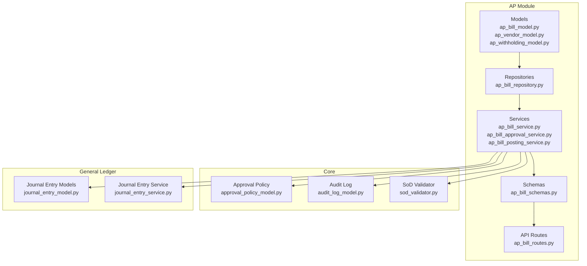

**Diagram sources**
- [ap_bill_model.py](file://app/modules/ap/models/ap_bill_model.py#L20-L102)
- [ap_vendor_model.py](file://app/modules/ap/models/ap_vendor_model.py#L8-L40)
- [ap_withholding_model.py](file://app/modules/ap/models/ap_withholding_model.py#L9-L32)
- [ap_bill_repository.py](file://app/modules/ap/repositories/ap_bill_repository.py#L11-L38)
- [ap_bill_service.py](file://app/modules/ap/services/ap_bill_service.py#L15-L111)
- [ap_bill_approval_service.py](file://app/modules/ap/services/ap_bill_approval_service.py#L26-L229)
- [ap_bill_posting_service.py](file://app/modules/ap/services/ap_bill_posting_service.py#L16-L127)
- [ap_bill_schemas.py](file://app/modules/ap/schemas/ap_bill_schemas.py#L10-L114)
- [ap_bill_routes.py](file://app/modules/ap/api/routes/ap_bill_routes.py#L1-L262)
- [approval_policy_model.py](file://app/modules/core/models/approval_policy_model.py#L18-L36)
- [audit_log_model.py](file://app/modules/core/models/audit_log_model.py#L9-L43)
- [sod_validator.py](file://app/modules/core/services/sod_validator.py#L55-L63)
- [journal_entry_model.py](file://app/modules/general_ledger/models/journal_entry_model.py#L17-L128)
- [journal_entry_service.py](file://app/modules/general_ledger/services/journal_entry_service.py#L40-L635)

**Section sources**
- [ap_bill_model.py](file://app/modules/ap/models/ap_bill_model.py#L1-L102)
- [ap_bill_routes.py](file://app/modules/ap/api/routes/ap_bill_routes.py#L1-L262)

## Core Components
- AP Bill model defines lifecycle states, financial totals, approval and posting metadata, and relationships to vendor, lines, allocations, and journal entry.
- AP Vendor model captures vendor master data and banking details.
- AP Withholding Profile model supports optional tax-withholding configurations.
- AP Bill Service handles creation, line addition, listing, and retrieval.
- AP Bill Approval Service enforces state transitions, approval policy checks, SoD validation, and audit logging.
- AP Bill Posting Service posts bills to the general ledger, generating journal entries and updating bill status.
- API Routes expose endpoints for bill creation, listing, retrieval, approval actions, and posting with idempotency and row-version checks.
- Schemas define request/response contracts for all operations.
- Repositories encapsulate persistence queries.
- Approval Policy and Audit Log models support policy-driven approvals and compliance tracking.
- Journal Entry models and service manage ledger posting, balancing, and reversals.

**Section sources**
- [ap_bill_model.py](file://app/modules/ap/models/ap_bill_model.py#L10-L102)
- [ap_vendor_model.py](file://app/modules/ap/models/ap_vendor_model.py#L8-L40)
- [ap_withholding_model.py](file://app/modules/ap/models/ap_withholding_model.py#L9-L32)
- [ap_bill_service.py](file://app/modules/ap/services/ap_bill_service.py#L15-L111)
- [ap_bill_approval_service.py](file://app/modules/ap/services/ap_bill_approval_service.py#L26-L229)
- [ap_bill_posting_service.py](file://app/modules/ap/services/ap_bill_posting_service.py#L16-L127)
- [ap_bill_routes.py](file://app/modules/ap/api/routes/ap_bill_routes.py#L31-L262)
- [ap_bill_schemas.py](file://app/modules/ap/schemas/ap_bill_schemas.py#L21-L114)
- [ap_bill_repository.py](file://app/modules/ap/repositories/ap_bill_repository.py#L11-L38)
- [approval_policy_model.py](file://app/modules/core/models/approval_policy_model.py#L18-L36)
- [audit_log_model.py](file://app/modules/core/models/audit_log_model.py#L9-L43)
- [journal_entry_model.py](file://app/modules/general_ledger/models/journal_entry_model.py#L17-L128)
- [journal_entry_service.py](file://app/modules/general_ledger/services/journal_entry_service.py#L40-L635)

## Architecture Overview
The AP workflow follows a layered architecture:
- API routes accept requests and orchestrate operations.
- Services encapsulate business logic for bill lifecycle, approvals, and posting.
- Repositories handle data access.
- Models define domain entities and relationships.
- General Ledger integrates for journal entry creation and posting.
- Core modules enforce approvals, SoD, and audit trails.

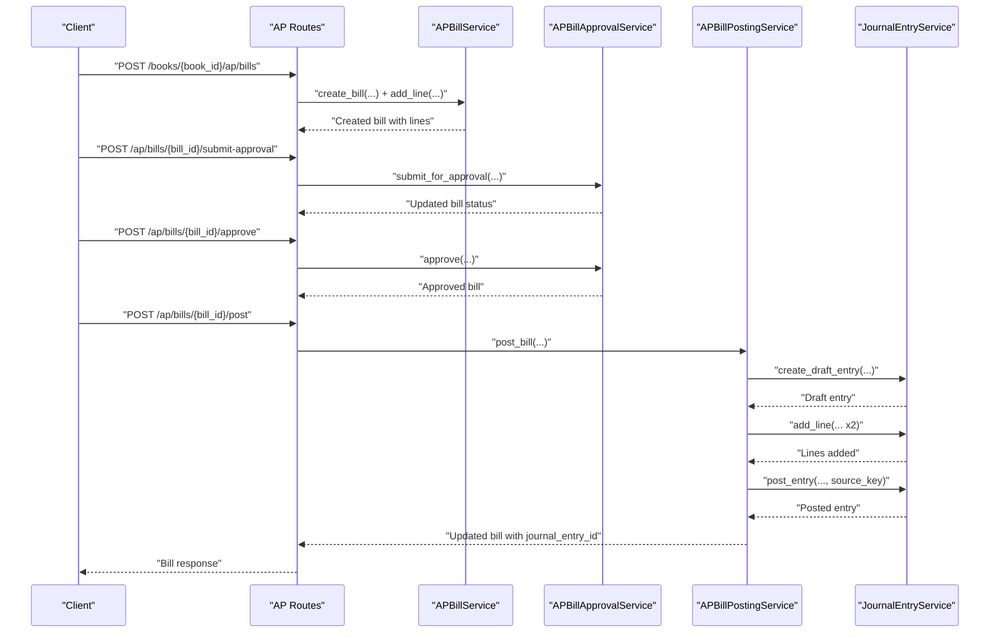

**Diagram sources**
- [ap_bill_routes.py](file://app/modules/ap/api/routes/ap_bill_routes.py#L31-L262)
- [ap_bill_service.py](file://app/modules/ap/services/ap_bill_service.py#L23-L111)
- [ap_bill_approval_service.py](file://app/modules/ap/services/ap_bill_approval_service.py#L34-L204)
- [ap_bill_posting_service.py](file://app/modules/ap/services/ap_bill_posting_service.py#L27-L127)
- [journal_entry_service.py](file://app/modules/general_ledger/services/journal_entry_service.py#L53-L242)

## Detailed Component Analysis

### AP Bill Lifecycle and State Machine
The AP Bill progresses through a strict state machine:
- DRAFT → PENDING_APPROVAL → APPROVED → POSTED
- DRAFT → REJECTED
- DRAFT → CANCELLED (implicit via rejection or cancellation flows)

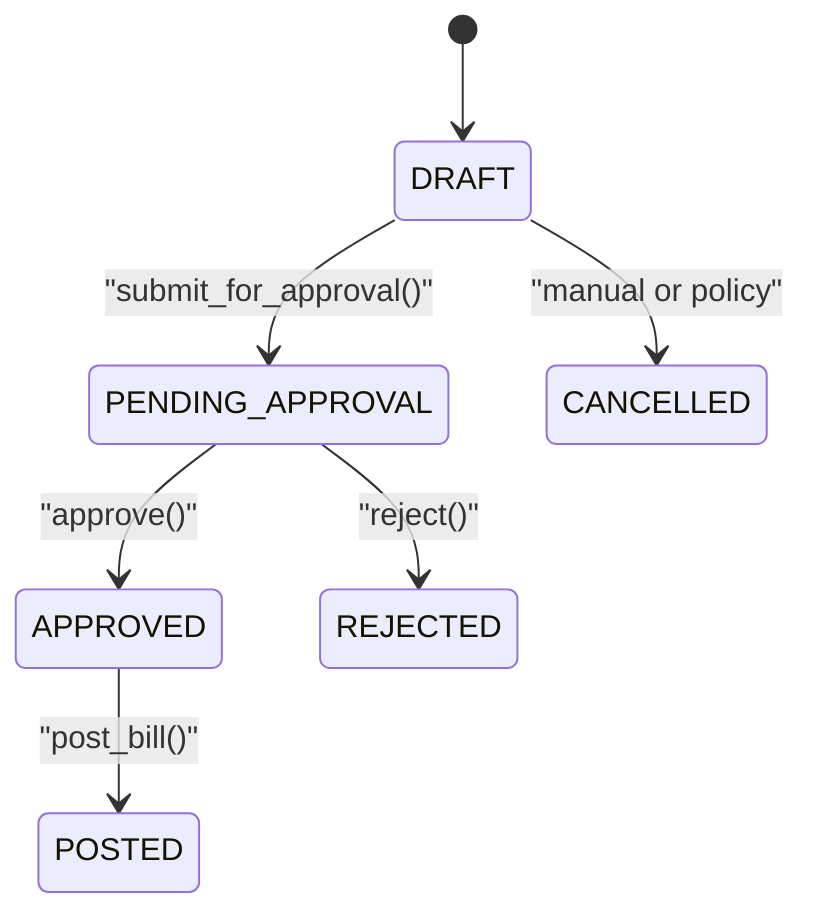

**Diagram sources**
- [ap_bill_model.py](file://app/modules/ap/models/ap_bill_model.py#L10-L18)
- [ap_bill_approval_service.py](file://app/modules/ap/services/ap_bill_approval_service.py#L34-L204)
- [ap_bill_posting_service.py](file://app/modules/ap/services/ap_bill_posting_service.py#L27-L127)

**Section sources**
- [ap_bill_model.py](file://app/modules/ap/models/ap_bill_model.py#L10-L18)
- [ap_bill_approval_service.py](file://app/modules/ap/services/ap_bill_approval_service.py#L34-L204)
- [ap_bill_posting_service.py](file://app/modules/ap/services/ap_bill_posting_service.py#L27-L127)

### Approval Workflows and Policy Enforcement
- Approval policy per legal entity and object type controls whether approval is required for AP bills.
- SoD validation stubs are present for future enforcement.
- Audit logs record all approval actions with actor, role, reason, and override reason.

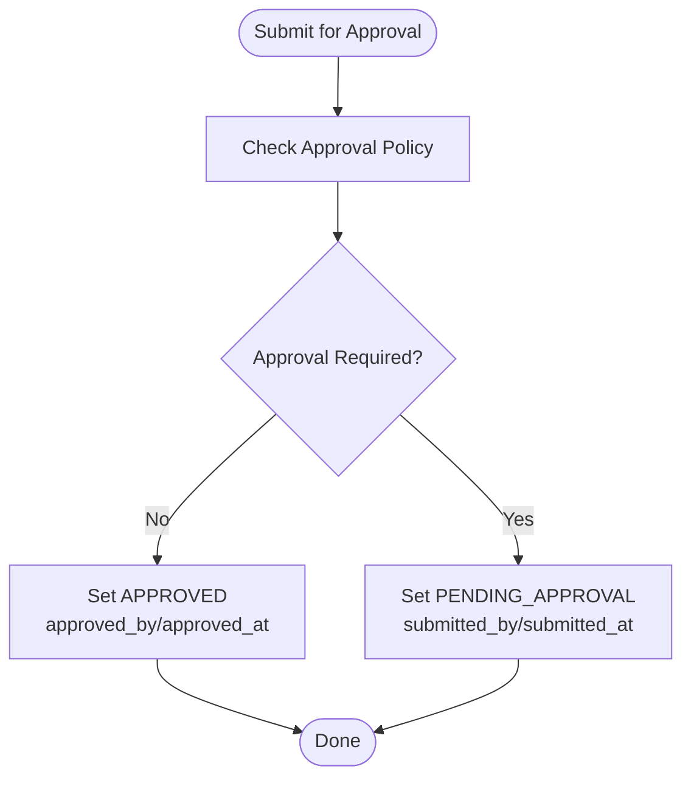

**Diagram sources**
- [ap_bill_approval_service.py](file://app/modules/ap/services/ap_bill_approval_service.py#L34-L94)
- [approval_policy_model.py](file://app/modules/core/models/approval_policy_model.py#L18-L36)
- [audit_log_model.py](file://app/modules/core/models/audit_log_model.py#L9-L43)

**Section sources**
- [ap_bill_approval_service.py](file://app/modules/ap/services/ap_bill_approval_service.py#L34-L204)
- [approval_policy_model.py](file://app/modules/core/models/approval_policy_model.py#L9-L36)
- [audit_log_model.py](file://app/modules/core/models/audit_log_model.py#L9-L43)
- [sod_validator.py](file://app/modules/core/services/sod_validator.py#L55-L63)

### Authorization Patterns and Idempotency
- Row-version optimistic locking is enforced on approval and posting operations.
- Idempotency keys prevent duplicate postings; the system checks idempotency and source_key uniqueness.
- Endpoint keys and replay protection are integrated at the API layer.

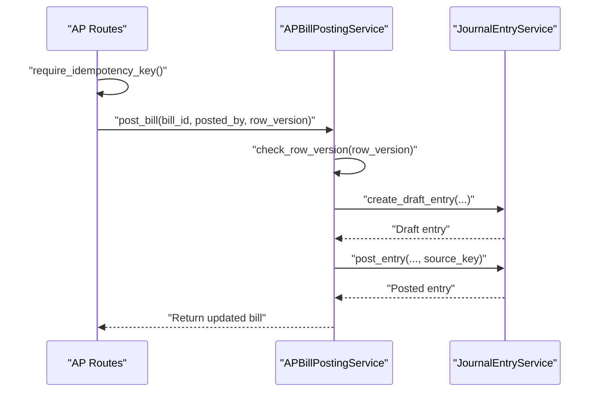

**Diagram sources**
- [ap_bill_routes.py](file://app/modules/ap/api/routes/ap_bill_routes.py#L196-L262)
- [ap_bill_posting_service.py](file://app/modules/ap/services/ap_bill_posting_service.py#L27-L127)
- [journal_entry_service.py](file://app/modules/general_ledger/services/journal_entry_service.py#L171-L242)

**Section sources**
- [ap_bill_routes.py](file://app/modules/ap/api/routes/ap_bill_routes.py#L196-L262)
- [ap_bill_posting_service.py](file://app/modules/ap/services/ap_bill_posting_service.py#L27-L127)
- [journal_entry_service.py](file://app/modules/general_ledger/services/journal_entry_service.py#L171-L242)

### Posting Workflows to General Ledger
- Posting creates a draft journal entry with source metadata.
- Two lines are added: debit to expense and credit to liability using mapped accounts.
- Posting validates period status, balances, and uniqueness via source_key.
- On success, bill status updates to POSTED and journal_entry_id is recorded.

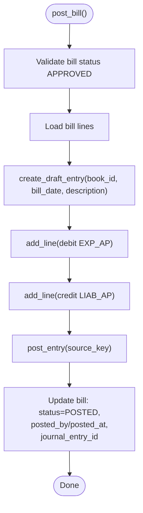

**Diagram sources**
- [ap_bill_posting_service.py](file://app/modules/ap/services/ap_bill_posting_service.py#L27-L127)
- [journal_entry_service.py](file://app/modules/general_ledger/services/journal_entry_service.py#L53-L242)
- [journal_entry_model.py](file://app/modules/general_ledger/models/journal_entry_model.py#L17-L57)

**Section sources**
- [ap_bill_posting_service.py](file://app/modules/ap/services/ap_bill_posting_service.py#L27-L127)
- [journal_entry_service.py](file://app/modules/general_ledger/services/journal_entry_service.py#L53-L242)
- [journal_entry_model.py](file://app/modules/general_ledger/models/journal_entry_model.py#L17-L57)

### Exception Handling, Rollback Mechanisms, and Error Recovery
- Validation errors are raised for invalid states (e.g., posting non-approved bills).
- Period locks prevent posting to closed periods.
- Duplicate posting prevention uses idempotency keys and source_key uniqueness.
- Reversal capability exists for posted journal entries to support error recovery.
- Audit logs capture reasons and override reasons for decisions.

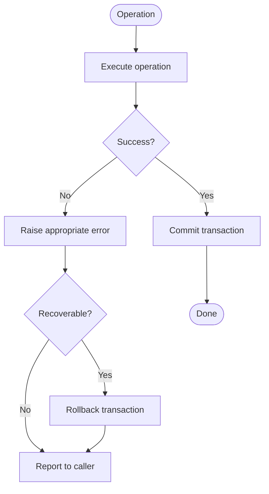

**Diagram sources**
- [ap_bill_approval_service.py](file://app/modules/ap/services/ap_bill_approval_service.py#L21-L23)
- [ap_bill_posting_service.py](file://app/modules/ap/services/ap_bill_posting_service.py#L13-L13)
- [journal_entry_service.py](file://app/modules/general_ledger/services/journal_entry_service.py#L171-L242)

**Section sources**
- [ap_bill_approval_service.py](file://app/modules/ap/services/ap_bill_approval_service.py#L21-L23)
- [ap_bill_posting_service.py](file://app/modules/ap/services/ap_bill_posting_service.py#L13-L13)
- [journal_entry_service.py](file://app/modules/general_ledger/services/journal_entry_service.py#L171-L242)

### Compliance Requirements and Audit Trail Generation
- Audit log records actor, role, action, object, timestamps, reason, and correlation identifiers.
- Approval actions are audited with decision reasons and override reasons.
- Journal entries include source metadata and source_key to prevent duplicates.

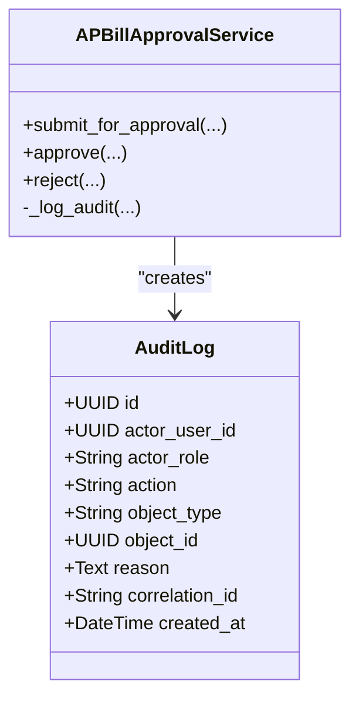

**Diagram sources**
- [audit_log_model.py](file://app/modules/core/models/audit_log_model.py#L9-L43)
- [ap_bill_approval_service.py](file://app/modules/ap/services/ap_bill_approval_service.py#L206-L229)

**Section sources**
- [audit_log_model.py](file://app/modules/core/models/audit_log_model.py#L9-L43)
- [ap_bill_approval_service.py](file://app/modules/ap/services/ap_bill_approval_service.py#L206-L229)

### Multi-Level Approvals and Policy Configurations
- Approval policy is configured per legal entity and object type.
- The current implementation supports a binary requirement flag; multi-level approvals can be extended by adding policy tiers and routing logic.

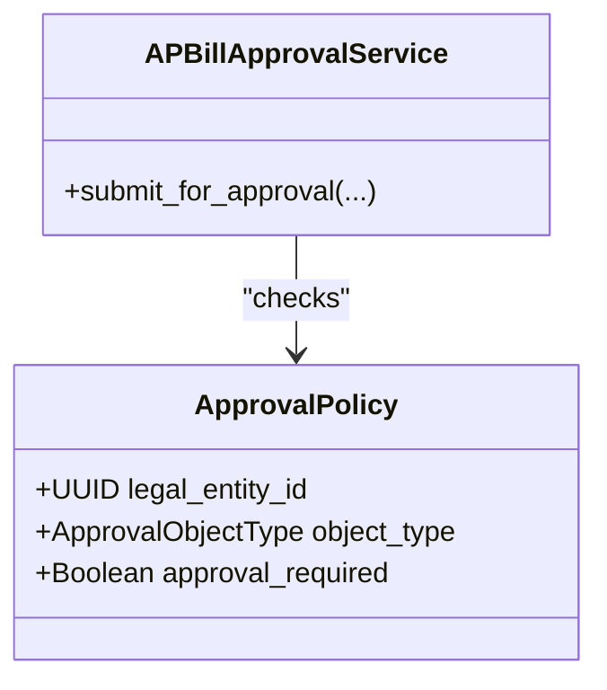

**Diagram sources**
- [approval_policy_model.py](file://app/modules/core/models/approval_policy_model.py#L18-L36)
- [ap_bill_approval_service.py](file://app/modules/ap/services/ap_bill_approval_service.py#L62-L78)

**Section sources**
- [approval_policy_model.py](file://app/modules/core/models/approval_policy_model.py#L18-L36)
- [ap_bill_approval_service.py](file://app/modules/ap/services/ap_bill_approval_service.py#L62-L78)

### Workflow Customization Examples
- Disable approvals per legal entity by setting approval_required=false for AP_BILL.
- Override SoD checks via override_reason when permitted by policy.
- Customize posting behavior by adjusting account mappings and dimension requirements.

**Section sources**
- [approval_policy_model.py](file://app/modules/core/models/approval_policy_model.py#L18-L36)
- [sod_validator.py](file://app/modules/core/services/sod_validator.py#L55-L63)
- [journal_entry_service.py](file://app/modules/general_ledger/services/journal_entry_service.py#L344-L381)

## Dependency Analysis
The AP module depends on core modules for approvals and auditing, and on general ledger for posting. The dependency graph highlights tight cohesion within AP services and clear boundaries to GL.

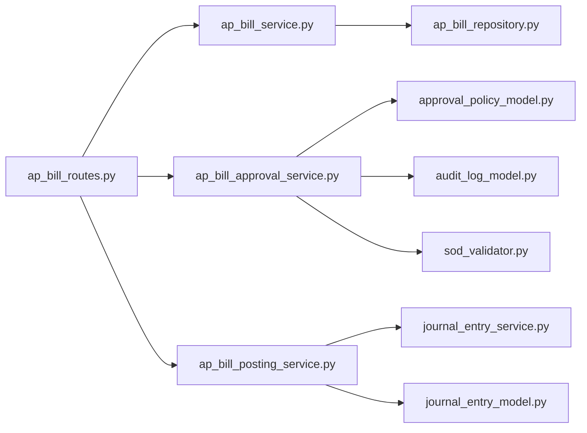

**Diagram sources**
- [ap_bill_routes.py](file://app/modules/ap/api/routes/ap_bill_routes.py#L1-L262)
- [ap_bill_service.py](file://app/modules/ap/services/ap_bill_service.py#L15-L111)
- [ap_bill_approval_service.py](file://app/modules/ap/services/ap_bill_approval_service.py#L26-L229)
- [ap_bill_posting_service.py](file://app/modules/ap/services/ap_bill_posting_service.py#L16-L127)
- [ap_bill_repository.py](file://app/modules/ap/repositories/ap_bill_repository.py#L11-L38)
- [approval_policy_model.py](file://app/modules/core/models/approval_policy_model.py#L18-L36)
- [audit_log_model.py](file://app/modules/core/models/audit_log_model.py#L9-L43)
- [sod_validator.py](file://app/modules/core/services/sod_validator.py#L55-L63)
- [journal_entry_service.py](file://app/modules/general_ledger/services/journal_entry_service.py#L40-L635)
- [journal_entry_model.py](file://app/modules/general_ledger/models/journal_entry_model.py#L17-L128)

**Section sources**
- [ap_bill_routes.py](file://app/modules/ap/api/routes/ap_bill_routes.py#L1-L262)
- [ap_bill_service.py](file://app/modules/ap/services/ap_bill_service.py#L15-L111)
- [ap_bill_approval_service.py](file://app/modules/ap/services/ap_bill_approval_service.py#L26-L229)
- [ap_bill_posting_service.py](file://app/modules/ap/services/ap_bill_posting_service.py#L16-L127)
- [journal_entry_service.py](file://app/modules/general_ledger/services/journal_entry_service.py#L40-L635)

## Performance Considerations
- Use pagination and filtering in bill listing to avoid large result sets.
- Batch operations for line additions can reduce round-trips.
- Journal entry posting validates balances and dimensions; ensure minimal line count per entry to improve performance.
- Indexes on frequently queried fields (status, dates, vendor) improve query performance.

## Troubleshooting Guide
Common issues and resolutions:
- Posting fails with validation errors: Ensure bill is APPROVED and has at least one line.
- Period locked error: Verify accounting period status before posting.
- Duplicate posting prevented: Use unique idempotency keys and source_key values.
- Approval errors: Confirm policy requires approval and SoD rules are satisfied.
- Audit trail gaps: Verify audit log configuration and that actions trigger logging.

**Section sources**
- [ap_bill_posting_service.py](file://app/modules/ap/services/ap_bill_posting_service.py#L13-L13)
- [journal_entry_service.py](file://app/modules/general_ledger/services/journal_entry_service.py#L171-L242)
- [ap_bill_approval_service.py](file://app/modules/ap/services/ap_bill_approval_service.py#L21-L23)
- [audit_log_model.py](file://app/modules/core/models/audit_log_model.py#L9-L43)

## Conclusion
The AP module implements a robust, policy-driven workflow with strong compliance and audit capabilities. It integrates tightly with general ledger for accurate posting and supports idempotency and SoD controls. Extensibility points exist for multi-level approvals and enhanced policy configurations.

## Appendices

### Data Model Overview
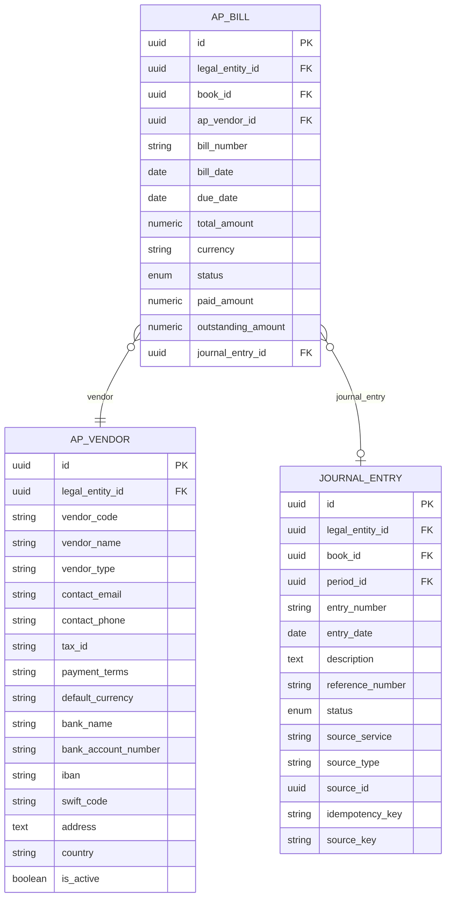

**Diagram sources**
- [ap_bill_model.py](file://app/modules/ap/models/ap_bill_model.py#L20-L66)
- [ap_vendor_model.py](file://app/modules/ap/models/ap_vendor_model.py#L8-L32)
- [journal_entry_model.py](file://app/modules/general_ledger/models/journal_entry_model.py#L17-L57)

**Section sources**
- [ap_bill_model.py](file://app/modules/ap/models/ap_bill_model.py#L20-L66)
- [ap_vendor_model.py](file://app/modules/ap/models/ap_vendor_model.py#L8-L32)
- [journal_entry_model.py](file://app/modules/general_ledger/models/journal_entry_model.py#L17-L57)
- [fm_schema.sql](file://database/fm_schema.sql#L1-L200)