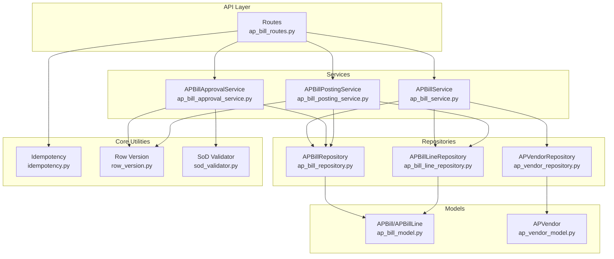
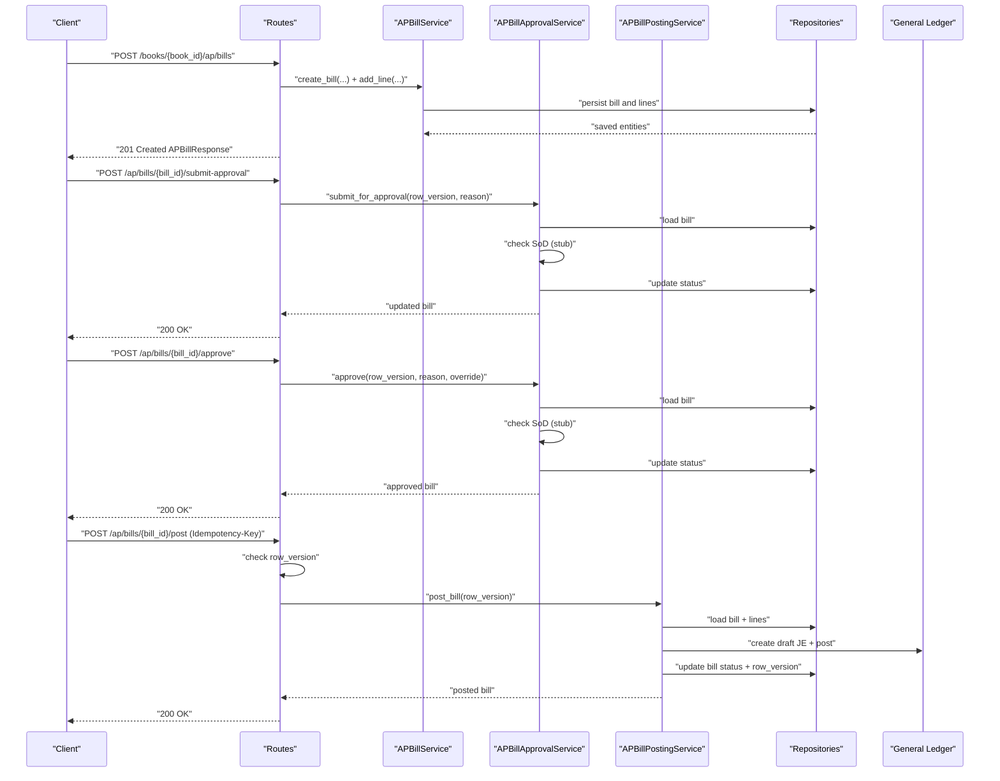
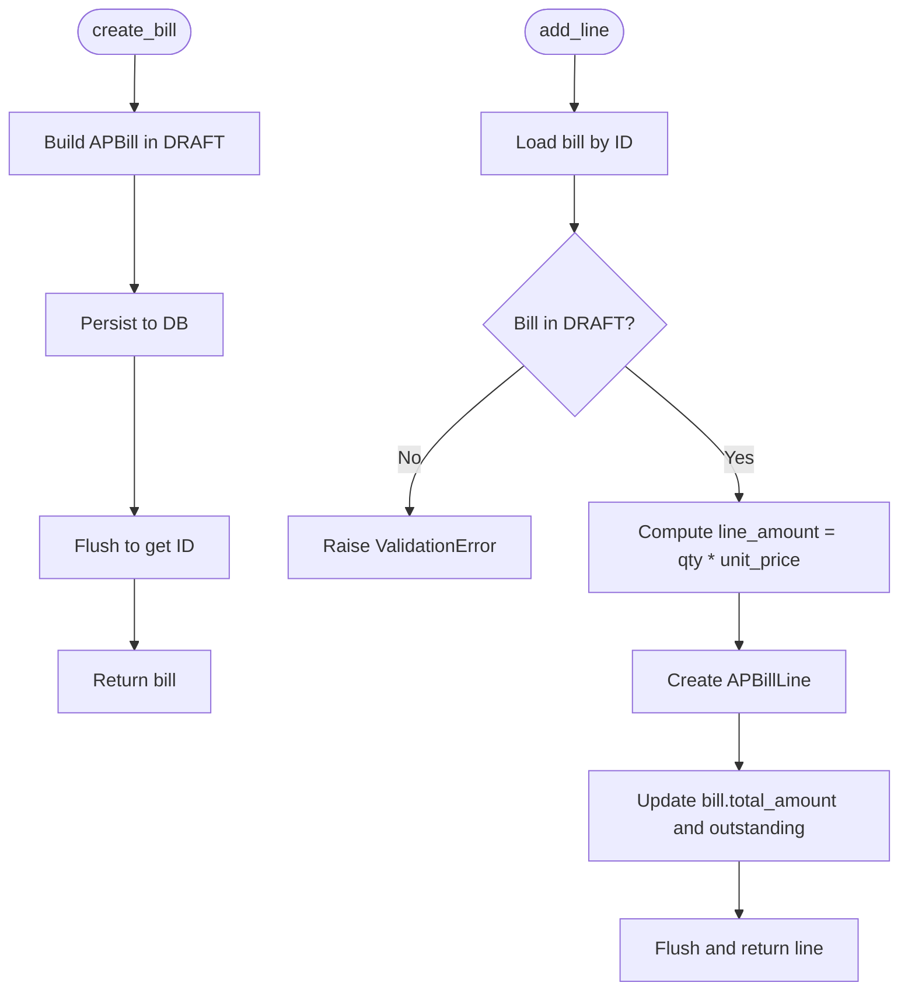
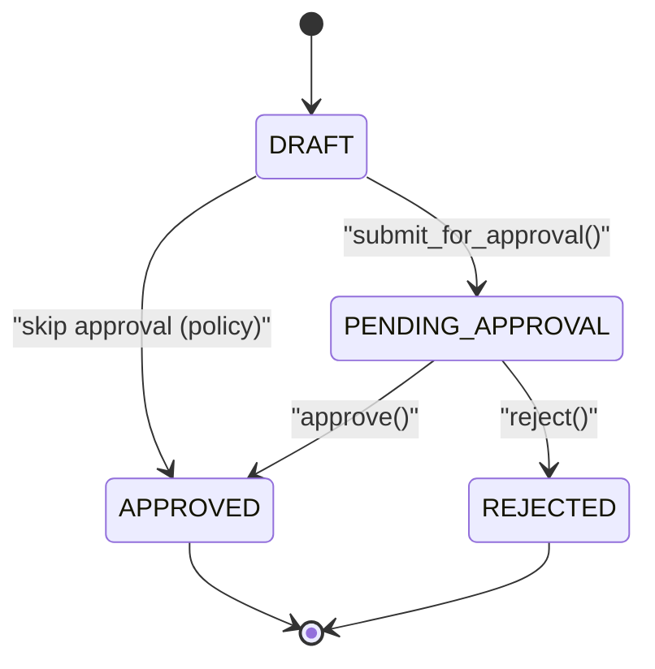
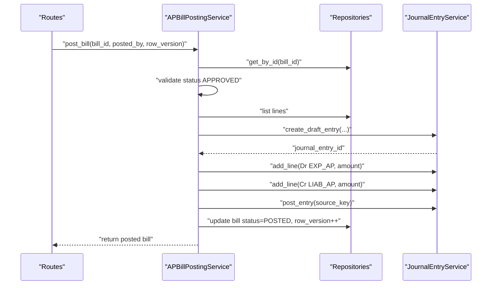
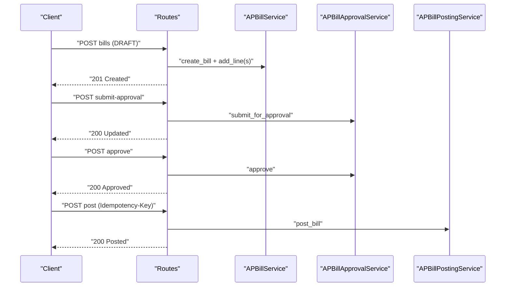
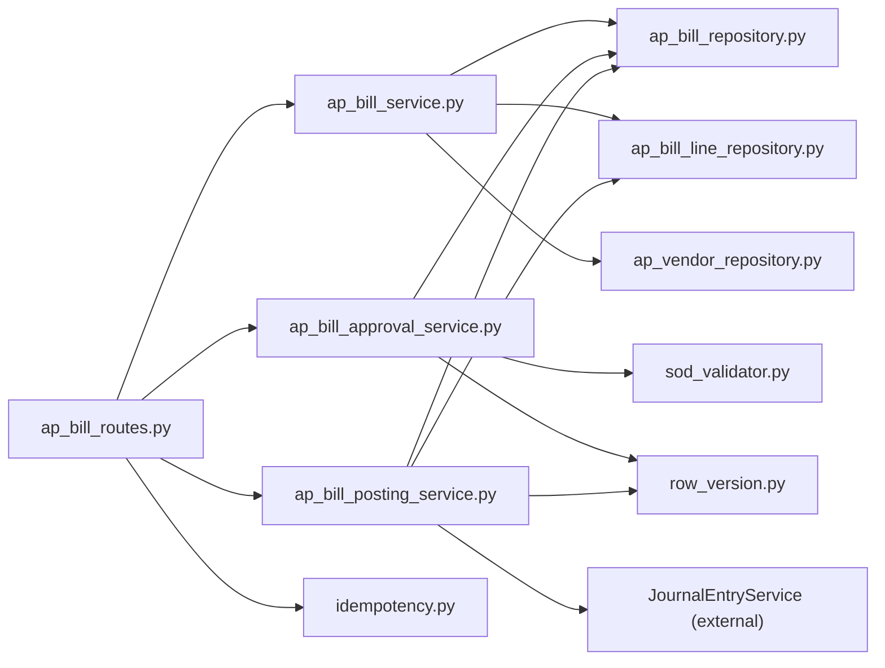

# AP Core Functionality

<cite>
**Referenced Files in This Document**
- [ap_bill_service.py](file://app/modules/ap/services/ap_bill_service.py)
- [ap_bill_approval_service.py](file://app/modules/ap/services/ap_bill_approval_service.py)
- [ap_bill_posting_service.py](file://app/modules/ap/services/ap_bill_posting_service.py)
- [ap_bill_model.py](file://app/modules/ap/models/ap_bill_model.py)
- [ap_bill_routes.py](file://app/modules/ap/api/routes/ap_bill_routes.py)
- [ap_bill_repository.py](file://app/modules/ap/repositories/ap_bill_repository.py)
- [ap_bill_line_repository.py](file://app/modules/ap/repositories/ap_bill_line_repository.py)
- [ap_vendor_repository.py](file://app/modules/ap/repositories/ap_vendor_repository.py)
- [ap_bill_schemas.py](file://app/modules/ap/schemas/ap_bill_schemas.py)
- [idempotency.py](file://app/core/idempotency.py)
- [row_version.py](file://app/core/row_version.py)
- [sod_validator.py](file://app/modules/core/services/sod_validator.py)
</cite>

## Table of Contents
1. [Introduction](#introduction)
2. [Project Structure](#project-structure)
3. [Core Components](#core-components)
4. [Architecture Overview](#architecture-overview)
5. [Detailed Component Analysis](#detailed-component-analysis)
6. [Dependency Analysis](#dependency-analysis)
7. [Performance Considerations](#performance-considerations)
8. [Troubleshooting Guide](#troubleshooting-guide)
9. [Conclusion](#conclusion)

## Introduction
This document describes the Accounts Payable (AP) core functionality with emphasis on the three service layers:
- AP Bill Service: bill creation, retrieval, and line item management
- AP Bill Approval Service: workflow-driven approvals with separation of duties checks
- AP Bill Posting Service: conversion of approved bills into journal entries

It explains business logic, validation rules, integration patterns, concurrency control, idempotency, and error handling. It also includes a bill lifecycle example from creation through posting and maps the relationships among services, repositories, models, and API routes.

## Project Structure
The AP domain is organized by feature with clear separation of concerns:
- Services encapsulate business logic
- Repositories abstract persistence
- Models define the data structures and relationships
- Schemas define request/response contracts
- API routes orchestrate requests and delegate to services
- Core utilities provide idempotency and optimistic locking

**Diagram sources**
- [ap_bill_routes.py](file://app/modules/ap/api/routes/ap_bill_routes.py#L1-L262)
- [ap_bill_service.py](file://app/modules/ap/services/ap_bill_service.py#L1-L111)
- [ap_bill_approval_service.py](file://app/modules/ap/services/ap_bill_approval_service.py#L1-L229)
- [ap_bill_posting_service.py](file://app/modules/ap/services/ap_bill_posting_service.py#L1-L127)
- [ap_bill_repository.py](file://app/modules/ap/repositories/ap_bill_repository.py#L1-L38)
- [ap_bill_line_repository.py](file://app/modules/ap/repositories/ap_bill_line_repository.py#L1-L37)
- [ap_vendor_repository.py](file://app/modules/ap/repositories/ap_vendor_repository.py#L1-L46)
- [ap_bill_model.py](file://app/modules/ap/models/ap_bill_model.py#L1-L102)
- [idempotency.py](file://app/core/idempotency.py#L1-L482)
- [row_version.py](file://app/core/row_version.py#L1-L31)
- [sod_validator.py](file://app/modules/core/services/sod_validator.py#L1-L78)

**Section sources**
- [ap_bill_routes.py](file://app/modules/ap/api/routes/ap_bill_routes.py#L1-L262)
- [ap_bill_service.py](file://app/modules/ap/services/ap_bill_service.py#L1-L111)
- [ap_bill_approval_service.py](file://app/modules/ap/services/ap_bill_approval_service.py#L1-L229)
- [ap_bill_posting_service.py](file://app/modules/ap/services/ap_bill_posting_service.py#L1-L127)
- [ap_bill_repository.py](file://app/modules/ap/repositories/ap_bill_repository.py#L1-L38)
- [ap_bill_line_repository.py](file://app/modules/ap/repositories/ap_bill_line_repository.py#L1-L37)
- [ap_vendor_repository.py](file://app/modules/ap/repositories/ap_vendor_repository.py#L1-L46)
- [ap_bill_model.py](file://app/modules/ap/models/ap_bill_model.py#L1-L102)
- [idempotency.py](file://app/core/idempotency.py#L1-L482)
- [row_version.py](file://app/core/row_version.py#L1-L31)
- [sod_validator.py](file://app/modules/core/services/sod_validator.py#L1-L78)

## Core Components
- AP Bill Service
  - Creates bills in DRAFT status
  - Adds lines and updates totals
  - Lists and retrieves bills
- AP Bill Approval Service
  - Submits bills for approval
  - Approves or rejects with SoD checks
  - Logs actions to audit log
- AP Bill Posting Service
  - Posts approved bills to journal entries
  - Uses account mappings and validates preconditions
  - Updates bill status and row version

Validation and safety:
- Row version checks prevent lost-update conflicts
- Idempotency ensures safe retries for posting
- SoD validator stub supports future policy enforcement
- Business rules enforce state transitions and required fields

**Section sources**
- [ap_bill_service.py](file://app/modules/ap/services/ap_bill_service.py#L15-L111)
- [ap_bill_approval_service.py](file://app/modules/ap/services/ap_bill_approval_service.py#L26-L229)
- [ap_bill_posting_service.py](file://app/modules/ap/services/ap_bill_posting_service.py#L16-L127)
- [ap_bill_model.py](file://app/modules/ap/models/ap_bill_model.py#L10-L69)
- [ap_bill_schemas.py](file://app/modules/ap/schemas/ap_bill_schemas.py#L21-L58)
- [row_version.py](file://app/core/row_version.py#L8-L31)
- [idempotency.py](file://app/core/idempotency.py#L207-L251)
- [sod_validator.py](file://app/modules/core/services/sod_validator.py#L55-L63)

## Architecture Overview
The AP subsystem follows a layered architecture:
- API routes receive requests and validate payloads
- Services implement business logic and orchestrate repositories
- Repositories handle persistence and queries
- Models define domain entities and relationships
- Core utilities provide cross-cutting concerns (idempotency, row version, SoD)

**Diagram sources**
- [ap_bill_routes.py](file://app/modules/ap/api/routes/ap_bill_routes.py#L31-L262)
- [ap_bill_service.py](file://app/modules/ap/services/ap_bill_service.py#L23-L111)
- [ap_bill_approval_service.py](file://app/modules/ap/services/ap_bill_approval_service.py#L34-L204)
- [ap_bill_posting_service.py](file://app/modules/ap/services/ap_bill_posting_service.py#L27-L112)

## Detailed Component Analysis

### AP Bill Service
Responsibilities:
- Create bills in DRAFT with initial totals and zeroed outstanding/paid amounts
- Add lines, compute line amounts, and update bill totals and outstanding amounts
- List bills filtered by entity, book, vendor, and status
- Retrieve individual bills

Validation and behavior:
- Prevents adding lines to non-DRAFT bills
- Maintains total and outstanding balances consistently
- Exposes repository-backed list and get operations

**Diagram sources**
- [ap_bill_service.py](file://app/modules/ap/services/ap_bill_service.py#L23-L91)
- [ap_bill_model.py](file://app/modules/ap/models/ap_bill_model.py#L20-L69)

**Section sources**
- [ap_bill_service.py](file://app/modules/ap/services/ap_bill_service.py#L15-L111)
- [ap_bill_repository.py](file://app/modules/ap/repositories/ap_bill_repository.py#L17-L37)
- [ap_bill_line_repository.py](file://app/modules/ap/repositories/ap_bill_line_repository.py#L21-L27)
- [ap_bill_model.py](file://app/modules/ap/models/ap_bill_model.py#L20-L69)

### AP Bill Approval Service
Responsibilities:
- Submit bills for approval (DRAFT → PENDING_APPROVAL or APPROVED if no approval required)
- Approve bills (PENDING_APPROVAL → APPROVED) with SoD validation
- Reject bills (PENDING_APPROVAL → REJECTED) requiring a reason
- Log all actions to audit log

Concurrency and safety:
- Enforces row version matching to prevent lost updates
- Uses SoD validation hook (currently a stub)
- Updates workflow metadata (submitted/approved/rejected by/at/decision reason)

**Diagram sources**
- [ap_bill_model.py](file://app/modules/ap/models/ap_bill_model.py#L10-L17)
- [ap_bill_approval_service.py](file://app/modules/ap/services/ap_bill_approval_service.py#L34-L204)

**Section sources**
- [ap_bill_approval_service.py](file://app/modules/ap/services/ap_bill_approval_service.py#L26-L229)
- [ap_bill_model.py](file://app/modules/ap/models/ap_bill_model.py#L10-L69)
- [sod_validator.py](file://app/modules/core/services/sod_validator.py#L55-L63)
- [row_version.py](file://app/core/row_version.py#L8-L31)

### AP Bill Posting Service
Responsibilities:
- Post approved bills to journal entries
- Resolve account mappings for expense and liability accounts
- Create a draft journal entry and post it
- Update bill status to POSTED and increment row version

Integration points:
- General Ledger Journal Entry Service for JE creation/posting
- Account mapping repository for EXP_AP and LIAB_AP
- Accounting period repository for period controls

**Diagram sources**
- [ap_bill_posting_service.py](file://app/modules/ap/services/ap_bill_posting_service.py#L27-L112)
- [ap_bill_model.py](file://app/modules/ap/models/ap_bill_model.py#L10-L69)

**Section sources**
- [ap_bill_posting_service.py](file://app/modules/ap/services/ap_bill_posting_service.py#L16-L127)
- [ap_bill_model.py](file://app/modules/ap/models/ap_bill_model.py#L10-L69)

### API Routes and Lifecycle Management
The API routes coordinate the bill lifecycle:
- Creation: POST creates the bill and lines, then commits and returns the bill with lines loaded
- Approval: submit-approval, approve, reject endpoints delegate to the approval service
- Posting: POST /post enforces idempotency and performs optimistic locking via row version

Lifecycle example:
1. Create bill (DRAFT)
2. Add lines (DRAFT)
3. Submit for approval (DRAFT → PENDING_APPROVAL or APPROVED)
4. Approve (PENDING_APPROVAL → APPROVED)
5. Post (APPROVED → POSTED) with idempotency and row version checks

**Diagram sources**
- [ap_bill_routes.py](file://app/modules/ap/api/routes/ap_bill_routes.py#L31-L262)
- [ap_bill_service.py](file://app/modules/ap/services/ap_bill_service.py#L23-L111)
- [ap_bill_approval_service.py](file://app/modules/ap/services/ap_bill_approval_service.py#L34-L204)
- [ap_bill_posting_service.py](file://app/modules/ap/services/ap_bill_posting_service.py#L27-L112)

**Section sources**
- [ap_bill_routes.py](file://app/modules/ap/api/routes/ap_bill_routes.py#L31-L262)
- [ap_bill_schemas.py](file://app/modules/ap/schemas/ap_bill_schemas.py#L21-L58)

## Dependency Analysis
- Services depend on repositories for persistence and on core utilities for idempotency and row version
- Approval service depends on SoD validator and approval policy repository
- Posting service integrates with General Ledger services and repositories
- API routes depend on services and schemas, and on idempotency infrastructure

**Diagram sources**
- [ap_bill_routes.py](file://app/modules/ap/api/routes/ap_bill_routes.py#L1-L262)
- [ap_bill_service.py](file://app/modules/ap/services/ap_bill_service.py#L1-L111)
- [ap_bill_approval_service.py](file://app/modules/ap/services/ap_bill_approval_service.py#L1-L229)
- [ap_bill_posting_service.py](file://app/modules/ap/services/ap_bill_posting_service.py#L1-L127)
- [ap_bill_repository.py](file://app/modules/ap/repositories/ap_bill_repository.py#L1-L38)
- [ap_bill_line_repository.py](file://app/modules/ap/repositories/ap_bill_line_repository.py#L1-L37)
- [ap_vendor_repository.py](file://app/modules/ap/repositories/ap_vendor_repository.py#L1-L46)
- [idempotency.py](file://app/core/idempotency.py#L1-L482)
- [row_version.py](file://app/core/row_version.py#L1-L31)
- [sod_validator.py](file://app/modules/core/services/sod_validator.py#L1-L78)

**Section sources**
- [ap_bill_routes.py](file://app/modules/ap/api/routes/ap_bill_routes.py#L1-L262)
- [ap_bill_service.py](file://app/modules/ap/services/ap_bill_service.py#L1-L111)
- [ap_bill_approval_service.py](file://app/modules/ap/services/ap_bill_approval_service.py#L1-L229)
- [ap_bill_posting_service.py](file://app/modules/ap/services/ap_bill_posting_service.py#L1-L127)

## Performance Considerations
- Batch operations: Creating bills with multiple lines in a single transaction reduces round-trips
- Indexes: Status, bill number, and foreign keys are indexed to speed up filtering and joins
- Journal entry batching: Posting leverages GL services; ensure minimal per-line overhead
- Idempotency storage: Responses are capped to avoid bloating storage; consider compression if needed
- Concurrency: Row version and idempotency keys prevent contention; ensure clients supply row versions and unique idempotency keys

[No sources needed since this section provides general guidance]

## Troubleshooting Guide
Common issues and resolutions:
- Row version conflict (409): Refresh the bill, then resend with the latest row version
- Idempotency in progress (409): Wait for the TTL indicated by Retry-After or use a new idempotency key
- Non-unique idempotency key with different payload (409): Do not reuse keys with different request bodies
- Approval errors: Ensure bill is in the expected state and reasons are provided where required
- Posting errors: Verify the bill is APPROVED, has lines, and account mappings exist

**Section sources**
- [row_version.py](file://app/core/row_version.py#L8-L31)
- [idempotency.py](file://app/core/idempotency.py#L207-L378)
- [ap_bill_approval_service.py](file://app/modules/ap/services/ap_bill_approval_service.py#L55-L204)
- [ap_bill_posting_service.py](file://app/modules/ap/services/ap_bill_posting_service.py#L42-L112)

## Conclusion
The AP core functionality is structured around three cohesive services that implement a robust bill lifecycle: creation, approval, and posting. Strong validation rules, optimistic locking via row version, and idempotency support ensure correctness under concurrency and retries. Integration with the General Ledger produces accurate journal entries, and audit logging captures workflow actions. Extensibility points (SoD policies, approval workflows) are present for future enhancements.