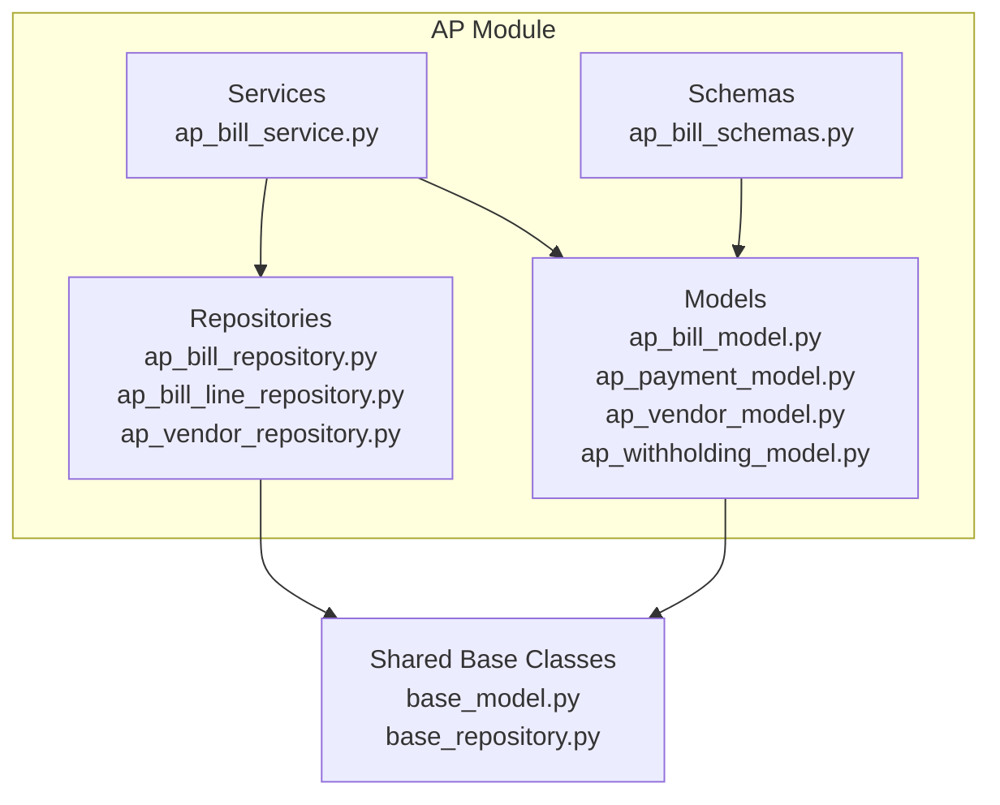
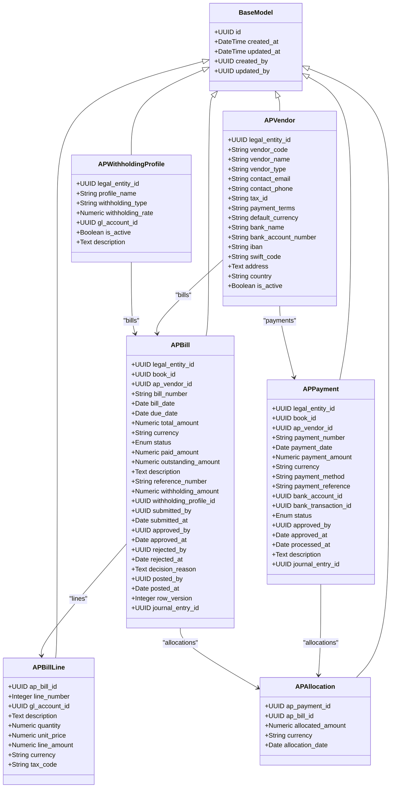
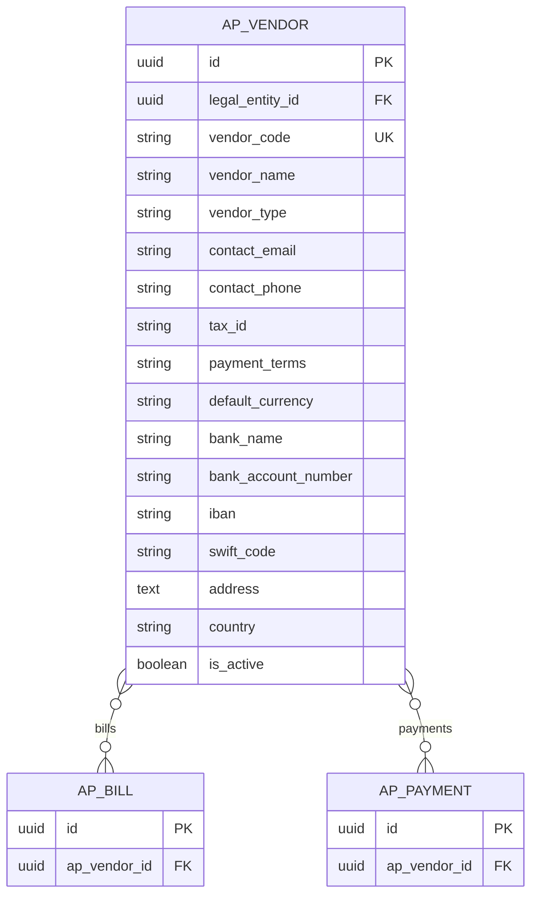
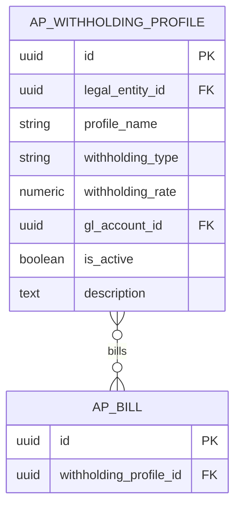
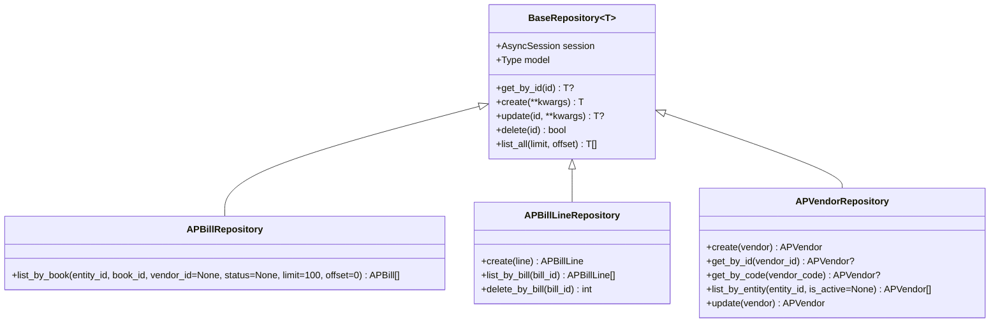
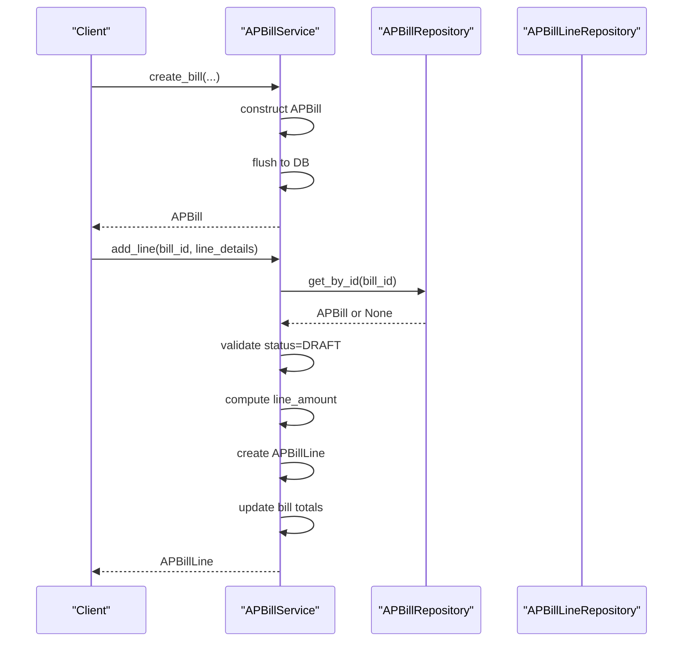
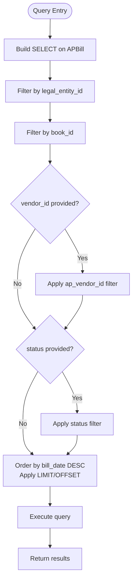
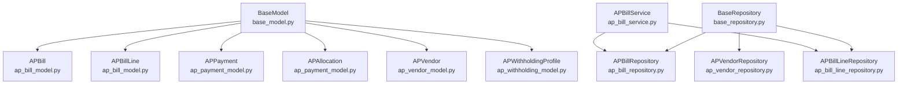

# AP Models and Repositories

<cite>
**Referenced Files in This Document**
- [ap_bill_model.py](file://app/modules/ap/models/ap_bill_model.py)
- [ap_payment_model.py](file://app/modules/ap/models/ap_payment_model.py)
- [ap_vendor_model.py](file://app/modules/ap/models/ap_vendor_model.py)
- [ap_withholding_model.py](file://app/modules/ap/models/ap_withholding_model.py)
- [ap_bill_repository.py](file://app/modules/ap/repositories/ap_bill_repository.py)
- [ap_bill_line_repository.py](file://app/modules/ap/repositories/ap_bill_line_repository.py)
- [ap_vendor_repository.py](file://app/modules/ap/repositories/ap_vendor_repository.py)
- [base_repository.py](file://app/shared/repositories/base_repository.py)
- [base_model.py](file://app/shared/models/base_model.py)
- [ap_bill_service.py](file://app/modules/ap/services/ap_bill_service.py)
- [ap_bill_schemas.py](file://app/modules/ap/schemas/ap_bill_schemas.py)
- [fm_schema.sql](file://database/fm_schema.sql)
</cite>

## Table of Contents
1. [Introduction](#introduction)
2. [Project Structure](#project-structure)
3. [Core Components](#core-components)
4. [Architecture Overview](#architecture-overview)
5. [Detailed Component Analysis](#detailed-component-analysis)
6. [Dependency Analysis](#dependency-analysis)
7. [Performance Considerations](#performance-considerations)
8. [Troubleshooting Guide](#troubleshooting-guide)
9. [Conclusion](#conclusion)

## Introduction
This document provides comprehensive documentation for the Accounts Payable (AP) domain models and repositories within the TrueVow Financial Management system. It covers the AP bill model and its relationships to vendors, lines, and payments; the AP payment model for tracking disbursements; the AP vendor model for supplier management; and the AP withholding model for tax calculations. It also documents repository patterns, query methods, data access patterns, model relationships, constraints, and indexing strategies. Examples of CRUD operations and complex queries are included to guide implementation and troubleshooting.

## Project Structure
The AP module follows a layered architecture with models, repositories, services, schemas, and API routes. The models define the domain entities and relationships, repositories encapsulate data access, services orchestrate business operations, and schemas validate and serialize request/response payloads. Shared base classes provide common fields and generic repository capabilities.



**Diagram sources**
- [ap_bill_model.py](file://app/modules/ap/models/ap_bill_model.py#L1-L102)
- [ap_payment_model.py](file://app/modules/ap/models/ap_payment_model.py#L1-L80)
- [ap_vendor_model.py](file://app/modules/ap/models/ap_vendor_model.py#L1-L40)
- [ap_withholding_model.py](file://app/modules/ap/models/ap_withholding_model.py#L1-L32)
- [ap_bill_repository.py](file://app/modules/ap/repositories/ap_bill_repository.py#L1-L38)
- [ap_bill_line_repository.py](file://app/modules/ap/repositories/ap_bill_line_repository.py#L1-L37)
- [ap_vendor_repository.py](file://app/modules/ap/repositories/ap_vendor_repository.py#L1-L46)
- [base_repository.py](file://app/shared/repositories/base_repository.py#L1-L54)
- [base_model.py](file://app/shared/models/base_model.py#L1-L18)
- [ap_bill_service.py](file://app/modules/ap/services/ap_bill_service.py#L1-L111)
- [ap_bill_schemas.py](file://app/modules/ap/schemas/ap_bill_schemas.py#L1-L114)

**Section sources**
- [ap_bill_model.py](file://app/modules/ap/models/ap_bill_model.py#L1-L102)
- [ap_payment_model.py](file://app/modules/ap/models/ap_payment_model.py#L1-L80)
- [ap_vendor_model.py](file://app/modules/ap/models/ap_vendor_model.py#L1-L40)
- [ap_withholding_model.py](file://app/modules/ap/models/ap_withholding_model.py#L1-L32)
- [ap_bill_repository.py](file://app/modules/ap/repositories/ap_bill_repository.py#L1-L38)
- [ap_bill_line_repository.py](file://app/modules/ap/repositories/ap_bill_line_repository.py#L1-L37)
- [ap_vendor_repository.py](file://app/modules/ap/repositories/ap_vendor_repository.py#L1-L46)
- [base_repository.py](file://app/shared/repositories/base_repository.py#L1-L54)
- [base_model.py](file://app/shared/models/base_model.py#L1-L18)
- [ap_bill_service.py](file://app/modules/ap/services/ap_bill_service.py#L1-L111)
- [ap_bill_schemas.py](file://app/modules/ap/schemas/ap_bill_schemas.py#L1-L114)

## Core Components
This section introduces the core AP models and their responsibilities:
- AP Bill: Represents vendor invoices with status tracking, amounts, and workflow fields.
- AP Bill Line: Represents individual line items within a bill, linked to GL accounts.
- AP Payment: Tracks vendor disbursements with payment methods and status.
- AP Allocation: Links payments to specific bills.
- AP Vendor: Manages supplier/master data and relationships to bills/payments.
- AP Withholding Profile: Defines tax withholding rates and GL mapping.

Key characteristics:
- All models inherit common fields (id, timestamps, created_by, updated_by) from a shared base class.
- Relationships are defined via SQLAlchemy ORM with cascading deletes for child entities.
- Indexes are strategically placed on foreign keys and frequently queried columns.
- Status enums enforce controlled state transitions.

**Section sources**
- [ap_bill_model.py](file://app/modules/ap/models/ap_bill_model.py#L10-L102)
- [ap_payment_model.py](file://app/modules/ap/models/ap_payment_model.py#L10-L80)
- [ap_vendor_model.py](file://app/modules/ap/models/ap_vendor_model.py#L8-L40)
- [ap_withholding_model.py](file://app/modules/ap/models/ap_withholding_model.py#L9-L32)
- [base_model.py](file://app/shared/models/base_model.py#L9-L18)

## Architecture Overview
The AP domain follows a clean architecture pattern:
- Models define the persistent entities and relationships.
- Repositories encapsulate data access and query logic.
- Services coordinate business operations and maintain invariants.
- Schemas validate and transform data for APIs.



**Diagram sources**
- [ap_bill_model.py](file://app/modules/ap/models/ap_bill_model.py#L20-L102)
- [ap_payment_model.py](file://app/modules/ap/models/ap_payment_model.py#L19-L80)
- [ap_vendor_model.py](file://app/modules/ap/models/ap_vendor_model.py#L8-L40)
- [ap_withholding_model.py](file://app/modules/ap/models/ap_withholding_model.py#L9-L32)
- [base_model.py](file://app/shared/models/base_model.py#L9-L18)

## Detailed Component Analysis

### AP Bill Model and Relationships
The AP bill captures vendor invoice details, workflow states, and financial amounts. It maintains relationships to legal entity, book, vendor, withholding profile, bill lines, allocations, and journal entries. Constraints include unique bill numbers and line uniqueness per bill.

Key attributes and indexes:
- Foreign keys: legal_entity_id, book_id, ap_vendor_id, journal_entry_id, withholding_profile_id
- Indexed columns: bill_number, bill_date, due_date, status, ap_vendor_id
- Calculated field: outstanding_amount = total_amount - paid_amount
- Workflow fields: submitted_by/submitted_at, approved_by/approved_at, rejected_by/rejected_at, posted_by/posted_at
- Row version for optimistic concurrency control

```mermaid
erDiagram
AP_BILL {
uuid id PK
uuid legal_entity_id FK
uuid book_id FK
uuid ap_vendor_id FK
string bill_number UK
date bill_date IDX
date due_date IDX
numeric total_amount
string currency
enum status IDX
numeric paid_amount
numeric outstanding_amount
text description
string reference_number
numeric withholding_amount
uuid withholding_profile_id FK
uuid submitted_by
date submitted_at
uuid approved_by
date approved_at
uuid rejected_by
date rejected_at
text decision_reason
uuid posted_by
date posted_at
integer row_version
uuid journal_entry_id FK
}
AP_VENDOR {
uuid id PK
uuid legal_entity_id FK
string vendor_code UK
string vendor_name
string vendor_type
string contact_email
string contact_phone
string tax_id
string payment_terms
string default_currency
string bank_name
string bank_account_number
string iban
string swift_code
text address
string country
boolean is_active
}
AP_WITHHOLDING_PROFILE {
uuid id PK
uuid legal_entity_id FK
string profile_name
string withholding_type
numeric withholding_rate
uuid gl_account_id FK
boolean is_active
text description
}
AP_BILL_LINE {
uuid id PK
uuid ap_bill_id FK
integer line_number
uuid gl_account_id FK
text description
numeric quantity
numeric unit_price
numeric line_amount
string currency
string tax_code
unique uq_ap_bill_line_bill_line(ap_bill_id, line_number)
}
AP_ALLOCATION {
uuid id PK
uuid ap_payment_id FK
uuid ap_bill_id FK
numeric allocated_amount
string currency
date allocation_date
unique uq_ap_allocation_payment_bill(ap_payment_id, ap_bill_id)
}
AP_BILL }o--o| AP_VENDOR : "vendor"
AP_BILL }o--o{ AP_BILL_LINE : "lines"
AP_BILL }o--o{ AP_ALLOCATION : "allocations"
AP_BILL }o--|| AP_WITHHOLDING_PROFILE : "withholding_profile"
```

**Diagram sources**
- [ap_bill_model.py](file://app/modules/ap/models/ap_bill_model.py#L20-L102)
- [ap_vendor_model.py](file://app/modules/ap/models/ap_vendor_model.py#L8-L40)
- [ap_withholding_model.py](file://app/modules/ap/models/ap_withholding_model.py#L9-L32)

**Section sources**
- [ap_bill_model.py](file://app/modules/ap/models/ap_bill_model.py#L20-L102)

### AP Payment Model for Disbursements
The AP payment tracks vendor disbursements with payment methods, statuses, and links to bank accounts and transactions. Allocations connect payments to specific bills.

Key attributes and indexes:
- Foreign keys: legal_entity_id, book_id, ap_vendor_id, bank_account_id, bank_transaction_id, journal_entry_id
- Indexed columns: payment_number, payment_date, status, ap_vendor_id
- Status enum supports PENDING, APPROVED, PROCESSED, CANCELLED, FAILED
- Optional bank linkage enables reconciliation and treasury integration

```mermaid
erDiagram
AP_PAYMENT {
uuid id PK
uuid legal_entity_id FK
uuid book_id FK
uuid ap_vendor_id FK
string payment_number UK
date payment_date IDX
numeric payment_amount
string currency
string payment_method
string payment_reference
uuid bank_account_id FK
uuid bank_transaction_id FK
enum status IDX
uuid approved_by
date approved_at
date processed_at
text description
uuid journal_entry_id FK
}
AP_ALLOCATION {
uuid id PK
uuid ap_payment_id FK
uuid ap_bill_id FK
numeric allocated_amount
string currency
date allocation_date
unique uq_ap_allocation_payment_bill(ap_payment_id, ap_bill_id)
}
AP_PAYMENT }o--o{ AP_ALLOCATION : "allocations"
AP_ALLOCATION }o--|| AP_BILL : "bill"
```

**Diagram sources**
- [ap_payment_model.py](file://app/modules/ap/models/ap_payment_model.py#L19-L80)

**Section sources**
- [ap_payment_model.py](file://app/modules/ap/models/ap_payment_model.py#L19-L80)

### AP Vendor Model for Supplier Management
The AP vendor model manages supplier/master data including contact details, tax identifiers, payment terms, default currency, and banking information. It maintains relationships to bills and payments.

Key attributes and indexes:
- Unique vendor_code per legal entity
- Indexed columns: vendor_code, legal_entity_id
- Active flag to enable/disable suppliers
- Optional banking details for direct payments



**Diagram sources**
- [ap_vendor_model.py](file://app/modules/ap/models/ap_vendor_model.py#L8-L40)

**Section sources**
- [ap_vendor_model.py](file://app/modules/ap/models/ap_vendor_model.py#L8-L40)

### AP Withholding Model for Tax Calculations
The AP withholding profile defines tax withholding rates and GL mapping per legal entity. It supports configurable types (e.g., tax, vat) and active flags.

Key attributes and indexes:
- Foreign keys: legal_entity_id, gl_account_id
- Indexed columns: legal_entity_id
- Rate stored as percentage with precision
- Optional description for policy details



**Diagram sources**
- [ap_withholding_model.py](file://app/modules/ap/models/ap_withholding_model.py#L9-L32)

**Section sources**
- [ap_withholding_model.py](file://app/modules/ap/models/ap_withholding_model.py#L9-L32)

### Repository Patterns and Query Methods
Repositories encapsulate data access and query logic. The base repository provides generic CRUD operations, while specialized repositories implement domain-specific queries.

Common repository capabilities:
- Base repository: get_by_id, create, update, delete, list_all
- APBillRepository: list_by_book with filters for entity, book, vendor, status
- APBillLineRepository: create, list_by_bill, delete_by_bill
- APVendorRepository: create, get_by_id, get_by_code, list_by_entity, update



**Diagram sources**
- [base_repository.py](file://app/shared/repositories/base_repository.py#L11-L54)
- [ap_bill_repository.py](file://app/modules/ap/repositories/ap_bill_repository.py#L11-L38)
- [ap_bill_line_repository.py](file://app/modules/ap/repositories/ap_bill_line_repository.py#L9-L37)
- [ap_vendor_repository.py](file://app/modules/ap/repositories/ap_vendor_repository.py#L9-L46)

**Section sources**
- [base_repository.py](file://app/shared/repositories/base_repository.py#L11-L54)
- [ap_bill_repository.py](file://app/modules/ap/repositories/ap_bill_repository.py#L11-L38)
- [ap_bill_line_repository.py](file://app/modules/ap/repositories/ap_bill_line_repository.py#L9-L37)
- [ap_vendor_repository.py](file://app/modules/ap/repositories/ap_vendor_repository.py#L9-L46)

### Data Access Patterns and CRUD Operations
The AP module implements standard CRUD operations with service orchestration and repository-backed queries. The bill service demonstrates creation, line addition, and listing with validation and invariants.

Typical operations:
- Create bill: Initialize with draft status, zero amounts, and defaults
- Add bill line: Validate draft state, compute line amount, update totals
- List bills: Filter by entity, book, vendor, and status with pagination
- Vendor CRUD: Create, read by ID/code, list by entity with optional active filter



**Diagram sources**
- [ap_bill_service.py](file://app/modules/ap/services/ap_bill_service.py#L15-L111)
- [ap_bill_repository.py](file://app/modules/ap/repositories/ap_bill_repository.py#L11-L38)
- [ap_bill_line_repository.py](file://app/modules/ap/repositories/ap_bill_line_repository.py#L9-L37)

**Section sources**
- [ap_bill_service.py](file://app/modules/ap/services/ap_bill_service.py#L15-L111)

### Complex Queries and Business Logic
Complex queries often involve filtering, sorting, and aggregation across related entities. The bill listing query demonstrates multi-parameter filtering and ordering. Allocation-based payment-to-bill linking requires joining allocations to resolve relationships.

Example query patterns:
- List bills by book with optional vendor/status filters and pagination
- Compute outstanding amounts as total minus paid
- Resolve payment allocations to determine applied amounts per bill



**Diagram sources**
- [ap_bill_repository.py](file://app/modules/ap/repositories/ap_bill_repository.py#L17-L37)

**Section sources**
- [ap_bill_repository.py](file://app/modules/ap/repositories/ap_bill_repository.py#L17-L37)

## Dependency Analysis
The AP models depend on shared base classes and SQLAlchemy ORM for persistence. Repositories depend on SQLAlchemy async sessions and base repository generics. Services depend on repositories and models to enforce business rules.



**Diagram sources**
- [base_model.py](file://app/shared/models/base_model.py#L9-L18)
- [base_repository.py](file://app/shared/repositories/base_repository.py#L11-L54)
- [ap_bill_model.py](file://app/modules/ap/models/ap_bill_model.py#L20-L102)
- [ap_payment_model.py](file://app/modules/ap/models/ap_payment_model.py#L19-L80)
- [ap_vendor_model.py](file://app/modules/ap/models/ap_vendor_model.py#L8-L40)
- [ap_withholding_model.py](file://app/modules/ap/models/ap_withholding_model.py#L9-L32)
- [ap_bill_repository.py](file://app/modules/ap/repositories/ap_bill_repository.py#L11-L38)
- [ap_bill_line_repository.py](file://app/modules/ap/repositories/ap_bill_line_repository.py#L9-L37)
- [ap_vendor_repository.py](file://app/modules/ap/repositories/ap_vendor_repository.py#L9-L46)
- [ap_bill_service.py](file://app/modules/ap/services/ap_bill_service.py#L15-L111)

**Section sources**
- [base_model.py](file://app/shared/models/base_model.py#L9-L18)
- [base_repository.py](file://app/shared/repositories/base_repository.py#L11-L54)
- [ap_bill_model.py](file://app/modules/ap/models/ap_bill_model.py#L20-L102)
- [ap_payment_model.py](file://app/modules/ap/models/ap_payment_model.py#L19-L80)
- [ap_vendor_model.py](file://app/modules/ap/models/ap_vendor_model.py#L8-L40)
- [ap_withholding_model.py](file://app/modules/ap/models/ap_withholding_model.py#L9-L32)
- [ap_bill_repository.py](file://app/modules/ap/repositories/ap_bill_repository.py#L11-L38)
- [ap_bill_line_repository.py](file://app/modules/ap/repositories/ap_bill_line_repository.py#L9-L37)
- [ap_vendor_repository.py](file://app/modules/ap/repositories/ap_vendor_repository.py#L9-L46)
- [ap_bill_service.py](file://app/modules/ap/services/ap_bill_service.py#L15-L111)

## Performance Considerations
Indexing strategy:
- Primary indexes on foreign keys and frequently filtered columns (e.g., ap_bill.ap_vendor_id, ap_payment.ap_vendor_id, ap_vendor.vendor_code)
- Additional indexes on date and status fields for efficient filtering (e.g., ap_bill.bill_date, ap_bill.status, ap_payment.payment_date, ap_payment.status)
- Unique constraints prevent duplicates (e.g., ap_bill.bill_number, ap_bill_line.uq_ap_bill_line_bill_line, ap_allocation.uq_ap_allocation_payment_bill)

Query optimization:
- Use repository methods with filters to leverage indexes
- Prefer pagination (limit/offset) for large lists
- Avoid N+1 queries by eager-loading relationships where appropriate

Data types and precision:
- Numeric fields use precise decimal types with fixed scale for currency
- Enumerations constrain status values and reduce invalid states

[No sources needed since this section provides general guidance]

## Troubleshooting Guide
Common issues and resolutions:
- Duplicate bill numbers: Ensure unique constraint enforcement and handle IntegrityError on creation/update
- Invalid bill status transitions: Validate status before updates (e.g., lines can only be added to DRAFT bills)
- Allocation mismatches: Verify allocation amounts sum to payment amount and do not exceed bill outstanding
- Missing vendor: Confirm vendor existence before creating bills/payments
- Optimistic locking failures: Handle row version conflicts during concurrent updates

Validation and error handling:
- Use service-layer validation to prevent invalid states
- Raise appropriate exceptions (e.g., NotFoundError, ValidationError) for client feedback
- Ensure proper transaction boundaries around multi-entity updates

**Section sources**
- [ap_bill_service.py](file://app/modules/ap/services/ap_bill_service.py#L68-L91)
- [ap_bill_model.py](file://app/modules/ap/models/ap_bill_model.py#L32-L52)
- [ap_bill_repository.py](file://app/modules/ap/repositories/ap_bill_repository.py#L27-L35)

## Conclusion
The AP module implements a robust, scalable design for managing vendor invoices, payments, suppliers, and tax withholdings. The layered architecture with models, repositories, services, and schemas ensures clear separation of concerns, maintainable code, and strong data integrity. Strategic indexing and constraints support efficient queries and reliable business rules. The documented patterns and examples provide a foundation for extending functionality and integrating with broader financial systems.