# Accounts Payable Module

<cite>
**Referenced Files in This Document**
- [ap_bill_model.py](file://app/modules/ap/models/ap_bill_model.py)
- [ap_payment_model.py](file://app/modules/ap/models/ap_payment_model.py)
- [ap_vendor_model.py](file://app/modules/ap/models/ap_vendor_model.py)
- [ap_withholding_model.py](file://app/modules/ap/models/ap_withholding_model.py)
- [ap_bill_routes.py](file://app/modules/ap/api/routes/ap_bill_routes.py)
- [ap_bill_service.py](file://app/modules/ap/services/ap_bill_service.py)
- [ap_bill_approval_service.py](file://app/modules/ap/services/ap_bill_approval_service.py)
- [ap_bill_posting_service.py](file://app/modules/ap/services/ap_bill_posting_service.py)
- [ap_bill_schemas.py](file://app/modules/ap/schemas/ap_bill_schemas.py)
- [ap_bill_repository.py](file://app/modules/ap/repositories/ap_bill_repository.py)
- [ap_bill_line_repository.py](file://app/modules/ap/repositories/ap_bill_line_repository.py)
- [ap_vendor_repository.py](file://app/modules/ap/repositories/ap_vendor_repository.py)
- [approval_policy_model.py](file://app/modules/core/models/approval_policy_model.py)
- [sod_validator.py](file://app/modules/core/services/sod_validator.py)
</cite>

## Table of Contents
1. [Introduction](#introduction)
2. [Project Structure](#project-structure)
3. [Core Components](#core-components)
4. [Architecture Overview](#architecture-overview)
5. [Detailed Component Analysis](#detailed-component-analysis)
6. [Dependency Analysis](#dependency-analysis)
7. [Performance Considerations](#performance-considerations)
8. [Troubleshooting Guide](#troubleshooting-guide)
9. [Conclusion](#conclusion)
10. [Appendices](#appendices)

## Introduction
This document describes the Accounts Payable (AP) module, focusing on vendor management, bill processing, payment processing, and withholding tax management. It explains the AP bill service, AP bill approval service, and AP bill posting service implementations, documents the AP bill, AP payment, AP vendor, and AP withholding models, and outlines the AP bill routes and their business logic. It also provides practical examples for vendor onboarding, bill creation, approval workflows, and payment processing, along with approval policies and compliance considerations.

## Project Structure
The AP module is organized by domain concerns:
- Models define the persistent entities and enumerations.
- Repositories encapsulate data access.
- Services implement business logic for creation, approval, and posting.
- Schemas define request/response contracts.
- API routes expose endpoints and orchestrate service calls.

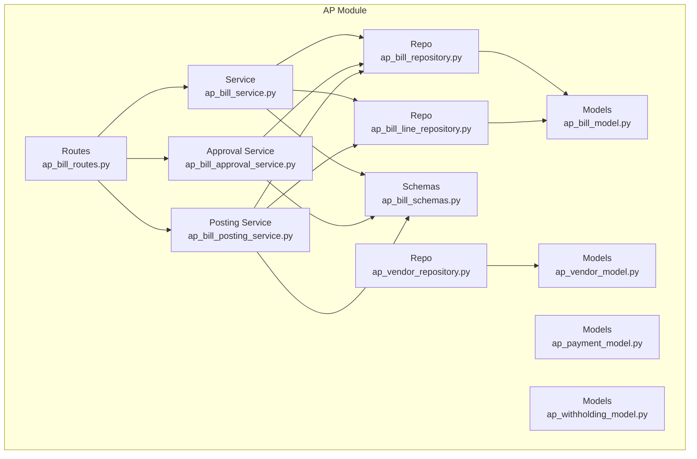

**Diagram sources**
- [ap_bill_routes.py](file://app/modules/ap/api/routes/ap_bill_routes.py#L1-L262)
- [ap_bill_service.py](file://app/modules/ap/services/ap_bill_service.py#L1-L111)
- [ap_bill_approval_service.py](file://app/modules/ap/services/ap_bill_approval_service.py#L1-L229)
- [ap_bill_posting_service.py](file://app/modules/ap/services/ap_bill_posting_service.py#L1-L127)
- [ap_bill_repository.py](file://app/modules/ap/repositories/ap_bill_repository.py#L1-L38)
- [ap_bill_line_repository.py](file://app/modules/ap/repositories/ap_bill_line_repository.py#L1-L37)
- [ap_vendor_repository.py](file://app/modules/ap/repositories/ap_vendor_repository.py#L1-L46)
- [ap_bill_schemas.py](file://app/modules/ap/schemas/ap_bill_schemas.py#L1-L114)
- [ap_bill_model.py](file://app/modules/ap/models/ap_bill_model.py#L1-L102)
- [ap_payment_model.py](file://app/modules/ap/models/ap_payment_model.py#L1-L80)
- [ap_vendor_model.py](file://app/modules/ap/models/ap_vendor_model.py#L1-L40)
- [ap_withholding_model.py](file://app/modules/ap/models/ap_withholding_model.py#L1-L32)

**Section sources**
- [ap_bill_routes.py](file://app/modules/ap/api/routes/ap_bill_routes.py#L1-L262)
- [ap_bill_service.py](file://app/modules/ap/services/ap_bill_service.py#L1-L111)
- [ap_bill_approval_service.py](file://app/modules/ap/services/ap_bill_approval_service.py#L1-L229)
- [ap_bill_posting_service.py](file://app/modules/ap/services/ap_bill_posting_service.py#L1-L127)
- [ap_bill_model.py](file://app/modules/ap/models/ap_bill_model.py#L1-L102)
- [ap_payment_model.py](file://app/modules/ap/models/ap_payment_model.py#L1-L80)
- [ap_vendor_model.py](file://app/modules/ap/models/ap_vendor_model.py#L1-L40)
- [ap_withholding_model.py](file://app/modules/ap/models/ap_withholding_model.py#L1-L32)
- [ap_bill_schemas.py](file://app/modules/ap/schemas/ap_bill_schemas.py#L1-L114)
- [ap_bill_repository.py](file://app/modules/ap/repositories/ap_bill_repository.py#L1-L38)
- [ap_bill_line_repository.py](file://app/modules/ap/repositories/ap_bill_line_repository.py#L1-L37)
- [ap_vendor_repository.py](file://app/modules/ap/repositories/ap_vendor_repository.py#L1-L46)

## Core Components
- AP Bill and Lines: Persistent representation of vendor invoices and line items, including totals, amounts, and workflow metadata.
- AP Payment and Allocations: Representation of payments to vendors and how they allocate against bills.
- AP Vendor: Master data for vendors, consultants, and affiliates, including banking and tax details.
- AP Withholding Profile: Optional tax-withholding configurations linked to bills.
- Services: Orchestrate bill lifecycle (create/add lines), approval workflows, and posting to journals.
- Repositories: Encapsulate data access for bills, lines, and vendors.
- Routes: Expose REST endpoints for bill creation, listing, retrieval, approval actions, and posting with idempotency and optimistic locking.

**Section sources**
- [ap_bill_model.py](file://app/modules/ap/models/ap_bill_model.py#L1-L102)
- [ap_payment_model.py](file://app/modules/ap/models/ap_payment_model.py#L1-L80)
- [ap_vendor_model.py](file://app/modules/ap/models/ap_vendor_model.py#L1-L40)
- [ap_withholding_model.py](file://app/modules/ap/models/ap_withholding_model.py#L1-L32)
- [ap_bill_service.py](file://app/modules/ap/services/ap_bill_service.py#L1-L111)
- [ap_bill_approval_service.py](file://app/modules/ap/services/ap_bill_approval_service.py#L1-L229)
- [ap_bill_posting_service.py](file://app/modules/ap/services/ap_bill_posting_service.py#L1-L127)
- [ap_bill_repository.py](file://app/modules/ap/repositories/ap_bill_repository.py#L1-L38)
- [ap_bill_line_repository.py](file://app/modules/ap/repositories/ap_bill_line_repository.py#L1-L37)
- [ap_vendor_repository.py](file://app/modules/ap/repositories/ap_vendor_repository.py#L1-L46)
- [ap_bill_routes.py](file://app/modules/ap/api/routes/ap_bill_routes.py#L1-L262)

## Architecture Overview
The AP module follows a layered architecture:
- API routes accept requests, enforce idempotency and optimistic locking, and delegate to services.
- Services coordinate repositories and cross-module services (e.g., journal entry creation).
- Models define persistence and relationships; schemas define request/response contracts.
- Approval and SoD checks integrate with core modules for policy enforcement and segregation of duties.

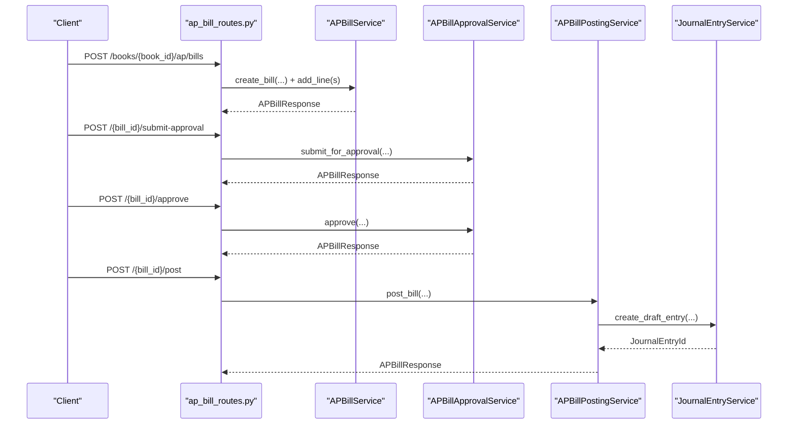

**Diagram sources**
- [ap_bill_routes.py](file://app/modules/ap/api/routes/ap_bill_routes.py#L31-L262)
- [ap_bill_service.py](file://app/modules/ap/services/ap_bill_service.py#L15-L111)
- [ap_bill_approval_service.py](file://app/modules/ap/services/ap_bill_approval_service.py#L26-L229)
- [ap_bill_posting_service.py](file://app/modules/ap/services/ap_bill_posting_service.py#L16-L127)

## Detailed Component Analysis

### AP Models
- APBill: Represents vendor invoices with lifecycle status, amounts, due dates, and workflow metadata. Includes relationships to vendor, lines, allocations, and journal entry.
- APBillLine: Represents line items with quantities, unit prices, amounts, and tax code placeholders.
- APPayment: Represents payments to vendors with method, reference, and links to bank accounts/transactions and allocations.
- APAllocation: Links payments to bills with allocated amounts and currencies.
- APVendor: Master data for vendors, including contact info, tax IDs, payment terms, default currency, and banking details.
- APWithholdingProfile: Optional tax-withholding profiles with rates and GL mapping.

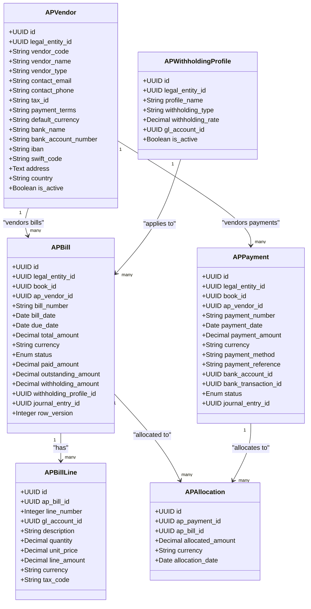

**Diagram sources**
- [ap_bill_model.py](file://app/modules/ap/models/ap_bill_model.py#L20-L102)
- [ap_payment_model.py](file://app/modules/ap/models/ap_payment_model.py#L19-L80)
- [ap_vendor_model.py](file://app/modules/ap/models/ap_vendor_model.py#L8-L40)
- [ap_withholding_model.py](file://app/modules/ap/models/ap_withholding_model.py#L9-L32)

**Section sources**
- [ap_bill_model.py](file://app/modules/ap/models/ap_bill_model.py#L1-L102)
- [ap_payment_model.py](file://app/modules/ap/models/ap_payment_model.py#L1-L80)
- [ap_vendor_model.py](file://app/modules/ap/models/ap_vendor_model.py#L1-L40)
- [ap_withholding_model.py](file://app/modules/ap/models/ap_withholding_model.py#L1-L32)

### AP Bill Routes and Business Logic
- Create Bill: Validates inputs, creates the bill in DRAFT, adds lines, recalculates totals, and returns the bill with populated lines.
- List Bills: Filters by entity/book/vendor/status.
- Get Bill: Returns a single bill and loads associated lines.
- Submit for Approval: Transitions from DRAFT to PENDING_APPROVAL or directly to APPROVED if approval is not required.
- Approve: Validates SoD separation of duties and transitions to APPROVED.
- Reject: Requires a reason and transitions to REJECTED.
- Post Bill: Requires APPROVED status, creates a journal entry, posts it, updates bill status to POSTED, and reloads lines.

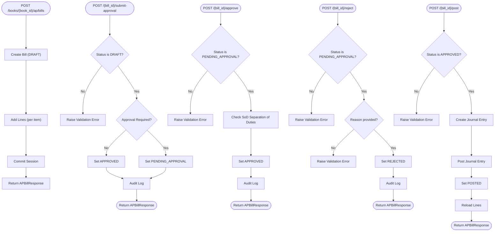

**Diagram sources**
- [ap_bill_routes.py](file://app/modules/ap/api/routes/ap_bill_routes.py#L31-L262)
- [ap_bill_approval_service.py](file://app/modules/ap/services/ap_bill_approval_service.py#L34-L204)
- [ap_bill_posting_service.py](file://app/modules/ap/services/ap_bill_posting_service.py#L27-L112)

**Section sources**
- [ap_bill_routes.py](file://app/modules/ap/api/routes/ap_bill_routes.py#L1-L262)

### AP Bill Service
- Responsibilities: Create bills, add lines, list bills, and fetch bills.
- Constraints: Lines can only be added to DRAFT bills; totals and outstanding amounts are updated automatically.

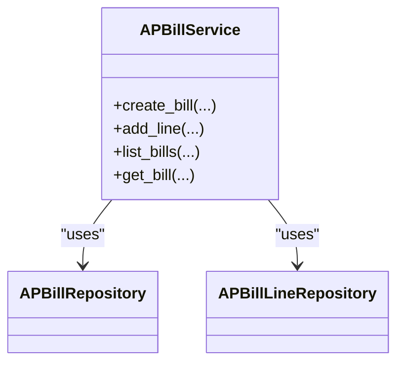

**Diagram sources**
- [ap_bill_service.py](file://app/modules/ap/services/ap_bill_service.py#L15-L111)
- [ap_bill_repository.py](file://app/modules/ap/repositories/ap_bill_repository.py#L11-L38)
- [ap_bill_line_repository.py](file://app/modules/ap/repositories/ap_bill_line_repository.py#L9-L37)

**Section sources**
- [ap_bill_service.py](file://app/modules/ap/services/ap_bill_service.py#L1-L111)

### AP Bill Approval Service
- Responsibilities: Enforce state transitions, check row version, evaluate approval policy, enforce SoD, and log audit events.
- Policies: Approval requirement is configurable per legal entity and object type.
- Compliance: SoD validation is integrated and can be overridden with reasons.

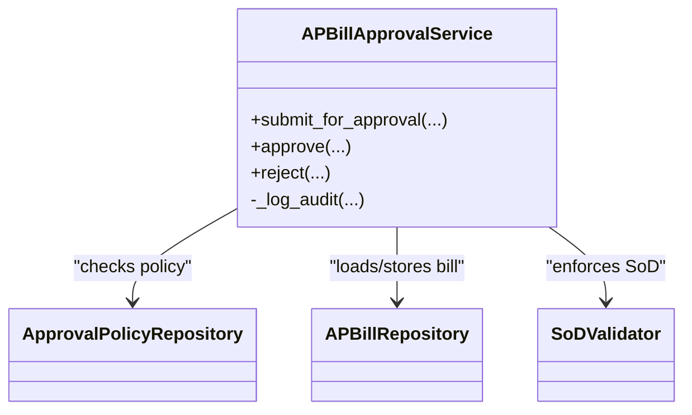

**Diagram sources**
- [ap_bill_approval_service.py](file://app/modules/ap/services/ap_bill_approval_service.py#L26-L229)
- [approval_policy_model.py](file://app/modules/core/models/approval_policy_model.py#L18-L36)
- [sod_validator.py](file://app/modules/core/services/sod_validator.py#L55-L63)

**Section sources**
- [ap_bill_approval_service.py](file://app/modules/ap/services/ap_bill_approval_service.py#L1-L229)
- [approval_policy_model.py](file://app/modules/core/models/approval_policy_model.py#L1-L36)
- [sod_validator.py](file://app/modules/core/services/sod_validator.py#L1-L78)

### AP Bill Posting Service
- Responsibilities: Post bills to the general ledger, validate preconditions, map GL accounts, create and post journal entries, and update bill state.
- Preconditions: Bill must be APPROVED and have at least one line; account mappings must be configured.

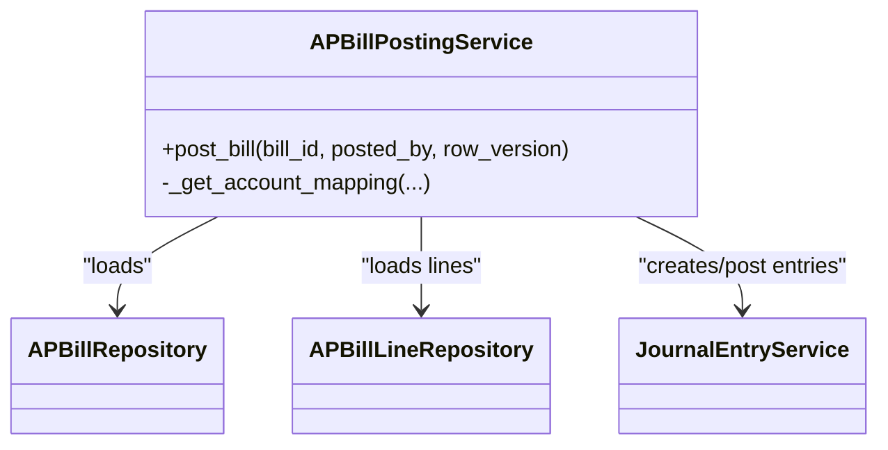

**Diagram sources**
- [ap_bill_posting_service.py](file://app/modules/ap/services/ap_bill_posting_service.py#L16-L127)
- [ap_bill_repository.py](file://app/modules/ap/repositories/ap_bill_repository.py#L11-L38)
- [ap_bill_line_repository.py](file://app/modules/ap/repositories/ap_bill_line_repository.py#L9-L37)

**Section sources**
- [ap_bill_posting_service.py](file://app/modules/ap/services/ap_bill_posting_service.py#L1-L127)

### AP Payment Models and Allocation
- APPayment tracks payment metadata, method, reference, and links to bank accounts/transactions and journal entries.
- APAllocation defines how payments distribute across bills, ensuring uniqueness per payment-bill pair.

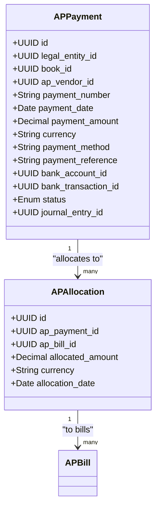

**Diagram sources**
- [ap_payment_model.py](file://app/modules/ap/models/ap_payment_model.py#L19-L80)

**Section sources**
- [ap_payment_model.py](file://app/modules/ap/models/ap_payment_model.py#L1-L80)

### AP Vendor Management
- APVendor stores vendor master data, defaults, and banking details.
- Repositories support creation, retrieval by ID/code, listing by entity, and updates.

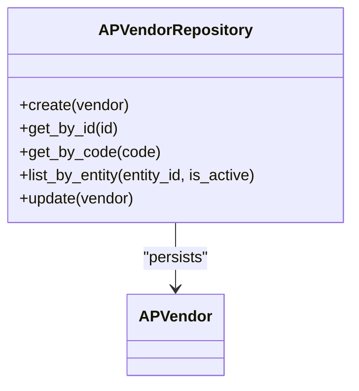

**Diagram sources**
- [ap_vendor_repository.py](file://app/modules/ap/repositories/ap_vendor_repository.py#L9-L46)
- [ap_vendor_model.py](file://app/modules/ap/models/ap_vendor_model.py#L8-L40)

**Section sources**
- [ap_vendor_repository.py](file://app/modules/ap/repositories/ap_vendor_repository.py#L1-L46)
- [ap_vendor_model.py](file://app/modules/ap/models/ap_vendor_model.py#L1-L40)

### AP Withholding Tax Management
- APWithholdingProfile defines tax-withholding configurations per legal entity and maps to GL accounts.
- APBill can link to a profile and accumulate withholding amounts.

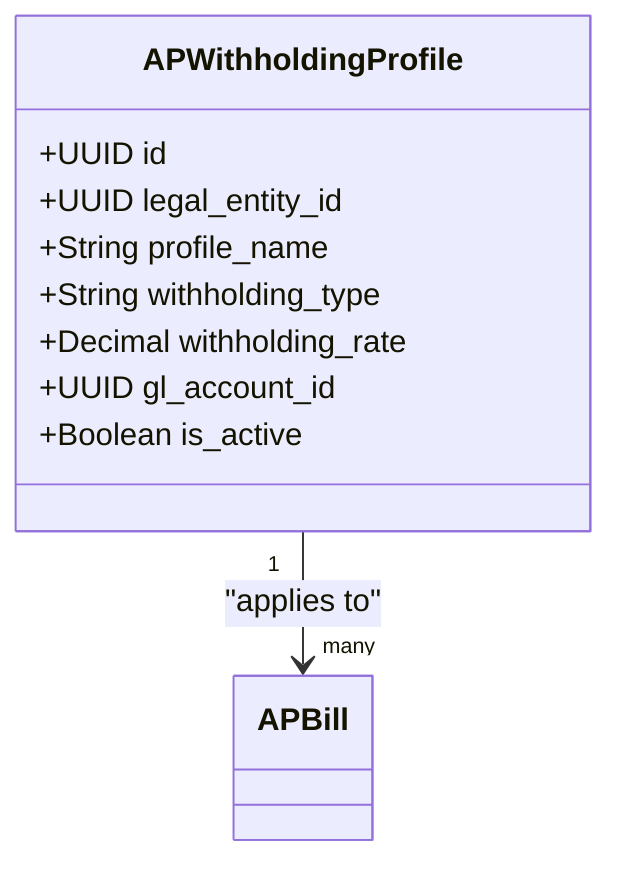

**Diagram sources**
- [ap_withholding_model.py](file://app/modules/ap/models/ap_withholding_model.py#L9-L32)
- [ap_bill_model.py](file://app/modules/ap/models/ap_bill_model.py#L20-L65)

**Section sources**
- [ap_withholding_model.py](file://app/modules/ap/models/ap_withholding_model.py#L1-L32)
- [ap_bill_model.py](file://app/modules/ap/models/ap_bill_model.py#L1-L102)

## Dependency Analysis
- Routes depend on services and schemas; services depend on repositories and cross-module services.
- Approval service integrates with core approval policy and SoD validator.
- Posting service depends on general ledger services for journal entries and account mappings.

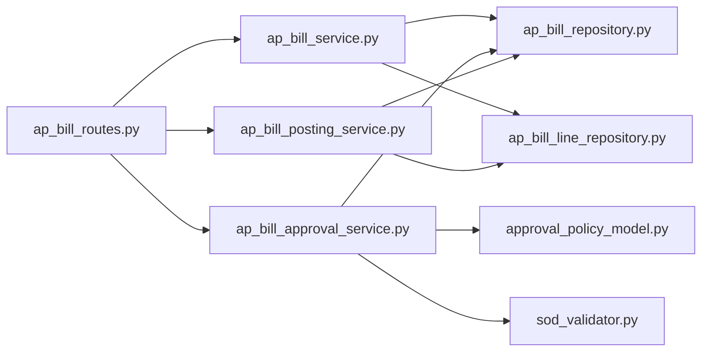

**Diagram sources**
- [ap_bill_routes.py](file://app/modules/ap/api/routes/ap_bill_routes.py#L1-L262)
- [ap_bill_service.py](file://app/modules/ap/services/ap_bill_service.py#L1-L111)
- [ap_bill_approval_service.py](file://app/modules/ap/services/ap_bill_approval_service.py#L1-L229)
- [ap_bill_posting_service.py](file://app/modules/ap/services/ap_bill_posting_service.py#L1-L127)
- [ap_bill_repository.py](file://app/modules/ap/repositories/ap_bill_repository.py#L1-L38)
- [ap_bill_line_repository.py](file://app/modules/ap/repositories/ap_bill_line_repository.py#L1-L37)
- [approval_policy_model.py](file://app/modules/core/models/approval_policy_model.py#L1-L36)
- [sod_validator.py](file://app/modules/core/services/sod_validator.py#L1-L78)

**Section sources**
- [ap_bill_routes.py](file://app/modules/ap/api/routes/ap_bill_routes.py#L1-L262)
- [ap_bill_service.py](file://app/modules/ap/services/ap_bill_service.py#L1-L111)
- [ap_bill_approval_service.py](file://app/modules/ap/services/ap_bill_approval_service.py#L1-L229)
- [ap_bill_posting_service.py](file://app/modules/ap/services/ap_bill_posting_service.py#L1-L127)
- [approval_policy_model.py](file://app/modules/core/models/approval_policy_model.py#L1-L36)
- [sod_validator.py](file://app/modules/core/services/sod_validator.py#L1-L78)

## Performance Considerations
- Use repository-level filtering (by entity, book, vendor, status) to limit result sets.
- Batch operations: Prefer bulk inserts for lines during bill creation to reduce round-trips.
- Idempotency keys prevent duplicate postings; ensure proper key generation and storage.
- Row version checks avoid lost-update conflicts during concurrent approval/posting.
- Journal entry creation and posting are transactional; keep payloads minimal to reduce lock contention.

## Troubleshooting Guide
Common issues and resolutions:
- Validation errors when adding lines to non-DRAFT bills.
- Approval errors when attempting to approve/reject non-pending bills.
- Posting errors when bills lack lines or are not approved.
- Account mapping missing for legal entity/book combinations.
- SoD violations requiring administrative override reasons.
- Rejection requires a reason; ensure client supplies a non-empty reason.

Operational checks:
- Verify bill status transitions align with route handlers.
- Confirm approval policy configuration per legal entity.
- Ensure GL account mappings exist for expense and liability accounts.
- Audit logs capture approval actions and reasons.

**Section sources**
- [ap_bill_service.py](file://app/modules/ap/services/ap_bill_service.py#L68-L91)
- [ap_bill_approval_service.py](file://app/modules/ap/services/ap_bill_approval_service.py#L114-L133)
- [ap_bill_posting_service.py](file://app/modules/ap/services/ap_bill_posting_service.py#L57-L60)
- [ap_bill_routes.py](file://app/modules/ap/api/routes/ap_bill_routes.py#L171-L194)

## Conclusion
The AP module provides a robust foundation for vendor management, bill processing, payment allocation, and withholding tax handling. Its services enforce business rules, integrate with approval and SoD controls, and post journal entries reliably. The modular design supports scalability, maintainability, and compliance through idempotency, optimistic locking, and audit trails.

## Appendices

### Example Workflows

- Vendor Onboarding
  - Create an APVendor record with legal entity linkage, vendor code/name, tax ID, payment terms, default currency, and banking details.
  - Retrieve by vendor code or list by entity to confirm availability.

- Bill Creation
  - Create an APBill in DRAFT with legal entity, book, vendor, numbers, dates, and currency.
  - Add APBillLine items with GL account, quantity, unit price, and line number.
  - Commit and reload lines for response.

- Approval Workflow
  - Submit for approval; if approval is not required, bill moves to APPROVED automatically.
  - Approve or reject; rejection requires a reason; SoD validation prevents self-approval unless overridden.

- Payment Processing
  - Create APPayment with method/reference and bank account/transaction linkage.
  - Allocate payments to bills via APAllocation entries.
  - Payments can be tracked by status and linked to journal entries.

- Withholding Tax Management
  - Configure APWithholdingProfile per legal entity with rate and GL mapping.
  - Link profile to APBill to compute withholding amounts during bill processing.

**Section sources**
- [ap_vendor_repository.py](file://app/modules/ap/repositories/ap_vendor_repository.py#L15-L40)
- [ap_bill_service.py](file://app/modules/ap/services/ap_bill_service.py#L23-L91)
- [ap_bill_approval_service.py](file://app/modules/ap/services/ap_bill_approval_service.py#L34-L204)
- [ap_payment_model.py](file://app/modules/ap/models/ap_payment_model.py#L19-L80)
- [ap_withholding_model.py](file://app/modules/ap/models/ap_withholding_model.py#L9-L32)