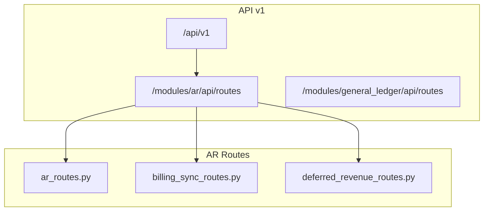
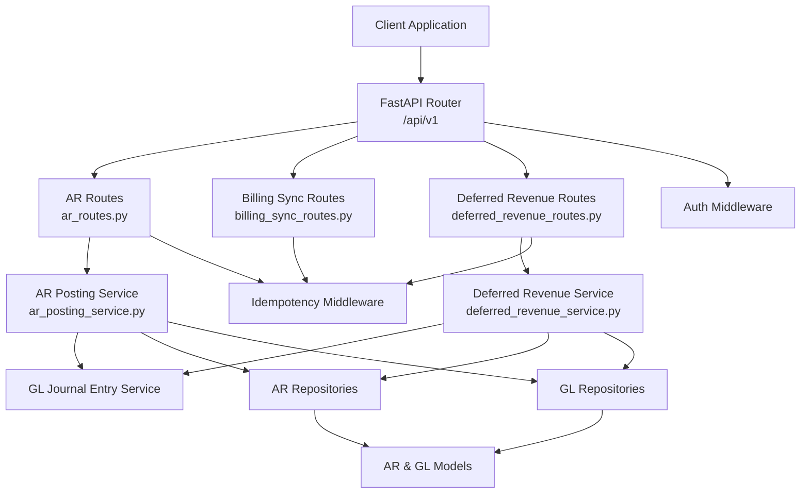
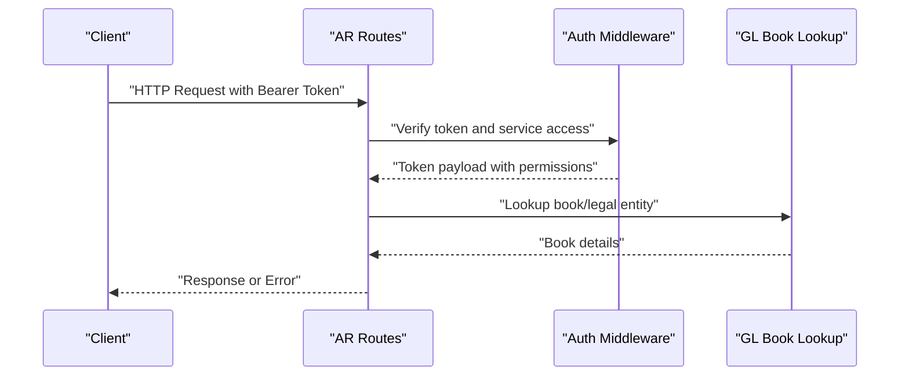
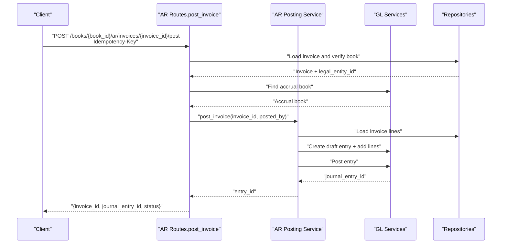
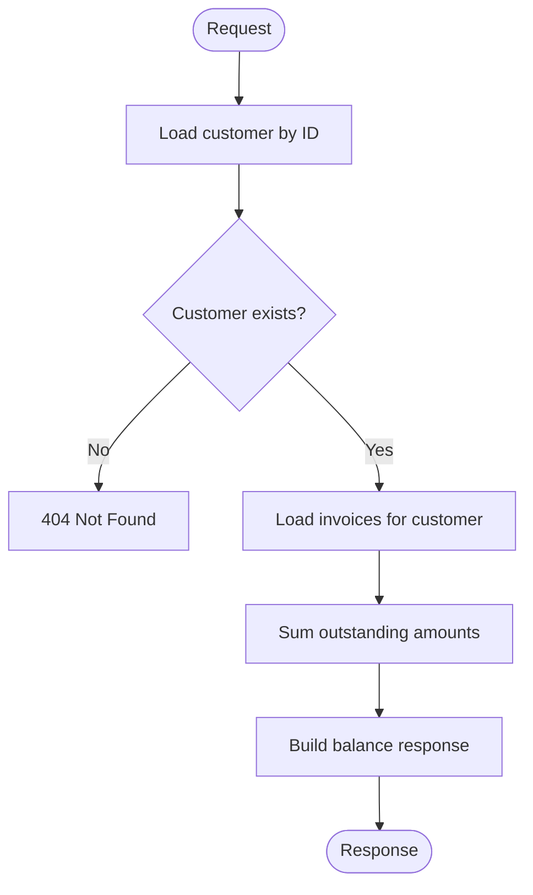
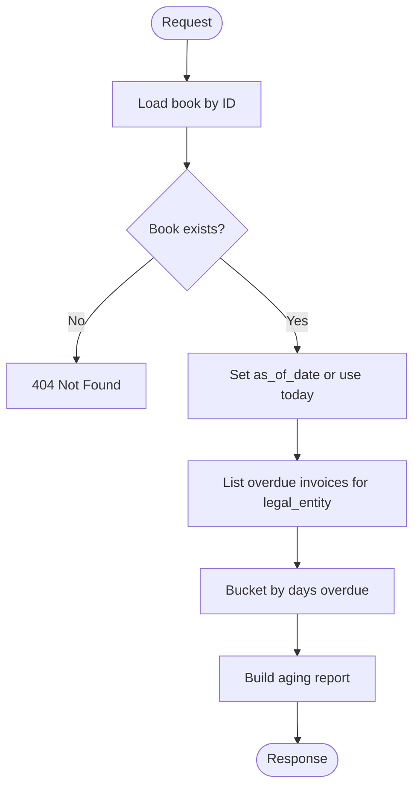
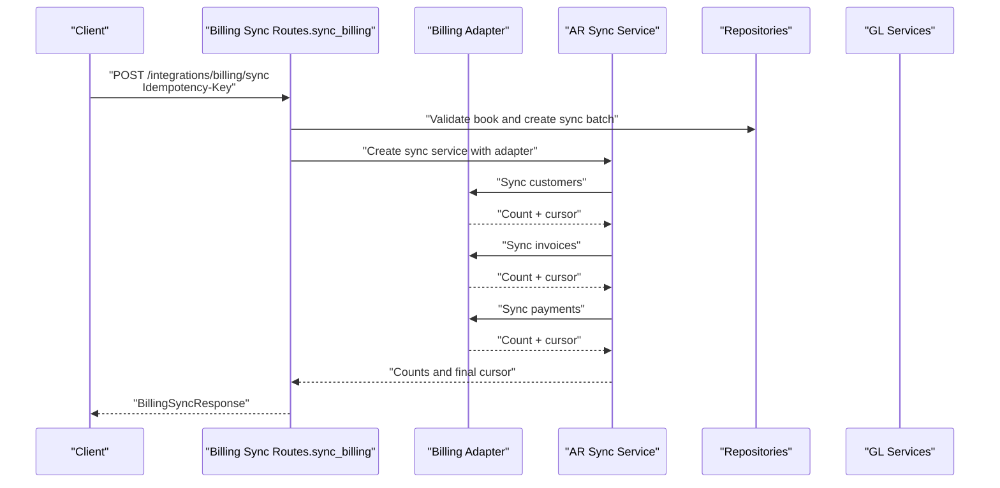
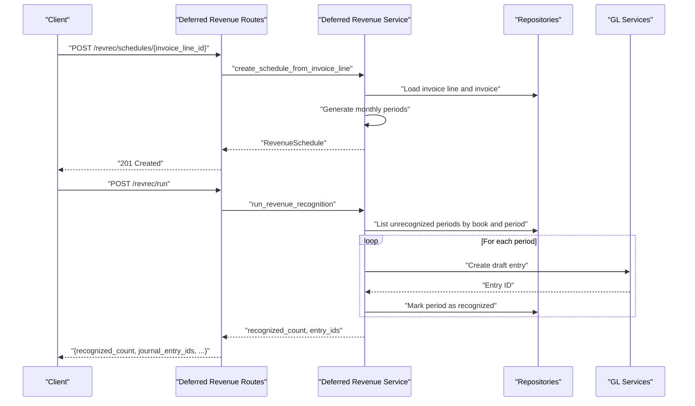
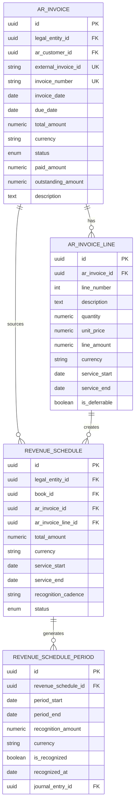
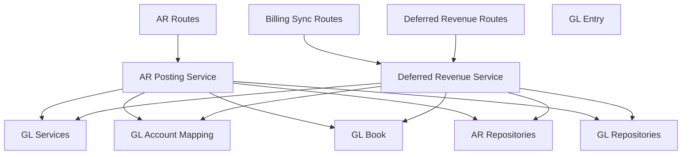

# AR API Endpoints

<cite>
**Referenced Files in This Document**
- [main.py](file://app/main.py)
- [v1 router](file://app/api/v1/__init__.py)
- [AR routes](file://app/modules/ar/api/routes/ar_routes.py)
- [Billing sync routes](file://app/modules/ar/api/routes/billing_sync_routes.py)
- [Deferred revenue routes](file://app/modules/ar/api/routes/deferred_revenue_routes.py)
- [AR posting service](file://app/modules/ar/services/ar_posting_service.py)
- [Deferred revenue service](file://app/modules/ar/services/deferred_revenue_service.py)
- [AR invoice model](file://app/modules/ar/models/ar_invoice_model.py)
- [Deferred revenue model](file://app/modules/ar/models/deferred_revenue_model.py)
- [AR sync schemas](file://app/modules/ar/schemas/ar_sync_schemas.py)
- [Deferred revenue schemas](file://app/modules/ar/schemas/deferred_revenue_schemas.py)
- [Idempotency infrastructure](file://app/core/idempotency.py)
- [Endpoint keys](file://app/core/endpoint_keys.py)
- [Auth middleware](file://app/auth/middleware.py)
</cite>

## Table of Contents
1. [Introduction](#introduction)
2. [Project Structure](#project-structure)
3. [Core Components](#core-components)
4. [Architecture Overview](#architecture-overview)
5. [Detailed Component Analysis](#detailed-component-analysis)
6. [Dependency Analysis](#dependency-analysis)
7. [Performance Considerations](#performance-considerations)
8. [Troubleshooting Guide](#troubleshooting-guide)
9. [Conclusion](#conclusion)

## Introduction
This document provides comprehensive API documentation for Accounts Receivable (AR) operations in the TrueVow Financial Management system. It covers HTTP methods, URL patterns, request/response schemas, authentication requirements, validation rules, error responses, idempotency support, and integration patterns with external systems. The AR module exposes endpoints for invoice posting, customer balance queries, AR aging reports, and deferred revenue recognition.

## Project Structure
The AR API endpoints are organized under the v1 API router and grouped by functional areas:
- AR invoice posting and listing
- Customer balance and AR aging reports
- Billing data synchronization
- Deferred revenue recognition

**Diagram sources**
- [v1 router](file://app/api/v1/__init__.py#L50-L53)
- [AR routes](file://app/modules/ar/api/routes/ar_routes.py#L16)
- [Billing sync routes](file://app/modules/ar/api/routes/billing_sync_routes.py#L18)
- [Deferred revenue routes](file://app/modules/ar/api/routes/deferred_revenue_routes.py#L16)

**Section sources**
- [main.py](file://app/main.py#L29-L30)
- [v1 router](file://app/api/v1/__init__.py#L50-L53)

## Core Components
- AR invoice posting service orchestrates journal entry creation and posting against an accrual book.
- Deferred revenue service manages revenue schedules and recognition entries.
- Billing sync routes integrate with external billing systems and maintain cursors for incremental sync.
- Idempotency infrastructure ensures safe retries and deduplication of requests.
- Authentication middleware validates JWT tokens and enforces service access.

**Section sources**
- [AR posting service](file://app/modules/ar/services/ar_posting_service.py#L17-L27)
- [Deferred revenue service](file://app/modules/ar/services/deferred_revenue_service.py#L25-L36)
- [Idempotency infrastructure](file://app/core/idempotency.py#L219-L251)
- [Auth middleware](file://app/auth/middleware.py#L59-L86)

## Architecture Overview
The AR API follows a layered architecture:
- HTTP routes define endpoints and extract parameters.
- Services encapsulate business logic and coordinate with repositories and GL services.
- Models represent persisted entities and enforce data constraints.
- Idempotency and authentication middleware provide cross-cutting concerns.

**Diagram sources**
- [v1 router](file://app/api/v1/__init__.py#L50-L53)
- [AR routes](file://app/modules/ar/api/routes/ar_routes.py#L16)
- [Billing sync routes](file://app/modules/ar/api/routes/billing_sync_routes.py#L18)
- [Deferred revenue routes](file://app/modules/ar/api/routes/deferred_revenue_routes.py#L16)
- [AR posting service](file://app/modules/ar/services/ar_posting_service.py#L17-L27)
- [Deferred revenue service](file://app/modules/ar/services/deferred_revenue_service.py#L25-L36)
- [Idempotency infrastructure](file://app/core/idempotency.py#L219-L251)
- [Auth middleware](file://app/auth/middleware.py#L59-L86)

## Detailed Component Analysis

### Authentication and Authorization
- Authentication: All endpoints require a valid JWT bearer token. The middleware validates tokens against a centralized auth service or locally if configured.
- Authorization: Access is restricted to users with the "financial_management" service permission.

**Diagram sources**
- [Auth middleware](file://app/auth/middleware.py#L59-L86)
- [AR routes](file://app/modules/ar/api/routes/ar_routes.py#L38-L44)

**Section sources**
- [Auth middleware](file://app/auth/middleware.py#L17-L86)

### Invoice Posting
- Purpose: Post an issued AR invoice to the accrual book, generating journal entries and linking to GL accounts.
- Endpoint: POST /api/v1/books/{book_id}/ar/invoices/{invoice_id}/post
- Path parameters:
  - book_id: UUID of the target book
  - invoice_id: UUID of the invoice to post
  - posted_by: UUID of the acting user
- Idempotency: Required via Idempotency-Key header; uses AR_INVOICE_POST endpoint key.
- Validation:
  - Invoice must exist and belong to the specified book’s legal entity.
  - Invoice status must be ISSUED.
  - Accrual book must exist for the legal entity.
- Response: { invoice_id, journal_entry_id, status }
- Errors:
  - 404: Invoice or book not found
  - 400: Invoice does not belong to book, invalid status, missing accrual book
  - 409/425: Idempotency conflicts or in-progress requests

**Diagram sources**
- [AR routes](file://app/modules/ar/api/routes/ar_routes.py#L19-L75)
- [AR posting service](file://app/modules/ar/services/ar_posting_service.py#L28-L141)

**Section sources**
- [AR routes](file://app/modules/ar/api/routes/ar_routes.py#L19-L75)
- [AR posting service](file://app/modules/ar/services/ar_posting_service.py#L28-L141)
- [Endpoint keys](file://app/core/endpoint_keys.py#L22)
- [Idempotency infrastructure](file://app/core/idempotency.py#L219-L481)

### Customer Balance Query
- Purpose: Retrieve the total outstanding balance for a customer across all invoices.
- Endpoint: GET /api/v1/books/{book_id}/ar/customers/{customer_id}/balance
- Path parameters:
  - book_id: UUID of the book
  - customer_id: UUID of the customer
- Response: { customer_id, customer_name, total_outstanding, currency, invoice_count }
- Errors:
  - 404: Customer not found

**Diagram sources**
- [AR routes](file://app/modules/ar/api/routes/ar_routes.py#L105-L127)

**Section sources**
- [AR routes](file://app/modules/ar/api/routes/ar_routes.py#L105-L127)

### AR Aging Report
- Purpose: Generate an aging report of overdue invoices for a given book as of a specific date.
- Endpoint: GET /api/v1/books/{book_id}/ar/aging
- Path parameters:
  - book_id: UUID of the book
- Query parameters:
  - as_of_date: Optional date; defaults to today
- Response: { as_of_date, aging_buckets: { "0-30": { count, total }, ... } }
- Errors:
  - 404: Book not found

**Diagram sources**
- [AR routes](file://app/modules/ar/api/routes/ar_routes.py#L130-L177)

**Section sources**
- [AR routes](file://app/modules/ar/api/routes/ar_routes.py#L130-L177)

### Billing Data Synchronization
- Purpose: Sync customers, invoices, and payments from an external billing service into the AR module, maintaining cursors for incremental sync.
- Endpoint: POST /api/v1/integrations/billing/sync
- Path parameters:
  - book_id: UUID of the book
- Request body (BillingSyncRequest):
  - entity_id: UUID of the legal entity
  - since_cursor: Optional string cursor for incremental sync
  - full_resync: Boolean flag to force full resync
- Idempotency: Required; uses BILLING_SYNC endpoint key. Creates a sync batch with correlation metadata.
- Response (BillingSyncResponse):
  - entity_id, customers_synced, invoices_synced, payments_synced, next_cursor, sync_timestamp
- Errors:
  - 404: Book not found
  - 400: Book does not belong to entity
  - Propagated validation errors from sync process

**Diagram sources**
- [Billing sync routes](file://app/modules/ar/api/routes/billing_sync_routes.py#L29-L167)

**Section sources**
- [Billing sync routes](file://app/modules/ar/api/routes/billing_sync_routes.py#L29-L167)
- [AR sync schemas](file://app/modules/ar/schemas/ar_sync_schemas.py#L8-L22)
- [Endpoint keys](file://app/core/endpoint_keys.py#L42)
- [Idempotency infrastructure](file://app/core/idempotency.py#L219-L481)

### Deferred Revenue Recognition
- Purpose: Create revenue schedules from invoice lines and run revenue recognition for a period, generating journal entries.
- Endpoints:
  - POST /api/v1/books/{book_id}/revrec/schedules/{invoice_line_id}
    - Creates a revenue schedule from a deferrable invoice line.
  - GET /api/v1/books/{book_id}/revrec/schedules
    - Lists active revenue schedules for a book.
  - POST /api/v1/books/{book_id}/revrec/run
    - Runs revenue recognition for a specified period.
- Request/response schemas:
  - RevenueRecognitionRequest: { book_id, period_start, period_end, posted_by }
  - RevenueScheduleResponse: Includes schedule metadata and periods
  - RevenueSchedulePeriodResponse: Includes period details and recognition status
- Validation:
  - Invoice line must be deferrable and have service start/end dates.
  - Period recognition filters by book and unrecognized status.
- Response:
  - POST /run returns { recognized_count, journal_entry_ids, period_start, period_end }

**Diagram sources**
- [Deferred revenue routes](file://app/modules/ar/api/routes/deferred_revenue_routes.py#L19-L74)
- [Deferred revenue service](file://app/modules/ar/services/deferred_revenue_service.py#L37-L165)

**Section sources**
- [Deferred revenue routes](file://app/modules/ar/api/routes/deferred_revenue_routes.py#L19-L74)
- [Deferred revenue service](file://app/modules/ar/services/deferred_revenue_service.py#L37-L165)
- [Deferred revenue schemas](file://app/modules/ar/schemas/deferred_revenue_schemas.py#L9-L52)

### Data Models and Validation Rules
- AR Invoice Model:
  - Status enum includes DRAFT, ISSUED, PAID, PARTIALLY_PAID, OVERDUE, CANCELLED, REFUNDED.
  - Outstanding amount computed as total minus paid.
  - External invoice ID must be unique.
- Deferred Revenue Models:
  - ScheduleStatus includes ACTIVE, COMPLETED, CANCELLED.
  - Recognition cadence supports configurable intervals.
  - Period uniqueness constrained by schedule and period_start.

**Diagram sources**
- [AR invoice model](file://app/modules/ar/models/ar_invoice_model.py#L21-L81)
- [Deferred revenue model](file://app/modules/ar/models/deferred_revenue_model.py#L17-L71)

**Section sources**
- [AR invoice model](file://app/modules/ar/models/ar_invoice_model.py#L10-L81)
- [Deferred revenue model](file://app/modules/ar/models/deferred_revenue_model.py#L10-L71)

## Dependency Analysis
- Endpoint versioning: All AR endpoints are exposed under /api/v1.
- Idempotency keys: AR_INVOICE_POST and BILLING_SYNC constants ensure stable endpoint identification for idempotency.
- Cross-module dependencies:
  - AR routes depend on general ledger repositories for book validation and period lookup.
  - AR services depend on GL journal entry service and GL account mapping repository.
  - Deferred revenue service depends on AR invoice line repository and GL services.

**Diagram sources**
- [AR routes](file://app/modules/ar/api/routes/ar_routes.py#L16)
- [Billing sync routes](file://app/modules/ar/api/routes/billing_sync_routes.py#L18)
- [Deferred revenue routes](file://app/modules/ar/api/routes/deferred_revenue_routes.py#L16)
- [AR posting service](file://app/modules/ar/services/ar_posting_service.py#L17-L27)
- [Deferred revenue service](file://app/modules/ar/services/deferred_revenue_service.py#L25-L36)

**Section sources**
- [Endpoint keys](file://app/core/endpoint_keys.py#L21-L42)
- [Idempotency infrastructure](file://app/core/idempotency.py#L219-L481)

## Performance Considerations
- Idempotency overhead: Canonical JSON encoding and hashing add CPU cost; ensure idempotency keys are stable and request bodies are minimal.
- Batch processing: Billing sync creates a batch record and updates cursors atomically; consider pagination and cursor-based incremental sync to avoid large payloads.
- Deferred revenue generation: Monthly period generation iterates by month; ensure service_start/service_end ranges are reasonable to prevent excessive period creation.
- Database constraints: Unique constraints on invoice line numbers and revenue schedule periods prevent duplicates and improve query performance.

[No sources needed since this section provides general guidance]

## Troubleshooting Guide
- Authentication failures:
  - 401 Unauthorized: Invalid or expired token.
  - 403 Forbidden: Missing financial_management service permission.
- Authorization failures:
  - 404 Not Found: Book or entity not found.
  - 400 Bad Request: Invoice/book mismatch or invalid status.
- Idempotency conflicts:
  - 409 Conflict: Idempotency key reused with different payload.
  - 409 Conflict: Request in progress (IDEMPOTENCY_IN_PROGRESS) with Retry-After header.
  - 425 Too Early: Stale lock exceeded TTL; server transitions to FAILED automatically.
- Validation errors:
  - 400 Bad Request: Missing required fields, invalid enums, or business rule violations (e.g., non-deferrable line for schedule creation).

**Section sources**
- [Auth middleware](file://app/auth/middleware.py#L48-L86)
- [Idempotency infrastructure](file://app/core/idempotency.py#L297-L377)
- [AR routes](file://app/modules/ar/api/routes/ar_routes.py#L35-L44)
- [Billing sync routes](file://app/modules/ar/api/routes/billing_sync_routes.py#L42-L46)

## Conclusion
The AR API provides robust endpoints for invoice posting, customer balances, AR aging reports, billing synchronization, and deferred revenue recognition. Built-in idempotency and strict validation ensure reliable integrations, while centralized authentication and authorization protect sensitive financial data. Clients should leverage idempotency keys for safe retries, use cursors for incremental billing sync, and implement proper error handling for conflict and progress scenarios.