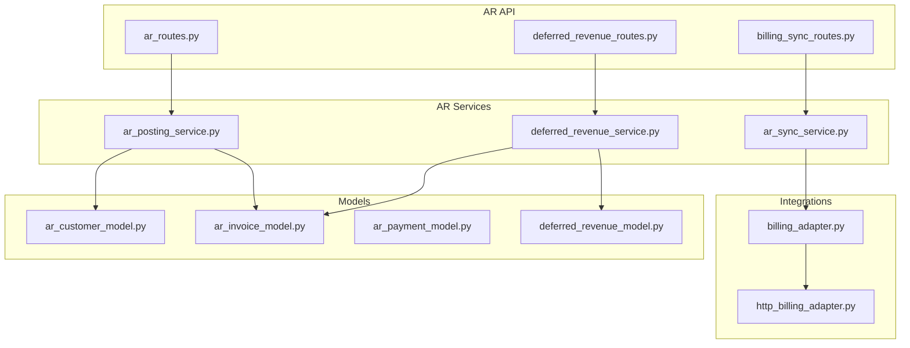
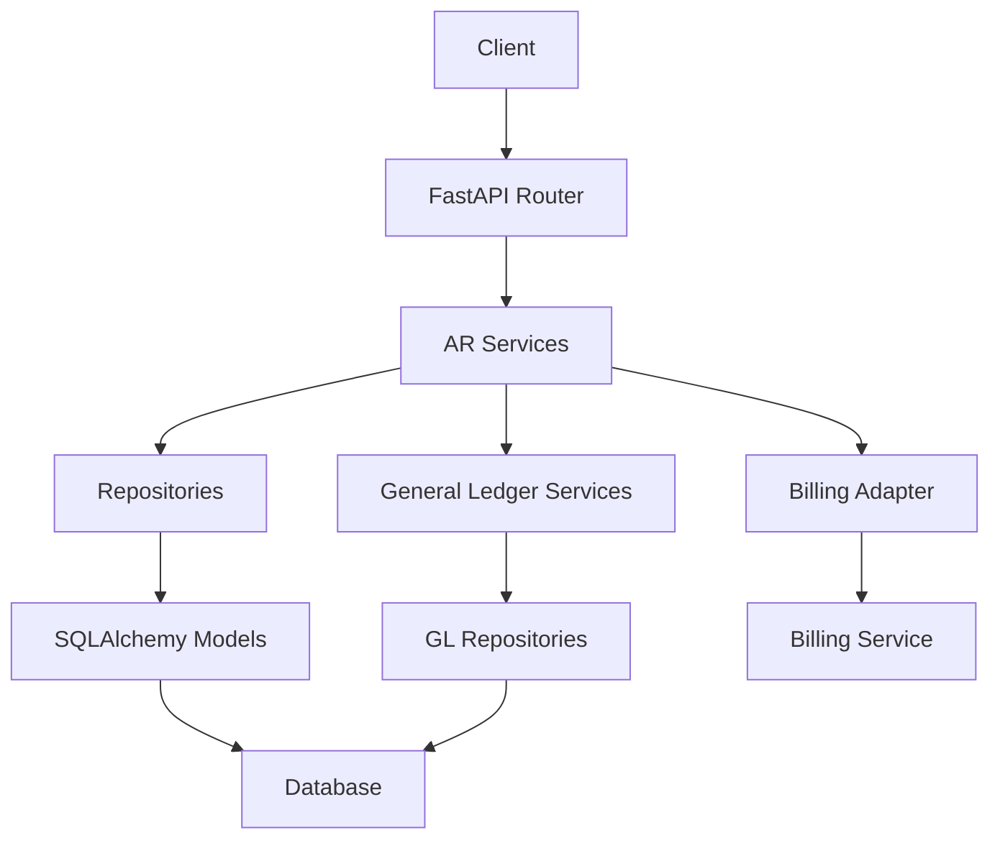
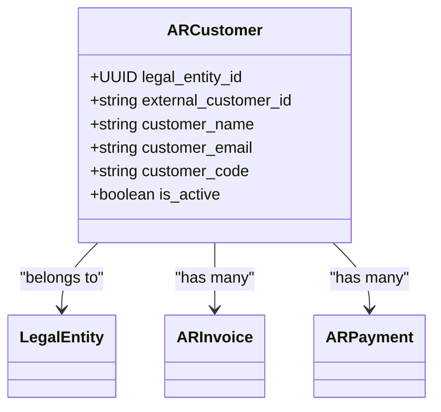
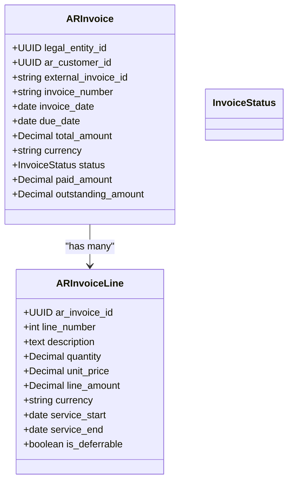
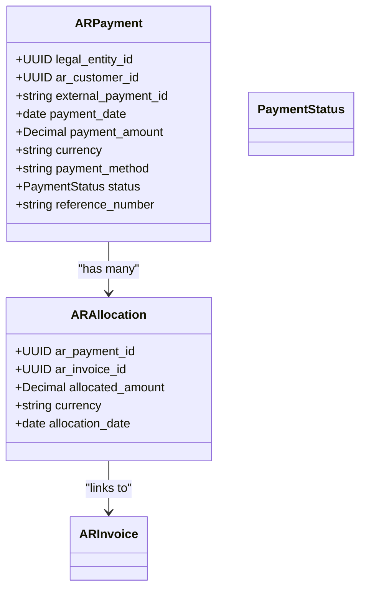
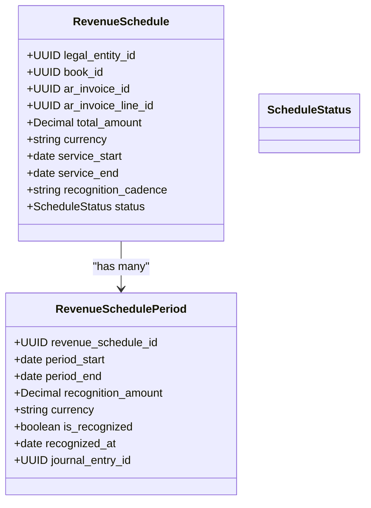
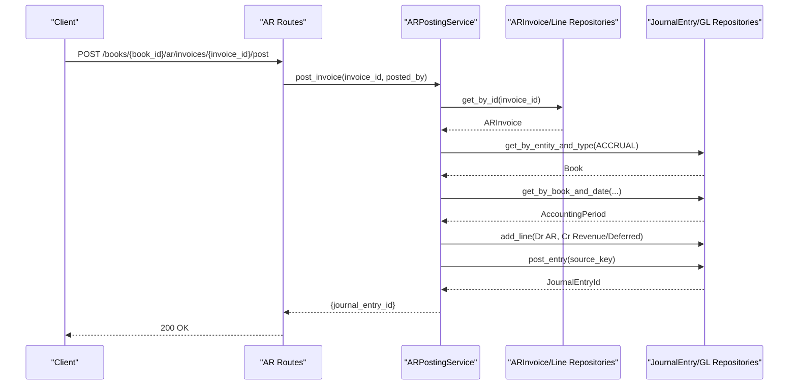
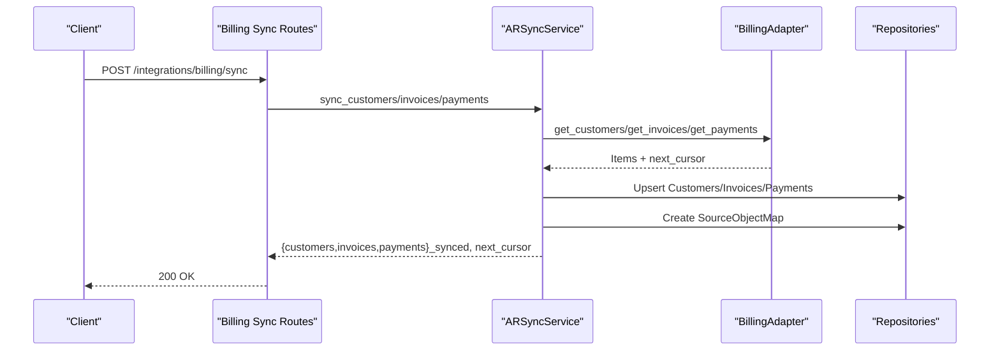
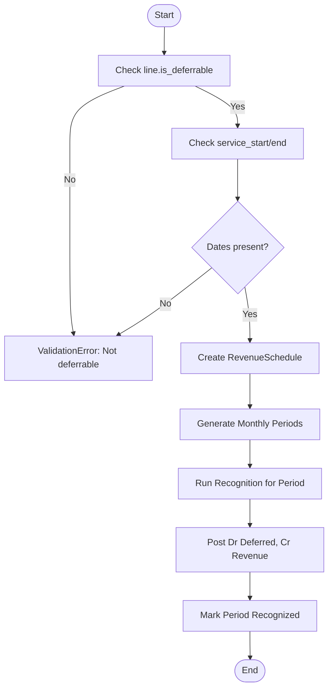
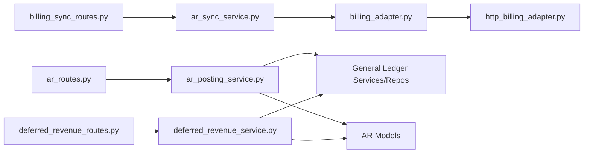

# Accounts Receivable Module

<cite>
**Referenced Files in This Document**
- [ar_customer_model.py](file://app/modules/ar/models/ar_customer_model.py)
- [ar_invoice_model.py](file://app/modules/ar/models/ar_invoice_model.py)
- [ar_payment_model.py](file://app/modules/ar/models/ar_payment_model.py)
- [deferred_revenue_model.py](file://app/modules/ar/models/deferred_revenue_model.py)
- [ar_routes.py](file://app/modules/ar/api/routes/ar_routes.py)
- [billing_sync_routes.py](file://app/modules/ar/api/routes/billing_sync_routes.py)
- [deferred_revenue_routes.py](file://app/modules/ar/api/routes/deferred_revenue_routes.py)
- [ar_posting_service.py](file://app/modules/ar/services/ar_posting_service.py)
- [ar_sync_service.py](file://app/modules/ar/services/ar_sync_service.py)
- [deferred_revenue_service.py](file://app/modules/ar/services/deferred_revenue_service.py)
- [billing_adapter.py](file://app/modules/ar/integrations/billing_adapter.py)
- [http_billing_adapter.py](file://app/modules/ar/integrations/http_billing_adapter.py)
</cite>

## Table of Contents
1. [Introduction](#introduction)
2. [Project Structure](#project-structure)
3. [Core Components](#core-components)
4. [Architecture Overview](#architecture-overview)
5. [Detailed Component Analysis](#detailed-component-analysis)
6. [Dependency Analysis](#dependency-analysis)
7. [Performance Considerations](#performance-considerations)
8. [Troubleshooting Guide](#troubleshooting-guide)
9. [Conclusion](#conclusion)
10. [Appendices](#appendices)

## Introduction
This document provides comprehensive documentation for the Accounts Receivable (AR) module. It covers customer management, invoice processing, payment allocation, and deferred revenue recognition. It also explains the AR posting service, AR sync service, and deferred revenue service implementations, along with their associated models, repositories, and API routes. Integration with the Billing module is addressed through a one-way data sync mechanism that pulls customer, invoice, and payment data from Billing into the AR domain.

## Project Structure
The AR module is organized by concerns:
- Models define the persistent entities and enumerations for AR data.
- Repositories encapsulate data access patterns for each model.
- Services orchestrate business logic for synchronization, posting, and revenue recognition.
- Integrations provide adapters to external systems (notably Billing).
- API routes expose endpoints for AR operations, billing sync, and deferred revenue.

**Diagram sources**
- [ar_routes.py](file://app/modules/ar/api/routes/ar_routes.py#L1-L178)
- [billing_sync_routes.py](file://app/modules/ar/api/routes/billing_sync_routes.py#L1-L192)
- [deferred_revenue_routes.py](file://app/modules/ar/api/routes/deferred_revenue_routes.py#L1-L75)
- [ar_sync_service.py](file://app/modules/ar/services/ar_sync_service.py#L1-L325)
- [ar_posting_service.py](file://app/modules/ar/services/ar_posting_service.py#L1-L154)
- [deferred_revenue_service.py](file://app/modules/ar/services/deferred_revenue_service.py#L1-L241)
- [billing_adapter.py](file://app/modules/ar/integrations/billing_adapter.py#L1-L191)
- [http_billing_adapter.py](file://app/modules/ar/integrations/http_billing_adapter.py#L1-L130)
- [ar_customer_model.py](file://app/modules/ar/models/ar_customer_model.py#L1-L30)
- [ar_invoice_model.py](file://app/modules/ar/models/ar_invoice_model.py#L1-L81)
- [ar_payment_model.py](file://app/modules/ar/models/ar_payment_model.py#L1-L70)
- [deferred_revenue_model.py](file://app/modules/ar/models/deferred_revenue_model.py#L1-L71)

**Section sources**
- [ar_routes.py](file://app/modules/ar/api/routes/ar_routes.py#L1-L178)
- [billing_sync_routes.py](file://app/modules/ar/api/routes/billing_sync_routes.py#L1-L192)
- [deferred_revenue_routes.py](file://app/modules/ar/api/routes/deferred_revenue_routes.py#L1-L75)
- [ar_sync_service.py](file://app/modules/ar/services/ar_sync_service.py#L1-L325)
- [ar_posting_service.py](file://app/modules/ar/services/ar_posting_service.py#L1-L154)
- [deferred_revenue_service.py](file://app/modules/ar/services/deferred_revenue_service.py#L1-L241)
- [billing_adapter.py](file://app/modules/ar/integrations/billing_adapter.py#L1-L191)
- [http_billing_adapter.py](file://app/modules/ar/integrations/http_billing_adapter.py#L1-L130)
- [ar_customer_model.py](file://app/modules/ar/models/ar_customer_model.py#L1-L30)
- [ar_invoice_model.py](file://app/modules/ar/models/ar_invoice_model.py#L1-L81)
- [ar_payment_model.py](file://app/modules/ar/models/ar_payment_model.py#L1-L70)
- [deferred_revenue_model.py](file://app/modules/ar/models/deferred_revenue_model.py#L1-L71)

## Core Components
This section outlines the primary models and services that underpin AR operations.

- Customer Management
  - ARCustomer: Represents a customer mapped from Billing, linked to a legal entity and tracked for activity.
  - ARCustomerRepository: Provides CRUD and lookup operations by external ID and customer filters.

- Invoice Processing
  - ARInvoice: Represents an invoice synced from Billing, including status, amounts, due date, and links to lines and allocations.
  - ARInvoiceLine: Line items with quantities, prices, totals, and optional service period metadata for deferred revenue.
  - ARInvoiceRepository and ARInvoiceLineRepository: Data access for invoices and lines.

- Payment Allocation
  - ARPayment: Payment record synced from Billing, including method, status, and linkages to allocations.
  - ARAllocation: Links payments to invoices with allocated amounts and dates.
  - ARPaymentRepository and ARAllocationRepository: Data access for payments and allocations.

- Deferred Revenue Recognition
  - RevenueSchedule: Encapsulates the recognition schedule for deferrable invoice lines, including cadence and status.
  - RevenueSchedulePeriod: Monthly recognition periods with amounts and recognition flags.
  - DeferredRevenueService: Orchestrates schedule creation and monthly revenue recognition posting.

- AR Posting Service
  - ARPostingService: Posts invoices to the Accrual book, creating journal entries and mapping GL accounts per line classification (immediate revenue vs. deferred revenue).

- AR Sync Service
  - ARSyncService: One-way sync from Billing for customers, invoices, and payments, maintaining cursors and source-to-internal mappings.

- Billing Integration
  - BillingAdapter interface and HTTPBillingAdapter: Abstraction and HTTP client for Billing service, with a mock adapter for development/testing.

**Section sources**
- [ar_customer_model.py](file://app/modules/ar/models/ar_customer_model.py#L1-L30)
- [ar_invoice_model.py](file://app/modules/ar/models/ar_invoice_model.py#L1-L81)
- [ar_payment_model.py](file://app/modules/ar/models/ar_payment_model.py#L1-L70)
- [deferred_revenue_model.py](file://app/modules/ar/models/deferred_revenue_model.py#L1-L71)
- [ar_posting_service.py](file://app/modules/ar/services/ar_posting_service.py#L1-L154)
- [ar_sync_service.py](file://app/modules/ar/services/ar_sync_service.py#L1-L325)
- [billing_adapter.py](file://app/modules/ar/integrations/billing_adapter.py#L1-L191)
- [http_billing_adapter.py](file://app/modules/ar/integrations/http_billing_adapter.py#L1-L130)

## Architecture Overview
The AR module follows a layered architecture:
- API routes accept requests and delegate to services.
- Services coordinate repositories and external integrations.
- Models define persistence and relationships.
- Integrations abstract external system interactions.

**Diagram sources**
- [ar_routes.py](file://app/modules/ar/api/routes/ar_routes.py#L1-L178)
- [billing_sync_routes.py](file://app/modules/ar/api/routes/billing_sync_routes.py#L1-L192)
- [deferred_revenue_routes.py](file://app/modules/ar/api/routes/deferred_revenue_routes.py#L1-L75)
- [ar_sync_service.py](file://app/modules/ar/services/ar_sync_service.py#L1-L325)
- [ar_posting_service.py](file://app/modules/ar/services/ar_posting_service.py#L1-L154)
- [deferred_revenue_service.py](file://app/modules/ar/services/deferred_revenue_service.py#L1-L241)
- [billing_adapter.py](file://app/modules/ar/integrations/billing_adapter.py#L1-L191)
- [http_billing_adapter.py](file://app/modules/ar/integrations/http_billing_adapter.py#L1-L130)

## Detailed Component Analysis

### Customer Models
ARCustomer maps Billing customers with identifiers, contact info, and activity flags. It maintains relationships to LegalEntity, ARInvoice, and ARPayment.

**Diagram sources**
- [ar_customer_model.py](file://app/modules/ar/models/ar_customer_model.py#L1-L30)

**Section sources**
- [ar_customer_model.py](file://app/modules/ar/models/ar_customer_model.py#L1-L30)

### Invoice Models
ARInvoice captures invoice metadata and status, with computed paid/outstanding amounts. ARInvoiceLine holds line-level details and deferral metadata.

**Diagram sources**
- [ar_invoice_model.py](file://app/modules/ar/models/ar_invoice_model.py#L1-L81)

**Section sources**
- [ar_invoice_model.py](file://app/modules/ar/models/ar_invoice_model.py#L1-L81)

### Payment Models
ARPayment records payment events from Billing, and ARAllocation links payments to invoices with allocated amounts.

**Diagram sources**
- [ar_payment_model.py](file://app/modules/ar/models/ar_payment_model.py#L1-L70)

**Section sources**
- [ar_payment_model.py](file://app/modules/ar/models/ar_payment_model.py#L1-L70)

### Deferred Revenue Models
RevenueSchedule defines the recognition plan for deferrable lines, and RevenueSchedulePeriod defines monthly recognition periods.

**Diagram sources**
- [deferred_revenue_model.py](file://app/modules/ar/models/deferred_revenue_model.py#L1-L71)

**Section sources**
- [deferred_revenue_model.py](file://app/modules/ar/models/deferred_revenue_model.py#L1-L71)

### AR Posting Service
Posts AR invoices to the Accrual book by creating journal entries and mapping GL accounts. It supports immediate revenue and deferred revenue lines.

**Diagram sources**
- [ar_routes.py](file://app/modules/ar/api/routes/ar_routes.py#L19-L75)
- [ar_posting_service.py](file://app/modules/ar/services/ar_posting_service.py#L28-L141)

**Section sources**
- [ar_posting_service.py](file://app/modules/ar/services/ar_posting_service.py#L1-L154)
- [ar_routes.py](file://app/modules/ar/api/routes/ar_routes.py#L1-L178)

### AR Sync Service
Performs one-way sync from Billing for customers, invoices, and payments. Maintains cursors and source-to-internal mappings.

**Diagram sources**
- [billing_sync_routes.py](file://app/modules/ar/api/routes/billing_sync_routes.py#L29-L167)
- [ar_sync_service.py](file://app/modules/ar/services/ar_sync_service.py#L37-L324)
- [billing_adapter.py](file://app/modules/ar/integrations/billing_adapter.py#L8-L59)
- [http_billing_adapter.py](file://app/modules/ar/integrations/http_billing_adapter.py#L10-L130)

**Section sources**
- [ar_sync_service.py](file://app/modules/ar/services/ar_sync_service.py#L1-L325)
- [billing_sync_routes.py](file://app/modules/ar/api/routes/billing_sync_routes.py#L1-L192)
- [billing_adapter.py](file://app/modules/ar/integrations/billing_adapter.py#L1-L191)
- [http_billing_adapter.py](file://app/modules/ar/integrations/http_billing_adapter.py#L1-L130)

### Deferred Revenue Service
Creates schedules from deferrable invoice lines and posts monthly revenue recognition entries.

**Diagram sources**
- [deferred_revenue_service.py](file://app/modules/ar/services/deferred_revenue_service.py#L37-L241)
- [deferred_revenue_model.py](file://app/modules/ar/models/deferred_revenue_model.py#L17-L71)

**Section sources**
- [deferred_revenue_service.py](file://app/modules/ar/services/deferred_revenue_service.py#L1-L241)
- [deferred_revenue_model.py](file://app/modules/ar/models/deferred_revenue_model.py#L1-L71)

### AR API Routes
- AR Invoices
  - POST /books/{book_id}/ar/invoices/{invoice_id}/post: Post invoice to Accrual book with idempotency support.
  - GET /books/{book_id}/ar/invoices: List invoices filtered by customer and status.
  - GET /books/{book_id}/ar/customers/{customer_id}/balance: Compute customer AR balance.
  - GET /books/{book_id}/ar/aging: Generate AR aging report buckets.

- Billing Sync
  - POST /integrations/billing/sync: Trigger one-way sync from Billing for customers, invoices, and payments; tracks cursors and batch metadata.
  - GET /integrations/billing/sync/status: Retrieve current sync cursors for Billing objects.

- Deferred Revenue
  - POST /books/{book_id}/revrec/schedules/{invoice_line_id}: Create revenue schedule from a deferrable invoice line.
  - GET /books/{book_id}/revrec/schedules: List active schedules for a book.
  - POST /books/{book_id}/revrec/run: Run revenue recognition for a period and post journal entries.

**Section sources**
- [ar_routes.py](file://app/modules/ar/api/routes/ar_routes.py#L1-L178)
- [billing_sync_routes.py](file://app/modules/ar/api/routes/billing_sync_routes.py#L1-L192)
- [deferred_revenue_routes.py](file://app/modules/ar/api/routes/deferred_revenue_routes.py#L1-L75)

## Dependency Analysis
The AR module exhibits clean separation of concerns:
- API routes depend on services.
- Services depend on repositories and integration adapters.
- Models encapsulate persistence and relationships.
- General Ledger services and repositories are reused for journal entries and account mappings.

**Diagram sources**
- [ar_routes.py](file://app/modules/ar/api/routes/ar_routes.py#L1-L178)
- [billing_sync_routes.py](file://app/modules/ar/api/routes/billing_sync_routes.py#L1-L192)
- [deferred_revenue_routes.py](file://app/modules/ar/api/routes/deferred_revenue_routes.py#L1-L75)
- [ar_sync_service.py](file://app/modules/ar/services/ar_sync_service.py#L1-L325)
- [ar_posting_service.py](file://app/modules/ar/services/ar_posting_service.py#L1-L154)
- [deferred_revenue_service.py](file://app/modules/ar/services/deferred_revenue_service.py#L1-L241)
- [billing_adapter.py](file://app/modules/ar/integrations/billing_adapter.py#L1-L191)
- [http_billing_adapter.py](file://app/modules/ar/integrations/http_billing_adapter.py#L1-L130)

**Section sources**
- [ar_routes.py](file://app/modules/ar/api/routes/ar_routes.py#L1-L178)
- [billing_sync_routes.py](file://app/modules/ar/api/routes/billing_sync_routes.py#L1-L192)
- [deferred_revenue_routes.py](file://app/modules/ar/api/routes/deferred_revenue_routes.py#L1-L75)
- [ar_sync_service.py](file://app/modules/ar/services/ar_sync_service.py#L1-L325)
- [ar_posting_service.py](file://app/modules/ar/services/ar_posting_service.py#L1-L154)
- [deferred_revenue_service.py](file://app/modules/ar/services/deferred_revenue_service.py#L1-L241)
- [billing_adapter.py](file://app/modules/ar/integrations/billing_adapter.py#L1-L191)
- [http_billing_adapter.py](file://app/modules/ar/integrations/http_billing_adapter.py#L1-L130)

## Performance Considerations
- Cursor-based pagination: Billing sync uses cursors to process incremental updates efficiently.
- Batch operations: Billing sync returns counts and next cursors to enable resumable, chunked processing.
- Idempotency: Posting and sync endpoints leverage idempotency keys to prevent duplicate processing.
- Periodic recognition: Deferred revenue runs recognition for defined periods to distribute postings and avoid large batches.

[No sources needed since this section provides general guidance]

## Troubleshooting Guide
- Invoice posting errors
  - Ensure invoice status is ISSUED before posting.
  - Confirm the legal entity’s Accrual book exists and matches the invoice’s legal entity.
  - Verify GL account mappings for AR, Revenue, and Deferred Revenue.

- Sync failures
  - Check Billing adapter configuration (URL/token) and network connectivity.
  - Inspect cursors for customer/invoice/payment to identify where sync stalled.
  - Review idempotency metadata for correlation and replay behavior.

- Payment allocation issues
  - Validate that invoice external IDs exist in ARInvoice before creating allocations.
  - Confirm allocation amounts and currencies align with payment and invoice records.

- Deferred revenue recognition
  - Ensure invoice lines are marked deferrable with valid service start/end dates.
  - Verify recognition periods are generated and not already recognized.

**Section sources**
- [ar_posting_service.py](file://app/modules/ar/services/ar_posting_service.py#L28-L141)
- [ar_sync_service.py](file://app/modules/ar/services/ar_sync_service.py#L37-L324)
- [deferred_revenue_service.py](file://app/modules/ar/services/deferred_revenue_service.py#L37-L241)

## Conclusion
The AR module provides robust capabilities for managing customer data, processing invoices, allocating payments, and recognizing deferred revenue. Its design emphasizes idempotent operations, one-way Billing integration, and clear separation between API, services, repositories, and models. The included APIs enable operational tasks such as posting invoices, running revenue recognition, and monitoring AR aging and balances.

[No sources needed since this section summarizes without analyzing specific files]

## Appendices

### Example Workflows

- Invoicing workflow
  - Sync invoices from Billing.
  - Post invoices to the Accrual book; for deferrable lines, create revenue schedules; for immediate revenue lines, recognize revenue upon posting.

- Payment application workflow
  - Sync payments from Billing.
  - Create ARAllocations linking payments to invoices based on allocation data.
  - Update invoice paid/outstanding amounts accordingly.

- Deferred revenue recognition pattern
  - Create a revenue schedule from a deferrable invoice line.
  - Generate monthly recognition periods.
  - Run recognition for a period to post journal entries and mark periods recognized.

[No sources needed since this section provides general guidance]