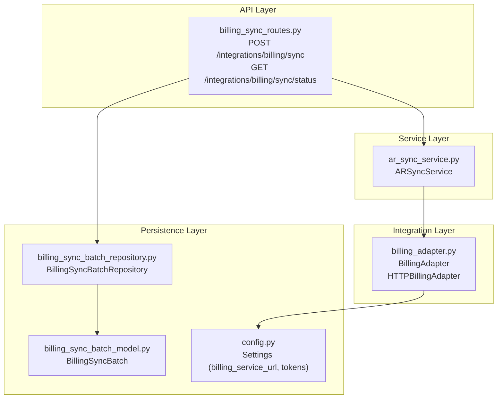
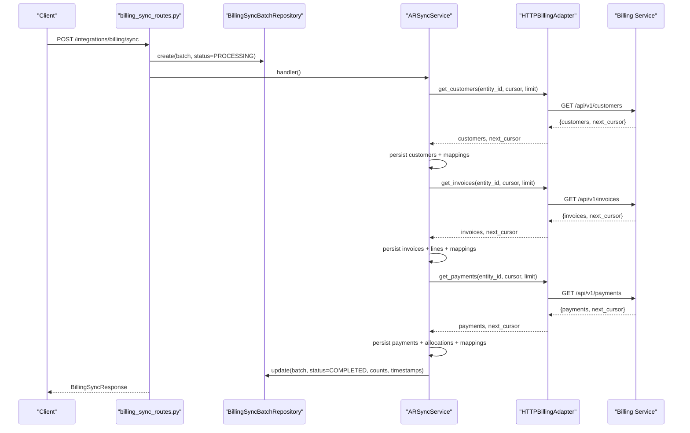
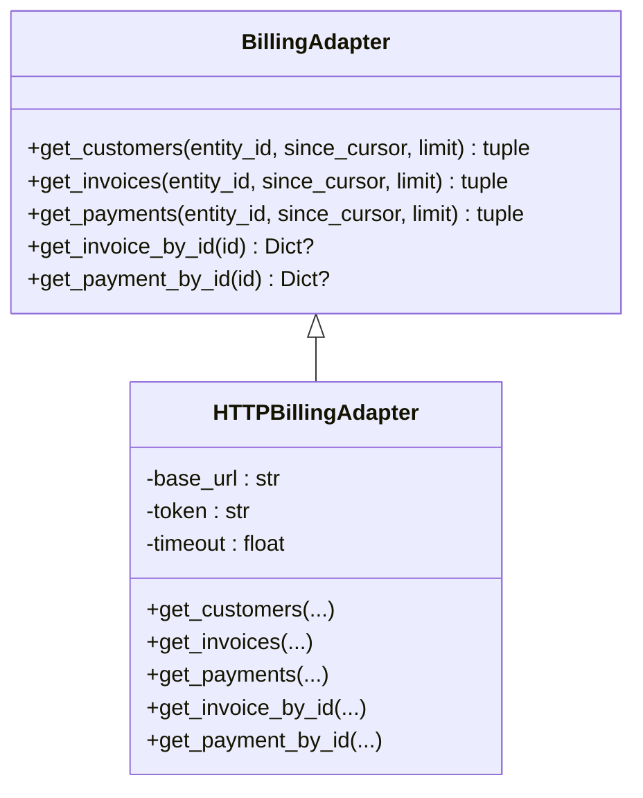
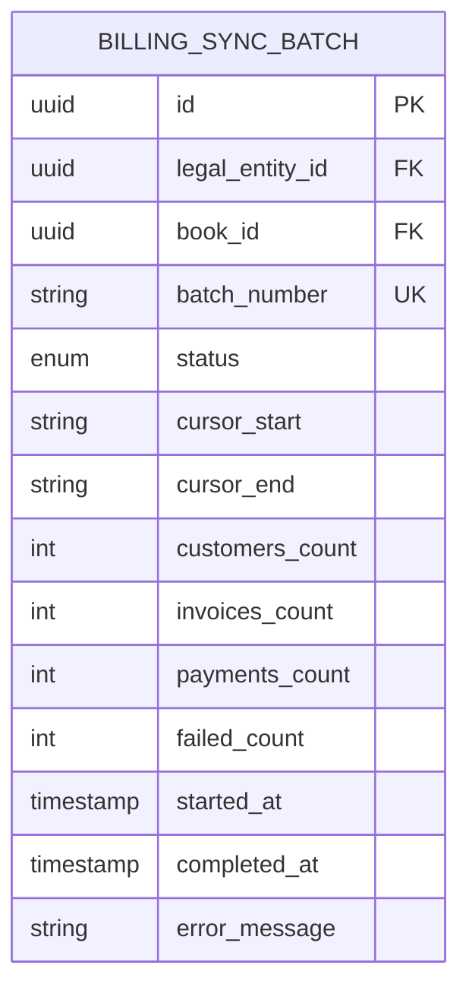
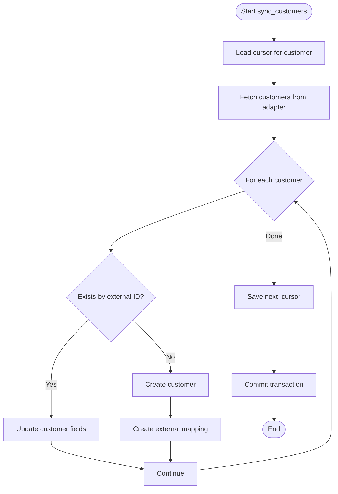
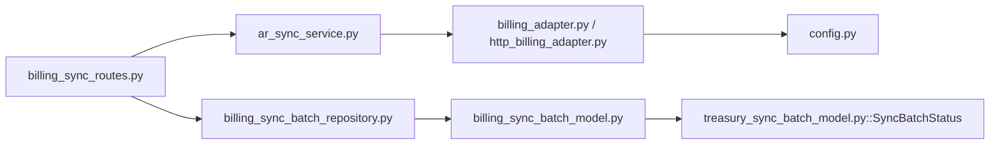

# Billing System Integration

<cite>
**Referenced Files in This Document**
- [billing_adapter.py](file://app/modules/ar/integrations/billing_adapter.py)
- [http_billing_adapter.py](file://app/modules/ar/integrations/http_billing_adapter.py)
- [billing_sync_batch_model.py](file://app/modules/ar/models/billing_sync_batch_model.py)
- [ar_sync_service.py](file://app/modules/ar/services/ar_sync_service.py)
- [billing_sync_routes.py](file://app/modules/ar/api/routes/billing_sync_routes.py)
- [ar_sync_schemas.py](file://app/modules/ar/schemas/ar_sync_schemas.py)
- [config.py](file://app/core/config.py)
- [billing_sync_batch_repository.py](file://app/modules/ar/repositories/billing_sync_batch_repository.py)
- [treasury_sync_batch_model.py](file://app/modules/general_ledger/models/treasury_sync_batch_model.py)
- [003_add_billing_sync_batch.py](file://database/migrations/versions/003_add_billing_sync_batch.py)
</cite>

## Table of Contents
1. [Introduction](#introduction)
2. [Project Structure](#project-structure)
3. [Core Components](#core-components)
4. [Architecture Overview](#architecture-overview)
5. [Detailed Component Analysis](#detailed-component-analysis)
6. [Dependency Analysis](#dependency-analysis)
7. [Performance Considerations](#performance-considerations)
8. [Troubleshooting Guide](#troubleshooting-guide)
9. [Conclusion](#conclusion)
10. [Appendices](#appendices)

## Introduction
This document describes the AR billing system integration capabilities implemented in the project. It covers the billing adapter interfaces, the HTTP billing adapter implementation, and the end-to-end sync batch processing pipeline that performs one-way data synchronization from a Billing service into the AR module. The integration supports incremental sync via cursors, idempotent execution, error handling, and provides APIs for initiating and monitoring sync operations.

## Project Structure
The billing integration spans several layers:
- API routes expose endpoints to trigger and monitor sync operations
- Services orchestrate the sync process and transform data
- Repositories manage persistence for cursors, mappings, and sync batches
- Models define the schema for sync batch tracking
- Adapters abstract the external Billing service interface
- Configuration supplies integration credentials and endpoints

**Diagram sources**
- [billing_sync_routes.py](file://app/modules/ar/api/routes/billing_sync_routes.py#L1-L192)
- [ar_sync_service.py](file://app/modules/ar/services/ar_sync_service.py#L1-L325)
- [billing_adapter.py](file://app/modules/ar/integrations/billing_adapter.py#L1-L191)
- [http_billing_adapter.py](file://app/modules/ar/integrations/http_billing_adapter.py#L1-L130)
- [billing_sync_batch_model.py](file://app/modules/ar/models/billing_sync_batch_model.py#L1-L40)
- [billing_sync_batch_repository.py](file://app/modules/ar/repositories/billing_sync_batch_repository.py#L1-L42)
- [config.py](file://app/core/config.py#L53-L58)

**Section sources**
- [billing_sync_routes.py](file://app/modules/ar/api/routes/billing_sync_routes.py#L1-L192)
- [ar_sync_service.py](file://app/modules/ar/services/ar_sync_service.py#L1-L325)
- [billing_adapter.py](file://app/modules/ar/integrations/billing_adapter.py#L1-L191)
- [http_billing_adapter.py](file://app/modules/ar/integrations/http_billing_adapter.py#L1-L130)
- [billing_sync_batch_model.py](file://app/modules/ar/models/billing_sync_batch_model.py#L1-L40)
- [billing_sync_batch_repository.py](file://app/modules/ar/repositories/billing_sync_batch_repository.py#L1-L42)
- [config.py](file://app/core/config.py#L53-L58)

## Core Components
- BillingAdapter interface defines the contract for retrieving customers, invoices, and payments from the Billing service, along with single-object fetchers.
- HTTPBillingAdapter implements the interface using HTTP requests with configurable base URL and bearer token.
- ARSyncService orchestrates the sync process for each object type, manages cursors, creates/updates records, and persists mappings.
- BillingSyncBatch tracks idempotent sync batches with status, counts, timestamps, and cursor metadata.
- API routes provide endpoints to initiate sync and inspect status, integrating with idempotency and batch repositories.

**Section sources**
- [billing_adapter.py](file://app/modules/ar/integrations/billing_adapter.py#L8-L58)
- [http_billing_adapter.py](file://app/modules/ar/integrations/http_billing_adapter.py#L10-L130)
- [ar_sync_service.py](file://app/modules/ar/services/ar_sync_service.py#L23-L36)
- [billing_sync_batch_model.py](file://app/modules/ar/models/billing_sync_batch_model.py#L10-L36)
- [billing_sync_routes.py](file://app/modules/ar/api/routes/billing_sync_routes.py#L21-L27)

## Architecture Overview
The integration follows a one-way sync pattern from Billing to AR:
- API triggers a sync operation bound to a book and legal entity
- A sync batch is created and marked as processing
- The service fetches cursors for each object type and calls the adapter to retrieve data
- Data is transformed and persisted; mappings are recorded
- Cursors are advanced and batch status is updated upon completion

**Diagram sources**
- [billing_sync_routes.py](file://app/modules/ar/api/routes/billing_sync_routes.py#L51-L123)
- [billing_sync_batch_repository.py](file://app/modules/ar/repositories/billing_sync_batch_repository.py#L18-L34)
- [ar_sync_service.py](file://app/modules/ar/services/ar_sync_service.py#L37-L202)
- [http_billing_adapter.py](file://app/modules/ar/integrations/http_billing_adapter.py#L42-L129)

## Detailed Component Analysis

### Billing Adapter Interfaces
The adapter abstraction defines asynchronous methods to retrieve collections and individual records from the Billing service. The HTTP adapter implements these methods, constructing URLs from configured settings and applying a bearer token when present.

**Diagram sources**
- [billing_adapter.py](file://app/modules/ar/integrations/billing_adapter.py#L8-L58)
- [http_billing_adapter.py](file://app/modules/ar/integrations/http_billing_adapter.py#L10-L130)

**Section sources**
- [billing_adapter.py](file://app/modules/ar/integrations/billing_adapter.py#L8-L58)
- [http_billing_adapter.py](file://app/modules/ar/integrations/http_billing_adapter.py#L10-L130)

### HTTP Billing Adapter Implementation
The HTTP adapter encapsulates:
- Base URL and token resolution from settings
- Request construction with pagination and cursor support
- Error handling returning safe defaults and logging failures
- Single-object retrieval with 404 handling

Key behaviors:
- Uses a shared async client with a timeout
- Applies Authorization header when token is configured
- Returns items and next_cursor for pagination
- Converts errors to logged warnings and empty results to prevent cascade failures

**Section sources**
- [http_billing_adapter.py](file://app/modules/ar/integrations/http_billing_adapter.py#L13-L40)
- [http_billing_adapter.py](file://app/modules/ar/integrations/http_billing_adapter.py#L42-L129)
- [config.py](file://app/core/config.py#L53-L58)

### Sync Batch Processing
The sync batch model and repository coordinate idempotent execution:
- Unique batch numbering per legal entity per day
- Status lifecycle: PENDING → PROCESSING → COMPLETED/FAILED
- Cursor tracking for incremental sync
- Counters for objects synchronized and timestamps for auditing

**Diagram sources**
- [billing_sync_batch_model.py](file://app/modules/ar/models/billing_sync_batch_model.py#L10-L36)
- [003_add_billing_sync_batch.py](file://database/migrations/versions/003_add_billing_sync_batch.py#L33-L56)

**Section sources**
- [billing_sync_batch_model.py](file://app/modules/ar/models/billing_sync_batch_model.py#L10-L36)
- [billing_sync_batch_repository.py](file://app/modules/ar/repositories/billing_sync_batch_repository.py#L18-L34)
- [003_add_billing_sync_batch.py](file://database/migrations/versions/003_add_billing_sync_batch.py#L23-L66)

### AR Sync Service Orchestration
The ARSyncService coordinates the sync of three object types:
- Customers: Upsert by external ID; create mapping
- Invoices: Create customer if missing; upsert invoice; create lines; create mapping
- Payments: Create customer if missing; create payment; create allocations to invoices; create mapping

It uses:
- ExternalSyncCursorRepository to track cursors per object type
- SourceObjectMapRepository to maintain external-to-internal ID mappings
- Decimal and date conversions during transformation
- Exception handling that logs and continues to ensure partial progress

**Diagram sources**
- [ar_sync_service.py](file://app/modules/ar/services/ar_sync_service.py#L37-L110)

**Section sources**
- [ar_sync_service.py](file://app/modules/ar/services/ar_sync_service.py#L23-L36)
- [ar_sync_service.py](file://app/modules/ar/services/ar_sync_service.py#L37-L110)
- [ar_sync_service.py](file://app/modules/ar/services/ar_sync_service.py#L112-L202)
- [ar_sync_service.py](file://app/modules/ar/services/ar_sync_service.py#L232-L308)

### API Endpoints and Idempotency
The API exposes:
- POST /integrations/billing/sync: Initiates a sync batch, validates book/entity association, and applies idempotency
- GET /integrations/billing/sync/status: Returns current cursors for customer, invoice, and payment

Idempotency:
- Generates a batch number before idempotency processing
- Stores batch metadata (batch_id, batch_number, cursor_start) with the idempotency record
- Updates metadata with cursor_end after handler completion

**Section sources**
- [billing_sync_routes.py](file://app/modules/ar/api/routes/billing_sync_routes.py#L29-L167)
- [billing_sync_routes.py](file://app/modules/ar/api/routes/billing_sync_routes.py#L170-L191)

### Data Transformation Rules
Transformation rules observed in the service:
- Customer: external ID mapped to internal; optional fields defaulted if absent
- Invoice: external ID mapped; amounts converted to Decimal; dates parsed; lines created with computed line numbers and deferral flag
- Payment: external ID mapped; allocations created to invoices by external ID; amounts converted to Decimal; dates parsed

Conflict Resolution:
- Upsert by external ID for customers, invoices, and payments
- Missing customer on invoice/payment is handled by skipping or creating minimal customer as needed
- Exceptions during item processing are caught and logged; sync continues to maximize throughput

**Section sources**
- [ar_sync_service.py](file://app/modules/ar/services/ar_sync_service.py#L64-L98)
- [ar_sync_service.py](file://app/modules/ar/services/ar_sync_service.py#L136-L190)
- [ar_sync_service.py](file://app/modules/ar/services/ar_sync_service.py#L256-L296)

### Error Handling and Resilience
- HTTP adapter wraps requests and logs errors, returning empty results to avoid blocking downstream processing
- Service catches exceptions per item and continues to process remaining items
- Batch repository ensures deterministic batch numbering and status transitions
- API updates idempotency metadata with final cursor_end after successful completion

**Section sources**
- [http_billing_adapter.py](file://app/modules/ar/integrations/http_billing_adapter.py#L61-L63)
- [ar_sync_service.py](file://app/modules/ar/services/ar_sync_service.py#L96-L98)
- [ar_sync_service.py](file://app/modules/ar/services/ar_sync_service.py#L189-L191)
- [ar_sync_service.py](file://app/modules/ar/services/ar_sync_service.py#L295-L297)
- [billing_sync_routes.py](file://app/modules/ar/api/routes/billing_sync_routes.py#L144-L161)

## Dependency Analysis
The integration exhibits clear separation of concerns:
- API depends on service and repositories
- Service depends on adapter and repositories
- Adapter depends on configuration
- Batch model and repository share the same status enum as treasury sync

**Diagram sources**
- [billing_sync_routes.py](file://app/modules/ar/api/routes/billing_sync_routes.py#L1-L192)
- [ar_sync_service.py](file://app/modules/ar/services/ar_sync_service.py#L1-L325)
- [billing_adapter.py](file://app/modules/ar/integrations/billing_adapter.py#L1-L191)
- [http_billing_adapter.py](file://app/modules/ar/integrations/http_billing_adapter.py#L1-L130)
- [billing_sync_batch_repository.py](file://app/modules/ar/repositories/billing_sync_batch_repository.py#L1-L42)
- [billing_sync_batch_model.py](file://app/modules/ar/models/billing_sync_batch_model.py#L1-L40)
- [treasury_sync_batch_model.py](file://app/modules/general_ledger/models/treasury_sync_batch_model.py#L9-L14)

**Section sources**
- [billing_sync_routes.py](file://app/modules/ar/api/routes/billing_sync_routes.py#L1-L192)
- [ar_sync_service.py](file://app/modules/ar/services/ar_sync_service.py#L1-L325)
- [billing_sync_batch_model.py](file://app/modules/ar/models/billing_sync_batch_model.py#L1-L40)
- [treasury_sync_batch_model.py](file://app/modules/general_ledger/models/treasury_sync_batch_model.py#L9-L14)

## Performance Considerations
- Pagination and cursor-based incremental sync reduce payload sizes and improve responsiveness
- Async HTTP client minimizes latency when fetching multiple pages
- Per-item exception handling prevents single failures from stalling the entire batch
- Decimal conversion ensures precise financial calculations
- Batch commit after each object type reduces transaction overhead while maintaining consistency

[No sources needed since this section provides general guidance]

## Troubleshooting Guide
Common issues and resolutions:
- Missing billing_service_url or token: The HTTP adapter returns empty results; configure settings and ensure Authorization header is applied
- 404 responses for single-object fetch: Handled gracefully by returning None; verify external IDs
- Cursor drift or gaps: Use GET /integrations/billing/sync/status to inspect current cursors and adjust since_cursor accordingly
- Idempotency replay: The endpoint is protected by idempotency keys; metadata includes batch_id and cursor markers for audit
- Partial failures: Inspect batch counts and error_message; re-run with full_resync or corrected since_cursor

**Section sources**
- [http_billing_adapter.py](file://app/modules/ar/integrations/http_billing_adapter.py#L125-L129)
- [billing_sync_routes.py](file://app/modules/ar/api/routes/billing_sync_routes.py#L170-L191)
- [billing_sync_batch_model.py](file://app/modules/ar/models/billing_sync_batch_model.py#L31-L32)

## Conclusion
The AR billing integration provides a robust, idempotent, and incremental sync pipeline from a Billing service to AR. It leverages adapters for abstraction, repositories for persistence, and clear APIs for initiation and monitoring. The design balances resilience with performance and offers straightforward mechanisms for troubleshooting and recovery.

[No sources needed since this section summarizes without analyzing specific files]

## Appendices

### Integration Patterns and Webhook Processing
- Current implementation is batch-driven with cursor-based incremental sync
- No webhook processing is implemented in the reviewed files; integration relies on scheduled or on-demand API invocations

**Section sources**
- [billing_sync_routes.py](file://app/modules/ar/api/routes/billing_sync_routes.py#L29-L167)

### Sync Scheduling and Retry Mechanisms
- Scheduling: Trigger via POST /integrations/billing/sync with idempotency key
- Retry: Idempotency ensures safe replay; adjust since_cursor or use full_resync to recover from partial failures

**Section sources**
- [billing_sync_routes.py](file://app/modules/ar/api/routes/billing_sync_routes.py#L128-L142)
- [ar_sync_schemas.py](file://app/modules/ar/schemas/ar_sync_schemas.py#L8-L22)

### Real-time vs Batch Synchronization
- Real-time: Not implemented; integration is synchronous via API
- Batch: Implemented; supports incremental and full resync modes

**Section sources**
- [ar_sync_service.py](file://app/modules/ar/services/ar_sync_service.py#L41-L42)
- [ar_sync_service.py](file://app/modules/ar/services/ar_sync_service.py#L116-L117)
- [ar_sync_service.py](file://app/modules/ar/services/ar_sync_service.py#L236-L237)

### Examples of Sync Configurations
- Environment variables: billing_service_url, billing_service_token (or billing_api_key)
- Endpoint invocation: POST /integrations/billing/sync with entity_id, since_cursor, full_resync
- Status inspection: GET /integrations/billing/sync/status with entity_id

**Section sources**
- [config.py](file://app/core/config.py#L53-L58)
- [billing_sync_routes.py](file://app/modules/ar/api/routes/billing_sync_routes.py#L29-L191)
- [ar_sync_schemas.py](file://app/modules/ar/schemas/ar_sync_schemas.py#L8-L22)

### Data Mapping Reference
- Customer: external ID → internal customer; optional fields mapped
- Invoice: external ID → internal invoice; lines created with computed line numbers
- Payment: external ID → internal payment; allocations linked to invoices by external ID

**Section sources**
- [ar_sync_service.py](file://app/modules/ar/services/ar_sync_service.py#L67-L94)
- [ar_sync_service.py](file://app/modules/ar/services/ar_sync_service.py#L149-L187)
- [ar_sync_service.py](file://app/modules/ar/services/ar_sync_service.py#L264-L293)