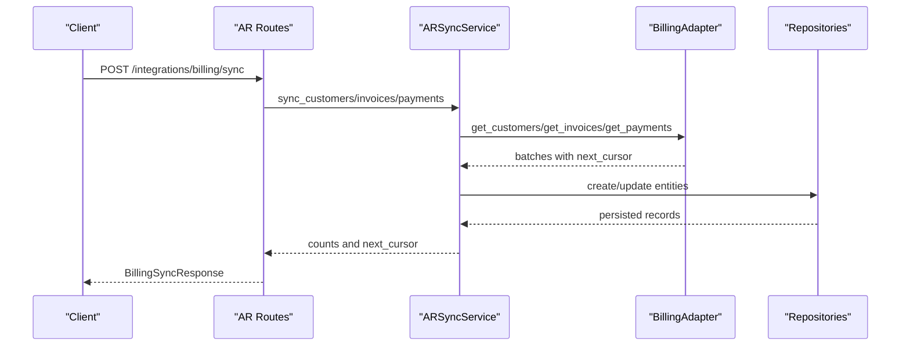
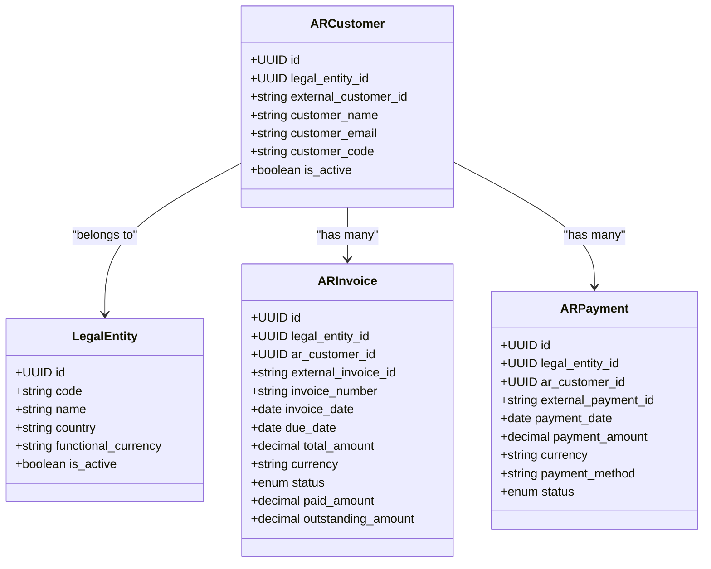
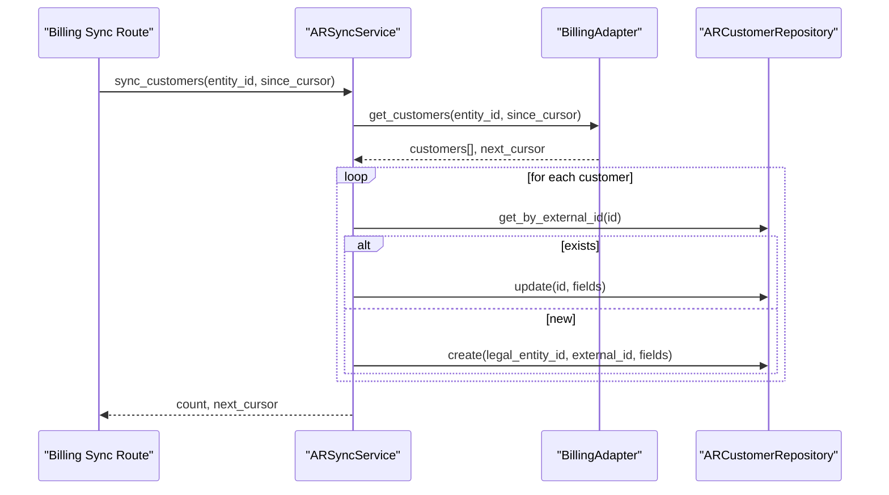
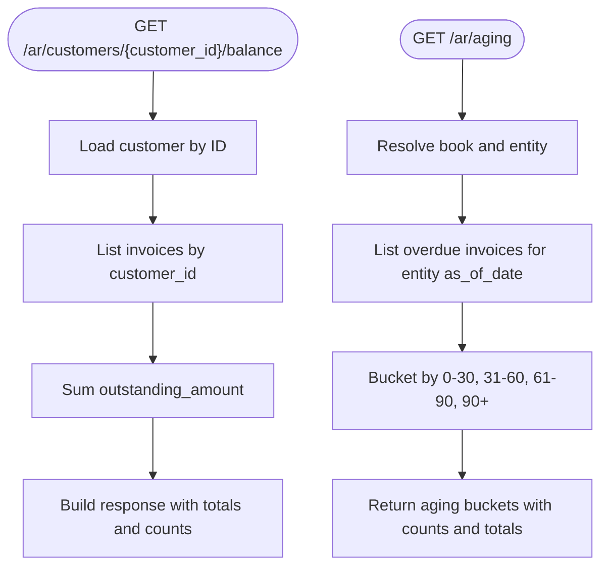
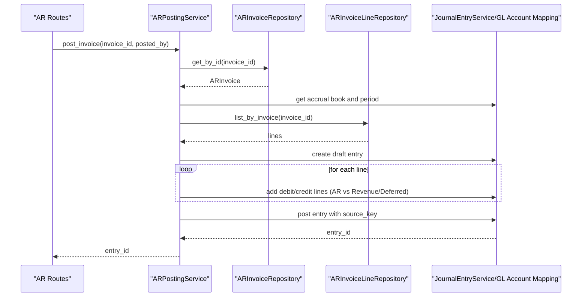
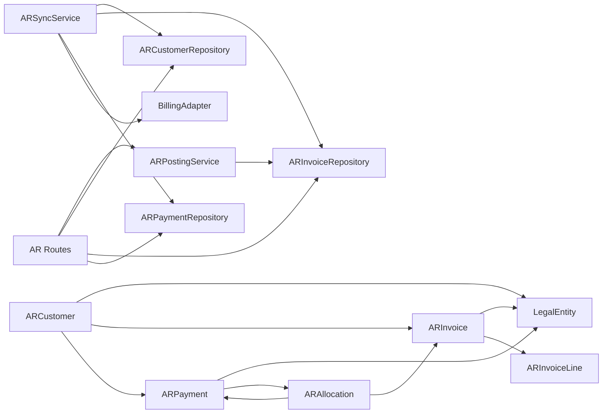

# Customer Management

<cite>
**Referenced Files in This Document**
- [ar_customer_model.py](file://app/modules/ar/models/ar_customer_model.py)
- [ar_customer_repository.py](file://app/modules/ar/repositories/ar_customer_repository.py)
- [ar_invoice_model.py](file://app/modules/ar/models/ar_invoice_model.py)
- [ar_payment_model.py](file://app/modules/ar/models/ar_payment_model.py)
- [ar_invoice_repository.py](file://app/modules/ar/repositories/ar_invoice_repository.py)
- [ar_payment_repository.py](file://app/modules/ar/repositories/ar_payment_repository.py)
- [ar_routes.py](file://app/modules/ar/api/routes/ar_routes.py)
- [billing_sync_routes.py](file://app/modules/ar/api/routes/billing_sync_routes.py)
- [ar_sync_service.py](file://app/modules/ar/services/ar_sync_service.py)
- [ar_posting_service.py](file://app/modules/ar/services/ar_posting_service.py)
- [billing_adapter.py](file://app/modules/ar/integrations/billing_adapter.py)
- [base_model.py](file://app/shared/models/base_model.py)
- [legal_entity_model.py](file://app/modules/general_ledger/models/legal_entity_model.py)
- [ar_sync_schemas.py](file://app/modules/ar/schemas/ar_sync_schemas.py)
</cite>

## Table of Contents
1. [Introduction](#introduction)
2. [Project Structure](#project-structure)
3. [Core Components](#core-components)
4. [Architecture Overview](#architecture-overview)
5. [Detailed Component Analysis](#detailed-component-analysis)
6. [Dependency Analysis](#dependency-analysis)
7. [Performance Considerations](#performance-considerations)
8. [Troubleshooting Guide](#troubleshooting-guide)
9. [Conclusion](#conclusion)
10. [Appendices](#appendices)

## Introduction
This document describes the Accounts Receivable (AR) customer management functionality. It covers the customer model, repository operations, validation rules, and the end-to-end lifecycle of customer data synchronized from a Billing service. It also explains customer balances, aging, invoice posting, and integration with invoice generation. Multi-entity support is addressed via legal entity scoping, and the document outlines how customer data is integrated with invoices and payments.

## Project Structure
The AR customer management spans models, repositories, services, APIs, and integration adapters:
- Models define AR customer, invoice, and payment entities and their relationships.
- Repositories encapsulate persistence operations.
- Services orchestrate synchronization and financial posting.
- APIs expose endpoints for balance calculation, aging, invoice posting, and billing sync.
- Integrations connect to the Billing service via an adapter interface.

```mermaid
graph TB
subgraph "AR Models"
AC["ARCustomer"]
AI["ARInvoice"]
AP["ARPayment"]
AA["ARAllocation"]
end
subgraph "Repositories"
RAC["ARCustomerRepository"]
RAI["ARInvoiceRepository"]
RAP["ARPaymentRepository"]
end
subgraph "Services"
SSync["ARSyncService"]
SPost["ARPostingService"]
end
subgraph "API"
R1["/ar/customers/{customer_id}/balance"]
R2["/ar/aging"]
R3["/ar/invoices/{invoice_id}/post"]
R4["/integrations/billing/sync"]
end
subgraph "Integration"
BA["BillingAdapter<br/>HTTPBillingAdapter"]
end
AC --> RAC
AI --> RAI
AP --> RAP
AC <- --> AI
AC <- --> AP
AA --> AP
AA --> AI
SSync --> RAC
SSync --> RAI
SSync --> RAP
SPost --> RAI
SPost --> RAI
R1 --> RAC
R1 --> RAI
R2 --> RAI
R3 --> SPost
R4 --> SSync
SSync --> BA
```

**Diagram sources**
- [ar_customer_model.py](file://app/modules/ar/models/ar_customer_model.py#L8-L30)
- [ar_invoice_model.py](file://app/modules/ar/models/ar_invoice_model.py#L21-L52)
- [ar_payment_model.py](file://app/modules/ar/models/ar_payment_model.py#L19-L47)
- [ar_customer_repository.py](file://app/modules/ar/repositories/ar_customer_repository.py#L9-L21)
- [ar_invoice_repository.py](file://app/modules/ar/repositories/ar_invoice_repository.py#L11-L59)
- [ar_payment_repository.py](file://app/modules/ar/repositories/ar_payment_repository.py#L9-L21)
- [ar_sync_service.py](file://app/modules/ar/services/ar_sync_service.py#L23-L36)
- [ar_posting_service.py](file://app/modules/ar/services/ar_posting_service.py#L17-L27)
- [ar_routes.py](file://app/modules/ar/api/routes/ar_routes.py#L105-L178)
- [billing_sync_routes.py](file://app/modules/ar/api/routes/billing_sync_routes.py#L29-L192)
- [billing_adapter.py](file://app/modules/ar/integrations/billing_adapter.py#L8-L191)

**Section sources**
- [ar_customer_model.py](file://app/modules/ar/models/ar_customer_model.py#L8-L30)
- [ar_invoice_model.py](file://app/modules/ar/models/ar_invoice_model.py#L21-L52)
- [ar_payment_model.py](file://app/modules/ar/models/ar_payment_model.py#L19-L47)
- [ar_customer_repository.py](file://app/modules/ar/repositories/ar_customer_repository.py#L9-L21)
- [ar_invoice_repository.py](file://app/modules/ar/repositories/ar_invoice_repository.py#L11-L59)
- [ar_payment_repository.py](file://app/modules/ar/repositories/ar_payment_repository.py#L9-L21)
- [ar_routes.py](file://app/modules/ar/api/routes/ar_routes.py#L105-L178)
- [billing_sync_routes.py](file://app/modules/ar/api/routes/billing_sync_routes.py#L29-L192)
- [ar_sync_service.py](file://app/modules/ar/services/ar_sync_service.py#L23-L36)
- [ar_posting_service.py](file://app/modules/ar/services/ar_posting_service.py#L17-L27)
- [billing_adapter.py](file://app/modules/ar/integrations/billing_adapter.py#L8-L191)

## Core Components
- ARCustomer: Represents a customer synchronized from the Billing service, scoped to a legal entity, with external identifiers and active flag.
- ARInvoice: Represents invoices synchronized from Billing, linked to a customer and legal entity, with amounts, status, due date, and currency.
- ARPayment and ARAllocation: Represent payments and their allocations to invoices; payments are linked to customers and legal entities.
- Repositories: Provide CRUD and lookup operations by external identifiers and by customer.
- Services: Synchronize customers, invoices, and payments from Billing; post invoices to the accrual book.
- APIs: Expose customer balance, AR aging, invoice posting, and Billing sync endpoints.

**Section sources**
- [ar_customer_model.py](file://app/modules/ar/models/ar_customer_model.py#L8-L30)
- [ar_invoice_model.py](file://app/modules/ar/models/ar_invoice_model.py#L21-L52)
- [ar_payment_model.py](file://app/modules/ar/models/ar_payment_model.py#L19-L47)
- [ar_customer_repository.py](file://app/modules/ar/repositories/ar_customer_repository.py#L9-L21)
- [ar_invoice_repository.py](file://app/modules/ar/repositories/ar_invoice_repository.py#L11-L59)
- [ar_payment_repository.py](file://app/modules/ar/repositories/ar_payment_repository.py#L9-L21)
- [ar_sync_service.py](file://app/modules/ar/services/ar_sync_service.py#L23-L36)
- [ar_posting_service.py](file://app/modules/ar/services/ar_posting_service.py#L17-L27)
- [ar_routes.py](file://app/modules/ar/api/routes/ar_routes.py#L105-L178)

## Architecture Overview
The AR customer management integrates with a Billing service via an adapter. Data flows from Billing into AR entities, with cursors tracking incremental sync progress. Financial posting converts issued invoices into journal entries in the accrual book. APIs expose customer-centric operations and reporting.



**Diagram sources**
- [billing_sync_routes.py](file://app/modules/ar/api/routes/billing_sync_routes.py#L29-L192)
- [ar_sync_service.py](file://app/modules/ar/services/ar_sync_service.py#L37-L111)
- [billing_adapter.py](file://app/modules/ar/integrations/billing_adapter.py#L61-L152)
- [ar_customer_repository.py](file://app/modules/ar/repositories/ar_customer_repository.py#L9-L21)
- [ar_invoice_repository.py](file://app/modules/ar/repositories/ar_invoice_repository.py#L11-L59)
- [ar_payment_repository.py](file://app/modules/ar/repositories/ar_payment_repository.py#L9-L21)

## Detailed Component Analysis

### Customer Model and Repository
- ARCustomer fields include legal_entity_id, external_customer_id, customer_name, customer_email, customer_code, and is_active. It relates to LegalEntity and has bidirectional relationships with ARInvoice and ARPayment.
- ARCustomerRepository extends the base repository and provides lookup by external_customer_id.



**Diagram sources**
- [ar_customer_model.py](file://app/modules/ar/models/ar_customer_model.py#L8-L30)
- [ar_invoice_model.py](file://app/modules/ar/models/ar_invoice_model.py#L21-L52)
- [ar_payment_model.py](file://app/modules/ar/models/ar_payment_model.py#L19-L47)
- [legal_entity_model.py](file://app/modules/general_ledger/models/legal_entity_model.py#L7-L22)

**Section sources**
- [ar_customer_model.py](file://app/modules/ar/models/ar_customer_model.py#L8-L30)
- [ar_customer_repository.py](file://app/modules/ar/repositories/ar_customer_repository.py#L9-L21)
- [legal_entity_model.py](file://app/modules/general_ledger/models/legal_entity_model.py#L7-L22)

### Customer Data Validation Rules
- External identifiers: external_customer_id and external_invoice_id/external_payment_id must be unique and indexed for efficient lookup.
- Status enums: InvoiceStatus and PaymentStatus constrain allowed states.
- Amounts: total_amount, paid_amount, outstanding_amount are numeric with fixed precision.
- Dates: invoice_date, due_date, payment_date are date-typed; service_start/service_end for deferrable lines.
- Legal entity scoping: All AR objects link to legal_entity_id to enforce multi-entity isolation.
- Active flag: is_active on ARCustomer controls visibility.

**Section sources**
- [ar_customer_model.py](file://app/modules/ar/models/ar_customer_model.py#L12-L17)
- [ar_invoice_model.py](file://app/modules/ar/models/ar_invoice_model.py#L30-L37)
- [ar_payment_model.py](file://app/modules/ar/models/ar_payment_model.py#L25-L33)

### Customer Creation, Updates, and Lookup
- Creation and updates are orchestrated by ARSyncService.sync_customers, which fetches customer data from Billing via BillingAdapter and either creates or updates ARCustomer records. Mappings are recorded for provenance.
- Lookup by external ID is supported by ARCustomerRepository.get_by_external_id.
- Multi-entity support: Syncs are scoped by entity_id (legal_entity_id) to ensure isolation.



**Diagram sources**
- [billing_sync_routes.py](file://app/modules/ar/api/routes/billing_sync_routes.py#L29-L124)
- [ar_sync_service.py](file://app/modules/ar/services/ar_sync_service.py#L37-L111)
- [billing_adapter.py](file://app/modules/ar/integrations/billing_adapter.py#L61-L86)
- [ar_customer_repository.py](file://app/modules/ar/repositories/ar_customer_repository.py#L15-L21)

**Section sources**
- [ar_sync_service.py](file://app/modules/ar/services/ar_sync_service.py#L37-L111)
- [ar_customer_repository.py](file://app/modules/ar/repositories/ar_customer_repository.py#L15-L21)
- [billing_adapter.py](file://app/modules/ar/integrations/billing_adapter.py#L61-L86)

### Customer Balance Calculation and Aging
- Customer balance endpoint aggregates all invoices for a customer and computes total outstanding and invoice count. Currency is derived from the first invoice.
- AR aging endpoint lists overdue invoices for an entity as of a given date and buckets them by age ranges.



**Diagram sources**
- [ar_routes.py](file://app/modules/ar/api/routes/ar_routes.py#L105-L178)
- [ar_invoice_repository.py](file://app/modules/ar/repositories/ar_invoice_repository.py#L41-L59)

**Section sources**
- [ar_routes.py](file://app/modules/ar/api/routes/ar_routes.py#L105-L178)
- [ar_invoice_repository.py](file://app/modules/ar/repositories/ar_invoice_repository.py#L41-L59)

### Invoice Generation and Posting
- ARInvoiceRepository supports listing invoices by customer and filtering by status, ordering by invoice date.
- ARPostingService posts issued invoices to the accrual book, validating book and period availability, mapping GL accounts, and creating journal entries per line (immediate revenue vs. deferred revenue). It posts the entry with a source key derived from external identifiers.



**Diagram sources**
- [ar_routes.py](file://app/modules/ar/api/routes/ar_routes.py#L19-L75)
- [ar_posting_service.py](file://app/modules/ar/services/ar_posting_service.py#L28-L141)
- [ar_invoice_repository.py](file://app/modules/ar/repositories/ar_invoice_repository.py#L17-L22)
- [ar_invoice_model.py](file://app/modules/ar/models/ar_invoice_model.py#L54-L81)

**Section sources**
- [ar_invoice_repository.py](file://app/modules/ar/repositories/ar_invoice_repository.py#L17-L22)
- [ar_posting_service.py](file://app/modules/ar/services/ar_posting_service.py#L28-L141)
- [ar_routes.py](file://app/modules/ar/api/routes/ar_routes.py#L19-L75)

### Payment Terms and Credit Limits
- The current AR models do not include explicit credit limit or payment terms fields on ARCustomer or ARInvoice. Payment terms and credit limits are not modeled in the provided code.
- If needed, these could be added as optional fields on ARCustomer and referenced during invoice creation or sync.

**Section sources**
- [ar_customer_model.py](file://app/modules/ar/models/ar_customer_model.py#L12-L17)
- [ar_invoice_model.py](file://app/modules/ar/models/ar_invoice_model.py#L25-L37)

### Customer Segmentation and Tax Classification
- There are no segmentation or tax classification fields on ARCustomer or related models in the provided code. These capabilities are not implemented here.
- If required, segmentation and tax fields could be introduced on ARCustomer or extended via additional models and mappings.

**Section sources**
- [ar_customer_model.py](file://app/modules/ar/models/ar_customer_model.py#L12-L17)

### Multi-Entity Customer Relationships
- ARCustomer is scoped by legal_entity_id, ensuring separation of customer data across entities.
- Billing sync routes validate that the requested book belongs to the provided entity before proceeding.
- All AR entities (customer, invoice, payment) carry legal_entity_id to maintain isolation.

**Section sources**
- [ar_customer_model.py](file://app/modules/ar/models/ar_customer_model.py#L12-L13)
- [billing_sync_routes.py](file://app/modules/ar/api/routes/billing_sync_routes.py#L39-L47)
- [legal_entity_model.py](file://app/modules/general_ledger/models/legal_entity_model.py#L11-L15)

## Dependency Analysis
- ARCustomer depends on LegalEntity and participates in relationships with ARInvoice and ARPayment.
- ARInvoice depends on ARCustomer and LegalEntity; it also manages lines and allocations.
- ARPayment depends on ARCustomer and LegalEntity; it manages allocations to invoices.
- Repositories depend on SQLAlchemy sessions and operate on typed models.
- Services depend on repositories and adapters; they coordinate sync and posting.
- Routes depend on services and repositories to fulfill requests.



**Diagram sources**
- [ar_customer_model.py](file://app/modules/ar/models/ar_customer_model.py#L19-L22)
- [ar_invoice_model.py](file://app/modules/ar/models/ar_invoice_model.py#L39-L44)
- [ar_payment_model.py](file://app/modules/ar/models/ar_payment_model.py#L35-L40)
- [ar_sync_service.py](file://app/modules/ar/services/ar_sync_service.py#L26-L36)
- [ar_posting_service.py](file://app/modules/ar/services/ar_posting_service.py#L20-L27)
- [ar_routes.py](file://app/modules/ar/api/routes/ar_routes.py#L105-L178)
- [billing_adapter.py](file://app/modules/ar/integrations/billing_adapter.py#L8-L191)

**Section sources**
- [ar_customer_model.py](file://app/modules/ar/models/ar_customer_model.py#L19-L22)
- [ar_invoice_model.py](file://app/modules/ar/models/ar_invoice_model.py#L39-L44)
- [ar_payment_model.py](file://app/modules/ar/models/ar_payment_model.py#L35-L40)
- [ar_sync_service.py](file://app/modules/ar/services/ar_sync_service.py#L26-L36)
- [ar_posting_service.py](file://app/modules/ar/services/ar_posting_service.py#L20-L27)
- [ar_routes.py](file://app/modules/ar/api/routes/ar_routes.py#L105-L178)
- [billing_adapter.py](file://app/modules/ar/integrations/billing_adapter.py#L8-L191)

## Performance Considerations
- Indexes on external identifiers (external_customer_id, external_invoice_id, external_payment_id) and frequently queried fields (ar_customer_id, legal_entity_id, invoice_date, due_date) improve lookup performance.
- Batched sync from Billing reduces load; cursors enable incremental processing.
- Aggregation endpoints (balance, aging) limit result sets to prevent heavy queries.
- Journal entry posting iterates invoice lines; ensure line counts remain reasonable to avoid large posting transactions.

## Troubleshooting Guide
- Customer not found: Ensure external_customer_id matches the Billing-provided ID and that sync was performed for the entity.
- Invoice posting errors: Verify the invoice status is ISSUED, the accrual book exists for the legal entity, and the accounting period contains the invoice date.
- Aging returns empty: Confirm overdue invoices exist for the entity as of the provided date and that due dates are set.
- Sync failures: Check Billing adapter connectivity and credentials; review cursor values and pagination limits.

**Section sources**
- [ar_routes.py](file://app/modules/ar/api/routes/ar_routes.py#L35-L44)
- [ar_posting_service.py](file://app/modules/ar/services/ar_posting_service.py#L34-L58)
- [ar_sync_service.py](file://app/modules/ar/services/ar_sync_service.py#L57-L61)

## Conclusion
The AR customer management system integrates Billing data into AR entities with robust repositories and services. It supports customer balance and aging reporting, invoice posting to the accrual book, and multi-entity scoping via legal_entity_id. While credit limits, payment terms, segmentation, and tax classification are not currently modeled, the architecture allows extension to support these features.

## Appendices

### API Definitions
- GET /ar/customers/{customer_id}/balance
  - Description: Returns customer AR balance, total outstanding, currency, and invoice count.
  - Path parameters: customer_id (UUID)
  - Responses: 200 OK with balance details; 404 Not Found if customer not found.

- GET /ar/aging
  - Description: Returns AR aging buckets for overdue invoices as of a date.
  - Query parameters: book_id (UUID), as_of_date (date)
  - Responses: 200 OK with aging buckets and totals; 404 Not Found if book not found.

- POST /ar/invoices/{invoice_id}/post
  - Description: Posts an issued invoice to the accrual book.
  - Path parameters: invoice_id (UUID)
  - Query parameters: posted_by (UUID)
  - Responses: 200 OK with journal entry ID and status; 400/404 on validation or not found.

- POST /integrations/billing/sync
  - Description: Synchronizes customers, invoices, and payments from Billing.
  - Request body: BillingSyncRequest
  - Responses: 200 OK with BillingSyncResponse; 400/404 on validation or not found.

**Section sources**
- [ar_routes.py](file://app/modules/ar/api/routes/ar_routes.py#L105-L178)
- [billing_sync_routes.py](file://app/modules/ar/api/routes/billing_sync_routes.py#L29-L192)
- [ar_sync_schemas.py](file://app/modules/ar/schemas/ar_sync_schemas.py#L8-L23)