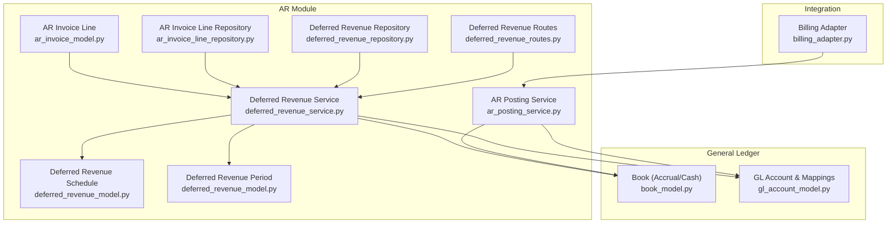
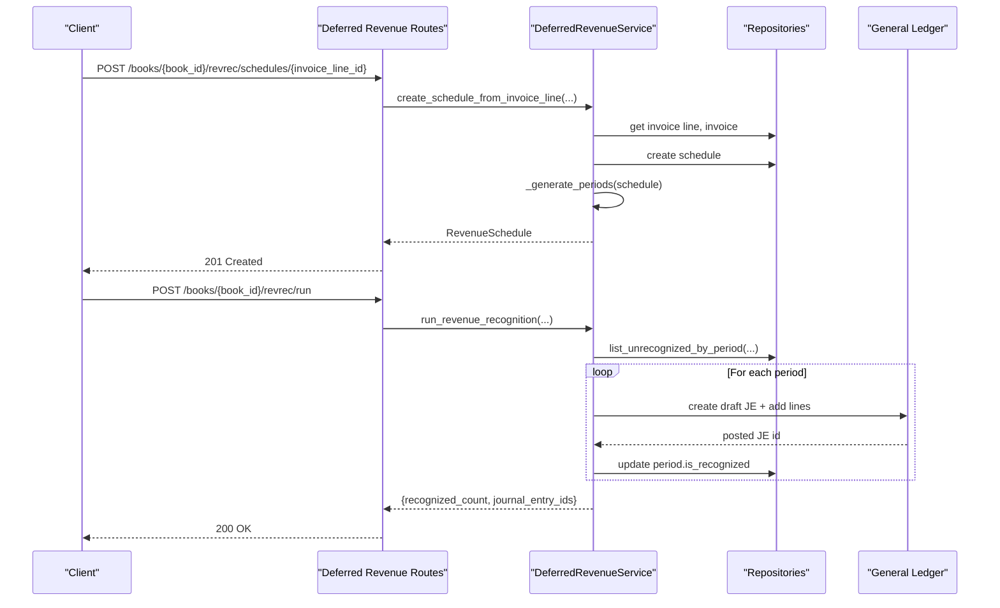
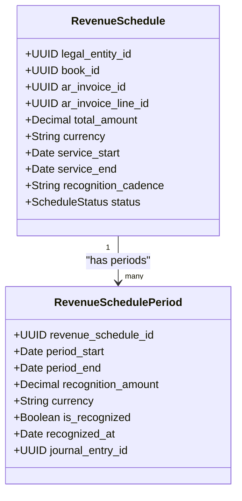
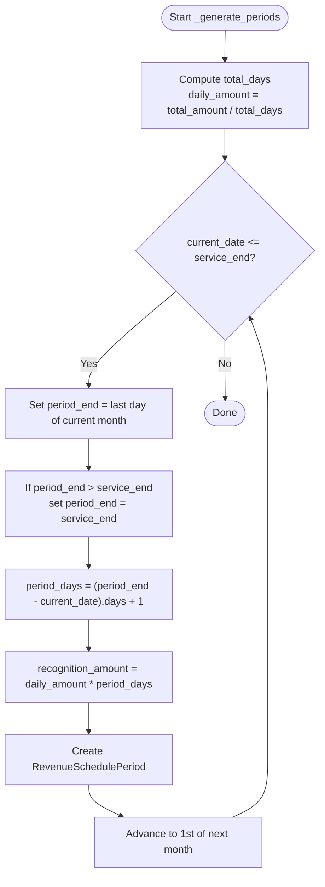
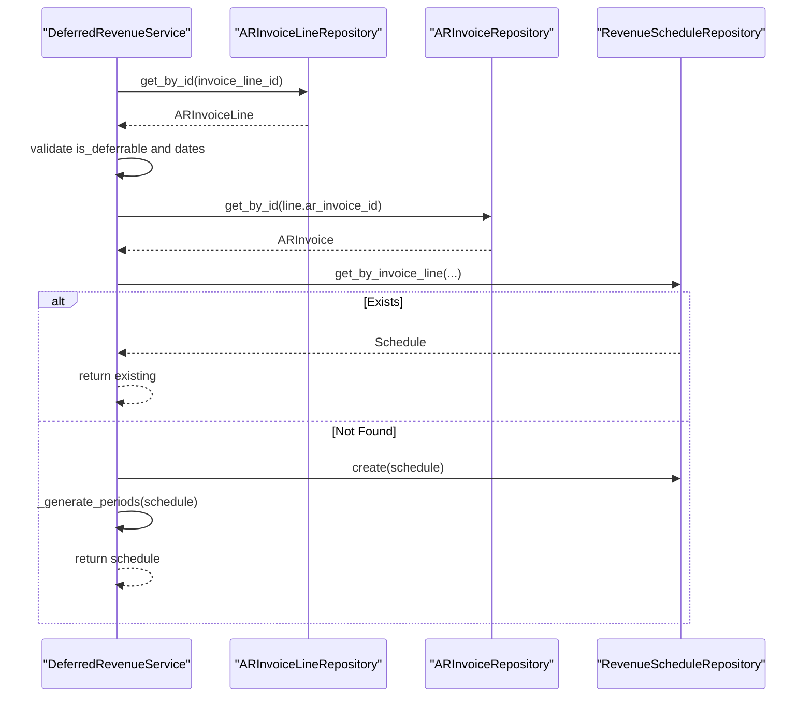
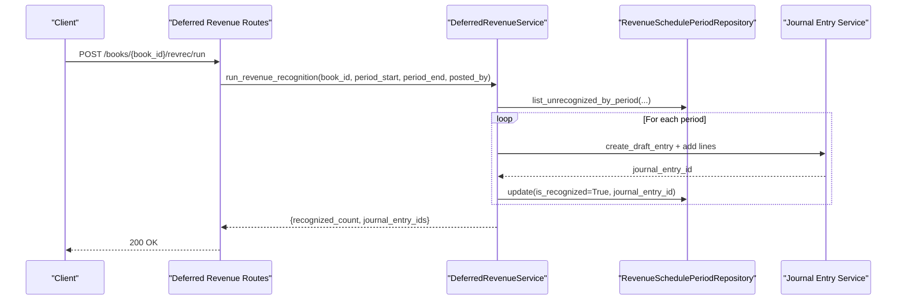
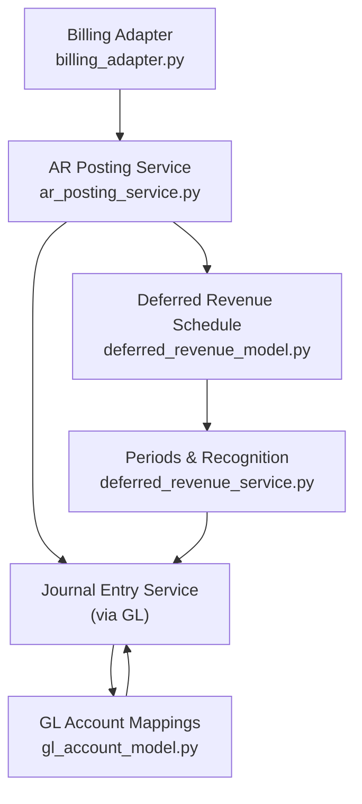
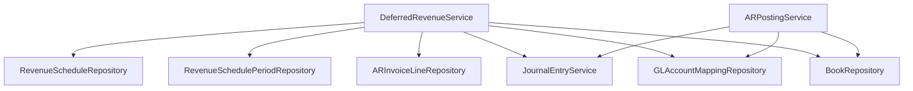

# Deferred Revenue Recognition

<cite>
**Referenced Files in This Document**
- [deferred_revenue_model.py](file://app/modules/ar/models/deferred_revenue_model.py)
- [deferred_revenue_schemas.py](file://app/modules/ar/schemas/deferred_revenue_schemas.py)
- [deferred_revenue_service.py](file://app/modules/ar/services/deferred_revenue_service.py)
- [deferred_revenue_routes.py](file://app/modules/ar/api/routes/deferred_revenue_routes.py)
- [deferred_revenue_repository.py](file://app/modules/ar/repositories/deferred_revenue_repository.py)
- [ar_invoice_model.py](file://app/modules/ar/models/ar_invoice_model.py)
- [ar_invoice_line_repository.py](file://app/modules/ar/repositories/ar_invoice_line_repository.py)
- [ar_posting_service.py](file://app/modules/ar/services/ar_posting_service.py)
- [book_model.py](file://app/modules/general_ledger/models/book_model.py)
- [gl_account_model.py](file://app/modules/general_ledger/models/gl_account_model.py)
- [billing_adapter.py](file://app/modules/ar/integrations/billing_adapter.py)
- [MILESTONE_4_CHECKPOINT.md](file://docs/01-main/MILESTONE_4_CHECKPOINT.md)
</cite>

## Table of Contents
1. [Introduction](#introduction)
2. [Project Structure](#project-structure)
3. [Core Components](#core-components)
4. [Architecture Overview](#architecture-overview)
5. [Detailed Component Analysis](#detailed-component-analysis)
6. [Dependency Analysis](#dependency-analysis)
7. [Performance Considerations](#performance-considerations)
8. [Troubleshooting Guide](#troubleshooting-guide)
9. [Conclusion](#conclusion)
10. [Appendices](#appendices)

## Introduction
This document describes the deferred revenue recognition system implemented in the TrueVow Financial Management platform. It covers the deferred revenue model, recognition schedules, and revenue allocation methods. It explains contract-based revenue recognition, straight-line proration within monthly periods, automated recognition triggers, manual adjustments, and reclassifications. It also documents integration with contract management, subscription billing, and financial reporting, and provides examples of multi-period revenue recognition, proration calculations, and compliance considerations.

## Project Structure
The deferred revenue capability spans AR models, repositories, services, API routes, and integration with the general ledger and billing systems. The key modules are:
- AR models define the deferred revenue schedule and period entities.
- AR repositories provide persistence and queries for schedules and periods.
- AR services orchestrate schedule creation, proration, and recognition runs.
- API routes expose endpoints for schedule creation, listing, and recognition execution.
- General ledger models and services support account mapping and journal entry posting.
- Billing integration supplies invoice and subscription line metadata.

**Diagram sources**
- [ar_invoice_model.py](file://app/modules/ar/models/ar_invoice_model.py#L54-L81)
- [deferred_revenue_model.py](file://app/modules/ar/models/deferred_revenue_model.py#L17-L71)
- [ar_invoice_line_repository.py](file://app/modules/ar/repositories/ar_invoice_line_repository.py#L10-L24)
- [deferred_revenue_repository.py](file://app/modules/ar/repositories/deferred_revenue_repository.py#L15-L80)
- [deferred_revenue_service.py](file://app/modules/ar/services/deferred_revenue_service.py#L25-L241)
- [ar_posting_service.py](file://app/modules/ar/services/ar_posting_service.py#L17-L154)
- [book_model.py](file://app/modules/general_ledger/models/book_model.py#L15-L36)
- [gl_account_model.py](file://app/modules/general_ledger/models/gl_account_model.py#L28-L80)
- [billing_adapter.py](file://app/modules/ar/integrations/billing_adapter.py#L8-L191)
- [deferred_revenue_routes.py](file://app/modules/ar/api/routes/deferred_revenue_routes.py#L1-L75)

**Section sources**
- [MILESTONE_4_CHECKPOINT.md](file://docs/01-main/MILESTONE_4_CHECKPOINT.md#L56-L147)

## Core Components
- Deferred Revenue Schedule: Captures total amount, currency, service period, cadence, and status; links to legal entity, book, invoice, and invoice line.
- Deferred Revenue Period: Defines monthly recognition periods with prorated amounts, recognition flags, and journal entry linkage.
- AR Invoice Line: Carries service_start, service_end, and is_deferrable flags used to derive schedules.
- Deferred Revenue Service: Creates schedules from invoice lines, generates monthly periods with straight-line proration, and posts recognition journal entries.
- API Routes: Expose endpoints to create schedules, list active schedules, and run recognition for a period.
- Repositories: Provide CRUD and query helpers for schedules and periods.
- General Ledger Integration: Uses account mappings to post debits to Deferred Revenue and credits to Revenue accounts.

**Section sources**
- [deferred_revenue_model.py](file://app/modules/ar/models/deferred_revenue_model.py#L17-L71)
- [ar_invoice_model.py](file://app/modules/ar/models/ar_invoice_model.py#L54-L81)
- [deferred_revenue_service.py](file://app/modules/ar/services/deferred_revenue_service.py#L25-L241)
- [deferred_revenue_routes.py](file://app/modules/ar/api/routes/deferred_revenue_routes.py#L1-L75)
- [deferred_revenue_repository.py](file://app/modules/ar/repositories/deferred_revenue_repository.py#L15-L80)
- [gl_account_model.py](file://app/modules/general_ledger/models/gl_account_model.py#L61-L80)

## Architecture Overview
The system follows a layered architecture:
- Presentation: FastAPI routes accept requests and delegate to services.
- Business Logic: DeferredRevenueService orchestrates schedule creation, proration, and recognition.
- Persistence: Repositories encapsulate SQLAlchemy queries for schedules and periods.
- Integration: AR Posting Service posts initial invoices to accrual books; Deferred Revenue Service posts monthly recognition entries.
- Financial Reporting: General Ledger models and services manage books, accounts, and mappings.

**Diagram sources**
- [deferred_revenue_routes.py](file://app/modules/ar/api/routes/deferred_revenue_routes.py#L19-L75)
- [deferred_revenue_service.py](file://app/modules/ar/services/deferred_revenue_service.py#L37-L165)
- [deferred_revenue_repository.py](file://app/modules/ar/repositories/deferred_revenue_repository.py#L50-L80)
- [gl_account_model.py](file://app/modules/general_ledger/models/gl_account_model.py#L28-L80)

## Detailed Component Analysis

### Deferred Revenue Model
The model defines two primary entities:
- RevenueSchedule: Holds legal_entity_id, book_id, ar_invoice_id, ar_invoice_line_id, total_amount, currency, service_start, service_end, recognition_cadence, and status. It relates to LegalEntity, Book, ARInvoice, ARInvoiceLine, and a collection of RevenueSchedulePeriods.
- RevenueSchedulePeriod: Holds revenue_schedule_id, period_start, period_end, recognition_amount, currency, is_recognized, recognized_at, and optional journal_entry_id. It relates to RevenueSchedule and JournalEntry.

**Diagram sources**
- [deferred_revenue_model.py](file://app/modules/ar/models/deferred_revenue_model.py#L17-L71)

**Section sources**
- [deferred_revenue_model.py](file://app/modules/ar/models/deferred_revenue_model.py#L17-L71)

### Recognition Schedules and Proration
- Recognition cadence defaults to monthly. Periods are generated by iterating month-by-month from service_start until service_end.
- Daily amount is computed as total_amount divided by number of days in the service period.
- For each period, days_in_period equals (period_end - current_date).days + 1; recognition_amount equals daily_amount × days_in_period.
- The last period aligns to service_end to avoid gaps or overlaps.

**Diagram sources**
- [deferred_revenue_service.py](file://app/modules/ar/services/deferred_revenue_service.py#L86-L118)

**Section sources**
- [deferred_revenue_service.py](file://app/modules/ar/services/deferred_revenue_service.py#L86-L118)

### Contract-Based Revenue Recognition
- Schedules originate from AR invoice lines marked as deferrable with explicit service_start and service_end.
- The system validates deferrability and required dates before creating a schedule.
- Each schedule links to a specific invoice line, ensuring contract/service period alignment.

**Diagram sources**
- [deferred_revenue_service.py](file://app/modules/ar/services/deferred_revenue_service.py#L37-L84)
- [ar_invoice_model.py](file://app/modules/ar/models/ar_invoice_model.py#L54-L81)

**Section sources**
- [deferred_revenue_service.py](file://app/modules/ar/services/deferred_revenue_service.py#L37-L84)
- [ar_invoice_model.py](file://app/modules/ar/models/ar_invoice_model.py#L54-L81)

### Automated Recognition Triggers and Manual Adjustments
- Automated trigger: run_revenue_recognition lists unrecognized periods within a requested date range, filters by book, posts recognition journal entries, and marks periods as recognized.
- Manual adjustments: The system supports marking periods as recognized and linking to journal entries. Reclassifications can be handled by creating adjusting journal entries against the Deferred Revenue and Revenue accounts, using the same account mappings and period determination logic.

**Diagram sources**
- [deferred_revenue_routes.py](file://app/modules/ar/api/routes/deferred_revenue_routes.py#L50-L75)
- [deferred_revenue_service.py](file://app/modules/ar/services/deferred_revenue_service.py#L119-L165)
- [deferred_revenue_repository.py](file://app/modules/ar/repositories/deferred_revenue_repository.py#L50-L65)

**Section sources**
- [deferred_revenue_routes.py](file://app/modules/ar/api/routes/deferred_revenue_routes.py#L50-L75)
- [deferred_revenue_service.py](file://app/modules/ar/services/deferred_revenue_service.py#L119-L165)
- [deferred_revenue_repository.py](file://app/modules/ar/repositories/deferred_revenue_repository.py#L50-L65)

### Integration with Contract Management, Subscription Billing, and Financial Reporting
- Contract/Subscription Billing: AR invoice lines carry service_start, service_end, and is_deferrable flags. Billing adapters supply invoice and line data; the AR Posting Service posts initial invoices to the Accrual book, debiting AR and crediting either Deferred Revenue (for deferrable lines) or Revenue (for immediate lines).
- Financial Reporting: Recognition entries debit Deferred Revenue and credit Revenue using mapped GL accounts. Books are Accrual or Cash; recognition operates in the Accrual book.

**Diagram sources**
- [billing_adapter.py](file://app/modules/ar/integrations/billing_adapter.py#L8-L191)
- [ar_posting_service.py](file://app/modules/ar/services/ar_posting_service.py#L28-L141)
- [gl_account_model.py](file://app/modules/general_ledger/models/gl_account_model.py#L61-L80)
- [deferred_revenue_model.py](file://app/modules/ar/models/deferred_revenue_model.py#L17-L71)
- [deferred_revenue_service.py](file://app/modules/ar/services/deferred_revenue_service.py#L167-L228)

**Section sources**
- [ar_posting_service.py](file://app/modules/ar/services/ar_posting_service.py#L83-L128)
- [book_model.py](file://app/modules/general_ledger/models/book_model.py#L9-L13)

### Revenue Allocation Methods and Straight-Line vs Accelerated Methods
- Current method: Straight-line proration within monthly periods. The system computes daily_amount and allocates by the number of days in each month-based period.
- Accelerated methods (e.g., activity-based or units-of-production) are not implemented in the current codebase. To adopt accelerated recognition, implement a new proration generator that replaces the monthly straight-line calculation in the schedule generation routine.

**Section sources**
- [deferred_revenue_service.py](file://app/modules/ar/services/deferred_revenue_service.py#L86-L118)

### Examples of Multi-Period Revenue Recognition and Proration Calculations
- Example scenario: A subscription spans 2025-01-15 to 2025-03-15 (total 61 days). Total amount is set on the invoice line.
  - Period 1: 2025-01-15 to 2025-01-31 (17 days): amount = daily_amount × 17.
  - Period 2: 2025-02-01 to 2025-02-28 (28 days): amount = daily_amount × 28.
  - Period 3: 2025-03-01 to 2025-03-15 (15 days): amount = daily_amount × 15.
- The final period caps to service_end to prevent over-recognition.

**Section sources**
- [deferred_revenue_service.py](file://app/modules/ar/services/deferred_revenue_service.py#L86-L118)

### Compliance Considerations
- Idempotency: Recognition entries use idempotency keys derived from schedule and period identifiers. The system posts entries and updates period state atomically per period.
- Period locking: Recognition is constrained to the accounting period containing the period_start date; the system validates period existence before posting.
- Audit trail: Each recognition links back to the original invoice and period; journal entries capture source metadata and reference numbers.

**Section sources**
- [deferred_revenue_service.py](file://app/modules/ar/services/deferred_revenue_service.py#L190-L207)
- [deferred_revenue_routes.py](file://app/modules/ar/api/routes/deferred_revenue_routes.py#L50-L75)

## Dependency Analysis
The DeferredRevenueService depends on repositories for schedules and periods, the AR invoice line repository, and general ledger services for journal entries and account mappings. The AR Posting Service complements this by posting initial invoices to the Accrual book.

**Diagram sources**
- [deferred_revenue_service.py](file://app/modules/ar/services/deferred_revenue_service.py#L25-L36)
- [ar_posting_service.py](file://app/modules/ar/services/ar_posting_service.py#L17-L27)

**Section sources**
- [deferred_revenue_service.py](file://app/modules/ar/services/deferred_revenue_service.py#L25-L36)
- [ar_posting_service.py](file://app/modules/ar/services/ar_posting_service.py#L17-L27)

## Performance Considerations
- Batch processing: The recognition runner iterates unrecognized periods within a date range; batching and pagination parameters in repositories can be tuned for large datasets.
- Idempotency: Using idempotency keys prevents duplicate recognition entries, reducing reprocessing overhead.
- Indexing: The models include indices on frequently queried fields (e.g., invoice_line_id, period_start/end, is_recognized), supporting efficient filtering and updates.

[No sources needed since this section provides general guidance]

## Troubleshooting Guide
Common issues and resolutions:
- Missing accounting period: Recognition requires a valid accounting period for the period_start date; ensure periods are open and mapped to the book.
- Account mapping missing: Deferred Revenue and Revenue accounts must be mapped for the legal entity and book; absence raises a not-found error during recognition.
- Invalid invoice line: Creation fails if the line is not deferrable or lacks service_start/service_end.
- Partial failures in recognition: The runner continues despite individual errors; review logs and retry failed periods.

**Section sources**
- [deferred_revenue_service.py](file://app/modules/ar/services/deferred_revenue_service.py#L190-L196)
- [deferred_revenue_service.py](file://app/modules/ar/services/deferred_revenue_service.py#L230-L240)
- [deferred_revenue_service.py](file://app/modules/ar/services/deferred_revenue_service.py#L48-L53)

## Conclusion
The deferred revenue system implements contract-based, straight-line monthly recognition driven by invoice line metadata. It automates schedule creation and monthly recognition, integrates with billing and general ledger, and maintains compliance through idempotent journal entries and period validation. Extensions for accelerated methods and enhanced manual adjustment workflows can be introduced by extending the schedule generation and recognition posting logic.

[No sources needed since this section summarizes without analyzing specific files]

## Appendices

### API Endpoints Summary
- POST /books/{book_id}/revrec/schedules/{invoice_line_id}: Create a revenue schedule from a deferrable invoice line.
- GET /books/{book_id}/revrec/schedules: List active schedules for a book.
- POST /books/{book_id}/revrec/run: Run revenue recognition for a date range.

**Section sources**
- [deferred_revenue_routes.py](file://app/modules/ar/api/routes/deferred_revenue_routes.py#L19-L75)