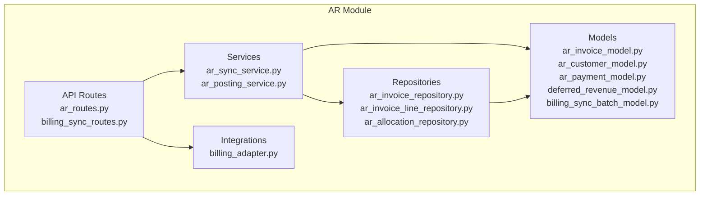
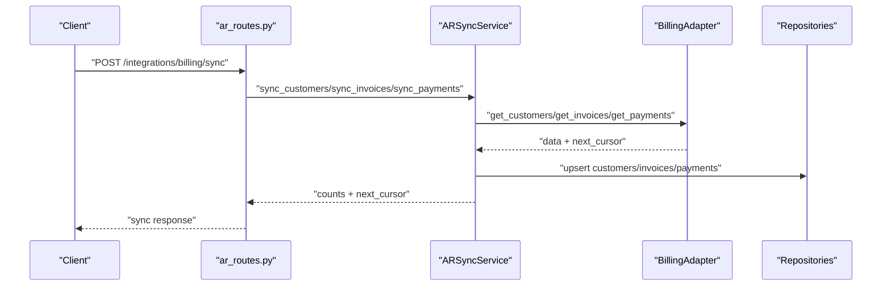
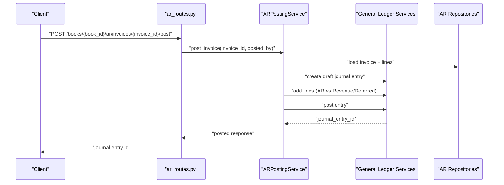
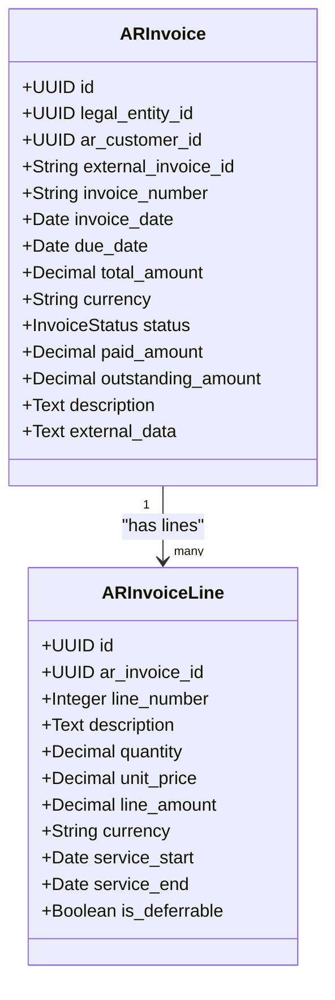
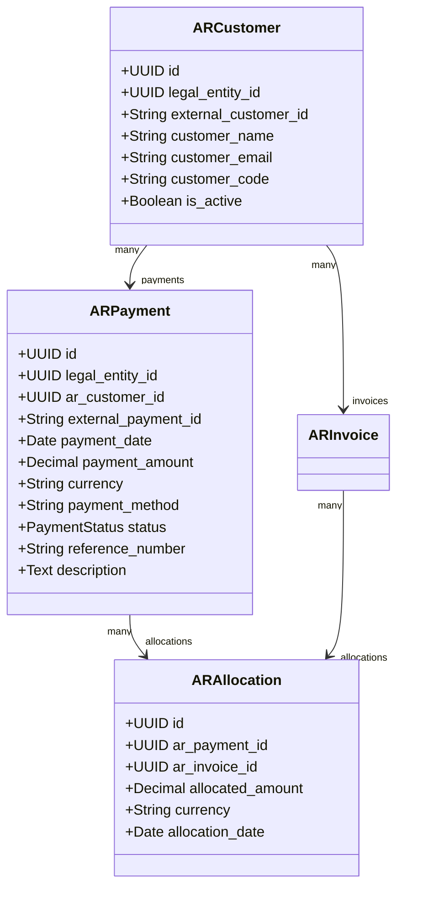
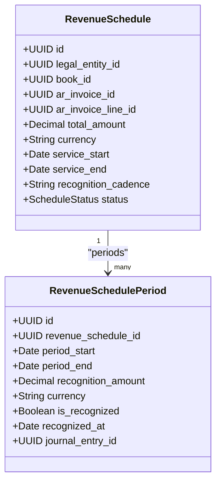
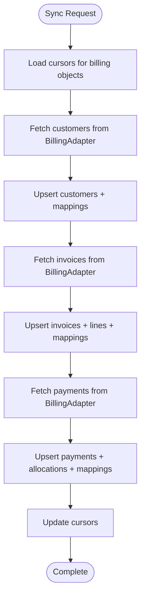
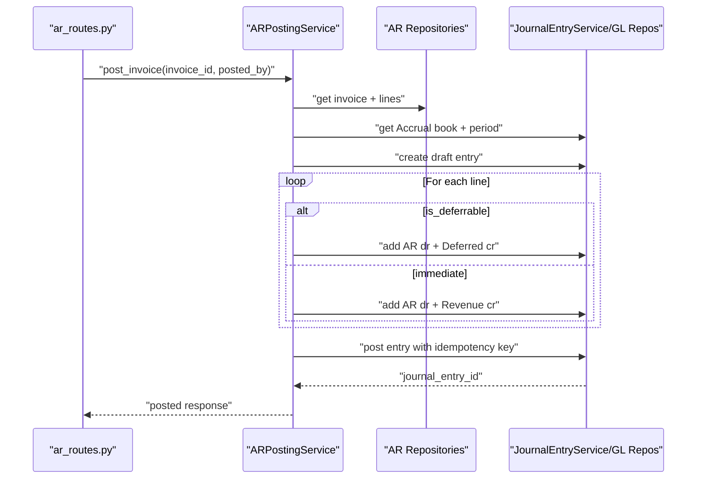
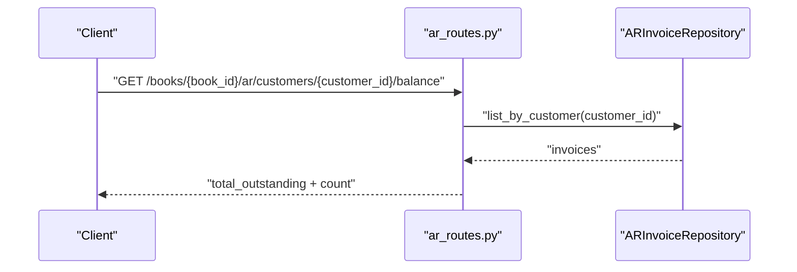
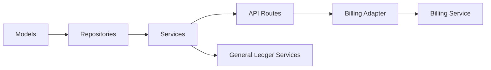

# Invoice Processing

<cite>
**Referenced Files in This Document**
- [ar_invoice_model.py](file://app/modules/ar/models/ar_invoice_model.py)
- [ar_customer_model.py](file://app/modules/ar/models/ar_customer_model.py)
- [ar_payment_model.py](file://app/modules/ar/models/ar_payment_model.py)
- [ar_invoice_repository.py](file://app/modules/ar/repositories/ar_invoice_repository.py)
- [ar_invoice_line_repository.py](file://app/modules/ar/repositories/ar_invoice_line_repository.py)
- [ar_allocation_repository.py](file://app/modules/ar/repositories/ar_allocation_repository.py)
- [ar_routes.py](file://app/modules/ar/api/routes/ar_routes.py)
- [billing_sync_routes.py](file://app/modules/ar/api/routes/billing_sync_routes.py)
- [ar_sync_service.py](file://app/modules/ar/services/ar_sync_service.py)
- [ar_posting_service.py](file://app/modules/ar/services/ar_posting_service.py)
- [billing_adapter.py](file://app/modules/ar/integrations/billing_adapter.py)
- [billing_sync_batch_model.py](file://app/modules/ar/models/billing_sync_batch_model.py)
- [deferred_revenue_model.py](file://app/modules/ar/models/deferred_revenue_model.py)
- [page.tsx](file://frontend/app/(dashboard)/ar/invoices/page.tsx)
</cite>

## Table of Contents
1. [Introduction](#introduction)
2. [Project Structure](#project-structure)
3. [Core Components](#core-components)
4. [Architecture Overview](#architecture-overview)
5. [Detailed Component Analysis](#detailed-component-analysis)
6. [Dependency Analysis](#dependency-analysis)
7. [Performance Considerations](#performance-considerations)
8. [Troubleshooting Guide](#troubleshooting-guide)
9. [Conclusion](#conclusion)
10. [Appendices](#appendices)

## Introduction
This document explains the Accounts Receivable (AR) invoice processing workflows in the TrueVow Financial Management system. It covers the invoice model structure, invoice line items, lifecycle management, creation and updates via billing synchronization, posting to the general ledger, payment allocation, and integration with external billing systems. It also documents bulk operations, batch processing, validation rules, currency handling, and provides examples of typical invoice workflows, approvals, and audit trails.

## Project Structure
The AR module is organized by domain: models define the data structures, repositories encapsulate persistence, services orchestrate business logic, and APIs expose endpoints. Integrations connect to the external Billing service. Deferred revenue models support subscription-based revenue recognition.

**Diagram sources**
- [ar_invoice_model.py](file://app/modules/ar/models/ar_invoice_model.py#L21-L81)
- [ar_customer_model.py](file://app/modules/ar/models/ar_customer_model.py#L8-L30)
- [ar_payment_model.py](file://app/modules/ar/models/ar_payment_model.py#L19-L70)
- [ar_invoice_repository.py](file://app/modules/ar/repositories/ar_invoice_repository.py#L11-L59)
- [ar_invoice_line_repository.py](file://app/modules/ar/repositories/ar_invoice_line_repository.py#L10-L24)
- [ar_allocation_repository.py](file://app/modules/ar/repositories/ar_allocation_repository.py#L10-L31)
- [ar_routes.py](file://app/modules/ar/api/routes/ar_routes.py#L16-L178)
- [billing_sync_routes.py](file://app/modules/ar/api/routes/billing_sync_routes.py#L18-L192)
- [ar_sync_service.py](file://app/modules/ar/services/ar_sync_service.py#L23-L325)
- [ar_posting_service.py](file://app/modules/ar/services/ar_posting_service.py#L17-L154)
- [billing_adapter.py](file://app/modules/ar/integrations/billing_adapter.py#L8-L191)
- [deferred_revenue_model.py](file://app/modules/ar/models/deferred_revenue_model.py#L17-L71)
- [billing_sync_batch_model.py](file://app/modules/ar/models/billing_sync_batch_model.py#L10-L40)

**Section sources**
- [ar_invoice_model.py](file://app/modules/ar/models/ar_invoice_model.py#L1-L81)
- [ar_routes.py](file://app/modules/ar/api/routes/ar_routes.py#L1-L178)
- [billing_sync_routes.py](file://app/modules/ar/api/routes/billing_sync_routes.py#L1-L192)

## Core Components
- ARInvoice: Core invoice record with totals, amounts, due dates, currency, and status. Links to customer and lines.
- ARInvoiceLine: Line items with quantities, unit prices, amounts, and optional service period for deferred revenue.
- ARCustomer: Customer record mapped from Billing with external identifiers and relationships to invoices/payments.
- ARPayment and ARAllocation: Payment record and allocation-to-invoice mapping.
- Deferred Revenue models: Revenue recognition schedules and periods for deferrable lines.
- Repositories: Typed repositories for invoices, lines, allocations, and sync batch tracking.
- Services: ARSyncService for billing sync and ARPostingService for posting to the general ledger.
- API Routes: Endpoints for invoice posting, listing, customer balances, aging, and billing sync.

**Section sources**
- [ar_invoice_model.py](file://app/modules/ar/models/ar_invoice_model.py#L10-L81)
- [ar_customer_model.py](file://app/modules/ar/models/ar_customer_model.py#L8-L30)
- [ar_payment_model.py](file://app/modules/ar/models/ar_payment_model.py#L10-L70)
- [deferred_revenue_model.py](file://app/modules/ar/models/deferred_revenue_model.py#L10-L71)
- [ar_invoice_repository.py](file://app/modules/ar/repositories/ar_invoice_repository.py#L11-L59)
- [ar_invoice_line_repository.py](file://app/modules/ar/repositories/ar_invoice_line_repository.py#L10-L24)
- [ar_allocation_repository.py](file://app/modules/ar/repositories/ar_allocation_repository.py#L10-L31)
- [ar_sync_service.py](file://app/modules/ar/services/ar_sync_service.py#L23-L325)
- [ar_posting_service.py](file://app/modules/ar/services/ar_posting_service.py#L17-L154)
- [ar_routes.py](file://app/modules/ar/api/routes/ar_routes.py#L16-L178)
- [billing_sync_routes.py](file://app/modules/ar/api/routes/billing_sync_routes.py#L18-L192)

## Architecture Overview
The AR invoice lifecycle spans three stages:
1. Data ingestion from Billing via ARSyncService and BillingAdapter.
2. Invoice lifecycle management within the system (status transitions, payments, allocations).
3. Posting to the general ledger via ARPostingService, generating journal entries.

**Diagram sources**
- [billing_sync_routes.py](file://app/modules/ar/api/routes/billing_sync_routes.py#L29-L124)
- [ar_sync_service.py](file://app/modules/ar/services/ar_sync_service.py#L37-L202)
- [billing_adapter.py](file://app/modules/ar/integrations/billing_adapter.py#L8-L191)

**Diagram sources**
- [ar_routes.py](file://app/modules/ar/api/routes/ar_routes.py#L19-L75)
- [ar_posting_service.py](file://app/modules/ar/services/ar_posting_service.py#L28-L141)

## Detailed Component Analysis

### Invoice Model and Lifecycle
- Status lifecycle: Draft, Issued, Paid, Partially Paid, Overdue, Cancelled, Refunded.
- Totals and amounts: total_amount, paid_amount, outstanding_amount computed from line items and allocations.
- Currency: stored per invoice and per line; GL posting uses per-line currency.
- Validation rules:
  - Invoice date and due date are required for posting eligibility.
  - Only invoices with status Issued can be posted.
  - Outstanding must be tracked; overdue determined by due_date and current date.
- Deferred revenue: Lines marked is_deferrable trigger deferred revenue entries; non-deferrable lines recognize immediate revenue.

**Diagram sources**
- [ar_invoice_model.py](file://app/modules/ar/models/ar_invoice_model.py#L21-L81)

**Section sources**
- [ar_invoice_model.py](file://app/modules/ar/models/ar_invoice_model.py#L10-L81)
- [ar_invoice_repository.py](file://app/modules/ar/repositories/ar_invoice_repository.py#L11-L59)

### Customer and Payment Models
- ARCustomer: maps to Billing customer with external id, name, email, code, and activity flag.
- ARPayment: captures payment metadata from Billing, including method, reference, and status.
- ARAllocation: links payments to invoices with allocated amounts and currencies.

**Diagram sources**
- [ar_customer_model.py](file://app/modules/ar/models/ar_customer_model.py#L8-L30)
- [ar_payment_model.py](file://app/modules/ar/models/ar_payment_model.py#L19-L70)
- [ar_allocation_repository.py](file://app/modules/ar/repositories/ar_allocation_repository.py#L10-L31)

**Section sources**
- [ar_customer_model.py](file://app/modules/ar/models/ar_customer_model.py#L8-L30)
- [ar_payment_model.py](file://app/modules/ar/models/ar_payment_model.py#L10-L70)
- [ar_allocation_repository.py](file://app/modules/ar/repositories/ar_allocation_repository.py#L10-L31)

### Deferred Revenue Recognition
- RevenueSchedule: tracks deferrable lines with service periods and recognition cadence.
- RevenueSchedulePeriod: monthly/quarterly periods with recognition flags and link to journal entries.

**Diagram sources**
- [deferred_revenue_model.py](file://app/modules/ar/models/deferred_revenue_model.py#L17-L71)

**Section sources**
- [deferred_revenue_model.py](file://app/modules/ar/models/deferred_revenue_model.py#L10-L71)

### Billing Integration and Sync
- BillingAdapter interface defines methods to fetch customers, invoices, payments, and lookup by id.
- HTTPBillingAdapter implements the interface using configured base URL and token.
- ARSyncService orchestrates sync:
  - Customers: upsert by external id, maintain mappings.
  - Invoices: upsert invoice and lines; create mapping.
  - Payments: upsert payments and allocations to invoices; create mapping.
- BillingSyncBatch tracks batch metadata for idempotent sync runs.

**Diagram sources**
- [ar_sync_service.py](file://app/modules/ar/services/ar_sync_service.py#L37-L325)
- [billing_adapter.py](file://app/modules/ar/integrations/billing_adapter.py#L8-L191)
- [billing_sync_batch_model.py](file://app/modules/ar/models/billing_sync_batch_model.py#L10-L40)

**Section sources**
- [billing_adapter.py](file://app/modules/ar/integrations/billing_adapter.py#L8-L191)
- [ar_sync_service.py](file://app/modules/ar/services/ar_sync_service.py#L37-L325)
- [billing_sync_routes.py](file://app/modules/ar/api/routes/billing_sync_routes.py#L29-L124)
- [billing_sync_batch_model.py](file://app/modules/ar/models/billing_sync_batch_model.py#L10-L40)

### Posting to General Ledger
- ARPostingService posts invoices to the Accrual book:
  - Validates invoice status is Issued.
  - Resolves Accrual book and accounting period by legal entity and invoice date.
  - Creates a draft journal entry with source metadata.
  - Adds lines:
    - For deferrable lines: Debit AR, Credit Deferred Revenue.
    - For non-deferrable lines: Debit AR, Credit Revenue.
  - Posts the entry with idempotency key derived from external invoice id or internal id.

**Diagram sources**
- [ar_posting_service.py](file://app/modules/ar/services/ar_posting_service.py#L28-L141)
- [ar_routes.py](file://app/modules/ar/api/routes/ar_routes.py#L19-L75)

**Section sources**
- [ar_posting_service.py](file://app/modules/ar/services/ar_posting_service.py#L17-L154)
- [ar_routes.py](file://app/modules/ar/api/routes/ar_routes.py#L19-L75)

### API Workflows and Examples
- Invoice listing and filtering by customer and status.
- Customer balance aggregation across invoices.
- Aging report by overdue buckets.
- Posting an invoice to the Accrual book with idempotency.
- Billing sync endpoints for customers, invoices, payments with cursor-based pagination and batch tracking.

**Diagram sources**
- [ar_routes.py](file://app/modules/ar/api/routes/ar_routes.py#L105-L127)

**Section sources**
- [ar_routes.py](file://app/modules/ar/api/routes/ar_routes.py#L77-L178)

## Dependency Analysis
- Models depend on BaseModel and SQLAlchemy ORM.
- Repositories depend on BaseRepository and typed models.
- Services depend on repositories and GL services.
- Routes depend on services and enforce book/entity scoping and idempotency.
- Integrations depend on configuration for external URLs and tokens.

**Diagram sources**
- [ar_invoice_model.py](file://app/modules/ar/models/ar_invoice_model.py#L21-L81)
- [ar_invoice_repository.py](file://app/modules/ar/repositories/ar_invoice_repository.py#L11-L59)
- [ar_sync_service.py](file://app/modules/ar/services/ar_sync_service.py#L23-L35)
- [ar_posting_service.py](file://app/modules/ar/services/ar_posting_service.py#L17-L27)
- [ar_routes.py](file://app/modules/ar/api/routes/ar_routes.py#L16-L16)
- [billing_adapter.py](file://app/modules/ar/integrations/billing_adapter.py#L61-L191)

**Section sources**
- [ar_invoice_model.py](file://app/modules/ar/models/ar_invoice_model.py#L1-L81)
- [ar_invoice_repository.py](file://app/modules/ar/repositories/ar_invoice_repository.py#L1-L59)
- [ar_sync_service.py](file://app/modules/ar/services/ar_sync_service.py#L1-L325)
- [ar_posting_service.py](file://app/modules/ar/services/ar_posting_service.py#L1-L154)
- [ar_routes.py](file://app/modules/ar/api/routes/ar_routes.py#L1-L178)
- [billing_adapter.py](file://app/modules/ar/integrations/billing_adapter.py#L1-L191)

## Performance Considerations
- Cursor-based pagination in billing sync prevents loading entire datasets at once.
- Bulk operations are handled per batch with incremental updates to cursors.
- Idempotency keys prevent duplicate processing and reduce retries.
- Repository queries use indexed fields (external ids, dates, statuses) to optimize lookups.
- Deferred revenue schedules can be batch-processed by period to minimize repeated calculations.

## Troubleshooting Guide
- Posting failures:
  - Ensure invoice status is Issued before posting.
  - Confirm Accrual book exists for the legal entity and date.
  - Verify account mappings for AR, Revenue, and Deferred Revenue.
- Sync errors:
  - Check Billing service URL/token configuration.
  - Inspect BillingSyncBatch status and timestamps for failed runs.
  - Review idempotency metadata for correlation and retry behavior.
- Allocation mismatches:
  - Validate allocation amounts sum to payment amount and invoice outstanding.
  - Confirm currency consistency across allocations and invoices.

**Section sources**
- [ar_posting_service.py](file://app/modules/ar/services/ar_posting_service.py#L34-L58)
- [billing_sync_routes.py](file://app/modules/ar/api/routes/billing_sync_routes.py#L58-L70)
- [billing_sync_batch_model.py](file://app/modules/ar/models/billing_sync_batch_model.py#L10-L40)

## Conclusion
The AR invoice processing system integrates Billing data via a robust sync pipeline, manages invoice lifecycles internally, and posts transactions to the general ledger with proper validations and idempotency. Deferred revenue support enables accurate subscription-based revenue recognition. The modular design separates concerns across models, repositories, services, and APIs, enabling scalable maintenance and extension.

## Appendices

### Invoice Lifecycle Management
- Creation: Invoices are created during billing sync when not present; lines are created alongside.
- Modification: Updates occur on sync for status, amounts, and metadata.
- Cancellation/Refund: Status transitions reflect cancellation or refund states.
- Aging: Overdue invoices are identified by due date and outstanding amount.

**Section sources**
- [ar_sync_service.py](file://app/modules/ar/services/ar_sync_service.py#L112-L202)
- [ar_invoice_repository.py](file://app/modules/ar/repositories/ar_invoice_repository.py#L41-L59)
- [ar_routes.py](file://app/modules/ar/api/routes/ar_routes.py#L130-L178)

### Tax Calculation, Discounts, and Currency Handling
- Tax calculation: Not implemented in the reviewed code; taxes are not modeled in invoices or lines.
- Discount application: Not implemented in the reviewed code; discounts are not modeled.
- Currency handling: Invoices and lines store currency; GL posting supports per-line currency.

**Section sources**
- [ar_invoice_model.py](file://app/modules/ar/models/ar_invoice_model.py#L31-L37)
- [ar_invoice_line_repository.py](file://app/modules/ar/repositories/ar_invoice_line_repository.py#L16-L23)

### Bulk Operations and Batch Processing
- Billing sync processes customers, invoices, and payments in batches with cursors.
- BillingSyncBatch tracks counts, cursors, timestamps, and errors for auditability.

**Section sources**
- [billing_sync_routes.py](file://app/modules/ar/api/routes/billing_sync_routes.py#L51-L124)
- [billing_sync_batch_model.py](file://app/modules/ar/models/billing_sync_batch_model.py#L10-L40)

### Integration with Billing Systems
- HTTPBillingAdapter fetches data from Billing service endpoints using configured credentials.
- MockBillingAdapter supports development/testing without external calls.

**Section sources**
- [billing_adapter.py](file://app/modules/ar/integrations/billing_adapter.py#L61-L191)

### Frontend Access
- AR invoice list page is exposed via a Next.js route that renders the AR invoice list component.

**Section sources**
- [page.tsx](file://frontend/app/(dashboard)/ar/invoices/page.tsx#L1-L10)