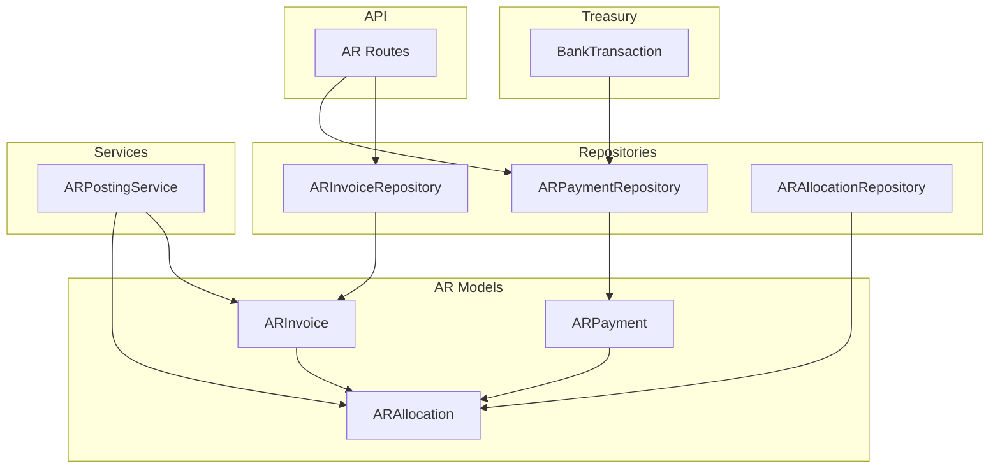
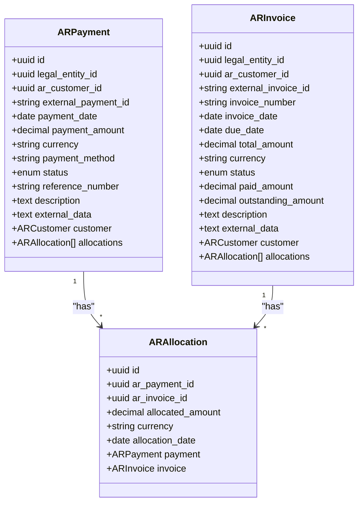
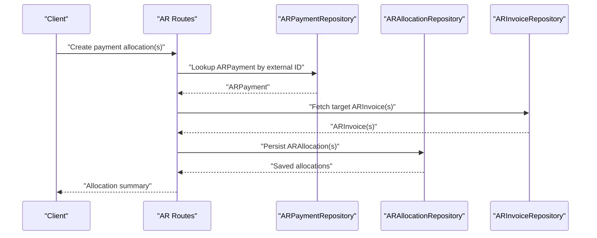
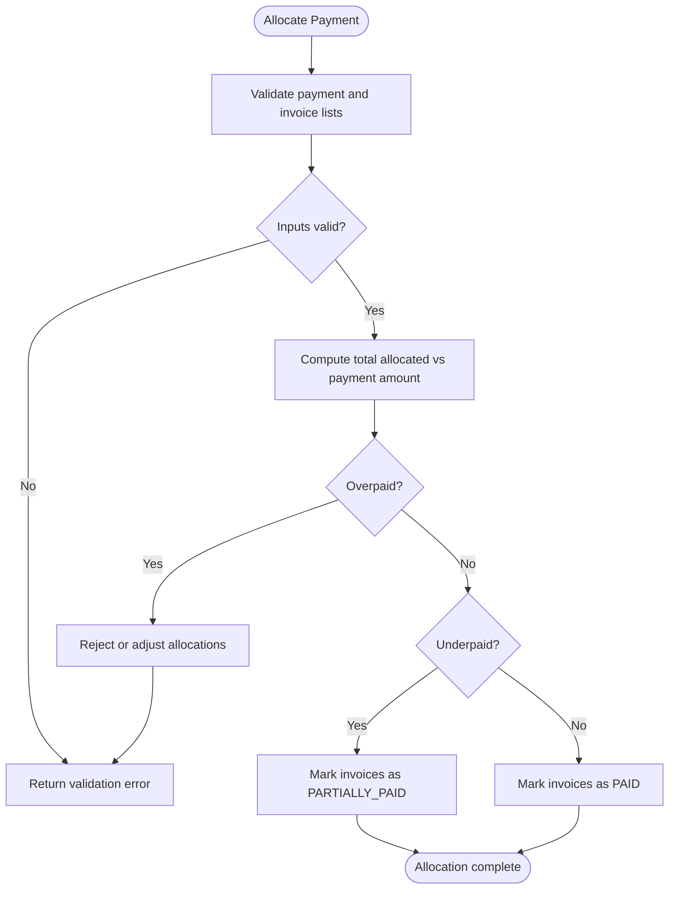
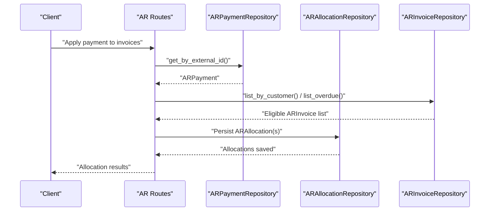
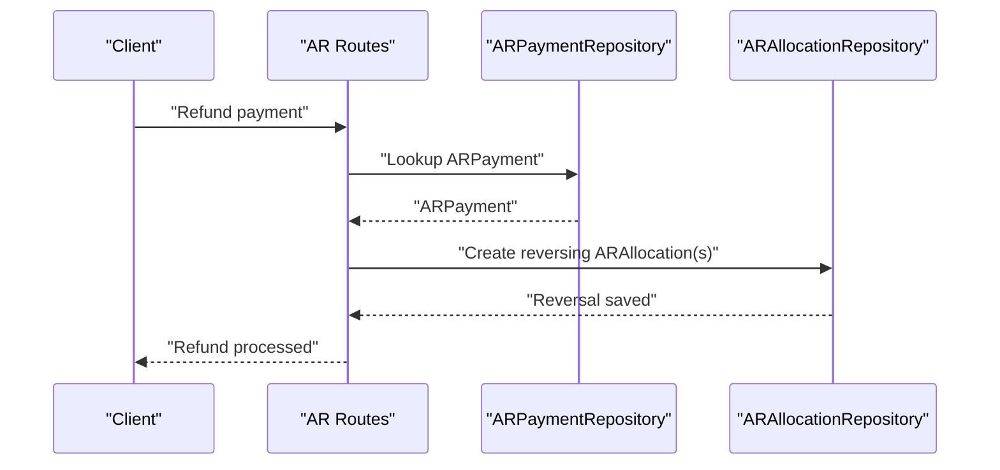
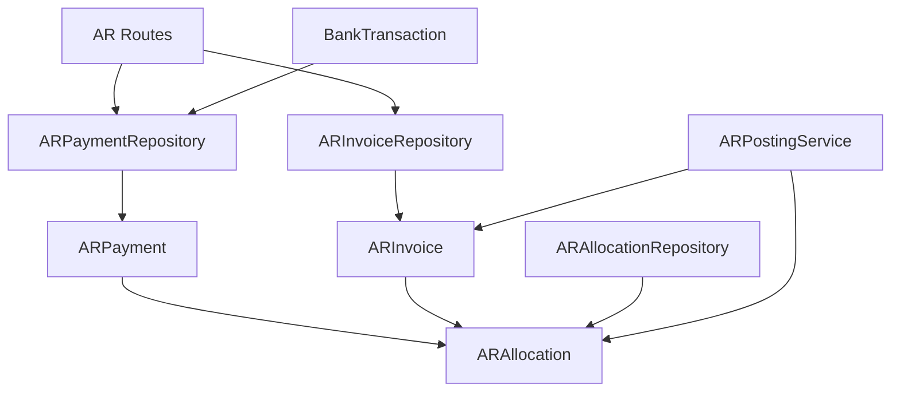

# Payment Allocation

<cite>
**Referenced Files in This Document**
- [ar_payment_model.py](file://app/modules/ar/models/ar_payment_model.py)
- [ar_invoice_model.py](file://app/modules/ar/models/ar_invoice_model.py)
- [ar_payment_repository.py](file://app/modules/ar/repositories/ar_payment_repository.py)
- [ar_allocation_repository.py](file://app/modules/ar/repositories/ar_allocation_repository.py)
- [ar_invoice_repository.py](file://app/modules/ar/repositories/ar_invoice_repository.py)
- [ar_routes.py](file://app/modules/ar/api/routes/ar_routes.py)
- [ar_posting_service.py](file://app/modules/ar/services/ar_posting_service.py)
- [bank_transaction_model.py](file://app/modules/treasury/models/bank_transaction_model.py)
- [fm_schema.sql](file://database/fm_schema.sql)
- [useAR.ts](file://frontend/hooks/useAR.ts)
</cite>

## Table of Contents
1. [Introduction](#introduction)
2. [Project Structure](#project-structure)
3. [Core Components](#core-components)
4. [Architecture Overview](#architecture-overview)
5. [Detailed Component Analysis](#detailed-component-analysis)
6. [Dependency Analysis](#dependency-analysis)
7. [Performance Considerations](#performance-considerations)
8. [Troubleshooting Guide](#troubleshooting-guide)
9. [Conclusion](#conclusion)
10. [Appendices](#appendices)

## Introduction
This document explains the Accounts Receivable (AR) payment allocation functionality in the TrueVow Financial Management system. It covers the payment model structure, payment line items, allocation records, and the allocation algorithms used to apply customer payments to outstanding invoices. It also documents handling of partial payments, overpayments, underpayments, write-offs, bad debt management, payment reversals/refunds, cash application workflows, complex scenarios such as multi-currency and multi-invoice allocations, and integration with bank reconciliation.

## Project Structure
The AR payment allocation feature spans models, repositories, services, API routes, and frontend hooks:
- Models define the persisted entities for payments, invoices, and allocations.
- Repositories encapsulate data access patterns for payments, invoices, and allocations.
- Services orchestrate posting and allocation logic.
- API routes expose endpoints for invoice posting and AR queries.
- Frontend hooks manage optimistic updates and mutations for payments.

**Diagram sources**
- [ar_payment_model.py](file://app/modules/ar/models/ar_payment_model.py#L19-L70)
- [ar_invoice_model.py](file://app/modules/ar/models/ar_invoice_model.py#L21-L81)
- [ar_payment_repository.py](file://app/modules/ar/repositories/ar_payment_repository.py#L9-L21)
- [ar_allocation_repository.py](file://app/modules/ar/repositories/ar_allocation_repository.py#L10-L31)
- [ar_invoice_repository.py](file://app/modules/ar/repositories/ar_invoice_repository.py#L11-L59)
- [ar_posting_service.py](file://app/modules/ar/services/ar_posting_service.py#L17-L154)
- [ar_routes.py](file://app/modules/ar/api/routes/ar_routes.py#L16-L178)
- [bank_transaction_model.py](file://app/modules/treasury/models/bank_transaction_model.py#L21-L52)

**Section sources**
- [ar_payment_model.py](file://app/modules/ar/models/ar_payment_model.py#L1-L70)
- [ar_invoice_model.py](file://app/modules/ar/models/ar_invoice_model.py#L1-L81)
- [ar_payment_repository.py](file://app/modules/ar/repositories/ar_payment_repository.py#L1-L21)
- [ar_allocation_repository.py](file://app/modules/ar/repositories/ar_allocation_repository.py#L1-L31)
- [ar_invoice_repository.py](file://app/modules/ar/repositories/ar_invoice_repository.py#L1-L59)
- [ar_posting_service.py](file://app/modules/ar/services/ar_posting_service.py#L1-L154)
- [ar_routes.py](file://app/modules/ar/api/routes/ar_routes.py#L1-L178)
- [bank_transaction_model.py](file://app/modules/treasury/models/bank_transaction_model.py#L1-L52)
- [fm_schema.sql](file://database/fm_schema.sql#L396-L422)

## Core Components
- ARPayment: Represents a received payment from a customer, including amount, currency, method, and status. It links to ARCustomer and holds ARAllocation records.
- ARInvoice: Represents a customer invoice with totals, status, paid/outstanding amounts, and links to ARAllocation records.
- ARAllocation: Records how a payment was applied to an invoice, including allocated amount, currency, and allocation date.
- ARPaymentRepository: Provides lookup by external payment ID.
- ARAllocationRepository: Lists allocations by payment or invoice.
- ARInvoiceRepository: Lists invoices by customer and filters overdue invoices.
- ARPostingService: Posts invoices to the accrual book and creates journal entries; while not directly allocating payments, it establishes the financial posting context.
- BankTransaction: Represents bank statement transactions that can be matched to cash application and reconciliations.

**Section sources**
- [ar_payment_model.py](file://app/modules/ar/models/ar_payment_model.py#L19-L70)
- [ar_invoice_model.py](file://app/modules/ar/models/ar_invoice_model.py#L21-L81)
- [ar_payment_repository.py](file://app/modules/ar/repositories/ar_payment_repository.py#L9-L21)
- [ar_allocation_repository.py](file://app/modules/ar/repositories/ar_allocation_repository.py#L10-L31)
- [ar_invoice_repository.py](file://app/modules/ar/repositories/ar_invoice_repository.py#L11-L59)
- [ar_posting_service.py](file://app/modules/ar/services/ar_posting_service.py#L17-L154)
- [bank_transaction_model.py](file://app/modules/treasury/models/bank_transaction_model.py#L21-L52)

## Architecture Overview
The AR payment allocation architecture centers on the ARPayment and ARAllocation entities. Payments are recorded externally (e.g., from a billing service) and stored as ARPayment. Allocations are created as ARAllocation records linking payments to invoices. The system supports:
- Multi-invoice allocations per payment
- Currency alignment per allocation
- Outstanding amount tracking on invoices
- Status updates reflecting allocation outcomes

**Diagram sources**
- [ar_payment_model.py](file://app/modules/ar/models/ar_payment_model.py#L19-L70)
- [ar_invoice_model.py](file://app/modules/ar/models/ar_invoice_model.py#L21-L81)

## Detailed Component Analysis

### Payment Model and Allocation Entities
- ARPayment stores the payment metadata and maintains a collection of ARAllocation entries.
- ARInvoice tracks totals, paid/outstanding amounts, and links to allocations.
- ARAllocation captures the allocation amount, currency, and date for each payment-to-invoice pairing.

**Diagram sources**
- [ar_routes.py](file://app/modules/ar/api/routes/ar_routes.py#L16-L178)
- [ar_payment_repository.py](file://app/modules/ar/repositories/ar_payment_repository.py#L15-L21)
- [ar_allocation_repository.py](file://app/modules/ar/repositories/ar_allocation_repository.py#L16-L31)
- [ar_invoice_repository.py](file://app/modules/ar/repositories/ar_invoice_repository.py#L17-L59)

**Section sources**
- [ar_payment_model.py](file://app/modules/ar/models/ar_payment_model.py#L19-L70)
- [ar_invoice_model.py](file://app/modules/ar/models/ar_invoice_model.py#L21-L81)
- [ar_allocation_repository.py](file://app/modules/ar/repositories/ar_allocation_repository.py#L10-L31)

### Allocation Algorithms and Business Rules
- Allocation ordering: The system does not enforce a specific order in the provided code. Typically, allocation ordering follows due-date or invoice-number precedence; however, the current code does not specify ordering logic. This is a design gap that should be addressed to ensure deterministic allocation behavior.
- Amount allocation: Each ARAllocation specifies an allocated amount against a single invoice. The sum of allocated amounts per payment should equal the payment amount to avoid discrepancies.
- Currency handling: ARAllocation includes a currency field, enabling multi-currency allocations. Ensure that exchange rates and rounding align with company policy.
- Partial payments: When the total allocated amount is less than the payment amount, the remaining balance is considered unallocated. The payment’s status can reflect partial application.
- Overpayments: When the total allocated exceeds the payment amount, the system should prevent over-application or handle it via a policy (e.g., reverse allocation or create an overpayment reserve).
- Underpayments: When the total allocated is less than the invoice’s outstanding amount, the invoice remains partially paid.
- Write-offs and bad debt: The provided code does not include explicit write-off or bad debt entities. To support write-offs, introduce a write-off allocation record and a write-off journal entry through the general ledger service.

**Diagram sources**
- [ar_payment_model.py](file://app/modules/ar/models/ar_payment_model.py#L19-L70)
- [ar_invoice_model.py](file://app/modules/ar/models/ar_invoice_model.py#L21-L81)

**Section sources**
- [ar_payment_model.py](file://app/modules/ar/models/ar_payment_model.py#L19-L70)
- [ar_invoice_model.py](file://app/modules/ar/models/ar_invoice_model.py#L21-L81)

### Payment Application to Invoices
- Lookup: Retrieve ARPayment by external ID and fetch target ARInvoice(s) by selection.
- Create allocations: Persist ARAllocation records for each selected invoice with the allocated amount and currency.
- Update invoice status: After allocation, set invoice status to PARTIALLY_PAID or PAID depending on outstanding amount.
- Update payment status: Reflect PENDING, COMPLETED, or PARTIALLY_REFUNDED statuses as applicable.

**Diagram sources**
- [ar_routes.py](file://app/modules/ar/api/routes/ar_routes.py#L77-L102)
- [ar_payment_repository.py](file://app/modules/ar/repositories/ar_payment_repository.py#L15-L21)
- [ar_allocation_repository.py](file://app/modules/ar/repositories/ar_allocation_repository.py#L16-L31)
- [ar_invoice_repository.py](file://app/modules/ar/repositories/ar_invoice_repository.py#L24-L59)

**Section sources**
- [ar_routes.py](file://app/modules/ar/api/routes/ar_routes.py#L77-L102)
- [ar_payment_repository.py](file://app/modules/ar/repositories/ar_payment_repository.py#L15-L21)
- [ar_allocation_repository.py](file://app/modules/ar/repositories/ar_allocation_repository.py#L16-L31)
- [ar_invoice_repository.py](file://app/modules/ar/repositories/ar_invoice_repository.py#L24-L59)

### Payment Reversal and Refund Processing
- Refund status: ARPayment includes REFUNDED and PARTIALLY_REFUNDED statuses. Use these to reflect reversed or partially reversed payments.
- Reverse allocation: To process a refund, create a reversing ARAllocation with negative amounts or mark the original allocation as reversed and create a new allocation for the refund.
- Journal entries: Integrate with the general ledger service to post reversing entries for refunds.

**Diagram sources**
- [ar_routes.py](file://app/modules/ar/api/routes/ar_routes.py#L16-L178)
- [ar_payment_model.py](file://app/modules/ar/models/ar_payment_model.py#L10-L17)
- [ar_allocation_repository.py](file://app/modules/ar/repositories/ar_allocation_repository.py#L16-L31)

**Section sources**
- [ar_payment_model.py](file://app/modules/ar/models/ar_payment_model.py#L10-L17)
- [ar_routes.py](file://app/modules/ar/api/routes/ar_routes.py#L16-L178)

### Cash Application Workflows
- Bank reconciliation: BankTransaction tracks statement lines with is_reconciled flags and reconciliation_id. Match cash receipts to AR payments and mark as reconciled.
- Multi-currency cash application: Align allocation currency with invoice currency and maintain exchange rate metadata at the allocation level.

**Diagram sources**
- [bank_transaction_model.py](file://app/modules/treasury/models/bank_transaction_model.py#L21-L52)
- [ar_payment_model.py](file://app/modules/ar/models/ar_payment_model.py#L19-L70)
- [ar_allocation_repository.py](file://app/modules/ar/repositories/ar_allocation_repository.py#L16-L31)
- [ar_invoice_model.py](file://app/modules/ar/models/ar_invoice_model.py#L21-L81)

**Section sources**
- [bank_transaction_model.py](file://app/modules/treasury/models/bank_transaction_model.py#L21-L52)
- [ar_payment_model.py](file://app/modules/ar/models/ar_payment_model.py#L19-L70)
- [ar_allocation_repository.py](file://app/modules/ar/repositories/ar_allocation_repository.py#L16-L31)
- [ar_invoice_model.py](file://app/modules/ar/models/ar_invoice_model.py#L21-L81)

### Examples of Complex Scenarios
- Multi-invoice allocation: Allocate a single payment across multiple invoices, ensuring the sum equals the payment amount.
- Multi-currency allocation: Apply allocations with different currencies per invoice, maintaining proper exchange rate handling.
- Partial payment: Apply only part of the payment to one or more invoices; leave remaining balance unallocated until further application.
- Overpayment handling: Prevent over-application or adjust allocations to reflect overpayment; consider creating an overpayment reserve.
- Bad debt/write-off: Introduce a write-off allocation and a journal entry to derecognize the receivable and recognize expense.

[No sources needed since this section provides conceptual examples]

## Dependency Analysis
The AR payment allocation feature exhibits clear separation of concerns:
- Models define persistence and relationships.
- Repositories encapsulate CRUD and lookup operations.
- Services coordinate business logic (posting, allocation).
- API routes orchestrate requests and responses.
- Treasury models integrate cash application and reconciliation.

**Diagram sources**
- [ar_payment_model.py](file://app/modules/ar/models/ar_payment_model.py#L19-L70)
- [ar_invoice_model.py](file://app/modules/ar/models/ar_invoice_model.py#L21-L81)
- [ar_allocation_repository.py](file://app/modules/ar/repositories/ar_allocation_repository.py#L10-L31)
- [ar_payment_repository.py](file://app/modules/ar/repositories/ar_payment_repository.py#L9-L21)
- [ar_invoice_repository.py](file://app/modules/ar/repositories/ar_invoice_repository.py#L11-L59)
- [ar_posting_service.py](file://app/modules/ar/services/ar_posting_service.py#L17-L154)
- [ar_routes.py](file://app/modules/ar/api/routes/ar_routes.py#L16-L178)
- [bank_transaction_model.py](file://app/modules/treasury/models/bank_transaction_model.py#L21-L52)

**Section sources**
- [ar_payment_model.py](file://app/modules/ar/models/ar_payment_model.py#L19-L70)
- [ar_invoice_model.py](file://app/modules/ar/models/ar_invoice_model.py#L21-L81)
- [ar_allocation_repository.py](file://app/modules/ar/repositories/ar_allocation_repository.py#L10-L31)
- [ar_payment_repository.py](file://app/modules/ar/repositories/ar_payment_repository.py#L9-L21)
- [ar_invoice_repository.py](file://app/modules/ar/repositories/ar_invoice_repository.py#L11-L59)
- [ar_posting_service.py](file://app/modules/ar/services/ar_posting_service.py#L17-L154)
- [ar_routes.py](file://app/modules/ar/api/routes/ar_routes.py#L16-L178)
- [bank_transaction_model.py](file://app/modules/treasury/models/bank_transaction_model.py#L21-L52)

## Performance Considerations
- Indexing: Ensure indexes exist on payment_date, status, and foreign keys for efficient lookups and allocation queries.
- Batch allocation: Prefer bulk insertions for ARAllocation to minimize round-trips.
- Currency normalization: Store amounts in base currency and maintain exchange rates for accurate reporting.
- Idempotency: Apply idempotency keys for allocation operations to prevent duplicate applications.

[No sources needed since this section provides general guidance]

## Troubleshooting Guide
- Payment not found: Verify external_payment_id and ensure ARPayment exists before allocation.
- Invoice not eligible: Confirm invoice status and outstanding amount; only eligible invoices should be selectable.
- Allocation mismatch: Validate that total allocated equals payment amount; otherwise, reject the operation.
- Currency mismatch: Ensure allocation currency matches invoice currency or apply appropriate exchange rate logic.
- Duplicate allocation: Check unique constraint on (ar_payment_id, ar_invoice_id) to prevent double-application.
- Reconciliation issues: Confirm BankTransaction is_reconciled flag and reconciliation_id are updated after cash application.

**Section sources**
- [ar_routes.py](file://app/modules/ar/api/routes/ar_routes.py#L77-L102)
- [ar_payment_repository.py](file://app/modules/ar/repositories/ar_payment_repository.py#L15-L21)
- [ar_allocation_repository.py](file://app/modules/ar/repositories/ar_allocation_repository.py#L24-L31)
- [fm_schema.sql](file://database/fm_schema.sql#L410-L422)

## Conclusion
The AR payment allocation feature is built around ARPayment, ARInvoice, and ARAllocation entities with supporting repositories and services. While the core allocation mechanics are present, additional enhancements are recommended to support robust allocation ordering, overpayment handling, write-offs, and seamless integration with cash application and bank reconciliation. The frontend hooks demonstrate optimistic updates for payments, complementing backend allocation workflows.

[No sources needed since this section summarizes without analyzing specific files]

## Appendices

### Database Schema References
- AR Payment table and indexes
- AR Allocation table and indexes

**Section sources**
- [fm_schema.sql](file://database/fm_schema.sql#L396-L422)

### Frontend Hooks for Payments
- Optimistic updates for AR payments and invoices
- Mutation hooks for creating payments and posting invoices

**Section sources**
- [useAR.ts](file://frontend/hooks/useAR.ts#L249-L285)
- [useAR.ts](file://frontend/hooks/useAR.ts#L186-L226)