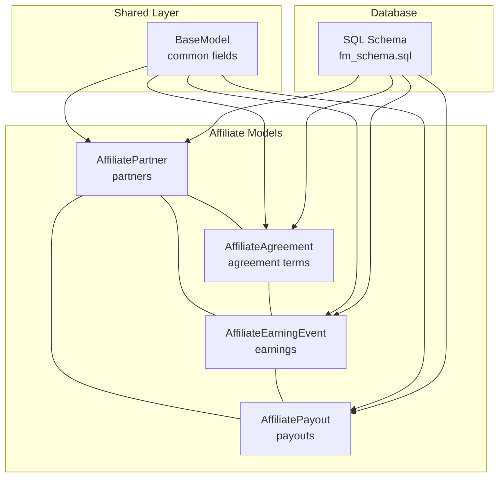
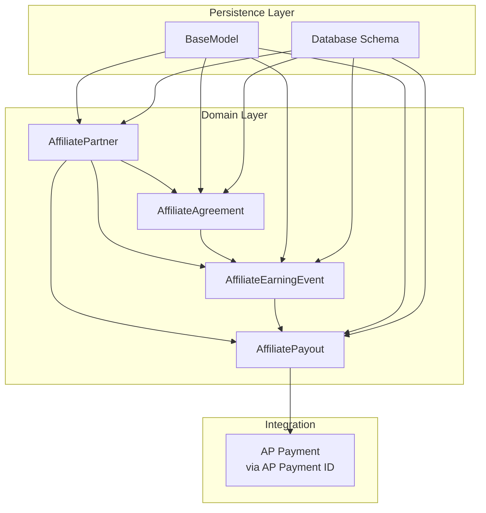
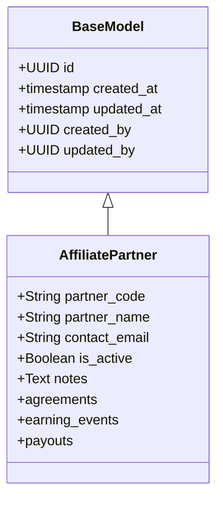
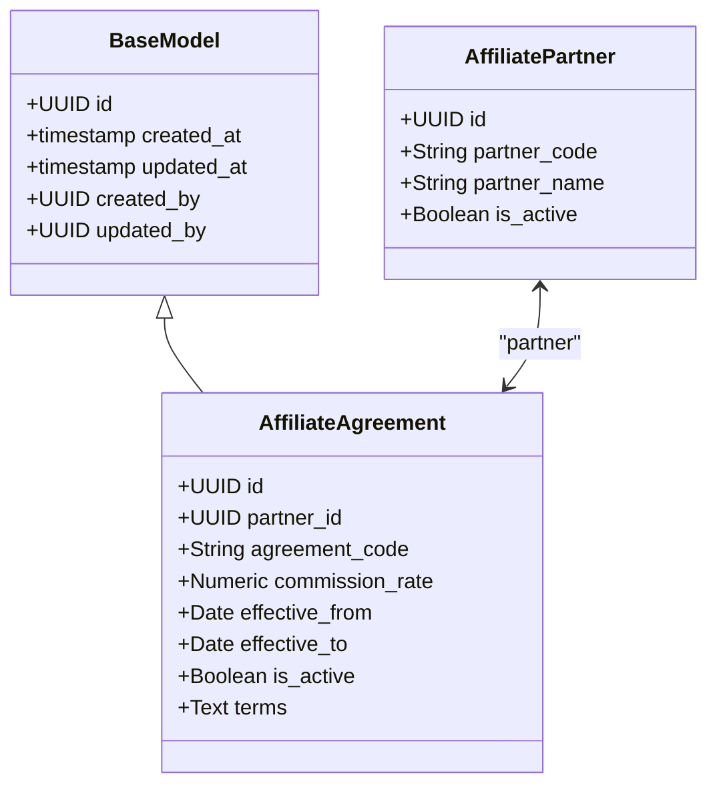
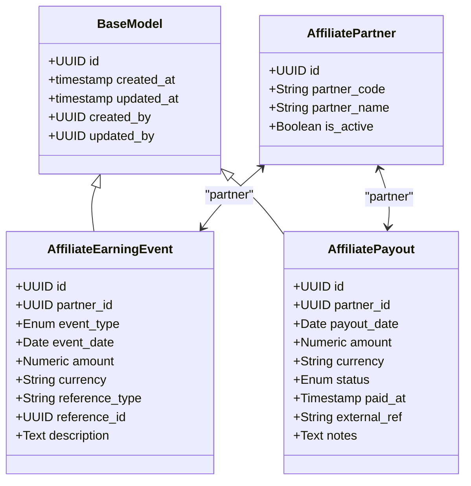
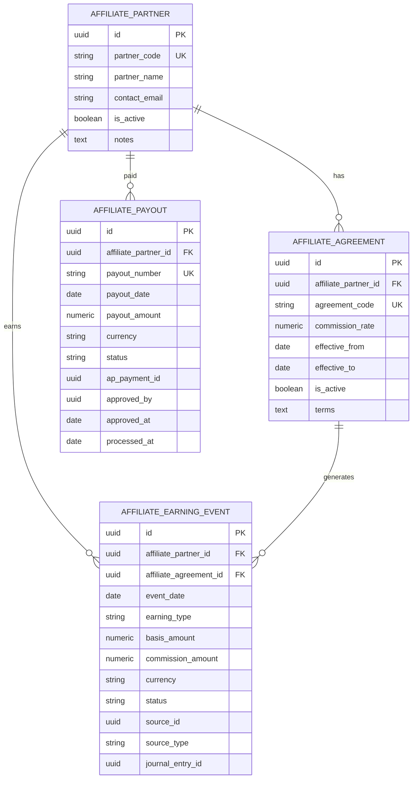
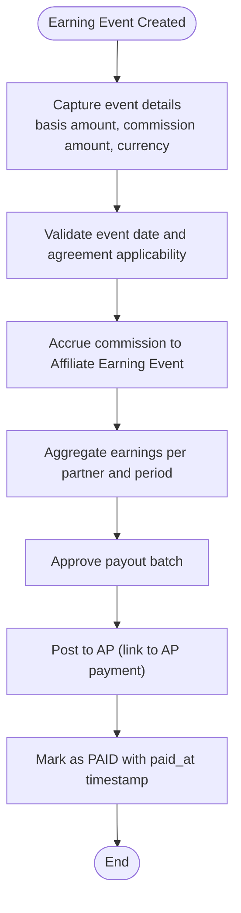
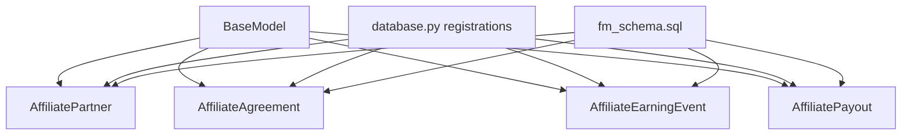

# Affiliate Management Module

<cite>
**Referenced Files in This Document**
- [affiliate_partner_model.py](file://app/modules/affiliates/models/affiliate_partner_model.py)
- [affiliate_agreement_model.py](file://app/modules/affiliates/models/affiliate_agreement_model.py)
- [affiliate_earning_model.py](file://app/modules/affiliates/models/affiliate_earning_model.py)
- [base_model.py](file://app/shared/models/base_model.py)
- [database.py](file://app/core/database.py)
- [fm_schema.sql](file://database/fm_schema.sql)
- [ap_vendor_model.py](file://app/modules/ap/models/ap_vendor_model.py)
</cite>

## Table of Contents
1. [Introduction](#introduction)
2. [Project Structure](#project-structure)
3. [Core Components](#core-components)
4. [Architecture Overview](#architecture-overview)
5. [Detailed Component Analysis](#detailed-component-analysis)
6. [Dependency Analysis](#dependency-analysis)
7. [Performance Considerations](#performance-considerations)
8. [Troubleshooting Guide](#troubleshooting-guide)
9. [Conclusion](#conclusion)
10. [Appendices](#appendices)

## Introduction
This document describes the Affiliate Management module within the TrueVow Financial Management system. It focuses on partnership agreement management, earnings tracking, and commission/payout processing. The module defines three primary models: AffiliatePartner, AffiliateAgreement, and AffiliateEarningEvent/AffiliatePayout. These models capture partner onboarding, agreement terms, earning events, and payout records. The module integrates with the broader financial system through shared base models and database schema definitions, and connects to Accounts Payable for payout execution.

## Project Structure
The Affiliate Management module is organized around SQLAlchemy models located under app/modules/affiliates/models. The models inherit from a shared base class and are registered with the global database engine. The database schema is defined in the centralized SQL file, ensuring consistent table structures across environments.

**Diagram sources**
- [affiliate_partner_model.py](file://app/modules/affiliates/models/affiliate_partner_model.py#L7-L24)
- [affiliate_agreement_model.py](file://app/modules/affiliates/models/affiliate_agreement_model.py#L9-L26)
- [affiliate_earning_model.py](file://app/modules/affiliates/models/affiliate_earning_model.py#L25-L64)
- [base_model.py](file://app/shared/models/base_model.py#L9-L18)
- [fm_schema.sql](file://database/fm_schema.sql#L1219-L1320)

**Section sources**
- [affiliate_partner_model.py](file://app/modules/affiliates/models/affiliate_partner_model.py#L1-L25)
- [affiliate_agreement_model.py](file://app/modules/affiliates/models/affiliate_agreement_model.py#L1-L27)
- [affiliate_earning_model.py](file://app/modules/affiliates/models/affiliate_earning_model.py#L1-L65)
- [base_model.py](file://app/shared/models/base_model.py#L1-L18)
- [database.py](file://app/core/database.py#L72-L77)
- [fm_schema.sql](file://database/fm_schema.sql#L1219-L1320)

## Core Components
This section documents the three core models that form the Affiliate Management domain.

- AffiliatePartner
  - Purpose: Represents an external partner in the affiliate program.
  - Key attributes: partner_code, partner_name, contact_email, is_active, notes.
  - Relationships: One-to-many with AffiliateAgreement, AffiliateEarningEvent, and AffiliatePayout.
  - Business rules: partner_code is unique and indexed; is_active defaults to true.

- AffiliateAgreement
  - Purpose: Captures agreement terms for a given partner.
  - Key attributes: agreement_code, commission_rate, effective_from, effective_to, is_active, terms.
  - Relationships: Many-to-one with AffiliatePartner.
  - Business rules: agreement_code is unique and indexed; is_active defaults to true.

- AffiliateEarningEvent and AffiliatePayout
  - AffiliateEarningEvent: Records individual earning events credited to a partner, including event type, date, amount, currency, and optional reference.
  - AffiliatePayout: Tracks payout batches or records to a partner, including payout date, amount, currency, status, and optional external reference.

**Section sources**
- [affiliate_partner_model.py](file://app/modules/affiliates/models/affiliate_partner_model.py#L7-L24)
- [affiliate_agreement_model.py](file://app/modules/affiliates/models/affiliate_agreement_model.py#L9-L26)
- [affiliate_earning_model.py](file://app/modules/affiliates/models/affiliate_earning_model.py#L25-L64)

## Architecture Overview
The module follows a layered architecture:
- Domain models encapsulate business entities and relationships.
- Shared base model provides common persistence fields.
- Centralized database schema ensures consistent table definitions.
- Integration with Accounts Payable enables automated payouts.

**Diagram sources**
- [affiliate_partner_model.py](file://app/modules/affiliates/models/affiliate_partner_model.py#L17-L19)
- [affiliate_agreement_model.py](file://app/modules/affiliates/models/affiliate_agreement_model.py#L21)
- [affiliate_earning_model.py](file://app/modules/affiliates/models/affiliate_earning_model.py#L38)
- [fm_schema.sql](file://database/fm_schema.sql#L1295-L1320)
- [ap_vendor_model.py](file://app/modules/ap/models/ap_vendor_model.py#L14)

## Detailed Component Analysis

### AffiliatePartner Model
- Responsibilities: Onboard and manage affiliate partners, maintain contact and operational details, and track associated agreements, earnings, and payouts.
- Relationships: Agreements, EarningEvents, Payouts are cascaded on deletion to maintain referential integrity.
- Data model highlights: Unique partner_code, optional contact_email, is_active flag, and notes.

**Diagram sources**
- [base_model.py](file://app/shared/models/base_model.py#L9-L18)
- [affiliate_partner_model.py](file://app/modules/affiliates/models/affiliate_partner_model.py#L7-L24)

**Section sources**
- [affiliate_partner_model.py](file://app/modules/affiliates/models/affiliate_partner_model.py#L7-L24)
- [base_model.py](file://app/shared/models/base_model.py#L9-L18)

### AffiliateAgreement Model
- Responsibilities: Define commission terms per partner, including rate, validity period, and activity status.
- Relationships: Many-to-one with AffiliatePartner; used by earning events to derive commission amounts.
- Data model highlights: Unique agreement_code, commission_rate, effective dates, and optional terms.

**Diagram sources**
- [base_model.py](file://app/shared/models/base_model.py#L9-L18)
- [affiliate_agreement_model.py](file://app/modules/affiliates/models/affiliate_agreement_model.py#L9-L26)
- [affiliate_partner_model.py](file://app/modules/affiliates/models/affiliate_partner_model.py#L17)

**Section sources**
- [affiliate_agreement_model.py](file://app/modules/affiliates/models/affiliate_agreement_model.py#L9-L26)
- [affiliate_partner_model.py](file://app/modules/affiliates/models/affiliate_partner_model.py#L17)

### AffiliateEarningEvent and AffiliatePayout Models
- AffiliateEarningEvent
  - Purpose: Track individual earning events (e.g., signup, revenue, subscription) with amounts, currencies, and optional references.
  - Status: Supports lifecycle statuses for accrual tracking.
- AffiliatePayout
  - Purpose: Manage payout records to partners, including approval and processing metadata.
  - Integration: Links to AP payment records for execution.

**Diagram sources**
- [base_model.py](file://app/shared/models/base_model.py#L9-L18)
- [affiliate_earning_model.py](file://app/modules/affiliates/models/affiliate_earning_model.py#L25-L64)
- [affiliate_partner_model.py](file://app/modules/affiliates/models/affiliate_partner_model.py#L18-L19)

**Section sources**
- [affiliate_earning_model.py](file://app/modules/affiliates/models/affiliate_earning_model.py#L25-L64)
- [affiliate_partner_model.py](file://app/modules/affiliates/models/affiliate_partner_model.py#L18-L19)

### Data Relationships and Business Rules
- Relationships
  - AffiliatePartner to AffiliateAgreement: One-to-many (partner-agreements).
  - AffiliatePartner to AffiliateEarningEvent: One-to-many (partner-earnings).
  - AffiliatePartner to AffiliatePayout: One-to-many (partner-payouts).
  - AffiliateAgreement to AffiliateEarningEvent: One-to-many (agreement-earnings).
- Business rules
  - Unique identifiers: partner_code and agreement_code are unique and indexed.
  - Effective dating: agreements define a validity window; earnings occur on specific dates.
  - Status tracking: earnings and payouts support lifecycle statuses.
  - Currency and amounts: stored with appropriate precision for financial accuracy.

**Diagram sources**
- [fm_schema.sql](file://database/fm_schema.sql#L1219-L1320)

**Section sources**
- [fm_schema.sql](file://database/fm_schema.sql#L1219-L1320)

### Calculation Logic and Workflows
- Earnings calculation
  - Basis amount and commission amount are captured per earning event. The earning event table includes both fields, enabling direct recording of calculated commissions and underlying basis.
- Payout processing
  - Payouts are created with a status and linked to AP payment records upon execution. This links affiliate payouts to the Accounts Payable module for disbursement.

[No sources needed since this diagram shows conceptual workflow, not actual code structure]

## Dependency Analysis
The module depends on:
- Shared base model for common persistence fields.
- Centralized database registration to ensure schema alignment.
- Integration with Accounts Payable for payout execution.

**Diagram sources**
- [base_model.py](file://app/shared/models/base_model.py#L9-L18)
- [database.py](file://app/core/database.py#L72-L77)
- [fm_schema.sql](file://database/fm_schema.sql#L1219-L1320)

**Section sources**
- [database.py](file://app/core/database.py#L72-L77)
- [base_model.py](file://app/shared/models/base_model.py#L9-L18)

## Performance Considerations
- Indexing: Ensure unique and frequently queried fields (partner_code, agreement_code, event_date, payout_date, status) are indexed to optimize lookups.
- Cascading deletes: Relationships are configured to cascade deletions, preventing orphaned records but requiring careful handling during partner or agreement removal.
- Precision: Use numeric types with appropriate scale for currency and rates to avoid rounding errors.
- Batch processing: Aggregate earnings and payouts to minimize transaction overhead.

[No sources needed since this section provides general guidance]

## Troubleshooting Guide
- Missing affiliate tables
  - Verify that the database schema includes affiliate_partner, affiliate_agreement, affiliate_earning_event, and affiliate_payout tables.
- Relationship integrity
  - Confirm that foreign keys are present and that cascading deletes are functioning as expected.
- Payout linkage
  - Ensure affiliate payouts link to AP payment records for successful disbursement.

**Section sources**
- [fm_schema.sql](file://database/fm_schema.sql#L1219-L1320)

## Conclusion
The Affiliate Management module provides a robust foundation for managing affiliate partners, agreements, earnings, and payouts. Its design leverages shared persistence patterns, centralized schema definitions, and integration with Accounts Payable to streamline commission processing. The module’s structure supports scalability, compliance, and accurate financial reporting.

[No sources needed since this section summarizes without analyzing specific files]

## Appendices

### Example Workflows

- Affiliate onboarding
  - Create an AffiliatePartner with a unique partner_code and basic details.
  - Create an AffiliateAgreement with commission_rate, effective_from, and optional effective_to.
  - Link earnings and payouts to the partner and agreement.

- Earnings calculation
  - Record AffiliateEarningEvent entries with event_date, earning_type, basis_amount, and commission_amount.
  - Use agreement applicability to derive commission amounts.

- Payout processing
  - Approve and process AffiliatePayout records.
  - Link to AP payment records for execution and mark as PAID.

[No sources needed since this section provides general guidance]