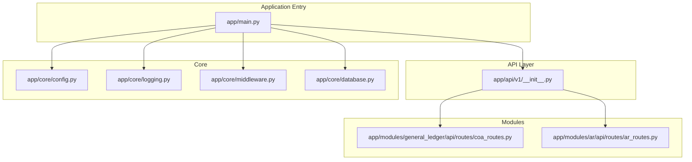
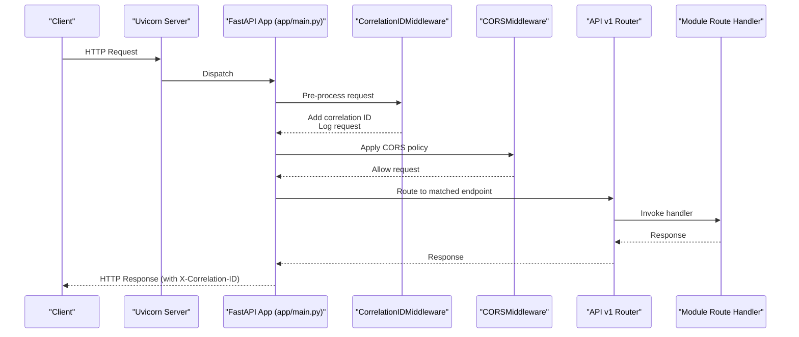
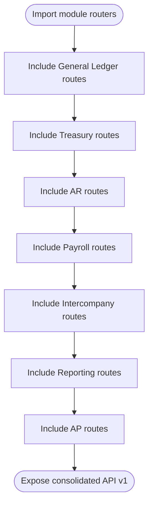
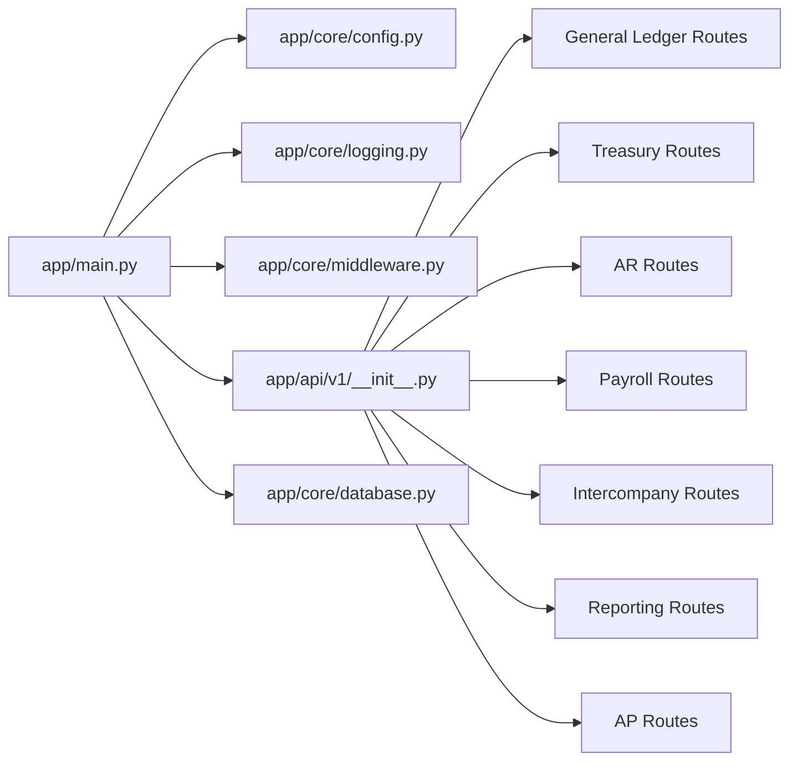

# Application Entry Points

<cite>
**Referenced Files in This Document**
- [app/main.py](file://app/main.py)
- [app/api/v1/__init__.py](file://app/api/v1/__init__.py)
- [app/core/config.py](file://app/core/config.py)
- [app/core/database.py](file://app/core/database.py)
- [app/core/middleware.py](file://app/core/middleware.py)
- [app/core/logging.py](file://app/core/logging.py)
- [app/modules/general_ledger/api/routes/coa_routes.py](file://app/modules/general_ledger/api/routes/coa_routes.py)
- [app/modules/ar/api/routes/ar_routes.py](file://app/modules/ar/api/routes/ar_routes.py)
- [.env.example](file://.env.example)
- [Dockerfile](file://Dockerfile)
- [docker-compose.yml](file://docker-compose.yml)
- [app/core/idempotency.py](file://app/core/idempotency.py)
</cite>

## Table of Contents
1. [Introduction](#introduction)
2. [Project Structure](#project-structure)
3. [Core Components](#core-components)
4. [Architecture Overview](#architecture-overview)
5. [Detailed Component Analysis](#detailed-component-analysis)
6. [Dependency Analysis](#dependency-analysis)
7. [Performance Considerations](#performance-considerations)
8. [Troubleshooting Guide](#troubleshooting-guide)
9. [Conclusion](#conclusion)

## Introduction
This document explains the FastAPI application entry points and initialization for the TrueVow Financial Management Service. It covers the main application setup in app/main.py, including FastAPI configuration, health check endpoints, startup/shutdown events, and application metadata. It also documents the router aggregation system in app/api/v1/__init__.py that consolidates all module routes. Additionally, it describes application lifecycle management, environment-specific configurations, and best practices for extending the application with new modules. Examples show how to add new API endpoints while maintaining architectural consistency.

## Project Structure
The application follows a modular structure organized by functional domains (modules) under app/modules. The entry point initializes the FastAPI application, registers middleware, and mounts the API v1 router. Configuration is centralized via app/core/config.py, and database setup is managed in app/core/database.py. Logging is configured in app/core/logging.py, and a correlation ID middleware is defined in app/core/middleware.py.

**Diagram sources**
- [app/main.py](file://app/main.py#L1-L54)
- [app/api/v1/__init__.py](file://app/api/v1/__init__.py#L1-L72)
- [app/core/config.py](file://app/core/config.py#L1-L74)
- [app/core/database.py](file://app/core/database.py#L1-L113)
- [app/core/middleware.py](file://app/core/middleware.py#L1-L35)
- [app/core/logging.py](file://app/core/logging.py#L1-L34)
- [app/modules/general_ledger/api/routes/coa_routes.py](file://app/modules/general_ledger/api/routes/coa_routes.py#L1-L123)
- [app/modules/ar/api/routes/ar_routes.py](file://app/modules/ar/api/routes/ar_routes.py#L1-L178)

**Section sources**
- [app/main.py](file://app/main.py#L1-L54)
- [app/api/v1/__init__.py](file://app/api/v1/__init__.py#L1-L72)

## Core Components
- Application Factory and Metadata
  - FastAPI instance creation with title, version, description, and docs/redoc endpoints.
  - Startup and shutdown event handlers for lifecycle logging.
  - Health check endpoint returning service status and version.
- Middleware Stack
  - Correlation ID middleware registered first to track all requests and responses.
  - CORS middleware configured for development (allow all origins).
- Router Aggregation
  - API v1 router aggregates routes from multiple modules and exposes them under /api/v1.
- Configuration and Environment
  - Centralized settings via Settings model with environment variable loading.
  - Effective database URL resolution and JWT secret handling.
- Database Initialization
  - Async engine creation and session factory with configurable pool sizes.
  - Model imports to populate metadata for Alembic and runtime usage.
- Logging
  - Structured logging with loguru when available, falling back to stdlib logging.
  - Environment-specific log file configuration for production.

**Section sources**
- [app/main.py](file://app/main.py#L9-L54)
- [app/api/v1/__init__.py](file://app/api/v1/__init__.py#L1-L72)
- [app/core/config.py](file://app/core/config.py#L7-L74)
- [app/core/database.py](file://app/core/database.py#L88-L113)
- [app/core/middleware.py](file://app/core/middleware.py#L8-L35)
- [app/core/logging.py](file://app/core/logging.py#L1-L34)

## Architecture Overview
The application initializes the FastAPI app, registers middleware, and mounts the API v1 router. Requests flow through middleware, then to the v1 router, which dispatches to module-specific routes. Database sessions are injected via dependency injection, and logging is unified across the stack.

**Diagram sources**
- [app/main.py](file://app/main.py#L17-L30)
- [app/core/middleware.py](file://app/core/middleware.py#L11-L34)
- [app/api/v1/__init__.py](file://app/api/v1/__init__.py#L34-L72)

## Detailed Component Analysis

### Main Application Setup (app/main.py)
- FastAPI Configuration
  - Title, version, and description are taken from settings.
  - Docs and Redoc endpoints exposed at /docs and /redoc.
- Middleware Registration
  - Correlation ID middleware added first to capture all requests.
  - CORS middleware configured for development flexibility.
- Router Mounting
  - API v1 router included with prefix /api/v1.
- Lifecycle Events
  - Startup logs application name and environment.
  - Shutdown logs graceful termination.
- Health Endpoint
  - GET /health returns service status and version.

Best practices:
- Keep middleware registration order consistent (correlation first).
- Centralize metadata in settings for easy environment overrides.
- Use dedicated health endpoint for platform integrations.

**Section sources**
- [app/main.py](file://app/main.py#L9-L54)
- [app/core/config.py](file://app/core/config.py#L10-L14)

### Router Aggregation (app/api/v1/__init__.py)
- Purpose
  - Consolidates routes from multiple modules into a single API v1 router.
- Pattern
  - Imports module routers and includes them into the v1 APIRouter.
  - Maintains logical grouping by domain (General Ledger, Treasury, AR, Payroll, Intercompany, Reporting, AP).
- Extensibility
  - Adding a new module involves importing its router and including it in the v1 router.

Example extension steps:
- Create or locate the module’s routes file.
- Import the module’s router.
- Include it into the v1 router.

**Diagram sources**
- [app/api/v1/__init__.py](file://app/api/v1/__init__.py#L3-L68)

**Section sources**
- [app/api/v1/__init__.py](file://app/api/v1/__init__.py#L1-L72)

### Configuration and Environment (app/core/config.py)
- Settings Model
  - Application metadata (name, version, environment, debug).
  - Database URL resolution with preference for DATABASE_URL; conversion to asyncpg when needed.
  - JWT secret handling with fallbacks and validation.
  - Optional third-party service integrations (billing, treasury).
  - Observability settings (log level, metrics).
- Environment Variable Loading
  - Loads from .env and .env.local with case-insensitive keys and ignores extras.

Environment-specific guidance:
- Set ENVIRONMENT to production for structured file logging.
- Provide JWT_SECRET_KEY or FINANCIAL_MANAGEMENT_SECRET_KEY for secure endpoints.
- Configure DATABASE_URL for async PostgreSQL connections.

**Section sources**
- [app/core/config.py](file://app/core/config.py#L7-L74)
- [.env.example](file://.env.example#L1-L23)

### Database Initialization (app/core/database.py)
- Engine Creation
  - Uses effective_database_url from settings.
  - Pool size and overflow controlled via settings.
  - Echo enabled when debug is true.
- Session Factory
  - AsyncSessionLocal configured with expire_on_commit disabled.
- Dependency Injection
  - get_db_session yields a scoped AsyncSession and ensures closure.

Operational notes:
- Ensure all models are imported so SQLAlchemy metadata is populated.
- Adjust pool sizes according to deployment scale.

**Section sources**
- [app/core/database.py](file://app/core/database.py#L88-L113)

### Logging and Observability (app/core/logging.py)
- Logging Backend
  - Prefers loguru with console formatting; adds file handler in production when environment is set accordingly.
  - Falls back to stdlib logging if loguru is unavailable.
- Usage
  - Central logger instance used across the application for consistent formatting.

**Section sources**
- [app/core/logging.py](file://app/core/logging.py#L1-L34)

### Middleware: Correlation ID (app/core/middleware.py)
- Behavior
  - Extracts or generates a correlation ID from headers or UUID.
  - Adds correlation ID to request state and logs request metadata.
  - Propagates correlation ID in response headers.
- Placement
  - Registered first to ensure all downstream processing is tracked.

**Section sources**
- [app/core/middleware.py](file://app/core/middleware.py#L8-L35)

### Example Route Patterns (Module-Level)
These examples illustrate the standard pattern for module routes, including dependency injection of database sessions and consistent error handling.

- Chart of Accounts (General Ledger)
  - Demonstrates CRUD endpoints with typed schemas and database session dependency.
  - Reference: [app/modules/general_ledger/api/routes/coa_routes.py](file://app/modules/general_ledger/api/routes/coa_routes.py#L17-L123)

- Accounts Receivable
  - Includes idempotency integration and endpoint-specific validations.
  - Reference: [app/modules/ar/api/routes/ar_routes.py](file://app/modules/ar/api/routes/ar_routes.py#L16-L178)

Best practices for adding new endpoints:
- Define APIRouter with appropriate prefix and tags.
- Use get_db_session dependency for AsyncSession.
- Validate inputs and handle NotFoundError/ValidationError consistently.
- For write operations, consider idempotency where appropriate.

**Section sources**
- [app/modules/general_ledger/api/routes/coa_routes.py](file://app/modules/general_ledger/api/routes/coa_routes.py#L17-L123)
- [app/modules/ar/api/routes/ar_routes.py](file://app/modules/ar/api/routes/ar_routes.py#L16-L178)

### Idempotency Infrastructure (app/core/idempotency.py)
- Purpose
  - Provides idempotency keys to prevent duplicate processing of requests.
- Key Concepts
  - Canonical JSON encoding for stable hashing.
  - State machine: PENDING → COMPLETED or FAILED.
  - Lock TTL per endpoint to handle stale locks.
- Usage Pattern
  - Require idempotency key header.
  - Wrap handler logic with apply_idempotency to store and replay responses.

When to use:
- Write operations that must not be duplicated (e.g., posting journal entries, payments).
- Operations where clients may retry due to network issues.

**Section sources**
- [app/core/idempotency.py](file://app/core/idempotency.py#L207-L482)

## Dependency Analysis
The application exhibits clear layering:
- app/main.py depends on settings, logging, middleware, and the v1 router.
- v1 router depends on module route imports.
- Core modules depend on database sessions and shared schemas/services.
- Configuration and database are foundational and consumed broadly.

**Diagram sources**
- [app/main.py](file://app/main.py#L4-L7)
- [app/api/v1/__init__.py](file://app/api/v1/__init__.py#L3-L68)
- [app/core/config.py](file://app/core/config.py#L7-L74)
- [app/core/database.py](file://app/core/database.py#L88-L113)

**Section sources**
- [app/main.py](file://app/main.py#L4-L7)
- [app/api/v1/__init__.py](file://app/api/v1/__init__.py#L3-L68)

## Performance Considerations
- Database Pool Tuning
  - Adjust database_pool_size and database_max_overflow in settings for expected concurrency.
- Logging Overhead
  - Disable echo in production; structured logging is efficient but still impacts throughput.
- Middleware Impact
  - Correlation ID generation and logging add minimal overhead; keep middleware count reasonable.
- Idempotency Storage
  - Responses are stored up to a capped size; ensure endpoint responses remain within limits to avoid truncation.

[No sources needed since this section provides general guidance]

## Troubleshooting Guide
Common issues and resolutions:
- Missing JWT Secret
  - Symptom: Validation errors during startup or runtime.
  - Resolution: Set JWT_SECRET_KEY or FINANCIAL_MANAGEMENT_SECRET_KEY in environment.
  - Reference: [app/core/config.py](file://app/core/config.py#L41-L48)
- Database Connection Failures
  - Symptom: Operational errors when connecting to PostgreSQL.
  - Resolution: Verify DATABASE_URL or FINANCIAL_MANAGEMENT_DATABASE_URL and ensure asyncpg format.
  - Reference: [app/core/config.py](file://app/core/config.py#L23-L35)
- Health Check Unavailable
  - Symptom: /health returns 404.
  - Resolution: Confirm main app includes the health endpoint and server is running.
  - Reference: [app/main.py](file://app/main.py#L33-L40)
- CORS Errors (Development)
  - Symptom: Browser blocks cross-origin requests.
  - Resolution: Confirm allow_origins configuration; tighten in production.
  - Reference: [app/main.py](file://app/main.py#L21-L27)
- Logging Not Captured
  - Symptom: No logs in production.
  - Resolution: Set ENVIRONMENT to production and ensure log directory is writable.
  - Reference: [app/core/logging.py](file://app/core/logging.py#L15-L24)

**Section sources**
- [app/core/config.py](file://app/core/config.py#L41-L48)
- [app/core/config.py](file://app/core/config.py#L23-L35)
- [app/main.py](file://app/main.py#L33-L40)
- [app/main.py](file://app/main.py#L21-L27)
- [app/core/logging.py](file://app/core/logging.py#L15-L24)

## Conclusion
The application entry points and initialization establish a clean, modular FastAPI architecture. The main app wires configuration, logging, middleware, and router aggregation cleanly. The API v1 router consolidates domain-specific routes, enabling straightforward extension. Environment-specific configuration and database/session management support scalable deployments. Following the documented patterns ensures consistency when adding new modules and endpoints.

[No sources needed since this section summarizes without analyzing specific files]