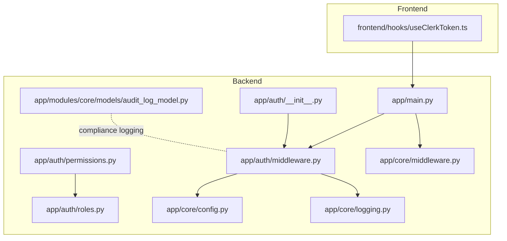
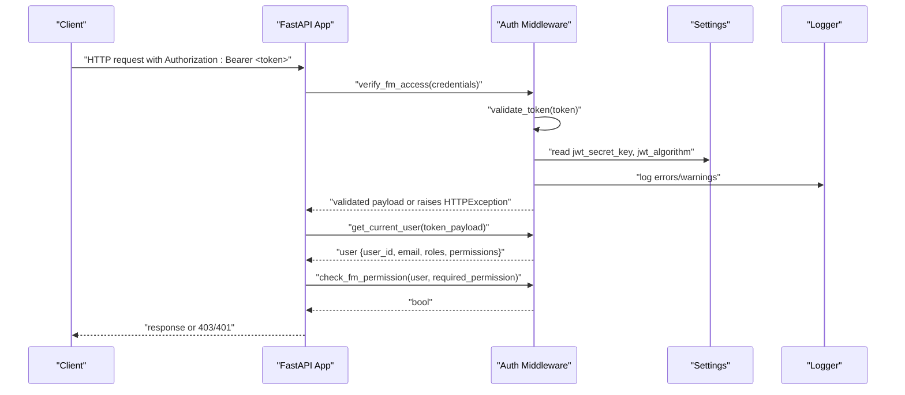
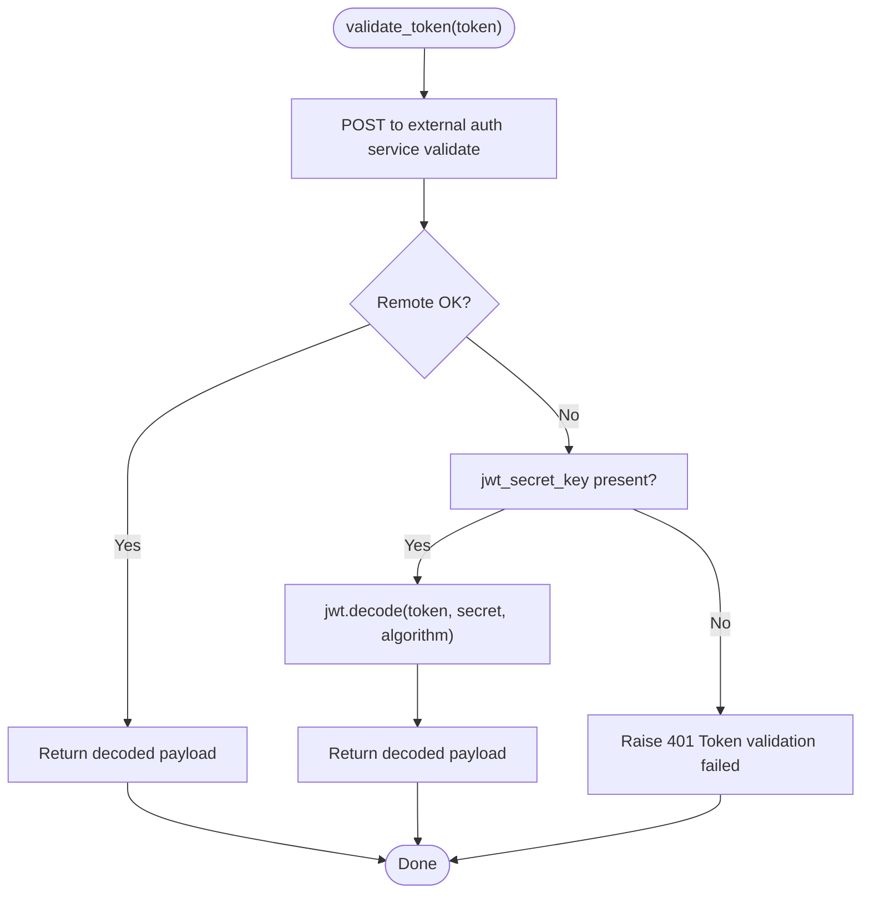
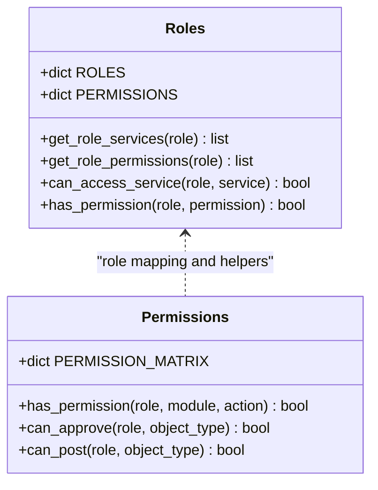
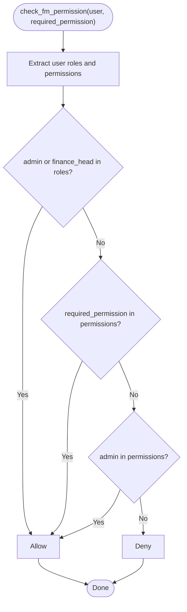
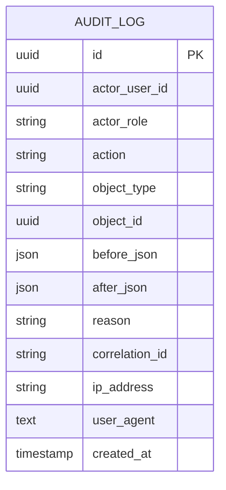
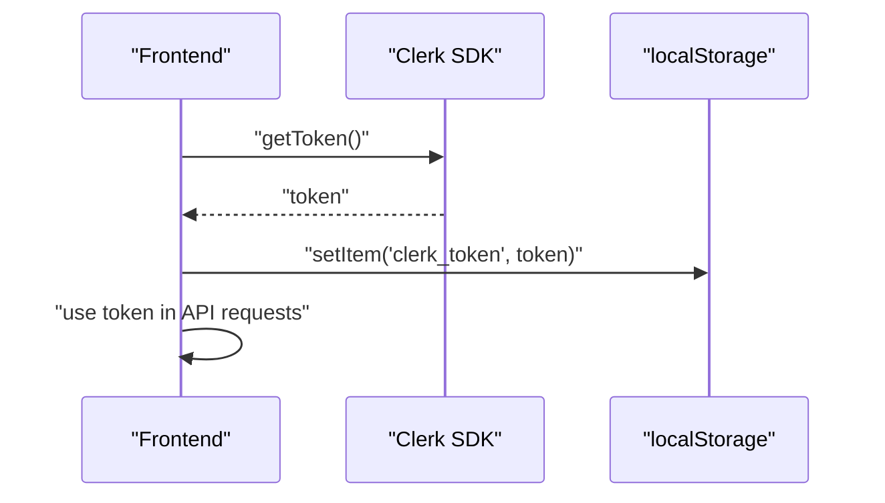
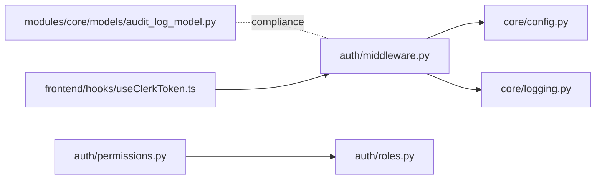

# Authentication & Authorization

<cite>
**Referenced Files in This Document**
- [app/auth/__init__.py](file://app/auth/__init__.py)
- [app/auth/middleware.py](file://app/auth/middleware.py)
- [app/auth/permissions.py](file://app/auth/permissions.py)
- [app/auth/roles.py](file://app/auth/roles.py)
- [app/core/config.py](file://app/core/config.py)
- [app/core/logging.py](file://app/core/logging.py)
- [app/core/middleware.py](file://app/core/middleware.py)
- [app/main.py](file://app/main.py)
- [app/modules/core/models/audit_log_model.py](file://app/modules/core/models/audit_log_model.py)
- [frontend/hooks/useClerkToken.ts](file://frontend/hooks/useClerkToken.ts)
- [MIGRATION_PLAN.md](file://MIGRATION_PLAN.md)
</cite>

## Table of Contents
1. [Introduction](#introduction)
2. [Project Structure](#project-structure)
3. [Core Components](#core-components)
4. [Architecture Overview](#architecture-overview)
5. [Detailed Component Analysis](#detailed-component-analysis)
6. [Dependency Analysis](#dependency-analysis)
7. [Performance Considerations](#performance-considerations)
8. [Troubleshooting Guide](#troubleshooting-guide)
9. [Conclusion](#conclusion)
10. [Appendices](#appendices)

## Introduction
This document describes the authentication and authorization system for the Financial Management Service. It explains how JWT tokens are validated, how service access is enforced, and how role-based access control (RBAC) governs permissions across modules. It also covers permission validation, role hierarchies, dynamic access control, and integration with external authentication providers. Finally, it outlines security best practices, token lifecycle management, and audit trail requirements for compliance.

## Project Structure
The authentication and authorization logic is primarily implemented in the backend under app/auth, with supporting configuration and logging in app/core. The frontend integrates with Clerk for token acquisition and storage. The audit log model supports compliance and traceability.

**Diagram sources**
- [app/auth/middleware.py](file://app/auth/middleware.py#L1-L140)
- [app/auth/permissions.py](file://app/auth/permissions.py#L1-L127)
- [app/auth/roles.py](file://app/auth/roles.py#L1-L119)
- [app/auth/__init__.py](file://app/auth/__init__.py#L1-L14)
- [app/core/config.py](file://app/core/config.py#L1-L74)
- [app/core/logging.py](file://app/core/logging.py#L1-L34)
- [app/core/middleware.py](file://app/core/middleware.py#L1-L35)
- [app/main.py](file://app/main.py#L1-L53)
- [app/modules/core/models/audit_log_model.py](file://app/modules/core/models/audit_log_model.py#L1-L43)
- [frontend/hooks/useClerkToken.ts](file://frontend/hooks/useClerkToken.ts#L1-L23)

**Section sources**
- [app/auth/__init__.py](file://app/auth/__init__.py#L1-L14)
- [app/auth/middleware.py](file://app/auth/middleware.py#L1-L140)
- [app/auth/permissions.py](file://app/auth/permissions.py#L1-L127)
- [app/auth/roles.py](file://app/auth/roles.py#L1-L119)
- [app/core/config.py](file://app/core/config.py#L1-L74)
- [app/core/logging.py](file://app/core/logging.py#L1-L34)
- [app/core/middleware.py](file://app/core/middleware.py#L1-L35)
- [app/main.py](file://app/main.py#L1-L53)
- [app/modules/core/models/audit_log_model.py](file://app/modules/core/models/audit_log_model.py#L1-L43)
- [frontend/hooks/useClerkToken.ts](file://frontend/hooks/useClerkToken.ts#L1-L23)
- [MIGRATION_PLAN.md](file://MIGRATION_PLAN.md#L1-L23)

## Core Components
- JWT validation and service access enforcement: Centralized validation against an external auth service with local fallback, plus service gating for financial_management.
- RBAC definitions: Roles and permission matrices for modules and actions, plus permission helpers for approvals and postings.
- Permission checking: Utility to evaluate whether a user’s roles and permissions satisfy a required permission.
- Configuration and logging: JWT secret handling, algorithm, expiration, and structured logging for observability.
- Audit logging: Structured audit log model capturing actor, action, object, and metadata for compliance.

**Section sources**
- [app/auth/middleware.py](file://app/auth/middleware.py#L17-L86)
- [app/auth/permissions.py](file://app/auth/permissions.py#L7-L127)
- [app/auth/roles.py](file://app/auth/roles.py#L6-L119)
- [app/core/config.py](file://app/core/config.py#L37-L51)
- [app/modules/core/models/audit_log_model.py](file://app/modules/core/models/audit_log_model.py#L9-L43)

## Architecture Overview
The system enforces authentication and authorization at the API gateway via middleware. Requests must carry a valid JWT; the backend validates it either via an external auth service or locally using a configured secret. After successful validation, service access is checked, and the current user context (including roles and permissions) is extracted. Permission checks are performed per-request using RBAC matrices and helpers.

**Diagram sources**
- [app/auth/middleware.py](file://app/auth/middleware.py#L17-L138)
- [app/core/config.py](file://app/core/config.py#L37-L51)
- [app/core/logging.py](file://app/core/logging.py#L1-L34)
- [app/main.py](file://app/main.py#L1-L53)

## Detailed Component Analysis

### JWT Validation and Service Access
- Centralized validation: Attempts external auth service validation first; falls back to local decoding using a configured secret and algorithm.
- Service gating: Ensures the token payload includes financial_management among accessible services before allowing access.
- Error handling: Distinguishes auth service availability vs. token validity errors, logging appropriately.

**Diagram sources**
- [app/auth/middleware.py](file://app/auth/middleware.py#L17-L56)
- [app/core/config.py](file://app/core/config.py#L37-L51)

**Section sources**
- [app/auth/middleware.py](file://app/auth/middleware.py#L17-L86)
- [app/core/config.py](file://app/core/config.py#L37-L51)
- [app/core/logging.py](file://app/core/logging.py#L1-L34)

### RBAC Role Definitions and Hierarchies
- Roles: A comprehensive set of roles scoped to financial_management and mapped to services and permissions.
- Hierarchies: Certain legacy role names map to canonical roles (e.g., finance_head to FINANCE_ADMIN).
- Permissions: Roles define baseline permissions (read, write, admin), with module-specific overrides.

**Diagram sources**
- [app/auth/roles.py](file://app/auth/roles.py#L6-L119)
- [app/auth/permissions.py](file://app/auth/permissions.py#L7-L127)

**Section sources**
- [app/auth/roles.py](file://app/auth/roles.py#L6-L119)
- [app/auth/permissions.py](file://app/auth/permissions.py#L7-L127)

### Permission Validation and Dynamic Access Control
- Dynamic checks: At runtime, the system evaluates whether a user’s roles and permissions satisfy a required permission.
- Admin escalation: Roles or permissions containing admin grant broad privileges.
- Module-action granularity: Permission matrices define allowed actions per module, enabling fine-grained controls.

**Diagram sources**
- [app/auth/middleware.py](file://app/auth/middleware.py#L109-L138)

**Section sources**
- [app/auth/middleware.py](file://app/auth/middleware.py#L109-L138)

### Audit Trail and Compliance Logging
- Audit log model: Captures actor identifiers, roles, actions, object types/IDs, correlation IDs, timestamps, and optional reasons and technical metadata.
- Compliance intent: Supports financial transaction auditing, user action tracking, and regulatory requirements.

**Diagram sources**
- [app/modules/core/models/audit_log_model.py](file://app/modules/core/models/audit_log_model.py#L9-L43)

**Section sources**
- [app/modules/core/models/audit_log_model.py](file://app/modules/core/models/audit_log_model.py#L9-L43)

### Frontend Integration with Clerk
- Token acquisition: The frontend hook obtains a token from Clerk and stores it in localStorage for API clients.
- Migration note: The project migration targets replacing custom JWT auth with Clerk.

**Diagram sources**
- [frontend/hooks/useClerkToken.ts](file://frontend/hooks/useClerkToken.ts#L6-L20)
- [MIGRATION_PLAN.md](file://MIGRATION_PLAN.md#L16-L21)

**Section sources**
- [frontend/hooks/useClerkToken.ts](file://frontend/hooks/useClerkToken.ts#L1-L23)
- [MIGRATION_PLAN.md](file://MIGRATION_PLAN.md#L1-L23)

## Dependency Analysis
- External dependencies: FastAPI security (HTTPBearer), HTTP client (httpx), JWT library (jose), and logging (loguru/stdlib).
- Internal dependencies: Auth middleware depends on configuration and logging; permissions depend on roles; audit logging is decoupled and reusable.

**Diagram sources**
- [app/auth/middleware.py](file://app/auth/middleware.py#L1-L140)
- [app/auth/permissions.py](file://app/auth/permissions.py#L1-L127)
- [app/auth/roles.py](file://app/auth/roles.py#L1-L119)
- [app/core/config.py](file://app/core/config.py#L1-L74)
- [app/core/logging.py](file://app/core/logging.py#L1-L34)
- [app/modules/core/models/audit_log_model.py](file://app/modules/core/models/audit_log_model.py#L1-L43)
- [frontend/hooks/useClerkToken.ts](file://frontend/hooks/useClerkToken.ts#L1-L23)

**Section sources**
- [app/auth/middleware.py](file://app/auth/middleware.py#L1-L140)
- [app/auth/permissions.py](file://app/auth/permissions.py#L1-L127)
- [app/auth/roles.py](file://app/auth/roles.py#L1-L119)
- [app/core/config.py](file://app/core/config.py#L1-L74)
- [app/core/logging.py](file://app/core/logging.py#L1-L34)
- [app/modules/core/models/audit_log_model.py](file://app/modules/core/models/audit_log_model.py#L1-L43)
- [frontend/hooks/useClerkToken.ts](file://frontend/hooks/useClerkToken.ts#L1-L23)

## Performance Considerations
- Token validation latency: External auth service validation introduces network latency; consider caching validated tokens at the edge or short-lived local validation for internal routes.
- Algorithm and secret configuration: Ensure HS256 and a strong secret are used; avoid weak development defaults in production.
- Logging overhead: Structured logging is efficient; avoid excessive log volume in high-throughput scenarios.

[No sources needed since this section provides general guidance]

## Troubleshooting Guide
- 401 Unauthorized: Indicates token validation failure. Check JWT secret configuration and algorithm; verify the token issuer and audience.
- 403 Forbidden: Indicates lack of financial_management service access. Confirm the token payload includes financial_management in services.
- 503 Service Unavailable: Indicates external auth service unavailability. Retry with exponential backoff and degrade gracefully if appropriate.
- Logging: Use correlation IDs to trace requests across services; inspect logs for validation errors and warnings.

**Section sources**
- [app/auth/middleware.py](file://app/auth/middleware.py#L30-L56)
- [app/auth/middleware.py](file://app/auth/middleware.py#L74-L86)
- [app/core/middleware.py](file://app/core/middleware.py#L11-L34)
- [app/core/logging.py](file://app/core/logging.py#L1-L34)

## Conclusion
The system implements a robust, layered authentication and authorization strategy: centralized JWT validation with local fallback, strict service gating, and comprehensive RBAC with hierarchical roles and dynamic permission checks. The audit log model supports compliance needs, while the frontend integration with Clerk aligns with modern SSO practices. Adopt the best practices below to maintain security and reliability.

## Appendices

### Practical Examples

- Implementing custom permissions
  - Extend the permission matrix with new module-action pairs and map them to roles.
  - Add a helper function to encapsulate domain-specific checks (e.g., can_approve, can_post).
  - Reference: [app/auth/permissions.py](file://app/auth/permissions.py#L7-L127)

- Extending role definitions
  - Add a new role to the roles registry with services and permissions.
  - Map legacy role names to canonical roles if needed.
  - Reference: [app/auth/roles.py](file://app/auth/roles.py#L6-L79)

- Integrating with external authentication providers
  - Ensure the external auth service returns a payload with services and claims.
  - Configure JWT secret and algorithm for local fallback during development.
  - Reference: [app/auth/middleware.py](file://app/auth/middleware.py#L17-L56), [app/core/config.py](file://app/core/config.py#L37-L51)

- Security best practices
  - Enforce HTTPS and secure cookies for token transport.
  - Rotate secrets regularly and restrict JWT expiration.
  - Sanitize logs to avoid exposing tokens or PII.
  - Reference: [app/core/config.py](file://app/core/config.py#L37-L51), [app/core/logging.py](file://app/core/logging.py#L1-L34)

- Token lifecycle management
  - Short-lived access tokens with refresh tokens via the external provider.
  - Invalidate tokens on logout and enforce re-authentication after sensitive actions.
  - Reference: [app/auth/middleware.py](file://app/auth/middleware.py#L17-L56)

- Audit trail requirements for compliance
  - Capture actor, role, action, object, correlation ID, timestamps, and reasons for sensitive operations.
  - Maintain retention policies aligned with SOX/GDPR requirements.
  - Reference: [app/modules/core/models/audit_log_model.py](file://app/modules/core/models/audit_log_model.py#L9-L43)