# Backend Application

<cite>
**Referenced Files in This Document**
- [app/main.py](file://app/main.py)
- [app/api/v1/__init__.py](file://app/api/v1/__init__.py)
- [app/core/config.py](file://app/core/config.py)
- [app/core/database.py](file://app/core/database.py)
- [app/core/db_metadata.py](file://app/core/db_metadata.py)
- [app/core/logging.py](file://app/core/logging.py)
- [app/core/middleware.py](file://app/core/middleware.py)
- [app/core/exceptions.py](file://app/core/exceptions.py)
- [app/core/idempotency.py](file://app/core/idempotency.py)
- [app/core/row_version.py](file://app/core/row_version.py)
- [app/auth/middleware.py](file://app/auth/middleware.py)
- [app/auth/permissions.py](file://app/auth/permissions.py)
- [app/shared/models/base_model.py](file://app/shared/models/base_model.py)
- [app/shared/repositories/base_repository.py](file://app/shared/repositories/base_repository.py)
</cite>

## Table of Contents
1. [Introduction](#introduction)
2. [Project Structure](#project-structure)
3. [Core Components](#core-components)
4. [Architecture Overview](#architecture-overview)
5. [Detailed Component Analysis](#detailed-component-analysis)
6. [Dependency Analysis](#dependency-analysis)
7. [Performance Considerations](#performance-considerations)
8. [Troubleshooting Guide](#troubleshooting-guide)
9. [Conclusion](#conclusion)
10. [Appendices](#appendices)

## Introduction
This document describes the backend application for the TrueVow Financial Management system built with FastAPI. It explains the application setup, router configuration, middleware stack, and core infrastructure components. It also covers configuration management, database connection pooling, logging setup, exception handling, and security middleware. Guidance is included for extending the backend with new modules while maintaining architectural consistency.

## Project Structure
The backend follows a modular structure organized by functional domains (modules) under app/modules, with shared base classes, repositories, and core infrastructure in app/core and app/shared. The FastAPI application is initialized in app/main.py and exposes a single API version router at /api/v1.

```mermaid
graph TB
A["app/main.py<br/>FastAPI app, middleware, routers"] --> B["app/api/v1/__init__.py<br/>APIRouter composition"]
B --> C["app/modules/general_ledger/api/routes/*"]
B --> D["app/modules/treasury/api/routes/*"]
B --> E["app/modules/ar/api/routes/*"]
B --> F["app/modules/payroll/api/routes/*"]
B --> G["app/modules/intercompany/api/routes/*"]
B --> H["app/modules/reporting/api/routes/*"]
B --> I["app/modules/ap/api/routes/*"]
A --> J["app/core/config.py<br/>Settings"]
A --> K["app/core/database.py<br/>Engine, Session, get_db_session"]
A --> L["app/core/logging.py<br/>Logger"]
A --> M["app/core/middleware.py<br/>CorrelationIDMiddleware"]
A --> N["app/auth/middleware.py<br/>JWT validation, access checks"]
A --> O["app/auth/permissions.py<br/>Permission matrix"]
A --> P["app/core/idempotency.py<br/>Idempotency infrastructure"]
A --> Q["app/core/row_version.py<br/>Row version conflict checking"]
A --> R["app/shared/models/base_model.py<br/>Base model"]
A --> S["app/shared/repositories/base_repository.py<br/>Base repository"]
```

**Diagram sources**
- [app/main.py](file://app/main.py#L1-L54)
- [app/api/v1/__init__.py](file://app/api/v1/__init__.py#L1-L72)
- [app/core/config.py](file://app/core/config.py#L1-L74)
- [app/core/database.py](file://app/core/database.py#L1-L113)
- [app/core/logging.py](file://app/core/logging.py#L1-L34)
- [app/core/middleware.py](file://app/core/middleware.py#L1-L35)
- [app/auth/middleware.py](file://app/auth/middleware.py#L1-L140)
- [app/auth/permissions.py](file://app/auth/permissions.py#L1-L127)
- [app/core/idempotency.py](file://app/core/idempotency.py#L1-L482)
- [app/core/row_version.py](file://app/core/row_version.py#L1-L31)
- [app/shared/models/base_model.py](file://app/shared/models/base_model.py#L1-L18)
- [app/shared/repositories/base_repository.py](file://app/shared/repositories/base_repository.py#L1-L54)

**Section sources**
- [app/main.py](file://app/main.py#L1-L54)
- [app/api/v1/__init__.py](file://app/api/v1/__init__.py#L1-L72)

## Core Components
- Application initialization and lifecycle:
  - FastAPI app configured with title, version, docs, and redoc endpoints.
  - Startup/shutdown events log environment and service status.
- Middleware stack:
  - Correlation ID middleware for request tracing.
  - CORS middleware enabled for development.
- Configuration management:
  - Centralized settings via pydantic-settings with environment variable support.
  - Database URL resolution and JWT secret handling.
- Database connectivity:
  - Async SQLAlchemy engine and session factory with configurable pool sizes.
  - Dependency injection for database sessions.
- Logging:
  - Structured logging with loguru when available, falling back to stdlib logging.
- Security:
  - JWT bearer token validation with local and centralized auth service options.
  - Role-based access control and permission checks.
- Cross-cutting concerns:
  - Idempotency infrastructure for safe retries and replay.
  - Row version conflict detection for optimistic concurrency.
  - Shared base model and repository abstractions.

**Section sources**
- [app/main.py](file://app/main.py#L1-L54)
- [app/core/config.py](file://app/core/config.py#L1-L74)
- [app/core/database.py](file://app/core/database.py#L1-L113)
- [app/core/logging.py](file://app/core/logging.py#L1-L34)
- [app/core/middleware.py](file://app/core/middleware.py#L1-L35)
- [app/auth/middleware.py](file://app/auth/middleware.py#L1-L140)
- [app/auth/permissions.py](file://app/auth/permissions.py#L1-L127)
- [app/core/idempotency.py](file://app/core/idempotency.py#L1-L482)
- [app/core/row_version.py](file://app/core/row_version.py#L1-L31)
- [app/shared/models/base_model.py](file://app/shared/models/base_model.py#L1-L18)
- [app/shared/repositories/base_repository.py](file://app/shared/repositories/base_repository.py#L1-L54)

## Architecture Overview
The backend is a layered FastAPI application:
- Entry point initializes the app, registers middleware, and includes the v1 router.
- The v1 router aggregates domain-specific route modules.
- Domain handlers depend on repositories backed by async SQLAlchemy sessions.
- Shared base classes provide consistent model and repository patterns.
- Core infrastructure handles configuration, logging, security, idempotency, and row version checks.

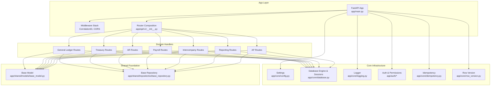

**Diagram sources**
- [app/main.py](file://app/main.py#L1-L54)
- [app/api/v1/__init__.py](file://app/api/v1/__init__.py#L1-L72)
- [app/core/config.py](file://app/core/config.py#L1-L74)
- [app/core/database.py](file://app/core/database.py#L1-L113)
- [app/core/logging.py](file://app/core/logging.py#L1-L34)
- [app/auth/middleware.py](file://app/auth/middleware.py#L1-L140)
- [app/auth/permissions.py](file://app/auth/permissions.py#L1-L127)
- [app/core/idempotency.py](file://app/core/idempotency.py#L1-L482)
- [app/core/row_version.py](file://app/core/row_version.py#L1-L31)
- [app/shared/models/base_model.py](file://app/shared/models/base_model.py#L1-L18)
- [app/shared/repositories/base_repository.py](file://app/shared/repositories/base_repository.py#L1-L54)

## Detailed Component Analysis

### FastAPI Application Setup
- Initializes FastAPI with metadata and docs/redoc endpoints.
- Registers CorrelationIDMiddleware first to capture all requests.
- Adds CORS middleware.
- Includes the v1 router under /api/v1.
- Defines a health check endpoint.
- Logs startup and shutdown events.

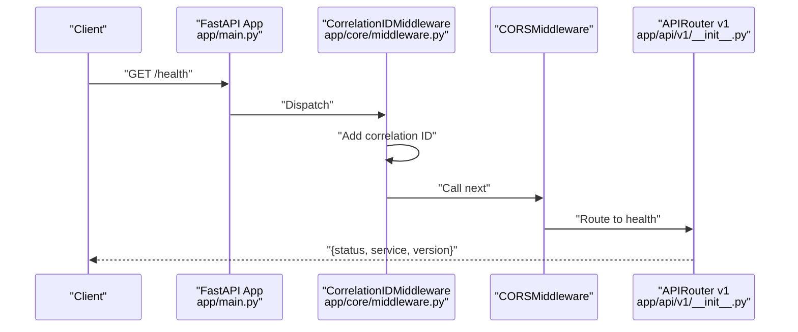

**Diagram sources**
- [app/main.py](file://app/main.py#L1-L54)
- [app/core/middleware.py](file://app/core/middleware.py#L1-L35)
- [app/api/v1/__init__.py](file://app/api/v1/__init__.py#L1-L72)

**Section sources**
- [app/main.py](file://app/main.py#L1-L54)

### API Router Configuration
- Composes a single APIRouter that includes routes from multiple modules:
  - General ledger, treasury, AR, payroll, intercompany, reporting, and AP.
- Maintains a clean separation of concerns by importing route blueprints from each domain.

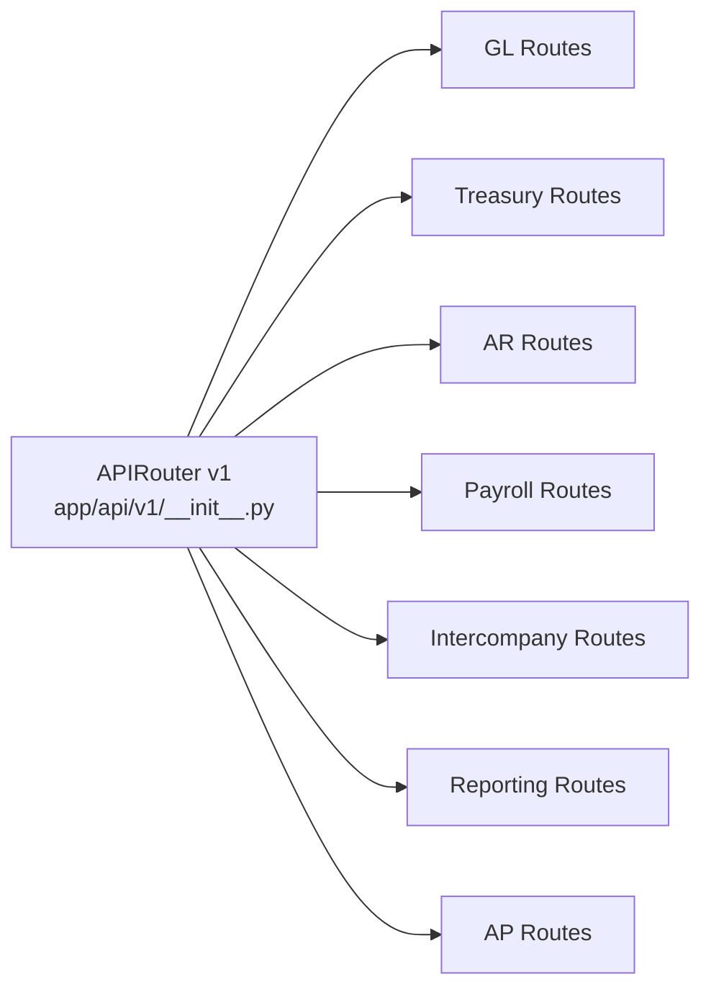

**Diagram sources**
- [app/api/v1/__init__.py](file://app/api/v1/__init__.py#L1-L72)

**Section sources**
- [app/api/v1/__init__.py](file://app/api/v1/__init__.py#L1-L72)

### Middleware Stack
- CorrelationIDMiddleware:
  - Extracts or generates a correlation ID from headers.
  - Logs request metadata and attaches correlation ID to response headers.
- CORS middleware:
  - Allows all origins/methods/headers for development; adjust for production.

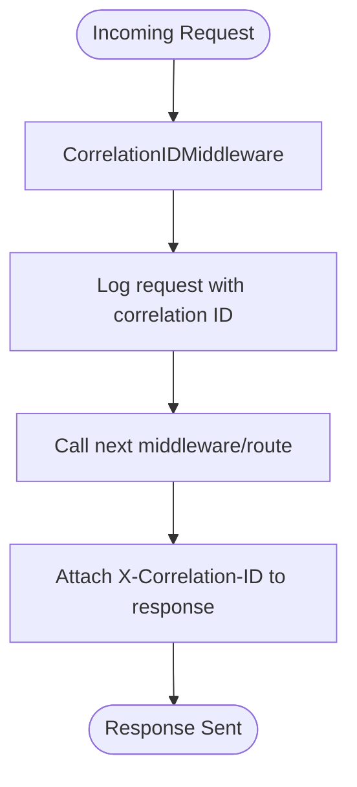

**Diagram sources**
- [app/core/middleware.py](file://app/core/middleware.py#L1-L35)

**Section sources**
- [app/core/middleware.py](file://app/core/middleware.py#L1-L35)

### Configuration Management
- Settings class encapsulates:
  - Application metadata (name, version, environment, debug).
  - Database configuration (URL selection, pool size, overflow).
  - JWT configuration (secret, algorithm, expiration).
  - Integration endpoints (billing, treasury).
  - Observability (log level, metrics).
- Environment loading:
  - Loads from .env and .env.local with case-insensitive keys and ignores extras.
- Effective database URL:
  - Prefers DATABASE_URL; falls back to FINANCIAL_MANAGEMENT_DATABASE_URL and normalizes to asyncpg if needed.
- JWT secret resolution:
  - Uses FINANCIAL_MANAGEMENT_SECRET_KEY or JWT_SECRET_KEY; injects a development secret when environment is development and none is provided.

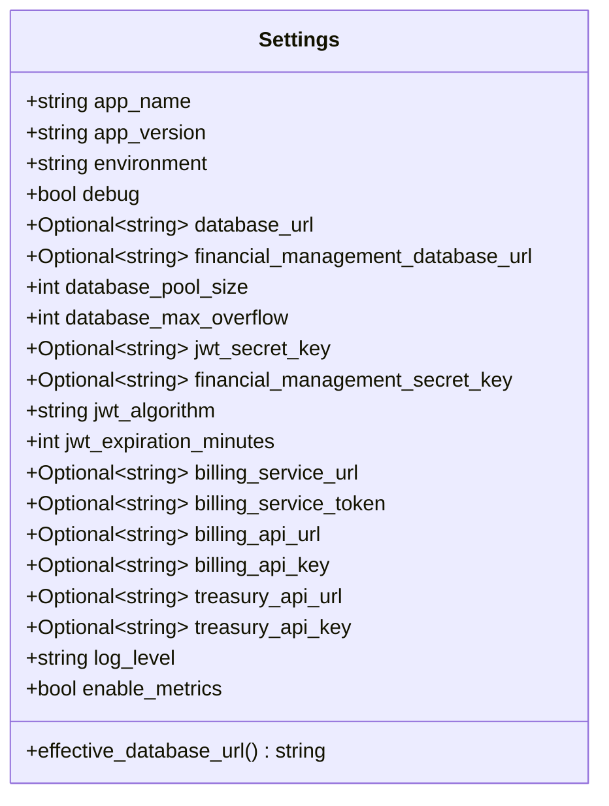

**Diagram sources**
- [app/core/config.py](file://app/core/config.py#L1-L74)

**Section sources**
- [app/core/config.py](file://app/core/config.py#L1-L74)

### Database Connection Pooling and Dependency Injection
- Engine creation:
  - Uses effective_database_url from settings.
  - Applies pool_size and max_overflow; enables echo in debug mode.
- Session factory:
  - AsyncSessionLocal configured with expire_on_commit=False and explicit session controls.
- Dependency:
  - get_db_session yields a scoped AsyncSession and ensures closure.

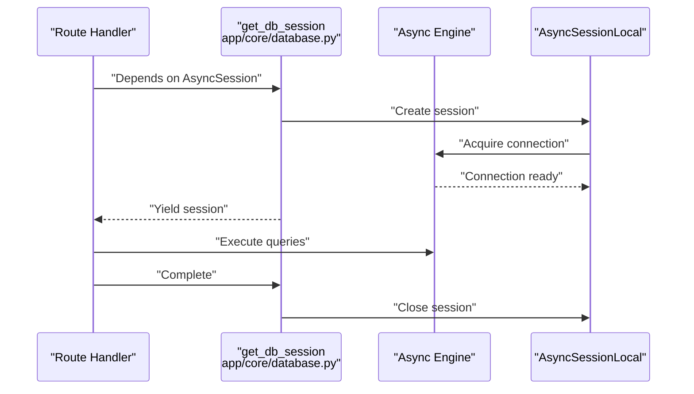

**Diagram sources**
- [app/core/database.py](file://app/core/database.py#L1-L113)

**Section sources**
- [app/core/database.py](file://app/core/database.py#L1-L113)

### Logging Setup
- Attempts to configure loguru with stdout formatting and optional rotating file logs in production.
- Falls back to stdlib logging if loguru is unavailable.
- Logger is globally available for use across modules.

**Section sources**
- [app/core/logging.py](file://app/core/logging.py#L1-L34)

### Exception Handling
- Custom exception hierarchy for business and operational errors.
- Intended to be caught by FastAPI exception handlers to produce standardized responses.

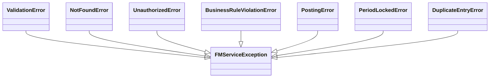

**Diagram sources**
- [app/core/exceptions.py](file://app/core/exceptions.py#L1-L43)

**Section sources**
- [app/core/exceptions.py](file://app/core/exceptions.py#L1-L43)

### Security Middleware and RBAC
- JWT validation:
  - Validates against a centralized auth service or locally using jwt_secret_key.
  - Handles HTTP and JWT errors with appropriate HTTP exceptions.
- Access verification:
  - Ensures the token grants access to the financial_management service.
- Current user extraction:
  - Builds a user profile from token claims for downstream use.
- RBAC permission matrix:
  - Defines role-to-module-action mappings.
  - Provides helpers to check approval/post capabilities per object type.

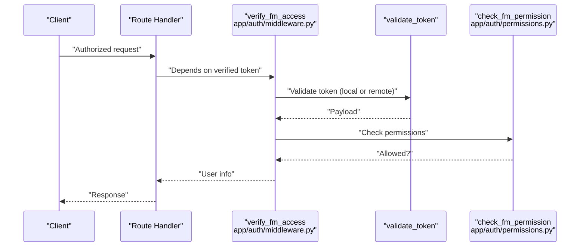

**Diagram sources**
- [app/auth/middleware.py](file://app/auth/middleware.py#L1-L140)
- [app/auth/permissions.py](file://app/auth/permissions.py#L1-L127)

**Section sources**
- [app/auth/middleware.py](file://app/auth/middleware.py#L1-L140)
- [app/auth/permissions.py](file://app/auth/permissions.py#L1-L127)

### Idempotency Infrastructure
- Canonical serialization:
  - Normalizes request/response data to stable JSON for hashing.
- Endpoint key normalization:
  - Produces stable endpoint identifiers by replacing path segments matching UUIDs/digits with placeholders.
- Idempotency key handling:
  - Enforces uniqueness and hash consistency.
  - Supports retry with explicit headers for failed operations when safe.
  - Tracks state transitions (PENDING, COMPLETED, FAILED) with lock TTLs per endpoint.
- Response storage:
  - Stores canonicalized responses up to a maximum size, truncating oversized responses.

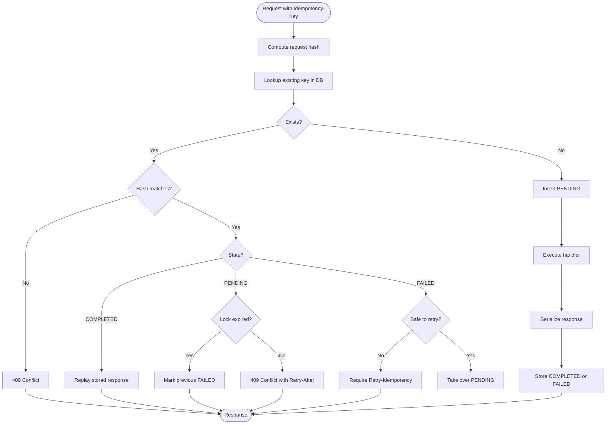

**Diagram sources**
- [app/core/idempotency.py](file://app/core/idempotency.py#L1-L482)

**Section sources**
- [app/core/idempotency.py](file://app/core/idempotency.py#L1-L482)

### Row Version Conflict Checking
- Utility to compare provided row version with current database version.
- Raises a 409 Conflict when mismatched, prompting clients to refresh and retry.

**Section sources**
- [app/core/row_version.py](file://app/core/row_version.py#L1-L31)

### Shared Base Model and Repository
- BaseModel:
  - Abstract base with UUID primary key and audit fields (created_at, updated_at, created_by, updated_by).
- BaseRepository:
  - Generic CRUD operations (get_by_id, create, update, delete, list_all) using AsyncSession.

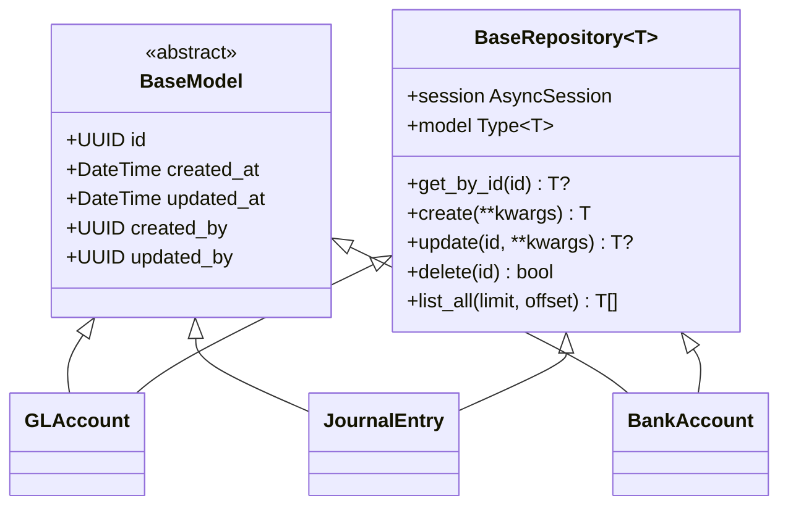

**Diagram sources**
- [app/shared/models/base_model.py](file://app/shared/models/base_model.py#L1-L18)
- [app/shared/repositories/base_repository.py](file://app/shared/repositories/base_repository.py#L1-L54)

**Section sources**
- [app/shared/models/base_model.py](file://app/shared/models/base_model.py#L1-L18)
- [app/shared/repositories/base_repository.py](file://app/shared/repositories/base_repository.py#L1-L54)

## Dependency Analysis
- Coupling:
  - app/main.py depends on core modules for configuration, logging, middleware, and router composition.
  - Domain routes depend on repositories and services within their modules.
  - Shared base classes reduce duplication and enforce consistency.
- Cohesion:
  - Core modules encapsulate cross-cutting concerns (config, db, logging, auth, idempotency, row version).
  - Modules isolate domain logic and expose clean route APIs.
- External dependencies:
  - FastAPI, Starlette, SQLAlchemy Async, Pydantic Settings, loguru/stdlib logging, python-jose/httpx.

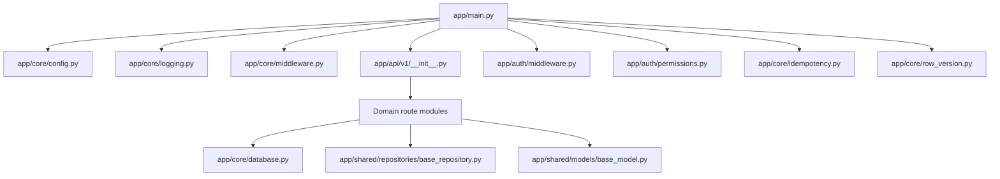

**Diagram sources**
- [app/main.py](file://app/main.py#L1-L54)
- [app/api/v1/__init__.py](file://app/api/v1/__init__.py#L1-L72)
- [app/core/config.py](file://app/core/config.py#L1-L74)
- [app/core/database.py](file://app/core/database.py#L1-L113)
- [app/core/logging.py](file://app/core/logging.py#L1-L34)
- [app/core/middleware.py](file://app/core/middleware.py#L1-L35)
- [app/auth/middleware.py](file://app/auth/middleware.py#L1-L140)
- [app/auth/permissions.py](file://app/auth/permissions.py#L1-L127)
- [app/core/idempotency.py](file://app/core/idempotency.py#L1-L482)
- [app/core/row_version.py](file://app/core/row_version.py#L1-L31)
- [app/shared/models/base_model.py](file://app/shared/models/base_model.py#L1-L18)
- [app/shared/repositories/base_repository.py](file://app/shared/repositories/base_repository.py#L1-L54)

**Section sources**
- [app/main.py](file://app/main.py#L1-L54)
- [app/api/v1/__init__.py](file://app/api/v1/__init__.py#L1-L72)

## Performance Considerations
- Database pooling:
  - Tune database_pool_size and database_max_overflow according to workload and database capacity.
  - Monitor connection usage and latency; consider reducing pool size in constrained environments.
- Logging overhead:
  - Disable echo in production; prefer rotating file logs only when necessary.
- Idempotency storage:
  - Responses are capped to prevent excessive storage; ensure clients handle truncated responses gracefully.
- Middleware:
  - Keep middleware minimal; avoid heavy processing in global middleware to preserve throughput.

## Troubleshooting Guide
- Health check:
  - Verify GET /health responds with expected service metadata.
- Database connectivity:
  - Confirm effective_database_url resolves correctly and credentials are valid.
  - Check pool configuration and connection limits.
- JWT and access:
  - Ensure jwt_secret_key is set or auth service is reachable.
  - Validate that tokens include financial_management in services claim.
- Idempotency:
  - For 409 conflicts due to key/hash mismatch, ensure the same Idempotency-Key and request body are used.
  - For 409 during in-progress requests, honor Retry-After and wait for completion.
- Row version conflicts:
  - When receiving 409 conflicts, refresh data and resend with the latest row_version.

**Section sources**
- [app/main.py](file://app/main.py#L33-L40)
- [app/core/config.py](file://app/core/config.py#L23-L35)
- [app/auth/middleware.py](file://app/auth/middleware.py#L30-L56)
- [app/core/idempotency.py](file://app/core/idempotency.py#L154-L204)
- [app/core/row_version.py](file://app/core/row_version.py#L24-L30)

## Conclusion
The TrueVow Financial Management backend is structured around a clear separation of concerns, robust configuration, secure authentication, and resilient infrastructure for idempotency and concurrency control. The modular design supports incremental feature delivery while preserving consistency through shared base models and repositories. Extending the backend involves adding domain routes under app/modules and integrating with the established dependency injection and security patterns.

## Appendices

### Extending the Backend with New Modules
- Create a new domain folder under app/modules/<domain>/ with api/routes, models, repositories, schemas, and services subfolders.
- Define models inheriting from BaseModel and register them in app/core/database.py imports so Alembic metadata is aware of them.
- Implement repositories using BaseRepository for consistent CRUD operations.
- Add route handlers that depend on AsyncSession and any domain services.
- Register new routes in app/api/v1/__init__.py under the v1 router.
- Integrate security:
  - Protect routes with verify_fm_access and check_fm_permission where appropriate.
  - Define permissions in app/auth/permissions.py if needed.
- Enable idempotency for state-changing endpoints using the idempotency infrastructure.
- Ensure logging uses the shared logger and include correlation IDs for traceability.

[No sources needed since this section provides general guidance]