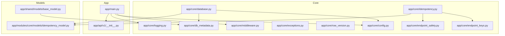
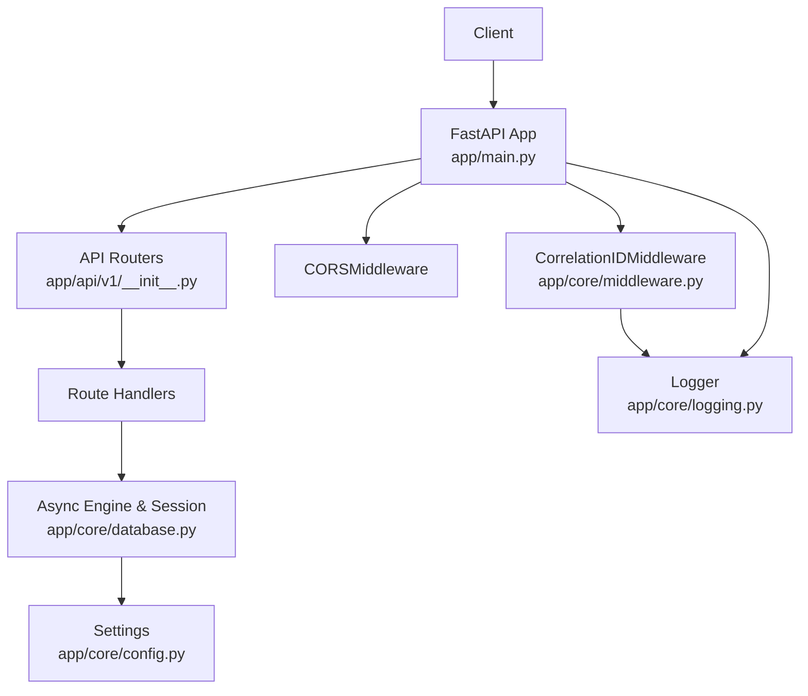
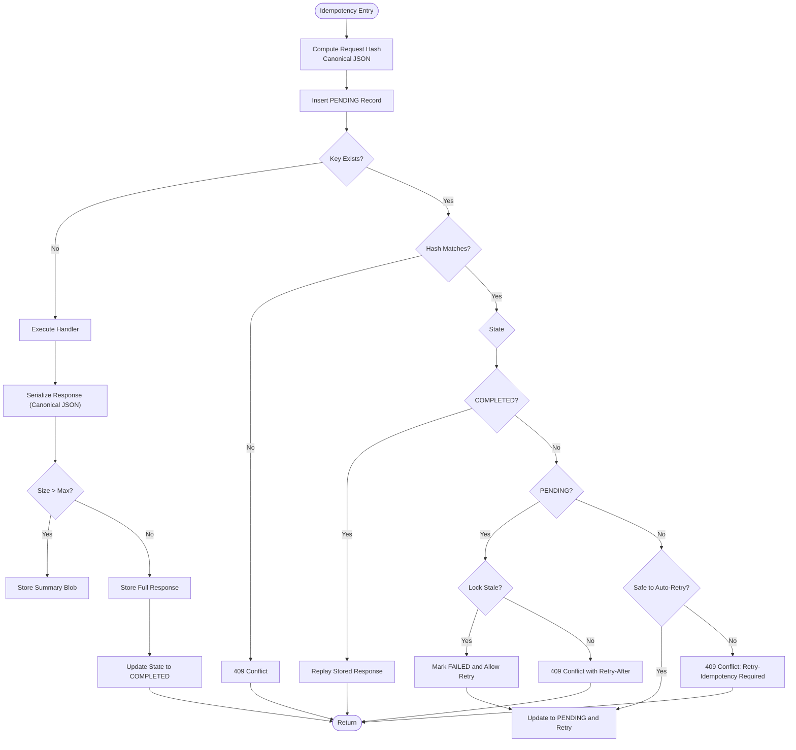
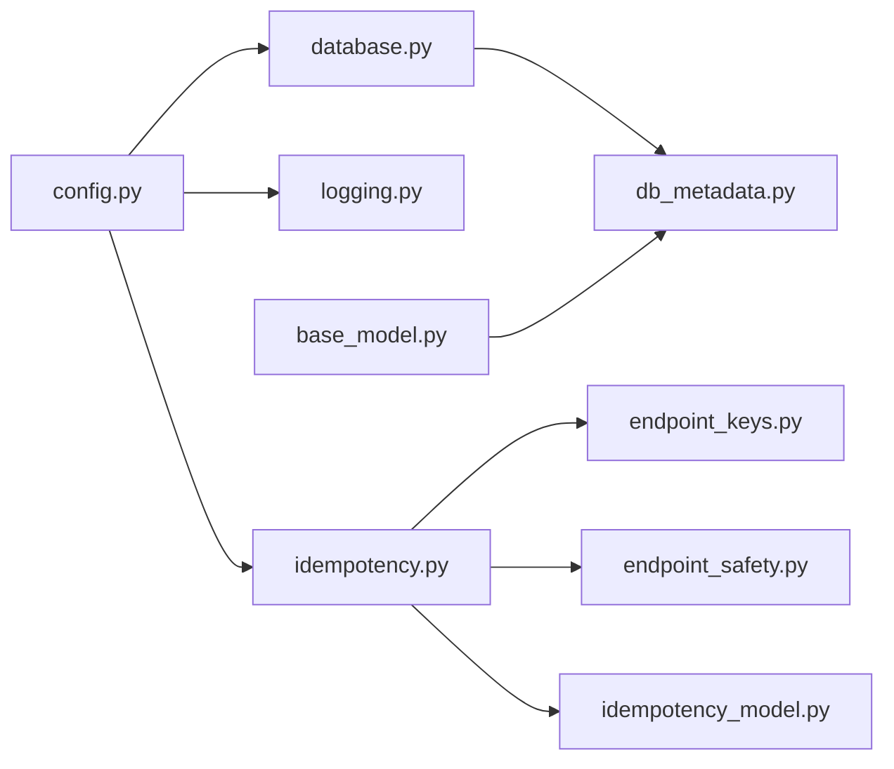

# Core Infrastructure

<cite>
**Referenced Files in This Document**
- [app/main.py](file://app/main.py)
- [app/core/config.py](file://app/core/config.py)
- [app/core/database.py](file://app/core/database.py)
- [app/core/db_metadata.py](file://app/core/db_metadata.py)
- [app/core/logging.py](file://app/core/logging.py)
- [app/core/middleware.py](file://app/core/middleware.py)
- [app/core/exceptions.py](file://app/core/exceptions.py)
- [app/core/idempotency.py](file://app/core/idempotency.py)
- [app/core/row_version.py](file://app/core/row_version.py)
- [app/core/endpoint_safety.py](file://app/core/endpoint_safety.py)
- [app/core/endpoint_keys.py](file://app/core/endpoint_keys.py)
- [app/modules/core/models/idempotency_model.py](file://app/modules/core/models/idempotency_model.py)
- [app/shared/models/base_model.py](file://app/shared/models/base_model.py)
</cite>

## Table of Contents
1. [Introduction](#introduction)
2. [Project Structure](#project-structure)
3. [Core Components](#core-components)
4. [Architecture Overview](#architecture-overview)
5. [Detailed Component Analysis](#detailed-component-analysis)
6. [Dependency Analysis](#dependency-analysis)
7. [Performance Considerations](#performance-considerations)
8. [Troubleshooting Guide](#troubleshooting-guide)
9. [Conclusion](#conclusion)
10. [Appendices](#appendices)

## Introduction
This document explains the core backend infrastructure that powers the TrueVow Financial Management Service. It focuses on configuration management, database connectivity and sessions, logging and observability, middleware stack, exception handling, idempotency for safe API reprocessing, and optimistic concurrency control via row version checks. Practical extension guidance is included to help maintain system reliability as the platform evolves.

## Project Structure
The core infrastructure lives under app/core and integrates with module-specific models and services. The FastAPI application registers middleware and includes versioned routers, while configuration, database, logging, and idempotency utilities are centralized for reuse across modules.

**Diagram sources**
- [app/main.py](file://app/main.py#L1-L54)
- [app/core/config.py](file://app/core/config.py#L1-L74)
- [app/core/database.py](file://app/core/database.py#L1-L113)
- [app/core/db_metadata.py](file://app/core/db_metadata.py#L1-L10)
- [app/core/logging.py](file://app/core/logging.py#L1-L34)
- [app/core/middleware.py](file://app/core/middleware.py#L1-L35)
- [app/core/idempotency.py](file://app/core/idempotency.py#L1-L482)
- [app/core/endpoint_keys.py](file://app/core/endpoint_keys.py#L1-L43)
- [app/core/endpoint_safety.py](file://app/core/endpoint_safety.py#L1-L118)
- [app/modules/core/models/idempotency_model.py](file://app/modules/core/models/idempotency_model.py#L1-L54)
- [app/shared/models/base_model.py](file://app/shared/models/base_model.py#L1-L18)

**Section sources**
- [app/main.py](file://app/main.py#L1-L54)
- [app/api/v1/__init__.py](file://app/api/v1/__init__.py#L1-L72)

## Core Components
- Configuration management: Centralized settings with environment variable loading, validation, and environment-specific behavior.
- Database connection pooling and session management: Async engine and session factory with explicit pool sizing and echo controls.
- Logging configuration: Structured logging with loguru when available and fallback to stdlib logging.
- Middleware stack: Correlation ID tracking and request/response logging.
- Exception handling: Domain-specific exceptions for clear error semantics.
- Idempotency: Canonical request hashing, deterministic endpoint keys, and stateful persistence for safe retries.
- Row version: Optimistic concurrency control via HTTP 409 conflict detection.

**Section sources**
- [app/core/config.py](file://app/core/config.py#L1-L74)
- [app/core/database.py](file://app/core/database.py#L1-L113)
- [app/core/logging.py](file://app/core/logging.py#L1-L34)
- [app/core/middleware.py](file://app/core/middleware.py#L1-L35)
- [app/core/exceptions.py](file://app/core/exceptions.py#L1-L43)
- [app/core/idempotency.py](file://app/core/idempotency.py#L1-L482)
- [app/core/row_version.py](file://app/core/row_version.py#L1-L31)

## Architecture Overview
The application initializes FastAPI, registers middleware, and wires routers. Configuration drives database URLs, JWT secrets, and logging levels. Database sessions are injected into handlers. Logging is unified and supports correlation IDs. Idempotency ensures safe reprocessing with deterministic hashing and stateful storage.

**Diagram sources**
- [app/main.py](file://app/main.py#L1-L54)
- [app/core/middleware.py](file://app/core/middleware.py#L1-L35)
- [app/core/database.py](file://app/core/database.py#L1-L113)
- [app/core/config.py](file://app/core/config.py#L1-L74)
- [app/core/logging.py](file://app/core/logging.py#L1-L34)

## Detailed Component Analysis

### Configuration Management
- Environment variables and precedence: Loads from .env and .env.local, case-insensitive, ignores extras. Provides defaults for app metadata and debug mode.
- Database URL selection: Prefers DATABASE_URL; falls back to FINANCIAL_MANAGEMENT_DATABASE_URL with automatic protocol conversion to asyncpg when needed.
- JWT secret resolution: Requires a secret; in development, a default is used if none is provided.
- Security and integrations: Supports billing and treasury service URLs and tokens.
- Observability: Controls log level and metrics enablement.

Practical extension tips:
- Add new environment variables via the Settings model and ensure validators enforce required values.
- Introduce environment-specific pools or timeouts by adding new fields and wiring them into the engine creation.

**Section sources**
- [app/core/config.py](file://app/core/config.py#L1-L74)

### Database Connection Pooling and Session Management
- Engine creation: Uses the effective database URL from settings, applies pool_size and max_overflow, and enables echo in debug mode.
- Session factory: AsyncSessionLocal configured with expire_on_commit disabled and explicit autocommit/autoflush controls.
- Session dependency: get_db_session yields a session per request and ensures closure in a finally block.
- Model imports: Ensures SQLAlchemy metadata is populated at runtime for Alembic and ORM usage.

Operational guidance:
- Tune pool_size and max_overflow based on workload and database capacity.
- Keep debug echo off in production to avoid verbose logs.

**Section sources**
- [app/core/database.py](file://app/core/database.py#L1-L113)
- [app/core/db_metadata.py](file://app/core/db_metadata.py#L1-L10)

### Logging Configuration and Structured Logging Patterns
- Priority: Attempts to use loguru; if unavailable, falls back to stdlib logging.
- Formatting: Structured console format with timestamp, level, caller, and message.
- Production: Rotating file logs with configurable retention and dynamic level from settings.
- Integration: Middleware logs requests with correlation_id in extra fields.

Best practices:
- Use logger.bind(extra=...) to propagate correlation_id and other context.
- Avoid printing sensitive data; rely on structured fields for observability.

**Section sources**
- [app/core/logging.py](file://app/core/logging.py#L1-L34)
- [app/core/middleware.py](file://app/core/middleware.py#L1-L35)

### Middleware Stack: Correlation ID Tracking
- Adds X-Correlation-ID from request headers or generates a fresh UUID.
- Stores correlation_id in request.state for downstream access.
- Logs request metadata (method, path) with correlation_id.
- Propagates X-Correlation-ID in response headers.

Integration points:
- Route handlers can read request.state.correlation_id for audit trails.
- Combine with structured logging to correlate traces across services.

**Section sources**
- [app/core/middleware.py](file://app/core/middleware.py#L1-L35)

### Exception Handling Strategies
- Domain-specific exceptions: Base FMServiceException with specialized subclasses for validation, not found, unauthorized, business rule violations, posting errors, period locked, and duplicate entries.
- Consistent error signaling: Handlers can raise these exceptions; integration with FastAPI will translate them to appropriate HTTP responses.

Guidance:
- Raise domain exceptions early to keep handlers focused on orchestration.
- Add custom exception mappers if transitioning to a global exception handler.

**Section sources**
- [app/core/exceptions.py](file://app/core/exceptions.py#L1-L43)

### Idempotency Patterns for Safe API Reprocessing
- Canonical request hashing: Normalizes request bodies to a stable JSON representation, handling decimals, datetimes, UUIDs, Pydantic models, and nested structures.
- Endpoint key normalization: Converts dynamic paths to constants (e.g., replacing UUIDs and numeric IDs with placeholders) to ensure stable endpoint identification.
- Deterministic idempotency keys: Enforced via Idempotency-Key header; attempting reuse with different payloads raises a conflict.
- State machine: PENDING → COMPLETED or FAILED; supports stale lock detection and TTL-based takeover.
- Response storage: Responses are serialized and capped to prevent excessive storage; metadata can capture correlation data (e.g., batch cursors).
- Retry safety: Endpoint safety map defines which endpoints are safe to auto-retry after failures; others require explicit retry headers.

**Diagram sources**
- [app/core/idempotency.py](file://app/core/idempotency.py#L1-L482)
- [app/core/endpoint_safety.py](file://app/core/endpoint_safety.py#L1-L118)
- [app/core/endpoint_keys.py](file://app/core/endpoint_keys.py#L1-L43)
- [app/modules/core/models/idempotency_model.py](file://app/modules/core/models/idempotency_model.py#L1-L54)

**Section sources**
- [app/core/idempotency.py](file://app/core/idempotency.py#L1-L482)
- [app/core/endpoint_safety.py](file://app/core/endpoint_safety.py#L1-L118)
- [app/core/endpoint_keys.py](file://app/core/endpoint_keys.py#L1-L43)
- [app/modules/core/models/idempotency_model.py](file://app/modules/core/models/idempotency_model.py#L1-L54)

### Row Version Implementation for Optimistic Concurrency Control
- Validates provided row version against current database version.
- Raises HTTP 409 Conflict when mismatch occurs, instructing clients to refresh and retry.

Usage pattern:
- Clients include the current row_version in update requests.
- Handlers call the checker before applying changes; on mismatch, the client retries with fresher data.

**Section sources**
- [app/core/row_version.py](file://app/core/row_version.py#L1-L31)

### Practical Examples of Extending Infrastructure Components
- Adding a new environment variable:
  - Extend the Settings model with a new field and validator.
  - Reference the setting in database engine creation or logging initialization.
  - Ensure .env/.env.local contains the value or raise a clear error in validation.
  - Reference: [app/core/config.py](file://app/core/config.py#L1-L74), [app/core/database.py](file://app/core/database.py#L88-L94)

- Implementing a new idempotent endpoint:
  - Define a constant in endpoint_keys.py.
  - Add safety and TTL mappings in endpoint_safety.py.
  - In the route handler, require an Idempotency-Key header and wrap execution with apply_idempotency.
  - Reference: [app/core/endpoint_keys.py](file://app/core/endpoint_keys.py#L1-L43), [app/core/endpoint_safety.py](file://app/core/endpoint_safety.py#L1-L118), [app/core/idempotency.py](file://app/core/idempotency.py#L219-L251)

- Enabling structured logging for a new module:
  - Import the logger from app/core/logging.py.
  - Bind correlation_id and other context; avoid raw prints.
  - Reference: [app/core/logging.py](file://app/core/logging.py#L1-L34), [app/core/middleware.py](file://app/core/middleware.py#L1-L35)

- Integrating row version checks:
  - Fetch current row_version from the database before updates.
  - Call check_row_version with provided version from the request.
  - Reference: [app/core/row_version.py](file://app/core/row_version.py#L1-L31)

## Dependency Analysis
The core modules are loosely coupled and driven by configuration. Database depends on settings; idempotency depends on endpoint keys and safety policies; models depend on db_metadata for migrations.

**Diagram sources**
- [app/core/config.py](file://app/core/config.py#L1-L74)
- [app/core/database.py](file://app/core/database.py#L1-L113)
- [app/core/db_metadata.py](file://app/core/db_metadata.py#L1-L10)
- [app/core/logging.py](file://app/core/logging.py#L1-L34)
- [app/core/idempotency.py](file://app/core/idempotency.py#L1-L482)
- [app/core/endpoint_keys.py](file://app/core/endpoint_keys.py#L1-L43)
- [app/core/endpoint_safety.py](file://app/core/endpoint_safety.py#L1-L118)
- [app/modules/core/models/idempotency_model.py](file://app/modules/core/models/idempotency_model.py#L1-L54)
- [app/shared/models/base_model.py](file://app/shared/models/base_model.py#L1-L18)

**Section sources**
- [app/core/config.py](file://app/core/config.py#L1-L74)
- [app/core/database.py](file://app/core/database.py#L1-L113)
- [app/core/idempotency.py](file://app/core/idempotency.py#L1-L482)

## Performance Considerations
- Database pool sizing: Align pool_size and max_overflow with expected concurrency and database limits. Monitor connection usage and adjust accordingly.
- Logging overhead: Disable debug echo and reduce log verbosity in production to minimize I/O.
- Idempotency response storage: Responses exceeding the cap are summarized to prevent table bloat; ensure handlers produce concise responses when possible.
- Middleware latency: Keep middleware minimal; correlation ID generation is negligible but avoid heavy processing in middleware.

## Troubleshooting Guide
- Missing JWT secret:
  - Symptom: Validation error during settings initialization.
  - Resolution: Set JWT_SECRET_KEY or FINANCIAL_MANAGEMENT_SECRET_KEY in .env or .env.local; in development, the default is used only if neither is provided.
  - Reference: [app/core/config.py](file://app/core/config.py#L41-L48)

- Database URL misconfiguration:
  - Symptom: ValueError indicating missing database URL.
  - Resolution: Provide DATABASE_URL or FINANCIAL_MANAGEMENT_DATABASE_URL; ensure proper asyncpg protocol if using the latter.
  - Reference: [app/core/config.py](file://app/core/config.py#L23-L35)

- Idempotency conflicts:
  - Symptom: 409 Conflict when reusing a key with different payload.
  - Resolution: Ensure Idempotency-Key is stable and request body is canonicalized; verify endpoint_key normalization.
  - Reference: [app/core/idempotency.py](file://app/core/idempotency.py#L154-L166)

- Stale PENDING lock:
  - Symptom: 409 Conflict with retry guidance after extended processing.
  - Resolution: Allow stale lock takeover or increase TTL for long-running endpoints.
  - Reference: [app/core/idempotency.py](file://app/core/idempotency.py#L312-L355), [app/core/endpoint_safety.py](file://app/core/endpoint_safety.py#L105-L117)

- Row version mismatch:
  - Symptom: 409 Conflict indicating stale data.
  - Resolution: Refresh resource, include current row_version, and retry.
  - Reference: [app/core/row_version.py](file://app/core/row_version.py#L24-L30)

## Conclusion
The core infrastructure provides a robust foundation for reliability: validated configuration, efficient async database sessions, structured logging, middleware-driven correlation, domain-specific exceptions, deterministic idempotency, and optimistic concurrency control. By following the extension patterns outlined here, teams can safely introduce new endpoints, integrations, and operational capabilities while preserving system integrity.

## Appendices
- Health check endpoint: Exposed at GET /health with service metadata.
- Startup/shutdown hooks: Log environment and lifecycle events.

**Section sources**
- [app/main.py](file://app/main.py#L33-L54)