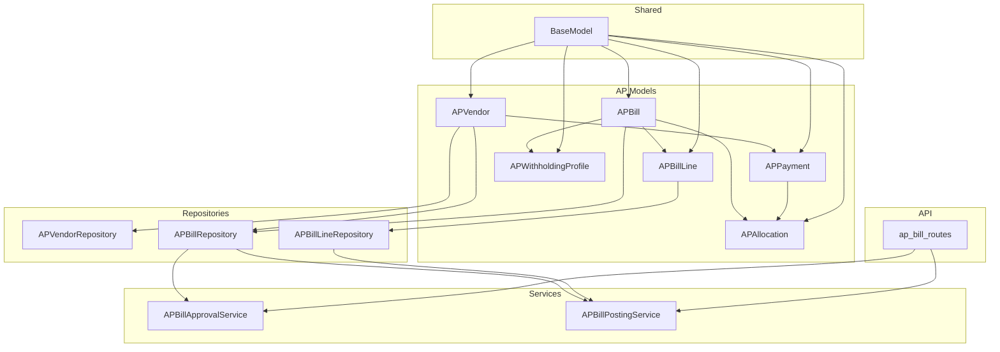
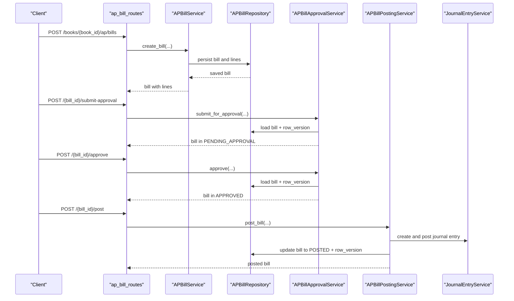
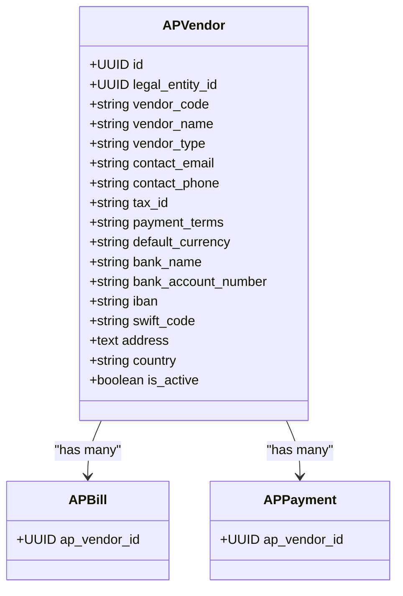
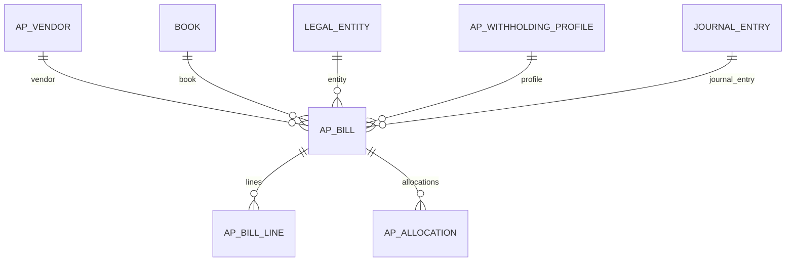
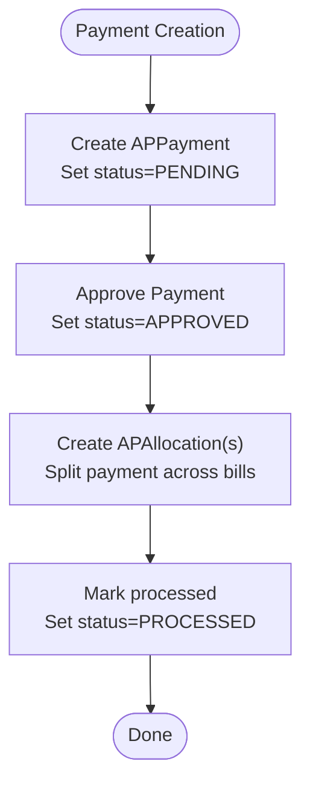
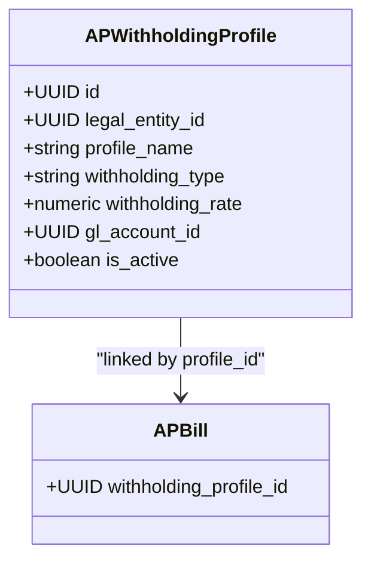
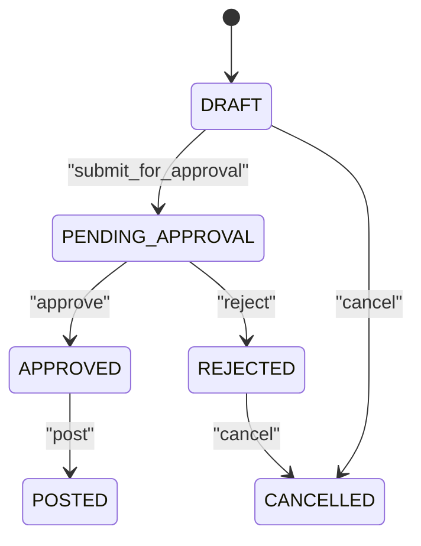
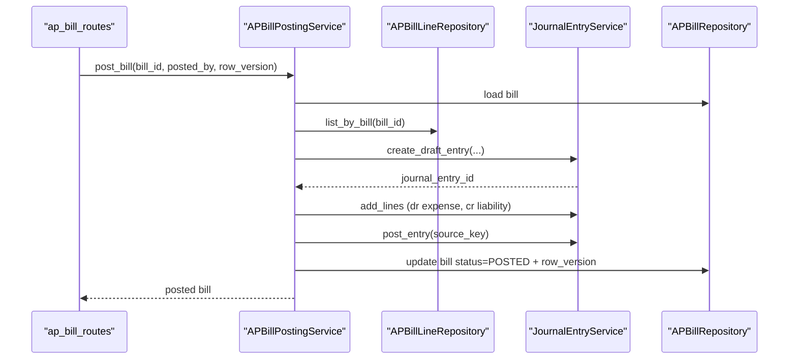
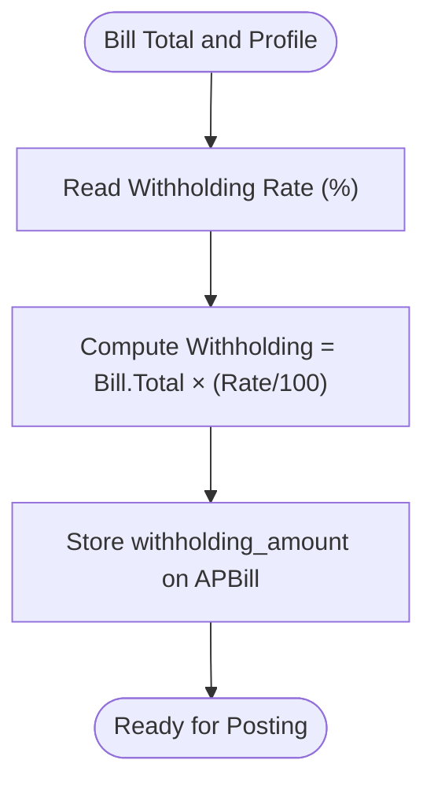
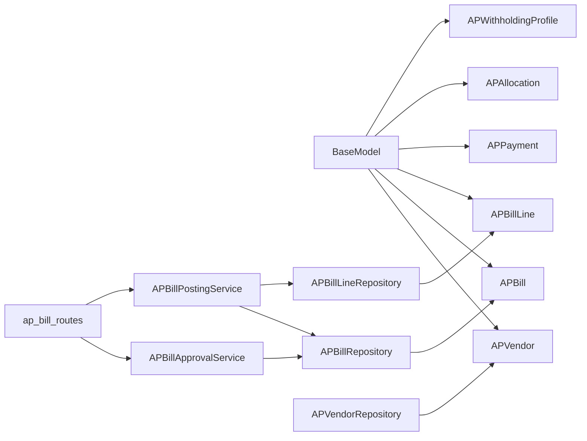

# Accounts Payable Models

<cite>
**Referenced Files in This Document**
- [ap_vendor_model.py](file://app/modules/ap/models/ap_vendor_model.py)
- [ap_bill_model.py](file://app/modules/ap/models/ap_bill_model.py)
- [ap_payment_model.py](file://app/modules/ap/models/ap_payment_model.py)
- [ap_withholding_model.py](file://app/modules/ap/models/ap_withholding_model.py)
- [ap_bill_schemas.py](file://app/modules/ap/schemas/ap_bill_schemas.py)
- [ap_bill_approval_service.py](file://app/modules/ap/services/ap_bill_approval_service.py)
- [ap_bill_posting_service.py](file://app/modules/ap/services/ap_bill_posting_service.py)
- [ap_bill_routes.py](file://app/modules/ap/api/routes/ap_bill_routes.py)
- [ap_bill_repository.py](file://app/modules/ap/repositories/ap_bill_repository.py)
- [ap_bill_line_repository.py](file://app/modules/ap/repositories/ap_bill_line_repository.py)
- [ap_vendor_repository.py](file://app/modules/ap/repositories/ap_vendor_repository.py)
- [base_model.py](file://app/shared/models/base_model.py)
- [fm_schema.sql](file://database/fm_schema.sql)
</cite>

## Table of Contents
1. [Introduction](#introduction)
2. [Project Structure](#project-structure)
3. [Core Components](#core-components)
4. [Architecture Overview](#architecture-overview)
5. [Detailed Component Analysis](#detailed-component-analysis)
6. [Dependency Analysis](#dependency-analysis)
7. [Performance Considerations](#performance-considerations)
8. [Troubleshooting Guide](#troubleshooting-guide)
9. [Conclusion](#conclusion)
10. [Appendices](#appendices)

## Introduction
This document provides comprehensive data model documentation for the Accounts Payable (AP) domain. It covers vendor management, bill processing, payment execution, and withholding tax models. It details entity relationships, field definitions, validation rules, business constraints, approval workflows, payment scheduling, tax reporting, and audit trail requirements. Examples of bill creation, payment processing, and tax withholding calculations are included to guide implementation and integration.

## Project Structure
The AP module is organized by concerns: models define persistent entities and relationships; repositories encapsulate data access; services orchestrate business logic; schemas validate and serialize API requests/responses; and routes expose endpoints. Shared base models provide common fields and metadata.

**Diagram sources**
- [ap_vendor_model.py](file://app/modules/ap/models/ap_vendor_model.py#L8-L40)
- [ap_bill_model.py](file://app/modules/ap/models/ap_bill_model.py#L20-L102)
- [ap_payment_model.py](file://app/modules/ap/models/ap_payment_model.py#L19-L80)
- [ap_withholding_model.py](file://app/modules/ap/models/ap_withholding_model.py#L9-L32)
- [ap_bill_repository.py](file://app/modules/ap/repositories/ap_bill_repository.py#L11-L38)
- [ap_bill_line_repository.py](file://app/modules/ap/repositories/ap_bill_line_repository.py#L9-L37)
- [ap_vendor_repository.py](file://app/modules/ap/repositories/ap_vendor_repository.py#L9-L46)
- [ap_bill_approval_service.py](file://app/modules/ap/services/ap_bill_approval_service.py#L26-L229)
- [ap_bill_posting_service.py](file://app/modules/ap/services/ap_bill_posting_service.py#L16-L127)
- [ap_bill_routes.py](file://app/modules/ap/api/routes/ap_bill_routes.py#L1-L262)
- [base_model.py](file://app/shared/models/base_model.py#L9-L18)

**Section sources**
- [ap_bill_routes.py](file://app/modules/ap/api/routes/ap_bill_routes.py#L1-L262)
- [ap_bill_approval_service.py](file://app/modules/ap/services/ap_bill_approval_service.py#L1-L229)
- [ap_bill_posting_service.py](file://app/modules/ap/services/ap_bill_posting_service.py#L1-L127)
- [ap_bill_model.py](file://app/modules/ap/models/ap_bill_model.py#L1-L102)
- [ap_payment_model.py](file://app/modules/ap/models/ap_payment_model.py#L1-L80)
- [ap_withholding_model.py](file://app/modules/ap/models/ap_withholding_model.py#L1-L32)
- [ap_vendor_model.py](file://app/modules/ap/models/ap_vendor_model.py#L1-L40)
- [base_model.py](file://app/shared/models/base_model.py#L1-L18)

## Core Components
- APVendor: Represents vendors, consultants, and affiliates with contact, banking, and tax identifiers; maintains active status and links to bills and payments.
- APBill: Represents vendor invoices with lifecycle status, amounts, due dates, and optional withholding; links to vendor, lines, allocations, and journal entry.
- APBillLine: Line items with quantities, unit prices, amounts, and optional tax codes; constrained by bill and line number uniqueness.
- APPayment: Outgoing payments to vendors with method, reference, and bank linkage; tracks status and links to allocations and journal entry.
- APAllocation: Allocation of payments to specific bills; ensures unique payment-to-bill pairing.
- APWithholdingProfile: Defines tax/vat withholding profiles per legal entity with rates and GL mapping; linked to bills.

Validation and constraints:
- Unique keys: vendor code, bill number, payment number; unique bill line number per bill.
- Enumerations: BillStatus, APPaymentStatus.
- Monetary fields use precise numeric types with two decimal places.
- Indexes on foreign keys and frequently filtered fields (vendor, book, bill date, status).
- Row version for optimistic concurrency control on bills.

**Section sources**
- [ap_vendor_model.py](file://app/modules/ap/models/ap_vendor_model.py#L8-L40)
- [ap_bill_model.py](file://app/modules/ap/models/ap_bill_model.py#L20-L102)
- [ap_payment_model.py](file://app/modules/ap/models/ap_payment_model.py#L19-L80)
- [ap_withholding_model.py](file://app/modules/ap/models/ap_withholding_model.py#L9-L32)
- [ap_bill_schemas.py](file://app/modules/ap/schemas/ap_bill_schemas.py#L10-L114)
- [fm_schema.sql](file://database/fm_schema.sql#L1164-L1189)

## Architecture Overview
The AP subsystem integrates models, repositories, services, and routes to support vendor onboarding, bill capture, approval workflows, posting to the ledger, and payment execution with allocations.

**Diagram sources**
- [ap_bill_routes.py](file://app/modules/ap/api/routes/ap_bill_routes.py#L31-L262)
- [ap_bill_approval_service.py](file://app/modules/ap/services/ap_bill_approval_service.py#L34-L204)
- [ap_bill_posting_service.py](file://app/modules/ap/services/ap_bill_posting_service.py#L27-L112)
- [ap_bill_repository.py](file://app/modules/ap/repositories/ap_bill_repository.py#L11-L38)

## Detailed Component Analysis

### Vendor Management (APVendor)
- Purpose: Centralize vendor information, banking details, tax identifiers, and defaults.
- Key fields:
  - Identity: legal_entity_id, vendor_code (unique), vendor_name, vendor_type.
  - Contact: contact_email, contact_phone, address, country.
  - Terms: payment_terms, default_currency.
  - Banking: bank_name, bank_account_number, IBAN, SWIFT.
  - Lifecycle: is_active.
- Relationships:
  - One-to-many with APBill and APPayment via vendor.
  - Many-to-one to LegalEntity.
- Validation:
  - vendor_code and bill/payment numbers are unique.
  - default_currency is required.
  - is_active defaults to true.

**Diagram sources**
- [ap_vendor_model.py](file://app/modules/ap/models/ap_vendor_model.py#L8-L40)
- [ap_bill_model.py](file://app/modules/ap/models/ap_bill_model.py#L20-L73)
- [ap_payment_model.py](file://app/modules/ap/models/ap_payment_model.py#L19-L57)

**Section sources**
- [ap_vendor_model.py](file://app/modules/ap/models/ap_vendor_model.py#L8-L40)
- [ap_vendor_repository.py](file://app/modules/ap/repositories/ap_vendor_repository.py#L9-L46)

### Bill Processing (APBill, APBillLine)
- APBill:
  - Identity: legal_entity_id, book_id, ap_vendor_id, bill_number (unique), bill_date, due_date.
  - Amounts: total_amount, paid_amount, outstanding_amount, currency.
  - Status: BillStatus with lifecycle transitions.
  - Withholding: withholding_amount and optional profile link.
  - Workflow: submitted_by/submitted_at, approved_by/approved_at, rejected_by/rejected_at, decision_reason, posted_by/posted_at.
  - Concurrency: row_version.
  - Ledger: journal_entry_id.
- APBillLine:
  - Identity: ap_bill_id, line_number (unique per bill), gl_account_id.
  - Quantities: quantity, unit_price, line_amount, currency.
  - Optional tax_code.
- Constraints:
  - UniqueConstraint on (ap_bill_id, line_number).
  - Status transitions enforced by services.
  - Outstanding amount computed as total minus paid.

**Diagram sources**
- [ap_bill_model.py](file://app/modules/ap/models/ap_bill_model.py#L20-L102)
- [ap_withholding_model.py](file://app/modules/ap/models/ap_withholding_model.py#L9-L32)

**Section sources**
- [ap_bill_model.py](file://app/modules/ap/models/ap_bill_model.py#L20-L102)
- [ap_bill_schemas.py](file://app/modules/ap/schemas/ap_bill_schemas.py#L21-L114)
- [ap_bill_repository.py](file://app/modules/ap/repositories/ap_bill_repository.py#L11-L38)
- [ap_bill_line_repository.py](file://app/modules/ap/repositories/ap_bill_line_repository.py#L9-L37)

### Payment Execution (APPayment, APAllocation)
- APPayment:
  - Identity: legal_entity_id, book_id, ap_vendor_id, payment_number (unique), payment_date.
  - Amounts: payment_amount, currency, payment_method, payment_reference.
  - Bank linkage: bank_account_id, bank_transaction_id.
  - Status: APPaymentStatus with lifecycle.
  - Workflow: approved_by/approved_at, processed_at, description, journal_entry_id.
- APAllocation:
  - Links payment to bill with allocated_amount and currency.
  - UniqueConstraint on (ap_payment_id, ap_bill_id).

**Diagram sources**
- [ap_payment_model.py](file://app/modules/ap/models/ap_payment_model.py#L19-L80)

**Section sources**
- [ap_payment_model.py](file://app/modules/ap/models/ap_payment_model.py#L19-L80)
- [fm_schema.sql](file://database/fm_schema.sql#L1164-L1189)

### Withholding Tax Models (APWithholdingProfile)
- Purpose: Define tax/vat withholding profiles per legal entity with rates and GL mapping.
- Fields:
  - legal_entity_id, profile_name, withholding_type, withholding_rate (%), gl_account_id, is_active, description.
- Relationships:
  - Many-to-many with APBill via bill.withholding_profile_id.

**Diagram sources**
- [ap_withholding_model.py](file://app/modules/ap/models/ap_withholding_model.py#L9-L32)
- [ap_bill_model.py](file://app/modules/ap/models/ap_bill_model.py#L38-L41)

**Section sources**
- [ap_withholding_model.py](file://app/modules/ap/models/ap_withholding_model.py#L9-L32)

### Approval Workflows
- States: DRAFT → PENDING_APPROVAL → APPROVED → POSTED; REJECTED and CANCELLED supported.
- Transitions:
  - Submit for approval: DRAFT → PENDING_APPROVAL (or APPROVED if approval not required).
  - Approve: PENDING_APPROVAL → APPROVED (SoD validation).
  - Reject: PENDING_APPROVAL → REJECTED.
- Controls:
  - Row version enforcement for optimistic concurrency.
  - Audit logging for all actions.
  - Optional SoD override with reasons.

**Diagram sources**
- [ap_bill_model.py](file://app/modules/ap/models/ap_bill_model.py#L10-L18)
- [ap_bill_approval_service.py](file://app/modules/ap/services/ap_bill_approval_service.py#L34-L204)

**Section sources**
- [ap_bill_approval_service.py](file://app/modules/ap/services/ap_bill_approval_service.py#L1-L229)
- [ap_bill_schemas.py](file://app/modules/ap/schemas/ap_bill_schemas.py#L34-L58)

### Payment Scheduling and Posting
- Posting service posts bills to the ledger using mapped GL accounts for expense and liability.
- Journal entry creation and posting is handled by the general ledger service.
- Source key generation ensures idempotent posting.

**Diagram sources**
- [ap_bill_routes.py](file://app/modules/ap/api/routes/ap_bill_routes.py#L196-L262)
- [ap_bill_posting_service.py](file://app/modules/ap/services/ap_bill_posting_service.py#L27-L112)
- [ap_bill_line_repository.py](file://app/modules/ap/repositories/ap_bill_line_repository.py#L21-L27)

**Section sources**
- [ap_bill_posting_service.py](file://app/modules/ap/services/ap_bill_posting_service.py#L1-L127)

### Tax Calculation Logic
- Withholding amount on a bill can be calculated using the associated APWithholdingProfile’s rate and bill total.
- Example scenario:
  - Bill total: X
  - Withholding profile rate: r%
  - Withholding amount: X × (r / 100)
- The bill stores the computed withholding amount and references the profile.

**Diagram sources**
- [ap_bill_model.py](file://app/modules/ap/models/ap_bill_model.py#L38-L41)
- [ap_withholding_model.py](file://app/modules/ap/models/ap_withholding_model.py#L16)

**Section sources**
- [ap_withholding_model.py](file://app/modules/ap/models/ap_withholding_model.py#L9-L32)
- [ap_bill_model.py](file://app/modules/ap/models/ap_bill_model.py#L38-L41)

## Dependency Analysis
- Models inherit common fields from BaseModel (id, timestamps, created_by/updated_by).
- Repositories encapsulate CRUD operations and filtering.
- Services coordinate workflows, enforce business rules, and integrate with GL.
- Routes depend on services and schemas for request/response validation.

**Diagram sources**
- [base_model.py](file://app/shared/models/base_model.py#L9-L18)
- [ap_bill_repository.py](file://app/modules/ap/repositories/ap_bill_repository.py#L11-L38)
- [ap_bill_line_repository.py](file://app/modules/ap/repositories/ap_bill_line_repository.py#L9-L37)
- [ap_vendor_repository.py](file://app/modules/ap/repositories/ap_vendor_repository.py#L9-L46)
- [ap_bill_approval_service.py](file://app/modules/ap/services/ap_bill_approval_service.py#L26-L33)
- [ap_bill_posting_service.py](file://app/modules/ap/services/ap_bill_posting_service.py#L19-L26)
- [ap_bill_routes.py](file://app/modules/ap/api/routes/ap_bill_routes.py#L1-L28)

**Section sources**
- [base_model.py](file://app/shared/models/base_model.py#L1-L18)
- [ap_bill_repository.py](file://app/modules/ap/repositories/ap_bill_repository.py#L1-L38)
- [ap_bill_line_repository.py](file://app/modules/ap/repositories/ap_bill_line_repository.py#L1-L37)
- [ap_vendor_repository.py](file://app/modules/ap/repositories/ap_vendor_repository.py#L1-L46)
- [ap_bill_approval_service.py](file://app/modules/ap/services/ap_bill_approval_service.py#L1-L229)
- [ap_bill_posting_service.py](file://app/modules/ap/services/ap_bill_posting_service.py#L1-L127)
- [ap_bill_routes.py](file://app/modules/ap/api/routes/ap_bill_routes.py#L1-L262)

## Performance Considerations
- Indexes on foreign keys and frequently queried fields (vendor_id, book_id, bill_date, status) improve query performance.
- Unique constraints prevent duplicates and maintain referential integrity.
- Batch operations for line items reduce round-trips during bill creation.
- Idempotency keys for posting ensure safe retries without duplicate postings.

[No sources needed since this section provides general guidance]

## Troubleshooting Guide
Common issues and resolutions:
- Approval errors: Ensure bill is in the expected state before transition; check row_version mismatches; verify SoD constraints.
- Posting failures: Confirm bill has lines, is approved, and account mappings exist; verify period is open.
- Payment allocation conflicts: Ensure unique payment-to-bill allocations; reconcile totals against payment amount.
- Audit trail: All approval actions are logged; review logs for reasons and overrides.

**Section sources**
- [ap_bill_approval_service.py](file://app/modules/ap/services/ap_bill_approval_service.py#L21-L24)
- [ap_bill_posting_service.py](file://app/modules/ap/services/ap_bill_posting_service.py#L114-L127)
- [ap_bill_routes.py](file://app/modules/ap/api/routes/ap_bill_routes.py#L123-L262)

## Conclusion
The AP module provides a robust, extensible foundation for vendor management, bill processing, payment execution, and tax withholding. Its design emphasizes clear separation of concerns, strong validation, compliance controls (SoD, row version, audit logs), and integration with the general ledger for accurate financial reporting.

[No sources needed since this section summarizes without analyzing specific files]

## Appendices

### Field Definitions and Business Constraints
- APVendor
  - vendor_code: unique, indexed, required
  - default_currency: required
  - is_active: default true
- APBill
  - bill_number: unique, indexed, required
  - status: enum, lifecycle-managed
  - total_amount, paid_amount, outstanding_amount: numeric(15,2)
  - row_version: integer, optimistic locking
- APBillLine
  - line_number: unique per bill
  - line_amount: numeric(15,2)
- APPayment
  - payment_number: unique, indexed, required
  - status: enum, lifecycle-managed
- APAllocation
  - unique(ap_payment_id, ap_bill_id)
- APWithholdingProfile
  - withholding_rate: numeric(5,2) percentage
  - is_active: default true

**Section sources**
- [ap_vendor_model.py](file://app/modules/ap/models/ap_vendor_model.py#L12-L27)
- [ap_bill_model.py](file://app/modules/ap/models/ap_bill_model.py#L27-L52)
- [ap_bill_model.py](file://app/modules/ap/models/ap_bill_model.py#L79-L98)
- [ap_payment_model.py](file://app/modules/ap/models/ap_payment_model.py#L26-L49)
- [ap_withholding_model.py](file://app/modules/ap/models/ap_withholding_model.py#L14-L18)

### API Endpoints Overview
- Create bill: POST /books/{book_id}/ap/bills
- List bills: GET /books/{book_id}/ap/bills
- Get bill: GET /books/{book_id}/ap/bills/{bill_id}
- Submit for approval: POST /books/{book_id}/ap/bills/{bill_id}/submit-approval
- Approve: POST /books/{book_id}/ap/bills/{bill_id}/approve
- Reject: POST /books/{book_id}/ap/bills/{bill_id}/reject
- Post bill: POST /books/{book_id}/ap/bills/{bill_id}/post

**Section sources**
- [ap_bill_routes.py](file://app/modules/ap/api/routes/ap_bill_routes.py#L31-L262)