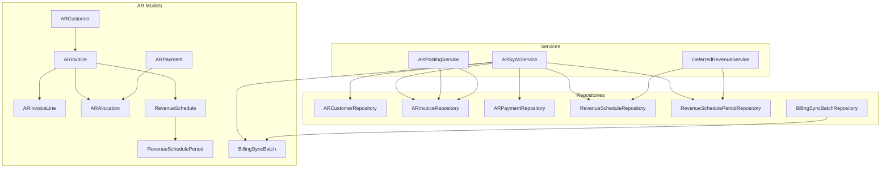
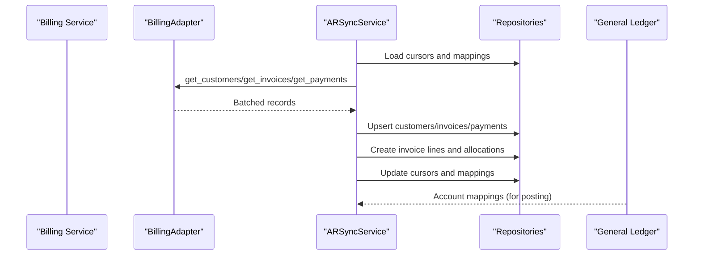
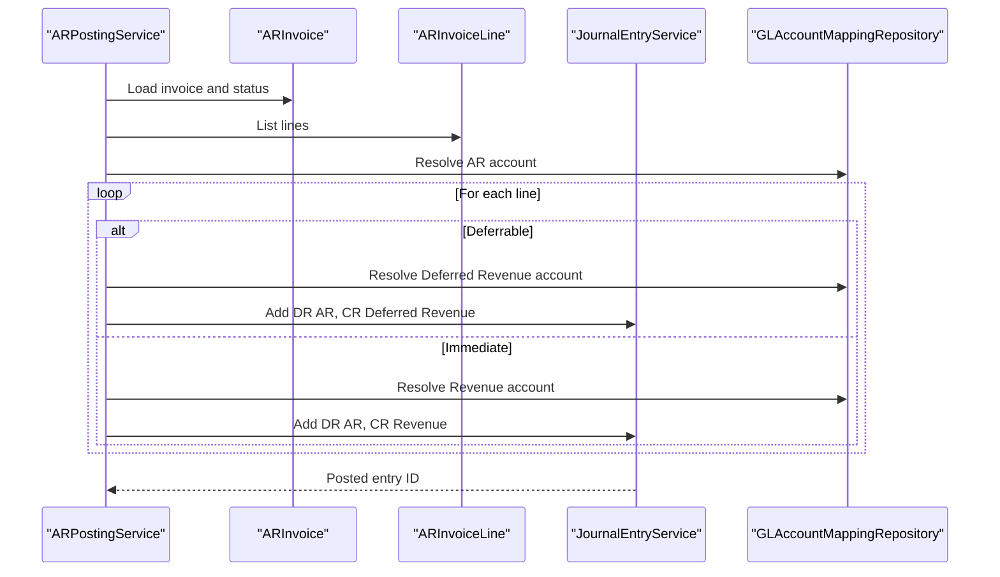
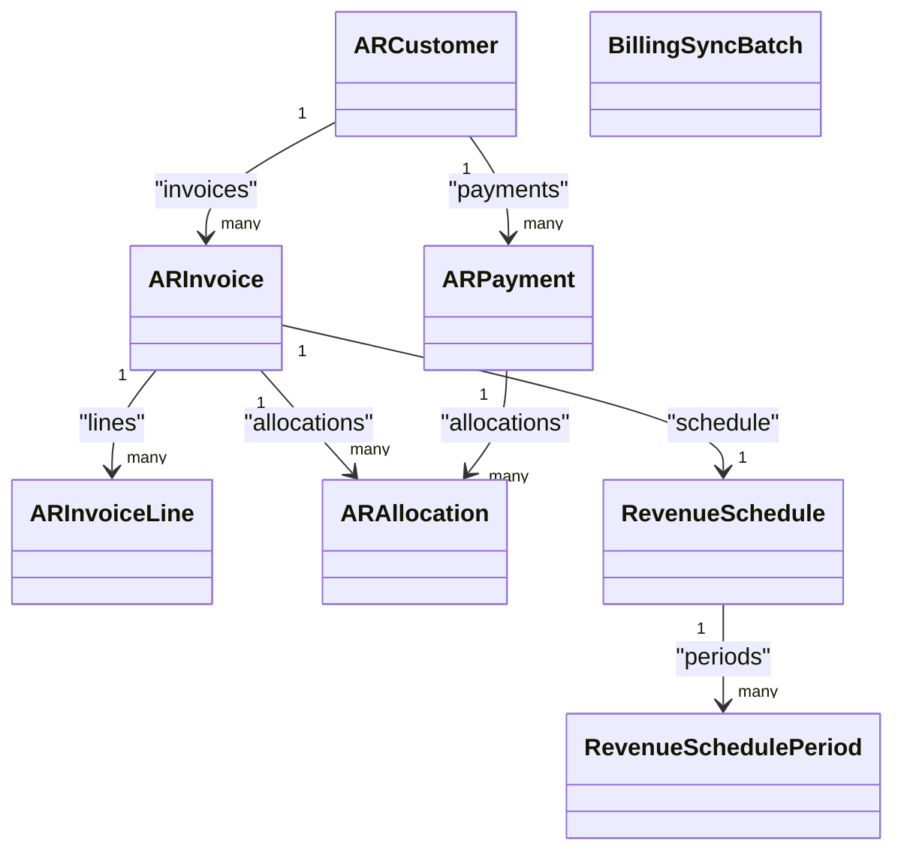

# Accounts Receivable Models

<cite>
**Referenced Files in This Document**
- [ar_customer_model.py](file://app/modules/ar/models/ar_customer_model.py)
- [ar_invoice_model.py](file://app/modules/ar/models/ar_invoice_model.py)
- [ar_payment_model.py](file://app/modules/ar/models/ar_payment_model.py)
- [deferred_revenue_model.py](file://app/modules/ar/models/deferred_revenue_model.py)
- [billing_sync_batch_model.py](file://app/modules/ar/models/billing_sync_batch_model.py)
- [ar_customer_repository.py](file://app/modules/ar/repositories/ar_customer_repository.py)
- [ar_invoice_repository.py](file://app/modules/ar/repositories/ar_invoice_repository.py)
- [ar_payment_repository.py](file://app/modules/ar/repositories/ar_payment_repository.py)
- [deferred_revenue_repository.py](file://app/modules/ar/repositories/deferred_revenue_repository.py)
- [billing_sync_batch_repository.py](file://app/modules/ar/repositories/billing_sync_batch_repository.py)
- [ar_sync_service.py](file://app/modules/ar/services/ar_sync_service.py)
- [ar_posting_service.py](file://app/modules/ar/services/ar_posting_service.py)
- [deferred_revenue_service.py](file://app/modules/ar/services/deferred_revenue_service.py)
</cite>

## Table of Contents
1. [Introduction](#introduction)
2. [Project Structure](#project-structure)
3. [Core Components](#core-components)
4. [Architecture Overview](#architecture-overview)
5. [Detailed Component Analysis](#detailed-component-analysis)
6. [Dependency Analysis](#dependency-analysis)
7. [Performance Considerations](#performance-considerations)
8. [Troubleshooting Guide](#troubleshooting-guide)
9. [Conclusion](#conclusion)
10. [Appendices](#appendices)

## Introduction
This document describes the Accounts Receivable (AR) data model and related business logic for customer management, invoice processing, payment allocation, and deferred revenue recognition. It defines entities, fields, constraints, relationships, and operational flows, and explains integration with the Billing service and General Ledger. It also covers billing synchronization, real-time update patterns, validation rules, aging calculations, and compliance-related identifiers.

## Project Structure
The AR domain is organized into models, repositories, services, and integrations:
- Models define persistent entities and enumerations.
- Repositories encapsulate data access and queries.
- Services orchestrate business operations such as sync, posting, and revenue recognition.
- Integrations connect to the Billing service for real-time data updates.

**Diagram sources**
- [ar_customer_model.py](file://app/modules/ar/models/ar_customer_model.py#L8-L30)
- [ar_invoice_model.py](file://app/modules/ar/models/ar_invoice_model.py#L21-L81)
- [ar_payment_model.py](file://app/modules/ar/models/ar_payment_model.py#L19-L70)
- [deferred_revenue_model.py](file://app/modules/ar/models/deferred_revenue_model.py#L17-L71)
- [billing_sync_batch_model.py](file://app/modules/ar/models/billing_sync_batch_model.py#L10-L40)
- [ar_customer_repository.py](file://app/modules/ar/repositories/ar_customer_repository.py#L9-L21)
- [ar_invoice_repository.py](file://app/modules/ar/repositories/ar_invoice_repository.py#L11-L59)
- [ar_payment_repository.py](file://app/modules/ar/repositories/ar_payment_repository.py#L9-L21)
- [deferred_revenue_repository.py](file://app/modules/ar/repositories/deferred_revenue_repository.py#L15-L80)
- [billing_sync_batch_repository.py](file://app/modules/ar/repositories/billing_sync_batch_repository.py#L12-L42)
- [ar_sync_service.py](file://app/modules/ar/services/ar_sync_service.py#L23-L325)
- [ar_posting_service.py](file://app/modules/ar/services/ar_posting_service.py#L17-L154)
- [deferred_revenue_service.py](file://app/modules/ar/services/deferred_revenue_service.py#L25-L241)

**Section sources**
- [ar_customer_model.py](file://app/modules/ar/models/ar_customer_model.py#L1-L30)
- [ar_invoice_model.py](file://app/modules/ar/models/ar_invoice_model.py#L1-L81)
- [ar_payment_model.py](file://app/modules/ar/models/ar_payment_model.py#L1-L70)
- [deferred_revenue_model.py](file://app/modules/ar/models/deferred_revenue_model.py#L1-L71)
- [billing_sync_batch_model.py](file://app/modules/ar/models/billing_sync_batch_model.py#L1-L40)

## Core Components
- ARCustomer: Represents a customer synchronized from the Billing service, linked to a Legal Entity and holding external identifiers.
- ARInvoice: Represents an invoice synchronized from Billing, with status, amounts, due date, and links to customer and lines.
- ARInvoiceLine: Line items of invoices, including quantities, prices, totals, and optional service period metadata for deferral.
- ARPayment: Payment records synchronized from Billing, with method, status, and links to customer and allocations.
- ARAllocation: Allocation of payments to invoices; many-to-many via intermediate table.
- RevenueSchedule: Deferred revenue schedule per invoice line with cadence and status.
- RevenueSchedulePeriod: Monthly recognition periods derived from a schedule.
- BillingSyncBatch: Idempotent batch tracking for Billing sync operations.

Validation and constraints:
- Unique external identifiers for customers, invoices, and payments.
- Status enums enforce valid lifecycle states.
- Amount fields are numeric with fixed precision.
- Unique constraints on invoice line number per invoice and allocation uniqueness per payment/invoice pair.
- Indexes on foreign keys and frequently queried fields (dates, statuses).

**Section sources**
- [ar_customer_model.py](file://app/modules/ar/models/ar_customer_model.py#L8-L30)
- [ar_invoice_model.py](file://app/modules/ar/models/ar_invoice_model.py#L21-L81)
- [ar_payment_model.py](file://app/modules/ar/models/ar_payment_model.py#L19-L70)
- [deferred_revenue_model.py](file://app/modules/ar/models/deferred_revenue_model.py#L17-L71)
- [billing_sync_batch_model.py](file://app/modules/ar/models/billing_sync_batch_model.py#L10-L40)

## Architecture Overview
The AR module integrates with the Billing service and General Ledger:
- ARSyncService pulls customers, invoices, and payments from Billing, persists them, and maintains cursors/mappings.
- ARPostingService posts invoices to the Accrual book, allocating to AR or Deferred Revenue depending on line deferral.
- DeferredRevenueService creates schedules from deferrable invoice lines, generates monthly periods, and posts recognition entries.

**Diagram sources**
- [ar_sync_service.py](file://app/modules/ar/services/ar_sync_service.py#L23-L325)
- [ar_posting_service.py](file://app/modules/ar/services/ar_posting_service.py#L17-L154)
- [deferred_revenue_service.py](file://app/modules/ar/services/deferred_revenue_service.py#L25-L241)

## Detailed Component Analysis

### Customer Management
- Purpose: Maintain customer records synchronized from Billing.
- Fields: Legal entity linkage, external customer ID, name, email, code, active flag.
- Relationships: One-to-many with invoices and payments.
- Access patterns: Retrieve by external ID for upserts and joins.

Validation and constraints:
- external_customer_id is unique and indexed.
- is_active defaults to true.

**Section sources**
- [ar_customer_model.py](file://app/modules/ar/models/ar_customer_model.py#L8-L30)
- [ar_customer_repository.py](file://app/modules/ar/repositories/ar_customer_repository.py#L9-L21)

### Invoice Processing
- Purpose: Track issued invoices and their line items.
- Fields: Legal entity, customer, external invoice ID, invoice number, dates, totals, currency, status, paid/outstanding amounts, description, and external data blob.
- Relationships: Many-to-one with customer; one-to-many with lines and allocations; navigates to payments via allocations.
- Status lifecycle: draft, issued, paid, partially_paid, overdue, cancelled, refunded.

Validation and constraints:
- external_invoice_id and invoice_number are unique and indexed.
- outstanding_amount computed as total minus paid.
- InvoiceStatus enum governs transitions.

**Section sources**
- [ar_invoice_model.py](file://app/modules/ar/models/ar_invoice_model.py#L21-L81)
- [ar_invoice_repository.py](file://app/modules/ar/repositories/ar_invoice_repository.py#L11-L59)

### Invoice Line Items
- Purpose: Capture line-level details and deferral metadata.
- Fields: Invoice linkage, line number, description, quantity, unit price, line amount, currency, service period dates, deferrable flag.
- Constraints: Unique line number per invoice.
- Business impact: Determines whether a line posts immediately to revenue or to deferred revenue.

**Section sources**
- [ar_invoice_model.py](file://app/modules/ar/models/ar_invoice_model.py#L54-L81)
- [ar_invoice_repository.py](file://app/modules/ar/repositories/ar_invoice_repository.py#L24-L59)

### Payment Allocation
- Purpose: Apply payments to invoices.
- Entities: ARPayment and ARAllocation.
- Fields: Payment date, amount, currency, method, status, reference, external data; allocation date and amount.
- Relationships: Many-to-one to payment and invoice; unique constraint prevents duplicate allocations for the same payment/invoice pair.
- Aging: Invoices with outstanding amounts and past-due dates are considered overdue.

**Section sources**
- [ar_payment_model.py](file://app/modules/ar/models/ar_payment_model.py#L19-L70)
- [ar_payment_repository.py](file://app/modules/ar/repositories/ar_payment_repository.py#L9-L21)
- [ar_invoice_repository.py](file://app/modules/ar/repositories/ar_invoice_repository.py#L41-L59)

### Deferred Revenue Recognition
- Purpose: Recognize revenue over time for subscription/service lines.
- Entities: RevenueSchedule and RevenueSchedulePeriod.
- Fields: Legal entity, book, invoice and line linkage, total amount, currency, service period, cadence, status; period start/end, recognition amount, recognition flag, journal entry linkage.
- Lifecycle: Create schedule from deferrable invoice line; generate monthly periods; recognize over time; link to journal entries.

**Section sources**
- [deferred_revenue_model.py](file://app/modules/ar/models/deferred_revenue_model.py#L17-L71)
- [deferred_revenue_repository.py](file://app/modules/ar/repositories/deferred_revenue_repository.py#L15-L80)
- [deferred_revenue_service.py](file://app/modules/ar/services/deferred_revenue_service.py#L25-L241)

### Billing Sync and Real-Time Updates
- Purpose: Idempotent, cursor-based synchronization from Billing to AR entities.
- Entities: BillingSyncBatch tracks batch numbers, status, counts, cursors, timestamps, and errors.
- Processes: Sync customers, invoices, and payments; maintain cursors and source-object mappings; handle partial failures gracefully.

**Section sources**
- [billing_sync_batch_model.py](file://app/modules/ar/models/billing_sync_batch_model.py#L10-L40)
- [billing_sync_batch_repository.py](file://app/modules/ar/repositories/billing_sync_batch_repository.py#L12-L42)
- [ar_sync_service.py](file://app/modules/ar/services/ar_sync_service.py#L23-L325)

### Posting Flows
- AR Invoice Posting: Posts to Accrual book; deferrable lines split into AR and Deferred Revenue; others post to Revenue accounts.
- Deferred Revenue Recognition: Generates monthly periods and posts journal entries to move from Deferred Revenue to Revenue.

**Diagram sources**
- [ar_posting_service.py](file://app/modules/ar/services/ar_posting_service.py#L17-L154)

**Section sources**
- [ar_posting_service.py](file://app/modules/ar/services/ar_posting_service.py#L17-L154)
- [deferred_revenue_service.py](file://app/modules/ar/services/deferred_revenue_service.py#L25-L241)

## Dependency Analysis
- Models depend on a shared base model and SQLAlchemy ORM constructs.
- Repositories depend on SQLAlchemy sessions and base repository utilities.
- Services depend on repositories and GL services for posting and mappings.
- ARSyncService depends on BillingAdapter and external sync repositories for cursors and mappings.

**Diagram sources**
- [ar_customer_model.py](file://app/modules/ar/models/ar_customer_model.py#L8-L30)
- [ar_invoice_model.py](file://app/modules/ar/models/ar_invoice_model.py#L21-L81)
- [ar_payment_model.py](file://app/modules/ar/models/ar_payment_model.py#L19-L70)
- [deferred_revenue_model.py](file://app/modules/ar/models/deferred_revenue_model.py#L17-L71)
- [billing_sync_batch_model.py](file://app/modules/ar/models/billing_sync_batch_model.py#L10-L40)

**Section sources**
- [ar_customer_model.py](file://app/modules/ar/models/ar_customer_model.py#L8-L30)
- [ar_invoice_model.py](file://app/modules/ar/models/ar_invoice_model.py#L21-L81)
- [ar_payment_model.py](file://app/modules/ar/models/ar_payment_model.py#L19-L70)
- [deferred_revenue_model.py](file://app/modules/ar/models/deferred_revenue_model.py#L17-L71)
- [billing_sync_batch_model.py](file://app/modules/ar/models/billing_sync_batch_model.py#L10-L40)

## Performance Considerations
- Indexes on foreign keys and frequently filtered fields (e.g., due_date, status, invoice_number) improve query performance.
- Cursor-based incremental sync reduces payload sizes and improves throughput.
- Idempotent batch numbers and unique constraints prevent duplicate writes.
- Decimal arithmetic ensures precise financial calculations; avoid floating-point conversions.

[No sources needed since this section provides general guidance]

## Troubleshooting Guide
Common issues and resolutions:
- Missing customer during invoice sync: Ensure customer sync runs before invoice sync; fallback creation is supported but external mapping is required.
- Payment without matching invoice: Verify allocation external IDs and that invoices are present before payments.
- Posting failures: Confirm Accrual book exists for the legal entity and required GL account mappings are configured.
- Deferred revenue not recognized: Ensure schedule exists for deferrable lines and periods are generated; check recognition cadence and period boundaries.
- Aging discrepancies: Validate due_date and outstanding_amount; overdue queries filter by due_date < as_of_date and positive outstanding_amount.

**Section sources**
- [ar_sync_service.py](file://app/modules/ar/services/ar_sync_service.py#L23-L325)
- [ar_posting_service.py](file://app/modules/ar/services/ar_posting_service.py#L17-L154)
- [deferred_revenue_service.py](file://app/modules/ar/services/deferred_revenue_service.py#L25-L241)
- [ar_invoice_repository.py](file://app/modules/ar/repositories/ar_invoice_repository.py#L41-L59)

## Conclusion
The AR module provides a robust foundation for customer, invoice, payment, and deferred revenue management with strong integration to Billing and General Ledger. The models, repositories, and services enforce data integrity, support idempotent sync, and enable accurate revenue recognition aligned with service periods.

[No sources needed since this section summarizes without analyzing specific files]

## Appendices

### Field Definitions and Validation Rules
- ARCustomer
  - external_customer_id: unique, indexed, required
  - customer_name: required
  - is_active: boolean, default true
- ARInvoice
  - external_invoice_id: unique, indexed, required
  - invoice_number: unique, indexed, required
  - invoice_date, due_date: indexed
  - total_amount, paid_amount, outstanding_amount: numeric with two decimals
  - status: enum (DRAFT, ISSUED, PAID, PARTIALLY_PAID, OVERDUE, CANCELLED, REFUNDED)
- ARInvoiceLine
  - line_number: unique per invoice
  - quantity, unit_price, line_amount: numeric with decimals
  - service_start, service_end: optional
  - is_deferrable: boolean
- ARPayment
  - external_payment_id: unique, indexed, required
  - payment_date: indexed
  - payment_amount: numeric
  - status: enum (PENDING, COMPLETED, FAILED, REFUNDED, PARTIALLY_REFUNDED)
- ARAllocation
  - unique constraint: (ar_payment_id, ar_invoice_id)
- RevenueSchedule
  - recognition_cadence: string, default MONTHLY
  - status: enum (ACTIVE, COMPLETED, CANCELLED)
- RevenueSchedulePeriod
  - unique constraint: (revenue_schedule_id, period_start)
  - is_recognized: boolean, indexed
- BillingSyncBatch
  - batch_number: unique, indexed, required
  - status: enum (PENDING, PROCESSING, COMPLETED, FAILED)
  - cursors: optional strings
  - counts: integers
  - timestamps: optional

**Section sources**
- [ar_customer_model.py](file://app/modules/ar/models/ar_customer_model.py#L8-L30)
- [ar_invoice_model.py](file://app/modules/ar/models/ar_invoice_model.py#L21-L81)
- [ar_payment_model.py](file://app/modules/ar/models/ar_payment_model.py#L19-L70)
- [deferred_revenue_model.py](file://app/modules/ar/models/deferred_revenue_model.py#L17-L71)
- [billing_sync_batch_model.py](file://app/modules/ar/models/billing_sync_batch_model.py#L10-L40)

### Example Workflows

#### Invoice Creation from Billing
- Sync customers and invoices.
- For each invoice, create ARInvoice and ARInvoiceLine entries.
- Persist external IDs and mappings for idempotency.

**Section sources**
- [ar_sync_service.py](file://app/modules/ar/services/ar_sync_service.py#L112-L202)
- [ar_invoice_model.py](file://app/modules/ar/models/ar_invoice_model.py#L21-L81)

#### Payment Application
- Sync payments with allocations.
- For each allocation, create ARAllocation linking payment to invoice.
- Update invoice paid/outstanding amounts accordingly.

**Section sources**
- [ar_sync_service.py](file://app/modules/ar/services/ar_sync_service.py#L232-L325)
- [ar_payment_model.py](file://app/modules/ar/models/ar_payment_model.py#L19-L70)

#### Deferred Revenue Calculation
- Validate invoice line is deferrable and has service period.
- Create RevenueSchedule with monthly periods.
- Recognize revenue by posting journal entries for each period.

**Section sources**
- [deferred_revenue_service.py](file://app/modules/ar/services/deferred_revenue_service.py#L37-L165)
- [deferred_revenue_model.py](file://app/modules/ar/models/deferred_revenue_model.py#L17-L71)

### Aging Calculations
- Overdue invoices are identified by due_date < as_of_date and positive outstanding_amount within a legal entity.
- Query supports pagination and ordering by due date.

**Section sources**
- [ar_invoice_repository.py](file://app/modules/ar/repositories/ar_invoice_repository.py#L41-L59)

### Compliance and Idempotency
- BillingSyncBatch provides idempotent batch tracking with batch_number, cursors, counts, timestamps, and error messages.
- Posting services use idempotency keys derived from external IDs or internal keys to prevent duplicate journal entries.

**Section sources**
- [billing_sync_batch_model.py](file://app/modules/ar/models/billing_sync_batch_model.py#L10-L40)
- [ar_posting_service.py](file://app/modules/ar/services/ar_posting_service.py#L130-L140)