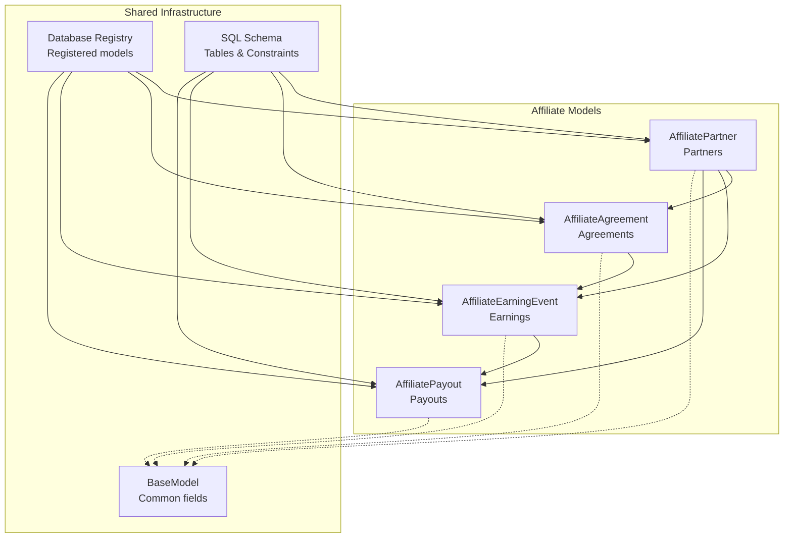
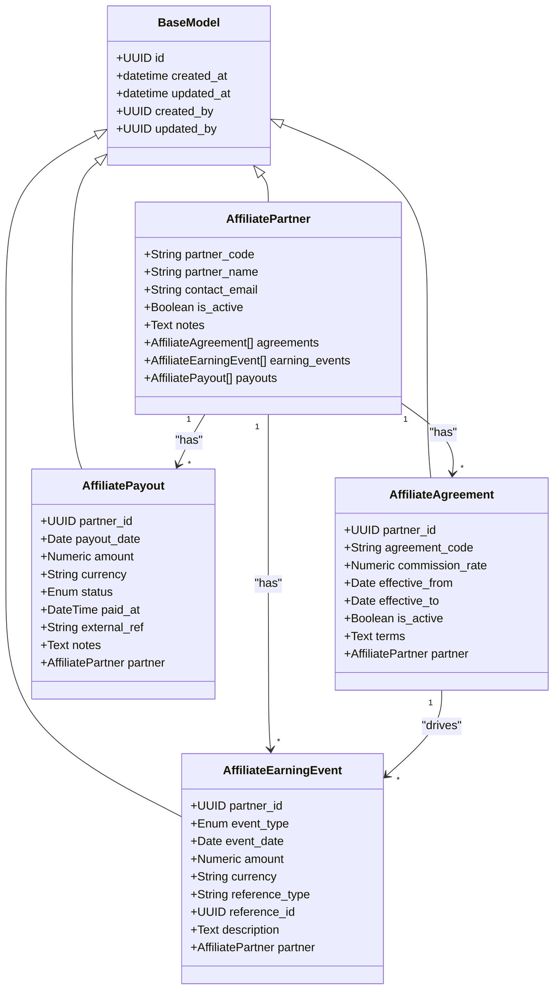
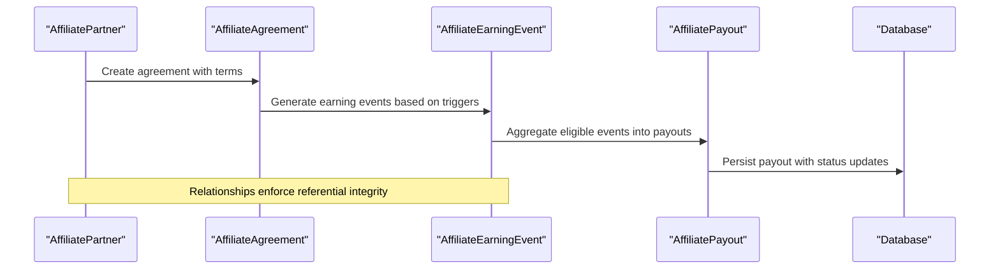
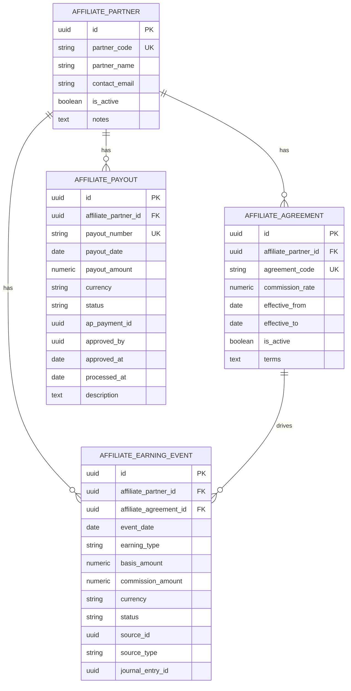
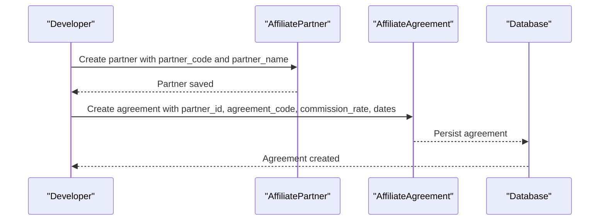
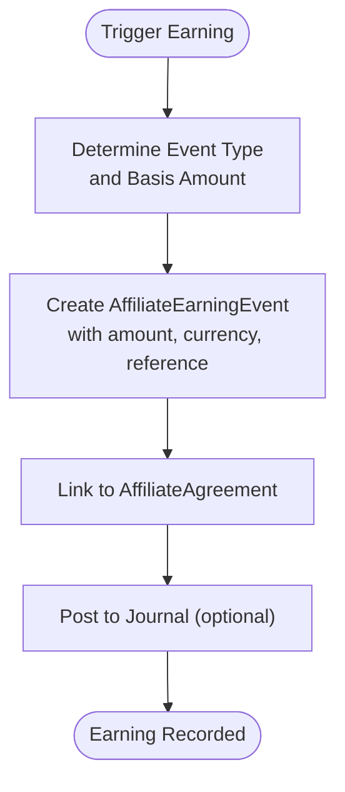
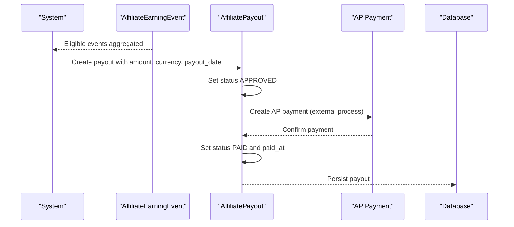
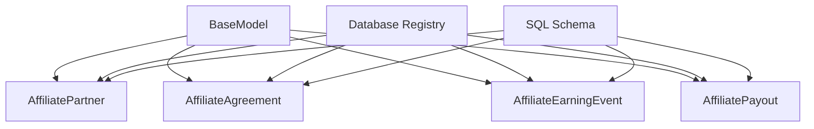

# Affiliate Models

<cite>
**Referenced Files in This Document**
- [affiliate_partner_model.py](file://app/modules/affiliates/models/affiliate_partner_model.py)
- [affiliate_agreement_model.py](file://app/modules/affiliates/models/affiliate_agreement_model.py)
- [affiliate_earning_model.py](file://app/modules/affiliates/models/affiliate_earning_model.py)
- [base_model.py](file://app/shared/models/base_model.py)
- [database.py](file://app/core/database.py)
- [fm_schema.sql](file://database/fm_schema.sql)
- [SCHEMA_UPDATES_SUMMARY.md](file://docs/01-main/SCHEMA_UPDATES_SUMMARY.md)
</cite>

## Table of Contents
1. [Introduction](#introduction)
2. [Project Structure](#project-structure)
3. [Core Components](#core-components)
4. [Architecture Overview](#architecture-overview)
5. [Detailed Component Analysis](#detailed-component-analysis)
6. [Dependency Analysis](#dependency-analysis)
7. [Performance Considerations](#performance-considerations)
8. [Troubleshooting Guide](#troubleshooting-guide)
9. [Conclusion](#conclusion)
10. [Appendices](#appendices)

## Introduction
This document provides comprehensive data model documentation for the Affiliate Management module. It covers the core entities—partners, agreements, and earnings/payouts—and explains their relationships, constraints, and business rules. It also documents the underlying schema, validation rules, and operational flows for agreement creation, earning calculation, and payment processing. The goal is to enable developers and stakeholders to understand how affiliate data is modeled, validated, and managed within the system.

## Project Structure
The Affiliate Management models are organized under the modules tree and integrate with the shared base model and core database infrastructure. The models are registered in the core database module and backed by the SQL schema.

**Diagram sources**
- [affiliate_partner_model.py](file://app/modules/affiliates/models/affiliate_partner_model.py#L7-L24)
- [affiliate_agreement_model.py](file://app/modules/affiliates/models/affiliate_agreement_model.py#L9-L26)
- [affiliate_earning_model.py](file://app/modules/affiliates/models/affiliate_earning_model.py#L25-L64)
- [base_model.py](file://app/shared/models/base_model.py#L9-L17)
- [database.py](file://app/core/database.py#L72-L77)
- [fm_schema.sql](file://database/fm_schema.sql#L1219-L1320)

**Section sources**
- [affiliate_partner_model.py](file://app/modules/affiliates/models/affiliate_partner_model.py#L1-L25)
- [affiliate_agreement_model.py](file://app/modules/affiliates/models/affiliate_agreement_model.py#L1-L27)
- [affiliate_earning_model.py](file://app/modules/affiliates/models/affiliate_earning_model.py#L1-L65)
- [base_model.py](file://app/shared/models/base_model.py#L1-L18)
- [database.py](file://app/core/database.py#L72-L77)
- [fm_schema.sql](file://database/fm_schema.sql#L1219-L1320)

## Core Components
This section introduces the three primary entities and their responsibilities:

- AffiliatePartner: Represents an external partner in the affiliate program. Maintains partner metadata and relationships to agreements, earnings, and payouts.
- AffiliateAgreement: Defines the terms of the partnership, including commission rate, validity dates, and activity status.
- AffiliateEarningEvent: Records individual earning events (e.g., signup, revenue, subscription) and associated amounts and currencies.
- AffiliatePayout: Tracks payout batches or records to partners, including status and payment metadata.

Each model inherits common fields from the shared base model and participates in the core database registry.

**Section sources**
- [affiliate_partner_model.py](file://app/modules/affiliates/models/affiliate_partner_model.py#L7-L24)
- [affiliate_agreement_model.py](file://app/modules/affiliates/models/affiliate_agreement_model.py#L9-L26)
- [affiliate_earning_model.py](file://app/modules/affiliates/models/affiliate_earning_model.py#L25-L64)
- [base_model.py](file://app/shared/models/base_model.py#L9-L17)
- [database.py](file://app/core/database.py#L72-L77)

## Architecture Overview
The affiliate data model is implemented as SQLAlchemy ORM classes mapped to PostgreSQL tables. The models share a common base class that provides standardized audit fields. The core database module registers these models for use with the application’s async engine.

**Diagram sources**
- [base_model.py](file://app/shared/models/base_model.py#L9-L17)
- [affiliate_partner_model.py](file://app/modules/affiliates/models/affiliate_partner_model.py#L7-L24)
- [affiliate_agreement_model.py](file://app/modules/affiliates/models/affiliate_agreement_model.py#L9-L26)
- [affiliate_earning_model.py](file://app/modules/affiliates/models/affiliate_earning_model.py#L25-L64)

## Detailed Component Analysis

### AffiliatePartner
- Purpose: Stores partner identity and contact information, plus activation and notes.
- Key fields:
  - partner_code: Unique identifier for the partner.
  - partner_name: Display name.
  - contact_email: Optional contact email.
  - is_active: Indicates whether the partner is currently active.
  - notes: Free-form notes.
- Relationships:
  - agreements: One-to-many with AffiliateAgreement.
  - earning_events: One-to-many with AffiliateEarningEvent.
  - payouts: One-to-many with AffiliatePayout.
- Validation and constraints:
  - partner_code is unique and indexed.
  - is_active defaults to true.
- Business constraints:
  - Deactivation affects downstream eligibility for new earnings and payouts.

**Section sources**
- [affiliate_partner_model.py](file://app/modules/affiliates/models/affiliate_partner_model.py#L7-L24)

### AffiliateAgreement
- Purpose: Defines the terms of the partnership with a partner.
- Key fields:
  - partner_id: Foreign key to AffiliatePartner.
  - agreement_code: Unique code identifying the agreement.
  - commission_rate: Numeric rate defining commission percentage or fixed amount depending on agreement type.
  - effective_from/effective_to: Validity period.
  - is_active: Indicates current activity.
  - terms: Optional textual terms.
- Relationships:
  - partner: Many-to-one with AffiliatePartner.
- Validation and constraints:
  - agreement_code is unique and indexed.
  - commission_rate is numeric with precision suitable for rates.
  - effective_from is required; effective_to is optional.
- Business constraints:
  - Only active agreements can drive earnings.
  - Effective date boundaries govern eligibility.

**Section sources**
- [affiliate_agreement_model.py](file://app/modules/affiliates/models/affiliate_agreement_model.py#L9-L26)

### AffiliateEarningEvent
- Purpose: Records individual earning events credited to a partner.
- Key fields:
  - partner_id: Foreign key to AffiliatePartner.
  - event_type: Enumerated type (e.g., SIGNUP, REVENUE, SUBSCRIPTION).
  - event_date: Date the event occurred.
  - amount: Numeric amount credited.
  - currency: Three-letter ISO currency code.
  - reference_type/reference_id: Optional reference to source (e.g., invoice_id, subscription_id).
  - description: Optional description.
- Relationships:
  - partner: Many-to-one with AffiliatePartner.
- Validation and constraints:
  - Amount is numeric with currency precision.
  - Currency is three-letter code.
  - Indexes on event_date and type support reporting.
- Business constraints:
  - Events are typically linked to agreements and may be posted to journals.

**Section sources**
- [affiliate_earning_model.py](file://app/modules/affiliates/models/affiliate_earning_model.py#L25-L44)

### AffiliatePayout
- Purpose: Tracks payouts to partners, including status and payment metadata.
- Key fields:
  - partner_id: Foreign key to AffiliatePartner.
  - payout_date: Date of the payout.
  - amount: Numeric amount.
  - currency: Three-letter ISO currency code.
  - status: Enumerated status (PENDING, APPROVED, PAID, CANCELLED).
  - paid_at: Timestamp when paid.
  - external_ref: Optional external reference (e.g., transfer_id).
  - notes: Optional notes.
- Relationships:
  - partner: Many-to-one with AffiliatePartner.
- Validation and constraints:
  - Amount is numeric with currency precision.
  - Status is enumerated with default PENDING.
  - Indexes on payout_date and status support reporting.
- Business constraints:
  - Status progression typically follows PENDING -> APPROVED -> PAID.

**Section sources**
- [affiliate_earning_model.py](file://app/modules/affiliates/models/affiliate_earning_model.py#L46-L64)

### Shared Base Model
- Purpose: Provides common fields across all models.
- Fields:
  - id: UUID primary key.
  - created_at/updated_at: Timestamps with timezone.
  - created_by/updated_by: Nullable UUIDs representing user IDs from JWT/Clerk.
- Compliance:
  - The presence of created_by/updated_by enables audit trails and SOX compliance.

**Section sources**
- [base_model.py](file://app/shared/models/base_model.py#L9-L17)
- [SCHEMA_UPDATES_SUMMARY.md](file://docs/01-main/SCHEMA_UPDATES_SUMMARY.md#L9-L27)

## Architecture Overview
The affiliate models are registered in the core database module and backed by the SQL schema. The relationships among models define the data flow from partners through agreements to earnings and payouts.

**Diagram sources**
- [database.py](file://app/core/database.py#L72-L77)
- [affiliate_partner_model.py](file://app/modules/affiliates/models/affiliate_partner_model.py#L17-L19)
- [affiliate_agreement_model.py](file://app/modules/affiliates/models/affiliate_agreement_model.py#L21)
- [affiliate_earning_model.py](file://app/modules/affiliates/models/affiliate_earning_model.py#L38)
- [affiliate_earning_model.py](file://app/modules/affiliates/models/affiliate_earning_model.py#L59)

## Detailed Component Analysis

### Data Model Definitions and Constraints
- AffiliatePartner
  - Fields: partner_code (unique, indexed), partner_name, contact_email, is_active, notes.
  - Relationships: agreements, earning_events, payouts.
  - Constraints: partner_code uniqueness; default is_active true.
- AffiliateAgreement
  - Fields: partner_id (FK), agreement_code (unique, indexed), commission_rate, effective_from, effective_to, is_active, terms.
  - Relationships: partner.
  - Constraints: unique agreement_code; numeric commission_rate; effective_from required.
- AffiliateEarningEvent
  - Fields: partner_id (FK), event_type (enum), event_date (indexed), amount (currency), currency, reference_type, reference_id (indexed), description.
  - Relationships: partner.
  - Constraints: amount and currency precision; indexed event_date and type.
- AffiliatePayout
  - Fields: partner_id (FK), payout_date (indexed), amount (currency), currency, status (enum, default PENDING), paid_at, external_ref, notes.
  - Relationships: partner.
  - Constraints: amount and currency precision; indexed payout_date and status.

**Section sources**
- [affiliate_partner_model.py](file://app/modules/affiliates/models/affiliate_partner_model.py#L7-L24)
- [affiliate_agreement_model.py](file://app/modules/affiliates/models/affiliate_agreement_model.py#L9-L26)
- [affiliate_earning_model.py](file://app/modules/affiliates/models/affiliate_earning_model.py#L25-L64)

### Relationship Mapping
- AffiliatePartner is the parent entity with one-to-many relationships to agreements, earnings, and payouts.
- AffiliateAgreement belongs to a partner and drives earning events.
- AffiliateEarningEvent belongs to a partner and is typically linked to an agreement.
- AffiliatePayout belongs to a partner and aggregates eligible earnings.

**Diagram sources**
- [fm_schema.sql](file://database/fm_schema.sql#L1219-L1320)

### Validation Rules and Business Constraints
- Uniqueness:
  - AffiliatePartner.partner_code is unique.
  - AffiliateAgreement.agreement_code is unique.
  - AffiliatePayout.payout_number is unique.
- Numeric precision:
  - Commission rates use numeric with sufficient precision.
  - Monetary amounts use numeric with currency precision.
- Enumerations:
  - EarningEventType includes SIGNUP, REVENUE, SUBSCRIPTION.
  - PayoutStatus includes PENDING, APPROVED, PAID, CANCELLED.
- Temporal constraints:
  - Effective date boundaries govern agreement validity.
  - Indexed event_date and payout_date enable efficient reporting.
- Audit fields:
  - created_by and updated_by are present on all tables for compliance.

**Section sources**
- [affiliate_agreement_model.py](file://app/modules/affiliates/models/affiliate_agreement_model.py#L13-L19)
- [affiliate_earning_model.py](file://app/modules/affiliates/models/affiliate_earning_model.py#L10-L23)
- [affiliate_earning_model.py](file://app/modules/affiliates/models/affiliate_earning_model.py#L29-L36)
- [affiliate_earning_model.py](file://app/modules/affiliates/models/affiliate_earning_model.py#L50-L57)
- [SCHEMA_UPDATES_SUMMARY.md](file://docs/01-main/SCHEMA_UPDATES_SUMMARY.md#L9-L27)

### Example Workflows

#### Agreement Creation
- Create an AffiliatePartner.
- Create an AffiliateAgreement with a unique agreement_code, commission_rate, and effective_from/effective_to dates.
- Optionally add terms and set is_active.

**Diagram sources**
- [affiliate_partner_model.py](file://app/modules/affiliates/models/affiliate_partner_model.py#L11-L15)
- [affiliate_agreement_model.py](file://app/modules/affiliates/models/affiliate_agreement_model.py#L13-L19)

#### Earning Calculation
- Trigger earning events based on business rules (e.g., SIGNUP, REVENUE, SUBSCRIPTION).
- Record AffiliateEarningEvent with event_date, amount, currency, and reference metadata.
- Link to the applicable AffiliateAgreement.

**Diagram sources**
- [affiliate_earning_model.py](file://app/modules/affiliates/models/affiliate_earning_model.py#L25-L44)
- [fm_schema.sql](file://database/fm_schema.sql#L1269-L1293)

#### Payment Processing
- Aggregate eligible AffiliateEarningEvent entries into AffiliatePayout.
- Set status to APPROVED, then PAID upon processing.
- Optionally link to AP payment and record paid_at.

**Diagram sources**
- [affiliate_earning_model.py](file://app/modules/affiliates/models/affiliate_earning_model.py#L46-L64)
- [fm_schema.sql](file://database/fm_schema.sql#L1295-L1320)

## Dependency Analysis
The affiliate models depend on the shared base model and are registered in the core database module. The SQL schema defines the physical tables and indexes.

**Diagram sources**
- [base_model.py](file://app/shared/models/base_model.py#L9-L17)
- [database.py](file://app/core/database.py#L72-L77)
- [fm_schema.sql](file://database/fm_schema.sql#L1219-L1320)

**Section sources**
- [database.py](file://app/core/database.py#L72-L77)
- [fm_schema.sql](file://database/fm_schema.sql#L1219-L1320)

## Performance Considerations
- Indexes:
  - partner_code and agreement_code are indexed for fast lookups.
  - event_date and payout_date are indexed to optimize reporting queries.
  - Status fields are indexed to filter by lifecycle stages efficiently.
- Numeric precision:
  - Rates and monetary amounts use numeric types to avoid floating-point errors.
- Relationships:
  - Cascade delete-orphan ensures clean removal of child records when parents are deleted.
- Audit fields:
  - created_by/updated_by enable targeted filtering and auditing without performance penalties.

[No sources needed since this section provides general guidance]

## Troubleshooting Guide
- Duplicate partner_code or agreement_code:
  - Ensure uniqueness before insert/update.
- Invalid effective date ranges:
  - Verify effective_from <= effective_to when both are provided.
- Currency mismatches:
  - Ensure currency codes conform to ISO standards.
- Payout status transitions:
  - Follow PENDING -> APPROVED -> PAID progression.
- Audit trail issues:
  - Confirm created_by/updated_by are populated during service operations.

**Section sources**
- [affiliate_partner_model.py](file://app/modules/affiliates/models/affiliate_partner_model.py#L11-L15)
- [affiliate_agreement_model.py](file://app/modules/affiliates/models/affiliate_agreement_model.py#L13-L19)
- [affiliate_earning_model.py](file://app/modules/affiliates/models/affiliate_earning_model.py#L50-L57)
- [SCHEMA_UPDATES_SUMMARY.md](file://docs/01-main/SCHEMA_UPDATES_SUMMARY.md#L9-L27)

## Conclusion
The Affiliate Management data model provides a robust foundation for managing partner relationships, agreement terms, earnings tracking, and payouts. The shared base model and core database registration ensure consistency and compliance. The SQL schema enforces uniqueness, indexing, and referential integrity. By following the documented constraints and workflows, teams can implement reliable affiliate program management with strong auditability and reporting capabilities.

[No sources needed since this section summarizes without analyzing specific files]

## Appendices

### Field Reference Summary
- AffiliatePartner
  - partner_code: Unique identifier.
  - partner_name: Display name.
  - contact_email: Contact email.
  - is_active: Activation flag.
  - notes: Notes.
- AffiliateAgreement
  - agreement_code: Unique agreement identifier.
  - commission_rate: Rate or amount.
  - effective_from/effective_to: Validity period.
  - is_active: Activity flag.
  - terms: Terms text.
- AffiliateEarningEvent
  - event_type: Enumerated type.
  - event_date: Event date.
  - amount: Monetary amount.
  - currency: Currency code.
  - reference_type/reference_id: Source reference.
  - description: Description.
- AffiliatePayout
  - payout_date: Payout date.
  - amount: Monetary amount.
  - currency: Currency code.
  - status: Enumerated status.
  - paid_at: Paid timestamp.
  - external_ref: External reference.
  - notes: Notes.

**Section sources**
- [affiliate_partner_model.py](file://app/modules/affiliates/models/affiliate_partner_model.py#L11-L15)
- [affiliate_agreement_model.py](file://app/modules/affiliates/models/affiliate_agreement_model.py#L13-L19)
- [affiliate_earning_model.py](file://app/modules/affiliates/models/affiliate_earning_model.py#L29-L36)
- [affiliate_earning_model.py](file://app/modules/affiliates/models/affiliate_earning_model.py#L50-L57)