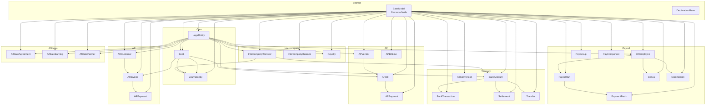
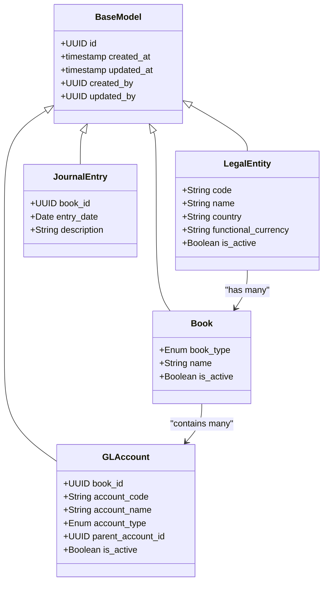
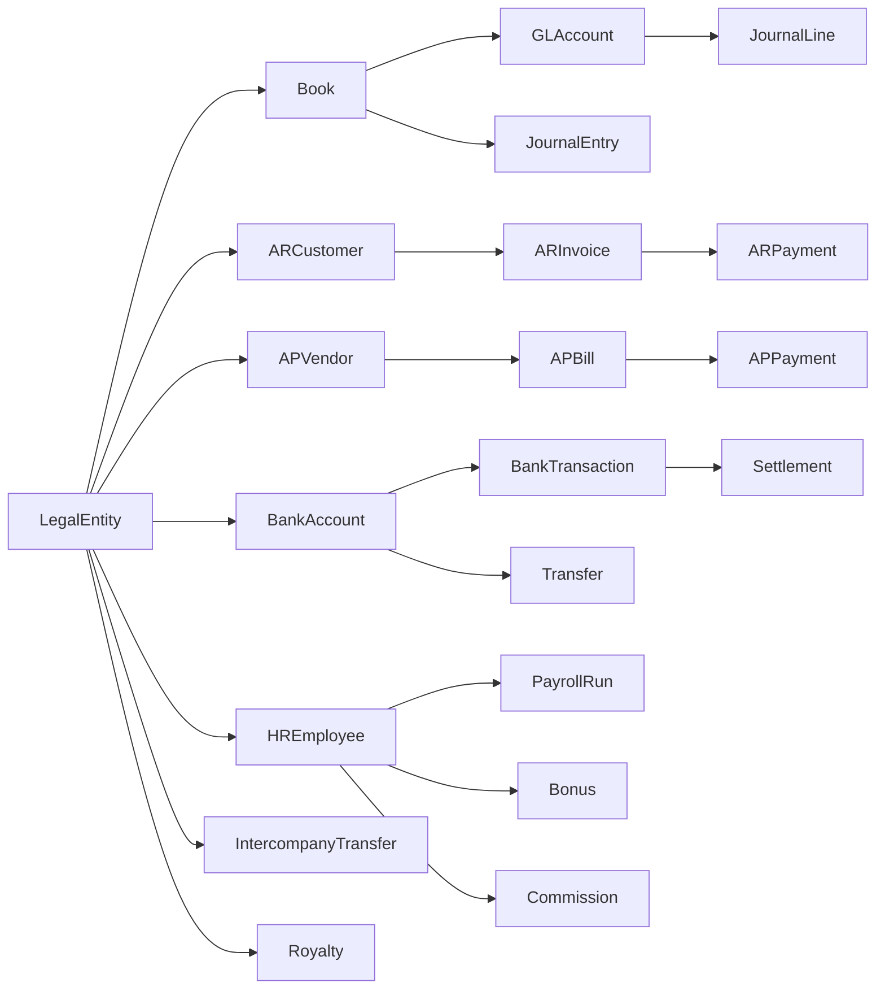

# Data Models

<cite>
**Referenced Files in This Document**
- [base_model.py](file://app/shared/models/base_model.py)
- [db_metadata.py](file://app/core/db_metadata.py)
- [legal_entity_model.py](file://app/modules/general_ledger/models/legal_entity_model.py)
- [book_model.py](file://app/modules/general_ledger/models/book_model.py)
- [gl_account_model.py](file://app/modules/general_ledger/models/gl_account_model.py)
- [journal_entry_model.py](file://app/modules/general_ledger/models/journal_entry_model.py)
- [ar_customer_model.py](file://app/modules/ar/models/ar_customer_model.py)
- [ar_invoice_model.py](file://app/modules/ar/models/ar_invoice_model.py)
- [ar_payment_model.py](file://app/modules/ar/models/ar_payment_model.py)
- [ap_vendor_model.py](file://app/modules/ap/models/ap_vendor_model.py)
- [ap_bill_model.py](file://app/modules/ap/models/ap_bill_model.py)
- [ap_payment_model.py](file://app/modules/ap/models/ap_payment_model.py)
- [bank_account_model.py](file://app/modules/treasury/models/bank_account_model.py)
- [bank_transaction_model.py](file://app/modules/treasury/models/bank_transaction_model.py)
- [settlement_model.py](file://app/modules/treasury/models/settlement_model.py)
- [fx_conversion_model.py](file://app/modules/treasury/models/fx_conversion_model.py)
- [transfer_model.py](file://app/modules/treasury/models/transfer_model.py)
- [employee_model.py](file://app/modules/payroll/models/employee_model.py)
- [pay_component_model.py](file://app/modules/payroll/models/pay_component_model.py)
- [pay_group_model.py](file://app/modules/payroll/models/pay_group_model.py)
- [payment_batch_model.py](file://app/modules/payroll/models/payment_batch_model.py)
- [payroll_run_model.py](file://app/modules/payroll/models/payroll_run_model.py)
- [bonus_model.py](file://app/modules/payroll/models/bonus_model.py)
- [commission_model.py](file://app/modules/payroll/models/commission_model.py)
- [intercompany_transfer_model.py](file://app/modules/intercompany/models/intercompany_transfer_model.py)
- [intercompany_balance_model.py](file://app/modules/intercompany/models/intercompany_balance_model.py)
- [royalty_model.py](file://app/modules/intercompany/models/royalty_model.py)
- [affiliate_agreement_model.py](file://app/modules/affiliates/models/affiliate_agreement_model.py)
- [affiliate_earning_model.py](file://app/modules/affiliates/models/affiliate_earning_model.py)
- [affiliate_partner_model.py](file://app/modules/affiliates/models/affiliate_partner_model.py)
- [approval_policy_model.py](file://app/modules/core/models/approval_policy_model.py)
- [audit_log_model.py](file://app/modules/core/models/audit_log_model.py)
- [idempotency_model.py](file://app/modules/core/models/idempotency_model.py)
- [billing_sync_batch_model.py](file://app/modules/ar/models/billing_sync_batch_model.py)
- [deferred_revenue_model.py](file://app/modules/ar/models/deferred_revenue_model.py)
- [period_close_checklist_model.py](file://app/modules/general_ledger/models/period_close_checklist_model.py)
- [reconciliation_model.py](file://app/modules/general_ledger/models/reconciliation_model.py)
- [reconciliation_adjustment_batch_model.py](file://app/modules/general_ledger/models/reconciliation_adjustment_batch_model.py)
- [external_sync_model.py](file://app/modules/general_ledger/models/external_sync_model.py)
- [treasury_sync_batch_model.py](file://app/modules/general_ledger/models/treasury_sync_batch_model.py)
- [dimension_model.py](file://app/modules/general_ledger/models/dimension_model.py)
- [accounting_period_model.py](file://app/modules/general_ledger/models/accounting_period_model.py)
- [fm_schema.sql](file://database/fm_schema.sql)
</cite>

## Table of Contents
1. [Introduction](#introduction)
2. [Project Structure](#project-structure)
3. [Core Components](#core-components)
4. [Architecture Overview](#architecture-overview)
5. [Detailed Component Analysis](#detailed-component-analysis)
6. [Dependency Analysis](#dependency-analysis)
7. [Performance Considerations](#performance-considerations)
8. [Troubleshooting Guide](#troubleshooting-guide)
9. [Conclusion](#conclusion)
10. [Appendices](#appendices)

## Introduction
This document provides comprehensive data model documentation for TrueVow Financial Management. It covers entity relationships, field definitions, data types, validation rules, primary and foreign keys, indexes, and constraints. It also explains business rules, referential integrity requirements, model inheritance patterns, shared functionality, and practical usage patterns for queries and data manipulation. Finally, it outlines data lifecycle considerations and archival guidance.

## Project Structure
TrueVow’s data models are organized by domain modules under app/modules, with a shared base model that injects common fields into all persistent entities. The SQLAlchemy declarative base is isolated for migrations to avoid loading runtime secrets.

**Diagram sources**
- [base_model.py](file://app/shared/models/base_model.py#L9-L17)
- [db_metadata.py](file://app/core/db_metadata.py#L7-L9)
- [legal_entity_model.py](file://app/modules/general_ledger/models/legal_entity_model.py#L7-L18)
- [book_model.py](file://app/modules/general_ledger/models/book_model.py#L15-L28)
- [gl_account_model.py](file://app/modules/general_ledger/models/gl_account_model.py#L28-L47)
- [ar_customer_model.py](file://app/modules/ar/models/ar_customer_model.py#L8-L26)
- [ar_invoice_model.py](file://app/modules/ar/models/ar_invoice_model.py#L21-L48)
- [ap_vendor_model.py](file://app/modules/ap/models/ap_vendor_model.py#L8-L36)
- [ap_bill_model.py](file://app/modules/ap/models/ap_bill_model.py#L20-L69)
- [bank_account_model.py](file://app/modules/treasury/models/bank_account_model.py#L9-L32)
- [employee_model.py](file://app/modules/payroll/models/employee_model.py#L16-L48)

**Section sources**
- [base_model.py](file://app/shared/models/base_model.py#L1-L18)
- [db_metadata.py](file://app/core/db_metadata.py#L1-L10)

## Core Components
- BaseModel: Abstract base class providing id, timestamps, and user tracking fields. All domain models inherit from this class.
- Declarative Base: Isolated for migrations to prevent loading runtime configuration.

Key shared fields:
- id: UUID primary key
- created_at, updated_at: Timestamps with automatic update on modification
- created_by, updated_by: Nullable UUIDs representing the acting user

**Section sources**
- [base_model.py](file://app/shared/models/base_model.py#L9-L17)
- [db_metadata.py](file://app/core/db_metadata.py#L7-L9)

## Architecture Overview
The data model follows a layered architecture:
- Domain modules encapsulate entities and relationships (AR/AP/Treasury/Payroll/Intercompany/Affiliates/General Ledger/Core).
- Entities are bound to a LegalEntity and optionally to a Book (Accrual/Cash).
- Cross-module relationships connect AR/AP to General Ledger journal entries and Treasury bank transactions.
- Shared enums and constraints define business semantics and enforce referential integrity.

**Diagram sources**
- [base_model.py](file://app/shared/models/base_model.py#L9-L17)
- [legal_entity_model.py](file://app/modules/general_ledger/models/legal_entity_model.py#L7-L18)
- [book_model.py](file://app/modules/general_ledger/models/book_model.py#L15-L28)
- [gl_account_model.py](file://app/modules/general_ledger/models/gl_account_model.py#L28-L47)
- [journal_entry_model.py](file://app/modules/general_ledger/models/journal_entry_model.py)

## Detailed Component Analysis

### Legal Entity
- Purpose: Represents a company or legal entity operating within the system.
- Fields:
  - code: Unique, indexed, non-null string
  - name: Non-null string
  - country: Non-null string
  - functional_currency: Non-null 3-letter currency code
  - is_active: Boolean flag
- Relationships:
  - One-to-many with Book
- Constraints:
  - Unique constraint on code
- Indexes:
  - code: unique, non-null, indexed
- Validation:
  - Country and currency codes validated externally; functional_currency must match supported codes.

**Section sources**
- [legal_entity_model.py](file://app/modules/general_ledger/models/legal_entity_model.py#L7-L18)

### Book
- Purpose: Defines an accounting book (Accrual or Cash) per LegalEntity.
- Fields:
  - legal_entity_id: Foreign key to LegalEntity, indexed
  - book_type: Enum Accrual/Cash
  - name: Non-null string
  - is_active: Boolean flag
- Relationships:
  - Belongs to LegalEntity
  - Contains many GLAccount, AccountingPeriod, JournalEntry
- Constraints:
  - None explicit; business rules enforced by services
- Indexes:
  - legal_entity_id: indexed
- Validation:
  - book_type must be Accrual or Cash

**Section sources**
- [book_model.py](file://app/modules/general_ledger/models/book_model.py#L15-L28)

### Chart of Accounts (GLAccount and Mapping)
- GLAccount:
  - Fields: book_id (FK), account_code, account_name, account_type (enum), parent_account_id (self-FK), is_active, description
  - Relationships: belongs to Book, has many JournalLines and GLAccountMappings
  - Indexes: book_id, parent_account_id
  - Constraints: Unique account_code per book via application/business logic
- GLAccountMapping:
  - Fields: legal_entity_id (FK), book_id (FK), map_key (e.g., AR/AP/PAYROLL), gl_account_id (FK)
  - Constraints: UniqueConstraint on (legal_entity_id, book_id, map_key)
  - Indexes: legal_entity_id, book_id, map_key
- Business rules:
  - Mappings ensure consistent posting keys per legal entity and book
  - Hierarchical parent-child relationship supports tree-like COA structures

**Section sources**
- [gl_account_model.py](file://app/modules/general_ledger/models/gl_account_model.py#L28-L58)
- [gl_account_model.py](file://app/modules/general_ledger/models/gl_account_model.py#L61-L76)

### AR: Customer, Invoice, Payment
- ARCustomer:
  - Fields: legal_entity_id (FK), external_customer_id (unique, indexed), customer_name, customer_email, customer_code, is_active
  - Relationships: belongs to LegalEntity; one-to-many with ARInvoice and ARPayment
  - Constraints: external_customer_id unique; customer_code unique
  - Indexes: legal_entity_id, external_customer_id, customer_code
- ARInvoice:
  - Fields: legal_entity_id (FK), ar_customer_id (FK), external_invoice_id (unique, indexed), invoice_number (unique, indexed), invoice_date, due_date, total_amount, currency, status (enum), paid_amount, outstanding_amount, description, external_data
  - Relationships: belongs to LegalEntity and ARCustomer; one-to-many with lines and allocations
  - Constraints: external_invoice_id and invoice_number unique
  - Indexes: legal_entity_id, ar_customer_id, external_invoice_id, invoice_number, invoice_date, due_date, status
- ARInvoiceLine:
  - Fields: ar_invoice_id (FK), line_number, description, quantity, unit_price, line_amount, currency, service_start, service_end, is_deferrable
  - Constraints: UniqueConstraint on (ar_invoice_id, line_number)
  - Indexes: ar_invoice_id
- ARPayment:
  - Fields: legal_entity_id (FK), ar_customer_id (FK), ar_invoice_id (FK), payment_number, payment_date, amount, currency, applied_amount, unapplied_amount, description
  - Relationships: belongs to LegalEntity, ARCustomer, ARInvoice
  - Constraints: None explicit
  - Indexes: legal_entity_id, ar_customer_id, ar_invoice_id, payment_date

Validation and business rules:
- Status transitions and aging logic enforced by services
- Outstanding amounts computed as total minus paid
- Allocations link payments to invoices

**Section sources**
- [ar_customer_model.py](file://app/modules/ar/models/ar_customer_model.py#L8-L26)
- [ar_invoice_model.py](file://app/modules/ar/models/ar_invoice_model.py#L21-L48)
- [ar_invoice_model.py](file://app/modules/ar/models/ar_invoice_model.py#L54-L77)
- [ar_payment_model.py](file://app/modules/ar/models/ar_payment_model.py)

### AP: Vendor, Bill, Payment
- APVendor:
  - Fields: legal_entity_id (FK), vendor_code (unique, indexed), vendor_name, vendor_type, contact_email, contact_phone, tax_id, payment_terms, default_currency, bank_name, bank_account_number, iban, swift_code, address, country, is_active
  - Relationships: belongs to LegalEntity; one-to-many with APBill and APPayment
  - Constraints: vendor_code unique
  - Indexes: legal_entity_id, vendor_code
- APBill:
  - Fields: legal_entity_id (FK), book_id (FK), ap_vendor_id (FK), bill_number (unique, indexed), bill_date, due_date, total_amount, currency, status (enum), paid_amount, outstanding_amount, description, reference_number, withholding fields, approval workflow fields, journal_entry_id (FK), row_version
  - Relationships: belongs to LegalEntity, Book, APVendor; one-to-many with lines and allocations; optional JournalEntry linkage
  - Constraints: bill_number unique; row_version for optimistic concurrency
  - Indexes: legal_entity_id, book_id, ap_vendor_id, bill_number, bill_date, due_date, status
- APBillLine:
  - Fields: ap_bill_id (FK), line_number, gl_account_id (FK), description, quantity, unit_price, line_amount, currency, tax_code
  - Constraints: UniqueConstraint on (ap_bill_id, line_number)
  - Indexes: ap_bill_id, gl_account_id
- APPayment:
  - Fields: legal_entity_id (FK), ap_vendor_id (FK), ap_bill_id (FK), payment_number, payment_date, amount, currency, applied_amount, unapplied_amount, description
  - Relationships: belongs to LegalEntity, APVendor, APBill
  - Constraints: None explicit
  - Indexes: legal_entity_id, ap_vendor_id, ap_bill_id, payment_date

Validation and business rules:
- Status lifecycle includes draft, pending approval, approved, rejected, posted, cancelled
- Withholding profile linkage and amounts tracked
- Row version prevents concurrent updates conflicts

**Section sources**
- [ap_vendor_model.py](file://app/modules/ap/models/ap_vendor_model.py#L8-L36)
- [ap_bill_model.py](file://app/modules/ap/models/ap_bill_model.py#L20-L69)
- [ap_bill_model.py](file://app/modules/ap/models/ap_bill_model.py#L75-L98)
- [ap_payment_model.py](file://app/modules/ap/models/ap_payment_model.py)

### Treasury: Bank Accounts, Transactions, Settlements, Transfers, FX
- BankAccount:
  - Fields: legal_entity_id (FK), book_id (FK), account_name, account_number, bank_name, bank_code, currency, account_type, is_active, wps_enabled, wps_agent_id
  - Relationships: belongs to LegalEntity; one-to-many with BankTransaction and ReconciliationSession
  - Indexes: legal_entity_id, book_id
- BankTransaction:
  - Fields: treasury_bank_account_id (FK), transaction_date, description, amount, currency, direction (debit/credit), reference_number, matched_status
  - Relationships: belongs to BankAccount; linked to ReconciliationSession and optional Settlement
  - Indexes: treasury_bank_account_id, transaction_date
- Settlement:
  - Fields: bank_transaction_id (FK), settlement_date, amount, currency, status, description
  - Relationships: links to BankTransaction
  - Indexes: bank_transaction_id
- FXConversion:
  - Fields: legal_entity_id (FK), conversion_date, from_currency, to_currency, rate, amount, converted_amount
  - Relationships: belongs to LegalEntity
  - Indexes: legal_entity_id, conversion_date
- Transfer:
  - Fields: legal_entity_id (FK), bank_account_id (FK), transfer_date, amount, currency, description, reference_number
  - Relationships: belongs to LegalEntity and BankAccount
  - Indexes: legal_entity_id, bank_account_id, transfer_date

Validation and business rules:
- Currency codes validated against ISO standards
- Bank account linkage ensures proper segregation per legal entity and book
- Settlement and reconciliation tie bank activity to GL

**Section sources**
- [bank_account_model.py](file://app/modules/treasury/models/bank_account_model.py#L9-L32)
- [bank_transaction_model.py](file://app/modules/treasury/models/bank_transaction_model.py)
- [settlement_model.py](file://app/modules/treasury/models/settlement_model.py)
- [fx_conversion_model.py](file://app/modules/treasury/models/fx_conversion_model.py)
- [transfer_model.py](file://app/modules/treasury/models/transfer_model.py)

### Payroll: Employees, Pay Components, Groups, Batches, Runs, Bonuses, Commissions
- HREmployee:
  - Fields: legal_entity_id (FK), employee_code (unique, indexed), employee_name, employee_type (enum), country, location, pay_group_id (FK), currency, hire_date, termination_date, is_active, plus WPS fields (labour_id, mol_id, iban)
  - Relationships: belongs to LegalEntity and PayGroup; one-to-many with bank details, component assignments, payroll runs, commission ledger
  - Constraints: employee_code unique
  - Indexes: legal_entity_id, employee_code, pay_group_id
- PayGroup:
  - Fields: legal_entity_id (FK), name, description, is_active
  - Relationships: belongs to LegalEntity; one-to-many with HREmployee
  - Indexes: legal_entity_id
- PayComponent:
  - Fields: legal_entity_id (FK), code, name, component_type, is_active
  - Relationships: belongs to LegalEntity
  - Indexes: legal_entity_id
- PaymentBatch:
  - Fields: legal_entity_id (FK), batch_number, batch_date, processed_date, status, description
  - Relationships: belongs to LegalEntity
  - Indexes: legal_entity_id
- PayrollRun:
  - Fields: legal_entity_id (FK), run_number, run_date, period_start, period_end, status, description
  - Relationships: belongs to LegalEntity
  - Indexes: legal_entity_id
- Bonus and Commission:
  - Fields: employee_id (FK), amount, currency, bonus_type or commission_type, effective_date, description
  - Relationships: belong to HREmployee
  - Indexes: employee_id

Validation and business rules:
- Employee type enum restricts classifications
- Pay groups organize employees for payroll processing
- WPS-related identifiers enable regulatory compliance in UAE

**Section sources**
- [employee_model.py](file://app/modules/payroll/models/employee_model.py#L16-L48)
- [pay_component_model.py](file://app/modules/payroll/models/pay_component_model.py)
- [pay_group_model.py](file://app/modules/payroll/models/pay_group_model.py)
- [payment_batch_model.py](file://app/modules/payroll/models/payment_batch_model.py)
- [payroll_run_model.py](file://app/modules/payroll/models/payroll_run_model.py)
- [bonus_model.py](file://app/modules/payroll/models/bonus_model.py)
- [commission_model.py](file://app/modules/payroll/models/commission_model.py)

### Intercompany: Transfers, Balances, Royalties
- IntercompanyTransfer:
  - Fields: from_entity_id (FK), to_entity_id (FK), transfer_date, amount, currency, transfer_type, description, reference_number; treasury links; journal entry links; reconciliation flags
  - Relationships: belongs to LegalEntity (from/to), BankAccount, BankTransaction, JournalEntry
  - Indexes: from_entity_id, to_entity_id, transfer_date, is_reconciled
- IntercompanyBalance:
  - Fields: legal_entity_id (FK), balance_date, amount, currency, description
  - Relationships: belongs to LegalEntity
  - Indexes: legal_entity_id, balance_date
- Royalty:
  - Fields: legal_entity_id (FK), royalty_period, amount, currency, calculation_basis, description
  - Relationships: belongs to LegalEntity
  - Indexes: legal_entity_id, royalty_period

Validation and business rules:
- From/to entity must be distinct legal entities
- Reconciliation flags track settlement alignment
- Journal entries record intercompany eliminations

**Section sources**
- [intercompany_transfer_model.py](file://app/modules/intercompany/models/intercompany_transfer_model.py#L16-L52)
- [intercompany_balance_model.py](file://app/modules/intercompany/models/intercompany_balance_model.py)
- [royalty_model.py](file://app/modules/intercompany/models/royalty_model.py)

### Affiliates: Agreements, Earnings, Partners
- AffiliateAgreement:
  - Fields: legal_entity_id (FK), agreement_number, start_date, end_date, status, description
  - Relationships: belongs to LegalEntity
  - Indexes: legal_entity_id
- AffiliateEarning:
  - Fields: affiliate_agreement_id (FK), earning_date, amount, currency, description
  - Relationships: belongs to AffiliateAgreement
  - Indexes: affiliate_agreement_id
- AffiliatePartner:
  - Fields: legal_entity_id (FK), partner_code, partner_name, contact_email, is_active
  - Relationships: belongs to LegalEntity
  - Indexes: legal_entity_id

Validation and business rules:
- Agreement lifecycle and earnings tracking
- Partner identification and active status

**Section sources**
- [affiliate_agreement_model.py](file://app/modules/affiliates/models/affiliate_agreement_model.py)
- [affiliate_earning_model.py](file://app/modules/affiliates/models/affiliate_earning_model.py)
- [affiliate_partner_model.py](file://app/modules/affiliates/models/affiliate_partner_model.py)

### General Ledger: Journal Entries, Dimensions, Periods, Reconciliations
- JournalEntry:
  - Fields: book_id (FK), entry_date, description, created_by, updated_by
  - Relationships: belongs to Book; contains JournalLine entries
  - Indexes: book_id, entry_date
- JournalLine:
  - Fields: journal_entry_id (FK), gl_account_id (FK), description, debit, credit, currency
  - Relationships: belongs to JournalEntry and GLAccount
  - Indexes: journal_entry_id, gl_account_id
- Dimension and AccountingPeriod:
  - Dimensions and periods support segment-based reporting and period-close workflows
- Reconciliation and Adjustments:
  - Reconciliation sessions and adjustment batches manage bank vs book reconciliations
- External Sync and Treasury Sync:
  - Batch models capture external system synchronization activities

Validation and business rules:
- Debit/credit balances must reconcile per JournalEntry
- Period close checklists ensure controls are satisfied before closing

**Section sources**
- [journal_entry_model.py](file://app/modules/general_ledger/models/journal_entry_model.py)
- [dimension_model.py](file://app/modules/general_ledger/models/dimension_model.py)
- [accounting_period_model.py](file://app/modules/general_ledger/models/accounting_period_model.py)
- [reconciliation_model.py](file://app/modules/general_ledger/models/reconciliation_model.py)
- [reconciliation_adjustment_batch_model.py](file://app/modules/general_ledger/models/reconciliation_adjustment_batch_model.py)
- [external_sync_model.py](file://app/modules/general_ledger/models/external_sync_model.py)
- [treasury_sync_batch_model.py](file://app/modules/general_ledger/models/treasury_sync_batch_model.py)

### Core: Approval Policy, Audit Log, Idempotency
- ApprovalPolicy:
  - Fields: legal_entity_id (FK), module, threshold_amount, approvers, description
  - Relationships: belongs to LegalEntity
  - Indexes: legal_entity_id
- AuditLog:
  - Fields: user_id, action, target_table, target_id, changes, timestamp
  - Indexes: timestamp, user_id
- Idempotency:
  - Fields: key, expires_at, created_at
  - Indexes: key (unique), expires_at

Validation and business rules:
- Approval policies gate financial actions above thresholds
- Audit logs capture changes for compliance
- Idempotency keys prevent duplicate processing

**Section sources**
- [approval_policy_model.py](file://app/modules/core/models/approval_policy_model.py)
- [audit_log_model.py](file://app/modules/core/models/audit_log_model.py)
- [idempotency_model.py](file://app/modules/core/models/idempotency_model.py)

### Additional AR/AP Support Models
- BillingSyncBatch:
  - Tracks batches of AR/Billing sync operations
- DeferredRevenue:
  - Manages deferred revenue schedules and adjustments

**Section sources**
- [billing_sync_batch_model.py](file://app/modules/ar/models/billing_sync_batch_model.py)
- [deferred_revenue_model.py](file://app/modules/ar/models/deferred_revenue_model.py)

## Dependency Analysis
The following diagram highlights key dependencies among models:

**Diagram sources**
- [legal_entity_model.py](file://app/modules/general_ledger/models/legal_entity_model.py#L7-L18)
- [book_model.py](file://app/modules/general_ledger/models/book_model.py#L15-L28)
- [gl_account_model.py](file://app/modules/general_ledger/models/gl_account_model.py#L28-L47)
- [journal_entry_model.py](file://app/modules/general_ledger/models/journal_entry_model.py)
- [ar_customer_model.py](file://app/modules/ar/models/ar_customer_model.py#L8-L26)
- [ap_vendor_model.py](file://app/modules/ap/models/ap_vendor_model.py#L8-L36)
- [bank_account_model.py](file://app/modules/treasury/models/bank_account_model.py#L9-L32)
- [ar_invoice_model.py](file://app/modules/ar/models/ar_invoice_model.py#L21-L48)
- [ap_bill_model.py](file://app/modules/ap/models/ap_bill_model.py#L20-L69)
- [ar_payment_model.py](file://app/modules/ar/models/ar_payment_model.py)
- [ap_payment_model.py](file://app/modules/ap/models/ap_payment_model.py)
- [bank_transaction_model.py](file://app/modules/treasury/models/bank_transaction_model.py)
- [settlement_model.py](file://app/modules/treasury/models/settlement_model.py)
- [transfer_model.py](file://app/modules/treasury/models/transfer_model.py)
- [employee_model.py](file://app/modules/payroll/models/employee_model.py#L16-L48)
- [payroll_run_model.py](file://app/modules/payroll/models/payroll_run_model.py)
- [bonus_model.py](file://app/modules/payroll/models/bonus_model.py)
- [commission_model.py](file://app/modules/payroll/models/commission_model.py)
- [intercompany_transfer_model.py](file://app/modules/intercompany/models/intercompany_transfer_model.py#L16-L52)
- [royalty_model.py](file://app/modules/intercompany/models/royalty_model.py)

## Performance Considerations
- Indexes:
  - Frequently filtered fields (e.g., invoice_number, bill_number, external ids) are indexed to accelerate lookups.
  - Foreign keys are indexed to speed joins (e.g., legal_entity_id, book_id, ar_customer_id, ap_vendor_id).
- Unique constraints:
  - Unique indexes on identifiers (vendor_code, employee_code, external_customer_id, external_invoice_id) prevent duplicates and support fast uniqueness checks.
- Data types:
  - Numeric fields use precise decimal types to avoid floating-point errors in financial computations.
- Partitioning and archiving:
  - Consider partitioning by date (e.g., ARInvoice, APBill, BankTransaction) for large datasets.
  - Archive closed periods and settled items to separate storage tiers.
- Query patterns:
  - Prefer selective projections and pagination for large lists.
  - Use bulk operations for batch updates and settlements.

[No sources needed since this section provides general guidance]

## Troubleshooting Guide
- Duplicate identifier errors:
  - Unique constraints on vendor_code, employee_code, external_customer_id, external_invoice_id, invoice_number, bill_number will raise integrity errors. Validate inputs before insert/update.
- Missing foreign keys:
  - Ensure LegalEntity and Book exist before creating child entities.
- Status inconsistencies:
  - AR/AP statuses follow strict lifecycles; validate transitions in services before updating records.
- Reconciliation mismatches:
  - Verify BankTransaction and Settlement linkage; confirm journal entries align with Treasury entries.
- Idempotency violations:
  - Replay protection requires idempotency keys; ensure requests are replayed with the same key.

**Section sources**
- [ap_vendor_model.py](file://app/modules/ap/models/ap_vendor_model.py#L13-L13)
- [employee_model.py](file://app/modules/payroll/models/employee_model.py#L21-L21)
- [ar_customer_model.py](file://app/modules/ar/models/ar_customer_model.py#L13-L13)
- [ar_invoice_model.py](file://app/modules/ar/models/ar_invoice_model.py#L27-L28)
- [ap_bill_model.py](file://app/modules/ap/models/ap_bill_model.py#L27-L27)
- [idempotency_model.py](file://app/modules/core/models/idempotency_model.py)

## Conclusion
TrueVow’s data models form a cohesive, modular financial platform with strong referential integrity and clear business semantics. The shared BaseModel ensures consistent auditing and identity across domains. Carefully designed indexes and constraints optimize query performance while enforcing data quality. Services orchestrate complex workflows (posting, approvals, reconciliations) to maintain accuracy and compliance.

[No sources needed since this section summarizes without analyzing specific files]

## Appendices

### Data Lifecycle and Archival Guidance
- Retention:
  - Keep AR/AP supporting documents and journals for statutory periods (commonly 7 years depending on jurisdiction).
- Archival:
  - Move closed accounting periods and settled transactions to cold storage after review.
- Purging:
  - Implement automated purges for draft records older than policy-defined thresholds.
- Compliance:
  - Maintain immutable audit logs and ensure searchable keys for regulatory audits.

[No sources needed since this section provides general guidance]

### Schema Generation Reference
- The repository includes a SQL schema generation script and a schema dump for reference during development and deployment.

**Section sources**
- [fm_schema.sql](file://database/fm_schema.sql)