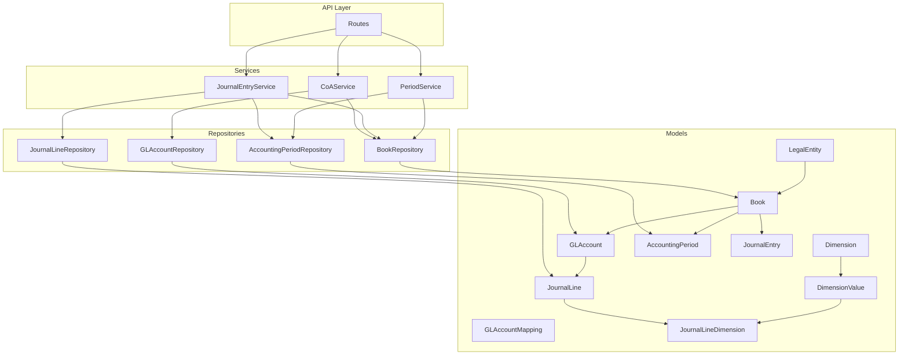
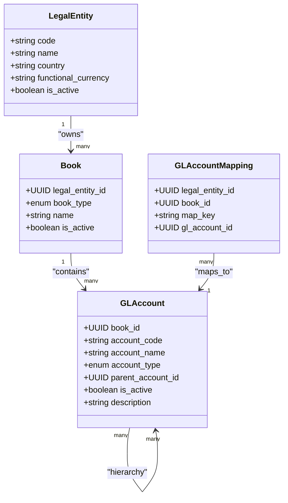
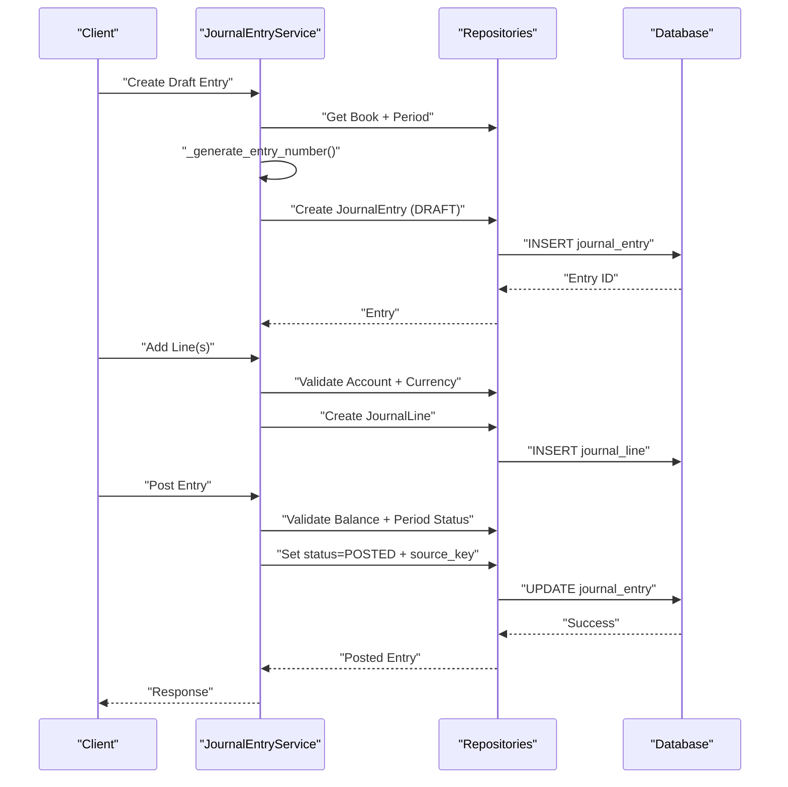
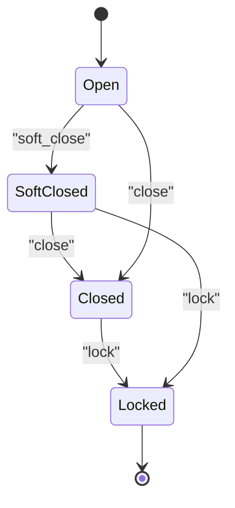
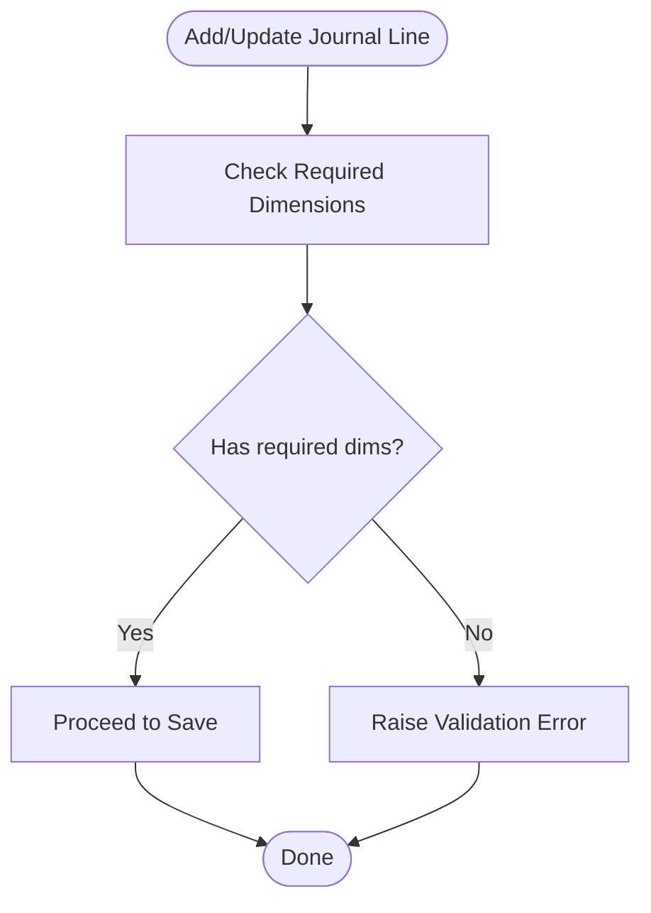
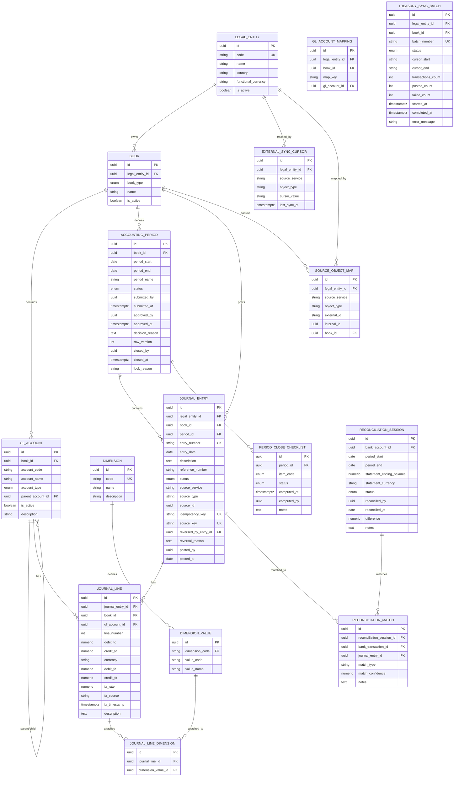

# General Ledger Models

<cite>
**Referenced Files in This Document**
- [base_model.py](file://app/shared/models/base_model.py)
- [gl_account_model.py](file://app/modules/general_ledger/models/gl_account_model.py)
- [coa_schemas.py](file://app/modules/general_ledger/schemas/coa_schemas.py)
- [coa_service.py](file://app/modules/general_ledger/services/coa_service.py)
- [book_model.py](file://app/modules/general_ledger/models/book_model.py)
- [legal_entity_model.py](file://app/modules/general_ledger/models/legal_entity_model.py)
- [dimension_model.py](file://app/modules/general_ledger/models/dimension_model.py)
- [journal_entry_model.py](file://app/modules/general_ledger/models/journal_entry_model.py)
- [journal_entry_schemas.py](file://app/modules/general_ledger/schemas/journal_entry_schemas.py)
- [journal_entry_service.py](file://app/modules/general_ledger/services/journal_entry_service.py)
- [accounting_period_model.py](file://app/modules/general_ledger/models/accounting_period_model.py)
- [period_schemas.py](file://app/modules/general_ledger/schemas/period_schemas.py)
- [period_service.py](file://app/modules/general_ledger/services/period_service.py)
- [period_close_checklist_model.py](file://app/modules/general_ledger/models/period_close_checklist_model.py)
- [external_sync_model.py](file://app/modules/general_ledger/models/external_sync_model.py)
- [reconciliation_model.py](file://app/modules/general_ledger/models/reconciliation_model.py)
- [treasury_sync_batch_model.py](file://app/modules/general_ledger/models/treasury_sync_batch_model.py)
</cite>

## Table of Contents
1. [Introduction](#introduction)
2. [Project Structure](#project-structure)
3. [Core Components](#core-components)
4. [Architecture Overview](#architecture-overview)
5. [Detailed Component Analysis](#detailed-component-analysis)
6. [Dependency Analysis](#dependency-analysis)
7. [Performance Considerations](#performance-considerations)
8. [Troubleshooting Guide](#troubleshooting-guide)
9. [Conclusion](#conclusion)
10. [Appendices](#appendices)

## Introduction
This document provides comprehensive data model documentation for the General Ledger (GL) subsystem. It covers the chart of accounts hierarchy, journal entry processing, and accounting period management. It also documents GL account classifications, dimension usage, and legal entity relationships. The document explains field definitions, data types, validation rules, and business logic for each model, relationships among GL accounts, journal entries, and accounting periods, multi-book support, dimension-based analytics, and legal entity segregation. Examples of COA creation, journal entry posting, and period closing operations are included, along with data integrity constraints, referential relationships, and audit trail requirements.

## Project Structure
The GL module is organized by domain-focused models, schemas, services, repositories, and routes. The shared base model provides common fields for auditing and identity. The GL models define the core entities and relationships, while schemas define validation and serialization. Services encapsulate business logic for creation, posting, and period management.

```mermaid
graph TB
subgraph "Shared"
BM["BaseModel<br/>common fields"]
end
subgraph "General Ledger Models"
LE["LegalEntity"]
BK["Book"]
COA["GLAccount"]
MAP["GLAccountMapping"]
DIM["Dimension"]
DV["DimensionValue"]
PER["AccountingPeriod"]
JEV["JournalEntry"]
JL["JournalLine"]
JLD["JournalLineDimension"]
PCC["PeriodCloseChecklist"]
ESC["ExternalSyncCursor"]
SOM["SourceObjectMap"]
RS["ReconciliationSession"]
RM["ReconciliationMatch"]
TSB["TreasurySyncBatch"]
end
BM --> LE
BM --> BK
BM --> COA
BM --> MAP
BM --> DIM
BM --> DV
BM --> PER
BM --> JEV
BM --> JL
BM --> JLD
BM --> PCC
BM --> ESC
BM --> SOM
BM --> RS
BM --> RM
BM --> TSB
LE < --> BK
BK < --> COA
BK < --> PER
BK < --> JEV
COA < --> JL
JEV < --> JL
JL < --> JLD
DIM --> DV
DV < --> JLD
PER < --> JEV
ESC --> LE
SOM --> LE
RS --> JEV
RM --> JEV
```

**Diagram sources**
- [base_model.py](file://app/shared/models/base_model.py#L9-L18)
- [legal_entity_model.py](file://app/modules/general_ledger/models/legal_entity_model.py#L7-L22)
- [book_model.py](file://app/modules/general_ledger/models/book_model.py#L15-L36)
- [gl_account_model.py](file://app/modules/general_ledger/models/gl_account_model.py#L28-L80)
- [dimension_model.py](file://app/modules/general_ledger/models/dimension_model.py#L8-L40)
- [accounting_period_model.py](file://app/modules/general_ledger/models/accounting_period_model.py#L18-L50)
- [journal_entry_model.py](file://app/modules/general_ledger/models/journal_entry_model.py#L17-L128)
- [period_close_checklist_model.py](file://app/modules/general_ledger/models/period_close_checklist_model.py#L26-L47)
- [external_sync_model.py](file://app/modules/general_ledger/models/external_sync_model.py#L8-L52)
- [reconciliation_model.py](file://app/modules/general_ledger/models/reconciliation_model.py#L18-L68)
- [treasury_sync_batch_model.py](file://app/modules/general_ledger/models/treasury_sync_batch_model.py#L17-L46)

**Section sources**
- [base_model.py](file://app/shared/models/base_model.py#L9-L18)
- [legal_entity_model.py](file://app/modules/general_ledger/models/legal_entity_model.py#L7-L22)
- [book_model.py](file://app/modules/general_ledger/models/book_model.py#L15-L36)
- [gl_account_model.py](file://app/modules/general_ledger/models/gl_account_model.py#L28-L80)
- [dimension_model.py](file://app/modules/general_ledger/models/dimension_model.py#L8-L40)
- [accounting_period_model.py](file://app/modules/general_ledger/models/accounting_period_model.py#L18-L50)
- [journal_entry_model.py](file://app/modules/general_ledger/models/journal_entry_model.py#L17-L128)
- [period_close_checklist_model.py](file://app/modules/general_ledger/models/period_close_checklist_model.py#L26-L47)
- [external_sync_model.py](file://app/modules/general_ledger/models/external_sync_model.py#L8-L52)
- [reconciliation_model.py](file://app/modules/general_ledger/models/reconciliation_model.py#L18-L68)
- [treasury_sync_batch_model.py](file://app/modules/general_ledger/models/treasury_sync_batch_model.py#L17-L46)

## Core Components
This section outlines the primary GL entities and their responsibilities.

- LegalEntity: Represents a legal company with functional currency and country. Acts as the top-level organizational unit for multi-entity segregation.
- Book: An accounting book per legal entity with accrual or cash basis. Links to GL accounts, periods, and journal entries.
- GLAccount: Chart of accounts entry with hierarchical parent-child relationships, classification via AccountType, and per-book mapping for system-generated postings.
- Dimension and DimensionValue: Tag categories and values enabling dimension-based analytics (e.g., COST_CENTER, DEPARTMENT, LOCATION, PROJECT).
- AccountingPeriod: Monthly accounting periods with status lifecycle and approval metadata.
- JournalEntry and JournalLine: Immutable journal entries with lines containing transaction and functional currency amounts, FX details, and dimension associations.
- Supporting Models: PeriodCloseChecklist, ExternalSyncCursor, SourceObjectMap, ReconciliationSession/Match, TreasurySyncBatch.

Key data integrity constraints include unique constraints on book+period_start, entity+book+source_key, and others to prevent duplicates and maintain referential integrity.

**Section sources**
- [legal_entity_model.py](file://app/modules/general_ledger/models/legal_entity_model.py#L7-L22)
- [book_model.py](file://app/modules/general_ledger/models/book_model.py#L15-L36)
- [gl_account_model.py](file://app/modules/general_ledger/models/gl_account_model.py#L28-L80)
- [dimension_model.py](file://app/modules/general_ledger/models/dimension_model.py#L8-L40)
- [accounting_period_model.py](file://app/modules/general_ledger/models/accounting_period_model.py#L18-L50)
- [journal_entry_model.py](file://app/modules/general_ledger/models/journal_entry_model.py#L17-L128)
- [period_close_checklist_model.py](file://app/modules/general_ledger/models/period_close_checklist_model.py#L26-L47)
- [external_sync_model.py](file://app/modules/general_ledger/models/external_sync_model.py#L8-L52)
- [reconciliation_model.py](file://app/modules/general_ledger/models/reconciliation_model.py#L18-L68)
- [treasury_sync_batch_model.py](file://app/modules/general_ledger/models/treasury_sync_batch_model.py#L17-L46)

## Architecture Overview
The GL architecture follows layered design:
- Models define entities and relationships with SQLAlchemy ORM.
- Schemas define Pydantic validation for API requests/responses.
- Services encapsulate business logic (posting, period management, mapping).
- Repositories abstract persistence operations.
- Routes expose endpoints for CRUD and operational tasks.



**Diagram sources**
- [coa_service.py](file://app/modules/general_ledger/services/coa_service.py#L14-L143)
- [journal_entry_service.py](file://app/modules/general_ledger/services/journal_entry_service.py#L40-L635)
- [period_service.py](file://app/modules/general_ledger/services/period_service.py#L18-L166)
- [gl_account_model.py](file://app/modules/general_ledger/models/gl_account_model.py#L28-L80)
- [book_model.py](file://app/modules/general_ledger/models/book_model.py#L15-L36)
- [accounting_period_model.py](file://app/modules/general_ledger/models/accounting_period_model.py#L18-L50)
- [journal_entry_model.py](file://app/modules/general_ledger/models/journal_entry_model.py#L17-L128)
- [dimension_model.py](file://app/modules/general_ledger/models/dimension_model.py#L8-L40)

## Detailed Component Analysis

### Chart of Accounts Hierarchy and Mappings
- GLAccount fields:
  - book_id: Foreign key to Book; enforces per-book hierarchy.
  - account_code: Unique within a book; serves as the primary identifier.
  - account_name, description: Human-readable attributes.
  - account_type: Enumerated classification (Asset, Liability, Equity, Revenue, Expense, plus special types).
  - parent_account_id: Self-referencing parent for hierarchy; child_accounts via backref.
  - is_active: Enables deactivation without deletion.
- GLAccountMapping fields:
  - legal_entity_id + book_id + map_key: Unique composite key ensuring deterministic system-generated postings.
  - gl_account_id: Resolves mapping to a GLAccount within the same book.
- Business logic:
  - Parent-child hierarchy validation ensures parent resides in the same book.
  - Account code uniqueness enforced per book.
  - Mapping updates overwrite existing entries for the same key.



**Diagram sources**
- [legal_entity_model.py](file://app/modules/general_ledger/models/legal_entity_model.py#L7-L22)
- [book_model.py](file://app/modules/general_ledger/models/book_model.py#L15-L36)
- [gl_account_model.py](file://app/modules/general_ledger/models/gl_account_model.py#L28-L80)

**Section sources**
- [gl_account_model.py](file://app/modules/general_ledger/models/gl_account_model.py#L9-L26)
- [gl_account_model.py](file://app/modules/general_ledger/models/gl_account_model.py#L28-L80)
- [coa_schemas.py](file://app/modules/general_ledger/schemas/coa_schemas.py#L8-L62)
- [coa_service.py](file://app/modules/general_ledger/services/coa_service.py#L23-L143)

### Journal Entry Processing
- JournalEntry fields:
  - legal_entity_id + book_id + source_key: Unique constraint prevents duplicate postings across entity and book.
  - entry_number: Generated uniquely per book and entry date.
  - entry_date: Determines the associated AccountingPeriod.
  - status: Lifecycle includes DRAFT, POSTED, REVERSED.
  - Source tracking: source_service, source_type, source_id, idempotency_key, source_key.
  - Reversal tracking: reversed_by_entry_id, reversal_reason.
  - Posted metadata: posted_by, posted_at.
- JournalLine fields:
  - debit_tc, credit_tc, currency: Transaction currency amounts.
  - debit_fc, credit_fc: Functional currency amounts.
  - FX fields: fx_rate, fx_source, fx_timestamp.
  - Dimensions: attached via JournalLineDimension to DimensionValue.
- Validation rules:
  - Lines must balance (sum of debit_fc equals sum of credit_fc).
  - Each line must have exactly one of debit or credit non-zero.
  - Dimensions requirement enforced by service when enabled.
  - Period must not be locked for posting.
- Business logic:
  - Entry number generation uses date and sequence with uniqueness checks.
  - Posting sets immutable state and applies source_key deduplication.
  - Reversal creates mirrored lines with swapped debit/credit and links original entry.



**Diagram sources**
- [journal_entry_service.py](file://app/modules/general_ledger/services/journal_entry_service.py#L53-L342)
- [journal_entry_model.py](file://app/modules/general_ledger/models/journal_entry_model.py#L17-L128)

**Section sources**
- [journal_entry_model.py](file://app/modules/general_ledger/models/journal_entry_model.py#L10-L15)
- [journal_entry_model.py](file://app/modules/general_ledger/models/journal_entry_model.py#L17-L128)
- [journal_entry_schemas.py](file://app/modules/general_ledger/schemas/journal_entry_schemas.py#L9-L136)
- [journal_entry_service.py](file://app/modules/general_ledger/services/journal_entry_service.py#L53-L342)
- [journal_entry_service.py](file://app/modules/general_ledger/services/journal_entry_service.py#L344-L410)
- [journal_entry_service.py](file://app/modules/general_ledger/services/journal_entry_service.py#L410-L635)

### Accounting Period Management
- AccountingPeriod fields:
  - book_id + period_start: Unique composite key.
  - period_name: Human-friendly label (e.g., "YYYY-MM").
  - status: OPEN, SOFT_CLOSED, PENDING_CLOSE_APPROVAL, CLOSED, LOCKED.
  - Approval fields: submitted_by/submitted_at, approved_by/approved_at, decision_reason.
  - row_version: Optimistic concurrency control.
  - Legacy fields: closed_by/closed_at, lock_reason.
- Lifecycle:
  - Generate periods for a book across a date range.
  - Soft close allows elevated-role posting.
  - Close locks further changes; Lock prevents all postings.
- Validation:
  - Prevents closing already closed/locked periods.
  - Lock requires prior closure.



**Diagram sources**
- [accounting_period_model.py](file://app/modules/general_ledger/models/accounting_period_model.py#L9-L16)
- [period_service.py](file://app/modules/general_ledger/services/period_service.py#L89-L166)

**Section sources**
- [accounting_period_model.py](file://app/modules/general_ledger/models/accounting_period_model.py#L18-L50)
- [period_schemas.py](file://app/modules/general_ledger/schemas/period_schemas.py#L8-L93)
- [period_service.py](file://app/modules/general_ledger/services/period_service.py#L26-L166)

### Multi-Book Support and Legal Entity Segregation
- LegalEntity:
  - Unique code and name; country and functional currency define entity context.
- Book:
  - Per legal entity with book_type (ACCRUAL or CASH).
  - Cascading deletes for accounts, periods, and journal entries.
- Segregation:
  - All GL entities are bound to a Book; queries filter by legal_entity_id via Book.
  - JournalEntry enforces entity+book+source_key uniqueness for idempotency and segregation.

**Section sources**
- [legal_entity_model.py](file://app/modules/general_ledger/models/legal_entity_model.py#L7-L22)
- [book_model.py](file://app/modules/general_ledger/models/book_model.py#L15-L36)
- [journal_entry_model.py](file://app/modules/general_ledger/models/journal_entry_model.py#L17-L58)

### Dimension-Based Analytics
- Dimension and DimensionValue:
  - Dimensions define tag categories (e.g., COST_CENTER).
  - DimensionValue defines allowed values for each dimension.
- JournalLineDimension:
  - Associates JournalLine with DimensionValue entries.
- Business logic:
  - Service validates required dimensions (e.g., COST_CENTER, DEPARTMENT, LOCATION) when posting.
  - Bulk upsert supports dimension values by code mapping.



**Diagram sources**
- [journal_entry_service.py](file://app/modules/general_ledger/services/journal_entry_service.py#L344-L382)
- [journal_entry_model.py](file://app/modules/general_ledger/models/journal_entry_model.py#L110-L128)
- [dimension_model.py](file://app/modules/general_ledger/models/dimension_model.py#L8-L40)

**Section sources**
- [dimension_model.py](file://app/modules/general_ledger/models/dimension_model.py#L8-L40)
- [journal_entry_model.py](file://app/modules/general_ledger/models/journal_entry_model.py#L110-L128)
- [journal_entry_service.py](file://app/modules/general_ledger/services/journal_entry_service.py#L344-L382)

### Period Close Checklist
- PeriodCloseChecklist:
  - Item codes enumerate close tasks (e.g., BANK_REC_DONE, REVREC_DONE).
  - Status tracks PENDING, COMPLETE, SKIPPED.
  - Computed metadata and notes for auditability.
- Integration:
  - Linked to AccountingPeriod via period_id.

**Section sources**
- [period_close_checklist_model.py](file://app/modules/general_ledger/models/period_close_checklist_model.py#L26-L47)

### External Sync and Treasury Integration
- ExternalSyncCursor:
  - Tracks replay-safe cursors per legal entity and source/object type.
- SourceObjectMap:
  - Maps external IDs to internal IDs for deduplication and traceability.
- TreasurySyncBatch:
  - Tracks idempotent sync/post operations with status and counts.

**Section sources**
- [external_sync_model.py](file://app/modules/general_ledger/models/external_sync_model.py#L8-L52)
- [treasury_sync_batch_model.py](file://app/modules/general_ledger/models/treasury_sync_batch_model.py#L17-L46)

### Reconciliation Integration
- ReconciliationSession:
  - Bank reconciliation session with status and calculated difference.
- ReconciliationMatch:
  - Links bank transactions to journal entries with match type/confidence.

**Section sources**
- [reconciliation_model.py](file://app/modules/general_ledger/models/reconciliation_model.py#L18-L68)

## Dependency Analysis
This section maps dependencies among GL models and highlights referential integrity and constraints.



**Diagram sources**
- [legal_entity_model.py](file://app/modules/general_ledger/models/legal_entity_model.py#L7-L22)
- [book_model.py](file://app/modules/general_ledger/models/book_model.py#L15-L36)
- [gl_account_model.py](file://app/modules/general_ledger/models/gl_account_model.py#L28-L80)
- [dimension_model.py](file://app/modules/general_ledger/models/dimension_model.py#L8-L40)
- [accounting_period_model.py](file://app/modules/general_ledger/models/accounting_period_model.py#L18-L50)
- [journal_entry_model.py](file://app/modules/general_ledger/models/journal_entry_model.py#L17-L128)
- [period_close_checklist_model.py](file://app/modules/general_ledger/models/period_close_checklist_model.py#L26-L47)
- [external_sync_model.py](file://app/modules/general_ledger/models/external_sync_model.py#L8-L52)
- [reconciliation_model.py](file://app/modules/general_ledger/models/reconciliation_model.py#L18-L68)
- [treasury_sync_batch_model.py](file://app/modules/general_ledger/models/treasury_sync_batch_model.py#L17-L46)

**Section sources**
- [base_model.py](file://app/shared/models/base_model.py#L9-L18)
- [legal_entity_model.py](file://app/modules/general_ledger/models/legal_entity_model.py#L7-L22)
- [book_model.py](file://app/modules/general_ledger/models/book_model.py#L15-L36)
- [gl_account_model.py](file://app/modules/general_ledger/models/gl_account_model.py#L28-L80)
- [dimension_model.py](file://app/modules/general_ledger/models/dimension_model.py#L8-L40)
- [accounting_period_model.py](file://app/modules/general_ledger/models/accounting_period_model.py#L18-L50)
- [journal_entry_model.py](file://app/modules/general_ledger/models/journal_entry_model.py#L17-L128)
- [period_close_checklist_model.py](file://app/modules/general_ledger/models/period_close_checklist_model.py#L26-L47)
- [external_sync_model.py](file://app/modules/general_ledger/models/external_sync_model.py#L8-L52)
- [reconciliation_model.py](file://app/modules/general_ledger/models/reconciliation_model.py#L18-L68)
- [treasury_sync_batch_model.py](file://app/modules/general_ledger/models/treasury_sync_batch_model.py#L17-L46)

## Performance Considerations
- Indexes:
  - Foreign keys and frequently queried fields (e.g., book_id, period_start, entry_date, source_key) are indexed to optimize joins and lookups.
- Constraints:
  - Unique constraints prevent duplicate entries and enforce data integrity at the database level.
- Cascading:
  - Cascade delete on Book ensures cleanup of dependent entities (accounts, periods, journal entries).
- Decimal precision:
  - Numeric fields use fixed precision to avoid floating-point rounding issues in financial calculations.
- Idempotency:
  - Idempotency_key and source_key prevent duplicate postings and enable safe retries.

[No sources needed since this section provides general guidance]

## Troubleshooting Guide
Common issues and resolutions:
- Duplicate posting prevention:
  - JournalEntry source_key uniqueness prevents double posting even without idempotency headers.
- Period locked errors:
  - Posting fails if the associated period is LOCKED; use soft close or unlock appropriately.
- Dimension validation failures:
  - Missing required dimensions (COST_CENTER, DEPARTMENT, LOCATION) cause validation errors during posting.
- Account code conflicts:
  - Creating an account with an existing code in the same book raises a validation error.
- Parent account mismatch:
  - Parent account must reside in the same book as the child.

**Section sources**
- [journal_entry_model.py](file://app/modules/general_ledger/models/journal_entry_model.py#L51-L54)
- [journal_entry_service.py](file://app/modules/general_ledger/services/journal_entry_service.py#L186-L231)
- [journal_entry_service.py](file://app/modules/general_ledger/services/journal_entry_service.py#L344-L382)
- [coa_service.py](file://app/modules/general_ledger/services/coa_service.py#L38-L50)
- [coa_service.py](file://app/modules/general_ledger/services/coa_service.py#L109-L115)

## Conclusion
The General Ledger models provide a robust foundation for multi-entity, multi-book accounting with strong integrity constraints, dimension-based analytics, and clear lifecycle management for journal entries and accounting periods. The separation of concerns across models, schemas, and services enables maintainability and extensibility while enforcing business rules at both the application and database levels.

[No sources needed since this section summarizes without analyzing specific files]

## Appendices

### Field Definitions and Validation Rules Summary
- LegalEntity:
  - code: unique, not null; string(50)
  - name: not null; string(255)
  - country: not null; string(10)
  - functional_currency: not null; string(3)
  - is_active: default true; boolean
- Book:
  - legal_entity_id: not null; FK to LegalEntity
  - book_type: not null; enum ACCRUAL or CASH
  - name: not null; string(255)
  - is_active: default true; boolean
- GLAccount:
  - book_id: not null; FK to Book
  - account_code: unique per book; string(50)
  - account_name: not null; string(255)
  - account_type: not null; enum
  - parent_account_id: nullable; self-FK
  - is_active: default true; boolean
  - description: nullable; string(500)
- GLAccountMapping:
  - legal_entity_id: not null; FK to LegalEntity
  - book_id: not null; FK to Book
  - map_key: not null; string(100)
  - gl_account_id: not null; FK to GLAccount
- Dimension:
  - code: unique, not null; string(50)
  - name: not null; string(255)
  - description: nullable; string(500)
- DimensionValue:
  - dimension_code: not null; FK to Dimension.code
  - value_code: not null; string(50)
  - value_name: not null; string(255)
- AccountingPeriod:
  - book_id: not null; FK to Book
  - period_start: not null; date
  - period_end: not null; date
  - period_name: not null; string(50)
  - status: not null; enum OPEN/SOFT_CLOSED/PENDING_CLOSE_APPROVAL/CLOSED/LOCKED
  - submitted_by/submitted_at/approved_by/approved_at/decision_reason: nullable
  - row_version: not null; integer (optimistic concurrency)
  - closed_by/closed_at/lock_reason: legacy fields
- JournalEntry:
  - legal_entity_id: not null; FK to LegalEntity
  - book_id: not null; FK to Book
  - period_id: not null; FK to AccountingPeriod
  - entry_number: unique; string(100)
  - entry_date: not null; date
  - description/reference_number/status: nullable/enum
  - source_service/source_type/source_id/idempotency_key/source_key: nullable/unique
  - reversed_by_entry_id/reversal_reason: nullable
  - posted_by/posted_at: nullable
- JournalLine:
  - journal_entry_id: not null; FK to JournalEntry
  - book_id: not null; FK to Book
  - gl_account_id: not null; FK to GLAccount
  - line_number: not null; integer
  - debit_tc/credit_tc: non-negative; numeric(15,2)
  - currency: not null; string(3)
  - debit_fc/credit_fc: numeric(15,2)
  - fx_rate/fx_source/fx_timestamp: nullable
  - description: nullable
- JournalLineDimension:
  - journal_line_id: not null; FK to JournalLine
  - dimension_value_id: not null; FK to DimensionValue
- PeriodCloseChecklist:
  - period_id: not null; FK to AccountingPeriod
  - item_code: not null; enum checklist items
  - status: not null; enum PENDING/COMPLETE/SKIPPED
  - computed_at/computed_by/notes: nullable
- ExternalSyncCursor:
  - legal_entity_id: not null; FK to LegalEntity
  - source_service: not null; string(50)
  - object_type: not null; string(50)
  - cursor_value: not null; string(255)
  - last_sync_at: nullable
- SourceObjectMap:
  - legal_entity_id: not null; FK to LegalEntity
  - source_service: not null; string(50)
  - object_type: not null; string(50)
  - external_id: not null; string(255)
  - internal_id: not null; UUID
  - book_id: nullable; FK to Book
- ReconciliationSession:
  - bank_account_id: not null; FK to Treasury Bank Account
  - period_start/period_end: not null; date
  - statement_ending_balance: not null; numeric(15,2)
  - statement_currency: not null; string(3)
  - status: not null; enum DRAFT/IN_PROGRESS/COMPLETED/CLOSED
  - reconciled_by/reconciled_at/difference/notes: nullable
- ReconciliationMatch:
  - reconciliation_session_id: not null; FK to ReconciliationSession
  - bank_transaction_id: nullable; FK to BankTransaction
  - journal_entry_id: nullable; FK to JournalEntry
  - match_type: not null; string(50)
  - match_confidence: nullable; numeric(5,2)
  - notes: nullable
- TreasurySyncBatch:
  - legal_entity_id: not null; FK to LegalEntity
  - book_id: not null; FK to Book
  - batch_number: unique; string(100)
  - status: not null; enum PENDING/PROCESSING/COMPLETED/FAILED
  - cursor_start/cursor_end: nullable; string(255)
  - transactions_count/posted_count/failed_count: not null; integers
  - started_at/completed_at/error_message: nullable

Validation rules:
- JournalLine: debit_tc and credit_tc must be non-negative; exactly one must be greater than zero.
- JournalEntry: must balance (sum debit_fc equals sum credit_fc); uniqueness of entry_number and source_key.
- Period: cannot close already closed/locked periods; lock requires prior closure.
- Dimensions: required dimensions validated during posting when enabled.

**Section sources**
- [legal_entity_model.py](file://app/modules/general_ledger/models/legal_entity_model.py#L7-L22)
- [book_model.py](file://app/modules/general_ledger/models/book_model.py#L15-L36)
- [gl_account_model.py](file://app/modules/general_ledger/models/gl_account_model.py#L28-L80)
- [dimension_model.py](file://app/modules/general_ledger/models/dimension_model.py#L8-L40)
- [accounting_period_model.py](file://app/modules/general_ledger/models/accounting_period_model.py#L18-L50)
- [journal_entry_model.py](file://app/modules/general_ledger/models/journal_entry_model.py#L17-L128)
- [journal_entry_schemas.py](file://app/modules/general_ledger/schemas/journal_entry_schemas.py#L9-L136)
- [period_schemas.py](file://app/modules/general_ledger/schemas/period_schemas.py#L8-L93)
- [journal_entry_service.py](file://app/modules/general_ledger/services/journal_entry_service.py#L194-L211)
- [period_service.py](file://app/modules/general_ledger/services/period_service.py#L89-L142)